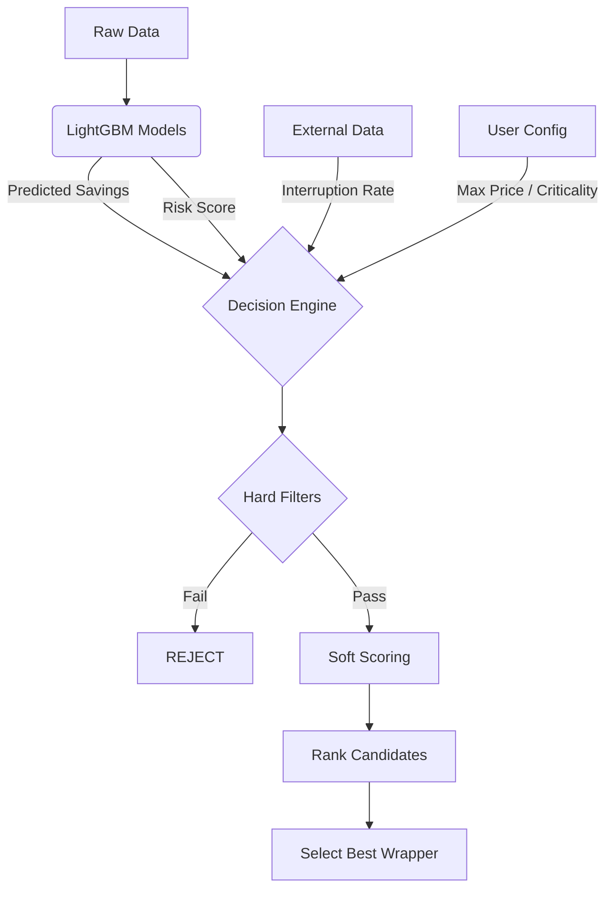

# Decision Engine Walkthrough

> **The "Brain" above the Models**

## 1. Concept

The **Decision Engine** is the final logic layer that determines whether to launch a Spot Instance. 
Raw model predictions (e.g., "60% savings") are not enough. You need to combine them with safety constraints, business rules, and external data to make a **safe** decision.

### Why do we need it?
The **LightGBM Model** only answers **probability**:
- "There is an 80% chance this instance is stable."
- "There is 65% predicted savings."

The **Decision Engine** answers **action**:
- "Should I launch it?"

---

## 2. Workflow



---

## 3. The Logic (Inputs & Rules)

### A. Inputs

| Input | Source | Example | Description |
| :--- | :--- | :--- | :--- |
| **Risk Score** | Classifier | `0.85` | Probability of instability (0.0-1.0). Higher is worse. |
| **Predicted Savings** | Regressor | `0.60` | Estimated discount vs On-Demand. |
| **Interruption Rate** | AWS History | `0.05` | Historical frequency of terminations (last 30 days). |
| **Max Price** | User Config | `$0.10` | Maximum absolute price you are willing to pay. |

### B. Hard Filters (The "Safety Net")

Before ranking, we strictly reject any candidate that violates safety rules.

1.  **Risk Scorce Check**: 
    - `IF Risk_Score > 0.70 THEN REJECT`
    - *Why?* Don't trust the model if it's uncertain.
2.  **Interruption Rate Check**:
    - `IF Interruption_Rate > 15% THEN REJECT`
    - *Why?* Even if the model says "Safe" *now*, a historically bad pool is a bad bet.
3.  **Price Check**:
    - `IF Predicted_Price > Max_Price THEN REJECT`

### C. Soft Scoring (The "Sweet Spot")

If multiple candidates pass the hard filters, which one is best?
We calculate a **Final Score** to rank them.

$$
\text{Score} = \text{Savings} \times (1 - \text{Risk})
$$

**Example Scenario:**

| Candidate | Savings | Risk Score | Final Score | Logic |
| :--- | :--- | :--- | :--- | :--- |
| **A (Greedy)** | 90% (`0.9`) | High (`0.6`) | `0.36` | Great savings, but too risky. |
| **B (Conservative)**| 20% (`0.2`) | Low (`0.0`) | `0.20` | Very safe, but poor value. |
| **C (Balanced)** | 60% (`0.6`) | Low (`0.1`) | **`0.54`** | **WINNER:** Good savings + High safety. |

---

## 4. Working with Code

A working prototype is available in [decision_engine/engine.py](engine.py).

### Usage Example

```python
from decision_engine.engine import DecisionEngine, UserConstraints, SpotCandidate

# 1. Define your rules
constraints = UserConstraints(
    max_price=0.50,
    max_risk_score=0.7,
    criticality='high'  # Enforces stricter interruption checks
)
engine = DecisionEngine(constraints)

# 2. Get a candidate (from Model + AWS Data)
candidate = SpotCandidate(
    instance_type="c6i.large",
    availability_zone="us-east-1a",
    predicted_savings=0.60,  # Model says 60% off
    risk_score=0.10,         # Model says Safe
    interruption_rate=0.03,  # History says 3% fail rate
    on_demand_price=0.10
)

# 3. Evaluate
result = engine.evaluate(candidate)
print(result)
# Output: {'decision': 'ACCEPT', 'score': 0.54, ...}
```

### Extending the Engine

To add new rules (e.g., "Avoid specific AZs"), simply add a new check in the `evaluate` method in `engine.py`.

```python
# Example: Adding AZ Blacklist
if candidate.availability_zone in self.blacklist_azs:
    return {'decision': 'REJECT', 'reason': 'AZ Blacklisted'}
```
