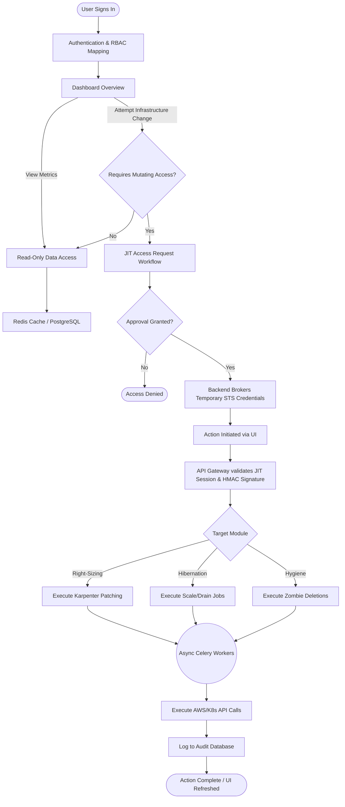
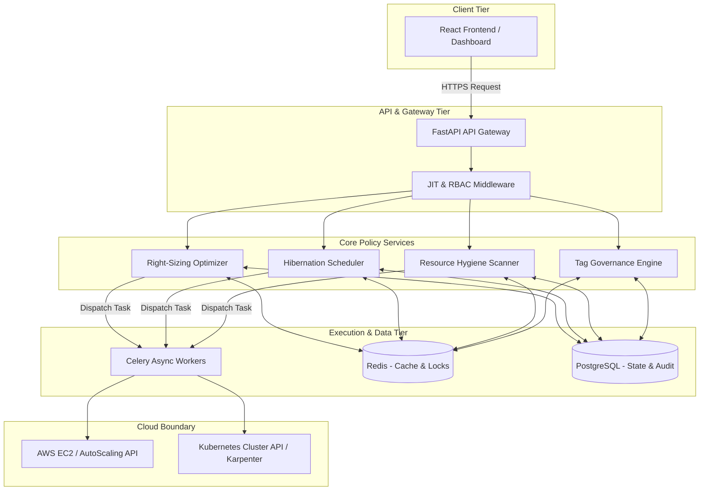
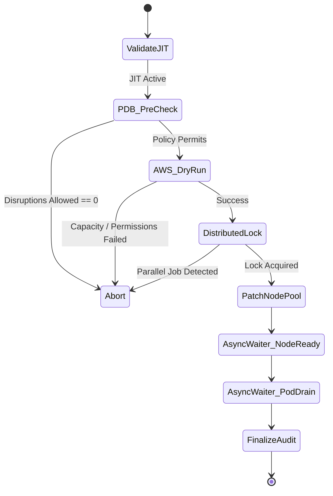
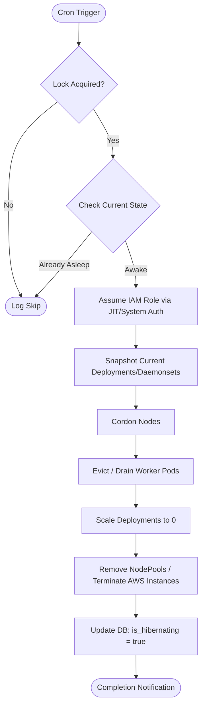
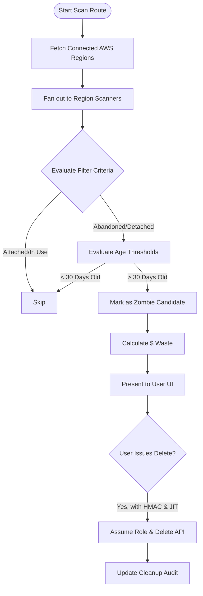
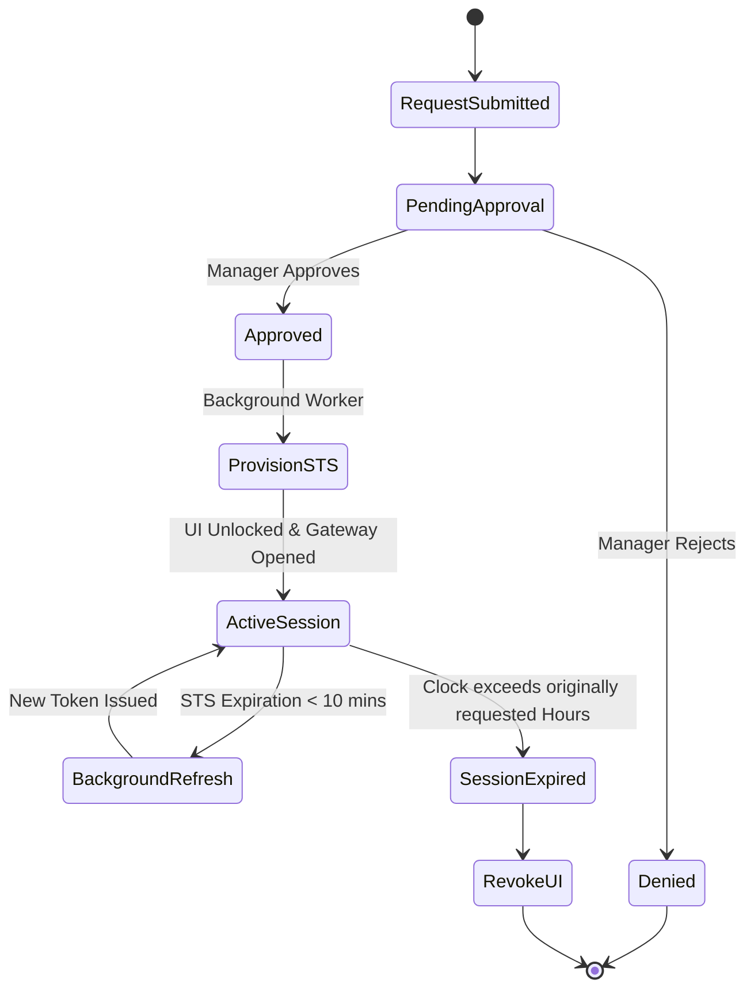

# Application Progress and System Architecture

**Last Updated:** February 2026  
**Focus:** Core Infrastructure, Security, Execution Layers, and End-to-End User Workflows (Excluding ML-based subsystems).

---

## 1. Executive Progress Summary

The application has successfully progressed from a prototype state into a robust, data-driven infrastructure management platform. The primary focus of recent development has been the complete elimination of mock data, establishing strict enterprise security boundaries, and migrating towards scalable, asynchronous execution models.

**Key Milestones Achieved:**
* **100% Real Data Integration:** Eliminated all hardcoded fallbacks across pricing, infrastructure states, and historical savings calculations.
* **Execution Safety Mechanisms:** Transitioned from direct AWS EC2 manipulation to native Kubernetes `NodePool` patching via Karpenter, ensuring the cluster orchestrator remains the source of truth.
* **Database & Concurrency Scaling:** Integrated distributed Redis locking to prevent parallel execution race conditions, and formulated migration pathways for TimescaleDB to handle massive metric ingestion.
* **Identity & Security Guardrails:** Transitioning to Just-In-Time (JIT) temporary AWS STS credentials and OIDC federation for the Kubernetes agent, eliminating static API key vulnerabilities.

---

## 2. End-to-End User Flow (Client Login to Execution)

This flow illustrates the user journey from initial authentication through executing structural infrastructure changes.

1. **Authentication:** The user logs in and is mapped to their Organizational RBAC roles.
2. **Dashboard & Insights:** The user views the current fleet status, cost intelligence, and infrastructure layouts. All reads are heavily cached via Redis hierarchical versioning.
3. **Privilege Elevation (JIT):** To optimize a cluster, hibernate an environment, or delete zombie resources, the user requests Just-In-Time access. The backend brokers real, time-limited AWS STS credentials for the operation.
4. **Execution Initiation:** The user applies a recommendation. The request is cryptographically signed (HMAC) and checked for Idempotency to prevent double-clicks.
5. **Asynchronous Execution:** The workload is handed off to Celery workers, utilizing state-machine waiters to safely poll Kubernetes and AWS without blocking critical threads.

---

## 3. High-Level System Architecture

The overarching system leverages a three-tier design, relying entirely on background workers to interact with external cloud boundaries safely.

---

## 4. Module Logic & Decision Trees

### A. Right-Sizing & Karpenter Integration
**Progress:** Integrated Karpenter Insights (Dry-Run visibility) and Auto-Optimize capabilities. Pricing is now dynamically aggregated regionally via background workers holding a strict "Freshness Contract" to ensure no staleness.

**Decision Logic (Applying a Recommendation):**

### B. Hibernation System
**Progress:** Complete database schema support (`is_hibernating`, `hibernation_state`) backed by distributed locks. Removed legacy schedulers and fully integrated real-time cluster scale-down instructions.

**Decision Logic (Cron Execution):**

### C. Resource Hygiene (Zombie Cleanup)
**Progress:** Engine successfully orchestrates 9 distinct AWS resource types (Unattached EBS, Idle Elastic IPs, Obsolete AMIs, etc.). Complete UI parity with multi-region scanning enabled.

**Decision Logic (Scanning & Remediation):**

### D. Identity, Security, & Just-In-Time (JIT) Access
**Progress:** Actively transitioning from an approval-centric UI gate into a strict cryptographic boundary utilizing AWS STS `assume_role` capabilities and OIDC Federation.

**Decision Logic (JIT Lifecycle):**

---

## Conclusion
The architecture has matured to prioritize asynchronous resilience, mathematical accuracy in provisioning, and definitive security domains. Operations are decoupled from immediate HTTP requests, leveraging execution state machines and durable data stores to guarantee consistency, cluster safety, and zero-downtime structural modifications.
