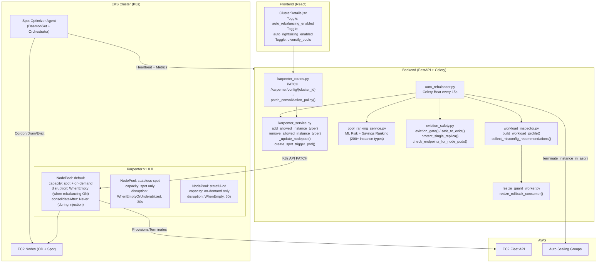
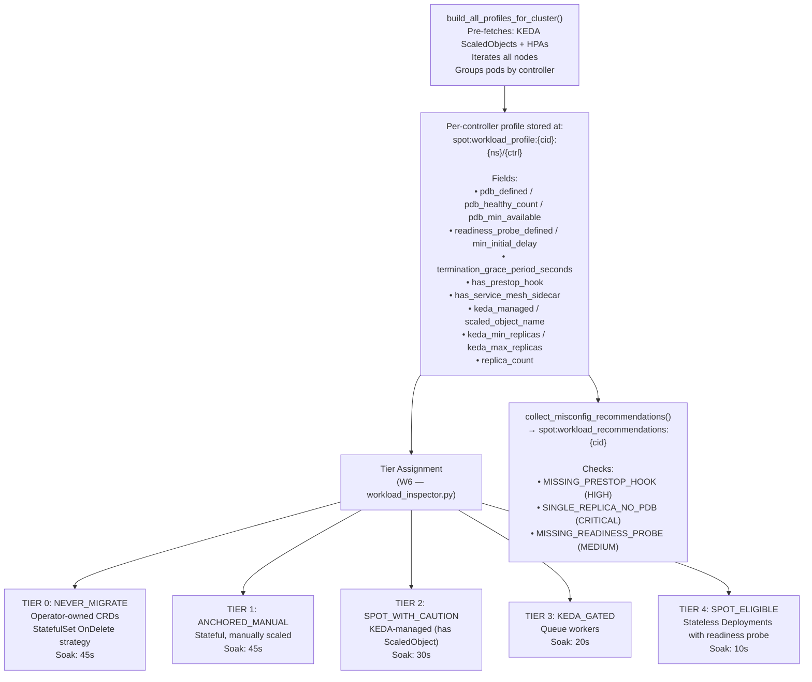
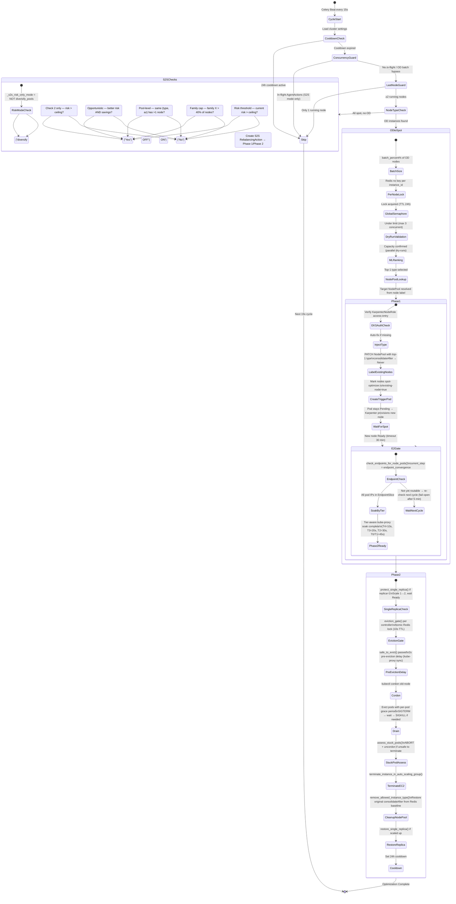
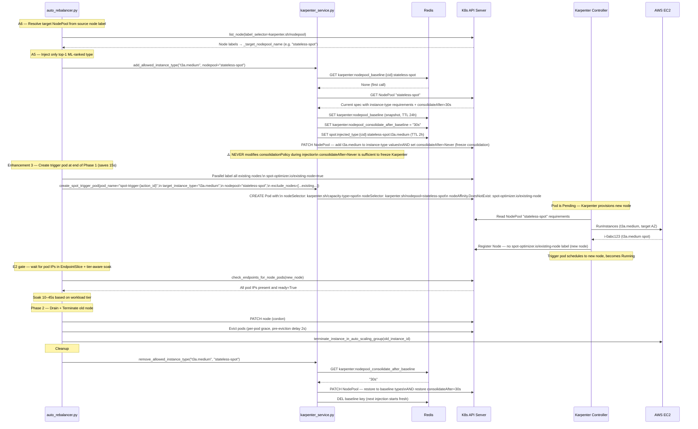
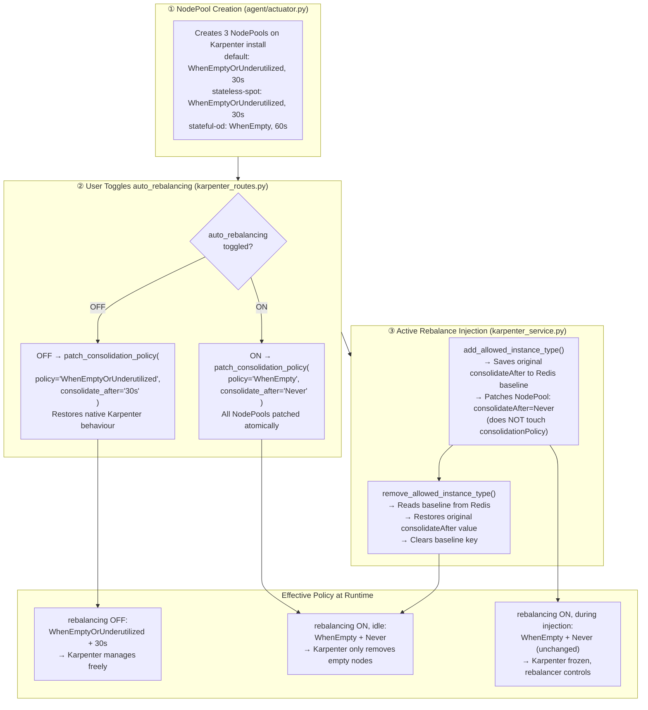
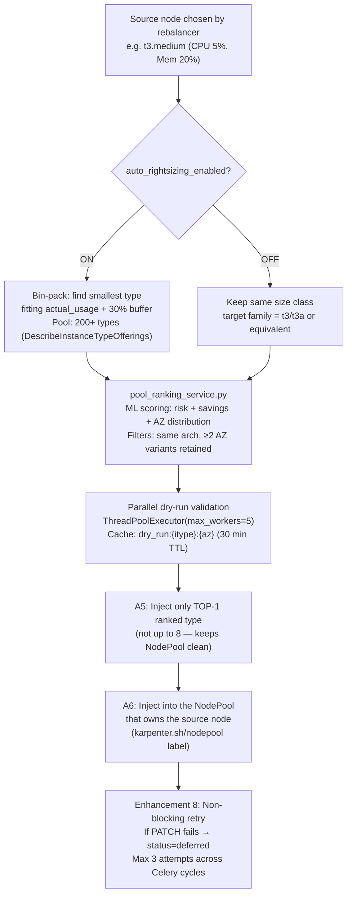
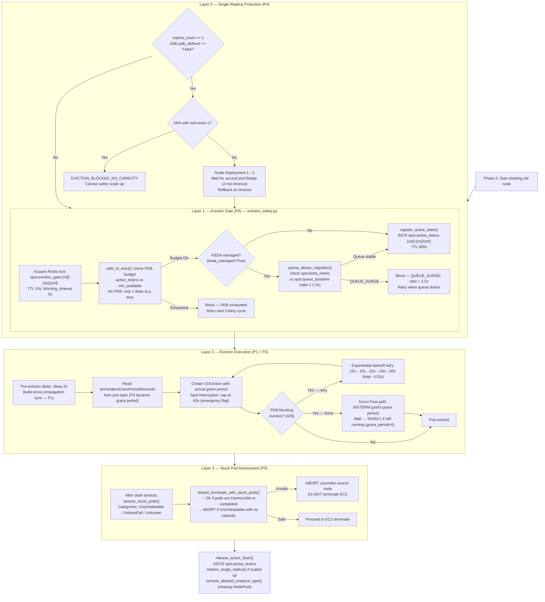
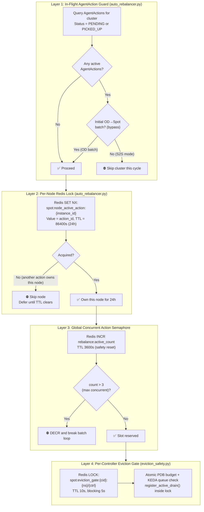
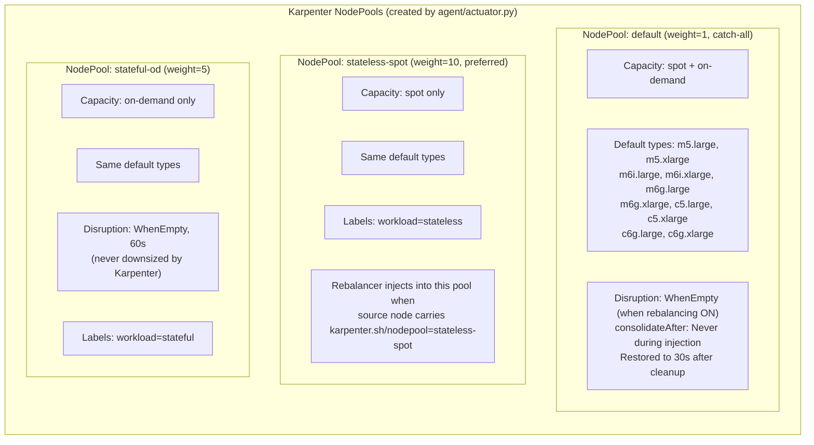
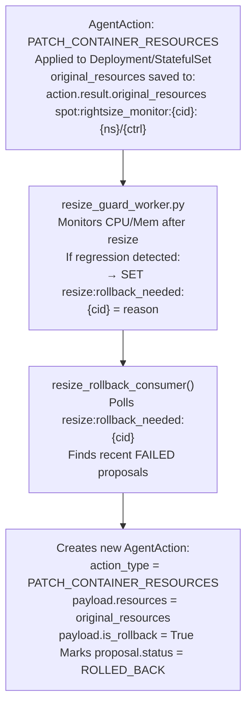

# Karpenter ↔ Spot Optimizer Architecture

> Generated: 9 April 2026  
> Last verified against codebase: 16 April 2026  
>
> This document describes the **current, implemented** architecture. Every section is verified against actual source code. For a change log, see `docs/BUGS_AND_FIXES.md`.

---

## 1. System Overview

The platform has four independent layers that work together:

- **Frontend** — user-facing toggles that drive consolidation and rebalancing policy
- **Backend** — FastAPI routes + Celery workers that decide *when* and *what* to migrate
- **Karpenter** — provisions and terminates EC2 nodes on demand via NodePool specs
- **Agent** — DaemonSet that executes node-level cordon / drain / eviction inside the cluster

---

## 2. Workload Classification & Tiers

Every workload is profiled once per scan cycle by `build_workload_profile()` and stored in Redis. The tier drives kube-proxy soak time during endpoint convergence and determines eviction strategy.

---

## 3. Auto-Rebalancer State Machine

The Celery Beat task (`auto_rebalancer.py`) runs every 15 seconds per cluster. Two separate paths handle OD→Spot and Spot→Spot rebalancing.

---

## 4. Karpenter NodePool Injection — Detailed Flow

The inject/cleanup cycle is designed to be idempotent and non-destructive to the NodePool's existing configuration.

---

## 5. Consolidation Policy — Full Lifecycle

Karpenter's `consolidationPolicy` and `consolidateAfter` are managed at three independent points. All three must be consistent for correct behaviour.

**`_update_nodepool()` design rule (verified in code):**  
The disruption block is **only included** in the PATCH body when the caller explicitly passes `consolidation_policy` or `consolidate_after`. Type-only updates (injections) never touch `spec.disruption`, so the policy set in step ② is always preserved.

---

## 6. Instance Type Selection Pipeline

---

## 7. Eviction Safety Pipeline

All evictions run through a multi-layer safety pipeline before a pod is touched. Each check is independent; any failure blocks eviction without affecting other controllers.

---

## 8. Concurrency Controls

Three independent layers prevent concurrent operations from conflicting. They operate at different scopes.

---

## 9. Three NodePools — Design & Ownership

---

## 10. Rightsizing Rollback Pipeline

---

## 11. UI Rebalancing Timeline (8 Steps)

The frontend (`RebalancingTimeline.jsx`) maps to these backend `current_step` values:

| Step | UI Label | Backend `current_step` | Notes |
|------|----------|------------------------|-------|
| 1 | NodePool Updated | `nodepool_updated` | Karpenter NodePool patched with top-1 ML type; consolidateAfter frozen |
| 2 | New Node Joined | `waiting_for_spot` → `spot_node_ready` | Trigger pod caused Karpenter to provision replacement |
| 3 | Endpoints Verified | `endpoint_convergence` | E2 gate: all pod IPs routable in EndpointSlice + tier soak |
| 4 | Node Cordoned | `cordon` | Source node marked unschedulable |
| 5 | Pods Drained | `drain` | Graceful eviction: per-pod grace period, 2s pre-delay, PDB backoff |
| 6 | Pods Rescheduled | `verifying_pod_readiness` | P5 stuck pod assessment; ABORT+uncordon if unsafe |
| 7 | Old Node Terminated | `terminate` | EC2 terminate only if P5 passes |
| 8 | Complete | `complete` | NodePool cleanup, consolidateAfter restored, cooldown set, replica restored |

> Step 3 (Endpoints Verified) is **implemented in backend** but shown as "Coming soon" in the UI (dashed dot) pending production validation.

**Execution order:** NodePool Updated → New Node Joined → **Endpoints Verified (pre-cordon E2 gate)** → Node Cordoned → Pods Drained → Pods Rescheduled → Old Node Terminated → Complete.

---

## 12. Complete Redis Key Reference

| Key Pattern | Set by | TTL | Purpose |
|-------------|--------|-----|---------|
| `karpenter:nodepool_baseline:{cid}:{np}` | `add_allowed_instance_type()` | 24h | Baseline instance-type list before injection (restore point) |
| `karpenter:nodepool_consolidate_after_baseline:{cid}:{np}` | `add_allowed_instance_type()` | — | Original consolidateAfter value, restored on cleanup |
| `spot:injected_type:{cid}:{np}:{itype}` | `add_allowed_instance_type()` | 2h | Per-injection presence key |
| `karpenter_config:{cluster_id}` | `karpenter_routes.py` | 24h | Full Karpenter config dict (diversify, policy, etc.) |
| `spot:karpenter:installed:{cluster_id}` | Agent heartbeat | — | Live-detection key (Karpenter installed flag) |
| `spot:karpenter_auth_verified:{cluster_id}` | Phase 1 pre-flight | — | EKS access entry verified cache |
| `spot:node_active_action:{instance_id}` | Phase 1 lock acquisition | 86400s | Per-node lock (one-at-a-time rebalance) |
| `rebalance:active_count` | Global semaphore | 3600s | Count of concurrent in-flight actions (max 3) |
| `dry_run:{itype}:{az}` | DryRun validator | 30 min | Cached parallel capacity check results |
| `spot:workload_profile:{cid}:{ns}/{ctrl}` | `workload_inspector.py` | scan TTL | Full workload profile (PDB, grace, tier, KEDA fields) |
| `spot:workload_tier:{cid}:{ns}/{ctrl}` | `workload_inspector.py` | scan TTL | Lightweight tier summary |
| `spot:workload_recommendations:{cid}` | `workload_inspector.py` | scan TTL | Cluster-wide misconfig recommendations |
| `spot:eviction_gate:{cid}:{ns}/{ctrl}` | `eviction_gate()` | 10s | Per-controller Redis lock (atomic pre-flight) |
| `spot:active_drains:{cid}:{ns}/{ctrl}` | `register_active_drain()` | 600s | Counter of in-flight drains per controller |
| `spot:keda_metric:{ns}/{ctrl}` | KEDA scraper | — | Current queue depth |
| `spot:queue_baseline:{ns}/{ctrl}` | KEDA baseline task | 3600s | Stable baseline for surge detection (ratio ≤ 1.5x) |
| `spot:migration_ready:{cid}:{ns}/{ctrl}` | `queue_allows_migration()` | 300s | KEDA zero-scale migration window flag |
| `spot:rightsize_monitor:{cid}:{ns}/{ctrl}` | Agent resize action | — | original_resources backup for rollback |
| `resize:rollback_needed:{cluster_id}` | `resize_guard_worker` | — | Trigger key for rollback consumer |

---

## 13. Open Issues

| # | Description | File | Severity |
|---|-------------|------|----------|
| 5 | `add_allowed_instance_type()` uses baseline-snapshot approach but if cleanup crashes mid-flight, the baseline key survives with stale types. Next injection appends to stale baseline → NodePool type list grows unbounded over time. Mitigation: 24h TTL on baseline key forces reset. **Fix needed:** periodic NodePool audit task to compare actual vs baseline. | `karpenter_service.py` | MEDIUM |
| 6 | Karpenter v1.0+ can autonomously expand instance families beyond the explicit NodePool list under certain EC2 capacity conditions. Even with `WhenEmpty`, if a node becomes empty via natural workload scale-down (not our drain), Karpenter may replace with a cheaper type it selects independently. **Fix needed:** explicit `instance-type` requirement with `operator: In` listing only approved types. | `actuator.py` (NodePool creation) | MEDIUM |
