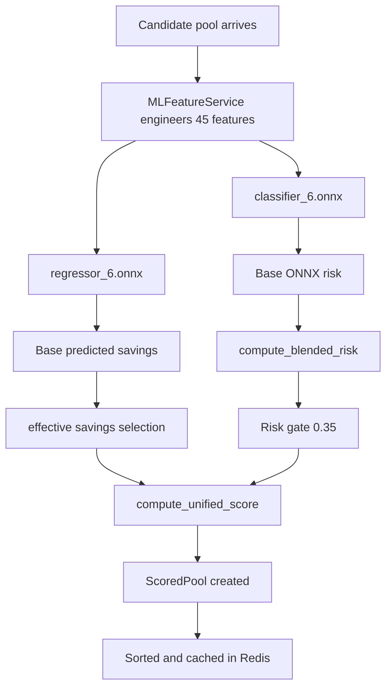
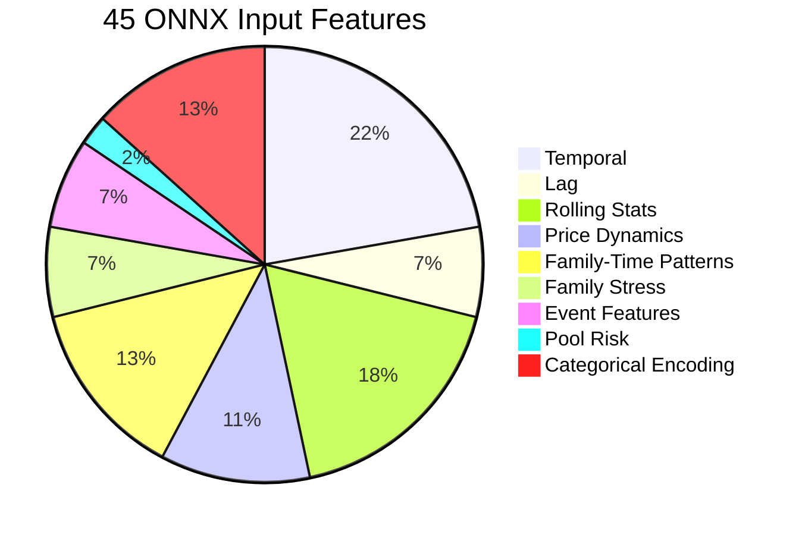
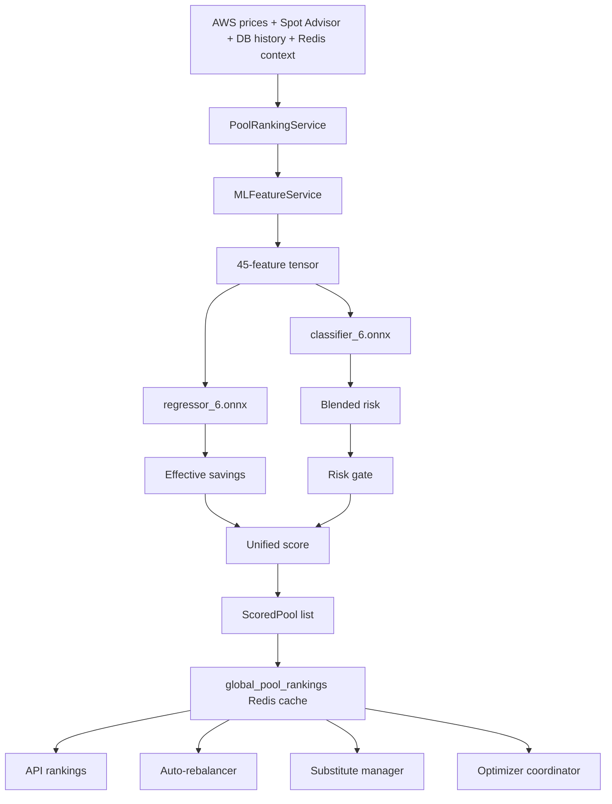

# ONNX Model Architecture — Complete Reference

> Generated: 10 April 2026  
> Covers: What the ONNX models are, where they are loaded, who calls them, what they predict, what data they require, how outputs are post-processed, and how fallback mode works

---

## 1. Executive Summary

This codebase uses two ONNX models inside the pool ranking pipeline:

1. `classifier_6.onnx`
2. `regressor_6.onnx`

They are loaded by `PoolRankingService` and used during Step 7 of the global pool ranking pipeline.

The two models do not directly return the final value shown to users. Instead:

1. The classifier returns a base risk probability.
2. The regressor returns a base predicted savings value.
3. The service blends, clamps, overrides, filters, and re-scores those outputs.
4. The final system writes ranked pools into Redis and serves them to APIs, the auto-rebalancer, substitute selection, and optimization flows.

In short:

1. ONNX is the model inference layer.
2. `PoolRankingService` is the orchestration layer.
3. Redis plus downstream services are the execution and consumption layer.

---

## 2. Model Files

### Files

1. `ml_model/model/classifier_6.onnx`
2. `ml_model/model/regressor_6.onnx`
3. `ml_model/risk_threshold.json`
4. `ml_model/model/category_mapping.json`

### Versioning

The current configured model version is `6`.

From `risk_threshold.json`:

```json
{
  "optimal_threshold": 0.35,
  "model_version": "6",
  "feature_schema_version": "6",
  "note": "F1-optimized threshold. Scoring uses expected_value = savings * (1 - risk). No weight multipliers."
}
```

This means the current inference contract assumes:

1. Model version `6`
2. Feature schema version `6`
3. Risk hard-gate threshold `0.35`

---

## 3. What Each Model Predicts

### `classifier_6.onnx`

Purpose:

1. Predicts base interruption risk for a candidate spot pool.

Raw output meaning in code:

1. `risk_probability` in the range `0.0` to `1.0`
2. Lower is safer
3. Higher is riskier

Important detail:

The raw classifier output is not the final risk used by ranking. It is passed into `compute_blended_risk()` and combined with price pressure and adaptive interruption signals.

### `regressor_6.onnx`

Purpose:

1. Predicts savings versus on-demand for a candidate pool.

Raw output meaning in code:

1. `predicted_savings` in the range `0.0` to `1.0`
2. Example: `0.82` means about `82%` savings versus on-demand

Important detail:

The raw regressor output can be corrected when it saturates. If it returns `>= 0.99`, the service may replace it with:

1. AWS Spot Advisor savings percentage for that instance type
2. Or direct price headroom `(od_price - spot_price) / od_price`

So the regressor is not the only source used for final savings.

---

## 4. Where The Models Are Loaded

The ONNX sessions are created in `backend/services/pool_ranking_service.py` inside `PoolRankingService.__init__()`.

The service loads:

```python
self.classifier_session = ort.InferenceSession(
    "ml_model/model/classifier_6.onnx",
    providers=['CPUExecutionProvider']
)
self.regressor_session = ort.InferenceSession(
    "ml_model/model/regressor_6.onnx",
    providers=['CPUExecutionProvider']
)
```

Key operational facts:

1. Inference uses `onnxruntime`
2. Provider is `CPUExecutionProvider`
3. If model load fails, both sessions are set to `None`
4. If sessions are unavailable, the service switches to fallback scoring

---

## 5. Primary Inference Flow



Detailed sequence:

1. A candidate `InstancePool` enters Step 7.
2. `MLFeatureService.engineer_features()` produces a `(1, 45)` float32 tensor.
3. `classifier_6.onnx` receives `{"input": features}` and returns base risk.
4. `regressor_6.onnx` receives the same `{"input": features}` and returns base savings.
5. Both outputs are clamped into `[0.0, 1.0]`.
6. Savings may be corrected using Spot Advisor or direct price headroom.
7. Risk is blended with non-ONNX signals via `compute_blended_risk()`.
8. Pools above the configured risk threshold are rejected.
9. Surviving pools get a final unified score.
10. The ranked result is cached and consumed by the rest of the system.

---

## 6. Exact Inputs Needed For Inference

The ONNX models are not called with raw AWS JSON. They depend on a fully prepared feature vector and several supporting data sources.

### Direct runtime inputs per candidate pool

Each pool needs:

1. `instance_type`
2. `az`
3. `spot_price`
4. `ondemand_price`
5. `timestamp`

### Feature-engineering dependencies

`MLFeatureService` uses these sources to build 45 features:

1. Spot price history from DB
2. Savings history from DB
3. Family baseline data if available
4. Family stress data if available
5. Holiday calendar
6. Spot Advisor data for pool risk feature
7. Category mapping for family, size, and AZ encoding

### Config dependencies

The inference path also depends on:

1. `ml_model/risk_threshold.json`
2. `ml_model/model/category_mapping.json`
3. Instance catalog data for vCPU, memory, and architecture

### Operational dependencies

The broader ranking step also depends on:

1. Redis
2. Database session
3. Spot price cache or DB fallback
4. On-demand pricing data
5. Spot Advisor data
6. Adaptive interruption ledger context
7. Reputation multipliers
8. Dry-run capacity cache

If some of this data is missing, the system does not necessarily fail. In many places it falls back to defaults.

---

## 7. The 45-Feature Contract

`MLFeatureService` constructs exactly 45 features.

### Feature groups

1. 10 temporal features
2. 3 lag features
3. 8 rolling-window features
4. 5 price-dynamics features
5. 6 family-time pattern features
6. 3 family-stress features
7. 3 event features
8. 1 pool-risk feature
9. 6 categorical encodings

### Breakdown



### Temporal features

Includes:

1. Hour
2. Day of week
3. Day of month
4. Month
5. Weekend flag
6. Business-hours flag
7. Hour sine
8. Hour cosine
9. Day sine
10. Day cosine

### Lag features

Savings history at:

1. 1 hour ago
2. 4 hours ago
3. 24 hours ago

If insufficient history exists, defaults are used.

### Rolling-window features

For 4-hour and 24-hour windows:

1. Mean
2. Standard deviation
3. Minimum
4. Maximum

### Price-dynamics features

Includes:

1. Price velocity
2. Price volatility
3. Headroom to on-demand
4. Pool saturation
5. Consecutive stable hours

### Family-time pattern features

Includes family-specific baseline behavior such as:

1. Hour average savings
2. Hour standard deviation
3. Day-of-week average savings
4. Hour deviation
5. Hour z-score
6. Weekend average savings

### Family-stress features

Cross-family stress indicators:

1. Stress index
2. Average savings
3. Savings standard deviation

### Event features

Includes:

1. Holiday flag
2. Stress-event flag
3. Days to nearest event

### Pool-risk feature

Derived from Spot Advisor interruption index.

### Categorical encodings

Includes encoded indices for:

1. Instance family
2. Instance size
3. Availability zone
4. Padding slot
5. Padding slot
6. Padding slot

---

## 8. Minimum-Feature Mode

There is also a minimum-feature path in `MLFeatureService._engineer_minimum_features()`.

This is designed for cold-start or incomplete-history scenarios.

Behavior:

1. Keeps the same 45-feature shape
2. Fills many historical features with zeros
3. Preserves temporal features
4. Preserves event features
5. Preserves simple price headroom
6. Preserves categorical encodings

This matters because the ONNX model contract still expects 45 inputs even when history is incomplete.

---

## 9. How Risk Is Actually Computed After ONNX

The classifier output is only the starting point.

The code calls:

1. `PoolRankingService.compute_blended_risk()`

This function blends:

1. ONNX risk
2. Price pressure
3. Adaptive interruption risk from the global pool ledger

### Blended risk formula

```text
headroom = (od_price - spot_price) / od_price
base_pressure = max(0, 1 - headroom / 0.40)
velocity_factor = 1 + max(0, price_velocity_1h * 0.5)
price_pressure = min(1.0, base_pressure * velocity_factor)

existing_normalized = (0.40 * onnx_risk + 0.35 * price_pressure) / 0.75
adaptive_weight = adaptive_confidence * 0.25

final_risk = (1 - adaptive_weight) * existing_normalized + adaptive_weight * adaptive_risk
```

### Hard override

If a dry-run capacity check has failed, the function enforces:

1. `risk >= 0.65`

So the model output can be overridden upward by infrastructure reality.

---

## 10. How Savings Is Actually Computed After ONNX

The raw regressor output is first clamped into `[0, 1]`.

Then the service checks for regressor saturation.

If `predicted_savings >= 0.99`:

1. It tries Spot Advisor savings for that instance type.
2. If that is unavailable, it computes direct price headroom from spot and on-demand price.

This is an important implementation detail.

The final savings value used for ranking is therefore:

1. Usually ONNX regressor output
2. Sometimes Spot Advisor savings
3. Sometimes direct computed price headroom

The service may also apply a blacklist savings penalty:

1. If a pool is globally flagged, effective savings is reduced by `0.20`

---

## 11. Final Scoring Formula Used For Ranking

The final ranking score is not plain expected value anymore.

The service uses:

1. `PoolRankingService.compute_unified_score()`

Formula:

```text
unified_score = (savings_pct * 0.8) * (1 - final_risk) * reputation_mult * capacity_mult
```

Where:

1. `savings_pct` is the effective predicted savings
2. `final_risk` is the blended risk after post-processing
3. `reputation_mult` comes from `PoolReputationService`
4. `capacity_mult` comes from dry-run state

Capacity multiplier behavior:

1. `1.0` for dry-run pass
2. `0.9` for stale or unknown state
3. `0.0` for dry-run fail

---

## 12. Hard Gates And Rejection Logic

A pool can be rejected even if ONNX inference succeeded.

### Step 7 hard gate

Pools are rejected if:

1. `risk_probability > optimal_threshold`

Current configured threshold:

1. `0.35`

### Safety net gate

After fallback or normal scoring, a second filter applies:

1. Keep only pools with `risk_probability <= 0.50`

### Additional skip logic around the model

Pools may also be dropped because of:

1. Global blacklist
2. Missing price data
3. ITN cooldown
4. Client filters such as architecture, size, family, AZ, and exclusions

---

## 13. Circuit Breaker And Fallback Behavior

The ONNX path is protected by a circuit breaker.

### When fallback scoring is used

Fallback scoring activates when any of these happen:

1. `ascpai:ml_fail_count > 5` in a 10-minute window
2. ONNX sessions failed to load
3. Too few pools survive Step 7, specifically fewer than `10`

### Redis keys used

1. `ascpai:ml_fail_count`
2. `ascpai:ml_degraded`
3. `last_known_risk:{instance_type}:{az}`

### Fallback behavior

In fallback mode:

1. The system skips ONNX inference
2. It uses heuristic scoring
3. Risk is typically treated as `0.20`
4. More pools can pass than under normal ONNX gating

This means fallback mode is operationally safer than returning nothing, but less precise than true inference.

---

## 14. Who Calls The ONNX-Backed Ranking System

The models are not called directly by routes or workers. They are called through `PoolRankingService`.

### Primary service wrapper

`PoolRankingService` is the single inference entry point for production logic.

### Main methods that indirectly call ONNX

1. `rank_pools()`
2. `rank_pools_for_size()`
3. `rank_pools_for_node()`
4. `_get_or_compute_global_rankings()`
5. `_run_global_pipeline()`
6. `_score_candidates()`
7. `_step7_ml_scoring()`

### Main upstream callers

#### API layer

`backend/api/ascpai_routes.py`

Used for:

1. `POST /ascpai/pools/rankings`

What it consumes:

1. Ranked pools
2. `predicted_savings`
3. `risk_probability`
4. `ml_score`
5. Spot Advisor rank
6. Global risk transparency fields

#### Auto-rebalancer

`backend/workers/tasks/auto_rebalancer.py`

Used for:

1. OD to Spot target selection
2. Spot to Spot rebalancing
3. Risk-threshold checks
4. Opportunistic better-pool checks
5. Same-size or constrained-size target evaluation

What it consumes:

1. `risk_probability`
2. `predicted_savings`
3. Ranked candidate ordering

This is one of the most important consumers because these outputs directly influence migration actions.

#### Substitute manager

`backend/services/substitute_manager.py`

Used for:

1. Emergency or replacement candidate selection
2. Cross-AZ and diversity-aware substitute choice

What it consumes:

1. `risk_probability`
2. `spot_price`
3. Ranked candidates by size

#### Optimizer coordinator

`backend/services/optimizer_coordinator.py`

Used for:

1. Re-evaluating best spot pool for a proposed resized instance
2. Combined EV comparison between rightsizing and pool changes

What it consumes:

1. `risk_probability`
2. `spot_price`
3. Best pool per proposed size

---

## 15. What Gets Returned From The ONNX Path

The final object created in Step 7 is `ScoredPool`.

Key fields include:

1. Pool identity and sizing data
2. `predicted_savings`
3. `risk_probability`
4. `ml_score`
5. `is_flagged`
6. `rank`
7. `timestamp`
8. `risk_source`
9. `global_itn_breadth`
10. `global_itn_severity`
11. `global_confidence`

These results are later serialized into Redis and API responses.

---

## 16. Redis And Caching Around The Models

The ONNX models themselves are not cached by Redis, but their outputs are operationally wrapped in cached structures.

### Important keys

1. `global_pool_rankings:{region}`
2. `global_pipeline_running:{region}`
3. `ascpai:ml_fail_count`
4. `ascpai:ml_degraded`
5. `last_known_risk:{instance_type}:{az}`
6. `pool_stable_since:{instance_type}:{az}`
7. `last_pool_risk_scored:{instance_type}:{az}`

### Why this matters

1. Global rankings are expensive to compute
2. Inference is done during pipeline refresh, not on every UI paint
3. Downstream consumers mostly read ranked results from Redis-backed caches

---

## 17. Full End-To-End Call Chain



---

## 18. Data Requirements To Keep The Models Useful

For the ONNX path to be high quality, the system needs fresh supporting data.

### Must-have data

1. Spot prices
2. On-demand prices
3. Valid instance catalog data
4. Spot Advisor data
5. Redis availability
6. Database history for features

### Strongly beneficial data

1. Recent price history with enough depth
2. Family baselines
3. Family stress metrics
4. Adaptive global interruption ledger context
5. Dry-run validation state
6. Reputation multipliers

If these are weak or missing, the model still runs, but effective ranking quality degrades.

---

## 19. Current Design Characteristics

### Strengths

1. Centralized inference path through one service
2. Fixed feature contract
3. Strong fallback behavior
4. Risk is not blindly trusted; it is blended with real market and interruption context
5. Downstream consumers all use the same ranking source of truth

### Important implementation realities

1. The classifier output is not the final risk shown to users
2. The regressor output is not always the final savings value used
3. Infrastructure signals can override or penalize model outputs
4. The ranking result depends heavily on non-ML data freshness

---

## 20. Practical Summary

If you want to explain the ONNX system simply:

1. The code builds a 45-feature input vector for every candidate spot pool.
2. `classifier_6.onnx` predicts how risky that pool is.
3. `regressor_6.onnx` predicts how much money it can save.
4. The service then blends that with live market signals, interruption history, reputation, and capacity status.
5. Only safe enough pools survive.
6. The survivors are ranked and cached.
7. APIs, the rebalancer, substitute selection, and optimization flows all consume that ranked output.

That is the real production behavior of the ONNX model path in this repository.