# Pool Data Architecture — Complete Reference

> Generated: 9 April 2026  
> Updated: 10 April 2026 (Gap 1–4 fixes applied)  
> Covers: Where pool data comes from, the global ranking pipeline, safe-zone counts before cluster-specific filters, and how pool data flows to the UI

---

## 1. Pool Data — End-to-End Overview

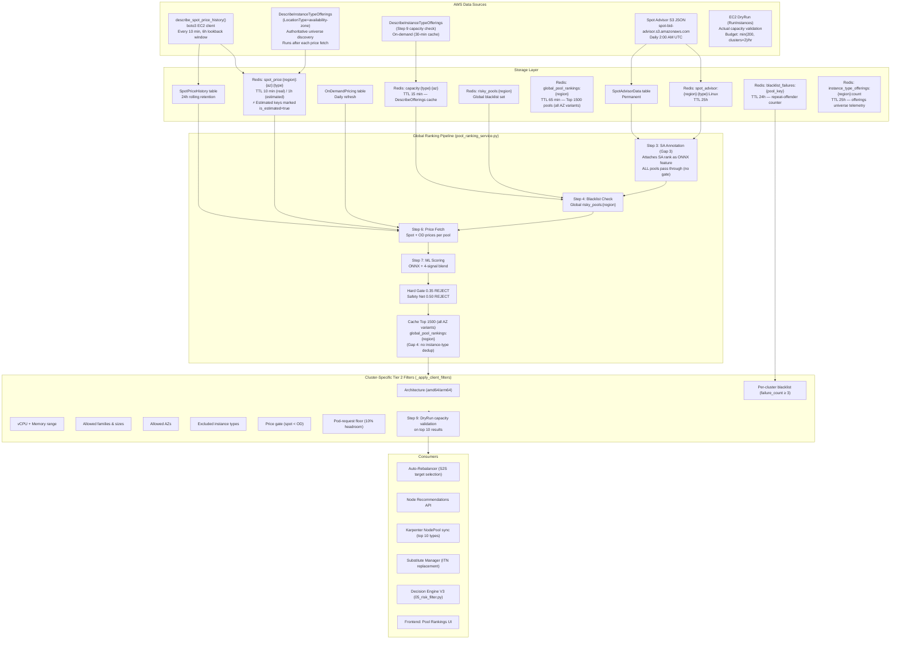

---

## 2. AWS Data Sources — Detailed

```mermaid
flowchart LR
    subgraph PriceCollection["Spot Price Collection (pricing_collector.py)"]
        direction TB
        T1["Celery Beat: every 10 min"]
        Code1["ec2_client.describe_spot_price_history(<br/>  StartTime = now - 6h,  (Gap 2 fix: was 1h)<br/>  ProductDescriptions=['Linux/UNIX'],<br/>  MaxResults = 1000,<br/>  NextToken = ...   ← paginated<br/>)<br/><br/>Followed by DescribeInstanceTypeOfferings<br/>(Gap 1: authoritative universe backfill)<br/>Writes estimated spot_price keys for types<br/>missing from price history (OD × 0.35, is_estimated=true)<br/><br/>Family-based OD estimator fallback:<br/>New types get price estimates via<br/>_estimate_od_price() when no cached OD price"]
        Store1["→ SpotPriceHistory table (24h retention)<br/>→ Redis spot_price:{region}:{az}:{type} (TTL=600s)"]
        T1 --> Code1 --> Store1
    end

    subgraph SACollection["Spot Advisor Collection (spot_advisor_scraper.py)"]
        direction TB
        T2["Celery Beat: Daily 2:00 AM UTC"]
        Code2["GET https://spot-bid-advisor.s3.amazonaws.com/<br/>spot-advisor-data.json<br/><br/>Parses interruption_index (0–4):<br/>0 = <5%, 1 = 5–10%, 2 = 10–15%,<br/>3 = 15–20%, 4 = >20%<br/>Missing 'r' → defaults to 4 (worst)"]
        Store2["→ SpotAdvisorData table (permanent)<br/>→ SpotAdvisorRate table (audit trail)<br/>→ Redis spot_advisor:{region}:{type}:Linux (TTL=90000s=25h)<br/>→ Redis spot:advisor:hash:{region} (SHA256 dedup)<br/>→ Redis spot:advisor:last_scraped (staleness tracking)"]
        T2 --> Code2 --> Store2
        Stale["Staleness checks:<br/>> 6h WARNING<br/>> 24h auto-retrigger"]
        Store2 --> Stale
    end

    subgraph ODCollection["On-Demand Price Collection"]
        direction TB
        T3["Daily 1:00 AM UTC"]
        Code3["AWS Price List API<br/>or pricing scraper fallback dict"]
        Store3["→ OnDemandPricing table<br/>→ Redis od_price:{region}:{type}"]
        T3 --> Code3 --> Store3
    end
```

---

## 3. Total Pool Universe — Before Any Filter

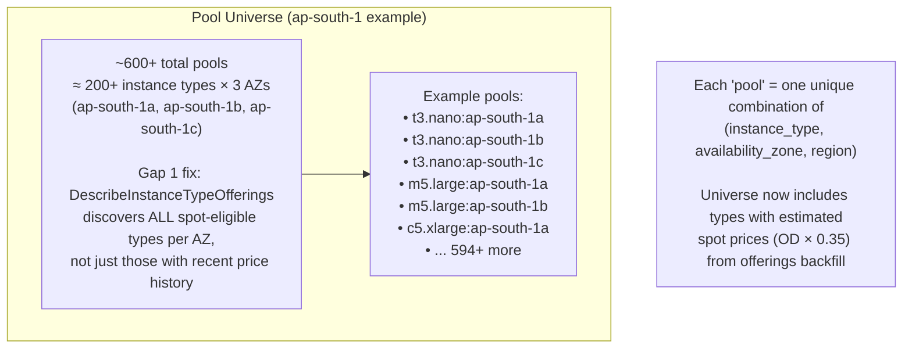

---

## 4. Global Pipeline — Step by Step With Pool Counts

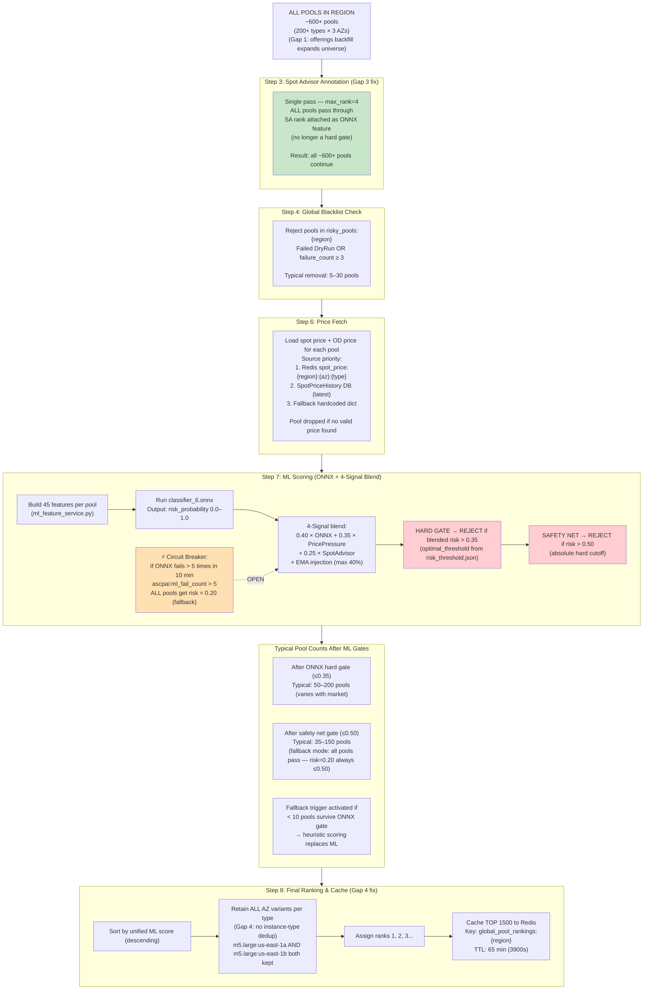

---

## 5. "Safe Zone" — Exact Numbers Before Cluster Filters

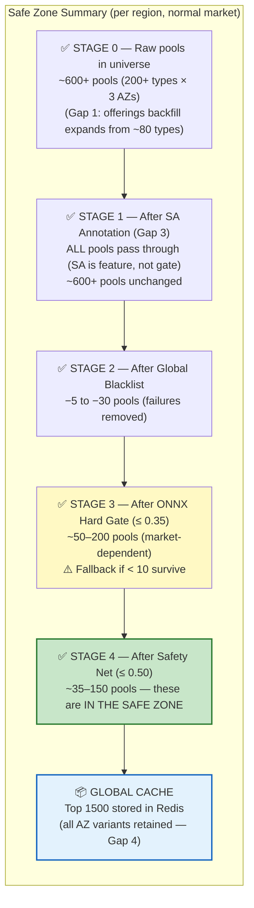

### Safe Zone in Numbers

| Stage | Filter | Pools Remaining | Note |
|-------|--------|----------------|------|
| Raw universe | None (+ offerings backfill) | ~600+ | 200+ types × 3 AZs (Gap 1) |
| After SA Annotation | SA rank attached (Gap 3: no gate) | ~600+ | All pools pass through |
| After Global Blacklist | failure_count ≥ 3 removed | ~580–600 | −5 to −30 |
| After Price Fetch | no-price pools dropped | ~560–590 | Small drop |
| **After ONNX Hard Gate (≤ 0.35)** | **risk > 0.35 rejected** | **~50–200** | **Market-dependent** |
| **After Safety Net (≤ 0.50)** | **risk > 0.50 rejected** | **~35–150** | **IN THE SAFE ZONE** |
| **Final Global Cache** | **Top 1500 cached (all AZ variants)** | **35–150 (or up to 1500)** | **Redis TTL 65 min (Gap 4: no dedup)** |

> **The "safe zone" before any cluster-specific filter = pools with blended risk_probability ≤ 0.35 (or ≤ 0.50 via safety net), not blacklisted, with valid price data. Typically 35–150 pools under normal market conditions.**

---

## 6. Cluster-Specific Filters (Tier 2) — Applied On Top Of Safe Zone

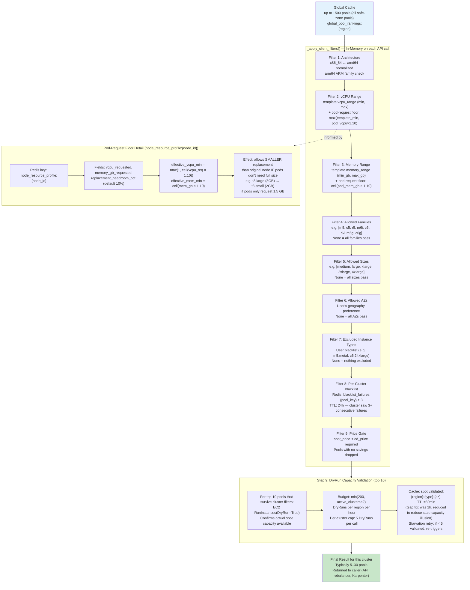

---

## 7. NodeTemplate — What Controls Cluster-Level Filters

```mermaid
flowchart LR
    subgraph NodeTemplate["NodeTemplate Dataclass (pool_ranking_service.py:44)"]
        direction TB
        NT1["vcpu_range: Tuple[int, int]<br/>e.g. (2, 16)"]
        NT2["memory_range: Tuple[int, int] GB<br/>e.g. (4, 64)"]
        NT3["allowed_families: Optional[List[str]]<br/>e.g. ['m5', 'c5', 'r5', 'm6i']"]
        NT4["allowed_sizes: Optional[List[str]]<br/>e.g. ['large', 'xlarge', '2xlarge']"]
        NT5["excluded_instance_types: Optional[List[str]]<br/>e.g. ['m5.metal']"]
        NT6["architectures: Optional[List[str]]<br/>e.g. ['amd64', 'arm64']"]
        NT7["allowed_azs: Optional[List[str]]<br/>e.g. ['ap-south-1a', 'ap-south-1b']"]
    end

    subgraph Sources["Where NodeTemplate Comes From"]
        S1["Default Template<br/>(execute_pool_ranking_pipeline)<br/>All families, wide ranges<br/>Used for global cache computation"]
        S2["API Request Body<br/>(POST /ascpai/pools/rankings)<br/>User or program-defined"]
        S3["Cluster DB Settings<br/>(cluster_optimization_settings)<br/>Per-cluster preferences"]
        S4["Auto-Rebalancer<br/>Builds template from node's<br/>current instance type + constraints"]
    end

    Sources --> NodeTemplate
```

---

## 8. Pool Ranking Pipeline — Celery Schedule

```mermaid
flowchart TD
    subgraph CeleryBeat["Celery Beat Schedule"]
        direction TB
        
        T1["execute_pool_ranking_pipeline<br/>⏰ Every 1 hour<br/>ascpai_worker.py<br/>→ Runs full global pipeline<br/>→ Caches top 1500 to Redis<br/>→ No cluster-specific filtering"]
        
        T2["ingest_spot_prices (pricing_worker.py)<br/>⏰ Every 10 min<br/>→ Calls describe_spot_price_history<br/>→ Updates SpotPriceHistory + Redis"]
        
        T3["refresh_regional_pricing<br/>⏰ Every 10 min per region<br/>→ Updates spot price Redis cache"]
        
        T4["spot_advisor_scraper (daily)<br/>⏰ 2:00 AM UTC<br/>→ Pulls S3 JSON<br/>→ Updates SpotAdvisorData table<br/>→ SHA256 dedup check"]
        
        T5["on_demand_pricing_scraper (daily)<br/>⏰ 1:00 AM UTC<br/>→ Updates OnDemandPricing table"]
    end

    subgraph Staleness["Cache Staleness Behavior"]
        direction TB
        ST1["global_pool_rankings:{region}<br/>If stale (expired TTL):<br/>First call recomputes (blocks ~2–5s)<br/>Subsequent calls use fresh cache"]
        ST2["spot_advisor:<br/>> 6h → WARNING log<br/>> 24h → auto-retrigger scrape"]
        ST3["spot_price (Redis TTL=10min):<br/>Falls back to DB query<br/>Falls back to hardcoded dict"]
    end
```

---

## 9. Data Flow to Frontend — Pool Rankings UI

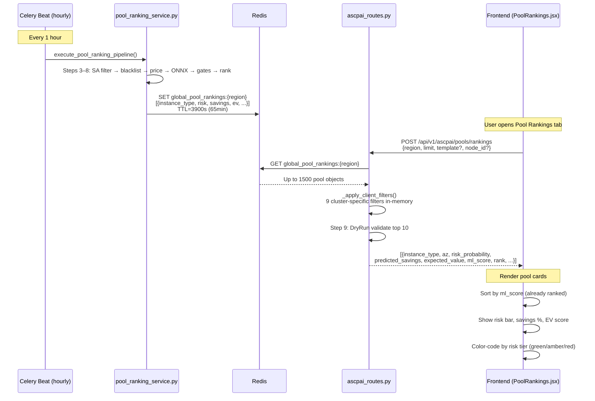

---

## 10. ScoredPool Object — What's Inside Each Pool Entry

```mermaid
flowchart LR
    subgraph ScoredPool["ScoredPool (per pool in global cache)"]
        direction TB
        F1["instance_type: str<br/>e.g. 'm5.large'"]
        F2["az: str<br/>e.g. 'ap-south-1a'"]
        F3["vcpu: int<br/>e.g. 2"]
        F4["memory_gb: float<br/>e.g. 8.0"]
        F5["spot_price: float<br/>e.g. 0.0285 ($/hr)"]
        F6["ondemand_price: float<br/>e.g. 0.096 ($/hr)"]
        F7["predicted_savings: float<br/>0.0–1.0 (regressor output)<br/>e.g. 0.70"]
        F8["risk_probability: float<br/>0.0–1.0 (4-signal blend)<br/>e.g. 0.12"]
        F9["expected_value: float<br/>savings × (1 - risk)<br/>e.g. 0.616"]
        F10["ml_score: float<br/>(savings×0.8) × (1-risk) × rep × cap<br/>e.g. 0.493"]
        F11["rank: int<br/>1 = best in region"]
        F12["is_flagged: bool<br/>True if in risky_pools global blacklist"]
        F13["spot_advisor_rank: int<br/>0–5 (5 = missing/default worst)"]
        F14["timestamp: str<br/>ISO format — when price was fetched"]
    end

    subgraph APIResponse["Additional fields added by ascpai_routes.py"]
        direction TB
        A1["s2s_candidate: bool<br/>True if node's risk > cluster ceiling"]
        A2["s2s_trigger: str<br/>Reason: 'risk_threshold', 'pool_diversify', etc."]
        A3["target_instance_type: str<br/>Best replacement pool"]
        A4["current_cost: float<br/>$/hr for current node"]
    end
```

---

## 11. Global Blacklist vs Per-Cluster Blacklist

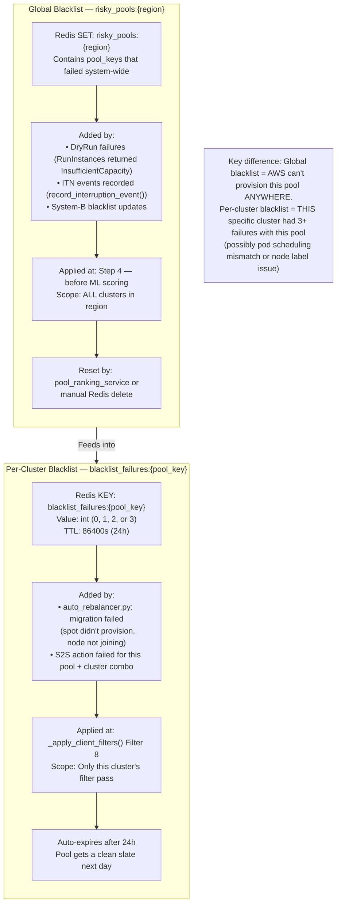

---

## 12. ONNX Circuit Breaker — Fallback Behavior

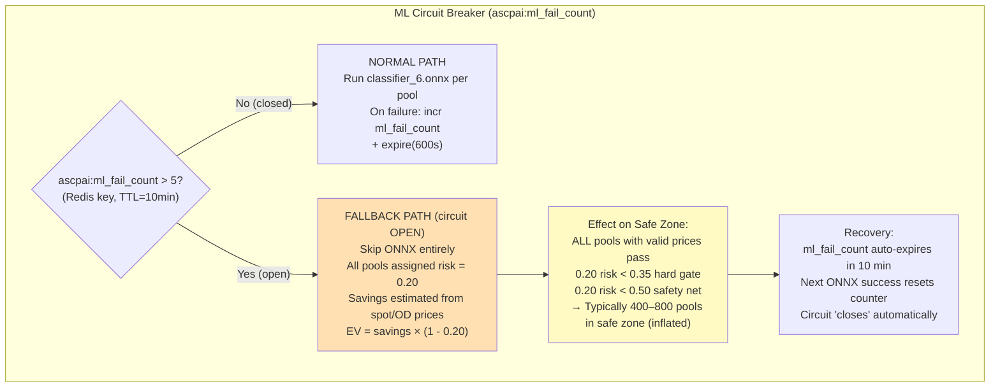

---

## 13. Key Constants & Redis Keys Quick Reference

### Constants (pool_ranking_service.py)

| Constant | Value | Location | Purpose |
|----------|-------|----------|---------|
| `GLOBAL_CACHE_LIMIT` | 1500 | Line 37 | Max pools stored per region in global cache |
| `GLOBAL_CACHE_TTL` | 3900s (65 min) | Line 36 | How long global rankings stay cached |
| `optimal_threshold` | 0.35 | Line 135 | ONNX risk hard gate (from `ml_model/risk_threshold.json`) |
| `safety_net_gate` | 0.50 | Line 557–867 | Absolute max risk — hardcoded |
| `fallback_trigger` | < 10 pools | Line 545 | When ONNX gate leaves fewer than 10 pools → activate fallback |
| `circuit_breaker_limit` | > 5 failures | Line 1150 | Opens circuit breaker → fallback scoring |
| `circuit_breaker_window` | 600s (10 min) | Line 1158 | Redis TTL for ml_fail_count |
| `blacklist_failure_threshold` | ≥ 3 | Line 741 | Per-cluster pool rejection |
| `blacklist_ttl` | 86400s (24h) | — | Auto-expiry for per-cluster failure counter |
| `capacity_cache_ttl` | 900s (15 min) | — | DescribeInstanceTypeOfferings cache |
| `validated_pool_ttl` | 1800s (30 min) | — | DryRun validation cache (was 3600s/1h, reduced to 30 min) |
| `dryrun_budget_per_hour` | min(200, clusters×2) | — | EC2 DryRun budget per region |
| `dryrun_per_cluster_cap` | 5 | — | DryRuns per single cluster call |
| `target_validated_pools` | 10 | — | Min pools to DryRun-validate before returning |
| `pod_headroom_pct` | 10% | Line ~677 | Buffer added to pod-request floor |

### Redis Keys Reference

| Key Pattern | Stored Value | TTL | Written By | Read By |
|-------------|-------------|-----|-----------|--------|
| `global_pool_rankings:{region}` | JSON array of ScoredPool | 3900s | pool_ranking_service | ascpai_routes, auto_rebalancer, karpenter_service |
| `spot_price:{region}:{az}:{type}` | `{"price": float, "timestamp": ISO, "is_estimated": bool}` | 600s (real) / 3600s (estimated) | pricing_collector + offerings backfill | pool_ranking_service Step 6 |
| `od_price:{region}:{type}` | float | varies | pricing scraper | pool_ranking_service Step 6 |
| `spot_advisor:{region}:{type}:Linux` | `{"interruption_index": int, "savings": float}` | 90000s (25h) | spot_advisor_scraper | pool_ranking_service Step 3 |
| `spot:advisor:hash:{region}` | SHA256 string | none | spot_advisor_scraper | dedup check |
| `spot:advisor:last_scraped` | ISO timestamp | none | spot_advisor_scraper | staleness check |
| `risky_pools:{region}` | Redis SET of pool_keys | varies | pool_ranking_service, auto_rebalancer | Step 4, _apply_client_filters |
| `blacklist_failures:{pool_key}` | int (0–3) | 86400s (24h) | auto_rebalancer | _apply_client_filters Filter 8 |
| `capacity:{type}:{az}` | "1" or "0" | 900s (15 min) | Step 5 (DescribeOfferings) | Step 5 cache check |
| `spot:validated:{region}:{type}:{az}` | ISO timestamp | 1800s (30 min) | Step 9 (DryRun) | Step 9 cache check |
| `spot:dryrun_count:{region}` | int | 3600s (1h) | Step 9 | budget enforcement |
| `ascpai:ml_fail_count` | int | 600s (10 min) | Step 7 (on ONNX exception) | circuit breaker check |
| `node_resource_profile:{node_id}` | `{"vcpu_requested": float, "memory_gb_requested": float, "replacement_headroom_pct": int}` | varies | pod metrics collector | _apply_client_filters (pod-request floor) |
| `market_factor:{region}` | float (0.80–1.20) | varies | volatility detector | auto_rebalancer (S2S ceiling) |
| `volatility_regime:{region}` | "NORMAL" / "HIGH" / "CRITICAL" | varies | volatility detector | auto_rebalancer, decision engine |
| `instance_type_offerings:{region}:count` | int (number of types discovered) | 90000s (25h) | pricing_collector + aws_pricing_service | telemetry / debugging |

---

## 14. Pool Count Funnel — Visual Summary

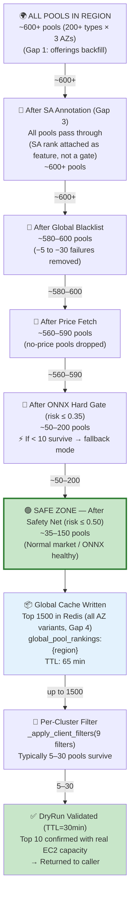

---

## 15. Database Tables — Schema Overview

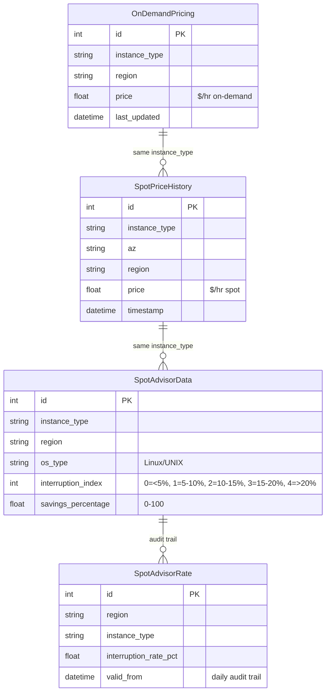
