# Risk System Architecture — Complete Reference

> Generated: 9 April 2026  
> Updated: 10 April 2026 (Gap 1–4 fixes applied)  
> Covers: Risk scoring pipeline, S2S risk thresholds, Node Fleet UI, risk-based decisions

---

## 1. Risk System Overview

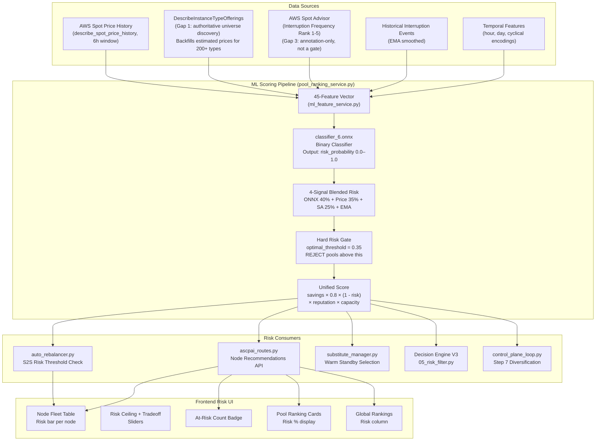

---

## 2. Risk Score Calculation — The 4-Signal Blend

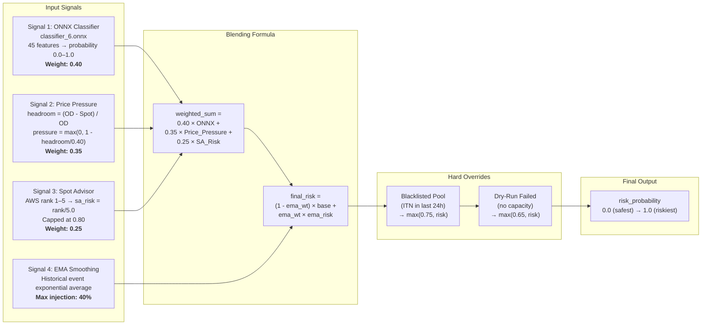

### 45 ML Features Breakdown

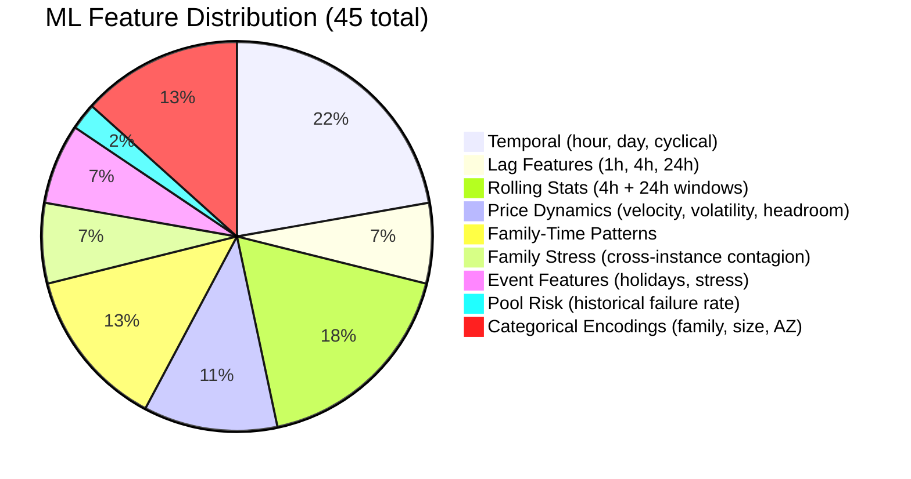

---

## 3. Risk Gates — Multi-Layer Filtering

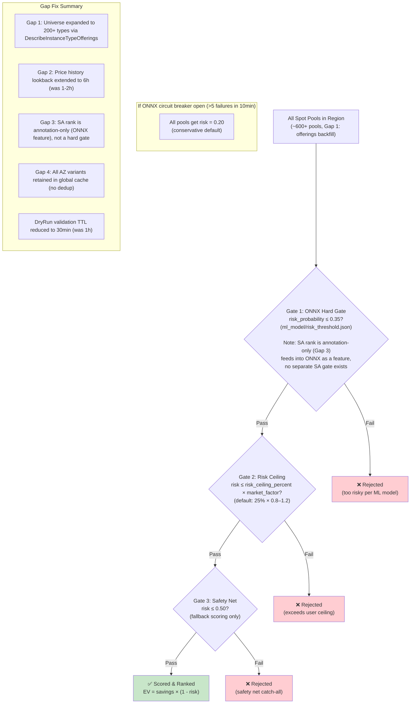

---

## 4. Unified Scoring Formula

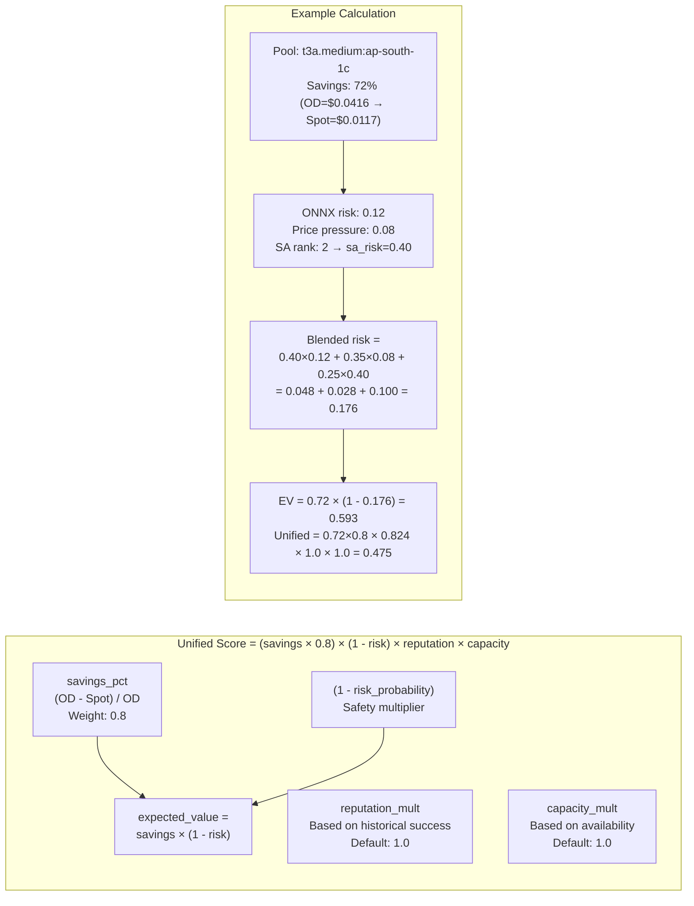

---

## 5. S2S Risk-Based Rebalancing — Complete Flow

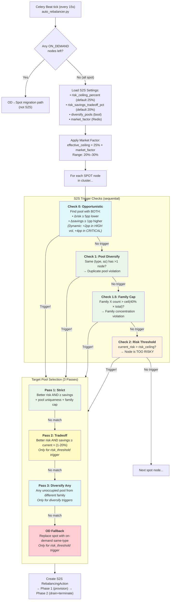

---

## 6. Risk Ceiling — Dynamic Adjustment

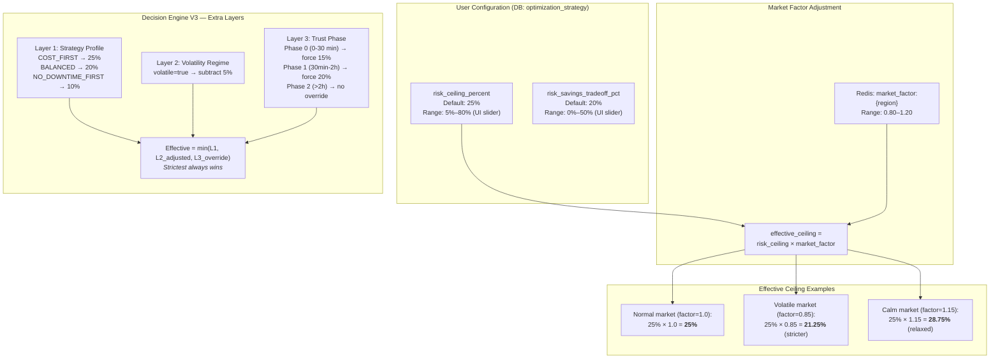

---

## 7. Volatility Regime — Effects on Risk Decisions

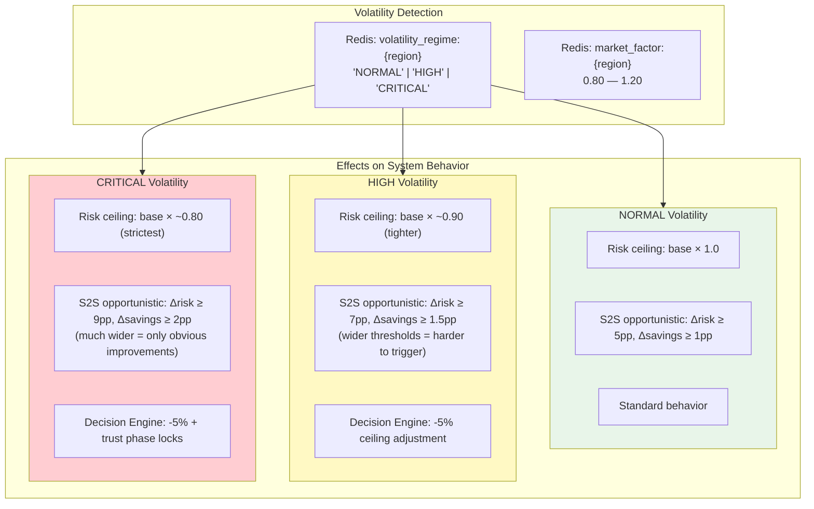

---

## 8. Node Fleet UI — Risk Display Components

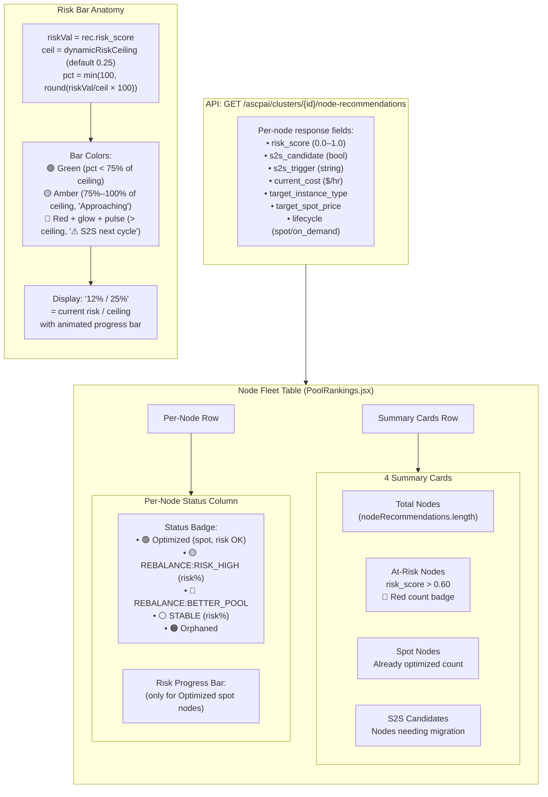

### Risk Bar Visual States

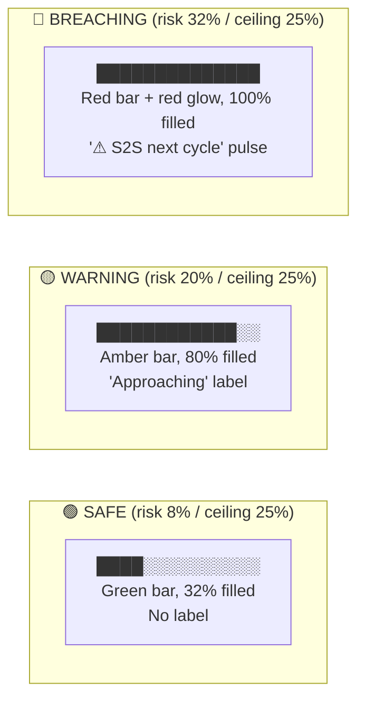

---

## 9. Risk Threshold UI Controls

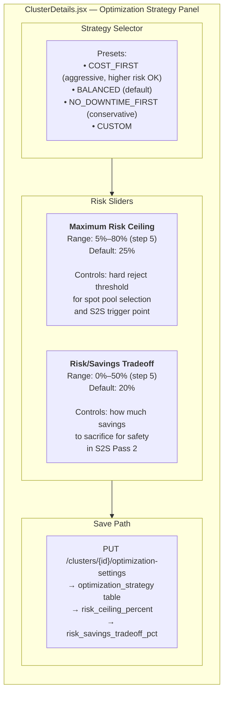

---

## 10. Complete Risk Threshold Reference

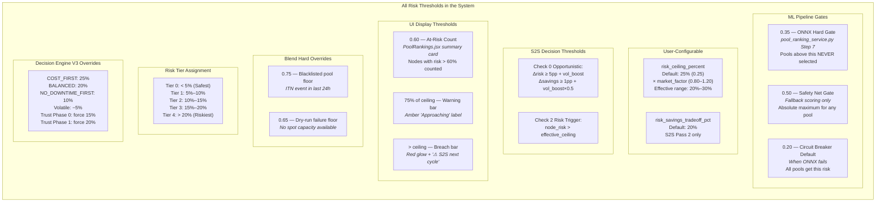

---

## 11. Risk-Based Actions — What Happens When

```mermaid
flowchart TD
    subgraph Scenario1["Scenario: Node Risk Exceeds Ceiling"]
        A1["Node t3a.medium:ap-south-1c<br/>risk_probability = 0.32<br/>ceiling = 0.25"]
        A2["auto_rebalancer Check 2 fires:<br/>'risk_threshold: risk=0.32 > ceil=0.25'"]
        A3["Target Selection:<br/>Pass 1: Find pool with risk < 0.25 AND ≥ savings"]
        A4{"Found safer pool?"}
        A5["Create S2S action<br/>→ Patch NodePool → Trigger Pod<br/>→ Wait for Spot → Cordon → Drain → Terminate"]
        A6["Pass 2: Accept pool with<br/>savings ≥ 80% of current<br/>(tradeoff 20%)"]
        A7["OD Fallback:<br/>Replace spot with on-demand same-type<br/>(last resort, sacrifices all savings)"]
        
        A1 --> A2 --> A3 --> A4
        A4 -->|"Yes"| A5
        A4 -->|"No"| A6
        A6 -->|"No match"| A7
    end

    subgraph Scenario2["Scenario: Spot Interruption (Emergency)"]
        B1["AWS 2-minute ITN warning<br/>agent/poller.py detects via IMDS"]
        B2["Agent sends heartbeat with<br/>interruption_warning=true"]
        B3["substitute_manager.py<br/>selects replacement from<br/>ML-ranked pools (risk_score weighted)"]
        B4{"ML pools available?"}
        B5["Launch replacement from<br/>ranked pool with lowest risk"]
        B6["Hardcoded family fallback<br/>(conservative sizes)"]
        B7["record_interruption_event()<br/>→ EMA history shifts<br/>→ that pool's future risk ↑"]
        
        B1 --> B2 --> B3 --> B4
        B4 -->|"Yes"| B5
        B4 -->|"No"| B6
        B5 --> B7
        B6 --> B7
    end

    subgraph Scenario3["Scenario: Market Volatility Spike"]
        C1["Volatility regime changes<br/>NORMAL → HIGH"]
        C2["market_factor drops<br/>1.0 → 0.85"]
        C3["Effective ceiling tightens<br/>25% × 0.85 = 21.25%"]
        C4["Nodes previously 'safe' at 23%<br/>now BREACH the ceiling"]
        C5["S2S Check 2 triggers<br/>more aggressively"]
        C6["Opportunistic thresholds widen<br/>Δrisk ≥ 7pp (was 5pp)<br/>= harder to trigger opportunistic moves"]
        
        C1 --> C2 --> C3 --> C4 --> C5
        C2 --> C6
    end

    subgraph Scenario4["Scenario: Pool Re-Ranking (every 30 min)"]
        D1["Celery: execute_pool_ranking_pipeline"]
        D2["For each pool in region:<br/>1. Build 45 features<br/>2. Run ONNX classifier<br/>3. Blend 4 signals<br/>4. Compute unified score"]
        D3["Store in Redis:<br/>global_pool_rankings:{region}<br/>TTL: 65 min"]
        D4["Next rebalancer cycle picks up<br/>new risk scores for S2S evaluation"]
        D5["Node fleet UI refreshes<br/>risk bars on next API call"]
        
        D1 --> D2 --> D3 --> D4
        D3 --> D5
    end
```

---

## 12. Data Flow — Risk Score to UI Display

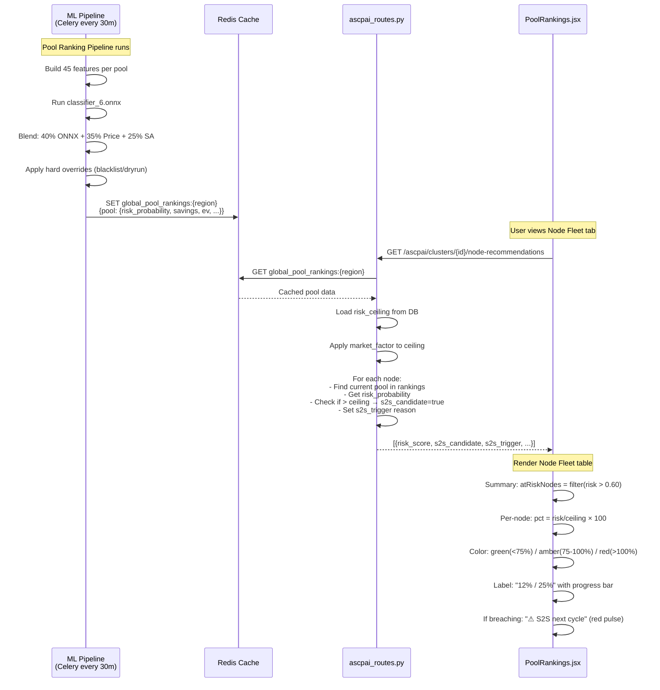

---

## 13. Strategy Presets — Risk Impact

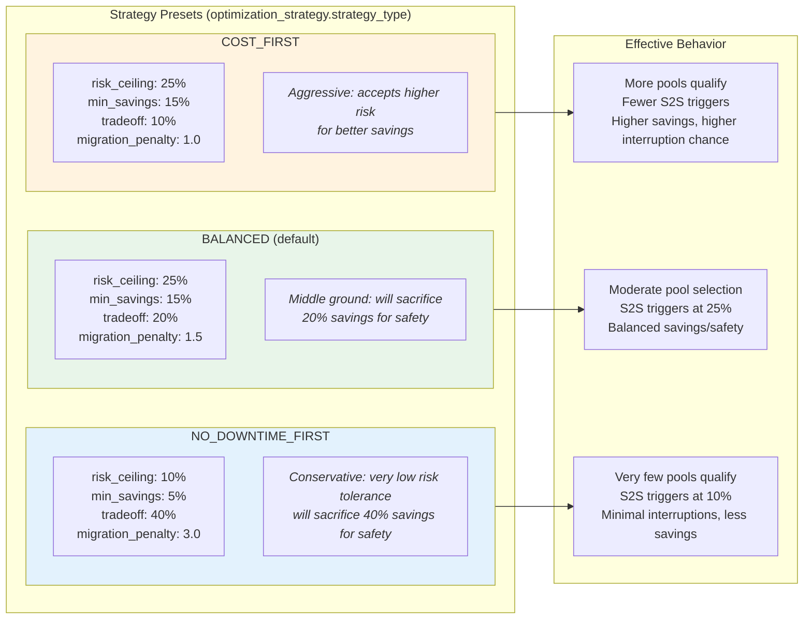

---

## 14. Risk Data Model

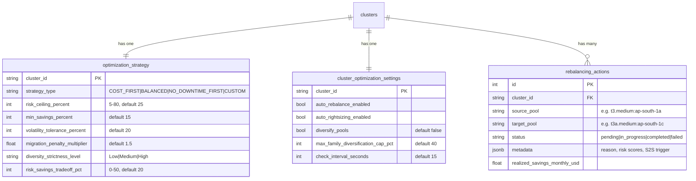

---

## 15. All Risk Thresholds — Quick Reference Table

| Threshold | Value | Source | Purpose |
|-----------|-------|--------|---------|
| **ONNX Hard Gate** | 0.35 | `risk_threshold.json` | Reject pools from ML pipeline |
| **Safety Net** | 0.50 | `pool_ranking_service.py` | Absolute maximum (fallback scoring) |
| **ONNX Fallback** | 0.20 | `pool_ranking_service.py` | Default risk when ONNX circuit breaker trips |
| **Risk Ceiling (user)** | 25% default | `optimization_strategy` table | Per-cluster configurable ceiling |
| **Market Factor** | 0.80–1.20× | Redis `market_factor:{region}` | Multiplied into risk ceiling |
| **S2S Opportunistic Δrisk** | ≥5pp base | `auto_rebalancer.py` Check 0 | Must be this much safer |
| **S2S Opportunistic Δsavings** | ≥1pp base | `auto_rebalancer.py` Check 0 | Must also be cheaper |
| **HIGH vol boost** | +2pp risk, +1pp savings | `auto_rebalancer.py` | Widens opportunistic thresholds |
| **CRITICAL vol boost** | +4pp risk, +2pp savings | `auto_rebalancer.py` | Widens even more |
| **S2S Tradeoff** | 20% default | `optimization_strategy` table | Accept pool 20% costlier if safer |
| **At-Risk UI badge** | >60% | `PoolRankings.jsx` | Counts nodes in summary card |
| **UI Warning bar** | ≥75% of ceiling | `PoolRankings.jsx` | Amber "Approaching" label |
| **UI Breach bar** | >100% of ceiling | `PoolRankings.jsx` | Red glow + "⚠ S2S next cycle" |
| **Blacklist floor** | 0.75 | `compute_blended_risk()` | Pool with ITN in last 24h |
| **Dry-run fail floor** | 0.65 | `compute_blended_risk()` | Pool failed capacity check |
| **DE V3 COST_FIRST** | 25% | `05_risk_filter.py` | Strategy-based ceiling |
| **DE V3 BALANCED** | 20% | `05_risk_filter.py` | Strategy-based ceiling |
| **DE V3 NO_DOWNTIME** | 10% | `05_risk_filter.py` | Strategy-based ceiling |
| **DE V3 Volatile adj** | -5% | `05_risk_filter.py` | Subtracted when volatile |
| **Trust Phase 0** | force 15% | `05_risk_filter.py` | First 30 min of cluster life |
| **Trust Phase 1** | force 20% | `05_risk_filter.py` | 30 min – 2 hr of cluster life |
| **Risk Tier boundaries** | 5%, 10%, 15%, 20% | `assign_risk_tier()` | Tier 0 through Tier 4 |
