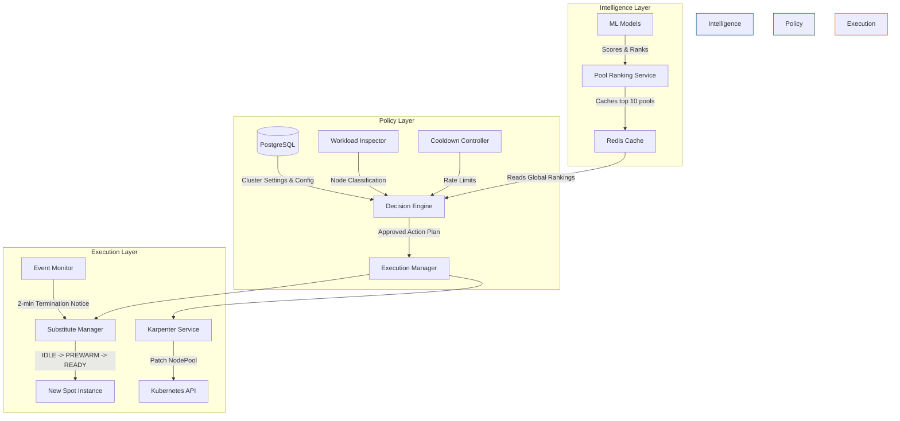
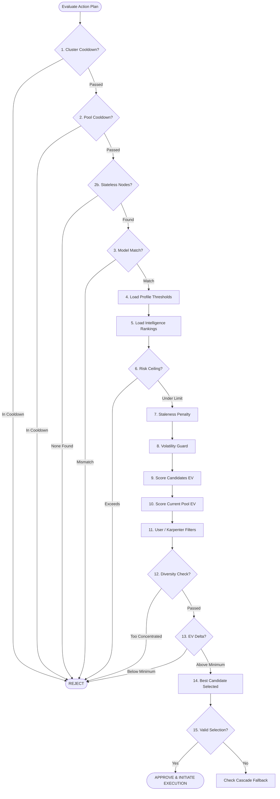
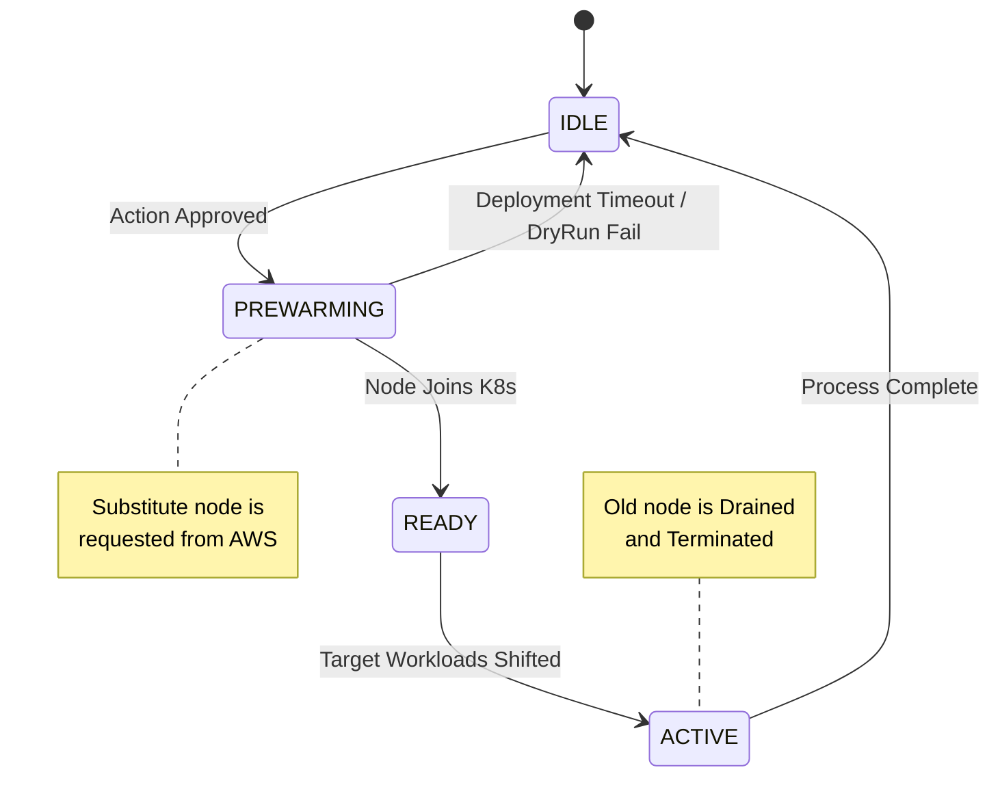

# Decision Engine v3 — Comprehensive Core Logic & Architecture

This document outlines the complete architectural logic, rules engine, and process flows for the Decision Engine v3, which powers intelligent, zero-downtime spot instance optimization. 

---

## 1. System Architecture Flow

The system is divided into three distinct layers to ensure strict separation of concerns, scalability, and safety.



### Layer Breakdown
1. **Intelligence Layer (System A / `pool_ranking_service.py`)**
   - Engineers ML features and runs ONNX models. Evaluates potential spot instance pools.
   - Outputs: Predicted savings (`regressor_6.onnx`) and Risk probability (`classifier_6.onnx`).
   - Limits: Hard risk cutoff at `0.50` (pools riskier than 50% are discarded).
   - Validates the top 10 pools via AWS EC2 DryRun API (`RunInstances --dry-run`).
   - Caches rankings in Redis (`spot:rankings:{region}`) for 65 minutes.

2. **Policy Layer (System B / `decision_engine.py`)**
   - The central brain. Consumes the global rankings and evaluates them against cluster-specific constraints, user-defined modes, and real-time operational safety guards.
   - Executes a strict 15-step evaluation pipeline to approve or hold structural changes.

3. **Execution Layer (System C)**
   - **`karpenter_service.py`**: Patches Kubernetes NodePools, enforces regional circuit breakers, and handles rollback on patch failures.
   - **`substitute_manager.py`**: Manages the lifecycle of substitute instances to achieve zero-downtime swaps.
   - **`event_monitor.py`**: Intercepts 2-minute AWS termination notices, bypassing normal policy logic to execute emergency graceful degradation (Cordon & Drain).

---

## 2. Core Scoring Strategy: Expected Value (EV)

The system relies on pure **Risk-Adjusted Expected Value** rather than arbitrary weighted scoring.

**Formula**:
```python
expected_value = predicted_savings * (1.0 - risk_probability)
```
- E.g., A pool saving 60% with a 10% risk of interruption: `0.60 * (1.0 - 0.10) = 0.54 EV`
- The system ranks and selects pools based strictly on the highest `expected_value`, establishing a mathematically provable optimization target.

---

## 3. Optimization Modes (Profiles)

Clusters operate iteratively based on user-defined objectives. Thresholds dynamically adjust logic in the pipeline.

| Setting | `COST_FIRST` | `BALANCED` | `NO_DOWNTIME_FIRST` |
|---------|--------------|------------|---------------------|
| **Risk Ceiling** | `<= 0.50` (50%) | `<= 0.45` (45%) | `<= 0.35` (35%) |
| **Minimum Delta** | `3%` EV Gain | `5%` EV Gain | `8%` EV Gain |
| **Substitute Node** | `spot` | `spot` | `on-demand` |
| **Max Family Concentration** | `40%` | `30%` | `25%` |
| **Cluster Cooldown** | 60 mins | 120 mins | 180 mins |

---

## 4. The 15-Step Decision Pipeline Logic

When `decision_engine.evaluate_action_plan()` is invoked, it runs a sequential evaluation. **Any failure results in an immediate early exit (HOLD).**



### Pipeline Detail
1. **Cluster Cooldown**: Reject if cluster switched too recently (prevents flapping).
2. **Pool Cooldown**: Filter out specific instance types that recently failed execution.
3. **Node Classification**: Fetch K8s node states from `WorkloadInspector`. Reject if there are no `STATELESS_ELIGIBLE` nodes. (Protects stateful sets).
4. **Model Version Match**: Validate cluster model version against pipeline version.
5. **Load Profile**: Apply user-selected configuration parameters.
6. **Load Intelligence**: Fetch global pool rankings from Redis cache.
7. **Risk Ceiling**: Filter out pools exceeding the profile's risk limit (e.g., >0.45 for Balanced).
8. **Staleness Penalty**: If capacity data is older than 80 minutes, silently apply a 5% penalty to `predicted_savings`.
9. **Volatility Guard**: If region volatility is detected (price stddev > p95), reduce exactly 5% from the risk ceiling.
10. **Score Candidates**: Calculate `expected_value` for all remaining pools.
11. **Score Current Pool**: Calculate `expected_value` for the cluster's current running instance type.
12. **User Filters**: Apply Karpenter architecture, family, size constraints.
13. **Diversity Enforcer**: Check `max_family_ratio` and `max_az_ratio`. Reject candidates that would concentrate risk.
14. **Delta Threshold**: `Delta = Candidate_EV - Current_EV`. Reject if Delta < minimum required.
15. **Deadlock / Cascade Fallback**: If no candidate remains, check if >70% of pools are globally blacklisted. If yes, trigger fallback to On-Demand.

---

## 5. Execution & Substitute State Machine

To ensure zero-downtime swaps, instances must transition through a strict deployment state machine before the old node is ever cordoned or drained. 



- **COST_FIRST / BALANCED**: Prewarms a better Spot instance for substitute.
- **NO_DOWNTIME_FIRST**: Prewarms an On-Demand instance.
- **Node-Aware Targeting**: Substitutes map 1:1 with specific `STATELESS_ELIGIBLE` nodes.

### Hard Execution Validation 
- Before patching K8s, `karpenter_service.py` executes a final `RunInstances --dry-run` to ensure AWS capacity exists.
- **Circuit Breaker**: If >10 patches fail across the region within 10 minutes, the region's spot automation is disabled for 30 minutes.

### Tiered Blacklisting
Failed pools are blacklisted with strict TTLs relative to the severity:
- **Execution DryRun Failure**: Penalized ONLY in execution cache (1h TTL).
- **Intelligence DryRun Failure (1-2x/day)**: 6 hour global blacklist.
- **Intelligence DryRun Failure (3x+/day)**: 12 hour global blacklist.
- **AWS Interruption (ITN Notice)**: 24 hour global blacklist.

---

## 6. Background Automation (Scheduler)

The v3 engine requires an autonomous scheduler (`backend/scheduler.py`) to run asynchronous system health routines:

```mermaid
gantt
    title Scheduled Background Maintenance Tasks
    dateFormat  s
    axisFormat  %M
    
    section Every 5 Min
    Refresh Active Cluster Count   :a1, 0, 5s
    Reconcile Stuck Substitutes    :a2, 0, 5s
    
    section Every 10 Min
    Workload/Node Classification   :a3, 0, 10s
    
    section Every 30 Min
    Check Cost Drift / Metrics     :a4, 0, 30s
    
    section Every 1 Hour
    Detect Volatility Regime       :a5, 0, 60s
    
    section Every 24 Hours (2 AM)
    Cleanup Redis Keys             :a6, 0, 10s
```



1. **Every 5 min**: Update `spot:active_cluster_count` (scales the AWS DryRun API quota limit dynamically).
2. **Every 5 min**: Reconcile stuck substitutes (reset `PREWARMING` instances that hit deployment timeouts).
3. **Every 10 min**: Run `WorkloadInspector.scan_cluster()` with jitter to classify stateful vs stateless nodes safely.
4. **Every 30 min**: Check cost drift to ensure expected savings reflect billing reality.
5. **Every 1 hr**: Calculate 24h rolling price stddev to detect Volatility Regimes.
6. **Every 24 hrs**: Clean up orphaned Redis `spot:*` blacklist keys to prevent memory exhaustion.

---

## 7. API Endpoints Reference

The frontend consumes the Decision Engine telemetry via the following real-time endpoints exposed in `backend/api/ascpai_routes.py` and cluster services:

- **`GET /api/v1/ascpai/rankings/global`**: Fetches the top 10 cross-region ML pool rankings.
- **`GET /api/v1/ascpai/rankings/{cluster_id}`**: Fetches cluster-specific pool rankings filtered by the node template.
- **`GET /api/v1/ascpai/heatmap/{cluster_id}`**: Returns a 30-day interruption spread for a given cluster.
- **`GET /api/v1/ascpai/rebalancing/status`**: Yields the current status of all auto-rebalancing operations.
- **`GET /api/v1/ascpai/rebalancing/timeline`**: Returns historical timeline events for cluster rebalancing.
- **`GET /api/v1/ascpai/blacklist/status`**: Exposes the live Redis blacklist count and capacity staturation.
- **`GET /api/v1/ascpai/volatility/{cluster_id}`**: Live feed of the current price volatility regime (`NORMAL`, `VOLATILE`, `CRITICAL`).
- **`GET /api/v1/ascpai/decision-engine/{cluster_id}`**: Complete 15-step execution state for the timeline visualizer.
- **`GET /api/v1/clusters/{id}/classification`**: Live WorkloadInspector evaluation (e.g. `STATELESS_ELIGIBLE`).
- **`PATCH /api/v1/clusters/{id}`**: Modifies the `optimization_mode` (COST_FIRST, BALANCED, NO_DOWNTIME_FIRST).
- **`GET /api/v1/substitute/status/{cluster_id}`**: Retrieves the live PREWARM state of any substitute instance.
- **`GET /api/v1/cooldown/{cluster_id}`**: Live countdown of the active Cooldown Controller.
- **`GET /api/v1/execution/status/{cluster_id}`**: Current state of the regional Circuit Breakers.
