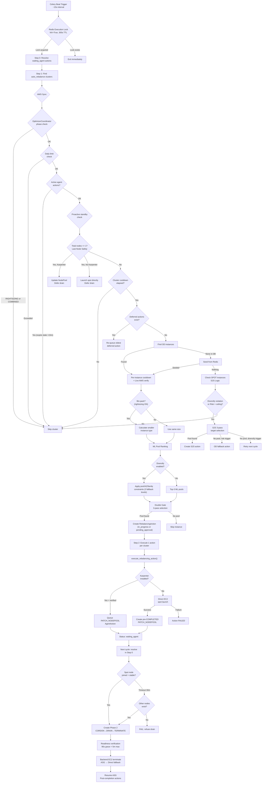

# Rebalancing & Rightsizing — Comprehensive Technical Report

> **Source of Truth**: Every detail in this document is derived directly from the codebase (`auto_rebalancer.py`, `cluster_routes.py`, `rightsizing_service.py`, `substitute_manager.py`, `pool_ranking_service.py`, and associated models/schemas). No assumptions are made.

---

## Table of Contents

1. [System Architecture Overview](#1-system-architecture-overview)
2. [Celery Task Entry Point (`execute_rebalancing`)](#2-celery-task-entry-point)
3. [On-Demand → Spot Rebalancing (OD→Spot)](#3-od-to-spot-rebalancing)
4. [Spot → Spot Rebalancing (S2S)](#4-spot-to-spot-rebalancing)
5. [Rightsizing (Bin-Packing)](#5-rightsizing-bin-packing)
6. [Auto-Stateful Rightsizing](#6-auto-stateful-rightsizing)
7. [Two-Phase Execution Model](#7-two-phase-execution-model)
8. [Phase 2 Resolution Loop](#8-phase-2-resolution-loop)
9. [Safety Gates & Guardrails](#9-safety-gates--guardrails)
10. [Fallback Mechanisms](#10-fallback-mechanisms)
11. [Rollback Procedures](#11-rollback-procedures)
12. [Emergency Termination Procedures](#12-emergency-termination-procedures)
13. [Spot Recovery (Interruption Handling)](#13-spot-recovery-interruption-handling)
14. [Spot Interruption Fallback API (`/fallback`)](#14-spot-interruption-fallback-api)
15. [Pool Selection & Diversification](#15-pool-selection--diversification)
16. [Karpenter Integration](#16-karpenter-integration)
17. [ASG (Auto Scaling Group) Management](#17-asg-management)
18. [Cooldown System](#18-cooldown-system)
19. [Standby Node Management](#19-standby-node-management)
20. [Post-Completion Actions](#20-post-completion-actions)
21. [Configuration & Settings](#21-configuration--settings)
22. [Complete Decision Flow Diagram](#22-complete-decision-flow-diagram)

---

## 1. System Architecture Overview

| Component | File | Purpose |
|---|---|---|
| Auto Rebalancer Worker | `backend/workers/tasks/auto_rebalancer.py` (3449 lines) | Core Celery task that runs the entire optimization loop |
| Fallback API | `backend/api/cluster_routes.py` (L384–469) | Spot interruption fallback handler |
| Rightsizing Service | `backend/services/rightsizing_service.py` (978 lines) | Pod-level resource analysis and proposal generation |
| Pool Ranking Service | `backend/services/pool_ranking_service.py` | ML-based spot pool scoring and ranking |
| Substitute Manager | `backend/services/substitute_manager.py` | Instance type specs + warm spare management |
| Decision Engine | `backend/core/decision_engine.py` | Risk/failure reporting and pool blacklisting |
| Cooldown Controller | `backend/services/cooldown_controller.py` | Cluster-level stabilization lock management |
| Karpenter Service | `backend/services/karpenter_service.py` | NodePool CRUD + on-demand/spot switching |

**Execution Cadence**: The `execute_rebalancing` Celery task is registered as `workers.auto_rebalancer` and runs on a schedule (typically every ~15 seconds via Celery Beat).

---

## 2. Celery Task Entry Point

**Source**: `auto_rebalancer.py` L1282–3449

### Execution Lock (Race Condition Prevention)
```python
# L1294: Distributed Redis lock prevents overlapping Celery executions
_redis.set("lock:workers.auto_rebalancer", "1", nx=True, ex=300)  # 5-min TTL
```
- If the lock already exists, the task **exits immediately** without processing.
- The lock is released in the `finally` block (L3446).

### Main Loop Structure (Sequential Steps)

| Step | Lines | Description |
|---|---|---|
| **Step 0** | L1302–2128 | Resolve `waiting_agent` actions (Phase 2 resolution loop) |
| **Step 1** | L2130–3277 | Check clusters with auto-rebalance enabled; create new actions (OD→Spot + S2S) |
| **Step 2** | L3281–3301 | Execute 1 `in_progress` action per cluster (calls `execute_rebalancing_action()`) |
| **Step 3** | L3305–3437 | Auto-stateful rightsizing phase |

---

## 3. On-Demand → Spot Rebalancing (OD→Spot)

**Source**: `auto_rebalancer.py` L2582–3277

### Trigger Conditions
1. Cluster has `auto_rebalance_enabled = True` (from `ClusterOptimizationSettings`)
2. Running ON_DEMAND instances exist (`Instance.lifecycle == ON_DEMAND, state == 'running'`)
3. All safety gates pass (see §9)

### Instance Discovery

1. **Primary**: Query `Instance` table for `lifecycle=ON_DEMAND, state='running'` (L2587–2591)
2. **Redis Fallback**: If DB has no instances, seed from Redis telemetry via `_seed_instances_from_redis()` (L2597–2610)
   - Infers instance type from `cpu_capacity_millicores` and `memory_capacity_bytes`
   - Creates synthetic `Instance` rows with `lifecycle=ON_DEMAND`
   - Uses a best-match algorithm against a `_TYPE_MAP` of 14 common instance types

### Per-Instance Filtering
- **24h Cooldown**: Redis key `spot:rebalanced:instance:{instance_id}` — skip if exists (L2616–2631)
- **Placeholder Filter**: Skip instances where `instance_id` doesn't start with `i-` (L2930–2935)
- **Live AWS Verification**: Before targeting, calls `ec2.describe_instances()` to confirm lifecycle (L2937–2987)
  - If AWS says `spot` → corrects DB to `SPOT`, sets 24h cooldown, skips
  - If instance not found in AWS → marks `state='terminated'`, skips

### Pool Selection (3-Pass Double Gate)

**Source**: L3167–3241

**Pass 1** — Cheapest safe pool:
```
spot_price < OD_price AND risk_probability < risk_ceiling
```

**Pass 2** — Tradeoff (accept slightly expensive):
```
spot_price <= cheapest_spot + (OD_price - cheapest_spot) × tradeoff_pct
AND risk_probability < risk_ceiling
```
→ selects lowest risk from qualifying candidates.

**Pass 3** — Risk override (node is dangerously risky):
```
IF node.risk_score > risk_ceiling THEN
  select ANY pool with lower risk, ignore price
```

If no pool qualifies → `target_pool = None` → skip this instance, try next cycle.

### Manual Approval Gate
If `manual_approval_required = True` on the cluster settings:
- Action is created with `status = 'pending_approval'` instead of `'in_progress'`
- Requires explicit approval via `POST /api/v1/ascpai/rebalancing-actions/{id}/approve`

### Action Creation Limit
- **One action per cluster per cycle** (`break` at L3277)
- **Daily limit**: `max_rebalances_per_24h` (default: 5, from `StatelessRuntimeRules`)
- Only **completed** actions count toward daily limit (L2248–2254)

---

## 4. Spot → Spot Rebalancing (S2S)

**Source**: `auto_rebalancer.py` L2634–2914

S2S rebalancing activates when **all OD nodes are either migrated or in cooldown** (no OD candidates remain).

### Trigger Conditions

**Check 1 — Diversify Violation (Pool-Level)** (L2719–2734):
```
IF diversify_pools=True
  AND >1 node shares the same (instance_type, az) pool
  → trigger S2S to spread nodes across unique pools
```

**Check 1.5 — Diversify Violation (Family-Level)** (L2736–2749):
```
IF family_count / total_running_nodes > max_family_diversification_cap_pct (default 40%)
  → trigger S2S to reduce family concentration
```

**Check 2 — Risk Threshold** (L2751–2780):
```
IF current_pool_risk > risk_ceiling_percent (default 25%)
  → trigger S2S to move to a safer pool
```
Risk ceiling is adjusted by a regional market factor from Redis (`market_factor:{region}`).

### Target Pool Selection (3-Pass for S2S)

**Pass 1**: Better risk AND equal/higher savings (L2802–2819)
**Pass 2**: Better risk, accept up to `tradeoff_pct` less savings (L2820–2839)
**Pass 3 (OD Fallback)**: If risk-triggered and no qualifying spot pool exists → fall back to same-type on-demand (L2842–2870)

Pool uniqueness constraints are enforced in all passes:
- Target pool must not already have a node (`_pool_counts` check)
- Target family must not exceed cap after adding this node

### S2S Guardrails
- Per-instance 24h cooldown (same as OD→Spot)
- Daily limit applies
- Active action guard (skip if any pending/in_progress/waiting_agent action exists, L2710–2715)
- Only 1 S2S action per cluster per cycle (`break` at L2905)

---

## 5. Rightsizing (Bin-Packing)

**Source**: `auto_rebalancer.py` L3010–3063

### When Active
Bin-packing is enabled when **both** toggles are on:
1. `auto_rebalance_enabled = True`
2. `auto_rightsizing_enabled = True`

### Algorithm

```
1. Read instance's current CPU% and Memory% utilization
2. Look up current instance specs from _INSTANCE_VCPU_MEM
3. Calculate required resources:
   required_vcpu = current_vcpu × (cpu_pct / 100) × 1.30  (30% buffer)
   required_mem  = current_mem  × (mem_pct / 100) × 1.30
4. Sort all candidate types by hourly price ascending
5. Filter: candidate must be CHEAPER than current AND fit requirements
6. Select cheapest qualifying type
```

**Price Catalog**: Hardcoded `_PRICES` dictionary with 22 instance types (L3033–3047).

**Result**: If bin-packing finds a cheaper type, `target_instance_type` changes. The ML pool ranker then finds the best spot pool for the new (smaller) size.

---

## 6. Auto-Stateful Rightsizing

**Source**: `auto_rebalancer.py` L3305–3437

A separate phase that runs after the main OD→Spot loop. Focuses on **stateful ON_DEMAND nodes** that cannot be moved to spot but can be downsized.

### Gates
1. `auto_stateful_rightsizing_enabled = True` (from `ClusterOptimizationSettings`)
2. `StatefulRules.require_approval = False` (gate at L3327–3331)
3. 48h per-cluster cooldown: `spot:stateful:resize:cluster:{cluster_id}` (L3334–3336)
4. 48h per-instance cooldown: `spot:stateful:resize:instance:{instance_id}` (L3360–3362)

### Algorithm
1. Find all non-SPOT running instances
2. Use `_bin_pack_instance()` (from `karpenter_routes.py`) with 30% buffer
3. Validate downscale doesn't exceed `max_downscale_percent` (default 25%)
4. Queue `CORDON_NODE → DRAIN_NODE (120s grace) → TERMINATE_NODE` agent actions
5. Set 48h cooldowns on both instance and cluster

### Limits
- **Max 1 stateful node per cluster per Celery cycle** (`break` at L3429)
- The terminate payload includes `recommended_type` so the ASG/Karpenter provisions the smaller replacement

---

## 7. Two-Phase Execution Model

**Source**: `auto_rebalancer.py` L470–984 (`execute_rebalancing_action()`)

Every rebalancing action follows a strict 2-phase model:

### Phase 1: Provision Spot Replacement

**Purpose**: Launch a spot instance BEFORE touching the on-demand node.

| Path | Lines | Mechanism |
|---|---|---|
| **Karpenter** | L807–820 | Creates `PATCH_KARPENTER_NODEPOOL` AgentAction (PENDING) |
| **Non-Karpenter (direct EC2)** | L821–888 | Calls `_launch_spot_instance_direct()` via boto3 `run_instances()` |

**Karpenter Verification** (L786–805):
Before using the Karpenter path, the system verifies that `INSTALL_KARPENTER` AgentAction has `COMPLETED` status. If not, it falls back to direct EC2 launch path. This prevents silently patching a non-existent NodePool.

**Direct EC2 Launch (`_launch_spot_instance_direct`)** — L292–467:
1. Copies security groups, subnet, key pair, IAM profile from the source instance
2. Copies user data (base64-encoded)
3. Creates a spot `RunInstances` request with `InstanceMarketOptions.SpotOptions`
4. Tries up to 3 instance types from the ML-ranked list
5. Falls back to different AZ if initial AZ has no capacity
6. Returns `(instance_id, actual_type, actual_az)` or `(None, None, None)`

**Pool Reliability Tracking** (L824–845):
- Before launch: `report_launch_attempt()` for each type
- On failure: `report_launch_failure()` for each type
- These feed into the pool blacklist scoring system

### Phase 2: Drain & Terminate Old Node

Phase 2 is NOT created immediately. It is deferred until the resolution loop (§8) detects the spot node has joined the cluster.

Phase 2 creates 3 AgentActions:
1. `CORDON_NODE` — mark old node unschedulable
2. `DRAIN_NODE` — evict pods (60s grace period, ignore DaemonSets)
3. `TERMINATE_NODE` — EC2 terminate with ASG decrement

---

## 8. Phase 2 Resolution Loop

**Source**: `auto_rebalancer.py` L1302–2128 (Step 0 of main loop)

This loop runs at the **start** of every Celery cycle, before creating new actions.

### Status: `waiting_agent`

After Phase 1, the action is set to `status='waiting_agent'`. The resolution loop monitors all such actions.

### Step Tracking (Live Progress)

While agent actions are still pending/picked_up:
```python
# L1316–1343: Records step timestamps as agent completes each action
current_step progression:
  'provisioning_spot_pool' → 'cordoning_node' → 'draining_pods' → 'waiting_for_spot_node'
```

### Spot Wait Logic (L1370–1582)

**Primary check**: `spot_count > spot_baseline_count` (baseline recorded at Phase 1 time)

**Stabilization**: Even after spot count increases, requires:
1. Spot instance has been running ≥ 90 seconds (`_SPOT_STABILIZE_S = 90`)
2. Instance has a `node_name` set (kubelet has joined K8s)

**If spot not joined AND Phase 2 not created**:
```
IF elapsed < 30 minutes → continue waiting (set current_step='waiting_for_spot_node')
IF elapsed >= 30 minutes AND Karpenter active AND no other nodes → FAIL action
IF elapsed >= 30 minutes AND Karpenter active AND other nodes exist → proceed with drain
IF elapsed >= 30 minutes AND no Karpenter → FAIL action
```

### Karpenter Race Condition Fix (L1382–1403)
Uses **Phase 1 payload** to determine if Karpenter path was used (not live `karpenter_mode`):
```python
# Stable: reads from stored payload, not from cluster model which can change
_karpenter_from_payload = bool(payload.get("nodepool_name") and not payload.get("direct_ec2_launch"))
```

### Phase 2 Creation (L1584–1646)
When spot node joins:
1. Retrieves `phase2_params` from Phase 1 payload
2. Creates CORDON → DRAIN → TERMINATE AgentActions
3. Annotates replacement spot node with `karpenter.sh/do-not-disrupt: true` to protect it from Karpenter consolidation

### Readiness-Aware Verification (L1657–1725)
After all K8s steps complete (CORDON → DRAIN → kubectl delete node):
1. Starts a readiness timer
2. Waits ≥ 90 seconds grace period for pods to reschedule
3. Checks `pod_metrics` for pods still on old node
4. Maximum wait: 5 minutes
5. After timeout: logs warning but proceeds (node object already deleted; uncordon impossible)

### Backend EC2 Termination (L1816–1948)
After Phase 2 K8s steps complete, the backend terminates the EC2 instance:

**Try 1**: ASG terminate with `ShouldDecrementDesiredCapacity=True` (L1876–1910)
- Special handling: if `desired == min`, lowers `MinSize` to 0 first

**Try 2**: Direct `ec2.terminate_instances()` if ASG terminate fails (L1917–1932)

**Both fail**: Marks `ec2_terminate_failed = True` → triggers orphan spot cleanup

---

## 9. Safety Gates & Guardrails

### Gate 1: Execution Lock (L1294)
```
Redis NX lock: "lock:workers.auto_rebalancer" (300s TTL)
```

### Gate 2: OptimizerCoordinator Phase (L2228–2242)
```
Skip if OptimizerState.current_phase in ("RIGHTSIZING_EVALUATION", "COMBINED_EXECUTION")
```

### Gate 3: Daily Limit (L2244–2258)
```
recent_completed_rebalances >= max_rebalances_per_24h → skip
```

### Gate 4: One-at-a-Time Guardrail (L2260–2288)
```
Active AgentActions (PENDING/PICKED_UP) exist for cluster → skip
Auto-expire stale actions > 15 minutes old
```

### Gate 5: Last-Node Safety (L2315–2433)
```
total_running_nodes <= 1 → DO NOT drain
  Karpenter: update NodePool directly, wait for spot to appear
  Non-Karpenter: launch spot directly, wait for it to join
```

### Gate 6: Cluster Cooldown (L2546–2568)
```
elapsed_since_last_completed < cooldown_override_minutes (default 60 min) → skip
```

### Gate 7: Per-Instance Cooldown (L2612–2631)
```
Redis key "spot:rebalanced:instance:{id}" exists (24h TTL) → skip
```

### Gate 8: Active Action Guard (L2995–3004)
```
Any action with status in (pending, in_progress, waiting_agent, pending_approval) → skip
```

### Gate 9: Deferred Action Re-queue (L2570–2580)
```
Deferred actions exist → re-queue OLDEST one, skip new action creation
```

### Gate 10: Concurrency Lock (in `execute_rebalancing_action`, L560–575)
```
Redis-backed distributed lock per cluster: "lock:rebalance_exec:{cluster_id}" (5 min TTL)
Lock contention → status='deferred'
```

### Gate 11: Stabilization Lock (L577–592)
```
CooldownController.check_stabilization_lock() → skip if locked
Lock set after every completed rebalance
```

### Gate 12: Substitute Manager Mutex (L594–610)
```
SubstituteManager active for this cluster → skip (mutual exclusion)
```

### Gate 13: Resize Cooldown (L612–635)
```
"spot:resize_cooldown:{cluster_id}" exists in Redis → skip
```

### Gate 14: Rightsizing Guard (L711–737)
```
If target_instance_type is SMALLER than source and rightsizing is OFF:
  → Override target to same-size (prevent accidental downgrade)
```

---

## 10. Fallback Mechanisms

### 10.1 Instance Type Fallback (Direct EC2 Launch)
**Source**: `_launch_spot_instance_direct()` L292–467

```
Try type[0] in target_az → InsufficientInstanceCapacity?
  Try type[1] in target_az → InsufficientInstanceCapacity?
    Try type[2] in target_az → InsufficientInstanceCapacity?
      Try type[0] in different_az → InsufficientInstanceCapacity?
        Return (None, None, None) → action fails
```

### 10.2 Redis Seed Fallback
**Source**: `_seed_instances_from_redis()` L1054–1164

When the `instances` table is empty for a cluster:
1. Scans Redis keys `metrics:node:{cluster_id}:*`
2. Infers instance type from CPU/memory capacity
3. Creates synthetic Instance rows with `lifecycle=ON_DEMAND`
4. Allows the rebalancer to proceed

### 10.3 Pool Ranking Fallback
**Source**: L746–753

```python
ml_instance_types = [p.pool.instance_type for p in ranked_pools][:8]
  or ["t3a.medium", "t3.small", "t3.medium", "m6g.medium"]  # hardcoded fallback
```

### 10.4 S2S On-Demand Fallback
**Source**: L2842–2870

When S2S risk threshold triggers but no qualifying spot pool exists:
- Falls back to **on-demand** of the same instance type
- Creates action with `is_od_fallback: True` metadata

### 10.5 Karpenter → Direct EC2 Fallback
**Source**: L786–800

If `karpenter_mode` is set but no `INSTALL_KARPENTER` action has `COMPLETED` status:
- Falls back to direct EC2 spot launch
- Prevents silently patching non-existent NodePool

### 10.6 Diversification Cascading Fallback
**Source**: L3139–3158

When diversify filter is active:
```
Fallback 1: Relax AZ cap, keep pool uniqueness + family cap
Fallback 2: Relax family cap too, keep pool uniqueness only
Last resort: Use top-3 ML-ranked pools as-is (no diversification)
```

### 10.7 ASG Terminate → Direct EC2 Terminate Fallback
**Source**: L1876–1932

```
Try ASG terminate_instance_in_auto_scaling_group → fails?
  Try ec2.terminate_instances() directly
    Both fail → mark ec2_terminate_failed, trigger orphan spot cleanup
```

### 10.8 Credential Fallback Chain
**Source**: L1836–1871

```
IAM Role ARN: cluster-level → account-level → no assumption
Credentials: STS assume_role(role_arn) → platform credentials directly
```

---

## 11. Rollback Procedures

### 11.1 Full Rollback: `_do_rollback_uncordon_and_terminate()`
**Source**: L1170–1217

Triggered when: CORDON fails, DRAIN fails

**Steps**:
1. **Resume ASG** — unfreeze suspended ASG processes
2. **Queue UNCORDON_NODE** — make old OD node schedulable again
3. **Terminate orphan spot** — via `_do_rollback_terminate_orphan_spot()`

### 11.2 Orphan Spot Cleanup: `_do_rollback_terminate_orphan_spot()`
**Source**: L1219–1277

**Instance identification** (2-step):
1. **Preferred**: `action_metadata['replacement_spot_instance_id']` (stored at Phase 1 launch)
2. **Fallback**: Query newest SPOT instance created after action start time

**Action**: Calls `ec2.terminate_instances()` on the orphan, records in metadata.

### 11.3 CORDON Failure Rollback (L1740–1777)
```
CORDON_NODE failed AND drain never ran:
  1. Mark action status='failed'
  2. Clear per-instance cooldown (allow retry)
  3. Call _do_rollback_uncordon_and_terminate()
```

### 11.4 DRAIN Failure Rollback (L1779–1814)
```
DRAIN_NODE failed:
  1. Mark action status='failed'
  2. EC2 terminate SKIPPED (workloads still on old node)
  3. Clear per-instance cooldown (allow retry)
  4. Call _do_rollback_uncordon_and_terminate()
```

### 11.5 EC2 Terminate Failure Rollback (L1978–1992)
```
K8s actions succeeded but EC2 terminate failed:
  1. Mark action status='failed'
  2. Terminate orphan spot (drain completed but old OD is still alive  
     → spot has no workloads → billing waste)
```

### 11.6 ASG Resume on Exception (L958–984)
```
Any exception during execute_rebalancing_action():
  1. Check action_metadata for asg_suspended=True
  2. Resume ASG processes for stored asg_name_used
  3. Mark action status='failed'
```

---

## 12. Emergency Termination Procedures

### 12.1 Karpenter Timeout — No Other Nodes (L1529–1556)
```
Karpenter spot provisioning timeout (30 min)
AND no other running nodes in cluster:
  → REFUSE to drain
  → Mark action FAILED
  → Error: "no other cluster nodes exist. Drain aborted to prevent workload downtime."
```

### 12.2 Karpenter Timeout — Other Nodes Exist (L1557–1562)
```
Karpenter timeout but other nodes exist:
  → PROCEED with drain (pods can reschedule to other nodes)
  → Log warning
```

### 12.3 Non-Karpenter Timeout (L1563–1582)
```
No Karpenter AND no spot joined after 30 min:
  → FAIL action
  → Error: "Spot wait timeout: no replacement spot node joined the cluster."
```

### 12.4 Pod Readiness Timeout (L1709–1718)
```
5-minute readiness timeout:
  → Log warning
  → Proceed to EC2 terminate (K8s node already deleted, uncordon impossible)
```

### 12.5 Direct Spot Launch Failure (L838–858)
```
_launch_spot_instance_direct returns None:
  → Report failure to pool blacklist
  → Mark action status='failed'
  → Error: "no spot capacity available for types [...]"
```

---

## 13. Spot Recovery (Interruption Handling)

**Source**: `auto_rebalancer.py` L2435–2544

For **non-Karpenter clusters**, directly-launched spot nodes are NOT in the ASG. When AWS terminates them (spot interruption), the cluster silently shrinks.

### Detection Logic
1. Find all `PATCH_KARPENTER_NODEPOOL` actions with `direct_ec2_launch=True` from last 7 days
2. For each launched spot: check if instance is terminated in DB
3. Verify it wasn't terminated by our own `TERMINATE_NODE` action
4. If AWS terminated it (interruption/hardware failure) → launch replacement

### Recovery Launch
- Uses same `_launch_spot_instance_direct()` function
- ML-ranked pool selection for equivalent size
- Redis dedup key: `spot:recovery:{instance_id}` (1h TTL on success, 5 min on failure)

---

## 14. Spot Interruption Fallback API

**Source**: `cluster_routes.py` L384–469 — `POST /{cluster_id}/fallback`

### Flow
1. Agent receives spot termination notice (2-minute AWS warning)
2. Agent calls `POST /clusters/{cluster_id}/fallback` with `{ node_name, reason, instance_type, az }`
3. Backend calls `KarpenterService.switch_to_ondemand()`:
   - Changes Karpenter NodePool `capacityType` from `["spot"]` to `["on-demand"]`
   - Karpenter provisions an on-demand replacement node
4. Returns success with `action: "SWITCH_NODEPOOL_TO_ONDEMAND"`

### Fallback on Failure
```python
# L462–469: If switch fails, return degraded status so agent doesn't retry in loop
return {
    "status": "degraded",
    "message": f"Fallback attempted but NodePool switch failed: {error}",
    "action": "LAUNCH_ON_DEMAND",
}
```

### Instance Type Source
```python
# L434–441: Falls back to hardcoded list if no NodeTemplate exists
template_instance_types = template.instance_types or 
    ["m5.large", "m5.xlarge", "m6i.large", "m6i.xlarge", "c5.large"]
```

---

## 15. Pool Selection & Diversification

### ML-Based Pool Ranking
**Source**: `pool_ranking_service.py` via `rank_pools_for_size()`

Returns ranked pools with:
- `ml_score` — composite ML model score
- `risk_probability` — interruption probability
- `predicted_savings` — cost savings percentage
- `pool.spot_price` — current spot price
- `pool.instance_type`, `pool.az`

### Diversification Algorithm (OD→Spot)

**Source**: L3078–3163

| Level | Constraint | Fallback |
|---|---|---|
| **Primary** | Pool uniqueness + AZ cap (50%) + Family cap (40%) | → |
| **Fallback 1** | Pool uniqueness + Family cap (relaxed AZ) | → |
| **Fallback 2** | Pool uniqueness only (relaxed AZ + family) | → |
| **Last Resort** | Top-3 ML-ranked (no diversification) | ✗ |

**In-flight awareness** (L3106–3122): Counts pools from `pending/in_progress/waiting_agent` actions to prevent duplicate pool selection across concurrent actions.

### Double Gate (OD→Spot Target Selection)
**Source**: L3167–3241

```
Pass 1: spot_price < OD_price AND risk < ceiling
Pass 2: spot_price ≤ cheapest + (OD - cheapest) × tradeoff% AND risk < ceiling
Pass 3: risk override (node risk > ceiling → any safer pool)
```

---

## 16. Karpenter Integration

### NodePool Refresh (L2154–2224)
- Every 30 minutes, syncs ML-ranked pools to Karpenter NodePool
- Cooldown key: `spot:karpenter:nodepool_updated:{cluster_id}` (1800s TTL)
- Uses `KarpenterService.sync_ml_rankings_to_nodepool()`

### Karpenter vs Direct EC2 Path Selection (L780–888)

```
IF karpenter_mode is set AND INSTALL_KARPENTER completed:
  → Karpenter path: queue PATCH_KARPENTER_NODEPOOL AgentAction
ELSE:
  → Direct EC2 path: boto3 run_instances() spot launch
```

### Do-Not-Disrupt Annotation (L1498–1528)
After spot replacement joins:
```
Annotate: karpenter.sh/do-not-disrupt = true
  → Prevents Karpenter from terminating replacement node during pod migration
```

After successful completion (L2023–2053):
```
Remove: karpenter.sh/do-not-disrupt annotation
  → Let Karpenter manage the node normally going forward
```

### Last-Node Karpenter Handling (L2330–2372)
When only 1 node exists:
- Updates NodePool directly via backend (no agent needed)
- Does NOT cordon/drain — waits for spot to appear first
- 15-minute cooldown on provision request

---

## 17. ASG (Auto Scaling Group) Management

### ASG Detection (L637–672)
```
1. Check if instance belongs to an ASG (describe_auto_scaling_instances)
2. Read current ASG config (min, max, desired, suspended processes)
```

### ASG Process Suspension (L674–700)
Before starting rebalance:
```
Suspend: Launch, Terminate, AddToLoadBalancer, AlarmNotification, AZRebalance, 
         ReplaceUnhealthy, ScheduledActions
  → Prevents ASG from launching replacement OD during the swap
```

### ASG Resume
**After successful completion** (L1950–1975):
```
Resume all suspended ASG processes
```

**After exception** (L958–979):
```
Resume ASG processes from stored metadata
```

**After rollback** (L1182–1196):
```
Resume ASG processes via _do_rollback_uncordon_and_terminate()
```

### ASG Min Size Handling (L1887–1901)
When terminating the last node (`desired == min`):
```
Lower min_size to 0 BEFORE terminate_instance_in_auto_scaling_group()
  → Allows ASG decrement to proceed
  → Prevents ASG from auto-relaunching an OD replacement
```

---

## 18. Cooldown System

| Cooldown | Redis Key | TTL | Purpose |
|---|---|---|---|
| **Execution Lock** | `lock:workers.auto_rebalancer` | 300s | Prevent overlapping Celery runs |
| **Cluster Concurrency** | `lock:rebalance_exec:{cluster_id}` | 300s | 1 execution per cluster |
| **Per-Instance** | `spot:rebalanced:instance:{id}` | 86400s (24h) | Prevent re-targeting |
| **Cluster Post-Complete** | Configurable (`cooldown_override_minutes`) | Default 3600s (60 min) | Allow cluster to stabilize |
| **Stabilization Lock** | Via `CooldownController` | Varies | Post-rebalance cooldown |
| **NodePool Refresh** | `spot:karpenter:nodepool_updated:{id}` | 1800s (30 min) | Don't update NodePool too often |
| **Provision Request** | `spot:karpenter:provision_requested:{id}` | 900s (15 min) | Last-node provision dedup |
| **Direct Launch Failed** | `spot:direct:launch_failed:{id}` | 120s (2 min) | Backoff after launch failure |
| **Spot Recovery** | `spot:recovery:{instance_id}` | 3600s / 300s | Dedup recovery attempts |
| **Resize Cooldown** | `spot:resize_cooldown:{cluster_id}` | Varies | Prevent rapid resizing |
| **Stateful Cluster** | `spot:stateful:resize:cluster:{id}` | 172800s (48h) | 1 stateful resize per 48h |
| **Stateful Instance** | `spot:stateful:resize:instance:{id}` | 172800s (48h) | Per-instance stateful cooldown |
| **Failure Cooldown** | `failure_cooldown_minutes` | Default 30 min | Cluster-level after failure |

### Cooldown Clearing
On action failure, per-instance cooldown is **cleared** to allow retry:
```python
# L2006–2018: Clear cooldown on failure
_redis.delete(f"spot:rebalanced:instance:{instance_id}")
```

---

## 19. Standby Node Management

### Proactive Warmup (L2290–2313)
```
IF maintain_standby=True AND no active standby node:
  → launch_standby_node.delay(cluster_id)
```

### Post-Success Standby Launch (L2055–2073)
```
IF maintain_standby=True AND rebalance completed:
  → launch_standby_node.delay(cluster_id) 
```

### Substitute Manager Mutual Exclusion (L594–610)
```
IF SubstituteManager is actively managing a substitute for this cluster:
  → Skip rebalancing (mutual exclusion)
```

---

## 20. Post-Completion Actions

### On Success (L2019–2086)
1. Remove `karpenter.sh/do-not-disrupt` from replacement node
2. Trigger standby node launch (if `maintain_standby=True`)
3. Trigger `calculate_real_savings.delay()` — recalculate savings immediately
4. Acquire stabilization lock

### On Failure (L2094–2115)
1. Report failure to Decision Engine (`DecisionEngineService.report_launch_failure()`)
2. Clear per-instance cooldown (allow retry)
3. Acquire stabilization lock

### Step Timeline Recording
Throughout execution, timestamps are recorded for UI display:
```
step_1_spot_provisioning     → PATCH_KARPENTER_NODEPOOL completed_at
step_2_cordon                → CORDON_NODE completed_at
step_3_draining_pods         → DRAIN_NODE completed_at
step_4_new_node_joined       → spot node detected timestamp
step_5_old_node_terminated   → EC2 terminate timestamp
step_6_optimization_complete → final completion timestamp
```

---

## 21. Configuration & Settings

### ClusterOptimizationSettings
| Field | Default | Description |
|---|---|---|
| `auto_rebalance_enabled` | `False` | Master toggle for OD→Spot |
| `auto_rightsizing_enabled` | `False` | Enable bin-packing during rebalance |
| `instance_aware_rightsizing` | `False` | Instance-level rightsizing |
| `conservative_mode_enabled` | `True` | Conservative optimization |
| `manual_approval_required` | `False` | Require human approval |
| `target_spot_exposure_pct` | `100` | Target % of nodes on spot |
| `maintain_standby` | `False` | Keep warm standby node |
| `diversify_pools` | `False` | Enable pool diversification |
| `max_family_diversification_cap_pct` | `40` | Max % of nodes in same family |
| `failure_cooldown_minutes` | `30` | Cooldown after failure |
| `cooldown_override_minutes` | `None` | Override cluster cooldown |
| `optimization_target` | `"spot"` | Target lifecycle |

### OptimizationStrategy
| Field | Default | Description |
|---|---|---|
| `strategy_type` | `"BALANCED"` | Optimization strategy |
| `risk_ceiling_percent` | `25` | Max acceptable risk (%) |
| `risk_savings_tradeoff_pct` | `20` | Savings sacrifice for safety (%) |
| `min_savings_percent` | `15` | Minimum required savings |
| `volatility_tolerance_percent` | `20` | Volatility tolerance |
| `migration_penalty_multiplier` | `1.5` | Migration cost penalty |
| `diversity_strictness_level` | `"Medium"` | Diversification strictness |

### StatelessRuntimeRules
| Field | Default | Description |
|---|---|---|
| `max_rebalances_per_24h` | `5` | Daily action limit |
| `resize_cooldown_minutes` | `120` | Post-resize cooldown |
| `resize_headroom_multiplier` | `1.2` | Resource headroom |
| `volatility_safety_multiplier` | `1.35` | Volatility safety margin |
| `fresh_cluster_stabilization_minutes` | `1440` | New cluster wait (24h) |
| `prewarm_minutes` | `0` | Pre-warm time |
| `substitute_strategy` | `"PREWARMED"` | Substitute strategy |

### StatefulRules
| Field | Default | Description |
|---|---|---|
| `manual_resize_allowed` | `True` | Allow manual resize |
| `show_ondemand_only` | `True` | Only show OD options |
| `require_approval` | `True` | Require approval for stateful changes |
| `block_spot_for_stateful` | `True` | Block spot for stateful workloads |
| `max_downscale_percent` | `25` | Max allowed downscale |

---

## 22. Complete Decision Flow Diagram



---

## Summary Statistics

| Metric | Value |
|---|---|
| **Total lines in auto_rebalancer.py** | 3,449 |
| **Safety gates** | 14 distinct checks |
| **Fallback mechanisms** | 8 cascading fallbacks |
| **Rollback procedures** | 6 distinct rollback paths |
| **Cooldown types** | 13 different cooldown keys |
| **Instance types in price catalog** | 22 types |
| **Instance types in type map (Redis seed)** | 14 types |
| **Max spot wait timeout** | 30 minutes |
| **Spot stabilization period** | 90 seconds |
| **Post-drain readiness grace** | 90 seconds (max 5 min) |
| **Default daily action limit** | 5 per cluster |
| **Stateful rightsizing cooldown** | 48 hours |
