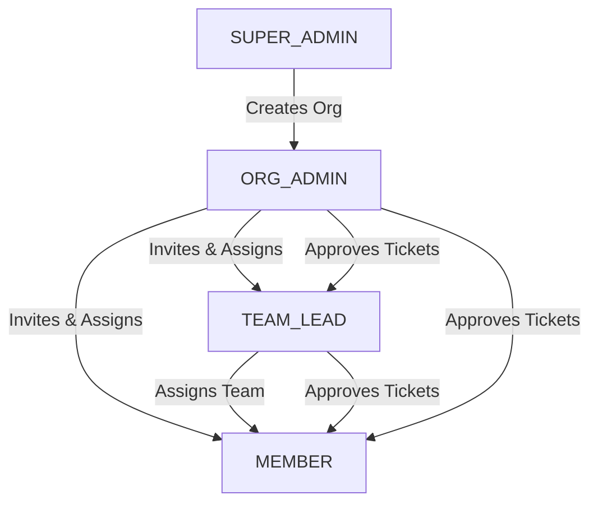
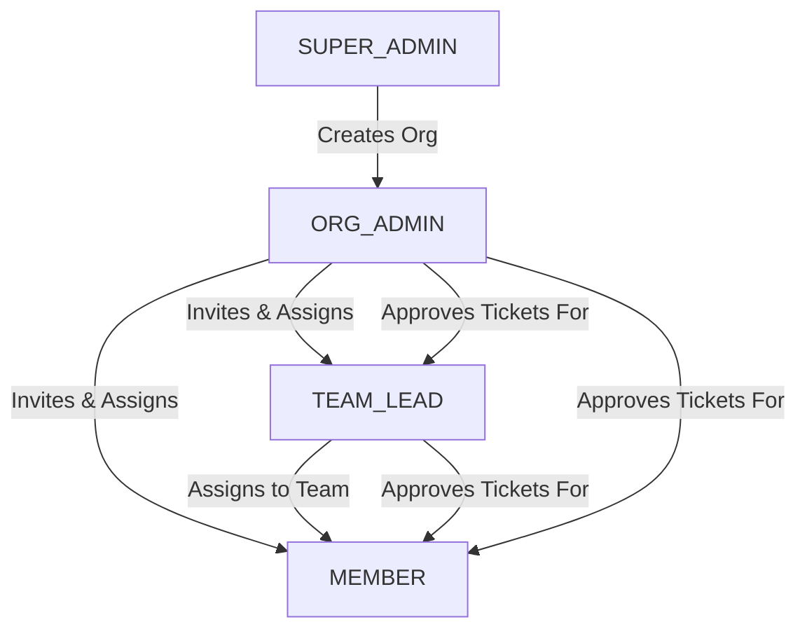
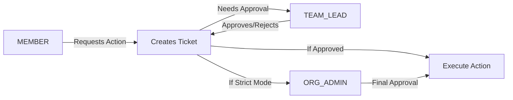
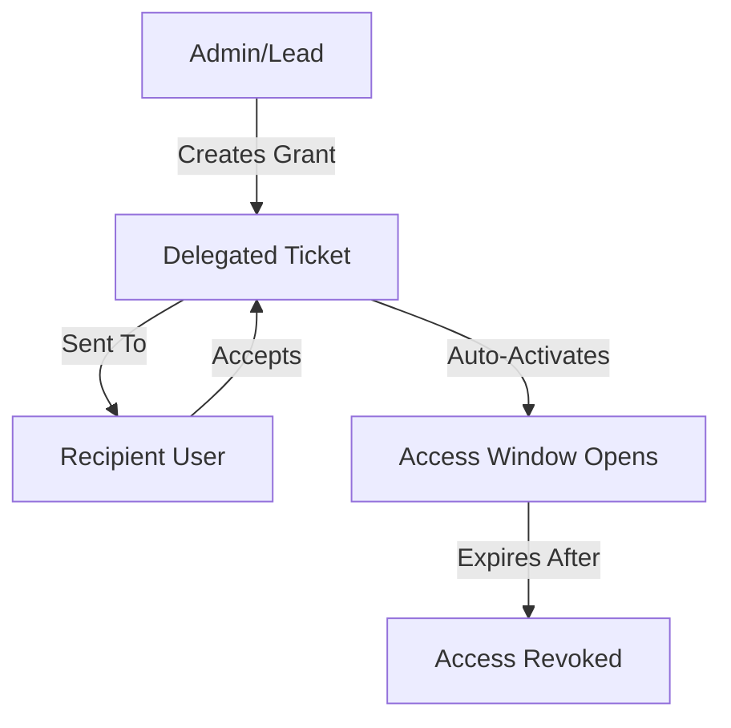
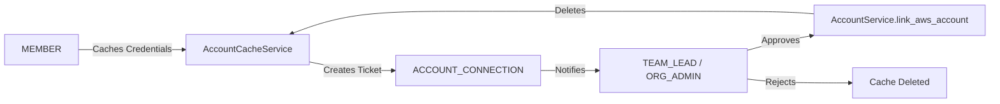

# Comprehensive RBAC, Permissions & Security Reference
**Last Updated:** 2026-01-19  
**Version:** 2.2 (Cost Optimization Added)  
**Status:** Single Source of Truth for all RBAC definitions

> This document consolidates **all** role-based access control (RBAC) definitions, permissions, security best practices, and future roadmap for the Spot Optimizer platform. This is the **canonical reference** for roles and permissions.

---

## Table of Contents

1. [Role Definitions](#1-role-definitions)
2. [Access Level Hierarchy](#2-access-level-hierarchy)
3. [Comprehensive Permission Matrix](#3-comprehensive-permission-matrix)
4. [Team Member Permission Overrides](#4-team-member-permission-overrides)
5. [Security Best Practices](#5-security-best-practices)
6. [Permission Delegation Flows](#6-permission-delegation-flows)
7. [API Endpoints by Permission Level](#7-api-endpoints-by-permission-level)
8. [Current Implementation Status](#8-current-implementation-status)
9. [Future Enhancement Roadmap](#9-future-enhancement-roadmap)
10. [Migration & Compatibility Notes](#10-migration--compatibility-notes)

---

## 1. Role Definitions

### 1.1 Role Hierarchy Diagram



### 1.2 Role Details

| Role | Scope | Reports To | Assigned By | Description | Primary Use Case |
|:-----|:------|:-----------|:------------|:------------|:-----------------|
| **SUPER_ADMIN** | Platform | N/A | System Only | Platform administrator with global, unrestricted access across **all** organizations. Manages tenants, platform health, ML models, and global configuration. Cannot be assigned by any user. | SaaS platform operator, DevOps team, Platform engineers |
| **ORG_ADMIN** | Organization | N/A (Owner) | System (Signup), SUPER_ADMIN | Organization owner with full administrative rights. Auto-created on signup. Can manage all users, teams, AWS accounts, policies, and resources within their org. | Company IT Admin, Cloud Ops Manager, CTO |
| **CLIENT** | Organization | N/A | N/A | **Legacy Alias** for ORG_ADMIN. Kept for backward compatibility with older API clients. Functionally identical to ORG_ADMIN. | Deprecated - use ORG_ADMIN |
| **TEAM_LEAD** | Team | ORG_ADMIN | ORG_ADMIN | Team manager with authority over team members, team-level governance, approval workflows, and granular member permission overrides. | Engineering Manager, Team Supervisor, Technical Lead |
| **MEMBER** | Individual | TEAM_LEAD | ORG_ADMIN, TEAM_LEAD | Standard user with limited permissions. Requires approval for sensitive/destructive actions via JIT ticketing. Designed for least-privilege access. | Developer, Analyst, Junior Engineer, Consultant |

### 1.3 Role Capabilities Summary

| Capability | SUPER_ADMIN | ORG_ADMIN | TEAM_LEAD | MEMBER |
|:-----------|:-----------:|:---------:|:---------:|:------:|
| Full platform access | ✅ | ❌ | ❌ | ❌ |
| Manage organizations | ✅ | ❌ | ❌ | ❌ |
| Manage all org users | ✅ | ✅ | ❌ | ❌ |
| Manage team & members | ✅ | ✅ | ✅ (own) | ❌ |
| Connect AWS accounts | ✅ | ✅ | ✅ | ❌ (request) |
| Execute cleanup | ✅ | ✅ | ✅ | ⚠️ JIT |
| Create policies | ✅ | ✅ | ✅ | ❌ |
| Approve tickets | ✅ | ✅ | ✅ (team) | ❌ |
| View audit logs | ✅ | ✅ (org) | ✅ (team) | ❌ |
| Request JIT access | ❌ | ❌ | ❌ | ✅ |

---

## 2. Access Level Hierarchy

In addition to roles, the system uses an **Access Level** hierarchy for fine-grained control within API endpoints:

| Access Level | Permissions Included | Granted To | Security Implication | Backend Check |
|:-------------|:--------------------|:-----------|:---------------------|:--------------|
| **READ_ONLY** | View resources, dashboards, reports, audit logs (role-filtered) | All roles (base) | Minimal risk - observation only | `access_level >= READ_ONLY` |
| **EXECUTION** | READ_ONLY + Execute cleanup, create templates/policies, register clusters, install agents | TEAM_LEAD, ORG_ADMIN, SUPER_ADMIN | Medium risk - can modify infrastructure | `access_level >= EXECUTION` |
| **FULL** | EXECUTION + Delete accounts, set org defaults, suspend orgs, critical config changes | ORG_ADMIN, SUPER_ADMIN | High risk - destructive actions allowed | `access_level == FULL` |

### 2.1 Access Level Enforcement

```python
# Example: Checking access level in service layer
def require_execution_access(user: User):
    if user.access_level.value < AccessLevel.EXECUTION.value:
        raise ForbiddenError("Requires EXECUTION access level")
```

---

## 3. Comprehensive Permission Matrix

### 3.1 User & Access Management

| Permission | SUPER_ADMIN | ORG_ADMIN | TEAM_LEAD | MEMBER | Description | Security Impact |
|:-----------|:-----------:|:---------:|:---------:|:------:|:------------|:----------------|
| View all platform users | ✅ | ❌ | ❌ | ❌ | List users across all orgs | High - Cross-org visibility |
| View organization members | ✅ | ✅ | ✅ (Team only) | ❌ | List users in own org/team | Medium - PII access |
| Invite users to organization | ✅ | ✅ | ❌ | ❌ | Create new users with PENDING_INVITE status | Medium - Identity provisioning |
| Invite users to team | ✅ | ✅ | ✅ | ❌ | Add user to team with default password | Medium - Team expansion |
| Assign SUPER_ADMIN role | ✅ (system only) | ❌ | ❌ | ❌ | Elevate to platform admin | Critical - Platform control |
| Assign ORG_ADMIN role | ✅ | ❌ | ❌ | ❌ | Elevate to org admin | High - Org-wide access |
| Assign TEAM_LEAD role | ✅ | ✅ | ❌ | ❌ | Promote to team manager | Medium - Team control |
| Assign MEMBER role | ✅ | ✅ | ✅ | ❌ | Standard role assignment | Low |
| Update user roles | ✅ | ✅ (within org) | ❌ | ❌ | Change existing user roles | High - Privilege escalation risk |
| Remove users from org | ✅ | ✅ (within org) | ❌ | ❌ | Delete/disable user | High - Access revocation |
| Remove users from team | ✅ | ✅ | ✅ (own team) | ❌ | Unassign from team | Low |
| Update member granular permissions | ✅ | ✅ | ✅ (own team) | ❌ | Set overrides via `team_member_permissions` | Medium - Fine-grained control |

### 3.2 Organization & Team Management

| Permission | SUPER_ADMIN | ORG_ADMIN | TEAM_LEAD | MEMBER | Description | Security Impact |
|:-----------|:-----------:|:---------:|:---------:|:------:|:------------|:----------------|
| Create organizations | ✅ | ❌ | ❌ | ❌ | Provision new tenant | High - Multi-tenancy |
| View organization list | ✅ | ❌ | ❌ | ❌ | Platform-wide org visibility | High - Cross-tenant data |
| Suspend/Activate organizations | ✅ | ❌ | ❌ | ❌ | Toggle org status | Critical - Service availability |
| Configure org governance | ✅ | ✅ | ❌ | ❌ | Set approval rules, strict mode | High - Policy enforcement |
| View organization details | ✅ | ✅ (own org) | ❌ | ❌ | Org settings and config | Medium |
| Get connection info (External ID) | ✅ | ✅ | ✅ | ✅ | View org's AWS trust parameters | Low |
| Create teams | ✅ | ✅ | ❌ | ❌ | Add new team structure | Low |
| Rename teams | ✅ | ✅ | ✅ (own team) | ❌ | Modify team name | Low |
| Configure team governance | ✅ | ✅ | ✅ (own team) | ❌ | Set team-level approval rules | Medium - Team policies |
| View team details | ✅ | ✅ | ✅ (own team) | ❌ | Team members, stats | Low |
| View team analytics | ✅ | ✅ | ✅ (own team) | ❌ | Cost/waste metrics for team | Medium - Financial data |

### 3.3 AWS Account & Cloud Integration

| Permission | SUPER_ADMIN | ORG_ADMIN | TEAM_LEAD | MEMBER | Description | Security Impact |
|:-----------|:-----------:|:---------:|:---------:|:------:|:------------|:----------------|
| Connect AWS account (direct) | ✅ | ✅ | ✅ | ❌ | Link account with Role ARN using org External ID | Critical - Cloud access |
| Request account connection | ❌ | ❌ | ❌ | ✅ | Create ACCOUNT_CONNECTION ticket for approval | Low - Requires approval |
| View cloud integrations | ✅ | ✅ | ✅ | ✅ | List connected accounts | Low |
| Disconnect AWS accounts | ✅ | ✅ | ❌ | ❌ | Remove account link | High - Data loss |
| Validate credentials | ✅ | ✅ | ✅ | ❌ | Test STS assume-role | Medium - Credential verification |
| View connection info | ✅ | ✅ | ✅ | ✅ | Get External ID, Platform Account ID, Template URL | Low |
| Set default account | ✅ | ✅ | ❌ | ❌ | Primary account for operations | Medium |
| Approve account connections | ✅ | ✅ | ✅ | ❌ | Approve MEMBER requests | Medium |

### 3.4 Cluster & Resource Management

| Permission | SUPER_ADMIN | ORG_ADMIN | TEAM_LEAD | MEMBER | Description | Security Impact |
|:-----------|:-----------:|:---------:|:---------:|:------:|:------------|:----------------|
| Discover clusters | ✅ | ✅ | ✅ | ✅ | Scan for EKS/Kubernetes clusters | Low |
| Register new clusters | ✅ | ✅ | ✅ | ❌ | Add cluster to platform | Medium - Workload visibility |
| View cluster details | ✅ | ✅ | ✅ | ✅ | Node groups, health status | Low |
| Install agent | ✅ | ✅ | ✅ | ❌ | Deploy agent to cluster | High - Cluster modification |
| Create node templates | ✅ | ✅ | ✅ | ❌ | Define instance configurations | Medium |
| Set default templates | ✅ | ✅ | ❌ | ❌ | Org-wide defaults | Medium |
| Create cluster policies | ✅ | ✅ | ✅ | ❌ | Scaling/optimization rules | Medium |
| Update cluster policies | ✅ | ✅ | ✅ | ❌ | Modify existing rules | Medium |
| Delete cluster policies | ✅ | ✅ | ❌ | ❌ | Remove rules | Medium |
| Create hibernation schedules | ✅ | ✅ | ✅ | ❌ | Scheduled cluster hibernation | Medium |

### 3.5 Cleanup & Cost Optimization

| Permission | SUPER_ADMIN | ORG_ADMIN | TEAM_LEAD | MEMBER | Description | Security Impact |
|:-----------|:-----------:|:---------:|:---------:|:------:|:------------|:----------------|
| Scan resources | ✅ | ✅ | ✅ | ✅ | Identify idle/unused resources | Low |
| Execute cleanup actions | ✅ | ✅ | ✅ | ⚠️ JIT | Delete/stop resources | Critical - Infrastructure deletion |
| Authorize resources (exclude) | ✅ | ✅ | ✅ | ❌ | Exclude from cleanup | Medium - Override protection |
| View authorized list | ✅ | ✅ | ✅ | ✅ | See exclusions | Low |
| Terminate instances | ✅ | ✅ | ✅ | ⚠️ JIT | Stop/terminate EC2 | Critical |
| Delete volumes | ✅ | ✅ | ✅ | ⚠️ JIT | Remove EBS volumes | Critical |
| Delete snapshots | ✅ | ✅ | ✅ | ⚠️ JIT | Remove backups | Critical |
| Delete unused AMIs | ✅ | ✅ | ✅ | ⚠️ JIT | Remove images | Critical |
| Trigger Cost Analysis | ✅ | ✅ | ❌ | ❌ | Scan RI, S3, RDS, Transfer | Medium - API Costs |
| View Cost Details | ✅ | ✅ | ✅ | ✅ | View RI, S3, RDS, Transfer reports | Low |

> ⚠️ **JIT** = Just-In-Time access. MEMBER must request via ticket and receive approval before action can be performed.

### 3.6 JIT Governance & Tickets

| Permission | SUPER_ADMIN | ORG_ADMIN | TEAM_LEAD | MEMBER | Description | Security Impact |
|:-----------|:-----------:|:---------:|:---------:|:------:|:------------|:----------------|
| Create ACCESS_WINDOW request | ❌ | ❌ | ❌ | ✅ | Request time-limited elevated access | Low |
| Create ACTION request | ❌ | ❌ | ❌ | ✅ | Request one-time action approval | Low |
| Create ACCOUNT_CONNECTION request | ❌ | ❌ | ❌ | ✅ | Request AWS account linking | Low |
| Grant delegated access | ✅ | ✅ | ✅ | ❌ | Pre-approve access for others | Medium |
| Approve tickets (org-wide) | ✅ | ✅ | ❌ | ❌ | Approve any org ticket | Medium |
| Approve tickets (team only) | ✅ | ✅ | ✅ | ❌ | Approve team member tickets | Medium |
| Reject tickets | ✅ | ✅ | ✅ (team) | ❌ | Deny requests | Medium |
| Revoke active tickets | ✅ | ✅ | ✅ (own grants) | ❌ | Cancel active access | Medium |
| View all org tickets | ✅ | ✅ | ❌ | ❌ | See full ticket history | Low |
| View team tickets | ✅ | ✅ | ✅ | ❌ | See team ticket history | Low |
| View own tickets | ✅ | ✅ | ✅ | ✅ | Personal ticket history | Low |

### 3.7 Audit & Compliance

| Permission | SUPER_ADMIN | ORG_ADMIN | TEAM_LEAD | MEMBER | Description | Security Impact |
|:-----------|:-----------:|:---------:|:---------:|:------:|:------------|:----------------|
| View global audit logs | ✅ | ❌ | ❌ | ❌ | All platform activity | High - Sensitive data |
| View org audit logs | ✅ | ✅ | ❌ | ❌ | Organization-scoped logs | Medium |
| View team audit logs | ✅ | ✅ | ✅ | ❌ | Team-scoped logs | Low |
| Export audit logs | ✅ | ✅ | ❌ | ❌ | Download CSV/JSON | Medium - Data exfiltration |
| View platform health | ✅ | ❌ | ❌ | ❌ | System status, uptime | Low |
| View platform stats | ✅ | ❌ | ❌ | ❌ | MRR, tenant count, revenue | High - Business data |
| View org stats | ✅ | ✅ (own org) | ❌ | ❌ | Cost metrics, usage | Medium |
| View team stats | ✅ | ✅ | ✅ (own team) | ❌ | Team-level metrics | Low |

### 3.8 Settings & Configuration

| Permission | SUPER_ADMIN | ORG_ADMIN | TEAM_LEAD | MEMBER | Description | Security Impact |
|:-----------|:-----------:|:---------:|:---------:|:------:|:------------|:----------------|
| Access Settings page | ✅ | ✅ | ✅ | ✅ | Base settings access | Low |
| Configure cloud integrations | ✅ | ✅ | ✅ | View Only | Modify AWS connections | High |
| Manage billing (Stripe) | ✅ | ✅ | ❌ | ❌ | Subscription management | High - Financial |
| Update personal profile | ✅ | ✅ | ✅ | ✅ | Name, password, etc. | Low |
| Update dashboard preferences | ✅ | ✅ | ✅ | ✅ | Widget layout customization | Low |
| Configure global settings | ✅ | ❌ | ❌ | ❌ | Platform-wide defaults | Critical |
| Manage ML models | ✅ | ❌ | ❌ | ❌ | Model registry | High |

---

## 4. Team Member Permission Overrides

Team Leads can set granular permission overrides for individual team members using the `team_member_permissions` JSON field in the User model.

### 4.1 Available Override Keys

| Override Key | Type | Default | Description | Use Case |
|:-------------|:-----|:--------|:------------|:---------|
| `allow_termination` | boolean | `true` | Can terminate EC2 instances | Restrict destructive actions for juniors |
| `allow_cleanup` | boolean | `true` | Can execute cleanup actions | Prevent accidental resource deletion |
| `view_audit_logs` | boolean | `false` | Access to team audit logs | Enable compliance visibility |
| `read_only` | boolean | `false` | **Master override** - restricts to view-only | Observers, finance, temporary access |
| `allow_policy_edit` | boolean | `true` | Can modify cluster policies | Protect critical configurations |
| `allow_template_creation` | boolean | `true` | Can create node templates | Control infrastructure patterns |
| `allow_account_request` | boolean | `true` | Can request AWS account connection | Limit connection requests |
| `allow_agent_install` | boolean | `true` | Can install K8s agents | Protect cluster integrity |

### 4.2 Override Precedence

```
1. Base Role Permissions (UserRole)
   ↓
2. Access Level (READ_ONLY/EXECUTION/FULL)
   ↓
3. Team Member Overrides (team_member_permissions)  ← Highest Priority
```

### 4.3 API Example

```bash
PUT /api/v1/teams/{team_id}/members/{member_id}/permissions
Content-Type: application/json

{
  "permissions": {
    "allow_termination": false,
    "read_only": true
  }
}
```

---

## 5. Security Best Practices

### 5.1 Core Security Principles (Implemented)

| Principle | Implementation | Benefit | Status |
|:----------|:---------------|:--------|:-------|
| **Least Privilege** | Users start as MEMBER, elevated only when necessary | Minimizes blast radius | ✅ Active |
| **Approval Gating** | Sensitive actions (cleanup, account connection) require explicit approval | Prevents accidental destruction | ✅ Active |
| **Audit Trail** | All actions logged with actor, timestamp, IP, and outcome | Forensic capability | ✅ Active |
| **Role Segregation** | SUPER_ADMIN cannot be assigned by anyone except system | Prevents admin hijacking | ✅ Active |
| **Organization Isolation** | Users can only access resources within their organization | Multi-tenancy security | ✅ Active |
| **Credential Encryption** | AWS credentials cached with Fernet (AES-128) encryption | Secure at-rest storage | ✅ Active |
| **Token Expiration** | JIT access expires after configured `duration_hours` | Time-boxed access | ✅ Active |
| **External ID Enforcement** | Organization-specific External ID for AWS trust policies | Prevents confused deputy attack | ✅ Active |
| **Password Reset on Invite** | Invited users must reset default password | Secure onboarding | ✅ Active |

### 5.2 Recommended Security Enhancements

| Enhancement | Priority | Description | Implementation | Status |
|:------------|:---------|:------------|:---------------|:-------|
| **MFA Enforcement** | 🔴 Critical | Require MFA for SUPER_ADMIN, optional for others | PyOTP/TOTP integration | 🔲 Planned |
| **Session Management** | 🔴 Critical | Force re-auth after 8h, idle timeout 30m | JWT exp/iat claims | 🔲 Planned |
| **IP Allowlisting** | 🟡 High | Restrict admin access to known IPs | Middleware + org config | 🔲 Planned |
| **Password Complexity** | 🟡 High | Min 12 chars, uppercase, number, symbol | Validation in auth service | 🔲 Planned |
| **Failed Login Lockout** | 🟡 High | Lock account after 5 failed attempts for 15m | Rate limiting + temp ban | 🔲 Planned |
| **API Rate Limiting** | 🟡 High | Per-user, per-endpoint limits | Redis-backed throttling | 🔲 Planned |
| **Sensitive Action Confirmation** | 🟢 Medium | Re-enter password for destructive ops | Frontend modal + API check | 🔲 Planned |
| **Audit Log Retention** | 🟢 Medium | Keep logs for 1 year, archive older | Background job + S3 | 🔲 Planned |
| **Anomaly Detection** | 🟢 Medium | Alert on unusual activity patterns | ML-based or rule-based | 🔲 Planned |
| **Role Expiration** | 🟢 Medium | Temporary role elevations with auto-revert | `role_expires_at` field | 🔲 Planned |
| **SSO Integration** | 🟢 Medium | SAML/OIDC for enterprise customers | Auth0/Okta integration | 🔲 Planned |
| **API Key Scopes** | 🟢 Medium | Scoped API keys for programmatic access | Extend APIKey model | 🔲 Planned |

---

## 6. Permission Delegation Flows

### 6.1 Role Assignment Flow



### 6.2 MEMBER Action Request Flow



### 6.3 Delegated Access Flow



### 6.4 Account Connection Request Flow



---

## 7. API Endpoints by Permission Level

### 7.1 SUPER_ADMIN Only Endpoints

| Endpoint | Method | Description |
|:---------|:-------|:------------|
| `/api/v1/admin/*` | ALL | All admin routes |
| `/api/v1/organizations/` | POST | Create organization |
| `/api/v1/organizations/{id}/suspend` | POST | Suspend org |
| `/api/v1/organizations/{id}/activate` | POST | Activate org |
| `/api/v1/admin/health` | GET | Platform health |
| `/api/v1/admin/stats` | GET | Platform statistics |
| `/api/v1/admin/config` | PUT | Global configuration |

### 7.2 ORG_ADMIN+ Endpoints

| Endpoint | Method | Description |
|:---------|:-------|:------------|
| `/api/v1/accounts/{id}` | DELETE | Remove AWS account |
| `/api/v1/organization/members/{id}` | DELETE | Remove user from org |
| `/api/v1/organization/invite` | POST | Invite user |
| `/api/v1/billing/*` | ALL | Billing management |
| `/api/v1/ri/analyze` | POST | Trigger RI analysis |
| `/api/v1/s3/analyze` | POST | Trigger S3 analysis |
| `/api/v1/rds/analyze` | POST | Trigger RDS analysis |
| `/api/v1/transfer/analyze` | POST | Trigger Transfer analysis |

### 7.3 TEAM_LEAD+ Endpoints

| Endpoint | Method | Description | Scope |
|:---------|:-------|:------------|:------|
| `/api/v1/teams/{id}/governance` | PUT | Update governance | Own team |
| `/api/v1/teams/{id}/members/{id}/permissions` | PUT | Update member perms | Own team |
| `/api/v1/cleanup/execute` | POST | Execute cleanup | Or MEMBER w/ JIT |
| `/api/v1/tickets/{id}/approve` | POST | Approve tickets | Team members |
| `/api/v1/templates/` | POST | Create templates | |
| `/api/v1/policies/` | POST | Create policies | |

### 7.4 All Authenticated Users

| Endpoint | Method | Description |
|:---------|:-------|:------------|
| `/api/v1/metrics/*` | GET | Metrics (role-filtered) |
| `/api/v1/audit/` | GET | Audit logs (role-filtered) |
| `/api/v1/users/me` | GET/PATCH | Own profile |
| `/api/v1/users/me/preferences` | GET/PATCH | Dashboard preferences |
| `/api/v1/organization/connection-info` | GET | AWS connection params |
| `/api/v1/clusters/` | GET | List clusters |
| `/api/v1/cleanup/scan` | POST | Scan for resources |
| `/api/v1/ri/overview` | GET | RI Analysis summary |
| `/api/v1/s3/overview` | GET | S3 Analysis summary |
| `/api/v1/rds/overview` | GET | RDS Analysis summary |
| `/api/v1/transfer/overview` | GET | Transfer Analysis summary |

---

## 8. Current Implementation Status

### 8.1 Implemented Features

| Feature | Status | Backend | Frontend | Notes |
|:--------|:------:|:-------:|:--------:|:------|
| 5-Role Hierarchy | ✅ | ✅ | ✅ | SUPER_ADMIN, ORG_ADMIN, CLIENT, TEAM_LEAD, MEMBER |
| Access Levels | ✅ | ✅ | - | READ_ONLY, EXECUTION, FULL |
| Organization Isolation | ✅ | ✅ | ✅ | Enforced at service layer |
| Team Management | ✅ | ✅ | ✅ | Create, rename, assign, remove |
| Team Governance | ✅ | ✅ | ✅ | `governance_config` JSON |
| Team Member Permissions | ✅ | ✅ | ✅ | `team_member_permissions` JSON, DB migrated (5f5416e8114a) |
| JIT Tickets | ✅ | ✅ | ✅ | ACCESS_WINDOW, ACTION, ACCOUNT_CONNECTION |
| Delegated Access | ✅ | ✅ | ✅ | Admin/Lead grants |
| Audit Logging | ✅ | ✅ | ✅ | Role-filtered views |
| Dashboard Customization | ✅ | ✅ | ✅ | `preferences` JSON, widget registry |
| Org External ID | ✅ | ✅ | ✅ | Standardized AWS trust |
| Credential Encryption | ✅ | ✅ | - | Fernet encryption |
| Cost Optimization (4 Features) | ✅ | ✅ | ✅ | RI, S3, RDS, Transfer Analysis (Models, Services, API, UI) |

### 8.2 Partially Implemented

| Feature | Backend | Frontend | Missing |
|:--------|:-------:|:--------:|:--------|
| Account Connection Modal | ✅ | 🔲 | Frontend modal UX |
| Audit Log Export | 🔲 | 🔲 | Export endpoint |

---

## 9. Future Enhancement Roadmap

| Feature | Priority | Target Roles | Description | Implementation Notes |
|:--------|:---------|:-------------|:------------|:---------------------|
| **MFA Enforcement** | 🔴 Critical | All | TOTP-based MFA | PyOTP, QR code setup |
| **API Key Management** | 🟡 High | ORG_ADMIN, TEAM_LEAD | Scoped API keys | Extend APIKey model |
| **Resource Tagging Policies** | 🟡 High | ORG_ADMIN | Mandatory tags, compliance | Extend governance_config |
| **Budget Alerts** | 🟡 High | ORG_ADMIN, TEAM_LEAD | Cost threshold notifications | CloudWatch + SNS |
| **Scheduled Reports** | 🟢 Medium | ORG_ADMIN, TEAM_LEAD | Weekly/monthly email reports | Celery Beat + templates |
| **Read-Only Observer Role** | 🟢 Medium | New Role | View-only for stakeholders | Add OBSERVER to UserRole |
| **Custom Approval Workflows** | 🟢 Medium | ORG_ADMIN | Multi-stage chains | Workflow state machine |
| **Cluster Sharing** | 🟢 Medium | TEAM_LEAD | Cross-team cluster access | ClusterShare model |
| **Real-Time Notifications** | 🟢 Medium | All | WebSocket notifications | Socket.io |
| **Role Expiration** | 🟢 Medium | ORG_ADMIN | Temporary role elevations | `role_expires_at` field |
| **SSO/SAML Integration** | 🟢 Medium | Enterprise | Auth0, Okta, Azure AD | OIDC flow |
| **Cross-Org Billing** | 🟡 Low | SUPER_ADMIN | Parent-child billing hierarchy | Complex billing model |

---

## 10. Migration & Compatibility Notes

### 10.1 Backward Compatibility

| Item | Details |
|:-----|:--------|
| **CLIENT Role** | Legacy alias for ORG_ADMIN. Fully functional. Will be deprecated in v3.0. |
| **Team Assignment** | Optional. Users without teams report directly to ORG_ADMIN. |
| **Default Role** | New users created with MEMBER role unless explicitly specified. |
| **Password Reset** | Invited users have `must_reset_password=true` flag set. |
| **External ID** | All orgs now have unique `external_id` in Organization model. |

### 10.2 Database Columns Added

| Table | Column | Type | Purpose |
|:------|:-------|:-----|:--------|
| `users` | `team_member_permissions` | JSON | Granular overrides |
| `users` | `preferences` | JSON | Dashboard customization |
| `organizations` | `external_id` | String(36) | AWS trust policy |
| `teams` | `governance_config` | JSON | Team-level rules |
| `tickets` | `parent_id` | String(36) | Delegated access linking |

---

## Appendix: Quick Reference Card

```
┌─────────────────────────────────────────────────────────────────────┐
│                    ROLE QUICK REFERENCE                             │
├─────────────────────────────────────────────────────────────────────┤
│ SUPER_ADMIN   │ Platform owner. All access. System-assigned only.  │
│ ORG_ADMIN     │ Org owner. Full org access. Created on signup.     │
│ TEAM_LEAD     │ Team manager. Team governance + approvals.         │
│ MEMBER        │ Standard user. Needs approval for sensitive ops.   │
├─────────────────────────────────────────────────────────────────────┤
│                   ACCESS LEVEL QUICK REFERENCE                      │
├─────────────────────────────────────────────────────────────────────┤
│ READ_ONLY     │ View only. All roles have this.                    │
│ EXECUTION     │ READ + Modify. TEAM_LEAD and above.                │
│ FULL          │ All actions including delete. ORG_ADMIN and above. │
├─────────────────────────────────────────────────────────────────────┤
│                     JIT TICKET TYPES                                │
├─────────────────────────────────────────────────────────────────────┤
│ ACCESS_WINDOW │ Time-limited elevated access                       │
│ ACTION        │ One-time action approval                           │
│ ACCOUNT_CONNECTION │ AWS account linking request                   │
└─────────────────────────────────────────────────────────────────────┘
```