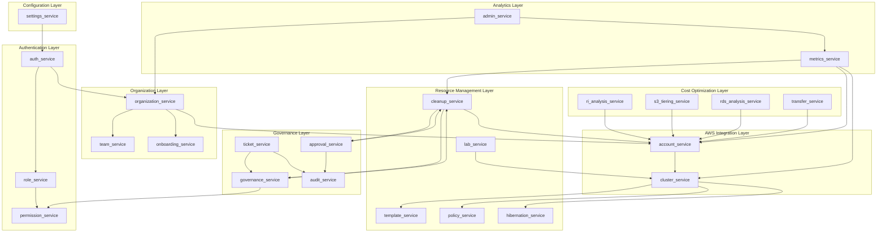

# Backend Services Logic Reference
**Last Updated:** 2026-01-19  
**Version:** 1.0  
**Status:** Comprehensive technical reference for all backend services

> This document provides detailed logic descriptions, dependencies, and scenario-based explanations for all backend service files in the Spot Optimizer platform.

---

## Table of Contents

1. [Service Overview Table](#1-service-overview-table)
2. [Authentication & Authorization Services](#2-authentication--authorization-services)
3. [Organization & Team Services](#3-organization--team-services)
4. [AWS Integration Services](#4-aws-integration-services)
5. [Resource Management Services](#5-resource-management-services)
6. [Cost Optimization Services](#6-cost-optimization-services)
7. [Governance & Compliance Services](#7-governance--compliance-services)
8. [Analytics & Reporting Services](#8-analytics--reporting-services)
9. [Service Dependency Diagram](#9-service-dependency-diagram)

---

## 1. Service Overview Table

| Service File | Primary Purpose | API Routes | Frontend Components | Key Models |
|:-------------|:----------------|:-----------|:--------------------|:-----------|
| `auth_service.py` | User authentication, signup, login, token management | `/api/v1/auth/*` | `LoginPage`, `SignupPage`, `useAuth` hook | `User`, `TokenResponse` |
| `account_service.py` | AWS account linking, verification, management | `/api/v1/accounts/*` | `CloudIntegration`, `AccountCard` | `Account` |
| `admin_service.py` | Super admin operations, platform-wide management | `/api/v1/admin/*` | `AdminDashboard`, `AdminClients`, `AdminHealth` | `User`, `Organization` |
| `approval_service.py` | Approval workflow for sensitive actions | (Internal) | `ApprovalQueue` | `Ticket` |
| `audit_service.py` | Audit logging and compliance tracking | `/api/v1/audit/*` | `AuditLog` | `AuditLog` |
| `cleanup_service.py` | Orphaned resource scanning, cleanup execution | `/api/v1/cleanup/*` | `CleanupDashboard`, `ResourceTable` | `ResourceItem`, `CleanupSummary` |
| `cluster_service.py` | K8s cluster discovery, registration, agent management | `/api/v1/clusters/*` | `ClusterList`, `ClusterCard`, `AgentInstaller` | `Cluster` |
| `governance_service.py` | JIT governance checks, permission validation | `/api/v1/governance/*` | `JITInterceptor` | `Ticket`, `User` |
| `hibernation_service.py` | Cluster hibernation scheduling | `/api/v1/schedules/*` | `HibernationScheduler` | `HibernationSchedule` |
| `lab_service.py` | ML experimentation, A/B testing | `/api/v1/experiments/*` | `LabExperiments`, `ExperimentResults` | `LabExperiment` |
| `metrics_service.py` | KPI calculation, dashboard metrics, cost analysis | `/api/v1/metrics/*` | `Dashboard`, `CostCharts`, `AccountAnalytics` | `Instance`, `CostMetric` |
| `onboarding_service.py` | New user/org onboarding flows | (Internal) | `OnboardingWizard` | `User`, `Organization` |
| `organization_service.py` | Organization member management, invitations | `/api/v1/organization/*` | `TeamManagement`, `InviteModal` | `User`, `Organization`, `Invitation` |
| `permission_service.py` | Permission evaluation utility | (Internal) | - | `Permission` |
| `policy_service.py` | Cluster optimization policy CRUD | `/api/v1/policies/*` | `PolicyBuilder`, `PolicyList` | `ClusterPolicy` |
| `rds_analysis_service.py` | RDS Multi-AZ analysis, optimization | `/api/v1/rds/*` | `RDSAnalysis` | `RDSAnalysis` |
| `ri_analysis_service.py` | Reserved Instance waste detection | `/api/v1/ri/*` | `RIAnalysis`, `RIRecommendations` | `RIUtilization` |
| `role_service.py` | RBAC role management, permission assignment | `/api/v1/roles/*` | `RoleEditor`, `PermissionMatrix` | `Role`, `Permission` |
| `s3_tiering_service.py` | S3 storage class optimization | `/api/v1/s3/*` | `S3Analysis`, `BucketOptimizer` | `S3BucketAnalysis` |
| `settings_service.py` | User preferences, dashboard customization | `/api/v1/settings/*` | `SettingsPage`, `PreferencesPanel` | `User.preferences` |
| `team_service.py` | Team CRUD, member assignment | `/api/v1/teams/*` | `TeamManagement`, `TeamDetails` | `Team`, `User` |
| `template_service.py` | Node template management | `/api/v1/templates/*` | `TemplateBuilder`, `TemplateList` | `NodeTemplate` |
| `ticket_service.py` | JIT access tickets, approval workflow | `/api/v1/tickets/*` | `TicketCenter`, `TicketRequestModal` | `Ticket` |
| `transfer_service.py` | Data transfer cost analysis | `/api/v1/transfer/*` | `TransferAnalysis` | `TransferAnalysis` |

---

## 2. Authentication & Authorization Services

### 2.1 `auth_service.py`

**Purpose:** Handles all user authentication operations including signup, login, token generation, and password management.

**Key Methods:**

| Method | Logic Description | Dependencies |
|:-------|:------------------|:-------------|
| `signup()` | Creates new user + organization, generates JWT tokens, sends welcome email | `User`, `Organization`, `hash_password`, `create_access_token` |
| `login()` | Validates credentials, generates access/refresh tokens, updates last_login | `User`, `verify_password`, `create_access_token` |
| `refresh_token()` | Validates refresh token, generates new access token | `decode_token`, `create_access_token` |
| `change_password()` | Verifies old password, updates hash in database | `User`, `hash_password`, `verify_password` |
| `get_user_profile()` | Returns user profile with organization details | `User`, `Organization` |

**Scenario: User Login Flow**
```
1. User submits email + password
2. auth_service.login() called
3. Query User by email
4. Verify password hash matches
5. If valid: Generate JWT access + refresh tokens
6. Return tokens + user profile to frontend
7. Frontend stores tokens in localStorage
8. axios interceptor adds Authorization header to all requests
```

---

### 2.2 `role_service.py`

**Purpose:** Manages RBAC roles and permissions, allowing custom role creation and permission assignment.

**Key Methods:**

| Method | Logic Description | Dependencies |
|:-------|:------------------|:-------------|
| `list_roles()` | Returns all system + custom roles for organization | `Role`, `Permission` |
| `create_role()` | Creates custom role with selected permissions | `Role`, `Permission` |
| `assign_role()` | Assigns role to user, grants inherited permissions | `User`, `Role` |
| `list_permissions()` | Returns all available permissions grouped by module | `Permission` |

**Scenario: Creating a Custom Role**
```
1. Org Admin opens Role Editor
2. Enters role name (e.g., "Finance Auditor")
3. Selects permissions from matrix (e.g., view costs, no cleanup)
4. role_service.create_role() called
5. Creates Role record with permission_slugs
6. Users can now be assigned this role
```

---

## 3. Organization & Team Services

### 3.1 `organization_service.py`

**Purpose:** Manages organization members, invitations, and role assignments within an organization.

**Key Methods:**

| Method | Logic Description | Dependencies |
|:-------|:------------------|:-------------|
| `list_members()` | Returns all users in organization with roles/teams | `User` |
| `create_invitation()` | Creates user with PENDING_INVITE status, default password | `User`, `hash_password` |
| `accept_invitation()` | Activates user account, requires password reset | `User`, `Invitation` |
| `remove_member()` | Deactivates user (preserves audit history) | `User` |
| `update_member_role()` | Changes user role (enforces hierarchy) | `User`, `UserRole` |
| `regenerate_external_id()` | Generates new External ID for AWS trust policy | `Organization` |

**Scenario: Inviting a New Team Member**
```
1. Org Admin clicks "Invite Member" in TeamManagement
2. Enters email, selects role (MEMBER), selects team
3. organization_service.create_invitation() called
4. Creates User with:
   - email: provided
   - password_hash: hash("demo1234")  
   - status: PENDING_INVITE
   - must_reset_password: true
5. User receives invite (email or message)
6. User logs in with default password
7. Forced to change password on first login
```

---

### 3.2 `team_service.py`

**Purpose:** Team CRUD operations, member assignment, and granular permission management.

**Key Methods:**

| Method | Logic Description | Dependencies |
|:-------|:------------------|:-------------|
| `create_team()` | Creates team (Org Admin only) | `Team` |
| `assign_member()` | Assigns user to team | `User`, `Team` |
| `invite_member()` | Creates new user directly into team | `User`, `Team`, `hash_password` |
| `get_team_stats()` | Returns member count, resource count, cost | `Team`, `User`, `Account` |
| `update_member_permissions()` | Sets granular overrides in `team_member_permissions` JSON | `User` |

**Scenario: Team Lead Restricting a Member**
```
1. Team Lead opens Team Management
2. Clicks on member -> "Configure Access"
3. Switches to "Custom Policy" mode
4. Deselects "allow_termination" permission
5. team_service.update_member_permissions() called
6. Sets user.team_member_permissions = {"allow_termination": false}
7. Member can no longer terminate instances directly
8. Must request via JIT ticket for termination
```

---

## 4. AWS Integration Services

### 4.1 `account_service.py`

**Purpose:** Links AWS accounts to the platform, verifies credentials via STS AssumeRole.

**Key Methods:**

| Method | Logic Description | Dependencies |
|:-------|:------------------|:-------------|
| `verify_connection()` | Tests STS AssumeRole with External ID | `boto3.client('sts')` |
| `link_aws_account()` | Stores account with role ARN, validates connection | `Account`, `verify_connection` |
| `list_accounts()` | Returns accounts based on RBAC (org scoped) | `Account`, `User` |
| `validate_account()` | Re-tests credentials, updates status | `Account`, `verify_connection` |
| `disconnect_account()` | Clears credentials, keeps historical data | `Account` |

**Scenario: Connecting an AWS Account**
```
1. User obtains CloudFormation template from platform
2. Deploys template in AWS (creates IAM Role with trust policy)
3. Copies Role ARN from CloudFormation outputs
4. Pastes Role ARN into Connect Account modal
5. account_service.link_aws_account() called:
   - Gets org's external_id
   - Calls STS AssumeRole with external_id
   - If successful, creates Account record
   - Stores role_arn, aws_account_id
6. Account appears in Cloud Integrations
```

---

### 4.2 `cluster_service.py`

**Purpose:** Discovers, registers, and manages Kubernetes clusters (EKS/self-managed).

**Key Methods:**

| Method | Logic Description | Dependencies |
|:-------|:------------------|:-------------|
| `discover_clusters()` | Scans AWS account for EKS clusters | `boto3.client('eks')`, `Account` |
| `register_cluster()` | Manually registers non-EKS cluster | `Cluster` |
| `connect_aws_cluster()` | Agentless connection via STS | `Cluster`, `Account` |
| `generate_agent_install_command()` | Creates kubectl command for agent deployment | `Cluster` |
| `update_heartbeat()` | Updates last_seen timestamp from agent | `Cluster` |

**Scenario: Discovering and Registering EKS Clusters**
```
1. User selects AWS account in UI
2. Clicks "Discover Clusters"
3. cluster_service.discover_clusters():
   - Assumes role into account
   - Calls eks.list_clusters()
   - For each cluster, gets describe_cluster()
   - Creates/updates Cluster records
4. User sees list of discovered clusters
5. Clicks "Install Agent" for each
6. Copies generated kubectl command
7. Runs in their cluster
8. Agent starts sending heartbeats
```

---

## 5. Resource Management Services

### 5.1 `cleanup_service.py`

**Purpose:** Scans for orphaned/idle resources, executes cleanup actions, supports resource discovery for JIT.

**Key Methods:**

| Method | Logic Description | Dependencies |
|:-------|:------------------|:-------------|
| `scan_resources()` | Parallel scan across regions for orphaned resources | `boto3`, `Account`, `Redis` (cache) |
| `_scan_region_worker()` | Scans single region: volumes, snapshots, IPs, instances, RDS | `boto3.client('ec2', 'rds')` |
| `check_dependencies()` | Checks if resource has blocking dependencies | `boto3.client('ec2')` |
| `execute_action()` | Terminates/deletes resource with RBAC + JIT checks | `boto3`, `governance_service` |
| `get_discoverable_resources()` | Lists resources by type for JIT ticket creation | `boto3.client('ec2', 'rds')` |

**Scenario: Scanning and Cleaning Orphaned Volumes**
```
1. User opens Cleanup Dashboard
2. Selects account, region: "All Regions"
3. cleanup_service.scan_resources():
   - Checks Redis cache (TTL 1h)
   - If miss, runs parallel scan across all regions
   - Identifies orphaned volumes (not attached)
   - Calculates cost_per_month for each
   - Caches result in Redis
4. UI displays ResourceTable with volumes
5. User selects volumes to delete
6. Clicks "Execute"
7. For MEMBER role:
   - governance_service intercepts
   - Creates JIT ACTION ticket
   - Waits for approval
8. For TEAM_LEAD+:
   - cleanup_service.execute_action()
   - Deletes volumes via ec2.delete_volume()
```

---

### 5.2 `template_service.py`

**Purpose:** Manages node templates defining instance families, architectures, and scaling strategies.

**Key Methods:**

| Method | Logic Description | Dependencies |
|:-------|:------------------|:-------------|
| `list_templates()` | Returns all templates for org | `NodeTemplate` |
| `create_template()` | Creates template with families, strategy, volume config | `NodeTemplate` |
| `update_template()` | Updates template properties | `NodeTemplate` |
| `set_default()` | Marks template as organization default | `NodeTemplate` |

**Scenario: Creating a GPU Node Template**
```
1. DevOps engineer opens Template Builder
2. Configures:
   - Name: "GPU Training Nodes"
   - Architecture: x86_64
   - Instance Families: p3, p4d, g4dn
   - Strategy: BALANCED
   - Root Volume: GP3, 100GB
3. template_service.create_template():
   - Validates family names against AWS
   - Creates NodeTemplate record
4. Template available in Policy Builder
5. Can be attached to cluster policies
```

---

### 5.3 `policy_service.py`

**Purpose:** Manages cluster optimization policies that define scaling rules and constraints.

**Key Methods:**

| Method | Logic Description | Dependencies |
|:-------|:------------------|:-------------|
| `create_policy()` | Creates policy linked to cluster + template | `ClusterPolicy`, `Cluster`, `NodeTemplate` |
| `list_policies()` | Returns policies with filters | `ClusterPolicy` |
| `toggle_policy()` | Enables/disables policy | `ClusterPolicy` |
| `get_policy_by_cluster()` | Gets active policy for a cluster | `ClusterPolicy`, `Cluster` |

**Scenario: Setting Up Spot Optimization Policy**
```
1. User selects cluster in UI
2. Opens Policy Builder
3. Configures:
   - Max Spot Percentage: 70%
   - Fallback to On-Demand: enabled
   - Target Template: "GPU Training Nodes"
   - Schedule: Always Active
4. policy_service.create_policy():
   - Links policy to cluster_id
   - Links to template_id
   - Sets optimization rules
5. Optimizer worker reads policy
6. Converts on-demand to spot as per rules
```

---

### 5.4 `hibernation_service.py`

**Purpose:** Manages hibernation schedules for automatic cluster scaling.

**Key Methods:**

| Method | Logic Description | Dependencies |
|:-------|:------------------|:-------------|
| `create_schedule()` | Creates schedule with 24x7 matrix | `HibernationSchedule`, `Cluster` |
| `get_active_schedules()` | Returns schedules due for execution | `HibernationSchedule` |
| `toggle_schedule()` | Enables/disables schedule | `HibernationSchedule` |

**Scenario: Scheduling Weekend Hibernation**
```
1. User opens Hibernation Scheduler
2. Paints schedule matrix:
   - Mon-Fri 9am-6pm: Active
   - All other times: Hibernate
3. hibernation_service.create_schedule():
   - Stores schedule_matrix (JSON 24x7)
   - Links to cluster_id
4. Background worker checks every hour
5. If current time = Hibernate:
   - Scales cluster to 0 nodes
6. If current time = Active:
   - Scales back to min_nodes
```

---

## 6. Cost Optimization Services

### 6.1 `ri_analysis_service.py`

**Purpose:** Detects Reserved Instance underutilization and waste through Cost Explorer integration.

**Key Methods:**

| Method | Logic Description | Dependencies |
|:-------|:------------------|:-------------|
| `analyze_all_accounts()` | Scans RI utilization across all org accounts | `Account`, `boto3.client('ce')` |
| `analyze_account()` | Gets RI utilization from Cost Explorer | `Account`, `RIUtilization` |
| `get_ri_overview()` | Dashboard summary with health status | `RIUtilization` |
| `get_ri_recommendations()` | Detailed recommendations for specific RI | `RIUtilization` |

**Scenario: Detecting Unused Reserved Instances**
```
1. System runs nightly RI analysis job
2. ri_analysis_service.analyze_all_accounts():
   - For each account:
     - Assumes role
     - Calls ce.get_reservation_utilization()
     - Processes each RI:
       - If utilization < 70%: UNDERUTILIZED
       - If unused for 14+ days: UNUSED
       - Calculates monthly_waste
     - Upserts RIUtilization records
3. User opens RI Analysis page
4. Sees dashboard:
   - Total RIs: 45
   - Healthy: 38
   - Underutilized: 5
   - Unused: 2
   - Monthly Waste: $1,234
5. Clicks on underutilized RI
6. Gets recommendations:
   - "Downsize to smaller instance"
   - "Convert to Convertible RI"
   - "Sell on RI Marketplace"
```

---

### 6.2 `s3_tiering_service.py`

**Purpose:** Analyzes S3 buckets for storage class optimization opportunities.

**Key Methods:**

| Method | Logic Description | Dependencies |
|:-------|:------------------|:-------------|
| `analyze_all_buckets()` | Scans all buckets across accounts | `Account`, `S3BucketAnalysis` |
| `analyze_bucket()` | Gets storage metrics from CloudWatch | `boto3.client('s3', 'cloudwatch')` |
| `get_overview()` | Dashboard with top opportunities | `S3BucketAnalysis` |

**Scenario: Recommending Intelligent Tiering**
```
1. System runs weekly S3 analysis
2. s3_tiering_service.analyze_all_buckets():
   - For each account:
     - Lists all S3 buckets
     - For each bucket:
       - Gets storage class breakdown (CloudWatch)
       - Calculates current monthly cost
       - If no lifecycle policy:
         - Estimates savings with Intelligent Tiering
       - Upserts S3BucketAnalysis record
3. User opens S3 Analysis page
4. Sees buckets sorted by potential savings
5. Clicks "Apply Recommendation"
6. Gets one-click lifecycle policy application
```

---

### 6.3 `rds_analysis_service.py`

**Purpose:** Analyzes RDS instances for Multi-AZ waste in non-production environments.

**Key Methods:**

| Method | Logic Description | Dependencies |
|:-------|:------------------|:-------------|
| `analyze_all()` | Scans all RDS instances across organization accounts | `Account`, `User`, `RDSInstanceAnalysis` |
| `analyze_instance()` | Evaluates single instance for Multi-AZ necessity | `boto3.client('rds')` |
| `_estimate_cost()` | Calculates monthly RDS cost based on engine/class | Pricing data |
| `get_overview()` | Returns dashboard summary with savings opportunities | `RDSInstanceAnalysis` |

**Non-Production Detection Keywords:**
- `dev`, `test`, `staging`, `uat`, `qa`, `sandbox`, `demo`

**Scenario: Detecting Unnecessary Multi-AZ**
```
1. Scheduled job triggers rds_analysis_service.analyze_all()
2. For each AWS account:
   - Assumes role via STS
   - Calls rds.describe_db_instances()
   - For each instance:
     a. Check MultiAZ status
     b. Extract Environment tag
     c. Match name against NON_PROD_KEYWORDS
     d. If non-prod AND Multi-AZ enabled:
        - Flag as "MULTI_AZ_NON_PROD"
        - Calculate savings (50% of current cost)
     e. Upsert RDSInstanceAnalysis record
3. User opens RDS Analysis page
4. Sees table:
   | DB Identifier | Engine | Multi-AZ | Env Tag | Monthly Cost | Savings |
   |---------------|--------|----------|---------|--------------|---------|
   | dev-mysql-01  | MySQL  | Yes      | dev     | $180         | $90     |
5. User clicks "Disable Multi-AZ" recommendation
```

---

### 6.4 `transfer_service.py`

**Purpose:** Analyzes data transfer costs using AWS Cost Explorer to identify optimization opportunities.

**Key Methods:**

| Method | Logic Description | Dependencies |
|:-------|:------------------|:-------------|
| `analyze_all()` | Scans all accounts for transfer costs | `Account`, `User` |
| `analyze_account_transfer()` | Queries Cost Explorer for 30-day transfer usage | `boto3.client('ce')` |
| `_interpret_usage()` | Categorizes usage types and generates recommendations | `DataTransferAnalysis` |
| `get_overview()` | Returns top transfer cost opportunities | `DataTransferAnalysis` |

**Transfer Types Detected:**

| Usage Type Pattern | Friendly Name | Recommendation |
|:-------------------|:--------------|:---------------|
| `NatGateway-Bytes` | NAT Gateway Data Processing | Use VPC Endpoints for S3/DynamoDB |
| `DataTransfer-Regional-Bytes` | Inter-AZ Data Transfer | Consolidate AZs |
| `InterAZ` | Inter-AZ Data Transfer | Consolidate AZs |
| `DataTransfer-Region-Bytes` | Inter-Region Data Transfer | Co-locate services |

**Scenario: Optimizing NAT Gateway Costs**
```
1. transfer_service.analyze_all() runs weekly
2. For each account:
   - Queries Cost Explorer for data transfer costs
   - Groups by USAGE_TYPE
   - For 'NatGateway-Bytes':
     - Assumes 40% is S3/DynamoDB traffic
     - Recommends VPC Endpoints (saves ~40%)
   - For 'Inter-AZ':
     - Recommends consolidating AZs (saves ~20%)
3. Stores DataTransferAnalysis records
4. User opens Transfer Analysis page
5. Sees:
   - Total Monthly Transfer Cost: $2,456
   - Estimated Savings: $892
   - Top Opportunity: "NAT Gateway - Use VPC Endpoints"
6. User implements VPC Endpoints for S3
7. Next month: Cost reduced by 40%
```

---

## 7. Governance & Compliance Services

### 7.1 `ticket_service.py`

**Purpose:** Manages JIT access tickets, approval workflows, and delegated access.

**Key Methods:**

| Method | Logic Description | Dependencies |
|:-------|:------------------|:-------------|
| `create_ticket()` | Creates ACCESS_WINDOW or ACTION request | `Ticket`, `User` |
| `list_tickets()` | Returns tickets based on RBAC | `Ticket` |
| `approve_ticket()` | Approves ticket, activates access window | `Ticket`, `governance_service` |
| `revoke_ticket()` | Immediately revokes active access | `Ticket` |
| `get_active_window()` | Checks if user has active elevated access | `Ticket` |
| `create_delegated_tickets()` | Admin grants access to multiple recipients | `Ticket` |
| `accept_grant()` | User accepts delegated access grant | `Ticket` |
| `reject_grant()` | User declines delegated access grant | `Ticket` |
| `check_specific_permission()` | Check for ACTION ticket for specific resource | `Ticket` |

**Ticket Types:**

| Type | Use Case | Fields Required |
|:-----|:---------|:----------------|
| `ACCESS_WINDOW` | Time-limited elevated access | `duration_hours`, `reason_text` |
| `ACTION` | One-time specific action | `action_type`, `resource_id`, `reason_text` |
| `ACCOUNT_CONNECTION` | Request to link AWS account | `account_id`, `role_arn` |

**Scenario: MEMBER Requesting Instance Termination**
```
1. Member tries to terminate instance
2. Frontend checks user.role = MEMBER
3. Opens TicketRequestModal instead of executing
4. Member fills:
   - Type: ACTION
   - Action: TERMINATE_INSTANCE
   - Resource ID: i-0abc123 (from Discover button)
   - Reason: "Orphaned test instance"
5. ticket_service.create_ticket():
   - Creates Ticket with status=PENDING
6. Team Lead gets notification
7. Reviews and approves
8. ticket_service.approve_ticket():
   - Sets status=APPROVED, activated_at=now
   - Sets expires_at = now + duration_hours
9. Member's cleanup action now succeeds
10. After expiry, ticket auto-revokes
```

**Scenario: Delegated Access Grant**
```
1. Org Admin opens Ticket Center
2. Clicks "Grant Access"
3. Selects recipients (multiple MEMBERs)
4. Configures:
   - Type: ACCESS_WINDOW
   - Duration: 4 hours
   - Reason: "Sprint deployment window"
5. ticket_service.create_delegated_tickets():
   - Creates parent ticket (DELEGATED_GRANT)
   - Creates child tickets for each recipient
   - Status: PENDING_ACCEPTANCE
6. Recipients see "Pending Grant" notification
7. Each accepts via accept_grant()
8. Access activates immediately upon acceptance
```

---

### 7.2 `governance_service.py`

**Purpose:** Automated policy enforcement and governance rule execution (Policy-as-Code).

**Key Methods:**

| Method | Logic Description | Dependencies |
|:-------|:------------------|:-------------|
| `get_default_policies()` | Returns default governance policy config | - |
| `get_organization_policies()` | Merges org overrides with defaults | `Organization` |
| `run_automated_cleanup()` | Executes auto-cleanup based on policies | `CleanupService`, `AuditLog` |
| `_execute_autopilot_action()` | Executes action as System Autopilot | `CleanupService` |
| `_is_older_than()` | Checks resource age against threshold | - |

**Default Governance Policies:**

| Policy | Default | Description |
|:-------|:--------|:------------|
| `auto_release_orphaned_ips` | Disabled, 7 days | Auto-release Elastic IPs orphaned > 7 days |
| `auto_delete_orphaned_volumes` | Disabled, 30 days | Auto-delete EBS volumes orphaned > 30 days |
| `auto_delete_orphaned_snapshots` | Disabled, 30 days | Auto-delete snapshots > 30 days old |
| `auto_flag_untagged_resources` | Enabled | Flag resources missing Owner/Environment tags |

**Scenario: Automated Cleanup with Governance**
```
1. Organization enables governance mode
2. Configures policies:
   - auto_release_orphaned_ips: enabled, 7 days
   - auto_delete_orphaned_volumes: enabled, 30 days
3. Scheduled worker calls governance_service.run_automated_cleanup()
4. For each resource in scan:
   - Check if matches policy criteria
   - If ELASTIC_IP and orphaned > 7 days:
     - Execute RELEASE action
     - Log as "System Autopilot" in audit
   - If VOLUME and orphaned > 30 days:
     - Execute DELETE action
     - Log savings to audit
5. Org Admin reviews audit log
6. Sees "System Autopilot" actions with cost saved
```

---

### 7.3 `approval_service.py`

**Purpose:** Handles creation, listing, and approval/rejection of governance approval requests.

**Key Methods:**

| Method | Logic Description | Dependencies |
|:-------|:------------------|:-------------|
| `create_request()` | Creates new approval request | `ApprovalRequest`, `User` |
| `get_pending_requests()` | Lists pending requests for organization | `ApprovalRequest` |
| `approve_request()` | Approves and executes the pending request | `ApprovalRequest`, `CleanupService` |
| `reject_request()` | Rejects the pending request | `ApprovalRequest` |

**Approval Request Flow:**

| Status | Description |
|:-------|:------------|
| `PENDING` | Request created, waiting for approval |
| `APPROVED` | Approved and executed successfully |
| `REJECTED` | Rejected by approver |
| `FAILED` | Approved but execution failed |

**Scenario: Cleanup Approval Flow**
```
1. MEMBER initiates cleanup action
2. System detects role requires approval
3. approval_service.create_request():
   - resource_type: "CLEANUP"
   - action: "CLEANUP_EXECUTE"
   - execution_payload: {account_id, action_data}
4. Request appears in Admin's Approval Queue
5. Admin clicks "Approve"
6. approval_service.approve_request():
   - Verifies admin authorization
   - Dynamically imports CleanupService
   - Reconstructs CleanupAction from payload
   - Executes with bypass_approval=True
   - Sets status=APPROVED
7. Original requester notified of completion
```

---

### 7.4 `audit_service.py`

**Purpose:** Records all sensitive actions for compliance, forensics, and audit trails.

**Key Methods:**

| Method | Logic Description | Dependencies |
|:-------|:------------------|:-------------|
| `create_audit_log()` | Creates detailed audit entry with diff tracking | `AuditLog` |
| `get_audit_logs()` | Queries logs with filters and pagination | `AuditLog` |
| `get_audit_log_by_id()` | Returns specific audit entry | `AuditLog` |

**Audit Log Fields:**

| Field | Description |
|:------|:------------|
| `actor_id` | User or system ID performing action |
| `actor_name` | User email or "System Autopilot" |
| `event` | Event type (e.g., CLUSTER_CREATED, POLICY_UPDATED) |
| `resource` | Resource identifier |
| `resource_type` | Type enum (CLUSTER, INSTANCE, POLICY, etc.) |
| `outcome` | SUCCESS or FAILURE |
| `ip_address` | Client IP address |
| `user_agent` | Client user agent |
| `diff_before` | State before change (JSON) |
| `diff_after` | State after change (JSON) |

**Scenario: Auditing a Policy Change**
```
1. Admin updates cluster policy
2. policy_service.update_policy() calls:
   audit_service.create_audit_log(
     actor_id=admin.id,
     actor_name=admin.email,
     event="POLICY_UPDATED",
     resource=policy.id,
     resource_type=ResourceType.POLICY,
     outcome=AuditOutcome.SUCCESS,
     diff_before={"max_spot_percentage": 50},
     diff_after={"max_spot_percentage": 70}
   )
3. Audit entry stored with full diff
4. Compliance team queries audit logs
5. Sees who changed what, when, and exact values
```

---

## 8. Configuration & Onboarding Services

### 8.1 `onboarding_service.py`

**Purpose:** Manages new user and organization onboarding flows, including AWS account connection.

**Key Methods:**

| Method | Logic Description | Dependencies |
|:-------|:------------------|:-------------|
| `get_or_create_state()` | Gets or creates onboarding state for user | `OnboardingState` |
| `get_cloudformation_deep_link()` | Generates AWS Console link for CF stack | `OnboardingState` |
| `verify_role_connection()` | Verifies STS AssumeRole with External ID | `boto3.client('sts')` |
| `complete_onboarding()` | Marks user onboarding as complete | `User`, `OnboardingState` |
| `get_template()` | Returns CloudFormation YAML template | `OnboardingState` |
| `get_template_by_external_id()` | Returns template with External ID embedded | - |

**Connection Modes:**

| Mode | IAM Permissions |
|:-----|:----------------|
| `READ_ONLY` | ec2:Describe*, cloudwatch:Get*, eks:List*, s3:GetBucket* |
| `FULL_ACCESS` | * (All permissions) |

**Scenario: New User AWS Connection**
```
1. User signs up (creates org + user)
2. Redirected to Onboarding Wizard
3. onboarding_service.get_or_create_state():
   - Creates OnboardingState with unique external_id
   - Sets step = WELCOME
4. User clicks "Connect AWS Account"
5. UI shows CloudFormation deep link
6. User opens link in AWS Console
7. Deploys stack (creates IAM Role with trust policy)
8. Copies Role ARN from outputs
9. Pastes into platform
10. onboarding_service.verify_role_connection():
    - Attempts STS AssumeRole with external_id
    - If success: stores role_arn, updates step
11. complete_onboarding() marks user as onboarded
```

---

### 8.2 `settings_service.py`

**Purpose:** Manages user profile settings, preferences, and third-party integrations.

**Key Methods:**

| Method | Logic Description | Dependencies |
|:-------|:------------------|:-------------|
| `get_profile()` | Returns user profile with org info | `User` |
| `update_profile()` | Updates user email (with uniqueness check) | `User` |
| `get_integrations()` | Lists user's integrations (mocked) | In-memory store |
| `add_integration()` | Adds new integration (Slack, PagerDuty, etc.) | In-memory store |
| `delete_integration()` | Removes integration | In-memory store |

**Supported Integration Types:**

| Type | Description |
|:-----|:------------|
| `SLACK` | Slack webhook for notifications |
| `PAGERDUTY` | PagerDuty integration for alerts |
| `JIRA` | Jira integration for ticket creation |
| `WEBHOOK` | Generic webhook for custom integrations |

**Scenario: Adding Slack Integration**
```
1. User opens Settings -> Integrations
2. Clicks "Add Integration"
3. Selects "Slack"
4. Enters:
   - Name: "Ops Channel"
   - Webhook URL: https://hooks.slack.com/...
5. settings_service.add_integration():
   - Validates no duplicate
   - Creates Integration record
   - Status = ACTIVE
6. Platform sends test notification
7. User sees Slack message
8. Future alerts route to Slack channel
```

---

## 9. Analytics & Reporting Services

### 9.1 `metrics_service.py`

**Purpose:** Calculates KPIs, dashboard metrics, cost analytics, and waste distribution.

**Key Methods:**

| Method | Logic Description | Dependencies |
|:-------|:------------------|:-------------|
| `get_dashboard_kpis()` | Main dashboard metrics (cost, savings, instances) | `Instance`, `Cluster`, `CostMetric` |
| `get_cost_metrics()` | Detailed cost breakdown | `CostMetric` |
| `get_instance_metrics()` | Instance usage breakdown by lifecycle | `Instance` |
| `get_cost_time_series()` | Daily cost data for charts | `CostMetric` |
| `get_cluster_metrics()` | Metrics for specific cluster | `Cluster`, `Instance` |
| `get_team_consolidated_stats()` | Team-level aggregated metrics | `Team`, `User`, `Account` |
| `get_account_consolidated_stats()` | Per-account metrics with waste breakdown | `Account`, `Redis` (cleanup cache) |
| `_calculate_cost_metrics()` | Internal cost calculation | `Instance`, `Cluster` |
| `_calculate_savings()` | Savings from spot usage | `Instance` |

**Data Sources for Waste Distribution:**
```
1. First tries Redis cache (cleanup:scan:{account_id}:ALL)
2. If cached data exists:
   - Aggregates cost by resource type
   - Returns real orphaned volume/snapshot/IP costs
3. If no cache:
   - Falls back to estimated percentages
   - Prompts user to run cleanup scan for real data
```

**Scenario: Dashboard Loading**
```
1. User opens Dashboard page
2. Frontend calls /api/v1/metrics/dashboard
3. metrics_service.get_dashboard_kpis():
   - Counts instances by lifecycle (spot/on-demand)
   - Calculates total monthly cost
   - Calculates savings from spot usage
   - Gets active cluster count
4. Returns DashboardKPIs:
   {
     total_cost: 12450.00,
     total_savings: 3420.00,
     total_instances: 234,
     spot_instances: 156,
     on_demand_instances: 78,
     active_clusters: 12
   }
5. Frontend renders dashboard widgets
```

---

### 9.2 `admin_service.py`

**Purpose:** Platform-wide statistics and management for super admins.

**Key Methods:**

| Method | Logic Description | Dependencies |
|:-------|:------------------|:-------------|
| `list_clients()` | Paginated list of all client organizations | `User`, `Organization` |
| `get_client_details()` | Detailed stats for specific client | `User`, `ClientStats` |
| `toggle_client_status()` | Activate/deactivate client | `User` |
| `reset_client_password()` | Force password reset for client | `User`, `hash_password` |
| `get_platform_stats()` | Total users, clusters, instances, costs | `User`, `Cluster`, `Instance` |
| `list_organizations()` | List all organizations with stats | `Organization` |
| `toggle_organization_status()` | Suspend/activate organization | `Organization` |
| `get_billing_info()` | Mock billing/subscription info | - |
| `get_dashboard_stats()` | Admin dashboard with savings chart | `PlatformStats` |
| `get_platform_connection()` | Platform AWS connection status | `SystemConfig` |
| `update_platform_credentials()` | Store platform AWS credentials | `SystemConfig` |
| `disconnect_platform()` | Clear platform AWS credentials | `SystemConfig` |

**Scenario: Super Admin Client Management**
```
1. Super Admin opens Admin Portal
2. Clicks "Client Management"
3. admin_service.list_clients():
   - Queries Users with role=CLIENT or ORG_ADMIN
   - For each, calculates:
     - total_clusters
     - total_instances
     - total_cost
   - Returns paginated ClientList
4. Admin sees table:
   | Email | Organization | Clusters | Instances | Cost | Status |
   |-------|--------------|----------|-----------|------|--------|
   | acme@... | Acme Corp | 5 | 45 | $1,234 | Active |
5. Admin clicks "Suspend" on problematic client
6. admin_service.toggle_client_status():
   - Sets is_active = "N"
   - Client loses access
```

---

## 10. Service Dependency Diagram



---

## Appendix A: Complete Method Reference

### All Services by Category

| Category | Service | Method Count | Primary Responsibility |
|:---------|:--------|:-------------|:-----------------------|
| Auth | `auth_service` | 5 | Login, signup, tokens |
| Auth | `role_service` | 4 | RBAC roles management |
| Auth | `permission_service` | 2 | Permission evaluation |
| Org | `organization_service` | 8 | Members, invitations |
| Org | `team_service` | 8 | Teams, member assignment |
| AWS | `account_service` | 8 | AWS account linking |
| AWS | `cluster_service` | 10 | K8s cluster management |
| Resource | `cleanup_service` | 8 | Resource scanning/cleanup |
| Resource | `template_service` | 5 | Node template CRUD |
| Resource | `policy_service` | 6 | Optimization policies |
| Resource | `hibernation_service` | 7 | Schedule management |
| Resource | `lab_service` | 8 | ML experimentation |
| Optimization | `ri_analysis_service` | 7 | RI waste detection |
| Optimization | `s3_tiering_service` | 6 | S3 storage analysis |
| Optimization | `rds_analysis_service` | 5 | RDS Multi-AZ analysis |
| Optimization | `transfer_service` | 5 | Data transfer costs |
| Governance | `ticket_service` | 10 | JIT access tickets |
| Governance | `governance_service` | 5 | Policy enforcement |
| Governance | `approval_service` | 4 | Approval workflows |
| Governance | `audit_service` | 3 | Audit logging |
| Config | `onboarding_service` | 6 | New user onboarding |
| Config | `settings_service` | 5 | User preferences |
| Analytics | `metrics_service` | 9 | KPIs, cost metrics |
| Analytics | `admin_service` | 12 | Platform management |

---

## Appendix B: Quick Reference

### Service Method Naming Conventions

| Prefix | Purpose | Example |
|:-------|:--------|:--------|
| `list_*` | Return paginated list | `list_clusters()` |
| `get_*` | Return single item | `get_cluster()` |
| `create_*` | Create new record | `create_policy()` |
| `update_*` | Modify existing | `update_template()` |
| `delete_*` | Remove record | `delete_schedule()` |
| `toggle_*` | Flip boolean state | `toggle_policy()` |
| `analyze_*` | Run analysis/scan | `analyze_all_buckets()` |
| `verify_*` | Validate/check | `verify_connection()` |
| `_calculate_*` | Internal computation | `_calculate_cost()` |
| `_to_response()` | Convert model to schema | `_to_response(cluster)` |
| `_get_*_client()` | Create AWS client | `_get_ce_client()` |

### Error Handling Conventions

| Exception | When Raised | HTTP Status |
|:----------|:------------|:------------|
| `ResourceNotFoundError` | Entity doesn't exist | 404 |
| `ResourceAlreadyExistsError` | Duplicate creation | 409 |
| `ResourceConflictError` | Conflicting state | 409 |
| `ValidationError` | Invalid input | 400 |
| `ForbiddenError` | RBAC violation | 403 |
| `UnauthorizedError` | Auth failure | 401 |
| `AWSError` | AWS API failure | 503 |

### Common Service Patterns

| Pattern | Description | Example Services |
|:--------|:------------|:-----------------|
| **CRUD + Toggle** | Standard create/read/update/delete + enable/disable | `policy_service`, `template_service` |
| **Scan + Execute** | Discover resources, then perform actions | `cleanup_service` |
| **Analyze + Recommend** | Scan data, generate recommendations | `ri_analysis_service`, `s3_tiering_service` |
| **Request + Approve** | Create pending request, approve/reject | `ticket_service`, `approval_service` |
| **Log + Query** | Record actions, filter/search | `audit_service` |

---

## Appendix C: Data Flow Diagrams

### JIT Access Flow
```
┌─────────┐     ┌─────────────┐     ┌────────────┐
│ MEMBER  │────▶│ cleanup_svc │────▶│ governance │
└─────────┘     └─────────────┘     │   _svc     │
                                     └─────┬──────┘
                                           │ REQUIRES_APPROVAL
                                           ▼
                                     ┌────────────┐
                                     │ ticket_svc │
                                     └─────┬──────┘
                                           │ create_ticket()
                                           ▼
┌───────────┐   ┌────────────┐      ┌────────────┐
│ TEAM_LEAD │──▶│ ticket_svc │─────▶│ approve()  │
└───────────┘   └────────────┘      └─────┬──────┘
                                          │
                                          ▼
                                    ┌────────────┐
                                    │ audit_svc  │
                                    │  log()     │
                                    └────────────┘
```

### Cost Optimization Scan Flow
```
┌──────────┐     ┌───────────┐     ┌──────────┐
│ Scheduler│────▶│ ri_svc    │────▶│ Account  │
└──────────┘     │ s3_svc    │     │ Model    │
                 │ rds_svc   │     └────┬─────┘
                 │ transfer  │          │
                 └─────┬─────┘          │ STS AssumeRole
                       │                ▼
                       │          ┌──────────┐
                       │          │ AWS APIs │
                       │          │ CE/S3/RDS│
                       │          └────┬─────┘
                       │               │
                       ▼               ▼
                 ┌───────────────────────┐
                 │ Analysis DB Records   │
                 │ (RI/S3/RDS/Transfer)  │
                 └───────────────────────┘
```

---

## Appendix D: Service File Locations

| Service | File Path | Lines | Size |
|:--------|:----------|:------|:-----|
| `auth_service` | `backend/services/auth_service.py` | 389 | 11KB |
| `account_service` | `backend/services/account_service.py` | 264 | 11KB |
| `admin_service` | `backend/services/admin_service.py` | 354 | 19KB |
| `approval_service` | `backend/services/approval_service.py` | 124 | 5KB |
| `audit_service` | `backend/services/audit_service.py` | 167 | 5KB |
| `cleanup_service` | `backend/services/cleanup_service.py` | 1253 | 60KB |
| `cluster_service` | `backend/services/cluster_service.py` | 652 | 20KB |
| `governance_service` | `backend/services/governance_service.py` | 180 | 8KB |
| `hibernation_service` | `backend/services/hibernation_service.py` | 418 | 13KB |
| `lab_service` | `backend/services/lab_service.py` | 541 | 18KB |
| `metrics_service` | `backend/services/metrics_service.py` | 789 | 29KB |
| `onboarding_service` | `backend/services/onboarding_service.py` | 202 | 7KB |
| `organization_service` | `backend/services/organization_service.py` | 302 | 12KB |
| `permission_service` | `backend/services/permission_service.py` | 48 | 2KB |
| `policy_service` | `backend/services/policy_service.py` | 441 | 13KB |
| `rds_analysis_service` | `backend/services/rds_analysis_service.py` | 214 | 9KB |
| `ri_analysis_service` | `backend/services/ri_analysis_service.py` | 431 | 18KB |
| `role_service` | `backend/services/role_service.py` | 432 | 16KB |
| `s3_tiering_service` | `backend/services/s3_tiering_service.py` | 332 | 13KB |
| `settings_service` | `backend/services/settings_service.py` | 129 | 4KB |
| `team_service` | `backend/services/team_service.py` | 201 | 8KB |
| `template_service` | `backend/services/template_service.py` | 381 | 12KB |
| `ticket_service` | `backend/services/ticket_service.py` | 266 | 11KB |
| `transfer_service` | `backend/services/transfer_service.py` | 210 | 8KB |
