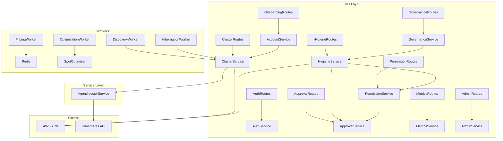

# System Architecture — Core Logic & Data Flow

> **Last Updated**: 2026-02-10
> **Total Backend Services**: 24+ | **Background Workers**: 8
> **Naming**: Reflects Global Naming Synchronization

---

## 1. Service Dependency Diagram



---

## 2. Backend Services Reference

### 2.1 AuthService (`backend/services/auth_service.py`)

| Method | Purpose |
|:-------|:--------|
| `authenticate(email, password)` | Validates credentials, returns JWT tokens |
| `signup(org_name, email, password)` | Creates User + Organization + placeholder Account |
| `refresh_token(refresh_token)` | Issues new access token |
| `change_password(user, old, new)` | Password update with bcrypt verification |

**Dependencies**: User model, Organization model, JWT (python-jose), bcrypt

### 2.2 ClusterService (`backend/services/cluster_service.py`)

| Method | Purpose |
|:-------|:--------|
| `list_clusters(org_id, filters)` | Paginated cluster list with Redis cache (30s TTL) |
| `get_cluster(cluster_id)` | Single cluster with instance metrics |
| `discover_clusters(account)` | EKS ListClusters + DescribeCluster → DB upsert |
| `get_install_script(cluster_id)` | Helm OCI chart install command |
| `disconnect_cluster(cluster_id)` | Remove agent, mark DISCONNECTED |

**Dependencies**: Account model, Instance model, Redis, boto3 (EKS, EC2)

### 2.3 ApprovalService (`backend/services/approval_service.py`)

| Method | Purpose |
|:-------|:--------|
| `create_ticket(data, user)` | Creates approval ticket (ACCESS_WINDOW, ACTION, JIT_FEATURE) |
| `create_jit_request(data, user)` | Creates JIT feature access request |
| `approve_ticket(ticket_id, approver)` | Validates approver authority, sets APPROVED_ACTIVE |
| `reject_ticket(ticket_id, approver)` | Sets REJECTED status |
| `revoke_ticket(ticket_id, admin)` | Immediately revokes active access |
| `delegate(ticket_id, recipient, duration)` | Delegated access grant with parent_id chain |
| `get_active_window(user, feature_id)` | Returns current active JIT ticket if any |
| `list_tickets(user, filters)` | Role-filtered ticket list |
| `check_ticket_expired(ticket)` | Auto-expire past-duration tickets |

**Dependencies**: Approval model, User model, PermissionService

### 2.4 HygieneService (`backend/services/hygiene_service.py`)

| Method | Purpose |
|:-------|:--------|
| `scan_resources(account_id, regions, force_refresh)` | Parallel scan across regions (ThreadPoolExecutor, max_workers=10) |
| `check_dependencies(resource_type, resource_id)` | Pre-flight dependency mapping (Snapshots→AMIs, SGs→ENIs) |
| `execute_action(action_type, resource_id, user)` | Execute or queue for approval based on governance |
| `authorize_resource(resource_id, user)` | Mark resource as authorized (exclude from savings) |
| `discover_resources(user, feature_id)` | Resource discovery within active JIT windows |

**Resource Types Scanned** (11):

| Type | Scanner Method | Key Logic |
|:-----|:---------------|:----------|
| EC2 Instances | `_scan_instances()` | Unauthorized instances not in cluster inventory |
| EBS Volumes | `_scan_volumes()` | 4-way categorization: Active / Orphaned / Non-Compliant / Safe-to-Delete |
| Snapshots | `_scan_snapshots()` | Orphaned snapshots (source volume deleted) |
| Elastic IPs | `_scan_eips()` | Unassociated EIPs |
| Load Balancers | `_scan_load_balancers()` | Idle LBs via target health |
| NAT Gateways | `_scan_nat_gateways()` | Unused NATs |
| ENIs | `_scan_network()` | Unattached ENIs |
| RDS | `_scan_databases()` | Idle via CloudWatch DatabaseConnections, legacy t2/m4 |
| S3 | `_scan_storage()` | Incomplete multipart uploads >7 days |
| IAM Users | `_scan_identity()` | Dormant users >90 days |
| IAM Access Keys | `_scan_identity()` | Unused access keys |

**Caching**: Redis key `cleanup:scan:{account_id}:{regions}`, 1-hour TTL, `force_refresh` bypass.

### 2.5 PermissionService (`backend/services/permission_service.py`)

| Method | Purpose |
|:-------|:--------|
| `enforce(user, feature_id, resource_id)` | Blocks action if no permission; raises GovernanceError |
| `check(user, feature_id, resource_id)` | Non-blocking check; returns allowed + feature details |
| `get_user_features(user)` | Lists all accessible features categorized by status |
| `get_feature_registry()` | Returns complete 73+ feature catalog |

**Logic**: Checks role → checks active JIT tickets → checks feature registry → returns allowed/denied with rich metadata.

### 2.6 MetricsService (`backend/services/metrics_service.py`)

| Method | Purpose |
|:-------|:--------|
| `get_dashboard_metrics(org_id)` | Dashboard KPIs: cost, savings, fleet composition |
| `get_cost_metrics(org_id, period)` | Cost time series |
| `get_instance_metrics(org_id)` | Instance-level CPU/memory/cost |
| `get_team_consolidated_stats(team_id)` | Aggregated team metrics across members |
| `get_account_summary(account_id)` | Per-account cost breakdown |

### 2.7 GovernanceService (`backend/services/governance_service.py`)

| Method | Purpose |
|:-------|:--------|
| `get_rules(org_id)` | Organization governance policy rules |
| `update_rules(org_id, rules)` | Update governance toggles |
| `run_autopilot(org_id)` | Execute automated hygiene based on rules |
| `check_compliance(org_id, resources)` | Tag compliance check against org required_tags |

### 2.8 AgentInjectorService (`backend/services/agent_injector.py`)

**4-Step Injection Process**:

| Step | Action | Details |
|:-----|:-------|:--------|
| 1 | Cross-Account Role Assumption | STS AssumeRole with ExternalId |
| 2 | EKS Access Entry Creation | Creates access entry for backend IAM principal |
| 3 | K8s Token Generation | Presigned STS URL → `k8s-aws-v1.` token (uses backend creds, not assumed role) |
| 4 | Deploy Agent Manifests | Namespace, Secret, ConfigMap, ServiceAccount, ClusterRole, ClusterRoleBinding, DaemonSet |

**Agent DaemonSet Resources**:
- Image: `atharva608/spot-optimizer-agent:latest`
- Namespace: `spot-optimizer`
- HOST_PROC: `/host/proc` volume mount for host-level metrics
- Resource limits: 200m CPU, 256Mi memory

### 2.9 AccountService (`backend/services/account_service.py`)

| Method | Purpose |
|:-------|:--------|
| `link_aws_account(data, user)` | Creates account record, triggers discovery |
| `validate_account(account_id)` | STS AssumeRole verification |
| `disconnect_account(account_id)` | Strips credentials, preserves history |
| `list_accounts(user)` | RBAC-filtered: Admin=All, Lead=Team, Member=Own |

### 2.10 AdminService (`backend/services/admin_service.py`)

| Method | Purpose |
|:-------|:--------|
| `get_dashboard_stats()` | MRR, active users, clusters, spot instances |
| `list_clients(filters)` | All organizations with stats |
| `get_platform_connection()` | Platform AWS identity status |
| `update_platform_credentials(data)` | Store/verify platform AWS keys in SystemConfig |
| `toggle_organization(org_id)` | Suspend/activate org |

### 2.11 Additional Services

| Service | File | Purpose |
|:--------|:-----|:--------|
| OrganizationService | `organization_service.py` | Members, invitations, org settings |
| TeamService | `team_service.py` | Team CRUD, member assignment, governance |
| TagPolicyService | `tag_policy_service.py` | Tag policy CRUD, compliance stats |
| TagSuggestionService | `tag_suggestion_service.py` | AI-powered tag suggestions |
| AutoTagService | `auto_tag_service.py` | Dynamic auto-tag rules with 6 value sources |
| SmartTagService | `smart_tag_service.py` | TTL and schedule-based tag processing |
| SettingsService | `settings_service.py` | User/platform preferences |
| BillingService | `billing_routes.py` | Stripe portal session, webhook, subscription |
| AuditService | `audit_service.py` | Audit log queries, export |
| RIAnalysisService | `ri_analysis_service.py` | RI utilization, waste detection, recommendations |
| SavingsPlanService | `savings_plan_service.py` | SP underutilization, monthly waste |
| LabService | `lab_service.py` | Experiment CRUD, model registry |
| HealthService | `health_service.py` | System health checks (DB, Redis, Celery, AWS) |

### 2.12 HibernationWorker (`backend/workers/tasks/hibernation_worker.py`)

The hibernation worker runs every 1 minute via Celery Beat and enforces cluster sleep/wake schedules. It now supports three hibernation strategies dispatched through `trigger_sleep` and `trigger_wake` methods.

**Strategies** (`HibernationStrategy` enum):

| Strategy | Sleep Behavior | Wake Behavior | Use Case |
|:---------|:---------------|:--------------|:---------|
| `NAMESPACE_SLEEP` | Scale deployments/StatefulSets to 0 replicas via K8s API; preserve HPA configs in `saved_state` | Restore replica counts and HPA configs from `saved_state` | Soft shutdown — nodes stay warm, workloads paused |
| `NUCLEAR` | Set all ASG `desiredCapacity` to 0 via EC2 Auto Scaling API | Restore ASG capacities from `saved_state` | Hard shutdown — all nodes terminated, zero compute cost |
| `SNAPSHOT_RESTORE` | Create EBS snapshots of persistent volumes, record AZ affinity in `az_affinity`, then execute NUCLEAR | Restore EBS volumes from snapshots in correct AZs, then execute NUCLEAR wake | Stateful workloads — preserves data across full teardown |

**Helper Utilities**:

| Helper | Purpose |
|:-------|:--------|
| K8s Client Helper | Builds an authenticated Kubernetes API client using SigV4 presigned EKS tokens (same pattern as `AgentInjectorService`). Assumes cross-account role, generates `k8s-aws-v1.` bearer token, connects to cluster endpoint. |
| ASG Discovery Helper | Discovers Auto Scaling Groups associated with a cluster's node groups. Uses `eks:ListNodegroups` + `eks:DescribeNodegroup` to find ASG names, then queries `autoscaling:DescribeAutoScalingGroups` for current capacities. |

**Strategy Dispatch Pattern**:

```
check_hibernation_schedules() [every 1 min]
  → For each active schedule:
    → Evaluate cron expression against current time (timezone-aware)
    → If sleep window entered:
        → trigger_sleep(schedule)
          → Read schedule.strategy
          → NAMESPACE_SLEEP: K8s client → scale to 0, save state
          → NUCLEAR: ASG discovery → set desired=0, save state
          → SNAPSHOT_RESTORE: snapshot volumes → then NUCLEAR sleep
          → Update last_action=SLEEP, last_action_at=now()
    → If wake window entered:
        → trigger_wake(schedule)
          → Read schedule.strategy
          → NAMESPACE_SLEEP: K8s client → restore replicas from saved_state
          → NUCLEAR: ASG discovery → restore capacities from saved_state
          → SNAPSHOT_RESTORE: restore volumes from snapshots → then NUCLEAR wake
          → Update last_action=WAKE, last_action_at=now()
```

---

## 3. ML/Optimization Modules

| Module | File | Purpose |
|:-------|:-----|:--------|
| SpotOptimizer | `modules/spot_optimizer.py` | Instance selection: price (0.6) + risk (0.4) weighted scoring |
| Rightsizer | `modules/rightsizer.py` | CPU/memory-based instance right-sizing recommendations |
| BinPacker | `modules/bin_packer.py` | Node fragmentation analysis, consolidation recommendations |
| RiskTracker | `modules/risk_tracker.py` | Redis-backed global spot interruption risk intelligence |
| MLModelServer | `modules/ml_model_server.py` | ML model serving for predictions |
| ActionExecutor | `modules/action_executor.py` | Cloud write operations: drain → launch → verify → terminate |

---

## 4. Data Flow Diagrams

### 4.1 AWS Onboarding → Discovery

```
User → ConnectStep (frontend)
  → POST /onboarding/verify
    → AccountService.validate_account()
      → STS AssumeRole (verify credentials)
      → Create Account record in DB
      → Trigger discovery_worker_loop.delay()
        → ClusterService.discover_clusters()
          → EKS ListClusters → DescribeCluster
          → Upsert Cluster records
          → Update Account sync status
```

### 4.2 Agent Injection → Monitoring

```
Admin → "Activate Optimization" button
  → POST /clusters/{id}/auto-install
    → inject_agent_task.delay(cluster_id)
      → AgentInjectorService
        → STS AssumeRole (customer account)
        → Create EKS Access Entry
        → Generate K8s Token (backend creds)
        → Deploy DaemonSet manifests
      → Agent pods start
        → Heartbeat every 30s → POST /agents/heartbeat
        → Metrics collection → POST /agent-metrics/batch
        → WebSocket connection for real-time commands
```

### 4.3 Hygiene Scan → Action Execution

```
User → Scan button
  → GET /hygiene/scan/{account_id}
    → HygieneService.scan_resources()
      → ThreadPoolExecutor (10 workers)
        → Parallel region scans (EC2, EBS, S3, RDS, IAM...)
      → Redis cache results (1hr TTL)
  → User selects resources → "Cleanup" button
    → POST /hygiene/action
      → PermissionService.enforce(user, "hygiene:execute")
        → If denied: GovernanceError → 403 → Auto JIT modal
        → If allowed: execute_action()
          → boto3 terminate/delete/stop
```

### 4.4 Auto Cluster Cleanup

```
Discovery Worker (every 5 min)
  → Scan AWS for existing EKS clusters
  → Compare with DB cluster records
  → For each DB cluster NOT in AWS:
    → Check agent heartbeat age
    → If offline > 10 min:
      → Delete instances from DB
      → Delete cluster from DB
      → Log cleanup event
```

---

## 5. Database Schema Overview

### Key Tables & Relationships

| Table | Key Columns | Relationships |
|:------|:------------|:-------------|
| `users` | id, email, role, organization_id, team_id, preferences (JSON) | → Organization, → Team |
| `organizations` | id, name, required_tags (JSON), automation_enabled, automation_requires_approval, automation_config (JSON) | ← Users, ← Accounts |
| `teams` | id, name, organization_id, governance_config (JSON) | → Organization, ← Users |
| `accounts` | id, organization_id, role_arn, external_id, status, last_sync_at, sync_status | → Organization |
| `clusters` | id, account_id, name, arn, region, status, monthly_cost, estimated_savings, cpu_usage_pct, mem_usage_pct, last_heartbeat | → Account, ← Instances |
| `instances` | id, cluster_id, instance_id, instance_type, lifecycle, price, cpu_util, memory_util | → Cluster |
| `approvals` | id, type, status, feature_id, jit_scope, requester_id, approver_id, duration_hours, expires_at, parent_id | → User (requester), → User (approver) |
| `audit_logs` | id, actor_id, action, target, outcome, metadata (JSON), timestamp | → User |
| `hygiene_policies` | id, organization_id, name, resource_type, conditions (JSON), actions (JSON) | → Organization |
| `cluster_policies` | id, cluster_id, config (JSONB) | → Cluster |
| `hibernation_schedules` | id, cluster_id, schedule (JSON), timezone, active, strategy, saved_state (JSON), az_affinity (JSON), last_action, last_action_at | → Cluster |
| `system_config` | key, value | Key-value platform settings |

---

## 6. Error Handling Conventions

| Pattern | Implementation |
|:--------|:---------------|
| **GovernanceError** | 403 with `required_ticket: true` + feature metadata |
| **ResourceNotFoundError** | 404 with resource type and ID |
| **ValidationError** | 422 via Pydantic automatic validation |
| **SpotOptimizerException** | Base exception class for all custom errors |
| **Global handler** | Catches unhandled exceptions → 500 with safe message |

---

## 7. Middleware Stack

| Middleware | Purpose |
|:-----------|:--------|
| CORS | Dynamic origin allowlist + fallback headers for errors |
| Request Logging | Method, Path, Status, Duration, UserID + `X-Process-Time` header |
| Exception Handling | Global handlers for SpotOptimizerException, validation, 500s |
| JWT Auth | `get_current_user` dependency, 60-min access tokens |
| Health Checks | `/health` (basic) + `/health/detailed` (DB, Redis, Celery, AWS) |

**Missing**: Rate limiting middleware (config exists: `API_RATE_LIMIT=100/min` but not wired).

---

**Last Updated**: 2026-02-10
