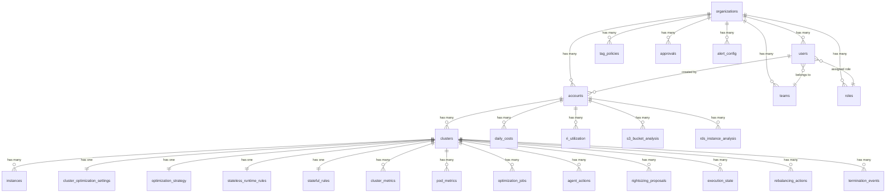

# Database Schema Audit — Complete Report

> **Database**: PostgreSQL (`spot_optimizer`)
> **ORM**: SQLAlchemy (declarative_base)
> **Connection**: `DATABASE_URL` env var, pool_size=20, max_overflow=10, pool_timeout=30
> **Source**: Extracted from 65 model files in `backend/models/`
> **Date**: 2026-03-06

---

## 1. Database Overview

| Metric | Value |
|---|---|
| **Total Tables** | 68 |
| **Regular Tables** | 65 |
| **Association Tables** | 3 |
| **Total Composite Indexes** | 53 |
| **Total Foreign Keys** | 70+ |
| **Primary Key Type** | UUID (`String(36)`, `generate_uuid()`) |
| **Timestamp Pattern** | `created_at` + `updated_at` on most tables |

---

## 2. Complete Schema Structure

### 2.1 Entity Relationship Diagram

---

## 3. Table Inventory (All 68 Tables)

### 3.1 Core Identity & Auth (8 tables)

| # | Table Name | Model File | PK | Key Columns | FKs To |
|---|---|---|---|---|---|
| 1 | `organizations` | `organization.py` | `id` (UUID) | name, slug, external_id, billing_email, stripe_customer_id, status, governance_config (JSON) | — |
| 2 | `users` | `user.py` | `id` (UUID) | email, password_hash, role (ENUM), access_level (ENUM), status, full_name, preferences (JSON) | organizations, teams, roles |
| 3 | `user_permissions` | `user.py` (Table) | composite(user_id, permission_id) | — | users, permissions |
| 4 | `accounts` | `account.py` | `id` (UUID) | aws_account_id, role_arn, external_id, region, status (ENUM), sync_status, is_default | organizations, users |
| 5 | `api_keys` | `api_key.py` | `id` (UUID) | key_hash, name, organization_id, last_used_at, is_active | organizations |
| 6 | `teams` | `team.py` | `id` (UUID) | name, organization_id | organizations |
| 7 | `roles` | `role.py` | `id` (UUID) | name, type (ENUM), organization_id, description, is_system | organizations |
| 8 | `role_permissions` | `role.py` (Table) | composite(role_id, permission_id) | — | roles, permissions |
| 9 | `permissions` | `permission.py` | `id` (UUID) | resource, action, description | — |
| 10 | `organization_invitations` | `invitation.py` | `id` (UUID) | email, role, status, token, organization_id | organizations, users |

### 3.2 Cluster Management (8 tables)

| # | Table Name | Model File | PK | Key Columns | FKs To |
|---|---|---|---|---|---|
| 11 | `clusters` | `cluster.py` | `id` (String) | name, arn, region, status (ENUM), cluster_type (ENUM), karpenter_mode, karpenter_discovery_enabled, agent_version, optimization_mode, hibernation_state (JSON) | accounts |
| 12 | `cluster_optimization_settings` | `cluster.py` | `cluster_id` (FK) | auto_rebalance_enabled, auto_rightsizing_enabled, maintain_standby, diversify_pools, failure_cooldown_min, optimization_target | clusters |
| 13 | `optimization_strategy` | `cluster.py` | `cluster_id` (FK) | strategy_type, spot_target_percent, allowed_families (JSON), diversity_strictness_level | clusters |
| 14 | `stateless_runtime_rules` | `cluster.py` | `cluster_id` (FK) | instance_diversification_enabled, spot_fallback_to_ondemand, max_spot_ratio, max_nodes_per_family, fresh_cluster_stabilization_minutes | clusters |
| 15 | `stateful_rules` | `cluster.py` | `cluster_id` (FK) | manual_resize_allowed, show_ondemand_only, require_approval, max_downscale_percent | clusters |
| 16 | `instances` | `instance.py` | `id` (UUID) | instance_id, instance_type, lifecycle, state, az, node_name, spot_price, ondemand_price | clusters, accounts |
| 17 | `cluster_policies` | `cluster_policy.py` | `id` (UUID) | cluster_id, policy_type, settings (JSON) | clusters |
| 18 | `cluster_cooldowns` | `cluster_cooldown.py` | `id` (UUID) | cluster_id, cooldown_type, expires_at | clusters |

### 3.3 Metrics & Monitoring (5 tables)

| # | Table Name | Model File | PK | Key Columns | FKs To |
|---|---|---|---|---|---|
| 19 | `cluster_metrics` | `cluster_metric.py` | `id` (UUID) | cluster_id, metric_type, metric_value (JSON), timestamp | clusters |
| 20 | `pod_metrics` | `pod_metric.py` | `id` (UUID) | cluster_id, namespace, pod_name, node_name, controller_kind, controller_name, cpu_request_m, cpu_usage_m, memory_request_bytes, memory_usage_bytes | clusters |
| 21 | `node_metrics` | `node_metrics.py` | `id` (UUID) | cluster_id, node_name, cpu_allocatable_m, cpu_usage_m, memory_allocatable_bytes, memory_usage_bytes | clusters |
| 22 | `daily_cluster_stats` | `daily_cluster_stats.py` | `id` (UUID) | cluster_id, date_stamp, total_cost, total_savings, node_count, spot_percentage | clusters |
| 23 | `audit_logs` | `audit_log.py` | `id` (UUID) | actor_id, action, resource_type, resource_id, details (JSON), timestamp, ip_address | — |

### 3.4 Optimization Engine (9 tables)

| # | Table Name | Model File | PK | Key Columns | FKs To |
|---|---|---|---|---|---|
| 24 | `optimization_jobs` | `optimization_job.py` | `id` (UUID) | cluster_id, status (ENUM), job_type, recommendation (JSON), savings_usd | clusters |
| 25 | `optimizer_states` | `optimizer_state.py` | `id` (UUID) | cluster_id, phase (ENUM), phase_started_at, last_pool_optimization_at, last_rightsizing_check_at | clusters |
| 26 | `rightsizing_proposals` | `rightsizing_proposal.py` | `id` (UUID) | cluster_id, controller_name, namespace, current_cpu, recommended_cpu, current_memory, recommended_memory, status, confidence, monthly_savings_usd | clusters |
| 27 | `execution_state` | `execution_state.py` | `id` (UUID) | cluster_id, state (ENUM), action_type, source_pool, target_pool, started_at, last_transition_at, error_message, archived_at | clusters |
| 28 | `substitute_states` | `substitute_state.py` | `id` (UUID) | cluster_id, state, instance_id, instance_type, az, provisioned_at, cost_per_hour | clusters |
| 29 | `pool_cooldowns` | `pool_cooldown.py` | `id` (UUID) | pool_id, cooldown_type, expires_at | — |
| 30 | `circuit_breaker_state` | `circuit_breaker_state.py` | `id` (UUID) | service_name, state, rollback_count, last_failure_at, state_entered_at | — |
| 31 | `rebalancing_actions` | `rebalancing_action.py` | `id` (UUID) | cluster_id, action_type, status, source_nodes (JSON), target_pool, started_at, completed_at | clusters |
| 32 | `termination_events` | `termination_event.py` | `id` (UUID) | cluster_id, instance_id, instance_type, az, detected_at, source, action_taken | clusters |

### 3.5 ML & Intelligence (4 tables)

| # | Table Name | Model File | PK | Key Columns | FKs To |
|---|---|---|---|---|---|
| 33 | `ml_models` | `ml_model.py` | `id` (UUID) | model_name, version, model_type, accuracy, training_date | — |
| 34 | `model_registry` | `model_registry.py` | `id` (UUID) | model_version, model_type, feature_schema_version, metrics (JSON), is_active | — |
| 35 | `family_hour_baselines` | `family_hour_baseline.py` | `id` (UUID) | instance_family, region, date, hour, mean_savings, std_savings, median_savings, sample_count | — |
| 36 | `instance_catalog` | `instance_catalog.py` | `id` (UUID) | instance_type, region, vcpus, memory_gb, architecture, processor, current_generation, burstable, gpu_count | — |

### 3.6 Pricing Data (3 tables)

| # | Table Name | Model File | PK | Key Columns | FKs To |
|---|---|---|---|---|---|
| 37 | `spot_price_history` | `pricing.py` | `id` (UUID) | instance_type, az, region, spot_price, timestamp | — |
| 38 | `ondemand_pricing` | `pricing.py` | `id` (UUID) | instance_type, region, price_per_hour | — |
| 39 | `spot_advisor_data` | `pricing.py` | `id` (UUID) | instance_type, region, r_score, savings_pct, interruption_frequency | — |

### 3.7 Hibernation (2 tables)

| # | Table Name | Model File | PK | Key Columns | FKs To |
|---|---|---|---|---|---|
| 40 | `hibernation_schedules` | `hibernation_schedule.py` | `id` (UUID) | name, schedule_type, strategy, matrix, timezone, is_active, pre_warm_minutes, savings (JSON) | — |
| 41 | `hibernation_schedule_clusters` | `hibernation_schedule_clusters.py` (Table) | composite | schedule_id, cluster_id | hibernation_schedules, clusters |

### 3.8 Cost Analysis (5 tables)

| # | Table Name | Model File | PK | Key Columns | FKs To |
|---|---|---|---|---|---|
| 42 | `daily_costs` | `billing.py` | `id` (UUID) | account_id, date, service_name, amount_usd, usage_quantity, usage_type | accounts |
| 43 | `cost_explorer_sync_status` | `billing.py` | `id` (UUID) | account_id, last_sync_at, status, next_sync_at | accounts |
| 44 | `ri_utilization` | `ri_utilization.py` | `id` (UUID) | organization_id, account_id, ri_id, instance_type, utilization_pct, unused_hours, potential_savings_monthly | organizations, accounts |
| 45 | `s3_bucket_analysis` | `s3_analysis.py` | `id` (UUID) | organization_id, account_id, bucket_name, storage_class, size_gb, monthly_cost, lifecycle_status (JSON) | organizations, accounts |
| 46 | `rds_instance_analysis` | `rds_analysis.py` | `id` (UUID) | organization_id, account_id, db_instance_id, instance_class, engine, multi_az, utilization (JSON) | organizations, accounts |
| 47 | `savings_plan_utilization` | `savings_plan_utilization.py` | `id` (UUID) | organization_id, account_id, plan_id, commitment_amount, utilization_pct | organizations, accounts |
| 48 | `data_transfer_analysis` | `transfer_analysis.py` | `id` (UUID) | organization_id, account_id, transfer_type, source_region, dest_region, monthly_cost | organizations, accounts |

### 3.9 Tag Governance (6 tables)

| # | Table Name | Model File | PK | Key Columns | FKs To |
|---|---|---|---|---|---|
| 49 | `tag_policies` | `tag_policy.py` | `id` (UUID) | organization_id, name, tag_key, enforcement_level (ENUM), is_active | organizations |
| 50 | `auto_tag_rules` | `auto_tag_rule.py` | `id` (UUID) | organization_id, name, resource_types (JSON), conditions (JSON), tags_to_apply (JSON), run_mode (ENUM) | organizations |
| 51 | `tag_templates` | `tag_template.py` | `id` (UUID) | organization_id, name, tags (JSON), is_default | organizations |
| 52 | `tag_scoring_configs` | `tag_scoring_config.py` | `id` (UUID) | organization_id, weights (JSON), is_active | organizations |
| 53 | `tag_automation_rules` | `tag_automation_rule.py` | `id` (UUID) | organization_id, name, trigger_type, action_type, is_enabled | organizations |
| 54 | `tag_compliance_scores` | `tag_compliance_score.py` | `id` (UUID) | organization_id, resource_id, resource_type, score, status, violations (JSON) | organizations |
| 55 | `tag_automation_logs` | `tag_automation_log.py` | `id` (UUID) | organization_id, rule_id, action, resources_affected, result | organizations, tag_automation_rules |

### 3.10 Approvals & Governance (2 tables)

| # | Table Name | Model File | PK | Key Columns | FKs To |
|---|---|---|---|---|---|
| 56 | `approvals` | `approval.py` | `id` (UUID) | user_id, organization_id, type (ENUM), status (ENUM), resource_id, reason, approver_id, parent_id | users, organizations, approvals (self-ref) |
| 57 | `authorized_resources` | `authorized_resource.py` | `id` (UUID) | account_id, resource_type, resource_id, created_by_id | accounts, users |

### 3.11 Agent & Worker (4 tables)

| # | Table Name | Model File | PK | Key Columns | FKs To |
|---|---|---|---|---|---|
| 58 | `agent_actions` | `agent_action.py` | `id` (UUID) | cluster_id, action_type (ENUM), status (ENUM), payload (JSON), result (JSON), expires_at | clusters |
| 59 | `agent_identities` | `agent_identity.py` | `id` (UUID) | cluster_id, agent_id, public_key, fingerprint, is_active, last_verified_at | clusters |
| 60 | `worker_registrations` | `worker_registration.py` | `id` (UUID) | cluster_id, node_name, hostname, agent_version, last_heartbeat_at | clusters |
| 61 | `node_templates` | `node_template.py` | `id` (UUID) | name, organization_id, architecture, vcpu_range (JSON), memory_range (JSON), allowed_families (JSON) | organizations |
| 62 | `node_template_versions` | `node_template.py` | `id` (UUID) | template_id, version, spec (JSON) | node_templates |
| 63 | `cluster_template_mappings` | `node_template.py` | composite | cluster_id, template_id | clusters, node_templates |

### 3.12 Alerts & Security (4 tables)

| # | Table Name | Model File | PK | Key Columns | FKs To |
|---|---|---|---|---|---|
| 64 | `alert_config` | `alert_config.py` | `id` (UUID) | organization_id, cluster_id, alert_type (ENUM), severity (ENUM), channel (ENUM), enabled, threshold (JSON) | organizations, clusters |
| 65 | `alert_history` | `alert_history.py` | `id` (UUID) | organization_id, cluster_id, alert_type, severity, status (ENUM), message, fingerprint, resolved_at | organizations, clusters |
| 66 | `credential_cache` | `credential_cache.py` | `id` (UUID) | user_id, account_id, role_arn, access_key_id (encrypted), secret_key (encrypted), session_token (encrypted), expires_at, is_active | users, accounts |

### 3.13 System & Experiments (4 tables)

| # | Table Name | Model File | PK | Key Columns | FKs To |
|---|---|---|---|---|---|
| 67 | `system_configs` | `system_config.py` | `id` (UUID) | key, value, description | — |
| 68 | `platform_settings` | `platform_settings.py` | `id` (UUID) | key, value (JSON), updated_at | — |
| 69 | `lab_experiments` | `lab_experiment.py` | `id` (UUID) | name, status, experiment_type, config (JSON), results (JSON), cluster_id | clusters |
| 70 | `chaos_experiments` | `chaos_experiment.py` | `id` (UUID) | organization_id, cluster_id, type (ENUM), status (ENUM), config (JSON), results (JSON) | organizations, clusters |
| -- | `onboarding_states` | `onboarding.py` | `id` (UUID) | user_id, current_step, completed_steps (JSON), is_complete | users |
| -- | `cleanup_policies` | `hygiene_policy.py` | `id` (UUID) | organization_id, resource_type, policy_config (JSON), is_active | organizations |

---

## 4. Composite Indexes (53 Total)

| Table | Index Name | Columns | Unique |
|---|---|---|---|
| `instances` | `idx_cluster_lifecycle` | cluster_id, lifecycle | No |
| `instances` | `idx_cluster_instance_type` | cluster_id, instance_type | No |
| `instances` | `idx_account_state` | account_id, state | No |
| `credential_cache` | `idx_credential_active_user` | user_id, is_active | No |
| `credential_cache` | `idx_credential_expiration` | expires_at, is_active | No |
| `credential_cache` | `idx_credential_rotation` | rotation_threshold_at, is_active | No |
| `daily_costs` | `idx_account_date` | account_id, date | No |
| `daily_costs` | `idx_date_service` | date, service_name | No |
| `daily_costs` | `idx_account_date_service` | account_id, date, service_name | No |
| `node_metrics` | `idx_node_metric_cluster_ts` | cluster_id, timestamp | No |
| `node_metrics` | `idx_node_metric_node_ts` | node_name, timestamp | No |
| `agent_actions` | `idx_agent_action_cluster_status` | cluster_id, status | No |
| `agent_actions` | `idx_agent_action_expires` | expires_at | No |
| `agent_actions` | `idx_agent_action_created` | created_at | No |
| `instance_catalog` | `idx_instance_type_region` | instance_type, region | **Yes** |
| `instance_catalog` | `idx_region_current_gen` | region, current_generation | No |
| `instance_catalog` | `idx_region_arch` | region, architecture | No |
| `instance_catalog` | `idx_vcpus_memory` | vcpus, memory_gb | No |
| `pod_metrics` | `idx_pod_metric_cluster_time` | cluster_id, timestamp | No |
| `pod_metrics` | `idx_pod_metric_controller` | cluster_id, namespace, controller_kind, controller_name, timestamp | No |
| `pod_metrics` | `idx_pod_metric_node_time` | cluster_id, node_name, timestamp | No |
| `pod_metrics` | `idx_pod_metric_pod_time` | cluster_id, namespace, pod_name, timestamp | No |
| `alert_history` | `idx_alert_history_fingerprint_created` | fingerprint, created_at | No |
| `alert_history` | `idx_alert_history_org_type_created` | organization_id, alert_type, created_at | No |
| `alert_history` | `idx_alert_history_region_created` | region, created_at | No |
| `alert_history` | `idx_alert_history_status_retry` | status, next_retry_at | No |
| `alert_history` | `idx_alert_history_cluster_type` | cluster_id, alert_type | No |
| `alert_config` | `idx_alert_config_org_type` | organization_id, alert_type | No |
| `alert_config` | `idx_alert_config_cluster_enabled` | cluster_id, enabled | No |
| `alert_config` | `idx_alert_config_severity` | severity, enabled | No |
| `execution_state` | `idx_state_archived` | state, archived_at | No |
| `execution_state` | `idx_cluster_state` | cluster_id, state | No |
| `execution_state` | `idx_active_executions` | state, last_transition_at | No |
| `tag_compliance_scores` | `ix_tag_compliance_org_scanned` | organization_id, scanned_at | No |
| `tag_compliance_scores` | `ix_tag_compliance_org_type` | organization_id, resource_type | No |
| `tag_compliance_scores` | `ix_tag_compliance_org_status` | organization_id, status | No |
| `tag_compliance_scores` | `ix_tag_compliance_org_resource` | organization_id, resource_id | No |
| `family_hour_baselines` | `idx_family_region_date_hour` | instance_family, region, date, hour | **Yes** |
| `family_hour_baselines` | `idx_family_region_hour` | instance_family, region, hour | No |
| `family_hour_baselines` | `idx_region_date` | region, date | No |
| `circuit_breaker_state` | `idx_service_state` | service_name, state | No |
| `optimization_jobs` | `idx_optimization_cluster_status` | cluster_id, status | No |
| `optimization_jobs` | `idx_optimization_created_desc` | created_at DESC | No |
| `cluster_metrics` | `idx_cluster_metric_cluster_time` | cluster_id, timestamp | No |
| `cluster_metrics` | `idx_cluster_metric_type_time` | metric_type, timestamp | No |
| `cluster_metrics` | `idx_cluster_metric_cluster_type` | cluster_id, metric_type | No |
| `model_registry` | `idx_model_version_schema` | model_version, feature_schema_version | No |
| `model_registry` | `idx_active_models` | is_active, deployed_at | No |
| `worker_registrations` | `idx_worker_reg_cluster_node` | cluster_id, node_name | **Yes** |
| `audit_logs` | `idx_audit_timestamp_desc` | timestamp DESC | No |
| `audit_logs` | `idx_audit_actor_timestamp` | actor_id, timestamp DESC | No |
| `audit_logs` | `idx_audit_resource_type_timestamp` | resource_type, timestamp DESC | No |
| `daily_cluster_stats` | `idx_daily_stats_cluster_date` | cluster_id, date_stamp | **Yes** |

---

## 5. Security Audit — Sensitive Data Columns

### 5.1 High-Risk Columns (passwords, tokens, keys)

| Table | Column | Data Type | Risk Level | Protection |
|---|---|---|---|---|
| `users` | `password_hash` | String(255) | 🔴 CRITICAL | ✅ bcrypt hashed |
| `users` | `email` | String(255) | 🟡 PII | ⚠️ Plain text (indexed) |
| `credential_cache` | `access_key_id` | Text | 🔴 CRITICAL | ✅ Encrypted (Fernet AES) |
| `credential_cache` | `secret_key` | Text | 🔴 CRITICAL | ✅ Encrypted (Fernet AES) |
| `credential_cache` | `session_token` | Text | 🔴 CRITICAL | ✅ Encrypted (Fernet AES) |
| `api_keys` | `key_hash` | String | 🔴 CRITICAL | ✅ Hashed (SHA-256) |
| `agent_identities` | `public_key` | Text | 🟡 Sensitive | ✅ Public key only |
| `agent_identities` | `fingerprint` | String | 🟢 Low | ✅ Derived hash |
| `accounts` | `role_arn` | String(255) | 🟡 Sensitive | ⚠️ Plain text |
| `accounts` | `external_id` | String(64) | 🟡 Sensitive | ⚠️ Plain text |
| `organizations` | `stripe_customer_id` | String(255) | 🟡 Sensitive | ⚠️ Plain text |
| `organization_invitations` | `token` | String | 🟡 Sensitive | ⚠️ Plain text |

### 5.2 Security Recommendations

| # | Finding | Severity | Recommendation |
|---|---|---|---|
| 1 | `organizations.stripe_customer_id` defined **twice** (L28-29) | 🟡 Medium | Remove duplicate column definition |
| 2 | Invitation tokens stored in plain text | 🟡 Medium | Hash tokens, store only hash |
| 3 | `accounts.role_arn` in plain text | 🟢 Low | Acceptable (not a secret) |
| 4 | `base.py` seeds `admin123` and `demo1234` passwords | 🔴 Critical | Remove hardcoded credentials from source |

---

## 6. Data Quality Issues

### 6.1 Duplicate Definitions

| File | Issue | Details |
|---|---|---|
| `organization.py` L28-29 | **Duplicate column** | `stripe_customer_id` defined twice |
| `pricing.py` | **Duplicate table** | `spot_price_history` defined in both `pricing.py` (L7) AND `spot_price_history.py` |
| `__init__.py` L28 | **Duplicate import** | `SavingsPlanUtilization` imported twice |
| `base.py` L69-70 | **Duplicate import** | `AgentAction` imported twice in `create_tables()` |

### 6.2 Missing `create_tables()` Registrations

The `create_tables()` function in `base.py` only registers 14 models, but the platform has **68 tables**. Most tables are created via `Base.metadata.create_all()` which auto-discovers all imported models in `__init__.py`, but the explicit list in `create_tables()` is incomplete and misleading.

**Tables NOT in `create_tables()` but exist**:
- All tag governance tables (6)
- All alert tables (2)
- All cost analysis tables (5)
- All execution/coordinator tables (4)
- credential_cache, chaos_experiments, daily_cluster_stats, etc.

### 6.3 Schema Inconsistencies

| Issue | Tables | Details |
|---|---|---|
| Mixed PK types | `clusters` uses `String` (no length), others use `String(36)` | Inconsistent PK sizing |
| `nullable` inconsistency | Some FKs have `nullable=True`, others `nullable=False` for similar relationships | Review FK nullability |
| Missing `ondelete` | Several FKs lack `ondelete` clause (e.g., `approvals.user_id`, `cluster_policies`) | Orphan rows possible |

---

## 7. Potentially Unused Tables

Based on code analysis (grep for table name usage in routes, services, and workers):

| Table | Model File | Evidence | Verdict |
|---|---|---|---|
| `pool_cooldowns` | `pool_cooldown.py` | Cooldowns managed via Redis keys, not DB | ⚠️ **Likely unused** — Redis is primary |
| `cluster_cooldowns` | `cluster_cooldown.py` | Cooldowns managed via Redis keys | ⚠️ **Likely unused** — Redis is primary |
| `ml_models` | `ml_model.py` | `model_registry` is the newer replacement | ⚠️ **Legacy** — superseded by `model_registry` |
| `spot_price_history` (models/spot_price_history.py) | `spot_price_history.py` | Duplicate of definition in `pricing.py` | ⚠️ **Duplicate file** |

---

## 8. Performance Analysis

### 8.1 High-Write Tables (ordered by estimated write frequency)

| Table | Est. Writes/Day | Source | Retention Concern |
|---|---|---|---|
| `pod_metrics` | ~288,000+ | Agent every 5 min per pod | 🔴 **HIGH** — needs partition/TTL |
| `cluster_metrics` | ~28,800+ | Agent every 60s per cluster | 🔴 **HIGH** — needs partition/TTL |
| `node_metrics` | ~28,800+ | Agent every 60s per node | 🔴 **HIGH** — needs partition/TTL |
| `spot_price_history` | ~2,880 | Pricing collector every 5 min | 🟡 Medium |
| `audit_logs` | ~1,000+ | Every user/system action | 🟡 Medium |
| `daily_costs` | ~100 | Daily cost import | 🟢 Low |
| `family_hour_baselines` | ~168/week | Weekly baseline computation | 🟢 Low |

### 8.2 Missing Indexes (Recommendations)

| Table | Suggested Index | Reason |
|---|---|---|
| `rightsizing_proposals` | `(cluster_id, status)` | Frequent filter by cluster + status |
| `approvals` | `(organization_id, status)` | Dashboard queries by org + pending |
| `approvals` | `(user_id, status)` | User's approval requests |
| `hibernation_schedules` | `(is_active)` | Worker filters active schedules every minute |
| `substitute_states` | `(cluster_id, state)` | Substitute lifecycle queries |
| `tag_policies` | `(organization_id, is_active)` | Active policy lookups |
| `rebalancing_actions` | `(cluster_id, status)` | Rebalancing history queries |
| `termination_events` | `(cluster_id, detected_at)` | Termination timeline queries |

### 8.3 Tables with Most Indexes

| Table | Index Count | Assessment |
|---|---|---|
| `pod_metrics` | 4 composite | ✅ Well-indexed for time-series queries |
| `alert_history` | 5 composite | ✅ Well-indexed for alert management |
| `alert_config` | 3 composite | ✅ Adequate |
| `instance_catalog` | 4 composite | ✅ Well-indexed for pool ranking |
| `daily_costs` | 3 composite | ✅ Appropriate for billing queries |

---

## 9. Relationship Summary

### 9.1 Tables by FK Dependency Count

| Table | Incoming FKs | Outgoing FKs | Role |
|---|---|---|---|
| `organizations` | 15+ | 0 | 🏢 Root entity |
| `clusters` | 12+ | 1 (accounts) | 🔗 Central hub |
| `users` | 5+ | 3 (org, team, role) | 👤 Auth entity |
| `accounts` | 6+ | 2 (org, user) | ☁️ AWS bridge |

### 9.2 Self-Referencing Tables

| Table | Column | Purpose |
|---|---|---|
| `approvals` | `parent_id → approvals.id` | Approval chains |

---

## 10. Cleanup Recommendations

### 10.1 Immediate Actions (Low Risk)

| # | Action | Impact |
|---|---|---|
| 1 | Remove duplicate `stripe_customer_id` in `organization.py` L29 | Fix schema warning |
| 2 | Remove duplicate `SavingsPlanUtilization` import in `__init__.py` L28 | Clean imports |
| 3 | Remove duplicate `AgentAction` import in `base.py` L70 | Clean imports |
| 4 | Remove duplicate `spot_price_history.py` model file | Eliminate confusion |
| 5 | Remove hardcoded passwords from `base.py` seed function | Security fix |

### 10.2 Medium-Term Actions

| # | Action | Impact |
|---|---|---|
| 6 | Add `ondelete="CASCADE"` to FKs missing it | Prevent orphan rows |
| 7 | Standardize PK column type to `String(36)` everywhere | Schema consistency |
| 8 | Add missing indexes (see §8.2) | Query performance |
| 9 | Implement data retention/partitioning for metrics tables | Storage management |
| 10 | Evaluate removing `pool_cooldowns`/`cluster_cooldowns` DB tables if Redis-only | Reduce complexity |

### 10.3 Long-Term Actions

| # | Action | Impact |
|---|---|---|
| 11 | Implement TimescaleDB or table partitioning for `pod_metrics`, `cluster_metrics`, `node_metrics` | Handle time-series at scale |
| 12 | Add DB-level constraints for ENUM columns instead of only ORM-level | Data integrity |
| 13 | Consider read replicas for analytics queries on cost/metrics tables | Performance isolation |
| 14 | Archive old `audit_logs`, `alert_history`, `optimization_jobs` records (>90 days) | Storage reduction |
| 15 | Deprecate `ml_models` table in favor of `model_registry` | Schema simplification |

---

*Total: **68 tables** · **53 composite indexes** · **70+ foreign keys** · **12 sensitive columns** · **4 duplicate definitions** · **8 missing indexes identified** · **15 cleanup recommendations***
