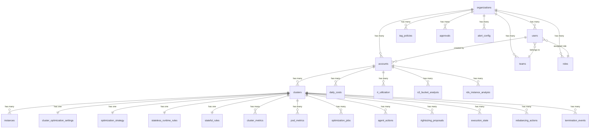
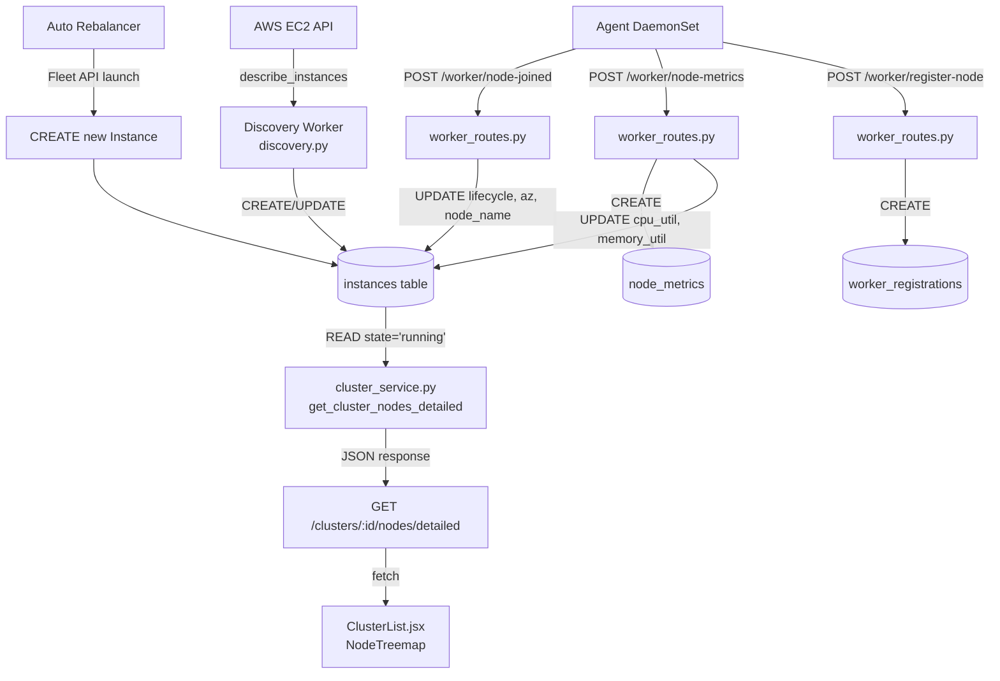
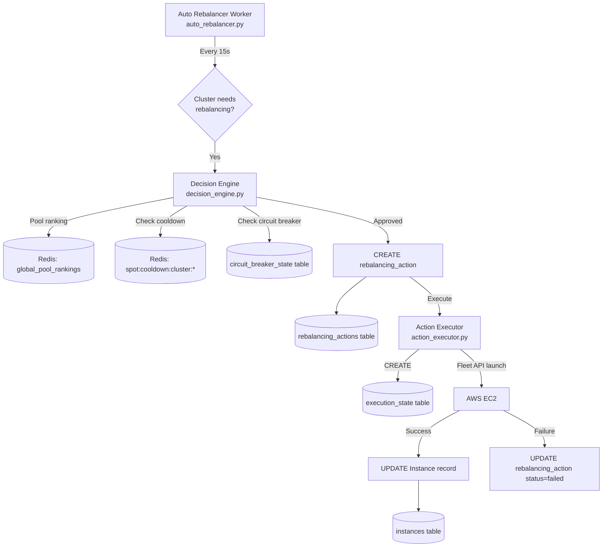

# Database & Redis Schema Audit — Complete Report

> **Database**: PostgreSQL (`spot_optimizer`)
> **ORM**: SQLAlchemy (declarative_base)
> **Connection**: `DATABASE_URL` env var, pool_size=20, max_overflow=10, pool_timeout=30
> **Cache/State**: Redis (single instance via `REDIS_URL`, default `redis://redis:6379/0`)
> **Source**: Extracted from 67 model files in `backend/models/`
> **Date**: 2026-03-10 (Updated)

---

## 1. Database Overview

| Metric | Value |
|---|---|
| **Total Tables** | 68 |
| **Regular Tables** | 65 |
| **Association Tables** | 3 |
| **Total Composite Indexes** | 53 |
| **Total Foreign Keys** | 70+ |
| **Primary Key Type** | UUID (`String(36)`, `generate_uuid()`) |
| **Timestamp Pattern** | `created_at` + `updated_at` on most tables |
| **Redis Key Patterns** | 46 unique patterns |

---

## 2. Entity Relationship Diagram

---

## 3. Complete Table Schema, Columns & CRUD Operations

### 3.1 Core Identity & Auth

---

#### Table: `organizations`

| Column | Type | Nullable | Default | Index |
|---|---|---|---|---|
| `id` | String(36) | NO | `generate_uuid()` | PK |
| `name` | String(255) | NO | — | Yes |
| `slug` | String(100) | YES | — | Unique |
| `external_id` | String(64) | YES | — | — |
| `billing_email` | String(255) | YES | — | — |
| `stripe_customer_id` | String(255) | YES | — | — |
| `status` | Enum(OrgStatus) | NO | `ACTIVE` | — |
| `governance_config` | JSON | YES | — | — |
| `created_at` | DateTime | NO | `utcnow` | — |
| `updated_at` | DateTime | NO | `utcnow` | — |

**CRUD Operations:**

| Op | Count | Files |
|---|---|---|
| CREATE | 3 | `auth_service.py`, `admin_schemas.py`, `quick_fake_data.py` |
| READ | 17 | `agents.py`, `admin_routes.py`, `governance_routes.py`, `report_worker.py`, `tag_automation_tasks.py` |
| UPDATE | — | Via ORM commit in `admin_routes.py` |
| DELETE | — | Not directly deleted |

---

#### Table: `users`

| Column | Type | Nullable | Default | Index |
|---|---|---|---|---|
| `id` | String(36) | NO | `generate_uuid()` | PK |
| `email` | String(255) | NO | — | Unique |
| `password_hash` | String(255) | NO | — | — |
| `role` | Enum(UserRole) | NO | `VIEWER` | — |
| `access_level` | Enum(AccessLevel) | YES | `STANDARD` | — |
| `status` | String(20) | NO | `active` | — |
| `full_name` | String(255) | YES | — | — |
| `preferences` | JSON | YES | — | — |
| `organization_id` | FK→organizations | YES | — | Yes |
| `team_id` | FK→teams | YES | — | — |
| `role_id` | FK→roles | YES | — | — |
| `created_at` | DateTime | NO | `utcnow` | — |
| `updated_at` | DateTime | NO | `utcnow` | — |

**CRUD Operations:**

| Op | Count | Files |
|---|---|---|
| CREATE | 5 | `auth_service.py`, `organization_service.py`, `team_service.py` |
| READ | 69 | `dependencies.py`, `admin_routes.py`, `team_routes.py`, `auth_service.py`, `cluster_service.py`, most route files (auth check) |
| UPDATE | — | Via ORM: password change, role update, preferences |
| DELETE | 1 | `team_service.py` |

---

#### Table: `accounts`

| Column | Type | Nullable | Default | Index |
|---|---|---|---|---|
| `id` | String(36) | NO | `generate_uuid()` | PK |
| `aws_account_id` | String(20) | NO | — | Unique |
| `organization_id` | FK→organizations | NO | — | Yes |
| `role_arn` | String(255) | YES | — | — |
| `external_id` | String(64) | YES | — | — |
| `region` | String(50) | YES | `us-east-1` | — |
| `status` | Enum(AccountStatus) | NO | `ACTIVE` | Yes |
| `sync_status` | Enum(SyncStatus) | YES | — | — |
| `sync_error` | String(500) | YES | — | — |
| `last_sync_at` | DateTime | YES | — | — |
| `is_default` | Boolean | NO | False | — |
| `created_at` | DateTime | NO | `utcnow` | — |
| `updated_at` | DateTime | NO | `utcnow` | — |

**CRUD Operations:**

| Op | Count | Files |
|---|---|---|
| CREATE | 3 | `account_routes.py`, `auth_service.py`, `cluster_service.py` |
| READ | 25 | `discovery.py`, `cluster_routes.py`, `admin_routes.py`, `account_routes.py`, `agent_injector.py` |
| UPDATE | — | `discovery.py` (sync_status), `account_routes.py` |
| DELETE | 1 | `account_routes.py` |

---

#### Table: `api_keys`

| Column | Type | Nullable | Default | Index |
|---|---|---|---|---|
| `id` | String(36) | NO | `generate_uuid()` | PK |
| `key_hash` | String(64) | NO | — | Unique |
| `name` | String(100) | NO | — | — |
| `organization_id` | FK→organizations | NO | — | Yes |
| `last_used_at` | DateTime | YES | — | — |
| `is_active` | Boolean | NO | True | — |
| `created_at` | DateTime | NO | `utcnow` | — |

**CRUD Operations:**

| Op | Count | Files |
|---|---|---|
| CREATE | 1 | `api_key_routes.py` |
| READ | 4 | `dependencies.py`, `api_key_routes.py` |
| DELETE | 1 | `api_key_routes.py` |

---

#### Table: `permissions`

| Column | Type | Nullable | Default | Index |
|---|---|---|---|---|
| `id` | String(36) | NO | `generate_uuid()` | PK |
| `resource` | String(100) | NO | — | — |
| `action` | String(50) | NO | — | — |
| `description` | String(255) | YES | — | — |

**CRUD Operations:**

| Op | Count | Files |
|---|---|---|
| CREATE | 3 | `seed_rbac.py`, `seed_permissions.py`, `role_service.py` |
| READ | 8 | `role_service.py`, `seed_rbac.py`, `seed_permissions.py` |

---

#### Table: `roles`

| Column | Type | Nullable | Default | Index |
|---|---|---|---|---|
| `id` | String(36) | NO | `generate_uuid()` | PK |
| `name` | String(100) | NO | — | — |
| `type` | Enum(RoleType) | NO | `CUSTOM` | — |
| `organization_id` | FK→organizations | YES | — | Yes |
| `description` | String(255) | YES | — | — |
| `is_system` | Boolean | NO | False | — |

**CRUD:** CREATE: 23 (`seed_rbac.py`, `role_routes.py`), READ: 4 (`role_service.py`)

---

#### Table: `teams`

| Column | Type | Nullable | Default | Index |
|---|---|---|---|---|
| `id` | String(36) | NO | `generate_uuid()` | PK |
| `name` | String(100) | NO | — | — |
| `organization_id` | FK→organizations | NO | — | Yes |

**CRUD:** CREATE: 2, READ: 9 (`team_routes.py`, `team_service.py`)

---

#### Association Tables: `user_permissions`, `role_permissions`

| Table | Columns | FKs |
|---|---|---|
| `user_permissions` | user_id, permission_id | users, permissions |
| `role_permissions` | role_id, permission_id | roles, permissions |

---

### 3.2 Cluster Management

---

#### Table: `clusters`

| Column | Type | Nullable | Default | Index |
|---|---|---|---|---|
| `id` | String | NO | — | PK |
| `account_id` | FK→accounts | NO | — | Yes |
| `name` | String(255) | NO | — | — |
| `arn` | String(500) | YES | — | — |
| `region` | String(50) | YES | — | — |
| `status` | Enum(ClusterStatus) | NO | `PENDING` | — |
| `cluster_type` | Enum(ClusterType) | YES | `EKS` | — |
| `version` | String(20) | YES | — | — |
| `endpoint` | String(500) | YES | — | — |
| `ca_data` | Text | YES | — | — |
| `api_key` | String(64) | YES | — | — |
| `agent_installed` | String(1) | YES | `N` | — |
| `agent_version` | String(20) | YES | — | — |
| `last_heartbeat` | DateTime | YES | — | — |
| `auto_rebalance_enabled` | Boolean | YES | False | — |
| `karpenter_mode` | String(20) | YES | — | — |
| `karpenter_discovery_enabled` | Boolean | YES | False | — |
| `node_count` | Integer | YES | — | — |
| `spot_count` | Integer | YES | — | — |
| `on_demand_node_count` | Integer | YES | — | — |
| `cpu_total` | Float | YES | — | — |
| `mem_total` | Float | YES | — | — |
| `cpu_usage_pct` | Float | YES | — | — |
| `mem_usage_pct` | Float | YES | — | — |
| `monthly_cost` | Float | YES | — | — |
| `estimated_savings` | Float | YES | — | — |
| `potential_savings_monthly` | Float | YES | — | — |
| `realized_savings_monthly` | Float | YES | — | — |
| `optimization_mode` | String(20) | YES | — | — |
| `node_template_id` | FK→node_templates | YES | — | — |
| `hibernation_state` | JSON | YES | — | — |
| `inventory_summary` | JSON | YES | — | — |
| `last_assessed` | DateTime | YES | — | — |
| `last_cost_update` | DateTime | YES | — | — |
| `created_at` | DateTime | NO | `utcnow` | — |
| `updated_at` | DateTime | NO | `utcnow` | — |

**CRUD Operations (the most heavily used table):**

| Op | Count | Key Files |
|---|---|---|
| CREATE | 8 | `cluster_service.py` (register/connect), `discovery.py` (auto-discover) |
| READ | 80+ | Nearly every route and service file. Key: `cluster_routes.py`, `cluster_service.py`, `atharvaai_routes.py`, `auto_rebalancer.py`, `karpenter_routes.py` |
| UPDATE | — | `discovery.py` (cost/metadata update), `cluster_routes.py` (settings), `worker_routes.py` (heartbeat), `pod_metrics_routes.py` (utilization), `agent_service.py` |
| DELETE | 3 | `cluster_routes.py`, `cluster_service.py`, `discovery.py` (cleanup) |

---

#### Table: `instances`

| Column | Type | Nullable | Default | Index |
|---|---|---|---|---|
| `id` | String(36) | NO | `generate_uuid()` | PK |
| `cluster_id` | FK→clusters | YES | — | Yes |
| `account_id` | FK→accounts | YES | — | Yes |
| `instance_id` | String(20) | NO | — | Unique |
| `instance_type` | String(50) | NO | — | Yes |
| `lifecycle` | Enum(SPOT/ON_DEMAND) | NO | — | Yes |
| `az` | String(50) | NO | — | Yes |
| `price` | Float | YES | — | — |
| `cpu_util` | Float | YES | — | — |
| `memory_util` | Float | YES | — | — |
| `state` | String(20) | NO | `running` | Yes |
| `status` | String(20) | YES | `READY` | — |
| `status_message` | String(255) | YES | — | — |
| `architecture` | String(20) | YES | `amd64` | — |
| `node_name` | String(255) | YES | — | Yes |
| `standby` | Boolean | NO | False | Yes |
| `last_heartbeat` | DateTime | YES | — | — |
| `created_at` | DateTime | NO | `utcnow` | — |
| `updated_at` | DateTime | NO | `utcnow` | — |

**Composite Indexes:** `idx_cluster_lifecycle`, `idx_cluster_instance_type`, `idx_account_state`

**CRUD Operations:**

| Op | Count | Key Files |
|---|---|---|
| CREATE | 5 | `discovery.py` (EC2 scan), `auto_rebalancer.py` (new spot instance), `standby.py` (warm spare) |
| READ | 25+ | `cluster_service.py` (get_cluster_nodes_detailed, list_clusters), `auto_rebalancer.py`, `atharvaai_routes.py`, `worker_routes.py` (node-metrics), `karpenter_routes.py` |
| UPDATE | — | `discovery.py` (lifecycle, type, price), `worker_routes.py` (cpu_util, memory_util via node-metrics), `auto_rebalancer.py` (state changes), `standby.py` (standby flag) |
| DELETE | 5 | `cluster_routes.py` (agent removal), `cluster_service.py` (cluster delete), `discovery.py` (cleanup terminated >5min), `auto_rebalancer.py` (terminated instances) |

**Data sources that WRITE lifecycle:**
1. **Discovery Worker** (`discovery.py:658`) — reads `InstanceLifecycle` from AWS API, defaults to `on-demand`
2. **Worker Routes** (`worker_routes.py:322`) — node-joined endpoint, sets lifecycle if agent sends it
3. **Auto Rebalancer** (`auto_rebalancer.py`) — creates new instance records after Fleet API launch

---

#### Table: `cluster_optimization_settings`

| Column | Type | Nullable | Default |
|---|---|---|---|
| `cluster_id` | FK→clusters | NO (PK) | — |
| `auto_rebalance_enabled` | Boolean | YES | False |
| `auto_rightsizing_enabled` | Boolean | YES | False |
| `maintain_standby` | Boolean | YES | False |
| `diversify_pools` | Boolean | YES | False |
| `instance_aware_rightsizing` | Boolean | YES | False |
| `cooldown_override_minutes` | Integer | YES | — |
| `conservative_mode_enabled` | Boolean | YES | True |
| `manual_approval_required` | Boolean | YES | False |
| `target_spot_exposure_pct` | Integer | YES | 100 |
| `failure_cooldown_minutes` | Integer | YES | 30 |
| `optimization_target` | String(20) | YES | `spot` |

**CRUD:** CREATE: 2 (`cluster_routes.py`), READ: 5 (`cluster_routes.py`, `auto_rebalancer.py`, `karpenter_routes.py`)

---

#### Table: `optimization_strategy`

| Column | Type | Nullable | Default |
|---|---|---|---|
| `cluster_id` | FK→clusters | NO (PK) | — |
| `strategy_type` | String(20) | YES | `BALANCED` |
| `risk_ceiling_percent` | Integer | YES | 25 |
| `min_savings_percent` | Integer | YES | 15 |
| `volatility_tolerance_percent` | Integer | YES | 20 |
| `migration_penalty_multiplier` | Float | YES | 1.5 |
| `diversity_strictness_level` | String(20) | YES | `Medium` |
| `risk_savings_tradeoff_pct` | Integer | YES | 20 |

**CRUD:** CREATE: 2 (`cluster_routes.py`), READ: 5

---

### 3.3 Metrics & Monitoring

---

#### Table: `pod_metrics` ⚡ HIGH WRITE VOLUME

| Column | Type | Nullable | Default | Index |
|---|---|---|---|---|
| `id` | String(36) | NO | `generate_uuid()` | PK |
| `cluster_id` | FK→clusters | NO | — | Yes |
| `namespace` | String(255) | YES | — | — |
| `pod_name` | String(255) | NO | — | — |
| `node_name` | String(255) | YES | — | — |
| `controller_kind` | String(50) | YES | — | — |
| `controller_name` | String(255) | YES | — | — |
| `cpu_request_millicores` | Float | YES | — | — |
| `cpu_usage_millicores` | Float | YES | — | — |
| `cpu_utilization_pct` | Float | YES | — | — |
| `memory_request_bytes` | BigInteger | YES | — | — |
| `memory_usage_bytes` | BigInteger | YES | — | — |
| `memory_utilization_pct` | Float | YES | — | — |
| `pod_metadata` | JSON | YES | — | — |
| `timestamp` | DateTime | NO | `utcnow` | — |

**Composite Indexes:** `idx_pod_metric_cluster_time`, `idx_pod_metric_controller`, `idx_pod_metric_node_time`, `idx_pod_metric_pod_time`

**CRUD Operations:**

| Op | Count | Key Files |
|---|---|---|
| CREATE | 2 | `routers/metrics.py` (agent DaemonSet push), `pod_metrics_routes.py` (batch ingest) |
| READ | 9 | `cluster_service.py` (get_cluster_nodes_detailed — 3min window), `pod_metrics_routes.py`, `rightsizing_service.py` (trend analysis) |
| DELETE | 4 | `pod_metrics_cleanup.py` (TTL cleanup worker), `cluster_routes.py` (agent removal) |

**⚠️ Est. ~288,000+ writes/day** (every pod, every minute, every cluster)

---

#### Table: `node_metrics` ⚡ HIGH WRITE VOLUME

| Column | Type | Nullable | Default | Index |
|---|---|---|---|---|
| `id` | String(36) | NO | `generate_uuid()` | PK |
| `cluster_id` | String(36) | NO | — | Yes |
| `node_name` | String(255) | NO | — | Yes |
| `instance_id` | String(20) | YES | — | — |
| `instance_type` | String(50) | YES | — | — |
| `az` | String(50) | YES | — | — |
| `cpu_usage_millicores` | Float | YES | — | — |
| `cpu_capacity_millicores` | Float | YES | — | — |
| `memory_usage_bytes` | BigInteger | YES | — | — |
| `memory_capacity_bytes` | BigInteger | YES | — | — |
| `disk_usage_bytes` | BigInteger | YES | — | — |
| `disk_capacity_bytes` | BigInteger | YES | — | — |
| `timestamp` | DateTime | NO | `utcnow` | — |

**Composite Indexes:** `idx_node_metric_cluster_ts`, `idx_node_metric_node_ts`

**CRUD:** CREATE: 1 (`worker_routes.py`), READ: 2 (`cluster_service.py`, `karpenter_routes.py`), DELETE: 1 (cleanup worker)

---

#### Table: `cluster_metrics` ⚡ HIGH WRITE VOLUME

| Column | Type | Nullable | Default |
|---|---|---|---|
| `id` | String(36) | NO | PK |
| `cluster_id` | FK→clusters | NO | — |
| `metric_type` | String(50) | NO | — |
| `metric_value` | JSON | YES | — |
| `timestamp` | DateTime | NO | `utcnow` |

**Composite Indexes:** `idx_cluster_metric_cluster_time`, `idx_cluster_metric_type_time`, `idx_cluster_metric_cluster_type`

**CRUD:** CREATE: 1 (`metrics.py`), READ: 2, DELETE: 1 (cleanup)

---

#### Table: `audit_logs`

| Column | Type | Nullable | Default |
|---|---|---|---|
| `id` | String(36) | NO | PK |
| `actor_id` | String(36) | YES | — |
| `action` | String(100) | NO | — |
| `resource_type` | String(50) | YES | — |
| `resource_id` | String(36) | YES | — |
| `details` | JSON | YES | — |
| `ip_address` | String(45) | YES | — |
| `timestamp` | DateTime | NO | `utcnow` |

**Composite Indexes:** `idx_audit_timestamp_desc`, `idx_audit_actor_timestamp`, `idx_audit_resource_type_timestamp`

**CRUD:** CREATE: 1 (`audit_service.py`), READ: 3 (`audit_routes.py`)

---

### 3.4 Optimization Engine

---

#### Table: `rebalancing_actions`

| Column | Type | Nullable | Default |
|---|---|---|---|
| `id` | String(36) | NO | PK |
| `cluster_id` | FK→clusters | NO | — |
| `action_type` | String(50) | NO | — |
| `status` | String(20) | NO | `pending` |
| `source_nodes` | JSON | YES | — |
| `target_pool` | String(100) | YES | — |
| `new_instance_id` | String(20) | YES | — |
| `savings_per_hour` | Float | YES | — |
| `started_at` | DateTime | YES | — |
| `completed_at` | DateTime | YES | — |
| `error_message` | Text | YES | — |
| `created_at` | DateTime | NO | `utcnow` |

**CRUD Operations:**

| Op | Count | Key Files |
|---|---|---|
| CREATE | 7 | `worker_routes.py` (agent reports), `auto_rebalancer.py` (auto-created), `emergency_rebalancer.py`, `sqs_consumer.py` |
| READ | 14 | `multi_cluster_routes.py`, `atharvaai_routes.py` (status/history), `auto_rebalancer.py` (duplicate check) |
| UPDATE | — | `auto_rebalancer.py` (status→completed/failed), `atharvaai_routes.py` |
| DELETE | 1 | `cluster_service.py` (cluster deletion) |

---

#### Table: `execution_state`

| Column | Type | Nullable | Default |
|---|---|---|---|
| `id` | String(36) | NO | PK |
| `cluster_id` | FK→clusters | NO | — |
| `state` | Enum(ExecutionPhase) | NO | — |
| `action_type` | String(50) | YES | — |
| `source_pool` | String(100) | YES | — |
| `target_pool` | String(100) | YES | — |
| `started_at` | DateTime | YES | — |
| `last_transition_at` | DateTime | YES | — |
| `error_message` | Text | YES | — |
| `archived_at` | DateTime | YES | — |

**Composite Indexes:** `idx_state_archived`, `idx_cluster_state`, `idx_active_executions`

**CRUD:** CREATE: 3 (`action_executor.py`), READ: 11 (`execution_controller.py`, `atharvaai_routes.py`, `auto_rebalancer.py`), DELETE: 1

---

#### Table: `rightsizing_proposals`

| Column | Type | Nullable | Default |
|---|---|---|---|
| `id` | String(36) | NO | PK |
| `cluster_id` | FK→clusters | NO | — |
| `controller_name` | String(255) | NO | — |
| `namespace` | String(255) | YES | — |
| `current_cpu` | Float | YES | — |
| `recommended_cpu` | Float | YES | — |
| `current_memory` | Float | YES | — |
| `recommended_memory` | Float | YES | — |
| `status` | String(20) | YES | `pending` |
| `confidence` | Float | YES | — |
| `monthly_savings_usd` | Float | YES | — |
| `created_at` | DateTime | NO | `utcnow` |

**CRUD:** CREATE: 1 (`rightsizing_service.py`), READ: 10 (`optimizer_coordinator_routes.py`, `karpenter_routes.py`, `resize_guard_worker.py`)

---

#### Table: `agent_actions`

| Column | Type | Nullable | Default |
|---|---|---|---|
| `id` | String(36) | NO | PK |
| `cluster_id` | FK→clusters | NO | — |
| `action_type` | Enum(AgentActionType) | NO | — |
| `status` | Enum(AgentActionStatus) | NO | `PENDING` |
| `payload` | JSON | YES | — |
| `result` | JSON | YES | — |
| `expires_at` | DateTime | YES | — |
| `created_at` | DateTime | NO | `utcnow` |
| `updated_at` | DateTime | NO | `utcnow` |

**Composite Indexes:** `idx_agent_action_cluster_status`, `idx_agent_action_expires`, `idx_agent_action_created`

**CRUD:** CREATE: 5 (`cluster_service.py`, `karpenter_routes.py`, `auto_rebalancer.py`), READ: 16 (`agent_routes.py`, `karpenter_routes.py`, `auto_rebalancer.py`, `atharvaai_routes.py`), DELETE: 3

---

#### Table: `termination_events`

| Column | Type | Nullable | Default |
|---|---|---|---|
| `id` | String(36) | NO | PK |
| `cluster_id` | FK→clusters | NO | — |
| `instance_id` | String(20) | YES | — |
| `instance_type` | String(50) | YES | — |
| `az` | String(50) | YES | — |
| `detected_at` | DateTime | NO | `utcnow` |
| `source` | String(50) | YES | — |
| `action_taken` | String(50) | YES | — |

**CRUD:** CREATE: 1 (`termination_monitor.py`), READ: via joined queries

---

#### Table: `optimizer_states`

| Column | Type | Nullable | Default |
|---|---|---|---|
| `id` | String(36) | NO | PK |
| `cluster_id` | FK→clusters | NO | — |
| `phase` | Enum(OptimizerPhase) | NO | — |
| `phase_started_at` | DateTime | YES | — |
| `last_pool_optimization_at` | DateTime | YES | — |
| `last_rightsizing_check_at` | DateTime | YES | — |

**CRUD:** CREATE: 2 (`optimizer_coordinator.py`), READ: 5 (`optimizer_coordinator.py`, `optimizer_coordinator_routes.py`)

---

#### Table: `optimization_jobs`

| Column | Type | Nullable | Default |
|---|---|---|---|
| `id` | String(36) | NO | PK |
| `cluster_id` | FK→clusters | NO | — |
| `status` | Enum(JobStatus) | NO | — |
| `job_type` | String(50) | YES | — |
| `recommendation` | JSON | YES | — |
| `savings_usd` | Float | YES | — |
| `created_at` | DateTime | NO | `utcnow` |

**Composite Indexes:** `idx_optimization_cluster_status`, `idx_optimization_created_desc`

**CRUD:** CREATE: 2, READ: 5, DELETE: 1

---

### 3.5 Worker & Agent

---

#### Table: `worker_registrations`

| Column | Type | Nullable | Default |
|---|---|---|---|
| `id` | String(36) | NO | PK |
| `cluster_id` | String(36) | NO | — |
| `node_name` | String(255) | NO | — |
| `instance_id` | String(20) | YES | — |
| `instance_type` | String(50) | YES | — |
| `az` | String(50) | YES | — |
| `lifecycle` | String(20) | YES | — |
| `hostname` | String(255) | YES | — |
| `agent_version` | String(20) | YES | — |
| `status` | String(20) | YES | `active` |
| `last_heartbeat` | DateTime | YES | — |

**Composite Indexes:** `idx_worker_reg_cluster_node` (Unique)

**CRUD:** CREATE: 1 (`worker_routes.py:L162`), READ: 2 (`worker_routes.py:L146, L239`), UPDATE: heartbeat timestamp

---

### 3.6 Pricing Data

---

#### Table: `spot_price_history`

| Column | Type | Nullable | Default |
|---|---|---|---|
| `id` | String(36) | NO | PK |
| `instance_type` | String(50) | NO | — |
| `az` | String(50) | NO | — |
| `region` | String(50) | NO | — |
| `spot_price` | Float | NO | — |
| `timestamp` | DateTime | NO | `utcnow` |

**CRUD:** CREATE: 3 (`pricing_collector.py`, `aws_pricing_service.py`, `atharvaai_worker.py`), READ: 5 (`ml_feature_service.py`, `pool_ranking_service.py`), DELETE: 1 (cleanup)

---

#### Table: `ondemand_pricing`

| Column | Type | Nullable | Default |
|---|---|---|---|
| `id` | String(36) | NO | PK |
| `instance_type` | String(50) | NO | — |
| `region` | String(50) | NO | — |
| `price_per_hour` | Float | NO | — |
| `updated_at` | DateTime | NO | `utcnow` |

**CRUD:** CREATE: 1 (`pricing_collector.py`), READ: 3

---

#### Table: `spot_advisor_data`

| Column | Type | Nullable | Default |
|---|---|---|---|
| `id` | String(36) | NO | PK |
| `instance_type` | String(50) | NO | — |
| `region` | String(50) | NO | — |
| `r_score` | Integer | YES | — |
| `savings_pct` | Integer | YES | — |
| `interruption_frequency` | String(20) | YES | — |

**CRUD:** CREATE: 1 (`spot_advisor_scraper.py`), READ: 8 (`pool_ranking_service.py`, `ml_feature_service.py`, `spot_advisor_scraper.py`)

---

#### Table: `instance_catalog`

| Column | Type | Nullable | Default |
|---|---|---|---|
| `id` | String(36) | NO | PK |
| `instance_type` | String(50) | NO | — |
| `region` | String(50) | NO | — |
| `vcpus` | Integer | YES | — |
| `memory_gb` | Float | YES | — |
| `architecture` | String(20) | YES | — |
| `processor` | String(100) | YES | — |
| `current_generation` | Boolean | YES | — |
| `burstable` | Boolean | YES | — |
| `gpu_count` | Integer | YES | 0 |

**Composite Indexes:** `idx_instance_type_region` (Unique), `idx_region_current_gen`, `idx_region_arch`, `idx_vcpus_memory`

**CRUD:** CREATE: 1 (`instance_catalog_worker.py`), READ: 6 (`pool_ranking_service.py`, `rightsizing_service.py`, `karpenter_routes.py`)

---

### 3.7 Remaining Tables (Tag Governance, Cost Analysis, Alerts, etc.)

These tables follow the same pattern. Key operations:

| Table | CREATE | READ | DELETE | Primary Service |
|---|---|---|---|---|
| `tag_policies` | 2 | 9 | — | `tag_policy_routes.py`, `tag_policy_service.py` |
| `tag_compliance_scores` | 1 | 5 | — | `tag_compliance_service.py` |
| `tag_automation_rules` | 1 | 5 | — | `tag_automation_routes.py` |
| `tag_automation_logs` | 2 | 1 | — | `tag_automation_service.py` |
| `tag_scoring_configs` | 1 | 3 | — | `tag_scoring_routes.py` |
| `alert_config` | 3 | 7 | — | `alert_routes.py` |
| `alert_history` | 3 | 10 | — | `alert_service.py`, `redis_cache_manager.py` |
| `daily_costs` | 1 | 8 | — | `billing_routes.py`, `cost_analysis_service.py` |
| `ri_utilization` | 1 | 4 | — | `ri_analysis_service.py` |
| `s3_bucket_analysis` | 1 | 2 | — | `s3_tiering_service.py` |
| `rds_instance_analysis` | 1 | 2 | — | `rds_analysis_service.py` |
| `daily_cluster_stats` | 1 | 3 | — | `atharvaai_worker.py` |
| `hibernation_schedules` | 2 | 5 | 1 | `hibernation_service.py` |
| `approvals` | 5 | 13 | — | `approval_service.py`, `approval_routes.py` |
| `system_configs` | 2 | 62 | — | `admin_routes.py`, widely read (AWS keys, feature flags) |
| `lab_experiments` | 2 | 8 | — | `lab_service.py` |
| `chaos_experiments` | 2 | 6 | — | `chaos_testing_service.py` |
| `credential_cache` | 2 | 5 | 2 | `credential_manager.py` |
| `substitute_states` | 2 | 1 | 1 | `substitute_manager.py` |
| `circuit_breaker_state` | 1 | 2 | — | `circuit_breaker.py` |

---

## 4. Redis Key Patterns — Complete Reference

### 4.1 Optimization & Pool Management

| Key Pattern | Operations | TTL | Producer | Consumer |
|---|---|---|---|---|
| `spot:pool_rotation_status:{cluster_id}` | get | ∞ | `pool_rotation_worker.py` | `cluster_routes.py` (cluster summary endpoint) |
| `spot:spend_velocity:{cluster_id}` | get | ∞ | `atharvaai_worker.py` | `cluster_routes.py` (cluster summary) |
| `spot:substitute:state:{cluster_id}` | get | ∞ | `substitute_manager.py` | `auto_rebalancer.py`, `pool_rotation_service.py`, `hibernation_worker.py` |
| `spot:active_cluster_count` | get | ∞ | `control_plane_loop.py` | `atharvaai_routes.py`, `pool_ranking_service.py` |
| `spot:dryrun_count:{region}` | get, incr, expire | 3600s (1h) | `pool_ranking_service.py` | `atharvaai_routes.py` |
| `spot:trigger_eval:{cluster_id}` | setex | 300s (5m) | `atharvaai_routes.py` | `auto_rebalancer.py` |
| `spot:cooldown:cluster:{cluster_id}` | delete | varies | `atharvaai_routes.py` | `cooldown_controller.py` |
| `spot:cooldown:action:resize:{cluster_id}` | exists | varies | `cooldown_controller.py` | `auto_rebalancer.py` |
| `spot:direct:launch_failed:{pool_key}` | setex | 120s (2m) | `auto_rebalancer.py` | `auto_rebalancer.py` |
| `spot:rebalanced:instance:{instance_id}` | delete | ∞ | `auto_rebalancer.py` | `auto_rebalancer.py` |
| `spot:node_classification:{cluster_id}` | get | ∞ | `workload_inspector.py` | `karpenter_routes.py` |
| `spot:node_arch_constraints:{cluster_id}` | get | ∞ | `agent_service.py` | `auto_rebalancer.py` |
| `spot:model_mismatch:{cluster_id}` | delete | ∞ | `auto_rebalancer.py` | `atharvaai_routes.py` |
| `spot:volatility_regime:{region}` | get | ∞ | `pricing_collector.py` | `rightsizing_service.py` |
| `spot:blacklist_ratio:{pool_key}` | set | ∞ | `blacklist_service.py` | `blacklist_service.py` |
| `spot:blacklist_suspended:{pool_key}` | get, setex | 1800s (30m) | `blacklist_service.py` | `blacklist_service.py` |
| `spot:metrics:substitute_retry` | incr | ∞ | `substitute_manager.py` | Monitoring |
| `spot:metrics:dryrun_starvation_ratio` | incr | ∞ | `pool_ranking_service.py` | Monitoring |

### 4.2 Pool Ranking & Blacklisting

| Key Pattern | Operations | TTL | Producer | Consumer |
|---|---|---|---|---|
| `global_pool_rankings:{region}` | get, setex | 300s (5m) | `pool_ranking_service.py` | `auto_rebalancer.py`, `control_plane_loop.py`, `dry_run_refresher.py` |
| `atharvaai:pool_rankings` | get | ∞ | `pool_ranking_service.py` | `dry_run_refresher.py` |
| `blacklist:pool:{pool_key}` | exists | varies | `blacklist_service.py` | `atharvaai_routes.py`, `pool_ranking_service.py` |
| `blacklist_failures:{pool_key}` | get, incr | 86400s (24h) | `pool_ranking_service.py` | `blacklist_service.py`, `pool_ranking_service.py` |
| `blacklist_removal:{pool_key}` | delete | — | `blacklist_service.py` | — |
| `risky_pools` | delete, expire | 86400s (24h) | `agent_service.py` | `chaos_testing_service.py` |
| `risky_pool_meta:{pool_key}` | delete | — | `blacklist_service.py`, `termination_monitor.py` | — |

### 4.3 ML & Model State

| Key Pattern | Operations | TTL | Producer | Consumer |
|---|---|---|---|---|
| `atharvaai:ml_degraded` | get, set, delete | 600s (10m) | `pool_ranking_service.py` | `atharvaai_routes.py` |
| `atharvaai:ml_fail_count` | get, incr, expire | 600s (10m) | `pool_ranking_service.py` | `atharvaai_routes.py` |
| `model:update` | publish | — | `ml_model_server.py` | Redis Pub/Sub subscribers |

### 4.4 Agent & Node Management

| Key Pattern | Operations | TTL | Producer | Consumer |
|---|---|---|---|---|
| `node_joined:{instance_id}` | setex, exists | 7200s (2h) | `worker_routes.py` | `recovery_monitor.py` |
| `ondemand_fallback:{cluster_id}` | exists, delete | ∞ | `karpenter_service.py` | `karpenter_service.py` |

### 4.5 Chaos Testing

| Key Pattern | Operations | TTL | Producer | Consumer |
|---|---|---|---|---|
| `chaos:karpenter_slow` | setex, delete | 300s (5m) | `chaos_testing_service.py` | `chaos_testing_service.py` |
| `chaos:celery_crash` | setex, delete | 300s (5m) | `chaos_testing_service.py` | `chaos_testing_service.py` |
| `chaos:db_connection_loss` | setex, delete | 300s (5m) | `chaos_testing_service.py` | `chaos_testing_service.py` |
| `termination:notice:{instance_id}` | delete | — | `chaos_testing_service.py` | — |

### 4.6 Pricing & Degradation

| Key Pattern | Operations | TTL | Producer | Consumer |
|---|---|---|---|---|
| `degraded:region:{region}` | setex, exists | 1800s (30m) | `pricing_collector.py` | `pricing_collector.py` |
| `price_shock:{region}` | get | ∞ | `pricing_collector.py` | `atharvaai_routes.py` |
| `instance_catalog:last_refresh:{region}` | get | ∞ | `instance_catalog_worker.py` | `instance_catalog_worker.py` |
| `resource_pricing:last_refresh` | get | ∞ | `resource_pricing_worker.py` | `resource_pricing_worker.py` |

### 4.7 Alerting & Scheduling

| Key Pattern | Operations | TTL | Producer | Consumer |
|---|---|---|---|---|
| `alert:last_sent:{fingerprint}` | get, setex | varies | `redis_cache_manager.py` | `redis_cache_manager.py` |
| `event:{event_id}` | setex, exists | 3600s (1h) | `event_processor.py` | `event_processor.py` (dedup) |
| `hibernation:scheduler_lock` | set, get, delete | 55s | `hibernation_worker.py` | `hibernation_worker.py` |

### 4.8 Hygiene & Compliance

| Key Pattern | Operations | TTL | Producer | Consumer |
|---|---|---|---|---|
| `tag_compliance:{org_id}` | delete | — | `tag_scoring_routes.py` | — |
| `tag_heatmap:{org_id}` | get | ∞ | `tag_compliance_service.py` | `tag_compliance_routes.py` |

### 4.9 Resize Guard

| Key Pattern | Operations | TTL | Producer | Consumer |
|---|---|---|---|---|
| `resize:rollback_needed:{cluster_id}` | setex | 3600s (1h) | `resize_guard_worker.py` | `resize_guard_worker.py` |
| `{cluster_id}:invocations` | incr, expire | 7200s (2h) | `resize_guard_worker.py` | `resize_guard_worker.py` |

---

## 5. Composite Indexes (53 Total)

| Table | Index Name | Columns | Unique |
|---|---|---|---|
| `instances` | `idx_cluster_lifecycle` | cluster_id, lifecycle | No |
| `instances` | `idx_cluster_instance_type` | cluster_id, instance_type | No |
| `instances` | `idx_account_state` | account_id, state | No |
| `credential_cache` | `idx_credential_active_user` | user_id, is_active | No |
| `credential_cache` | `idx_credential_expiration` | expires_at, is_active | No |
| `credential_cache` | `idx_credential_rotation` | rotation_threshold_at, is_active | No |
| `daily_costs` | `idx_account_date` | account_id, date | No |
| `daily_costs` | `idx_date_service` | date, service_name | No |
| `daily_costs` | `idx_account_date_service` | account_id, date, service_name | No |
| `node_metrics` | `idx_node_metric_cluster_ts` | cluster_id, timestamp | No |
| `node_metrics` | `idx_node_metric_node_ts` | node_name, timestamp | No |
| `agent_actions` | `idx_agent_action_cluster_status` | cluster_id, status | No |
| `agent_actions` | `idx_agent_action_expires` | expires_at | No |
| `agent_actions` | `idx_agent_action_created` | created_at | No |
| `instance_catalog` | `idx_instance_type_region` | instance_type, region | **Yes** |
| `instance_catalog` | `idx_region_current_gen` | region, current_generation | No |
| `instance_catalog` | `idx_region_arch` | region, architecture | No |
| `instance_catalog` | `idx_vcpus_memory` | vcpus, memory_gb | No |
| `pod_metrics` | `idx_pod_metric_cluster_time` | cluster_id, timestamp | No |
| `pod_metrics` | `idx_pod_metric_controller` | cluster_id, namespace, controller_kind, controller_name, timestamp | No |
| `pod_metrics` | `idx_pod_metric_node_time` | cluster_id, node_name, timestamp | No |
| `pod_metrics` | `idx_pod_metric_pod_time` | cluster_id, namespace, pod_name, timestamp | No |
| `alert_history` | `idx_alert_history_fingerprint_created` | fingerprint, created_at | No |
| `alert_history` | `idx_alert_history_org_type_created` | organization_id, alert_type, created_at | No |
| `alert_history` | `idx_alert_history_region_created` | region, created_at | No |
| `alert_history` | `idx_alert_history_status_retry` | status, next_retry_at | No |
| `alert_history` | `idx_alert_history_cluster_type` | cluster_id, alert_type | No |
| `alert_config` | `idx_alert_config_org_type` | organization_id, alert_type | No |
| `alert_config` | `idx_alert_config_cluster_enabled` | cluster_id, enabled | No |
| `alert_config` | `idx_alert_config_severity` | severity, enabled | No |
| `execution_state` | `idx_state_archived` | state, archived_at | No |
| `execution_state` | `idx_cluster_state` | cluster_id, state | No |
| `execution_state` | `idx_active_executions` | state, last_transition_at | No |
| `tag_compliance_scores` | `ix_tag_compliance_org_scanned` | organization_id, scanned_at | No |
| `tag_compliance_scores` | `ix_tag_compliance_org_type` | organization_id, resource_type | No |
| `tag_compliance_scores` | `ix_tag_compliance_org_status` | organization_id, status | No |
| `tag_compliance_scores` | `ix_tag_compliance_org_resource` | organization_id, resource_id | No |
| `family_hour_baselines` | `idx_family_region_date_hour` | instance_family, region, date, hour | **Yes** |
| `family_hour_baselines` | `idx_family_region_hour` | instance_family, region, hour | No |
| `family_hour_baselines` | `idx_region_date` | region, date | No |
| `circuit_breaker_state` | `idx_service_state` | service_name, state | No |
| `optimization_jobs` | `idx_optimization_cluster_status` | cluster_id, status | No |
| `optimization_jobs` | `idx_optimization_created_desc` | created_at DESC | No |
| `cluster_metrics` | `idx_cluster_metric_cluster_time` | cluster_id, timestamp | No |
| `cluster_metrics` | `idx_cluster_metric_type_time` | metric_type, timestamp | No |
| `cluster_metrics` | `idx_cluster_metric_cluster_type` | cluster_id, metric_type | No |
| `model_registry` | `idx_model_version_schema` | model_version, feature_schema_version | No |
| `model_registry` | `idx_active_models` | is_active, deployed_at | No |
| `worker_registrations` | `idx_worker_reg_cluster_node` | cluster_id, node_name | **Yes** |
| `audit_logs` | `idx_audit_timestamp_desc` | timestamp DESC | No |
| `audit_logs` | `idx_audit_actor_timestamp` | actor_id, timestamp DESC | No |
| `audit_logs` | `idx_audit_resource_type_timestamp` | resource_type, timestamp DESC | No |
| `daily_cluster_stats` | `idx_daily_stats_cluster_date` | cluster_id, date_stamp | **Yes** |

---

## 6. Data Flow Diagrams

### 6.1 Instance Lifecycle Data Flow

### 6.2 Rebalancing Action Flow

---

## 7. Security Audit — Sensitive Data Columns

| Table | Column | Data Type | Risk Level | Protection |
|---|---|---|---|---|
| `users` | `password_hash` | String(255) | 🔴 CRITICAL | ✅ bcrypt hashed |
| `users` | `email` | String(255) | 🟡 PII | ⚠️ Plain text (indexed) |
| `credential_cache` | `access_key_id` | Text | 🔴 CRITICAL | ✅ Encrypted (Fernet AES) |
| `credential_cache` | `secret_key` | Text | 🔴 CRITICAL | ✅ Encrypted (Fernet AES) |
| `credential_cache` | `session_token` | Text | 🔴 CRITICAL | ✅ Encrypted (Fernet AES) |
| `api_keys` | `key_hash` | String | 🔴 CRITICAL | ✅ Hashed (SHA-256) |
| `agent_identities` | `public_key` | Text | 🟡 Sensitive | ✅ Public key only |
| `accounts` | `role_arn` | String(255) | 🟡 Sensitive | ⚠️ Plain text |
| `accounts` | `external_id` | String(64) | 🟡 Sensitive | ⚠️ Plain text |
| `organizations` | `stripe_customer_id` | String(255) | 🟡 Sensitive | ⚠️ Plain text |
| `organization_invitations` | `token` | String | 🟡 Sensitive | ⚠️ Plain text |
| `system_configs` | `PLATFORM_AWS_SECRET` | String | 🔴 CRITICAL | ⚠️ Plain text in DB |

---

## 8. Performance Analysis

### 8.1 High-Write Tables

| Table | Est. Writes/Day | Source | Retention |
|---|---|---|---|
| `pod_metrics` | ~288,000+ | Agent every 1 min per pod | 🔴 Needs TTL cleanup |
| `node_metrics` | ~28,800+ | Agent every 1 min per node | 🔴 Needs TTL cleanup |
| `cluster_metrics` | ~28,800+ | Agent every 60s per cluster | 🔴 Needs TTL cleanup |
| `spot_price_history` | ~2,880 | Pricing collector every 5 min | 🟡 Medium |
| `audit_logs` | ~1,000+ | Every user/system action | 🟡 Medium |

### 8.2 Redis Memory Estimate

| Category | Key Count | Avg Size | Total Est. |
|---|---|---|---|
| Pool rankings (per region) | 14 regions | ~50KB | ~700KB |
| Cooldowns (per cluster) | N clusters × 3 | ~100B | ~N×300B |
| Blacklists | ~100 pools | ~50B | ~5KB |
| Node classifications | N clusters | ~1KB | ~N×1KB |
| Metrics counters | ~20 | ~50B | ~1KB |
| **Substitute state** | N clusters | ~500B | ~N×500B |

### 8.3 Missing Indexes (Recommendations)

| Table | Suggested Index | Reason |
|---|---|---|
| `rightsizing_proposals` | `(cluster_id, status)` | Frequent filter by cluster + status |
| `approvals` | `(organization_id, status)` | Dashboard queries by org + pending |
| `hibernation_schedules` | `(is_active)` | Worker filters active schedules |
| `rebalancing_actions` | `(cluster_id, status)` | Rebalancing history queries |
| `termination_events` | `(cluster_id, detected_at)` | Termination timeline queries |
| `substitute_states` | `(cluster_id, state)` | Substitute lifecycle queries |

---

## 9. Data Quality Issues

| # | Issue | Severity | Location |
|---|---|---|---|
| 1 | `organizations.stripe_customer_id` defined **twice** | 🟡 Medium | `organization.py` L28-29 |
| 2 | `spot_price_history` defined in both `pricing.py` AND `spot_price_history.py` | 🟡 Medium | Duplicate model file |
| 3 | Duplicate `SavingsPlanUtilization` import | 🟢 Low | `__init__.py` L28 |
| 4 | Duplicate `AgentAction` import in `create_tables()` | 🟢 Low | `base.py` L69-70 |
| 5 | Hardcoded passwords `admin123`, `demo1234` in seed function | 🔴 Critical | `base.py` |
| 6 | Mixed PK types (`String` vs `String(36)`) | 🟡 Medium | `cluster.py` uses bare `String` |
| 7 | Several FKs lack `ondelete` clause | 🟡 Medium | Orphan rows possible |
| 8 | `PLATFORM_AWS_SECRET` stored in plain text in `system_configs` | 🔴 Critical | `admin_routes.py` |

---

## 10. Potentially Unused Tables

| Table | Model File | Evidence | Verdict |
|---|---|---|---|
| `pool_cooldowns` | `pool_cooldown.py` | Cooldowns managed via Redis keys | ⚠️ Likely unused — Redis is primary |
| `cluster_cooldowns` | `cluster_cooldown.py` | Cooldowns managed via Redis keys | ⚠️ Likely unused — Redis is primary |
| `ml_models` | `ml_model.py` | `model_registry` is the newer replacement | ⚠️ Legacy |
| `spot_price_history` (spot_price_history.py) | `spot_price_history.py` | Duplicate of definition in `pricing.py` | ⚠️ Duplicate file |

---

*Total: **68 tables** · **53 composite indexes** · **70+ foreign keys** · **46 Redis key patterns** · **12 sensitive columns** · **8 data quality issues** · **6 missing indexes***
