# Spot Optimizer Platform — Complete Backend Logic Reference

> **Source of truth**: Extracted exclusively from `.py`, `.json`, `.jsx` files.
> **Files analyzed**: 147+ backend Python services, 10+ Celery workers, 60+ models, 6 core modules, 1 guardrail engine, 6 modules, 8 agents, 3 hibernation strategies, 2 scrapers.
> **Zero `.md` or `.txt` files referenced.**
> **Last updated**: 2026-03-01 (exhaustive re-audit of ALL backend files)

---

# SECTION 1: ATHARVA AI — Decision Engine + ML Pipeline

## 1.1 Architecture Overview

Atharva AI consists of three subsystems:

| System | File | Purpose |
|---|---|---|
| **System A** | `pool_ranking_service.py` (1659 lines) | 8-step ML scoring pipeline |
| **System B** | `blacklist_service.py` (423 lines) | Global pool blacklisting on interruption |
| **Decision Engine v3** | `decision_engine.py` (781 lines) | 14-step policy evaluation + rejection counters |
| **Risk Engine** | `risk_engine.py` (343 lines) | Bayesian risk computation + Redis-backed cluster state machine |
| **EV Model** | `ev_model.py` (184 lines) | Economic expected value + dynamic capacity failure probability |
| **Control Plane Loop** | `control_plane_loop.py` (390 lines) | 8-step decision cycle (Celery) with hibernation early gate |
| **Guardrail Engine** | `guardrail_engine.py` (351 lines) | Hard guards, spend velocity, health score |

**Supporting services**:
| Service | File | Lines | Purpose |
|---|---|---|---|
| `CooldownController` | `cooldown_controller.py` | 340 | Anti-flapping + stabilization lock |
| `CircuitBreaker` | `circuit_breaker.py` | 239 | NORMAL→CONSERVATIVE→HALT state machine |
| `DiversityEnforcer` | `diversity_enforcer.py` | 168 | Family/AZ concentration guard (+1 projection) |
| `WorkloadInspector` | `workload_inspector.py` | 333 | Stateful vs Stateless node classification |
| `SubstituteManager` | `substitute_manager.py` | 969 | Zero-downtime substitute node management |
| `EventMonitor` | `event_monitor.py` | 690 | Termination notice handler + volatility detection |
| `PoolRotationService` | `pool_rotation_service.py` | 572 | AZ auto-failover |
| `GlobalPoolCacheService` | `global_pool_cache_service.py` | 206 | Region-wide ML cache (65-min TTL) |
| `MLFeatureService` | `ml_feature_service.py` | 524 | 45-feature engineering for ONNX |
| `ExecutionController` | `execution_controller.py` | 231 | 6-step safe node replacement |
| `InstabilityPropagator` | `instability_propagator.py` | 191 | Cross-cluster risk propagation |
| `ObservabilityLogger` | `observability_logger.py` | 200 | Decision audit trail (Redis + DB) |
| `DistributedLocks` | `distributed_locks.py` | 398 | NX EX locks + Lua rate limiting + circuit breaker persistence |

**Modules** (legacy + utility):
| Module | File | Lines | Purpose |
|---|---|---|---|
| `BinPackingModule` | `bin_packer.py` | 387 | Cluster fragmentation analysis + migration plans |
| `GlobalRiskTracker` | `risk_tracker.py` | 227 | "Hive Mind" — cross-client risk intelligence (30-min TTL) |
| `SpotOptimizationEngine` | `spot_optimizer.py` | 431 | Legacy scoring (Price×0.6 + Risk×0.4) |
| `MLModelServer` | `ml_model_server.py` | 278 | Legacy pickle-based model serving |
| `ModelValidator` | `model_validator.py` | 131 | Template compatibility + ML contract validation |
| `RightSizingModule` | `rightsizer.py` | 202 | Legacy 14-day usage analysis |

**Workers**:
| Worker | File | Lines | Schedule | Purpose |
|---|---|---|---|---|
| `execute_pool_ranking_pipeline` | `atharvaai_worker.py` | 361 | 1 hour | Full ML pipeline |
| `collect_spot_prices` | `atharvaai_worker.py` | — | 10 min | Historical price collection (144 points/24h) |
| `compute_family_baselines` | `atharvaai_worker.py` | — | Weekly | Family-hour statistics |
| `sync_karpenter_nodepools` | `atharvaai_worker.py` | — | 1 hour | NodePool YAML sync |
| `run_all_clusters_decision_cycle` | `control_plane_loop.py` | 390 | 5 min | Control plane loop |
| `execute_hibernation_scheduler` | `hibernation_worker.py` | 390 | 1 min | Schedule checker |
| `execute_rebalancing` | `auto_rebalancer.py` | 522 | On-demand | Node migration (emergency 90s + graceful 10min) |
| `maintain_warm_spare_all_clusters` | `maintain_warm_spare_worker.py` | 141 | 5 min | Keep ≥1 warm substitute per cluster |
| `resize_guard_worker` | `resize_guard_worker.py` | 168 | 5 min | 2h post-resize health monitoring |
| `update_pod_restart_baseline` | `resize_guard_worker.py` | — | 1 hour | Pod restart baseline for observability rollback |
| `monitor_terminations` | `termination_monitor.py` | 316 | On-demand | Spot interruption detection + emergency rebalancing |
| `scrape_spot_advisor_task` | `spot_advisor_scraper.py` | 437 | Daily 2AM | Spot Advisor data refresh |
| `collect_spot_prices_task` | `pricing_collector.py` | 579 | 5 min | Pricing data collection |
| `collect_ondemand_prices_task` | `pricing_collector.py` | — | Daily 1AM | On-Demand price refresh |

**APScheduler background jobs** (`scheduler.py`, 210 lines):
| Job | Interval | Purpose |
|---|---|---|
| `job_refresh_active_count` | 5 min | DryRun budget cluster count |
| `job_scan_clusters` | 10 min | Node classification with jitter |
| `job_reconcile_substitutes` | 5 min | Unstick stuck substitutes |
| `job_check_cost_drift` | 30 min | Detect substitute cost drift |
| `job_detect_volatility` | 1 hour | Volatility regime detection per region |
| `job_cleanup_blacklist` | Daily 2AM | Expired blacklist + orphaned key cleanup |

---

## 1.2 Pool Ranking Pipeline (System A) — 9 Steps

**Source**: `backend/services/pool_ranking_service.py`

### Two-Tier Architecture

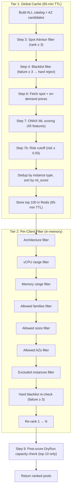

### Step 3 — Spot Advisor Filter
- Data source: `_get_spot_advisor_data()` (scraped from AWS Spot Advisor)
- Interruption rate ranks: 0 = <5%, 1 = 5-10%, 2 = 10-15%, 3 = 15-20%, 4 = >20%
- **Hard filter**: `rank <= 3` (reject pools with >20% interruption rate)

### Step 4 — Blacklist Check (Tiered)
- Redis set: `risky_pools:{region}`
- Failure count: `blacklist_failures:{instance_type}:{az}`
- **Hard reject**: `failure_count >= 3` (remove from pipeline)
- **Soft flag**: `failure_count 1-2` (kept, penalized -20% savings in Step 7)

### Step 6 — Price Fetch
- Source: `_get_pricing_data(region)` → AWS Pricing API cached in Redis
- Fallback: `_estimate_instance_price(instance_type)` based on family/size heuristic
- Safety checks:
  - If `spot_price <= 0` → set to `ondemand_price * 0.30`
  - If `spot_price >= ondemand_price` → set to `ondemand_price * 0.70`

### Step 7 — ML Scoring (ONNX Models)

**Models**: `ml_model/classifier_6.onnx` + `ml_model/regressor_6.onnx`
**Configuration**: `ml_model/risk_threshold.json` → `optimal_threshold: 0.35`, `model_version: 6`

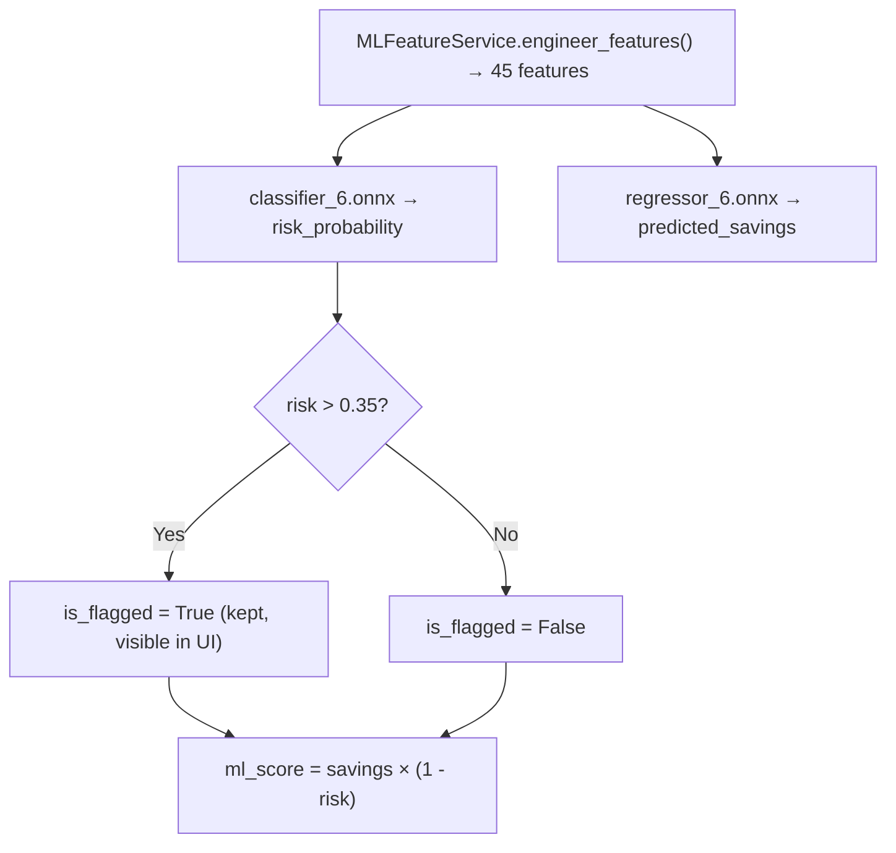

**Feature categories** (45 total):
| Category | Count | Source |
|---|---|---|
| Temporal | 10 | Hour, day, sin/cos transforms |
| Lag/History | 3 | 1h, 4h, 24h savings |
| Rolling Windows | 8 | 4h/24h mean, std, min, max |
| Price Dynamics | 5 | Spread, ratio, momentum |
| Family Patterns | 6 | Family-hour baselines |
| Family Stress | 3 | Cross-instance contagion |
| Events | 3 | Holiday/stress flags |
| Categorical | 7 | Family, size, AZ encoded |

**ML Circuit Breaker**: If ONNX inference fails 3+ times in 10 minutes → falls back to heuristic scoring (savings-only ranking).
- Redis keys: `atharvaai:ml_fail_count` (10 min TTL), `atharvaai:ml_degraded` (10 min TTL)

### Step 7b — Intelligence Risk Cutoff
- Hard cutoff at `risk_probability <= 0.50` in the global pipeline

### Step 9 — DryRun Capacity Check
- Only the **top 10** pools are DryRun-validated (API cost control)
- Budget: `spot:dryrun_count:{region}` (hourly)
- Per-pool failure: `spot:dryrun_failures_24h:{pool_id}` (24h rolling)

### Global Cache Constants
```
GLOBAL_CACHE_TTL = 65 × 60  # 65 minutes (3900 seconds)
GLOBAL_CACHE_LIMIT = 100    # Top 100 pools per region
```

---

## 1.3 Risk Engine — Composite Risk Score

**Source**: `backend/core/risk_engine.py` (343 lines)

### Constants (verified from code)
```
_K_LAPLACE             = 4.0       # Bayesian smoothing constant
_T_POOL_MINUTES        = 60.0      # Pool pressure half-life (minutes)
_ALPHA_ADVISOR         = 0.3       # Spot Advisor blending weight
_W_ADJUSTED_ML         = 0.35      # AdjustedML weight in BaseRisk
_W_VOLATILITY          = 0.10      # Volatility weight in BaseRisk
_W_POOL_PRESSURE       = 0.25      # Pool pressure weight in FinalRisk
_W_AZ_DELTA            = 0.15      # AZ delta weight in FinalRisk
_W_CLUSTER_INSTABILITY = 0.15      # Cluster instability weight in FinalRisk
_TAU_CONSERVATIVE_SECONDS = 7200.0 # Decay τ for conservative mode (120 minutes)
```

### Risk Computation Pipeline

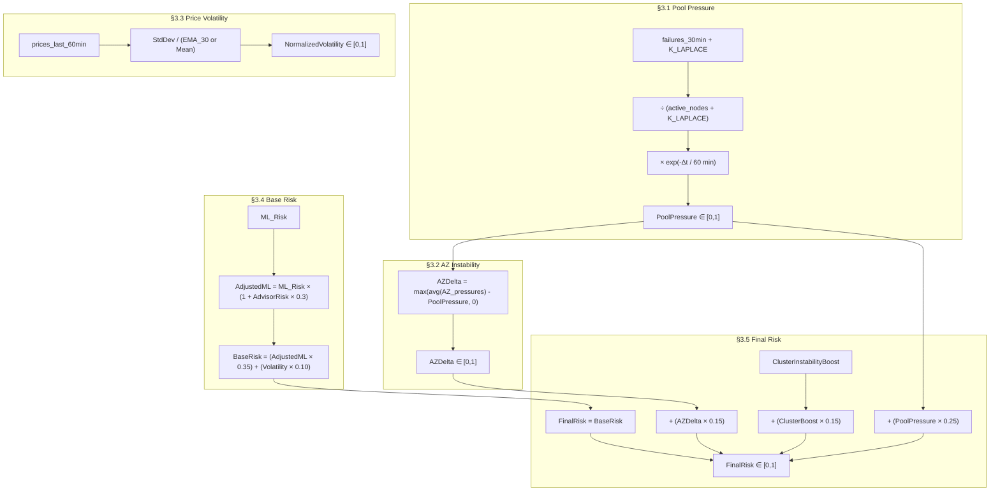

### Cluster Instability State Machine (Redis-Backed)

**Redis Key**: `spot:cluster_state:{cluster_id}` (NO TTL — permanent)

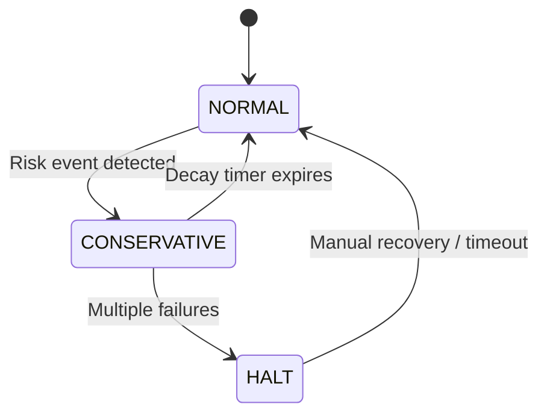

**Boost values**:
- `NORMAL`: boost = `0.0`
- `CONSERVATIVE`: boost = `1.3 × exp(-elapsed_seconds / 7200)` → decays from 1.3 → 0 over ~2h
- `HALT`: boost = `1.0` (constant maximum)

**Full Pipeline Function**: `compute_pool_risk()` — convenience function that chains all 5 steps and returns `{pool_pressure, az_delta, normalized_volatility, base_risk, cluster_instability_boost, final_risk}`.

---

## 1.4 Circuit Breaker State Machine

**Source**: `backend/services/circuit_breaker.py` (239 lines)

### Constants (verified from code)
```
ROLLBACK_WINDOW_SECONDS      = 3600    # 1 hour window for rollback counting
NORMAL_TO_CONSERVATIVE_COUNT = 2       # ≥2 rollbacks in 1h → CONSERVATIVE
CONSERVATIVE_TO_HALT_COUNT   = 3       # ≥3 rollbacks in 1h while CONSERVATIVE → HALT
HALT_STABLE_SECONDS          = 1800    # 30 min no failures → recover to CONSERVATIVE
CONSERVATIVE_DECAY_SECONDS   = 7200    # 2h stable + no failures → recover to NORMAL
```

### State Transitions

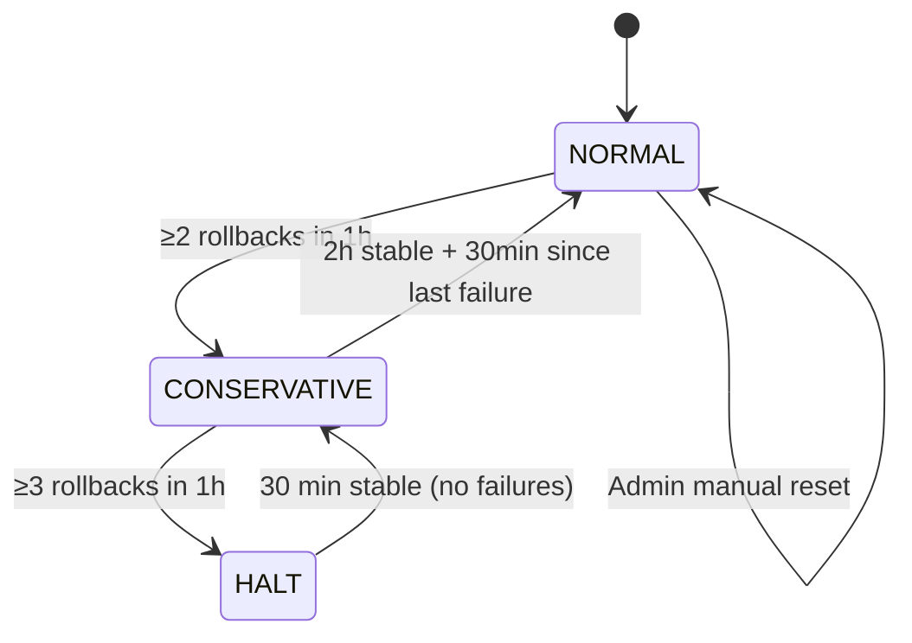

### Risk Multiplier (per state)
| State | Risk Multiplier | Formula |
|---|---|---|
| `NORMAL` | 1.0 | Constant |
| `CONSERVATIVE` | 1.3 → 0.0 (decaying) | `1.3 × exp(-minutes_in_state / 120)` |
| `HALT` | 2.0 | Constant — ALL automation blocked |

### Redis Keys
| Key | TTL | Purpose |
|---|---|---|
| `cb:state:{cluster_id}` | 24h | Current state |
| `cb:rollbacks:{cluster_id}` | 1h | Rollback counter |
| `cb:last_failure:{cluster_id}` | 1h | Last failure timestamp |
| `cb:state_entered:{cluster_id}` | 24h | State entry timestamp |

---

## 1.5 Cross-Cluster Instability Propagator

**Source**: `backend/services/instability_propagator.py` (191 lines)

### Propagation Flow
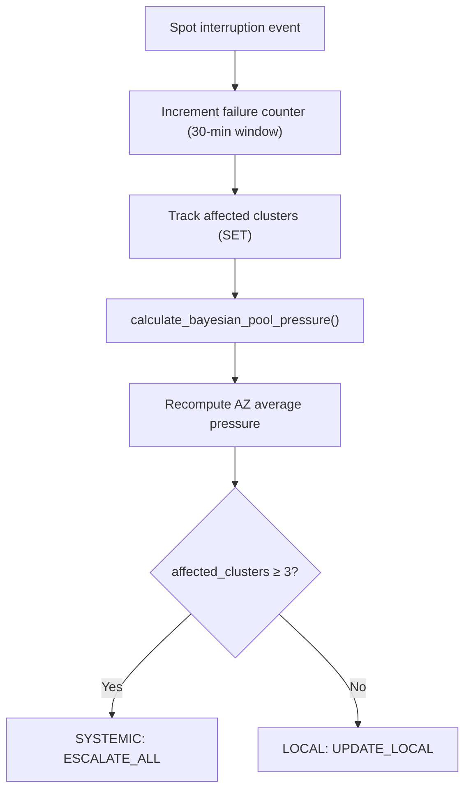

### Constants
```
SYSTEMIC_CLUSTER_THRESHOLD = 3   # ≥3 clusters impacted → systemic event
_TTL = 7200                      # 2h TTL for propagator keys
```

### Redis Keys
| Key | TTL | Purpose |
|---|---|---|
| `propagator:pool_pressure:{region}:{az}:{type}` | 2h | Per-pool pressure |
| `propagator:az_pressure:{region}:{az}` | 2h | AZ average pressure |
| `propagator:events:{region}:{az}:{type}` | 30min | Failure counter (30-min window) |
| `propagator:affected_count:{region}:{az}:{type}` | 2h | Set of affected cluster IDs |

---

## 1.6 EV Model — Economic Expected Value

**Source**: `backend/core/ev_model.py` (184 lines)

### Dynamic Capacity Failure Probability
```
Probability = DryRun_Failures_24h / DryRun_Attempts
Fallback: 0.05 if no data
Cap: min(probability, 0.50) — never assume total failure
```

### EV Formula Chain
```
1. EffectiveExposureHours = min(RiskHorizonHours, RecoveryTimeHours)
2. ExpectedInterruptionCost = FinalRisk × DowntimeCostPerHour × EffectiveExposureHours
3. CapacityFailureRisk = CapacityFailureProbability × RetryCost
4. MigrationPenalty = DrainTimeCost + WarmupCost + ControlPlaneCost
5. VolatilityCost = NormalizedVolatility × VolatilityCostMultiplier
6. EV = Savings - InterruptionCost - MigrationPenalty - CapacityFailureRisk - VolatilityCost
```

**Decision rule**: `EV > 0` → candidate eligible

### Default Parameter Values
| Parameter | Default | Unit |
|---|---|---|
| `risk_horizon_hours` | 2.0 | hours |
| `recovery_time_hours` | 0.5 | hours |
| `downtime_cost_per_hour` | 100.0 | USD |
| `retry_cost` | 10.0 | USD |
| `capacity_failure_probability` | 0.05 | ratio |
| `drain_time_cost` | 2.0 | USD |
| `warmup_cost` | 1.0 | USD |
| `control_plane_cost` | 0.5 | USD |
| `volatility_cost_multiplier` | 5.0 | multiplier |

### Legacy Scoring (`scoring.py`, 220 lines)
- `compute_expected_value()` — still used for current pool scoring in DE v3 and pool ranking sort order
- `compute_combined_expected_value()` — DEPRECATED fallback for pre-migration proposals
- **Simple formula**: `expected_value = savings × (1 - risk)`

---

## 1.7 Decision Engine v3 — 14-Step Policy Pipeline

**Source**: `backend/core/decision_engine.py` (781 lines)

### Optimization Profiles (verified from code)

| Profile | Risk Ceiling | Delta Threshold | Max Family Ratio | Max AZ Ratio | Staleness Penalty | Volatility Adj |
|---|---|---|---|---|---|---|
| `COST_FIRST` | 0.25 | 0.03 (3%) | 0.40 | 0.50 | 0.95 | -0.05 |
| `BALANCED` (default) | 0.20 | 0.05 (5%) | 0.40 | 0.50 | 0.95 | -0.05 |
| `NO_DOWNTIME_FIRST` | 0.10 | 0.08 (8%) | 0.30 | 0.40 | 0.95 | -0.05 |

**Model version**: `CURRENT_MODEL_VERSION = "6"`
**ITN bypass**: `ITN_BYPASS_ENABLED = True`

### 14-Step Pipeline Flowchart

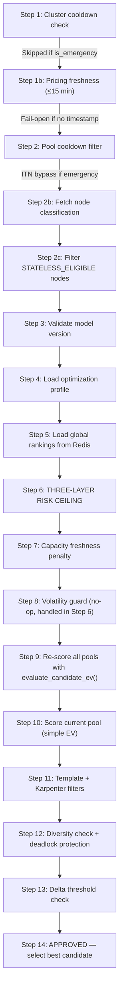

### Step 6 — Three-Layer Risk Ceiling
```
Layer 1: Profile ceiling (from optimization mode, e.g., BALANCED = 0.20)
Layer 2: Volatility adjustment (if volatile market: ceiling += volatility_ceiling_adjustment)
         Example: BALANCED in volatile market: 0.20 + (-0.05) = 0.15
Layer 3: Trust-phase override (use min of current ceiling and trust phase ceiling)
         Phase 0: risk_ceiling_override = 0.15
         Phase 1: risk_ceiling_override = 0.20
         Phase 2: risk_ceiling_override = None (use profile default)

Effective ceiling = min(Layer1 + Layer2, Layer3_override_if_set)
Hard reject: pool.risk_probability > effective_ceiling
```

### Step 10 — Current Pool Scoring
Uses the **simple** `compute_expected_value()`: `savings × (1 - risk)` — intentionally different from Step 9's full EV.

### Step 12 — Diversity Deadlock Protection
If no candidates pass diversity: `current_pool_ev >= 0.5` → hold current pool.

### Step 13 — Delta Threshold
```
delta = best_candidate_ev - current_pool_ev
if delta < profile.delta_threshold → REJECT
```

### Rejection Counters
**Redis Key**: `spot:rejection_counter:{cluster_id}:{reason}` (24h TTL)

---

## 1.8 Control Plane Loop — 8-Step Decision Cycle

**Source**: `backend/workers/tasks/control_plane_loop.py` (390 lines)

### Celery Tasks
- `run_all_clusters_decision_cycle`: Every 5 min, dispatches per-cluster cycles
- `run_decision_cycle`: Per-cluster, max 2 retries, 60s countdown

### Decision Cycle Flow

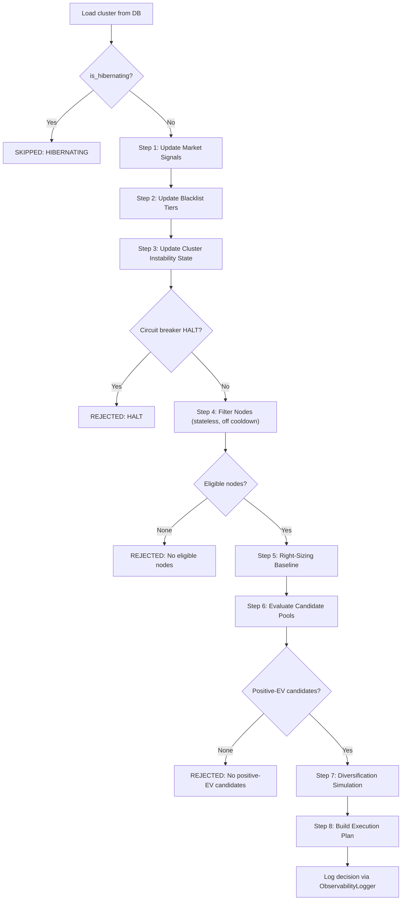

---

## 1.9 Execution Controller — 6-Step Safe Node Replacement

**Source**: `backend/services/execution_controller.py` (231 lines)

### Pipeline Steps

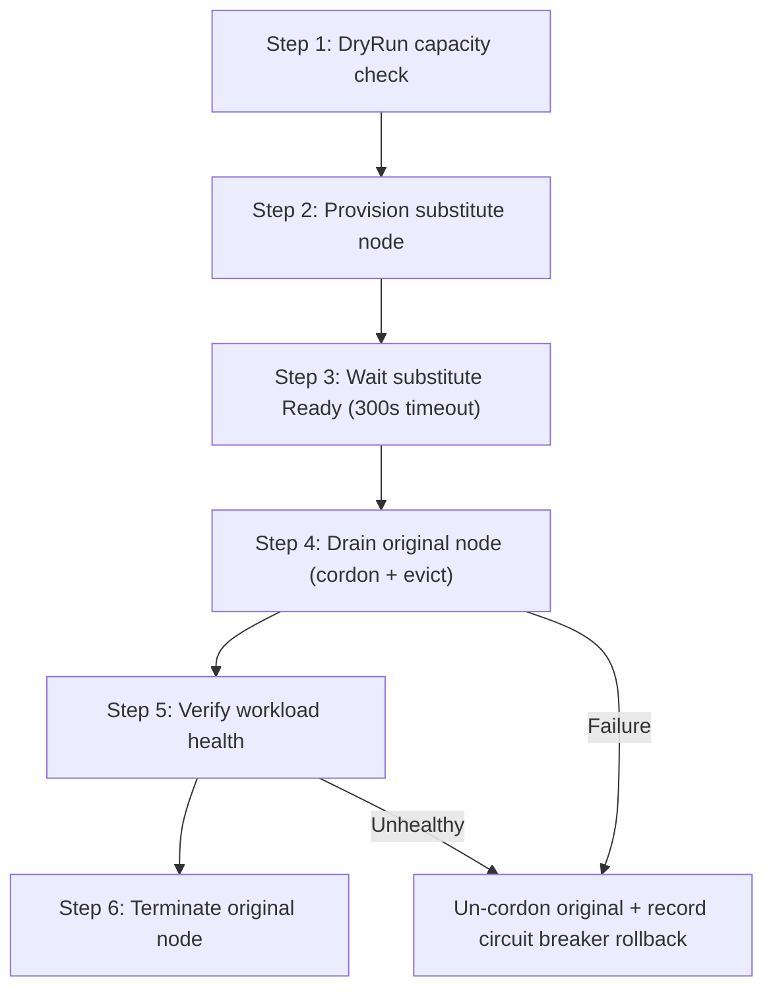

**On failure**: Increments rollback counter in circuit breaker.
**On success**: Records success in circuit breaker.
**Substitute wait timeout**: 300 seconds.

---

## 1.10 Cooldown Controller

**Source**: `backend/services/cooldown_controller.py` (340 lines)

### Cooldown Types

| Type | Redis Key | Default TTL | Purpose |
|---|---|---|---|
| Cluster switch | `spot:cooldown:cluster:{id}` | 60 min | Prevent cluster-level flapping |
| Pool reuse | `spot:cooldown:pool:{pool_id}` | 120 min | Prevent reusing failed pool |
| Resize | `spot:cooldown:resize:{id}` | 360 min (6h) | Prevent size oscillation |
| Pool switch | `spot:cooldown:pool_switch:{id}` | 30 min | Prevent rapid pool changes |
| Substitute | `spot:cooldown:substitute:{id}` | 120 min | Prevent substitute churn |
| **Stabilization lock** | `spot:stabilization_lock:{id}` | 300s (5 min) | Post-execution stabilization |

**Stabilization Lock**: Acquired after ANY execution action. Uses `SET NX EX` for atomic acquisition.
**Emergency Override**: `override_for_emergency()` deletes the cluster cooldown key.

---

## 1.11 Blacklist Service

**Source**: `backend/services/blacklist_service.py` (423 lines)

### Blacklisting Flow

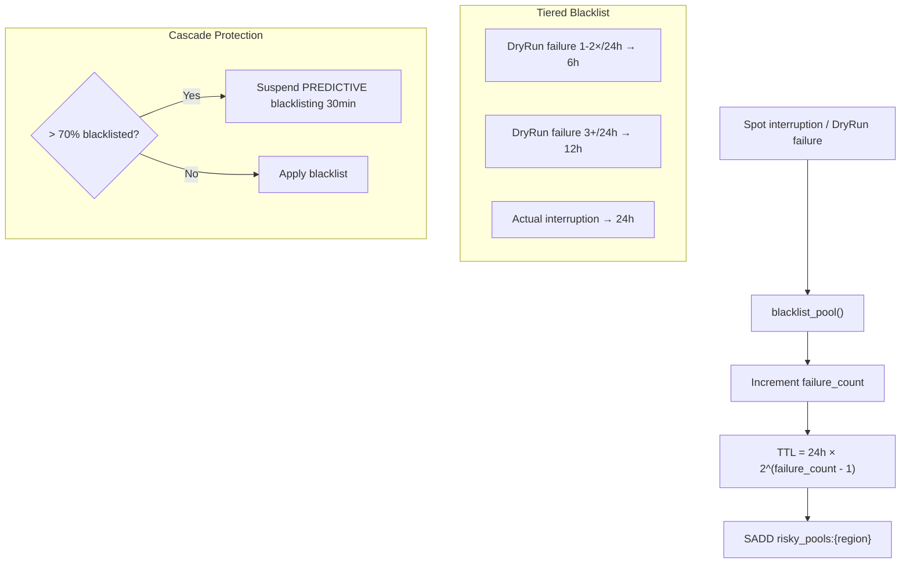

**Cascade dampener**: `spot:blacklist_suspended:{region}` (30 min TTL). Only PREDICTIVE suspended; deterministic always honored.

---

## 1.12 Substitute Manager

**Source**: `backend/services/substitute_manager.py` (969 lines)

### State Machine

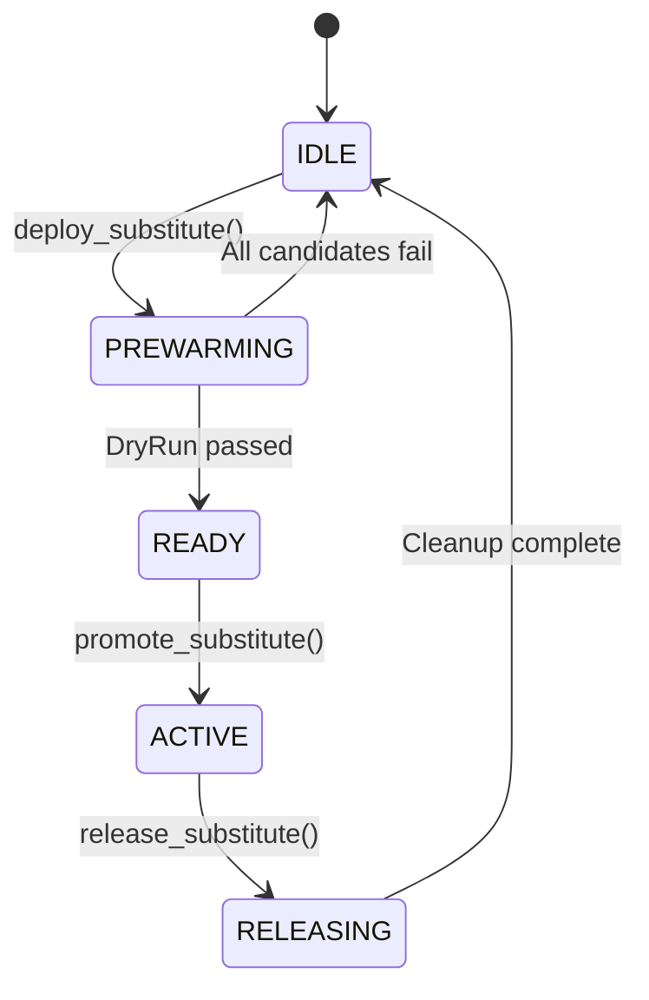

**Redis keys**: `spot:substitute:state:{cluster_id}`, `spot:substitute:meta:{cluster_id}`

### Warm Spare System (`maintain_warm_spare_worker.py`, 141 lines)
- Runs every **5 minutes** via Celery Beat
- Ensures **≥1 warm substitute** per auto-rebalance-enabled cluster
- Sized for the **LARGEST node** in the cluster
- Uses the **CHEAPEST** available spot pool for those specs
- When substitute is promoted → immediately provisions replacement

---

## 1.13 Event Monitor — Termination + Volatility

**Source**: `backend/services/event_monitor.py` (690 lines)

### Termination Path (bypasses normal pipeline)
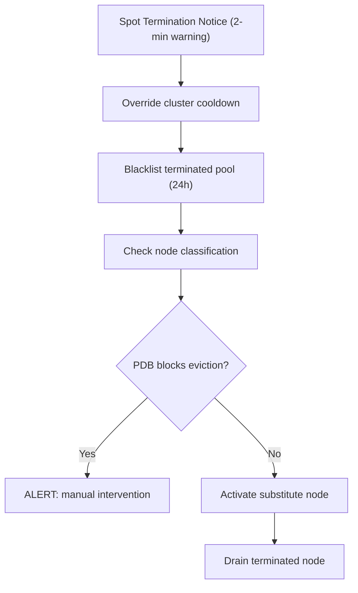

**Bypasses**: delta threshold, savings check, cluster cooldown, pool cooldown

### Volatility Regime Detection
```
1. Compute rolling 24h StdDev of spot prices
2. Compare against 30-day distribution
3. If current_stddev > P75 of historical → VOLATILE
4. Set Redis flag: spot:volatility_regime:{region} (2h TTL)
```

---

## 1.14 Termination Monitor — Detection + Emergency Rebalancing

**Source**: `backend/workers/tasks/termination_monitor.py` (316 lines)

### Detection Sources
1. **EventBridge**: AWS termination notices (2-minute warning)
2. **DaemonSet agent**: Node-level termination detection via API endpoint
3. **Manual API**: User flags via UI

### Flow
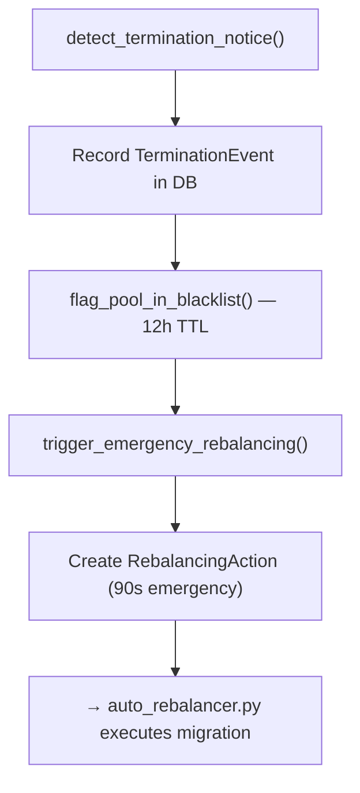

### Auto-Rebalancer (`auto_rebalancer.py`, 522 lines)
| Type | Timeout | Trigger |
|---|---|---|
| Emergency | 90 seconds | Termination notice |
| Graceful | 10 minutes | Scheduled/proactive optimization |

**Steps**: Cordon nodes → Drain pods → Karpenter provisions replacements on safe pools.

---

## 1.15 Resize Guard — Post-Resize Health Monitoring

**Source**: `backend/workers/tasks/resize_guard_worker.py` (168 lines)

Monitors cluster health for **2 hours** after any resize action. Runs every **5 minutes**.

### Rollback Triggers
| Trigger | Threshold | Action |
|---|---|---|
| CPU Stress | `cpu_avg_10m > 85%` sustained | Mark proposal FAILED |
| Pod Restart Spike | `restart_rate > baseline × 2` | Mark proposal FAILED |
| Memory Pressure | `> 5 memory pressure events` | Mark proposal FAILED |

### Pod Restart Baseline
- Updated **hourly** by `update_pod_restart_baseline` task
- Baseline = average restarts over last 24h (excluding last 2h guard window)
- Redis key: `metrics:pod_restart_baseline:{cluster_id}` (1h TTL)

---

## 1.16 Pool Rotation Service

**Source**: `backend/services/pool_rotation_service.py` (572 lines)

### Rotation Triggers
1. Viable pool count < `min_viable_threshold`
2. Primary AZ has < 30% viable pools
3. Cascade risk detected (> 70% blacklisted globally)

### Actions
1. Promote backup AZs to primary selection
2. Update cluster metadata with new primary AZ
3. Clear Redis pool ranking cache (force re-rank)
4. Proactively refresh top 20 from healthy AZs

---

## 1.17 Guardrail Engine

**Source**: `backend/services/guardrail_engine.py` (351 lines)

### §5.1 Hard Guards (all must pass)

| Guard | Default | Description |
|---|---|---|
| Spot Ratio | ≤ 0.80 | Max 80% spot nodes |
| AZ Concentration | ≤ 0.60 | No AZ > 60% of spot nodes |
| Family Concentration | ≤ 0.50 | No instance family > 50% |
| Daily Spend Cap | ≤ $10,000 | Daily spend limit |
| Concurrent Nodes Down | ≤ 3 | Max simultaneous drains |
| Stateful Node | `False` | Block optimization on stateful |
| Maintenance Window | `False` | Not during maintenance |

### §5.2 Spend Velocity Guard
```
SpendVelocity = HourlyCostNow - HourlyCost1hAgo
If velocity > 50 USD/hr → Block upward resizes
Downward resizes always allowed
```

### §5.2b Org-Level Spend Velocity Guard
```
Redis key: spot:org_spend_state:{org_id}
Threshold: spot:config:org_velocity_threshold (default 200 USD/hr)
If org-wide velocity > threshold → Block ALL clusters in org
```

### §5.3 Stabilization Guard
```
After execution wait 2–5 min. Default stabilization_minutes = 3.0
```

### §5.4 Cluster Health Score
```
HealthScore = 0.25×(PendingPods) + 0.25×(ReadyNodes) + 0.25×(Latency) + 0.25×(CPUHeadroom)
Threshold: ≥ 0.75 required to proceed
```

---

## 1.18 Karpenter Integration

**Source**: `backend/services/karpenter_service.py` (811 lines)

### On-Demand Fallback
- **TTL**: `FALLBACK_TTL_SECONDS = 12 × 3600` (12 hours)
- **Redis key**: `spot:ondemand_fallback:{cluster_id}`

### Circuit Breaker
- **Threshold**: > 10 execution failures in 10 minutes
- **Redis key**: `spot:execution_failures:{cluster_id}` (10 min TTL)
- **Retries**: `MAX_PATCH_RETRIES = 2`, delays [5, 15] seconds

---

## 1.19 Diversity Enforcer

**Source**: `backend/services/diversity_enforcer.py` (168 lines)

### Check Algorithm
- Projects "+1 node" before checking ratios (adds candidate to distribution first)
- `family_ratio = (family_count + 1) / (total_nodes + 1)`
- `az_ratio = (az_count + 1) / (total_nodes + 1)`
- **Fail-open**: On exceptions, returns `(True, "")` — doesn't block operations

---

## 1.20 Observability Logger

**Source**: `backend/services/observability_logger.py` (200 lines)

### Decision Audit Trail
- Writes JSON logs + Redis cache + DB audit table
- **Redis**: `obs:decisions:{cluster_id}` — last 100 decisions, 24h TTL
- Logs: decisions, state transitions, guardrail blocks, pool switches, rightsizing proposals
- Each decision gets a unique `decision_id` for correlation

---

## 1.21 Global Risk Tracker ("Hive Mind")

**Source**: `backend/modules/risk_tracker.py` (227 lines)

### Cross-Client Intelligence
- When one client experiences interruption → ALL clients warned
- **Redis key**: `RISK:{az}:{instance_type}` → "DANGER"
- **TTL**: 30 minutes (configurable via `GLOBAL_RISK_TTL`)
- **Counter**: `interruption_history:{region}:{az}:{type}` (persistent, no TTL)
- **Pub/Sub**: Publishes to `risk:flagged` channel for real-time notifications

---

## 1.22 Distributed Locks Service

**Source**: `backend/services/distributed_locks.py` (398 lines)

### Components
1. **DistributedLock**: `SET key value NX EX timeout` — default 120s timeout, 0.1s retry delay. Safe release via lock_id comparison (prevents releasing other's lock).
2. **AtomicRateLimiter**: Lua script for atomic `increment + expire` — prevents TOCTOU races in DryRun budget checks.
3. **CircuitBreakerService**: DB-persisted circuit breaker with Redis cache. Syncs to DB on every state change. Enterprise guardrail for Karpenter/SubstituteManager.

---

## 1.23 Data Collection — Scrapers

### Spot Advisor Scraper (`backend/scrapers/spot_advisor_scraper.py`, 437 lines)
- **Source URL**: `https://spot-bid-advisor.s3.amazonaws.com/spot-advisor-data.json`
- **Schedule**: Daily at 2:00 AM UTC
- **Output**: Interruption frequency (0-4) + savings percentage per instance type per region
- **Risk Score formula**: `score = interruption_index / 4.0` (normalized 0.0-1.0)

### Pricing Collector (`backend/scrapers/pricing_collector.py`, 579 lines)
- **Spot prices**: Every 5 minutes via `ec2.describe_spot_price_history()`
- **On-Demand prices**: Daily at 1:00 AM via AWS Price List API
- **Regions monitored**: 11 AWS regions (us-east-1, us-east-2, us-west-1, us-west-2, eu-west-1, eu-west-2, eu-central-1, ap-south-1, ap-southeast-1, ap-southeast-2, ap-northeast-1)
- **Savings calculation**: `savings_pct = ((ondemand - spot) / ondemand) × 100`

---

## 1.24 Multi-Agent Orchestrator

**Source**: `backend/agents/orchestrator.py` (321 lines)

### 8-Agent Pipeline
```
1. GlobalIntelligenceAgent → Rank pools
2. CapacityValidator → Filter available pools
3. DecisionEngine → Select pool
4. RightsizingAgent → Resize if needed
5. CooldownControllerAgent → Prevent flapping
6. SubstituteManagerAgent → Pre-warm substitutes
7. ClusterExecutionAgent → Execute actions
8. EventMonitoringAgent → Handle interruptions
```

### Entry Points
- `execute_optimization_pipeline()` — full optimization cycle
- `execute_rightsizing_analysis()` — rightsizing-only analysis
- `handle_spot_interruption_event()` — emergency interruption handling

---

## 1.25 Bin Packing Module

**Source**: `backend/modules/bin_packer.py` (387 lines)

### Fragmentation Analysis
- Identifies underutilized nodes (`< 30%` CPU and memory usage)
- Calculates consolidation opportunities
- Generates pod migration plans respecting PDBs

### Migration Plan Parameters
- `aggressiveness`: 0.0–1.0 (controls how aggressively to consolidate)
- Safety: Skips control plane nodes, system pods, and explicitly excluded tags

---

# SECTION 2: RIGHT-SIZING

## 2.1 Architecture Overview

| Component | File | Lines | Purpose |
|---|---|---|---|
| **Service** | `rightsizing_service.py` | 836 | Pod metrics analysis + recommendations |
| **Coordinator** | `optimizer_coordinator.py` | 645 | Phase machine + EV comparison |
| **Model** | `rightsizing_proposal.py` | — | Proposal DB model |
| **Worker** | `atharvaai_worker.py` | — | Scheduled pipeline execution |

---

## 2.2 Right-Sizing Recommendation Engine

**Source**: `backend/services/rightsizing_service.py`

### Constants
```
SAFETY_BUFFER_PCT = 20         # 20% overhead on P95 usage
OVERSIZED_THRESHOLD_PCT = 50   # Request ≥ 50% above usage → "oversized"
UNDERSIZED_THRESHOLD_PCT = 95  # Usage ≥ 95% of request → "undersized"
```

### Recommendation Flow
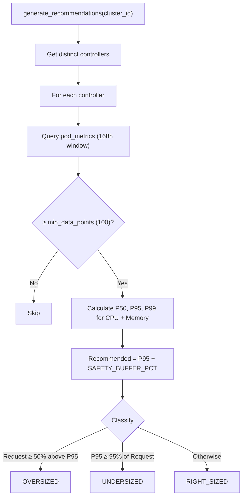

### Confidence Levels
| Level | Criteria |
|---|---|
| HIGH | `data_points >= min_data_points × 3` AND `window >= 72h` |
| MEDIUM | `data_points >= min_data_points` |
| LOW | Insufficient data (fallback) |

---

## 2.3 Cost Estimation
```
monthly_cost = (cpu_millicores / 1000) × cpu_hourly_rate × 730
             + (memory_mb / 1024) × mem_hourly_rate × 730
```

**Instance family cost modifiers**:
| Family | CPU $/core-hr | Mem $/GB-hr |
|---|---|---|
| t3/t3a | 0.0325 | 0.0041 |
| m5/m6i/m6a | 0.0425 | 0.0053 |
| c5/c6i/c6a | 0.0365 | 0.0046 |
| r5/r6i | 0.0540 | 0.0068 |
| Graviton | General × 0.8 | Memory × 0.8 |

---

## 2.4 Optimizer Coordinator — Phase Machine

**Source**: `backend/services/optimizer_coordinator.py` (645 lines)

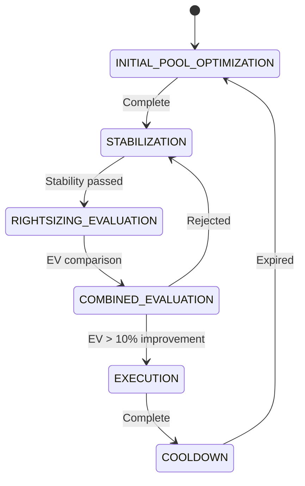

### Progressive Trust Phases (verified from code)

| Phase | Cluster Age | Rightsizing | Safety Buffer | Min Samples | Risk Ceiling Override |
|---|---|---|---|---|---|
| **Phase 0** | 0–30 min | No | 30% | 500 | 0.15 |
| **Phase 1** | 30 min – 2h | Yes (conservative) | 25% | 500 | 0.20 |
| **Phase 2** | > 2h | Yes (full) | 20% | 100 | None (profile default) |

> **Note**: Phase 2 activates at > 2 hours (NOT > 24 hours). Full rightsizing becomes available after just 2 hours.

### Combined EV Evaluation
Compares three options:
- **Option A**: Current size + new pool (pool only)
- **Option B**: New size + best pool for new size (combined)
- **Option C**: Current size + current pool (do nothing)

---

# SECTION 3: HIBERNATION

## 3.1 Architecture Overview

| Component | File | Lines | Purpose |
|---|---|---|---|
| **Service** | `hibernation_service.py` | 445 | Schedule CRUD, conflict detection, savings |
| **Worker** | `hibernation_worker.py` | 390 | Celery tasks for sleep/wake/prewarm |
| **Strategies** | `hibernation_strategy/` | 540 | Implementation per strategy type |

---

## 3.2 Strategies & Implementations

| Strategy | File | Lines | Description | Savings | Wake Time |
|---|---|---|---|---|---|
| `NAMESPACE_SLEEP` | `namespace_sleep.py` | 370 | Scale workloads to 0 replicas | 80% | 2 min |
| `NUCLEAR` | `nuclear.py` | 79 | Scale ASGs to 0, terminate workers | 70% | 5 min |
| `SNAPSHOT_RESTORE` | `snapshot_restore.py` | 91 | EBS snapshot + full shutdown | 95% | 15 min |

### Namespace Sleep Configuration Constants
```
SYSTEM_NAMESPACES = ["kube-system", "kube-public", "kube-node-lease", "spot-optimizer"]
WAKE_ORDER = ["StatefulSet", "Deployment", "CronJob", "Job"]
MAX_CONCURRENT_OPERATIONS = 10
OPERATION_DELAY_SECONDS = 0.5
POD_TERMINATION_TIMEOUT = 300
RESPECT_PDB = True
```

### Nuclear Configuration
```
MIN_DESIRED_CAPACITY = 0
SCALE_DOWN_TIMEOUT = 600
TERMINATION_POLICIES = ["OldestInstance"]
```

### Snapshot Restore Configuration
```
SNAPSHOT_TIMEOUT = 1800       # 30 minutes
KEEP_SNAPSHOTS_DAYS = 7
PARALLEL_SNAPSHOTS = 5
```
**Note**: SNAPSHOT_RESTORE delegates to Nuclear for actual cluster shutdown/wake after creating EBS snapshots.

---

## 3.3 Schedule Matrix Format

| Type | Length | Encoding |
|---|---|---|
| WEEKLY | 168 chars | 7 days × 24 hours |
| DAILY | 31 chars | 1 month of days |
| MONTHLY | 744 chars | 31 days × 24 hours |

- `'0'` = AWAKE, `'1'` = SLEEPING

---

## 3.4 Savings Estimation
```
sleep_hours = matrix.count('1')
hourly_cost = cluster.monthly_cost / 730
weekly_savings = sleep_hours × hourly_cost × strategy_percentage
annual_savings = weekly_savings × 52
```

---

## 3.5 Hibernation Worker — Distributed Execution

**Source**: `backend/workers/tasks/hibernation_worker.py` (390 lines)

### Distributed Locking
```
Lock key: hibernation:lock:{schedule_id}:{cluster_id}
Lock TTL: 180 seconds
Acquisition: SET NX EX (atomic)
Release: Only if we still own it (compare lock_value)
```

### Tasks
| Task | Schedule | Description |
|---|---|---|
| `execute_hibernation_scheduler` | Every 1 min | Check schedules, dispatch sleep/wake |
| `execute_hibernation` | On-demand | Execute sleep with per-cluster locking |
| `execute_wake` | On-demand | Execute wake with staleness check |
| `execute_prewarm` | `pre_warm_minutes` before wake | Start nodes early |

**Wake staleness check**: If `hibernation_state` timestamp is >4 hours old → treat as stale, re-validate.

---

# SECTION 4: CLUSTER MANAGEMENT API

**Source**: `backend/api/cluster_routes.py` (673 lines)

### Key Endpoints

| Method | Path | Description |
|---|---|---|
| GET | `/api/v1/clusters` | List all clusters for organization |
| POST | `/api/v1/clusters/register` | Register a new cluster |
| POST | `/api/v1/clusters/{id}/connect` | Connect/onboard a cluster |
| PUT | `/api/v1/clusters/{id}` | Update cluster settings |
| DELETE | `/api/v1/clusters/{id}` | Decommission a cluster |
| GET | `/api/v1/clusters/{id}/health` | Cluster health check |
| PUT | `/api/v1/clusters/{id}/optimization-settings` | Update optimization mode |
| POST | `/api/v1/clusters/{id}/install-agent` | Generate agent install script |
| POST | `/api/v1/clusters/{id}/fallback` | Manual on-demand fallback |

---

# APPENDIX A: Complete Redis Key Reference

| Key Pattern | Service | TTL | Purpose |
|---|---|---|---|
| `spot:cooldown:cluster:{id}` | CooldownController | 60 min | Cluster switch cooldown |
| `spot:cooldown:pool:{pool_id}` | CooldownController | 120 min | Pool failure cooldown |
| `spot:cooldown:resize:{id}` | CooldownController | 360 min | Resize cooldown |
| `spot:cooldown:pool_switch:{id}` | CooldownController | 30 min | Pool switch cooldown |
| `spot:cooldown:substitute:{id}` | CooldownController | 120 min | Substitute fallback cooldown |
| `spot:stabilization_lock:{id}` | CooldownController | 5 min (300s) | Post-execution stabilization |
| `spot:node_classification:{id}` | WorkloadInspector | 10 min | Node status map |
| `spot:cluster_mode:{id}` | DecisionEngine | 300s | Optimization mode |
| `spot:global_rankings:{region}` | Intelligence Layer | Variable | Pre-computed rankings |
| `spot:volatility_regime:{region}` | EventMonitor | 2 hours | Volatile market flag |
| `spot:rankings:{region}` | GlobalPoolCacheService | 65 min | Global pool cache |
| `spot:ondemand_fallback:{id}` | KarpenterService | 12 hours | On-demand fallback |
| `spot:execution_failures:{id}` | KarpenterService | 10 min | Circuit breaker |
| `spot:dryrun_count:{region}` | PoolRankingService | 1 hour | DryRun budget |
| `spot:dryrun_failures_24h:{pool}` | PoolRankingService | 24 hours | Per-pool DryRun failures |
| `spot:cluster_state:{cluster_id}` | risk_engine.py | NONE | Persistent cluster state machine |
| `spot:rankings_version:{region}` | multiple | NONE | Optimistic lock version |
| `spot:execution_plan:{cluster_id}` | control_plane_loop.py | 1h | Execution plan hash |
| `spot:org_spend_state:{org_id}` | billing_service.py | 1h | Org spend velocity |
| `spot:rejection_counter:{id}:{reason}` | decision_engine.py | 24h | Decision rejection counters |
| `spot:config:org_velocity_threshold` | config (manual) | NONE | Org velocity threshold |
| `spot:substitute:state:{id}` | SubstituteManager | Variable | Substitute lifecycle |
| `spot:substitute:meta:{id}` | SubstituteManager | Variable | Substitute metadata |
| `spot:active_cluster_count` | Workers | Variable | Active cluster count |
| `hibernation:lock:{sched}:{cluster}` | HibernationWorker | 180s | Distributed lock |
| `atharvaai:ml_fail_count` | PoolRankingService | 10 min | ML circuit breaker |
| `atharvaai:ml_degraded` | PoolRankingService | 10 min | ML degraded flag |
| `risky_pools:{region}` | BlacklistService | Variable | Blacklisted pool set |
| `blacklist_failures:{type}:{az}` | BlacklistService | Variable | Failure count per pool |
| `spot:blacklist_suspended:{region}` | BlacklistService | 30 min | Cascade dampener |
| `capacity:{type}:{az}` | PoolRankingService | 15 min | Capacity DryRun cache |
| `global_pool_rankings:{region}` | PoolRankingService | 65 min | Tier 1 global cache |
| `cb:state:{cluster_id}` | CircuitBreaker | 24h | CB state |
| `cb:rollbacks:{cluster_id}` | CircuitBreaker | 1h | Rollback counter |
| `cb:last_failure:{cluster_id}` | CircuitBreaker | 1h | Last failure time |
| `cb:state_entered:{cluster_id}` | CircuitBreaker | 24h | State entry time |
| `propagator:pool_pressure:{r}:{az}:{type}` | InstabilityPropagator | 2h | Pool pressure |
| `propagator:az_pressure:{r}:{az}` | InstabilityPropagator | 2h | AZ average pressure |
| `propagator:events:{r}:{az}:{type}` | InstabilityPropagator | 30 min | Failure counter |
| `propagator:affected_count:{r}:{az}:{type}` | InstabilityPropagator | 2h | Affected cluster set |
| `obs:decisions:{cluster_id}` | ObservabilityLogger | 24h | Decision audit cache (last 100) |
| `RISK:{az}:{type}` | GlobalRiskTracker | 30 min | Hive Mind risk flag |
| `resize:guard:{cluster_id}:invocations` | ResizeGuardWorker | 2h | Guard invocation counter |
| `resize:rollback_needed:{cluster_id}` | ResizeGuardWorker | 1h | Rollback flag |
| `resize:failure_count_24h:{id}` | OptimizerCoordinator | 24h | Resize circuit breaker |
| `pricing:last_updated:{region}` | Market Ingestion | Variable | Pricing timestamp |

> **Source of truth for Redis keys**: `backend/redis_keys.py` + actual code

---

# APPENDIX B: WorkloadInspector Classification Logic

**Source**: `backend/services/workload_inspector.py` (333 lines)

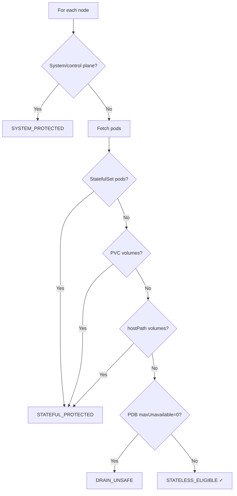

Cache: `spot:node_classification:{cluster_id}` (10-min TTL)

---

# 5. Agent Logic (Client-Side DaemonSet)

The logic below pertains to the **Agent**, installed as a **DaemonSet** on client Kubernetes servers.

## 5.1 Registration & Authentication
- Uses `CLUSTER_ID` + `API_KEY` to register with backend (`/api/v1/agents/register`)
- Generates unique `AGENT_ID` (hostname + UUID)
- **HMAC**: `SECRET_KEY` verifies all backend-directed action commands

## 5.2 Metrics Collection (`MetricsCollector`)
**Source**: `agent/collector.py`
- Schedule: 60s batched collection
- Prioritizes `psutil` (if `HOST_PROC` mounted) → fallback to `metrics.k8s.io` API
- Nodes < 5 min old marked `CALIBRATING`
- Payload: pod + node + event metrics → `/api/v1/agent-metrics/batch`

## 5.3 Right-Sizing Pod Metrics (`PodMetricsCollector`)
**Source**: `agent/pod_metrics_collector.py`
- Filters **only local node** pods (`pod.spec.node_name == self.node_name`)
- Extracts controller info, CPU (millicores), memory (bytes), QoS class
- Submission: every 5 min → `/api/v1/pod-metrics/batch`

## 5.4 Safety and Execution (`ActionActuator`)
**Source**: `agent/actuator.py`
- Polls `/api/v1/actions/poll`
- **HMAC validated** before any action
- **PDB Guardrail**: Checks `disruptions_allowed < 1` → blocks eviction, returns HTTP 429
- Reports results → `/api/v1/actions/{action_id}/result`

## 5.5 Spot Interruption Detection (`SpotPoller`)
**Source**: `agent/poller.py`
- Polls AWS IMDS (`http://169.254.169.254/latest/meta-data/spot/instance-action`) every **5 seconds**
- On termination: 1) Cordon → 2) Drain (force=True) → 3) Webhook to `/api/v1/clusters/{cluster_id}/fallback`

## 5.6 Real-Time Communication (`WebSocketClient` & `HeartbeatSender`)
- **WebSocket**: Bidirectional `wss://` for real-time actions + config updates. Exponential backoff for reconnections.
- **Heartbeat**: HTTP to `/api/v1/agents/heartbeat` with process health (CPU, memory) + thread health.
- **Probes**: `/healthz` and `/readyz` for Kubernetes lifecycle.
