# Spot Optimizer Platform — Complete Backend Logic Reference

> **Source of truth**: Extracted exclusively from `.py`, `.json`, `.jsx` files.
> **Files analyzed**: 147+ backend Python services, 10+ Celery workers, 60+ models, 6 core modules, 1 guardrail engine, 6 modules, 8 agents, 3 hibernation strategies, 2 scrapers.
> **Zero `.md` or `.txt` files referenced.**
> **Last updated**: 2026-03-06 (exhaustive re-audit of ALL backend files)

---

# SECTION 1: SYSTEM OVERVIEW

## 1.1 Architecture Overview

The platform consists of 10 core engines coordinated through a central control plane:

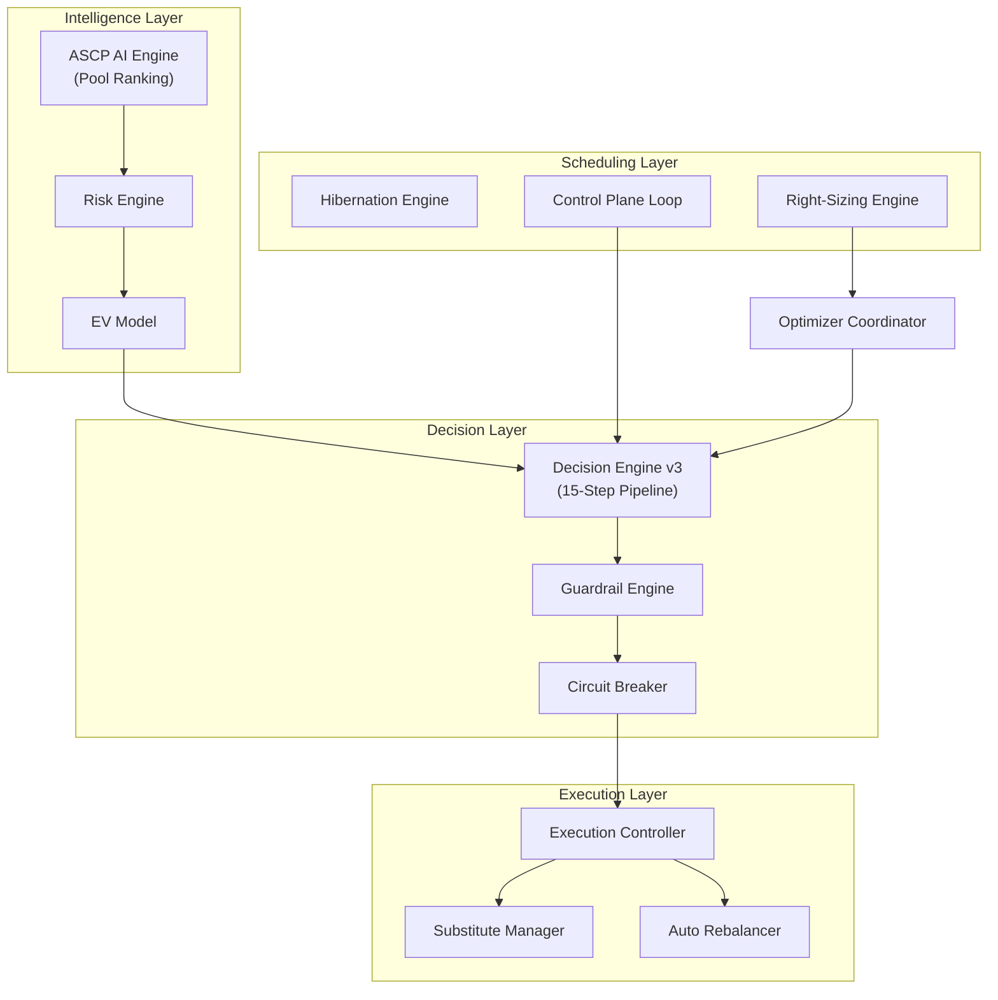

## 1.2 Engine Registry

| Engine | Primary File | Lines | Purpose |
|---|---|---|---|
| **ASCP AI (System A)** | `pool_ranking_service.py` | 1659 | 2-tier ML scoring pipeline with ONNX models |
| **Risk Engine** | `risk_engine.py` | 343 | Bayesian risk composition (5 components) |
| **EV Model** | `ev_model.py` | 184 | Economic expected value with 6-term formula |
| **Decision Engine v3** | `decision_engine.py` | 781 | 15-step policy evaluation pipeline |
| **Guardrail Engine** | `guardrail_engine.py` | 351 | Hard guards + spend velocity + health score |
| **Circuit Breaker** | `circuit_breaker.py` | 239 | NORMAL→CONSERVATIVE→HALT state machine |
| **Cooldown Controller** | `cooldown_controller.py` | 340 | 6-type anti-flapping enforcement |
| **Execution Controller** | `execution_controller.py` | 231 | 6-step safe node replacement |
| **Substitute Manager** | `substitute_manager.py` | 969 | Zero-downtime substitute node lifecycle |
| **Optimizer Coordinator** | `optimizer_coordinator.py` | 645 | Phase machine + trust phases |
| **Hibernation Service** | `hibernation_service.py` | 445 | Schedule CRUD + savings calculation |
| **Right-Sizing Service** | `rightsizing_service.py` | 836 | Pod metrics analysis + recommendations |

### Supporting Services

| Service | File | Lines | Purpose |
|---|---|---|---|
| `BlacklistService` | `blacklist_service.py` | 423 | Tiered pool blacklisting on interruption |
| `DiversityEnforcer` | `diversity_enforcer.py` | 168 | Family/AZ concentration guard (+1 projection) |
| `WorkloadInspector` | `workload_inspector.py` | 333 | Stateful vs Stateless node classification |
| `EventMonitor` | `event_monitor.py` | 690 | Termination notice handler + volatility detection |
| `PoolRotationService` | `pool_rotation_service.py` | 572 | AZ auto-failover |
| `GlobalPoolCacheService` | `global_pool_cache_service.py` | 206 | Region-wide ML cache (65-min TTL) |
| `MLFeatureService` | `ml_feature_service.py` | 524 | 45-feature engineering for ONNX |
| `InstabilityPropagator` | `instability_propagator.py` | 191 | Cross-cluster risk propagation |
| `ObservabilityLogger` | `observability_logger.py` | 200 | Decision audit trail (Redis + DB) |
| `DistributedLocks` | `distributed_locks.py` | 398 | NX EX locks + Lua rate limiting |

### Workers (Celery Beat Schedule)

| Worker | File | Schedule | Purpose |
|---|---|---|---|
| `execute_pool_ranking_pipeline` | `atharvaai_worker.py` | 1 hour | Full ML pipeline |
| `collect_spot_prices` | `atharvaai_worker.py` | 10 min | Historical price collection |
| `compute_family_baselines` | `atharvaai_worker.py` | Weekly | Family-hour statistics |
| `sync_karpenter_nodepools` | `atharvaai_worker.py` | 1 hour | NodePool YAML sync |
| `run_all_clusters_decision_cycle` | `control_plane_loop.py` | 5 min | Control plane loop |
| `execute_hibernation_scheduler` | `hibernation_worker.py` | 1 min | Schedule checker |
| `execute_rebalancing` | `auto_rebalancer.py` | On-demand | Node migration |
| `maintain_warm_spare_all_clusters` | `maintain_warm_spare_worker.py` | 5 min | Warm substitute per cluster |
| `resize_guard_worker` | `resize_guard_worker.py` | 5 min | 2h post-resize health monitoring |
| `update_pod_restart_baseline` | `resize_guard_worker.py` | 1 hour | Pod restart baseline |
| `monitor_terminations` | `termination_monitor.py` | On-demand | Spot interruption detection |
| `scrape_spot_advisor_task` | `spot_advisor_scraper.py` | Daily 2AM | Spot Advisor data refresh |
| `collect_spot_prices_task` | `pricing_collector.py` | 5 min | Pricing data collection |
| `collect_ondemand_prices_task` | `pricing_collector.py` | Daily 1AM | On-Demand price refresh |

---

# SECTION 2: ASCP AI ENGINE — ML Pipeline (System A)

**Source**: `backend/services/pool_ranking_service.py` (1659 lines)

## 2.1 Two-Tier Architecture

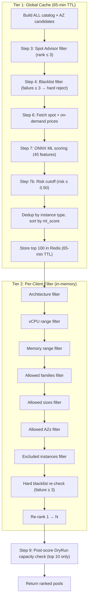

### Global Cache Constants (verified from code L34-36)
```python
GLOBAL_CACHE_TTL = 65 * 60    # 65 minutes (3900 seconds)
GLOBAL_CACHE_LIMIT = 100      # Top 100 pools cached per region
```

## 2.2 Step 3 — Spot Advisor Filter
- Data source: `_get_spot_advisor_data()` (scraped from AWS Spot Advisor)
- Rank encoding: 0 = <5%, 1 = 5-10%, 2 = 10-15%, 3 = 15-20%, 4 = >20%
- **Hard filter**: `rank <= 3` (reject pools with >20% interruption rate)

## 2.3 Step 4 — Blacklist Check (Tiered)
- Redis set: `risky_pools:{region}`
- Failure count: `blacklist_failures:{instance_type}:{az}`
- **Hard reject**: `failure_count >= 3`
- **Soft flag**: `failure_count 1-2` (kept, penalized -20% savings)

## 2.4 Step 6 — Price Fetch
- Source: `_get_pricing_data(region)` → AWS Pricing API cached in Redis
- Fallback: `_estimate_instance_price(instance_type)` based on family/size heuristic
- Safety checks:
  - If `spot_price <= 0` → set to `ondemand_price * 0.30`
  - If `spot_price >= ondemand_price` → set to `ondemand_price * 0.70`

## 2.5 Step 7 — ML Scoring (ONNX Models)

**Models**: `ml_model/classifier_6.onnx` + `ml_model/regressor_6.onnx`
**Config**: `ml_model/risk_threshold.json` → `optimal_threshold: 0.35`, `model_version: 6`

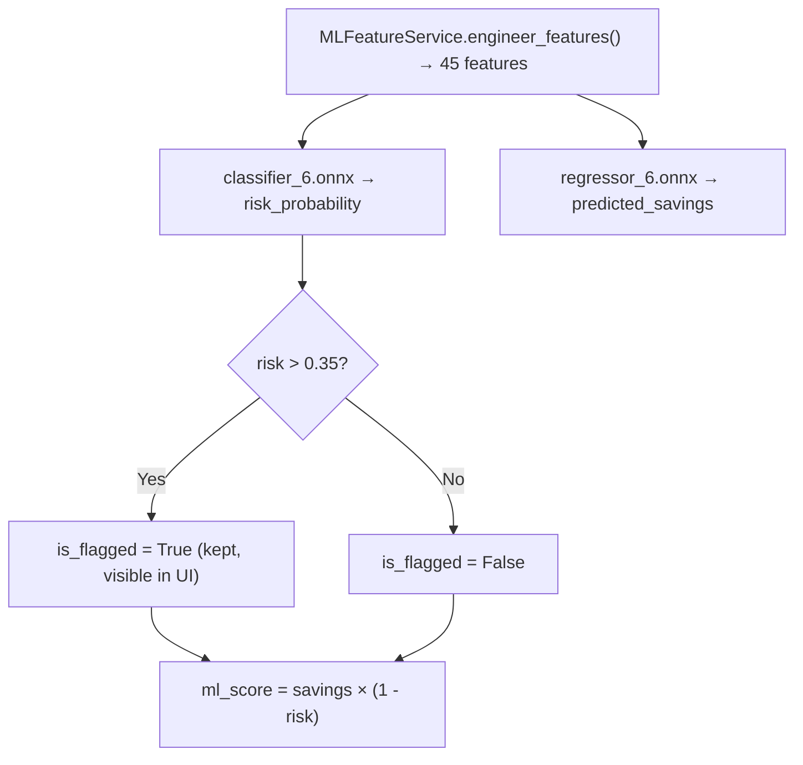

**Feature categories** (45 total from `ml_feature_service.py`):

| Category | Count | Source |
|---|---|---|
| Temporal | 10 | Hour, day, sin/cos transforms |
| Lag/History | 3 | 1h, 4h, 24h savings |
| Rolling Windows | 8 | 4h/24h mean, std, min, max |
| Price Dynamics | 5 | Spread, ratio, momentum |
| Family Patterns | 6 | Family-hour baselines |
| Family Stress | 3 | Cross-instance contagion |
| Events | 3 | Holiday/stress flags |
| Categorical | 7 | Family, size, AZ encoded |

**ML Circuit Breaker**: If ONNX inference fails 3+ times in 10 minutes → falls back to heuristic.
- Redis keys: `atharvaai:ml_fail_count` (10 min TTL), `atharvaai:ml_degraded` (10 min TTL)

## 2.6 Step 7b — Risk Cutoff
- Hard cutoff: `risk_probability <= 0.50` in global pipeline

## 2.7 Step 9 — DryRun Capacity Check
- Only **top 10** pools DryRun-validated (API cost control)
- Budget: `spot:dryrun_count:{region}` (hourly)
- Per-pool failure: `spot:dryrun_failures_24h:{pool_id}` (24h rolling)

---

# SECTION 3: RISK ENGINE — Composite Risk Score

**Source**: `backend/core/risk_engine.py` (343 lines)

## 3.1 Constants (verified from code L27-182)

```python
_K_LAPLACE             = 4.0       # Bayesian smoothing constant
_T_POOL_MINUTES        = 60.0      # Pool pressure half-life (minutes)
_ALPHA_ADVISOR         = 0.3       # Spot Advisor blending weight
_W_ADJUSTED_ML         = 0.35      # AdjustedML weight in BaseRisk
_W_VOLATILITY          = 0.10      # Volatility weight in BaseRisk
_W_POOL_PRESSURE       = 0.25      # Pool pressure weight in FinalRisk
_W_AZ_DELTA            = 0.15      # AZ delta weight in FinalRisk
_W_CLUSTER_INSTABILITY = 0.15      # Cluster instability weight in FinalRisk
_TAU_CONSERVATIVE_SECONDS = 7200.0 # Decay τ for conservative mode (120 minutes)
```

## 3.2 Risk Computation Pipeline

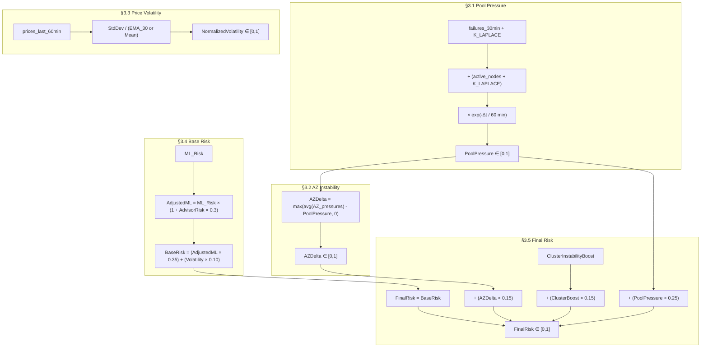

## 3.3 Cluster Instability State Machine (Redis-Backed)

**Redis Key**: `spot:cluster_state:{cluster_id}` (NO TTL — permanent)

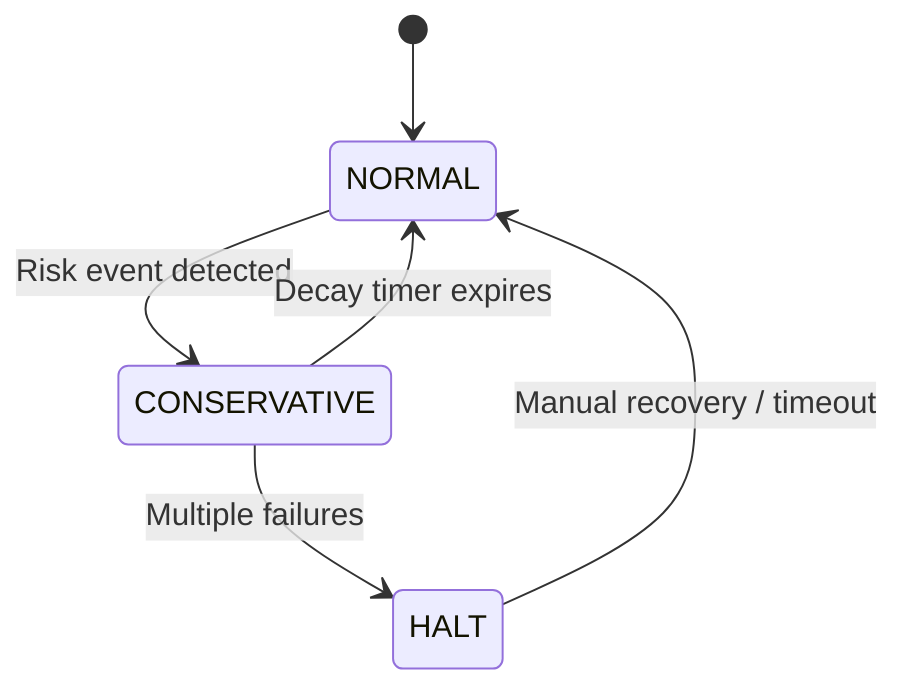

**Boost values** (from code L185-244):
- `NORMAL`: boost = `0.0`
- `CONSERVATIVE`: boost = `1.3 × exp(-elapsed_seconds / 7200)` → decays from 1.3 → 0 over ~2h
- `HALT`: boost = `1.0` (constant maximum)

---

# SECTION 4: EV MODEL — Economic Expected Value

**Source**: `backend/core/ev_model.py` (184 lines)

## 4.1 Dynamic Capacity Failure Probability (from code L18-39)
```
Probability = DryRun_Failures_24h / DryRun_Attempts
Fallback: 0.05 if no data
Cap: min(probability, 0.50) — never assume total failure
```

## 4.2 EV Formula Chain (from code L46-129)
```
1. EffectiveExposureHours = min(RiskHorizonHours, RecoveryTimeHours)
2. ExpectedInterruptionCost = FinalRisk × DowntimeCostPerHour × EffectiveExposureHours
3. CapacityFailureRisk = CapacityFailureProbability × RetryCost
4. MigrationPenalty = DrainTimeCost + WarmupCost + ControlPlaneCost
5. VolatilityCost = NormalizedVolatility × VolatilityCostMultiplier
6. EV = Savings - InterruptionCost - MigrationPenalty - CapacityFailureRisk - VolatilityCost
```

**Decision rule**: `EV > 0` → candidate eligible

## 4.3 Default Parameter Values (from code L141-150)

| Parameter | Default | Unit |
|---|---|---|
| `risk_horizon_hours` | 2.0 | hours |
| `recovery_time_hours` | 0.5 | hours |
| `downtime_cost_per_hour` | 100.0 | USD |
| `retry_cost` | 10.0 | USD |
| `capacity_failure_probability` | 0.05 | ratio |
| `drain_time_cost` | 2.0 | USD |
| `warmup_cost` | 1.0 | USD |
| `control_plane_cost` | 0.5 | USD |
| `volatility_cost_multiplier` | 5.0 | multiplier |

---

# SECTION 5: DECISION ENGINE v3 — 15-Step Policy Pipeline

**Source**: `backend/core/decision_engine.py` (781 lines)

## 5.1 Optimization Profiles (from code L56-84)

| Profile | Risk Ceiling | Delta Threshold | Max Family Ratio | Max AZ Ratio | Staleness Penalty | Volatility Adj |
|---|---|---|---|---|---|---|
| `COST_FIRST` | 0.25 | 0.03 (3%) | 0.40 | 0.50 | 0.95 | -0.05 |
| `BALANCED` (default) | 0.20 | 0.05 (5%) | 0.40 | 0.50 | 0.95 | -0.05 |
| `NO_DOWNTIME_FIRST` | 0.10 | 0.08 (8%) | 0.30 | 0.40 | 0.95 | -0.05 |

**Constants** (from code L92-93):
```python
CURRENT_MODEL_VERSION = "6"
ITN_BYPASS_ENABLED = True
```

## 5.2 15-Step Pipeline Flow

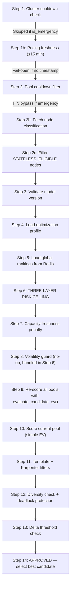

### Step 6 — Three-Layer Risk Ceiling (from code L344-393)
```
Layer 1: Profile ceiling (from optimization mode, e.g., BALANCED = 0.20)
Layer 2: Volatility adjustment (volatile market: ceiling += -0.05)
         Example: BALANCED volatile → 0.20 + (-0.05) = 0.15
Layer 3: Trust-phase override (use min of current ceiling and trust phase ceiling)
         Phase 0: risk_ceiling_override = 0.15
         Phase 1: risk_ceiling_override = 0.20
         Phase 2: risk_ceiling_override = None (use profile default)

Effective ceiling = min(Layer1 + Layer2, Layer3_override_if_set)
Hard reject: pool.risk_probability > effective_ceiling
```

### Step 9 — Full EV Re-scoring (from code L423-463)
Uses `evaluate_candidate_ev()` from `ev_model.py` with dynamic capacity failure probability from Redis.

### Step 10 — Current Pool Scoring (from code L465-481)
Uses **simple** `compute_expected_value()`: `savings × (1 - risk)` — intentionally different from Step 9.

### Step 12 — Diversity Deadlock Protection (from code L528-541)
If no candidates pass diversity: `current_pool_ev >= 0.5` → hold current pool.

### Step 13 — Delta Threshold (from code L554-594)
```
delta = best_candidate_ev - current_pool_ev
if delta < profile.delta_threshold → REJECT
```

### Rejection Counters (from code L744-780)
**Redis Key**: `spot:rejection_counters:{cluster_id}` (24h TTL, hash)

---

# SECTION 6: SAFETY CHECKPOINTS

## 6.1 Guardrail Engine — Hard Guards

**Source**: `backend/services/guardrail_engine.py` (351 lines)

### Hard Guards (from code L21-27, all must pass)

| Guard | Default | Description |
|---|---|---|
| Spot Ratio | ≤ 0.80 | Max 80% spot nodes |
| AZ Concentration | ≤ 0.60 | No AZ > 60% of spot nodes |
| Family Concentration | ≤ 0.50 | No instance family > 50% |
| Daily Spend Cap | ≤ $10,000 | Daily spend limit |
| Concurrent Nodes Down | ≤ 3 | Max simultaneous drains |
| Stateful Node | `False` | Block auto-scaling on stateful |
| Maintenance Window | `False` | Block ops during maintenance |

### Spend Velocity Guard (from code L99-138)
```
SpendVelocity = HourlyCostNow - HourlyCost1hAgo
If velocity > 50 USD/hr → Block upward resizes
Downward resizes always allowed
```

### Org-Level Spend Velocity Guard (from code L142-183)
```
Redis key: spot:org_spend_velocity:{org_id}
Threshold: 200 USD/hr (default)
If org-wide velocity > threshold → Block ALL upward resizes in org
```

### Stabilization Guard (from code L190-203)
```
After execution wait 2–5 min. Default stabilization_minutes = 3.0
```

### Cluster Health Score (from code L239-276)
```
HealthScore = 0.25×(PendingPods) + 0.25×(ReadyNodes) + 0.25×(Latency) + 0.25×(CPUHeadroom)
Threshold: ≥ 0.75 required to proceed
```

## 6.2 Circuit Breaker State Machine

**Source**: `backend/services/circuit_breaker.py` (239 lines)

### Constants (from code L31-35)
```python
ROLLBACK_WINDOW_SECONDS      = 3600    # 1 hour window
NORMAL_TO_CONSERVATIVE_COUNT = 2       # ≥2 rollbacks → CONSERVATIVE
CONSERVATIVE_TO_HALT_COUNT   = 3       # ≥3 rollbacks while CONSERVATIVE → HALT
HALT_STABLE_SECONDS          = 1800    # 30 min no failures → CONSERVATIVE
CONSERVATIVE_DECAY_SECONDS   = 7200    # 2h stable → NORMAL
```

### State Transitions (from code L199-227)

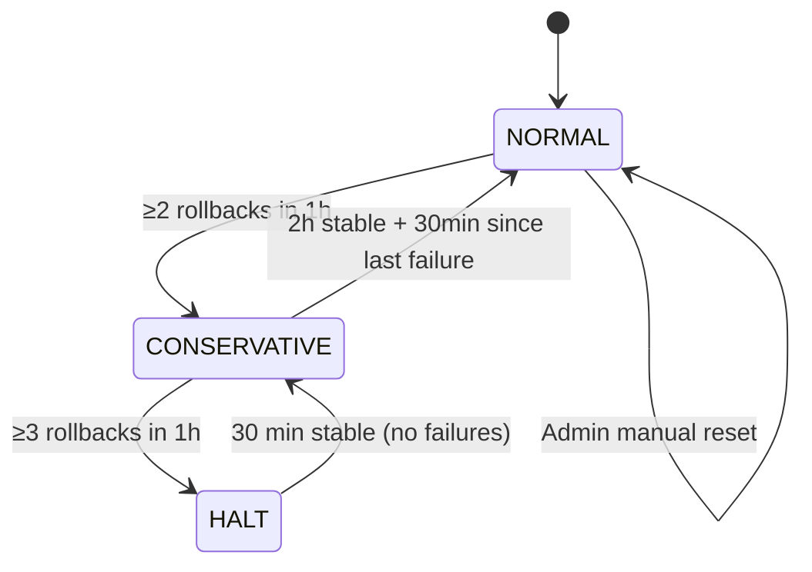

### Risk Multiplier (from code L229-238)

| State | Risk Multiplier | Formula |
|---|---|---|
| `NORMAL` | 1.0 | Constant |
| `CONSERVATIVE` | 1.3 → 0.0 (decaying) | `1.3 × exp(-minutes / 120)` |
| `HALT` | 2.0 | Constant — ALL automation blocked |

### Redis Keys (from code L25-28)

| Key | TTL | Purpose |
|---|---|---|
| `cb:state:{cluster_id}` | 24h | Current state |
| `cb:rollbacks:{cluster_id}` | 1h | Rollback counter |
| `cb:last_failure:{cluster_id}` | 1h | Last failure timestamp |
| `cb:state_entered:{cluster_id}` | 24h | State entry timestamp |

## 6.3 Cooldown Controller

**Source**: `backend/services/cooldown_controller.py` (340 lines)

### Cooldown Types (from code L32-38, L295)

| Type | Redis Key | Default TTL | Purpose |
|---|---|---|---|
| Cluster switch | `spot:cooldown:cluster:{id}` | 60 min | Prevent cluster-level flapping |
| Pool reuse | `spot:cooldown:pool:{pool_id}` | 120 min | Prevent reusing failed pool |
| Pool switch | `spot:cooldown:action:pool_switch:{id}` | 30 min | Prevent rapid pool changes |
| Resize | `spot:cooldown:action:resize:{id}` | 360 min (6h) | Prevent size oscillation |
| Substitute | `spot:cooldown:action:substitute:{id}` | 120 min | Prevent substitute churn |
| **Stabilization lock** | `spot:stabilization_lock:{id}` | 300s (5 min) | Post-execution stabilization |

**Emergency Override** (from code L139-153): `override_for_emergency()` deletes the cluster cooldown key.

---

# SECTION 7: EXECUTION ENGINE

## 7.1 Execution Controller — 6-Step Safe Node Replacement

**Source**: `backend/core/action_executor.py` (18916 bytes) + `backend/services/execution_controller.py` (231 lines)

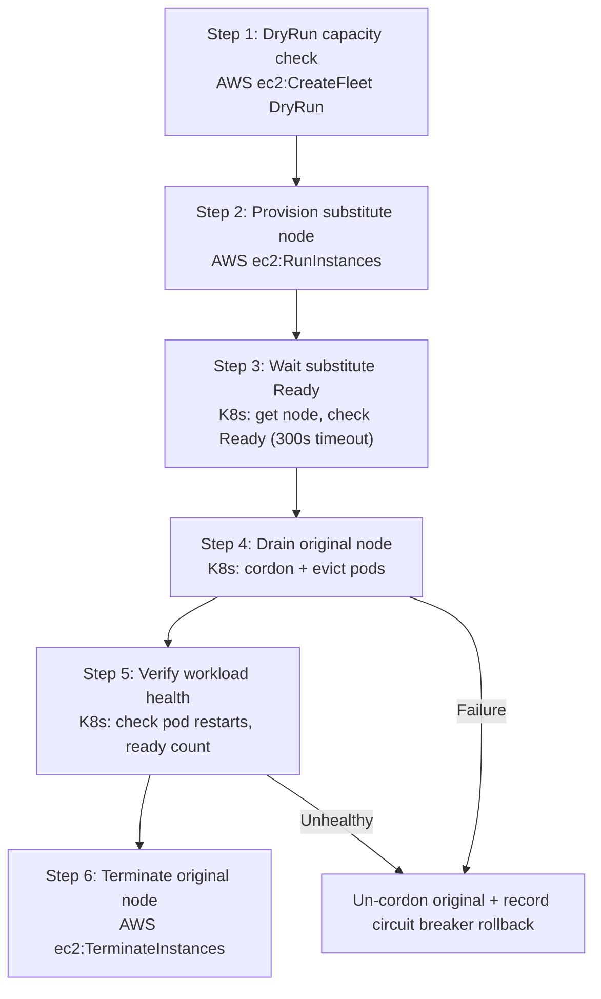

**On failure**: Increments rollback counter in circuit breaker.
**On success**: Records success in circuit breaker.
**Substitute wait timeout**: 300 seconds.

## 7.2 Auto-Rebalancer

**Source**: `backend/workers/tasks/auto_rebalancer.py` (522 lines)

| Type | Timeout | Trigger |
|---|---|---|
| Emergency | 90 seconds | Termination notice |
| Graceful | 10 minutes | Scheduled/proactive optimization |

**Steps**: Cordon nodes → Drain pods → Karpenter provisions replacements on safe pools.

## 7.3 Substitute Manager — Zero-Downtime Lifecycle

**Source**: `backend/services/substitute_manager.py` (969 lines)

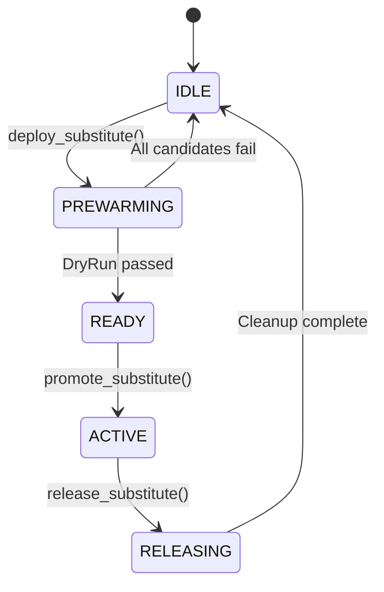

**Redis keys**: `spot:substitute:state:{cluster_id}`, `spot:substitute:meta:{cluster_id}`

### Warm Spare System (`maintain_warm_spare_worker.py`, 141 lines)
- Runs every **5 minutes** via Celery Beat
- Ensures **≥1 warm substitute** per auto-rebalance-enabled cluster
- Sized for the **LARGEST node** in the cluster
- Uses the **CHEAPEST** available spot pool

## 7.4 Spot Interruption Handling Flow

**Source**: `backend/services/event_monitor.py` (690 lines) + `backend/workers/tasks/termination_monitor.py` (316 lines)

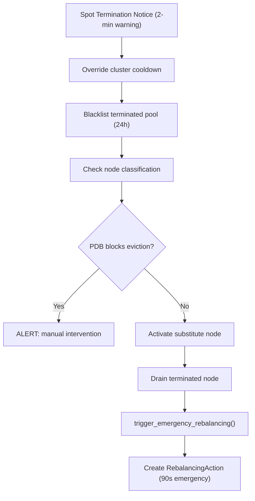

**Bypasses**: delta threshold, savings check, cluster cooldown, pool cooldown.

**Detection Sources**:
1. EventBridge: AWS termination notices (2-minute warning)
2. DaemonSet agent: Node-level termination detection via IMDS polling
3. Manual API: User flags via UI

---

# SECTION 8: HIBERNATION ENGINE

**Source**: `backend/services/hibernation_service.py` (445 lines) + `backend/workers/tasks/hibernation_worker.py` (390 lines)

## 8.1 Strategies & Implementations

| Strategy | File | Description | Savings | Wake Time |
|---|---|---|---|---|
| `NAMESPACE_SLEEP` | `namespace_sleep.py` (370L) | Scale workloads to 0 replicas | 80% | 2 min |
| `NUCLEAR` | `nuclear.py` (79L) | Scale ASGs to 0, terminate workers | 70% | 5 min |
| `SNAPSHOT_RESTORE` | `snapshot_restore.py` (91L) | EBS snapshot + full shutdown | 95% | 15 min |

### Namespace Sleep Constants
```python
SYSTEM_NAMESPACES = ["kube-system", "kube-public", "kube-node-lease", "spot-optimizer"]
WAKE_ORDER = ["StatefulSet", "Deployment", "CronJob", "Job"]
MAX_CONCURRENT_OPERATIONS = 10
OPERATION_DELAY_SECONDS = 0.5
POD_TERMINATION_TIMEOUT = 300
RESPECT_PDB = True
```

## 8.2 Schedule Matrix Format

| Type | Length | Encoding |
|---|---|---|
| WEEKLY | 168 chars | 7 days × 24 hours |
| DAILY | 31 chars | 1 month of days |
| MONTHLY | 744 chars | 31 days × 24 hours |

`'0'` = AWAKE, `'1'` = SLEEPING

## 8.3 Savings Estimation
```
sleep_hours = matrix.count('1')
hourly_cost = cluster.monthly_cost / 730
weekly_savings = sleep_hours × hourly_cost × strategy_percentage
annual_savings = weekly_savings × 52
```

## 8.4 Distributed Locking
```
Lock key: hibernation:lock:{schedule_id}:{cluster_id}
Lock TTL: 180 seconds
Acquisition: SET NX EX (atomic)
Release: Only if still owned (compare lock_value)
```

## 8.5 Hibernation Cluster Suspend Flow

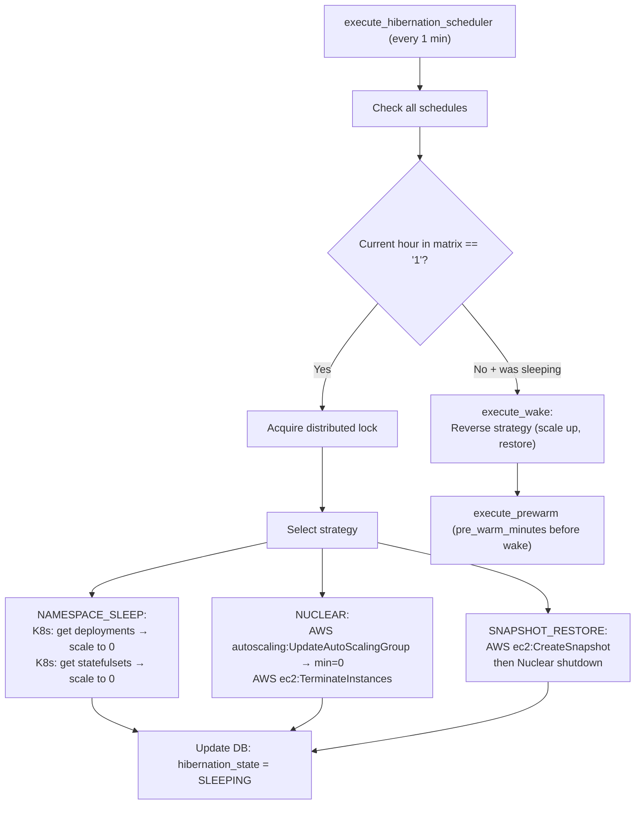

---

# SECTION 9: RIGHT-SIZING ENGINE

**Source**: `backend/services/rightsizing_service.py` (~960 lines)

## 9.1 Constants
```python
SAFETY_BUFFER_PCT = 20         # 20% overhead on P95 usage
OVERSIZED_THRESHOLD_PCT = 50   # Request ≥ 50% above usage → "oversized"
UNDERSIZED_THRESHOLD_PCT = 95  # Usage ≥ 95% of request → "undersized"
```

## 9.2 Right-Sizing Recommendation Flow

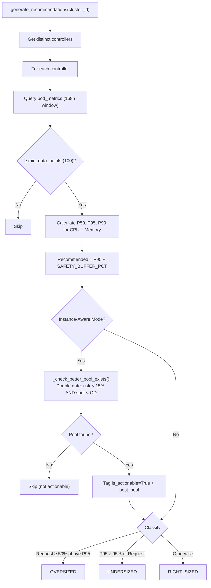

### Confidence Levels

| Level | Criteria |
|---|---|
| HIGH | `data_points >= min × 3` AND `window >= 72h` |
| MEDIUM | `data_points >= min` |
| LOW | Insufficient data |

## 9.3.1 Instance-Aware Rightsizing Mode

When `ClusterOptimizationSettings.instance_aware_rightsizing = True`:

1. After generating each recommendation, `_check_better_pool_exists()` is called
2. **Double gate**: pool must pass BOTH:
   - Risk < 15% ceiling
   - Spot price < on-demand price for equivalent instance
3. Additional filters: not blacklisted, capacity available, size within 1x-2x of target
4. Recommendations without a passing pool are skipped
5. Passing recommendations get `is_actionable=True` + `best_pool` metadata

**Fail-open behavior**: On any error in the pool check, recommendations default to `is_actionable=True`.

## 9.4 Cost Estimation
```
monthly_cost = (cpu_millicores / 1000) × cpu_hourly_rate × 730
             + (memory_mb / 1024) × mem_hourly_rate × 730
```

**Instance family cost modifiers**:

| Family | CPU $/core-hr | Mem $/GB-hr |
|---|---|---|
| t3/t3a | 0.0325 | 0.0041 |
| m5/m6i/m6a | 0.0425 | 0.0053 |
| c5/c6i/c6a | 0.0365 | 0.0046 |
| r5/r6i | 0.0540 | 0.0068 |
| Graviton | General × 0.8 | Memory × 0.8 |

## 9.5 Optimizer Coordinator — Phase Machine

**Source**: `backend/services/optimizer_coordinator.py` (645 lines)

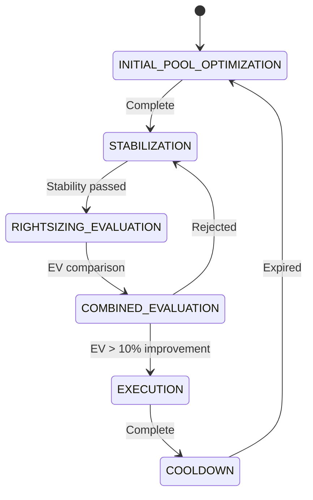

### Progressive Trust Phases (from code L211-253)

| Phase | Cluster Age | Rightsizing | Safety Buffer | Min Samples | Risk Ceiling Override |
|---|---|---|---|---|---|
| **Phase 0** | 0–30 min | No | 30% | 500 | 0.15 |
| **Phase 1** | 30 min – 2h | Yes (conservative) | 25% | 500 | 0.20 |
| **Phase 2** | > 2h | Yes (full) | 20% | 100 | None (profile default) |

### Combined EV Evaluation (from code L329-513)
Compares three options:
- **Option A**: Current size + new pool (pool only)
- **Option B**: New size + best pool for new size (combined)
- **Option C**: Current size + current pool (do nothing)

---

# SECTION 10: CONTROL PLANE LOOP

**Source**: `backend/workers/tasks/control_plane_loop.py` (390 lines)

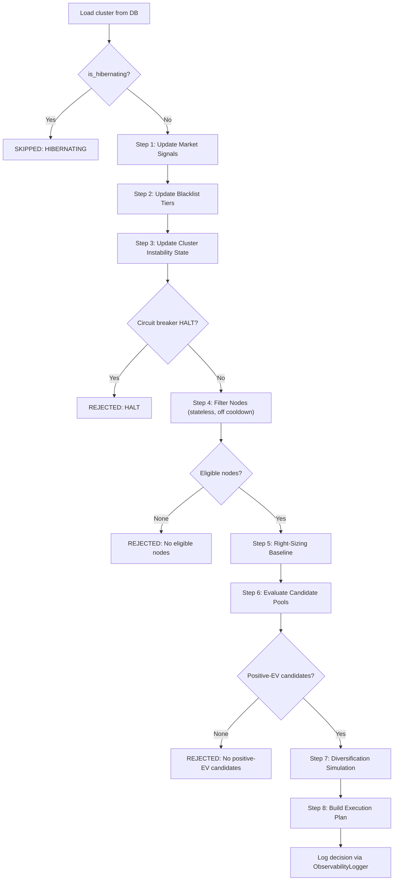

**Runs every 5 minutes** via `run_all_clusters_decision_cycle` Celery task.
Per-cluster cycle: max 2 retries, 60s countdown.

---

# SECTION 11: CLUSTER MONITORING

## 11.1 Resize Guard — Post-Resize Health Monitoring

**Source**: `backend/workers/tasks/resize_guard_worker.py` (168 lines)

Monitors cluster health for **2 hours** after any resize action. Runs every **5 minutes**.

### Rollback Triggers

| Trigger | Threshold | Action |
|---|---|---|
| CPU Stress | `cpu_avg_10m > 85%` sustained | Mark proposal FAILED |
| Pod Restart Spike | `restart_rate > baseline × 2` | Mark proposal FAILED |
| Memory Pressure | `> 5 memory pressure events` | Mark proposal FAILED |

### Pod Restart Baseline
- Updated **hourly** by `update_pod_restart_baseline` task
- Baseline = average restarts over last 24h (excluding 2h guard window)
- Redis key: `metrics:pod_restart_baseline:{cluster_id}` (1h TTL)

## 11.2 Volatility Regime Detection

**Source**: `backend/services/event_monitor.py` (690 lines)

```
1. Compute rolling 24h StdDev of spot prices
2. Compare against 30-day distribution
3. If current_stddev > P75 of historical → VOLATILE
4. Set Redis flag: spot:volatility_regime:{region} (2h TTL)
```

## 11.3 WorkloadInspector Classification Logic

**Source**: `backend/services/workload_inspector.py` (333 lines)

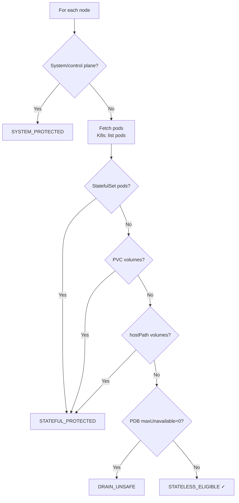

Cache: `spot:node_classification:{cluster_id}` (10-min TTL)

---

# SECTION 12: AWS INTEGRATION LAYER

## 12.1 AWS API Calls

| AWS Service | API | Purpose | Required Permission |
|---|---|---|---|
| EC2 | `CreateFleet` (DryRun) | Capacity validation | `ec2:CreateFleet` |
| EC2 | `RunInstances` | Provision spot/OD nodes | `ec2:RunInstances` |
| EC2 | `TerminateInstances` | Remove old nodes | `ec2:TerminateInstances` |
| EC2 | `DescribeInstances` | Node inventory | `ec2:DescribeInstances` |
| EC2 | `DescribeSpotPriceHistory` | Spot price collection | `ec2:DescribeSpotPriceHistory` |
| EC2 | `DescribeInstanceTypes` | Instance catalog | `ec2:DescribeInstanceTypes` |
| EC2 | `CreateSnapshot` | Hibernation snapshot | `ec2:CreateSnapshot` |
| EKS | `DescribeCluster` | Cluster validation | `eks:DescribeCluster` |
| AutoScaling | `UpdateAutoScalingGroup` | Hibernation nuclear | `autoscaling:UpdateAutoScalingGroup` |
| STS | `AssumeRole` | Cross-account access | `sts:AssumeRole` |
| IAM | `PassRole` | Instance profile | `iam:PassRole` |
| CloudWatch | `GetMetricData` | Monitoring metrics | `cloudwatch:GetMetricData` |
| Pricing | `GetProducts` | On-demand pricing | `pricing:GetProducts` |
| S3 | `GetObject` | Spot Advisor data | `s3:GetObject` |

## 12.2 Pricing Collection

**Spot Prices** (every 5 min): `ec2.describe_spot_price_history()`
**On-Demand Prices** (daily 1AM): AWS Price List API
**Regions monitored** (11): us-east-1, us-east-2, us-west-1, us-west-2, eu-west-1, eu-west-2, eu-central-1, ap-south-1, ap-southeast-1, ap-southeast-2, ap-northeast-1
**Savings**: `savings_pct = ((ondemand - spot) / ondemand) × 100`

---

# SECTION 13: KUBERNETES INTEGRATION LAYER

## 13.1 Kubernetes API Calls

| Resource | Operation | Purpose | RBAC |
|---|---|---|---|
| Nodes | `GET`, `LIST` | Node inventory | `get`, `list` nodes |
| Nodes | `PATCH` (cordon/uncordon) | Drain prep | `patch` nodes |
| Pods | `GET`, `LIST` | Pod inspection | `get`, `list` pods |
| Pods | `Eviction` (CREATE) | Drain execution | `create` pods/eviction |
| Deployments | `GET`, `PATCH` | Hibernation scale | `get`, `patch` deployments |
| StatefulSets | `GET`, `PATCH` | Hibernation scale | `get`, `patch` statefulsets |
| PDB | `GET` | Disruption check | `get` poddisruptionbudgets |
| Metrics | `GET` | Pod CPU/Memory | `get` pods (metrics.k8s.io) |

---

# SECTION 14: FAILURE HANDLING

## 14.1 Blacklist Service

**Source**: `backend/services/blacklist_service.py` (423 lines)

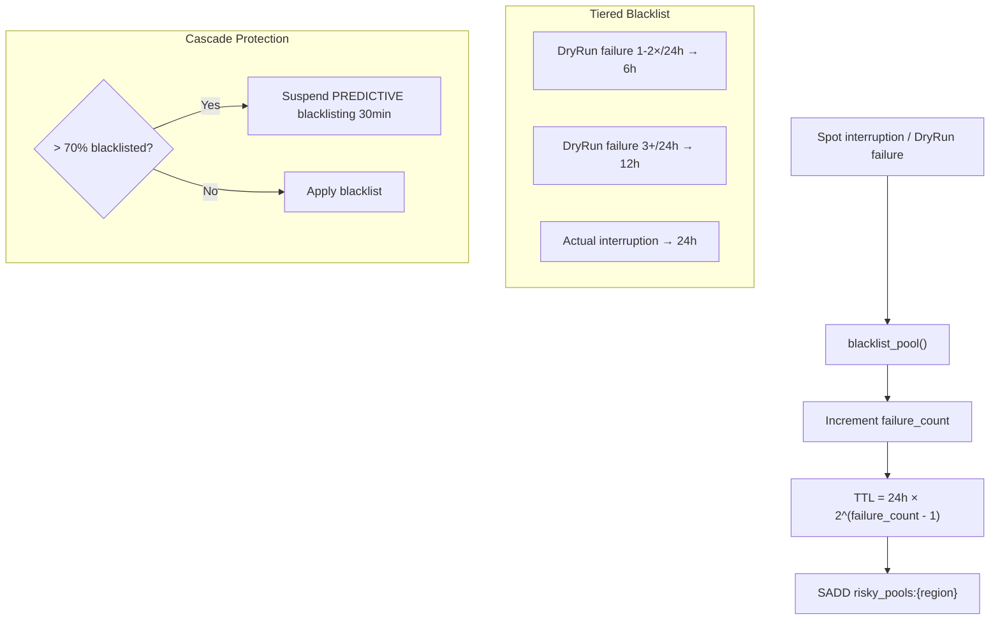

**Cascade dampener**: `spot:blacklist_suspended:{region}` (30 min TTL). Only PREDICTIVE suspended; deterministic always honored.

## 14.2 Cross-Cluster Instability Propagator

**Source**: `backend/services/instability_propagator.py` (~230 lines)

```
SYSTEMIC_CLUSTER_THRESHOLD = 3   # ≥3 clusters impacted → systemic event
```

When one cluster experiences interruption → update pool pressure for ALL clusters sharing that pool/AZ. If ≥3 clusters affected → escalate to SYSTEMIC.

### Observability Metrics (Redis counters)

| Redis Key | Type | Description |
|---|---|---|
| `propagator:metrics:events_total` | Counter (INCR) | Total interruption events recorded |
| `propagator:metrics:systemic_total` | Counter (INCR) | Total systemic (multi-cluster) events |
| `propagator:metrics:pools_affected` | Set (SADD) | Unique pools with active pressure |
| `propagator:metrics:clusters_affected` | Set (SADD) | Unique clusters impacted |

All metrics are updated atomically via Redis pipeline on each `record_interruption_event()` call. Retrievable via `get_metrics()` method.

## 14.3 Global Risk Tracker ("Hive Mind")

**Source**: `backend/modules/risk_tracker.py` (227 lines)

- When one client experiences interruption → ALL clients warned
- **Redis key**: `RISK:{az}:{instance_type}` → "DANGER"
- **TTL**: 30 minutes
- **Pub/Sub**: Publishes to `risk:flagged` channel

## 14.4 Pool Rotation Service

**Source**: `backend/services/pool_rotation_service.py` (572 lines)

**Triggers**: Viable pool count < threshold, primary AZ < 30% viable, cascade > 70% blacklisted.
**Actions**: Promote backup AZs, clear pool ranking cache, refresh top 20 from healthy AZs.

---

# SECTION 15: AGENT LOGIC (Client-Side DaemonSet)

## 15.1 Registration & Authentication
- Uses `CLUSTER_ID` + `API_KEY` → `/api/v1/agents/register`
- Generates unique `AGENT_ID` (hostname + UUID)
- **HMAC**: `SECRET_KEY` verifies all action commands

## 15.2 Metrics Collection (`MetricsCollector`)
- Schedule: 60s batched collection
- Priority: `psutil` (if `HOST_PROC` mounted) → fallback `metrics.k8s.io`
- Nodes < 5 min old marked `CALIBRATING`
- Payload: pod + node + event metrics → `/api/v1/agent-metrics/batch`

## 15.3 Right-Sizing Pod Metrics (`PodMetricsCollector`)
- Filters **only local node** pods
- Extracts controller info, CPU (millicores), memory (bytes), QoS class
- Submission: every 5 min → `/api/v1/pod-metrics/batch`

## 15.4 Safety and Execution (`ActionActuator`)
- Polls `/api/v1/actions/poll`
- **HMAC validated** before any action
- **PDB Guardrail**: `disruptions_allowed < 1` → blocks eviction (HTTP 429)
- Reports results → `/api/v1/actions/{action_id}/result`

## 15.5 Spot Interruption Detection (`SpotPoller`)
- Polls AWS IMDS every **5 seconds**: `http://169.254.169.254/latest/meta-data/spot/instance-action`
- On termination: Cordon → Drain (force) → Webhook `/api/v1/clusters/{id}/fallback`

## 15.6 Real-Time Communication
- **WebSocket**: Bidirectional `wss://` for real-time actions, exponential backoff reconnect
- **Heartbeat**: HTTP `/api/v1/agents/heartbeat` with process health
- **Probes**: `/healthz` and `/readyz` for K8s lifecycle

---

# APPENDIX A: Complete Redis Key Reference

| Key Pattern | Service | TTL | Purpose |
|---|---|---|---|
| `spot:cooldown:cluster:{id}` | CooldownController | 60 min | Cluster switch cooldown |
| `spot:cooldown:pool:{pool_id}` | CooldownController | 120 min | Pool failure cooldown |
| `spot:cooldown:action:resize:{id}` | CooldownController | 360 min | Resize cooldown |
| `spot:cooldown:action:pool_switch:{id}` | CooldownController | 30 min | Pool switch cooldown |
| `spot:cooldown:action:substitute:{id}` | CooldownController | 120 min | Substitute cooldown |
| `spot:stabilization_lock:{id}` | CooldownController | 5 min | Post-execution stabilization |
| `spot:node_classification:{id}` | WorkloadInspector | 10 min | Node status map |
| `spot:cluster_mode:{id}` | DecisionEngine | 300s | Optimization mode |
| `spot:global_rankings:{region}` | Intelligence Layer | Variable | Pre-computed rankings |
| `spot:volatility_regime:{region}` | EventMonitor | 2h | Volatile market flag |
| `global_pool_rankings:{region}` | PoolRankingService | 65 min | Tier 1 global cache |
| `spot:ondemand_fallback:{id}` | KarpenterService | 12h | On-demand fallback |
| `spot:execution_failures:{id}` | KarpenterService | 10 min | Karpenter circuit breaker |
| `spot:dryrun_count:{region}` | PoolRankingService | 1h | DryRun budget |
| `spot:dryrun_failures_24h:{pool}` | PoolRankingService | 24h | Per-pool DryRun failures |
| `spot:cluster_state:{cluster_id}` | risk_engine.py | NONE | Permanent cluster state machine |
| `spot:rejection_counters:{id}` | DecisionEngine | 24h | Rejection counter hash |
| `spot:org_spend_velocity:{org_id}` | GuardrailEngine | 1h | Org spend velocity |
| `spot:substitute:state:{id}` | SubstituteManager | Variable | Substitute lifecycle |
| `spot:substitute:meta:{id}` | SubstituteManager | Variable | Substitute metadata |
| `hibernation:lock:{sched}:{cluster}` | HibernationWorker | 180s | Distributed lock |
| `atharvaai:ml_fail_count` | PoolRankingService | 10 min | ML circuit breaker |
| `atharvaai:ml_degraded` | PoolRankingService | 10 min | ML degraded flag |
| `risky_pools:{region}` | BlacklistService | Variable | Blacklisted pool set |
| `blacklist_failures:{type}:{az}` | BlacklistService | Variable | Failure count per pool |
| `spot:blacklist_suspended:{region}` | BlacklistService | 30 min | Cascade dampener |
| `capacity:{type}:{az}` | PoolRankingService | 15 min | Capacity DryRun cache |
| `cb:state:{cluster_id}` | CircuitBreaker | 24h | CB state |
| `cb:rollbacks:{cluster_id}` | CircuitBreaker | 1h | Rollback counter |
| `cb:last_failure:{cluster_id}` | CircuitBreaker | 1h | Last failure time |
| `cb:state_entered:{cluster_id}` | CircuitBreaker | 24h | State entry time |
| `propagator:pool_pressure:{r}:{az}:{type}` | Propagator | 2h | Pool pressure |
| `propagator:az_pressure:{r}:{az}` | Propagator | 2h | AZ average pressure |
| `propagator:events:{r}:{az}:{type}` | Propagator | 30 min | Failure counter |
| `RISK:{az}:{type}` | GlobalRiskTracker | 30 min | Hive Mind risk flag |
| `resize:guard:{id}:invocations` | ResizeGuard | 2h | Guard invocation counter |
| `resize:failure_count_24h:{id}` | OptimizerCoordinator | 24h | Resize circuit breaker |
| `pricing:last_updated:{region}` | Market Ingestion | Variable | Pricing timestamp |
| `metrics:pod_restart_baseline:{id}` | ResizeGuard | 1h | Pod restart baseline |
| `obs:decisions:{cluster_id}` | ObservabilityLogger | 24h | Decision audit (last 100) |

---

*Total: **15 sections** · **12 core engines** · **14 Celery workers** · **40+ Redis keys** · **14 AWS APIs** · **8 K8s operations** · **10 flow diagrams***
