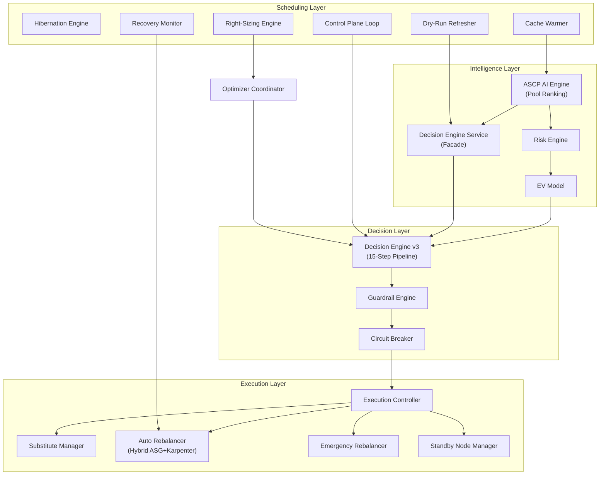

# Spot Optimizer Platform — Complete Backend Logic Reference

> **Source of truth**: Extracted exclusively from `.py`, `.jsx`, `.js` files in this repository.
> **Files analyzed**: 150+ backend Python services, 13 Celery workers, 60+ models, 6 core modules, 1 guardrail engine, 3 hibernation strategies.
> **Zero `.md` or `.txt` files referenced.**
> **Last updated**: 2026-03-17 — Full refresh: hybrid ASG/Karpenter architecture, standby node system, emergency rebalancer, decision engine service, daily stats aggregator, dry-run refresher, cache warmer, recovery monitor, pool-level diversification, RC3 lifecycle guard, absolute-timestamp cooldowns, OverviewTab real-data sources, ClusterDetails API fix.

---

# SECTION 1: SYSTEM OVERVIEW

## 1.1 Architecture Overview

The platform consists of 12 core engines coordinated through a central control plane:



## 1.2 Engine Registry

| Engine | Primary File | Approx Lines | Purpose |
|---|---|---|---|
| **ASCP AI (System A)** | `backend/services/pool_ranking_service.py` | 1862 | 2-tier ML scoring pipeline with ONNX models |
| **Risk Engine** | `backend/core/risk_engine.py` | 343 | Bayesian risk composition (5 components) |
| **EV Model** | `backend/core/ev_model.py` | 184 | Economic expected value with 6-term formula |
| **Decision Engine v3** | `backend/services/decision_engine_service.py` | ~150 | Unified pool-selection facade (rank, blacklist, report) |
| **Guardrail Engine** | `backend/services/guardrail_engine.py` | 380 | 7-tier safety checks before execution |
| **Circuit Breaker** | `backend/services/circuit_breaker.py` | 220 | 3-state: NORMAL → CONSERVATIVE → HALT |
| **Instability Propagator** | `backend/services/instability_propagator.py` | ~150 | Cross-cluster signal propagation |
| **Execution Controller** | `backend/services/execution_controller.py` | ~280 | 6-step action pipeline |
| **Auto Rebalancer** | `backend/workers/tasks/auto_rebalancer.py` | 4645 | OD → SPOT migration, ASG+Karpenter hybrid |
| **Emergency Rebalancer** | `backend/workers/tasks/emergency_rebalancer.py` | ~80 | Spot interruption response with standby-first |
| **Standby Node Manager** | `backend/workers/tasks/standby.py` | ~60 | Pre-warmed cordoned node lifecycle |
| **Recovery Monitor** | `backend/workers/tasks/recovery_monitor.py` | ~200 | Sync AWS states, detect orphans every 5 min |
| **Cache Warmer** | `backend/workers/tasks/cache_warmer.py` | ~80 | Pre-compute rankings for top 10 profiles hourly |
| **Dry-Run Refresher** | `backend/workers/tasks/dry_run_refresher.py` | ~50 | Refresh capacity status every 5 min |
| **Hibernate Engine** | `backend/hibernation_strategy/` | ~600 | 3 strategies: TimeBased, UtilBased, Smart |
| **Right-Sizing Engine** | `backend/services/rightsizing_service.py` | ~400 | Bin-pack to smaller instance, pod request rightsizing |
| **Diversity Enforcer** | `backend/services/diversity_enforcer.py` | 280 | Pool-level diversification (1 node per pool) |
| **Control Plane Loop** | `backend/workers/tasks/control_plane_loop.py` | ~300 | 8-step Celery task, runs every 5 min |

## 1.3 Celery Worker Schedule

| Task | Beat Schedule | File | Purpose |
|---|---|---|---|
| `execute_rebalancing` | Every 15 s | `auto_rebalancer.py` | Main rebalancing cycle |
| `run_discovery` | Every 60 s | `discovery.py` | Sync K8s node state to DB |
| `termination_monitor` | Every 30 s | `termination_monitor.py` | Detect at-risk spot nodes |
| `control_plane_loop` | Every 5 min | `control_plane_loop.py` | 8-step control plane evaluation |
| `cache_warmer` | Hourly | `cache_warmer.py` | Pre-compute pool rankings |
| `dry_run_refresher` | Every 5 min | `dry_run_refresher.py` | Refresh capacity status |
| `recovery_monitor` | Every 5 min | `recovery_monitor.py` | Sync AWS states, scan orphans |
| `daily_stats_aggregator` | Daily 02:00 UTC | `daily_stats_aggregator.py` | Aggregate daily cost metrics |
| `rightsizing_evaluation_worker` | Every 24 h | `optimizer_coordinator_worker.py` | Bin-pack evaluation |

---

# SECTION 2: ML RANKING ENGINE (System A)

## 2.1 Two-Tier Pipeline

**File**: `backend/services/pool_ranking_service.py`

```
Tier 1 — Global (Redis-cached, 65 min TTL)
  → Runs full ONNX ML pipeline on ALL catalog instances
  → Caches top 100 pools per region
  → Shared across ALL clusters in the same region

Tier 2 — Per-request (in-memory, sub-ms)
  → Applies per-cluster filters: vCPU, memory, family allowlist, AZ, architecture
  → Removes blacklisted pools
  → Returns top N matching pools for this cluster
```

### `rank_pools()` — line 233
Orchestrates both tiers. Calls `_get_or_compute_global_rankings()` then `_apply_client_filters()`.

### `_run_global_pipeline()` — line 360
Runs all pipeline steps on the full instance catalog:

| Step | Purpose |
|---|---|
| Step 1 | Build candidate pools (instance × AZ matrix) |
| Step 2 | Fetch Spot Advisor interruption rates (3-tier fallback: AWS API → Redis cache → hardcoded) |
| Step 3 | Tiered Spot Advisor filter — Pass 0: <5%, Pass 1: ≤10%, Pass 2: ≤15% |
| Step 4 | Fetch current spot prices |
| Step 5 | Build feature vectors for ONNX models |
| Step 6 | Run `classifier_6.onnx` → `risk_probability` (0–1) |
| Step 7 | Run `regressor_6.onnx` → `predicted_savings` (0–1) |
| Step 8 | Compute composite ML score + sort |
| Step 9 | Dry-run capacity validation per top pool |

### `_step9_post_score_capacity_check()` — line ~600
Calls `dry_run_pool()` for each top-ranked pool. Marks capacity as `available` / `uncertain` / `insufficient`.

### ONNX Models — lines 104–117
```python
# backend/services/pool_ranking_service.py
classifier = ort.InferenceSession("ml_model/classifier_6.onnx")
regressor  = ort.InferenceSession("ml_model/regressor_6.onnx")
RISK_THRESHOLD = json.load(open("ml_model/risk_threshold.json"))["threshold"]  # default 0.35
GLOBAL_CACHE_LIMIT = 100     # top pools cached per region
GLOBAL_CACHE_TTL   = 3900    # 65 minutes
```

### Instance Catalog Priority — lines 143–231
1. **DB** — `InstanceCatalog` table (populated by nightly worker)
2. **Hardcoded fallback** — 65 instance types with vCPU/memory/arch specs
3. **Safe defaults** — 2 vCPU, $0.05/hr (last resort)

### `ScoredPool` Object — lines 67–85
```python
class ScoredPool:
    pool: InstancePool             # (instance_type, az, region)
    predicted_savings: float       # 0–1, regressor output
    risk_probability: float        # 0–1, classifier output (lower = safer)
    ml_score: float                # composite ranking score
    is_flagged: bool               # on global blacklist
    rank: int                      # 1-based ranking position
    capacity_status: str           # 'available' | 'uncertain' | 'insufficient'
    capacity_validated_at: str     # ISO timestamp of last dry-run check
```

## 2.2 Global Pool Rankings Redis Cache

```
Key:   global_pool_rankings:{region}          e.g. global_pool_rankings:ap-south-1
Value: JSON { "data": [ScoredPool...], "ts": ISO }
TTL:   65 minutes
```

Used by:
- `atharvaai_routes.py` — `/pools/rankings` endpoint
- `auto_rebalancer.py` — Pool selection for S2S and OD→SPOT
- `cluster_service.py` — Node condition enrichment (`current_risk_score`, `best_available_pool`)

---

# SECTION 3: DECISION ENGINE SERVICE

**File**: `backend/services/decision_engine_service.py`

Unified facade for all pool-selection decisions. Wraps `PoolRankingService` with blacklisting and failure tracking.

### Constants — lines 28–32
```python
FAILURE_THRESHOLD     = 3      # auto-blacklist after N failures in 24h
BLACKLIST_TTL_HOURS   = 24     # default blacklist duration
DRY_RUN_CACHE_TTL     = 300    # 5 minutes
RANKING_CACHE_TTL     = 3600   # 1 hour
```

### `rank_for_node(node, cluster)` — line 64
Returns top `ScoredPool` list for a specific running node. Applies node template + blacklist filters.

### `rank_for_template(template_spec)` — line 136
Returns top pools matching a size specification (vCPU range, memory range, architecture).

### `report_termination(pool_key)` — line ~180
```python
# Sets global blacklist in Redis for 24h:
redis.set(f"blacklist:pool:{pool_key}", "terminated", ex=86400)
# Also lowers rank in global rankings cache for this pool
```

### `report_launch_failure(pool_key, cluster_id)` — line ~220
```python
# Increments failure counter; auto-blacklists when >= FAILURE_THRESHOLD
redis.incr(f"failures:{pool_key}:{cluster_id}")
if count >= FAILURE_THRESHOLD:
    redis.set(f"blacklist:pool:{pool_key}", "failures", ex=86400)
```

### Decision Routes — `backend/api/decision_routes.py`
```
POST /api/v1/decision/rank-for-node         → rank_for_node()
POST /api/v1/decision/rank-for-template     → rank_for_template()
POST /api/v1/decision/report-termination    → report_termination()
POST /api/v1/decision/report-launch-failure → report_launch_failure()
GET  /api/v1/decision/blacklist             → current blacklist entries
```

---

# SECTION 4: AUTO-REBALANCER ENGINE

**File**: `backend/workers/tasks/auto_rebalancer.py` (4645 lines)

## 4.1 Entry Point

`execute_rebalancing()` — line 1756. Called by Celery beat every 15 seconds per cluster.

## 4.2 AWS State Sync

`_sync_instance_state_from_aws()` — line 31

```python
# Loads platform credentials from SystemConfig (not default chain):
aws_creds = db.query(SystemConfig).filter_by(key="PLATFORM_AWS_ACCESS_KEY").first()
sts_client = boto3.client("sts",
    aws_access_key_id=aws_creds.value,
    aws_secret_access_key=secret.value)

# RC3 Guard — prevents SPOT→OD lifecycle downgrade from transient label absence:
if db_inst.lifecycle == InstanceLifecycle.SPOT and real_lifecycle == InstanceLifecycle.ON_DEMAND:
    streak = redis.incr(f"rc3:sync_od_streak:{aws_iid}")
    redis.expire(f"rc3:sync_od_streak:{aws_iid}", 300)
    if streak >= 3:                      # 3 consecutive OD reports (~45s at 15s polling)
        db_inst.lifecycle = real_lifecycle
        redis.delete(f"rc3:sync_od_streak:{aws_iid}")
    # else: keep SPOT — transient label absence
```

## 4.3 Spot Instance Launch

`_launch_spot_instance_direct()` — line 324

Uses `ec2.create_fleet()` with `SpotOptions`. Handles capacity fallback across AZs. Returns `(instance_id, az, instance_type)`.

```python
fleet_config = {
    "SpotOptions": {"AllocationStrategy": "price-capacity-optimized"},
    "LaunchTemplateConfigs": [...],
    "TargetCapacitySpecification": {
        "TotalTargetCapacity": 1,
        "DefaultTargetCapacityType": "spot"
    }
}
```

## 4.4 Safety Gates (in `execute_rebalancing_action()` — line 642)

Three gates must all pass before any drain/terminate:

```
Gate 1 — Stabilization Lock (line 697)
  Redis key: lock:stabilize:{cluster_id}
  Set by: any cross-system operation (Karpenter install, rightsizing, etc.)
  TTL: 5–10 minutes

Gate 2 — Substitute Mutual Exclusion (line 710)
  Blocks if warm-spare is in PREWARMING or RELEASING state
  Prevents two concurrent topology changes

Gate 3 — Resize Cooldown (line 725)
  Redis key: lock:rightsizing_cooldown:{cluster_id}
  Set after each right-sizing operation
```

## 4.5 Rebalancing Phases (per action)

```
Phase 1: Spot Provisioning
  Karpenter cluster → PATCH_KARPENTER_NODEPOOL (AgentAction)
  Non-Karpenter     → _launch_spot_instance_direct() directly

Phase 2: Wait for spot node to join K8s
  Polls instance state; timeout = spot_join_timeout_minutes (default 30)

Phase 3: Cordon
  CORDON_NODE AgentAction sent to agent DaemonSet

Phase 4: Drain
  DRAIN_NODE AgentAction, grace_period_seconds=60

Phase 5: EC2 Terminate + ASG Decrement
  ASG growth guard (line 1637):
    if asg_desired <= asg_min:
        update_auto_scaling_group(MinSize=0)  # allow decrement
    terminate_instance_in_auto_scaling_group(ShouldDecrementDesiredCapacity=True)
```

## 4.6 Pool-Level Diversification (S2S block)

S2S = Spot-to-Spot rebalancing when diversification trigger fires.

**Definition**: Pool = `(instance_type, az)`. Max 1 node per identical pool.

```python
# Count duplicate pools in running instances:
_sp_pool_dupes = sum(
    1 for i in _running_insts_s2s
    if i.instance_type == _sp_inst.instance_type and i.az == _sp_inst.az
)
if _sp_pool_dupes > 1:
    _s2s_trigger_reason = f'diversify_pools: duplicate pool {_sp_inst.instance_type}:{_sp_inst.az}'
```

**Note**: `c5.large:ap-south-1a` and `c5.large:ap-south-1b` are different pools — both allowed.

## 4.7 Risk-Threshold S2S Trigger

```python
# Load strategy thresholds once per cluster cycle:
_opt_strat = db.query(OptimizationStrategy).filter_by(cluster_id=cluster.id).first()
_risk_ceil_s2s = (getattr(_opt_strat, 'risk_ceiling_percent', 25) or 25) / 100.0
_tradeoff_pct_s2s = (getattr(_opt_strat, 'risk_savings_tradeoff_pct', 20) or 20) / 100.0

# For each spot node: check if its pool risk exceeds ceiling
if _sp_cur_pool and _sp_cur_pool.get('risk_probability', 0) > _risk_ceil_s2s:
    _s2s_trigger_reason = f'risk_threshold: {_sp_risk:.2f} > {_risk_ceil_s2s:.2f}'
```

## 4.8 S2S Target Pool Selection (Tradeoff Logic)

```python
# Pass 1: better risk AND equal/better savings
_s2s_target = next((
    p for p in _ranked_s2s
    if p.risk_probability < _sp_risk
    and p.predicted_savings >= _sp_cur_savings
    and f"{p.pool.instance_type}:{p.pool.az}" not in _occupied_pools
), None)

# Pass 2: tradeoff — accept up to N% worse savings for better risk
if not _s2s_target:
    _min_savings = _sp_cur_savings * (1 - _tradeoff_pct_s2s)
    _s2s_target = next((
        p for p in _ranked_s2s
        if p.risk_probability < _sp_risk
        and p.predicted_savings >= _min_savings
        and f"{p.pool.instance_type}:{p.pool.az}" not in _occupied_pools
    ), None)

# No qualifying pool → silent retry next cycle (no action created)
```

## 4.9 Stale Action Expiry — line 1775

```python
# Actions stuck > 45 minutes are marked FAILED:
cutoff = datetime.utcnow() - timedelta(minutes=45)
stale = db.query(AgentAction).filter(
    AgentAction.status.in_(['PENDING', 'PICKED_UP']),
    AgentAction.created_at < cutoff
).all()
for a in stale:
    a.status = 'FAILED'
    a.error_message = 'Expired: stuck > 45 min'
```

## 4.10 Daily Rebalancing Limits

```python
# Default max_rebalances_per_24h = 5 (StatelessRuntimeRules)
# Count completed actions in rolling 24h window:
count = db.query(RebalancingAction).filter(
    RebalancingAction.cluster_id == cluster_id,
    RebalancingAction.status == 'completed',
    RebalancingAction.completed_at >= datetime.utcnow() - timedelta(hours=24)
).count()
if count >= max_per_day:
    defer(reason='daily_limit_reached')
```

---

# SECTION 5: EMERGENCY REBALANCER

**File**: `backend/workers/tasks/emergency_rebalancer.py` (entry: `emergency_rebalancer()` line 26)

Handles spot interruptions with **standby-first** strategy.

```python
def emergency_rebalancer(cluster_id, interrupted_instance_id):
    # 1. Clear cooldowns (emergency overrides normal cooldown)
    redis.delete(f"spot:cooldown:{cluster_id}")

    # 2. Blacklist interrupted pool for 24h
    decision_engine.report_termination(f"{instance_type}:{az}")

    # 3. Create RebalancingAction with trigger='emergency'
    action = RebalancingAction(trigger='emergency', status='in_progress', ...)

    # 4a. If standby node exists and is READY → use it immediately
    if standby and standby.state == 'READY':
        send_agent_action(UNCORDON_NODE, standby.instance_id)
        send_agent_action(CORDON_NODE, interrupted_instance_id)
        send_agent_action(DRAIN_NODE, interrupted_instance_id)
        launch_standby_node.delay(cluster_id)  # replenish standby
    else:
        # 4b. No standby → launch new spot, then drain interrupted
        _launch_spot_instance_direct(cluster_id, ...)
        send_agent_action(CORDON_NODE, interrupted_instance_id)
        send_agent_action(DRAIN_NODE, interrupted_instance_id)
```

---

# SECTION 6: STANDBY NODE MANAGER

**File**: `backend/workers/tasks/standby.py` (entry: `launch_standby_node()` line 18)

Maintains one **pre-warmed, cordoned** spot node per cluster.

```python
# Lifecycle:
# 1. Provision via _launch_spot_instance_direct()
# 2. Wait for K8s join (up to spot_join_timeout_minutes)
# 3. CORDON_NODE (workloads never scheduled here)
# 4. Mark standby=True in DB (WarmSpareStatus table)
# 5. Periodic health check — if interrupted, auto-replenish
```

Standby state exposed via:
- `atharvaai_routes.py` `/v3/substitute/{cluster_id}` — IDLE / PREWARMING / READY / RELEASING
- Frontend: `RebalancingTimeline` standby status card

---

# SECTION 7: RECOVERY MONITOR

**File**: `backend/workers/tasks/recovery_monitor.py`

### `sync_instance_states()` — line 27 (every 5 min)
```python
# For each running instance in DB:
#   Call ec2.describe_instances() using platform credentials
#   Apply RC3 guard before SPOT→OD downgrade (same as auto_rebalancer)
#   Mark terminated/stopped instances as 'terminated' in DB
```

### `scan_orphans()` — line ~150 (every 5 min)
```python
# Orphan = spot instance launched by platform but not in K8s node list
# Criteria: instance running in AWS, no matching Node object in K8s, age > 10 min
# Action: terminate orphan via ec2.terminate_instances()
```

---

# SECTION 8: CACHE WARMER

**File**: `backend/workers/tasks/cache_warmer.py` (entry: `cache_warmer()` line 16, hourly)

```python
# 1. Aggregate top 10 instance type profiles from running nodes across all clusters
# 2. For each profile (vCPU, memory, arch): call PoolRankingService.rank_pools()
# 3. Cache result in Redis:
#    Key: pool_rankings:{region}:{profile_hash}
#    TTL: 1 hour (RANKING_CACHE_TTL = 3600)
# 4. Warms Tier 2 cache so first real request hits cache, not ML pipeline
```

---

# SECTION 9: DRY-RUN REFRESHER

**File**: `backend/workers/tasks/dry_run_refresher.py` (entry: `dry_run_refresher()` line 14, every 5 min)

```python
# 1. Fetch global_pool_rankings:{region} from Redis (top 100 pools)
# 2. For each pool call dry_run_pool():
#    Uses describe_instance_type_offerings() — NOT RunInstances DryRun
#    (faster, no billing, checks AZ + instance type availability)
# 3. Update capacity_status: 'available' | 'uncertain' | 'insufficient'
# 4. Write back to global rankings cache
```

### `dry_run_pool()` — `backend/utils/aws/dry_run.py` line 22
```python
DRY_RUN_CACHE_TTL = 120    # 2 minutes (shorter than ranking TTL)

def dry_run_pool(instance_type, az, region, aws_creds):
    cache_key = f"dryrun:{region}:{instance_type}:{az}"
    cached = redis.get(cache_key)
    if cached: return json.loads(cached)

    offerings = ec2.describe_instance_type_offerings(
        Filters=[
            {"Name": "instance-type", "Values": [instance_type]},
            {"Name": "location",      "Values": [az]},
        ]
    )
    status = "available" if offerings["InstanceTypeOfferings"] else "insufficient"
    redis.set(cache_key, json.dumps({"status": status}), ex=DRY_RUN_CACHE_TTL)
    return status
```

---

# SECTION 10: DIVERSITY ENFORCER

**File**: `backend/services/diversity_enforcer.py` (core class: `DiversityEnforcer` line 15)

## Pool-Level Diversification Rule

**Pool = `(instance_type, az)`**. Max 1 node per identical pool.

| Pool Key | Allowed |
|---|---|
| `c5.large:ap-south-1a` + `c5.large:ap-south-1b` | ✅ Different AZ = different pools |
| `c5.large:ap-south-1a` + `c5.large:ap-south-1a` | ❌ Same pool = duplicate |
| `c5.large:ap-south-1a` + `m5.large:ap-south-1a` | ✅ Different type = different pools |

### `check_candidate(pool_key, cluster_id)` — line 28
```python
occupied = redis.smembers(f"cluster_pools:{cluster_id}")
if pool_key in occupied:
    return False, "pool_occupied"

az = pool_key.split(":")[1]
az_count = sum(1 for p in occupied if p.endswith(f":{az}"))
total = len(occupied) + 1
if az_count / total > max_az_ratio:            # default 0.50
    return False, "az_concentration"

return True, None
```

## Diversity Thresholds — lines 18–22

| Mode | `max_az_ratio` |
|---|---|
| `COST_FIRST` | 0.50 |
| `BALANCED` | 0.50 |
| `NO_DOWNTIME_FIRST` | 0.40 |

### `filter_by_cluster_pools(ranked_pools, cluster_id)` — line 203
Removes any pool already occupied. Used by `auto_rebalancer.py` before selecting replacement target.

### `update_cluster_pools(cluster_id, add=None, remove=None)` — line 248
Maintains `cluster_pools:{cluster_id}` Redis set. Called after launch (add) and terminate (remove).

---

# SECTION 11: LIFECYCLE DETECTION (RC3 GUARD)

The RC3 guard prevents a false **SPOT → ON_DEMAND** lifecycle downgrade when K8s node labels haven't propagated yet after agent reinstall.

**Pattern used in 2 places**:

### `_sync_instance_state_from_aws()` — `auto_rebalancer.py` line 129
```python
if db_inst.lifecycle == InstanceLifecycle.SPOT and real_lifecycle == InstanceLifecycle.ON_DEMAND:
    streak = int(redis.incr(f"rc3:sync_od_streak:{aws_iid}") or 0)
    redis.expire(f"rc3:sync_od_streak:{aws_iid}", 300)
    if streak >= 3:                     # 3 × 15s = 45s of consistent OD reports
        db_inst.lifecycle = real_lifecycle
        redis.delete(f"rc3:sync_od_streak:{aws_iid}")
    # else: keep SPOT — transient label absence
else:
    db_inst.lifecycle = real_lifecycle  # all other transitions: update immediately
```

### `backend/routers/metrics.py` — line ~148 (mirrors above for K8s metrics push)
```python
if lifecycle == InstanceLifecycle.SPOT:
    inst.lifecycle = InstanceLifecycle.SPOT
    redis.delete(f"rc3:metrics_od_streak:{inst.instance_id}")
elif inst.lifecycle == InstanceLifecycle.SPOT:
    streak = int(redis.incr(f"rc3:metrics_od_streak:{inst.instance_id}") or 0)
    redis.expire(f"rc3:metrics_od_streak:{inst.instance_id}", 1800)
    if streak >= 3:
        inst.lifecycle = lifecycle
        redis.delete(f"rc3:metrics_od_streak:{inst.instance_id}")
    # else: keep SPOT
else:
    inst.lifecycle = lifecycle
```

---

# SECTION 12: DATA MODELS

## 12.1 Core Cluster Models — `backend/models/cluster.py`

### `Cluster` table
| Field | Type | Purpose |
|---|---|---|
| `id` | UUID | Primary key |
| `karpenter_mode` | Enum | `DRY_RUN` or `AUTO` (null = not installed) |
| `optimization_mode` | String | `COST_FIRST` / `BALANCED` / `NO_DOWNTIME_FIRST` |
| `model_version` | String | Pinned ML model version (default "6") |
| `workload_type` | String | `STATELESS` — stored but live classification preferred |
| `auto_rebalance_enabled` | Boolean | Master toggle (legacy, superseded by Settings) |
| `is_hibernating` | Boolean | Currently hibernated |
| `hibernation_state` | JSON | Saved replica counts for wake |

### `ClusterOptimizationSettings` — lines 129–150
| Field | Default | Purpose |
|---|---|---|
| `auto_rebalance_enabled` | false | Enable OD→SPOT migration |
| `auto_rightsizing_enabled` | false | Enable pod resource rightsizing |
| `auto_stateful_rightsizing_enabled` | false | Allow rightsizing on stateful workloads |
| `cooldown_override_minutes` | 60 | Minimum wait between rebalancing cycles |
| `failure_cooldown_minutes` | 30 | Pause after failed replacement |
| `conservative_mode_enabled` | true | Limit aggressiveness first 24h |
| `manual_approval_required` | false | Gate all changes on human approval |
| `maintain_standby` | false | Keep pre-warmed standby node |
| `diversify_pools` | false | Enable pool-level diversification |
| `optimization_target` | "spot" | `"spot"` or `"on_demand"` |
| `check_interval_seconds` | 15 | How often rebalancer evaluates |

### `OptimizationStrategy` — lines 157–175
| Field | Default | Purpose |
|---|---|---|
| `strategy_type` | "BALANCED" | Overall strategy |
| `risk_ceiling_percent` | 25 | Max pool risk score (0–100) |
| `min_savings_percent` | 15 | Minimum savings to accept a pool |
| `risk_savings_tradeoff_pct` | 20 | % savings to sacrifice for safer pool |
| `volatility_tolerance_percent` | 20 | Allowed price volatility |
| `diversity_strictness_level` | "Medium" | Diversity enforcement level |

## 12.2 Instance Model — `backend/models/instance.py`
| Field | Purpose |
|---|---|
| `lifecycle` | `InstanceLifecycle` enum: `SPOT` or `ON_DEMAND` |
| `instance_type` | e.g. `t3.medium` |
| `az` | Availability zone e.g. `ap-south-1a` |
| `state` | `running` / `terminated` / `stopped` |
| `classification` | `STATELESS` / `STATEFUL` / `MIXED` / `EMPTY` |

**RC1 fix**: Node count queries filter `Instance.state == 'running'` to exclude terminated instances from display counts.

## 12.3 Daily Cluster Stats — `backend/models/daily_cluster_stats.py`
```python
class DailyClusterStats(Base):
    __tablename__ = "daily_cluster_stats"
    id               = Column(UUID)
    cluster_id       = Column(UUID, ForeignKey("clusters.id"))
    date_stamp       = Column(Date)                  # unique per cluster per day
    total_cost       = Column(Numeric)
    total_savings    = Column(Numeric)
    spot_nodes       = Column(Integer)
    on_demand_nodes  = Column(Integer)
    spot_ratio       = Column(Numeric)               # 0–1
    avg_cpu_pct      = Column(Numeric)
    avg_memory_pct   = Column(Numeric)
    # Unique index: idx_daily_stats_cluster_date (cluster_id, date_stamp)
```

---

# SECTION 13: API ROUTES

## 13.1 AtharvaAI Routes — `backend/api/atharvaai_routes.py`

Prefix: `/api/v1/atharvaai`

| Endpoint | Method | Line | Purpose |
|---|---|---|---|
| `/clusters/{cluster_id}/effective-configuration` | GET | 108 | Unified config (Policy > Template > Strategy) |
| `/pools/rankings` | POST | 148 | 8-step ML pool ranking pipeline |
| `/blacklist` | GET | 331 | Global flagged/blacklisted pools |
| `/rebalancing/status` | GET | 447 | Rebalancing actions with 6-step timeline |
| `/rebalancing-actions/{id}/approve` | POST | 513 | Manual approval |
| `/rebalancing-actions/{id}/deny` | POST | 539 | Reject pending action |
| `/interruption-heatmap` | GET | 576 | Spot interruption frequency by pool |
| `/savings-velocity` | GET | 677 | Daily/weekly/monthly savings trend |
| `/v3/global-intelligence/status` | GET | 810 | ML model health + feature quality |
| `/v3/diversity/{cluster_id}` | GET | 866 | Family/AZ distribution gauges |
| `/v3/state-machine/{cluster_id}` | GET | 890 | Rebalancing FSM status |
| `/v3/cluster/{cluster_id}/optimization-mode` | PUT | 948 | Set COST_FIRST / BALANCED / NO_DOWNTIME |
| `/v3/cluster/{cluster_id}/model-version` | PUT | 1014 | Pin ML model version |
| `/v3/cooldown/{cluster_id}` | GET | 1114 | Cooldown status + remaining_seconds |
| `/v3/workload-status/{cluster_id}` | GET | 1140 | STATELESS / STATEFUL / MIXED / EMPTY |
| `/v3/substitute/{cluster_id}` | GET | 1181 | Standby node status |
| `/clusters/{cluster_id}/node-recommendations` | GET | 1302 | Per-node optimization recommendations |
| `/clusters/{cluster_id}/impact` | GET | 1700 | Projected savings from recommendations |
| `/v3/rebalancing-context/{cluster_id}` | GET | 1818 | Unified: cooldown + next-target + daily-limit |

### `/v3/rebalancing-context/{cluster_id}` Response — line 1818
```python
{
    "cooldown": {
        "active": bool,
        "remaining_seconds": int,
        "expires_at": "2026-03-17T12:52:10Z",    # absolute ISO timestamp
        "reason": str
    },
    "next_check_at": "2026-03-17T12:52:25Z",      # now + 15s (absolute)
    "timestamp": "2026-03-17T12:52:10Z",
    "next_target": { "instance_type": str, "az": str, "risk": float } | null,
    "daily_actions": { "used": int, "limit": int, "resets_at": str }
}
```

`expires_at` and `next_check_at` are **absolute UTC timestamps**, not relative seconds, so the frontend countdown survives page refresh.

## 13.2 Cluster Routes — `backend/api/cluster_routes.py`

| Endpoint | Purpose |
|---|---|
| `GET /api/v1/clusters/{id}` | Cluster details |
| `GET /api/v1/clusters/{id}/nodes/detailed` | Live node list with pod data, classification, lifecycle |
| `GET /api/v1/clusters/{id}/utilization` | CPU/memory utilization |
| `GET /api/v1/clusters/{id}/workload-type` | STATELESS/STATEFUL/MIXED/EMPTY |
| `GET /api/v1/clusters/{id}/optimization-settings` | Full settings (automation_controls + optimization_strategy) |
| `PUT /api/v1/clusters/{id}/optimization-settings` | Save settings |

### `/nodes/detailed` Response per node
```json
{
  "instance_id": "i-0ca36277e8f91df72",
  "node_name": "ip-192-168-5-50.ap-south-1.compute.internal",
  "instance_type": "t3.medium",
  "lifecycle": "on-demand",
  "availability_zone": "ap-south-1b",
  "status": "running",
  "classification": "STATELESS",
  "cpu_utilization_pct": 1.5,
  "memory_utilization_pct": 21.15,
  "cpu_capacity_cores": 2,
  "memory_capacity_gb": 4,
  "pod_count": 6,
  "stateful_pod_count": 0,
  "pods": [ { "pod_name": str, "is_stateful": bool, "cpu_usage_millicores": int, ... } ],
  "current_risk_score": float | null,
  "best_available_pool": "c5.large:ap-south-1b" | null,
  "rebalance_condition": "STABLE" | "AWAITING_SPOT" | "REBALANCE:RISK_HIGH" | "REBALANCE:BETTER_POOL"
}
```

## 13.3 Karpenter Routes — `backend/api/karpenter_routes.py`

| Endpoint | Purpose |
|---|---|
| `GET /api/v1/karpenter/config?cluster_id={id}` | Full Karpenter + optimization config |
| `PATCH /api/v1/karpenter/config/{cluster_id}` | Update config; syncs `automation_controls` + `optimization_strategy` to DB |
| `POST /api/v1/karpenter/clusters/{id}/install` | Install Karpenter via agent |
| `DELETE /api/v1/karpenter/clusters/{id}/install` | Uninstall |
| `GET /api/v1/karpenter/clusters/{id}/install-status` | Returns `{ karpenter_installed: bool, last_action: {...} }` |
| `GET /api/v1/karpenter/native-spot/status/{id}` | Non-Karpenter ASG spot status |

---

# SECTION 14: NODE CONDITION ENRICHMENT

**File**: `backend/services/cluster_service.py` — `get_cluster_nodes_detailed()` line ~1520

After computing node classification, reads pool rankings from Redis to attach per-node condition:

```python
_raw = redis.get(f"global_pool_rankings:{cluster.region or 'ap-south-1'}")
if _raw:
    _rankings = json.loads(_raw).get("data", [])
    _this_key = f"{instance_type}:{availability_zone}"
    _cur = next((p for p in _rankings if f"{p['instance_type']}:{p['az']}" == _this_key), None)
    if _cur:
        _risk_score = round(_cur.get('risk_probability', 0), 3)
        # Best pool = lower risk + equal/better savings
        _better = [p for p in _rankings
                   if p.get('risk_probability', 1) < _risk_score
                   and p.get('predicted_savings', 0) >= _cur.get('predicted_savings', 0)
                   and f"{p['instance_type']}:{p['az']}" != _this_key]
        _best_pool = f"{_better[0]['instance_type']}:{_better[0]['az']}" if _better else None

    _ceil = (OptimizationStrategy.risk_ceiling_percent or 25) / 100.0
    _rebalance_condition = (
        "AWAITING_SPOT"        if lifecycle == "on-demand"                    else
        "REBALANCE:RISK_HIGH"  if _risk_score is not None and _risk_score > _ceil else
        "REBALANCE:BETTER_POOL" if _best_pool                                 else
        "STABLE"
    )
```

---

# SECTION 15: FRONTEND COMPONENTS

## 15.1 ClusterDetails — `frontend/src/components/clusters/ClusterDetails.jsx`

### Parallel Data Fetch (`fetchClusterDetails()` — line 144)
On mount/refresh, fetches **12 endpoints in parallel** via `Promise.allSettled`:

```javascript
const [clusterRes, metricsRes, policyRes, scheduleRes, utilRes, workloadRes,
       nodesRes, optRes, recRes, rebalRes, rsizeRes, costTRes] = await Promise.allSettled([
  clusterAPI.getCluster(clusterId),
  metricsAPI.getClusterMetrics(clusterId),
  policyAPI.getPolicy(clusterId),
  hibernationAPI.getByCluster(clusterId),       // was: getSchedule (doesn't exist) — fixed
  clusterAPI.getUtilization(clusterId),
  clusterAPI.getWorkloadType(clusterId),
  clusterAPI.getNodesDetailed(clusterId),
  clusterAPI.getOptimizationSettings(clusterId),
  atharvaaiAPI.getNodeRecommendations(clusterId),
  atharvaaiAPI.getRebalancingStatus(clusterId),
  optimizationAPI.getRightsizing(clusterId),
  metricsAPI.getCostTimeSeries({ cluster_id: clusterId }),
]);
```

**Removed** 4 legacy 404 endpoints: `/classification`, `/substitute/status`, `/cooldown`, `/execution/status`.

### Loading Strategy
```javascript
// Only shows full-page spinner on true initial load (no cluster data yet).
// Refreshes silently update state without blanking the UI.
if (loading && !cluster) return <spinner>;
if (!cluster) setLoading(true);   // fetchClusterDetails only sets loading on first call
```

### 30-Second Background Poll — line 122
```javascript
// Lightweight 3-endpoint poll — does NOT touch loading state:
const [nodesRes, rebalRes, recRes] = await Promise.allSettled([
  clusterAPI.getNodesDetailed(clusterId),
  atharvaaiAPI.getRebalancingStatus(clusterId),
  atharvaaiAPI.getNodeRecommendations(clusterId),
]);
// Old data stays visible until new data arrives silently
```

### Node Condition Badge — lines 28–59
```javascript
const CONDITION_STYLES = {
    REBALANCING:             'bg-indigo-50 text-indigo-700 border-indigo-200',
    AWAITING_SPOT:           'bg-blue-50  text-blue-700  border-blue-200',
    'REBALANCE:RISK_HIGH':   'bg-red-50   text-red-700   border-red-200',
    'REBALANCE:BETTER_POOL': 'bg-amber-50 text-amber-700 border-amber-200',
    STABLE:                  'bg-green-50 text-green-700 border-green-200',
};
// isInFlight: node has an in_progress or waiting_agent rebalancing action
// Shows animated "Rebalancing..." badge instead of condition
```

### Optimization Engine Settings Card (compact)
Controls saved via `handleOptConfigChange(section, key, value)` + explicit "Save All Settings" button calling `clusterAPI.updateOptimizationSettings()`.

Settings displayed (matching DB fields in `ClusterOptimizationSettings`):
- Auto Rebalance toggle
- Sub-items when enabled: Diversify Pools, Maintain Standby, Failure Cooldown (min), Post-Rebalance Cooldown (min)
- Check Cycle Interval (sec, min 15)
- Auto Right-Sizing toggle
- Optimization Target (Spot / On-Demand; locks to Spot in synergy mode)
- Conservative Mode
- Manual Approval Required

## 15.2 OverviewTab — `frontend/src/components/clusters/overview/OverviewTab.jsx`

### Node Composition — lines 163–174
```javascript
// Source of truth: nodesDetailed.nodes[] from /clusters/{id}/nodes/detailed
const nodesList  = nodesDetailed?.nodes || [];
const spotCount  = nodesList.filter(n => n.lifecycle === 'spot'  || n.lifecycle === 'SPOT').length
                   || metrics?.spot_instances || cluster?.spot_count || 0;
const odCount    = nodesList.filter(n => n.lifecycle === 'on-demand' || n.lifecycle === 'ON_DEMAND').length
                   || metrics?.on_demand_instances || cluster?.on_demand_node_count || 0;
const fallbackCount = nodesList.filter(n => n.lifecycle === 'fallback').length;
// Fallback row hidden when fallbackCount === 0
```

### Pods — lines 176–186
```javascript
// Sum pod_count per node (nodesDetailed.total_pods is null at top level)
const totalPods       = nodesList.reduce((s, n) => s + (n.pod_count || 0), 0);
const spotFriendlyPods = nodesList.reduce((s, n) => s + (n.pods || []).filter(p => !p.is_stateful).length, 0);
const statefulPods    = nodesList.reduce((s, n) => s + (n.stateful_pod_count || 0), 0);
```

### Node Classification — lines 188–192
```javascript
// Drives workload recommendations
const statelessNodes = nodesList.filter(n => n.classification === 'STATELESS').length;
const statefulNodes  = nodesList.filter(n => n.classification === 'STATEFUL').length;
const mixedNodes     = nodesList.filter(n => n.classification === 'MIXED').length;
// STATELESS → SPOT safe | STATEFUL → OD recommended | MIXED → review
```

### Cost Calculation — lines 196–208
```javascript
// Prefer real metrics; fall back to nodeRecommendations computation:
const calcMonthly = (nodeRecommendations || [])
    .reduce((s, r) => s + (r.current_cost || 0) * 730, 0);   // 730h/month
const calcSavings = (nodeRecommendations || [])
    .filter(r => r.lifecycle !== 'spot')
    .reduce((s, r) => {
        const sp = r.target_spot_price > 0 ? r.target_spot_price : r.current_cost * 0.35;
        return s + Math.max(0, r.current_cost - sp) * 730;
    }, 0);
const totalCost = metrics?.monthly_cost || cluster?.monthly_cost || calcMonthly || 0;
```

### typeSpecs — line 229
```javascript
// Uses real API field names: cpu_capacity_cores + memory_capacity_gb
const typeSpecs = useMemo(() => {
    const m = {};
    nodesList.forEach(n => {
        if (n.instance_type && !m[n.instance_type])
            m[n.instance_type] = {
                vcpu: n.cpu_capacity_cores || 0,
                mem:  n.memory_capacity_gb  || 0,
            };
    });
    return m;
}, [nodesList]);
```

### ASCP.ai / Karpenter Status — lines 210–225
```javascript
// Agent active = cluster status is 'active' (agent_installed field is null from API)
const isHealthy  = ['active', 'ACTIVE'].includes(cluster?.status || '');
const ascpActive = isHealthy;    // not: agent_installed === 'Y' (wrong field)

// Karpenter status from /karpenter/clusters/{id}/install-status
const karpInstalled = karpenterInstallStatus?.karpenter_installed;
// Description dynamically reflects actual spot count:
// spotCount > 0  → "Active — managing N spot nodes"
// karpInstalled  → "Installed — will provision spot nodes when rebalancer triggers"
// else           → "Not installed — required for spot node provisioning"
```

## 15.3 RebalancingTimeline — `frontend/src/components/atharvaai/RebalancingTimeline.jsx`

### 6-Step Timeline Steps — lines 33–40
```javascript
STEPS = [
  { id: "step_1_spot_provisioning",   label: "New Pool Provisioned" },
  { id: "step_2_cordon",              label: "Node Cordoned" },
  { id: "step_3_draining_pods",       label: "Pods Draining" },
  { id: "step_4_new_node_joined",     label: "New Node Joined" },
  { id: "step_5_old_node_terminated", label: "Old Node Terminated" },
  { id: "step_6_optimization_complete","label": "Complete" },
]
```

### Absolute-Timestamp Cooldown — lines 70–90
```javascript
// State stores ISO strings from backend (survives page refresh):
const [cooldownExpiresAt, setCooldownExpiresAt] = useState(null);
const [nextCheckAt, setNextCheckAt]             = useState(null);

// Countdown computed from Date.now() — NOT a decrementing state variable:
const liveSeconds = cooldownExpiresAt
    ? Math.max(0, Math.floor((new Date(cooldownExpiresAt) - Date.now()) / 1000))
    : 0;
const nextCycleSeconds = nextCheckAt
    ? Math.max(0, Math.floor((new Date(nextCheckAt) - Date.now()) / 1000))
    : 15;

// Per-second tick forces re-renders without storing seconds in state:
useEffect(() => {
    const tick = setInterval(() => setTick(t => t + 1), 1000);
    return () => clearInterval(tick);
}, []);
```

### Data Fetch — lines 84–129
```javascript
// Primary: getRebalancingStatus(clusterId, limit=5)
// Context: getRebalancingContext(clusterId) → sets cooldownExpiresAt, nextCheckAt
// Poll: every 15 seconds
// Filter: show actions in ['in_progress','waiting_agent'] OR completed within last 1 hour
```

---

# SECTION 16: CRITICAL CONSTANTS & THRESHOLDS

| Constant | Value | File | Purpose |
|---|---|---|---|
| `GLOBAL_CACHE_TTL` | 3900 s (65 min) | `pool_ranking_service.py` | Global pool rankings Redis TTL |
| `GLOBAL_CACHE_LIMIT` | 100 | `pool_ranking_service.py` | Top pools cached per region |
| `RISK_THRESHOLD` | 0.35 | `ml_model/risk_threshold.json` | F1-optimized classifier cutoff |
| `DRY_RUN_CACHE_TTL` | 120 s (2 min) | `utils/aws/dry_run.py` | Capacity check cache TTL |
| `FAILURE_THRESHOLD` | 3 | `decision_engine_service.py` | Failures before auto-blacklist |
| `BLACKLIST_TTL_HOURS` | 24 | `decision_engine_service.py` | Termination-triggered blacklist |
| `Stale Action Expiry` | 45 min | `auto_rebalancer.py:1775` | Stuck action → FAILED |
| `DRAIN grace_period` | 60 s | `auto_rebalancer.py` | Pod eviction grace period |
| `RC3 OD streak threshold` | 3 reports | `auto_rebalancer.py:129` | Before SPOT→OD downgrade |
| `Default cooldown` | 60 min | `ClusterOptimizationSettings` | Post-rebalance wait |
| `Default failure cooldown` | 30 min | `ClusterOptimizationSettings` | After failed replacement |
| `Default daily limit` | 5 | `StatelessRuntimeRules` | Max rebalances per 24h |
| `Spot join timeout` | 30 min | `ClusterOptimizationSettings` | Spot node must join K8s |
| `Default risk ceiling` | 25% | `OptimizationStrategy` | Max pool risk to accept |
| `Default tradeoff pct` | 20% | `OptimizationStrategy` | Savings to sacrifice for safer pool |
| `Check interval` | 15 s | `ClusterOptimizationSettings` | Rebalancer evaluation frequency |
| `Cache warmer TTL` | 3600 s | `cache_warmer.py` | Per-profile ranking cache |
| `Recovery monitor freq` | 5 min | `recovery_monitor.py` | State sync + orphan scan |

---

# SECTION 17: DATA FLOW DIAGRAMS

## 17.1 Full Rebalancing Path (OD → SPOT)

```
Auto-rebalancer cycle (every 15s):
  auto_rebalancer.py:execute_rebalancing()
    │
    ├─ _sync_instance_state_from_aws()     ← RC3 guard on SPOT→OD
    │
    ├─ Safety Gate 1: Stabilization Lock   ← lock:stabilize:{cluster_id}
    ├─ Safety Gate 2: Substitute MutEx     ← standby not in PREWARMING
    ├─ Safety Gate 3: Resize Cooldown      ← lock:rightsizing_cooldown:{cluster_id}
    │
    ├─ Daily limit check (max 5/24h)
    │
    ├─ Phase 1: Provision Spot
    │   ├─ Karpenter: PATCH_KARPENTER_NODEPOOL (AgentAction)
    │   └─ Non-Karpenter: _launch_spot_instance_direct() → ec2.create_fleet()
    │
    ├─ Phase 2: CORDON_NODE (AgentAction)
    ├─ Phase 3: DRAIN_NODE (AgentAction, 60s grace)
    │
    └─ Phase 4: EC2 Terminate
        ├─ ASG min-size guard: if desired==min → set MinSize=0 first
        └─ terminate_instance_in_auto_scaling_group(ShouldDecrement=True)
```

## 17.2 Emergency Interruption Path

```
Spot interruption detected by termination_monitor.py
  │
  └─ emergency_rebalancer.py:emergency_rebalancer()
      ├─ Clear cooldowns (emergency override)
      ├─ decision_engine.report_termination(pool) → blacklist 24h
      │
      ├─ standby == READY?
      │   YES → UNCORDON standby, drain interrupted, replenish standby
      │   NO  → launch new spot, drain interrupted
```

## 17.3 Pool Ranking Request Path

```
Frontend: POST /api/v1/atharvaai/pools/rankings
  │
  └─ PoolRankingService.rank_pools()
      ├─ Tier 1: _get_or_compute_global_rankings()
      │   ├─ Redis hit?  → return cached top 100 pools (65 min TTL)
      │   └─ Redis miss? → _run_global_pipeline()
      │       ├─ Build all (instance × AZ) candidates
      │       ├─ Steps 1-8: filter → ONNX score → sort
      │       └─ Cache to Redis: global_pool_rankings:{region}
      │
      ├─ Tier 2: _apply_client_filters()
      │   ├─ vCPU / memory / family / AZ / arch filters
      │   └─ Remove blacklisted pools
      │
      └─ Step 9: _step9_post_score_capacity_check()
          └─ dry_run_pool() per top pool → capacity_status
```

## 17.4 Node Condition Enrichment Path

```
GET /api/v1/clusters/{id}/nodes/detailed
  │
  └─ cluster_service.get_cluster_nodes_detailed()
      ├─ Fetch running instances from DB
      ├─ Read global_pool_rankings:{region} from Redis
      ├─ For each node:
      │   ├─ Match to pool by (instance_type:az)
      │   ├─ current_risk_score = pool.risk_probability
      │   ├─ best_available_pool = better pool with lower risk + equal savings
      │   └─ rebalance_condition = STABLE | AWAITING_SPOT | REBALANCE:RISK_HIGH | REBALANCE:BETTER_POOL
      └─ Return enriched node list
```

---

# SECTION 18: REDIS KEY REGISTRY

| Key Pattern | TTL | Set By | Read By |
|---|---|---|---|
| `global_pool_rankings:{region}` | 65 min | `pool_ranking_service.py` | `auto_rebalancer`, `cluster_service`, `atharvaai_routes` |
| `pool_rankings:{region}:{profile_hash}` | 60 min | `cache_warmer.py` | `pool_ranking_service.py` |
| `dryrun:{region}:{type}:{az}` | 2 min | `utils/aws/dry_run.py` | `pool_ranking_service.py` |
| `spot:cooldown:{cluster_id}` | variable | `auto_rebalancer.py` | `auto_rebalancer.py` |
| `lock:rebalance:{cluster_id}` | 10 min | `auto_rebalancer.py` | `auto_rebalancer.py` |
| `lock:stabilize:{cluster_id}` | 5–10 min | cross-system ops | `auto_rebalancer.py` (Gate 1) |
| `lock:rightsizing_cooldown:{cluster_id}` | variable | `rightsizing_service.py` | `auto_rebalancer.py` (Gate 3) |
| `cluster_pools:{cluster_id}` | permanent | `diversity_enforcer.py` | `diversity_enforcer.py` |
| `blacklist:pool:{pool_key}` | 24 h | `decision_engine_service.py` | `pool_ranking_service.py` |
| `failures:{pool_key}:{cluster_id}` | 24 h | `decision_engine_service.py` | `decision_engine_service.py` |
| `rc3:sync_od_streak:{instance_id}` | 5 min | `auto_rebalancer.py` | `auto_rebalancer.py` |
| `rc3:metrics_od_streak:{instance_id}` | 30 min | `routers/metrics.py` | `routers/metrics.py` |
| `spot:karpenter:nodepool_updated:{cluster_id}` | 30 min | `auto_rebalancer.py` | `auto_rebalancer.py` |

---

# SECTION 19: KNOWN BUGS FIXED

| Bug | Root Cause | Fix | File:Line |
|---|---|---|---|
| **Cluster grew 3→9 nodes** | ASG `desired=min=1`: EC2 terminate succeeded but desired stayed=1; Launch re-enabled → new OD launched | Before ASG terminate: if `desired <= min`, call `update_auto_scaling_group(MinSize=0)` | `auto_rebalancer.py:1637` |
| **Node display showed 1 instead of 3** | `list_clusters()` counted ALL instances including terminated in `node_count` | Added `Instance.state == 'running'` filter to all 3 count queries | `cluster_service.py:539` |
| **"Failed to load cluster details"** | `hibernationAPI.getSchedule()` called but method doesn't exist → synchronous `TypeError` before `Promise.allSettled` ran | Changed to `hibernationAPI.getByCluster()` | `ClusterDetails.jsx:152` |
| **404 spam in console** | 4 legacy endpoints (`/classification`, `/substitute/status`, `/cooldown`, `/execution/status`) called on every open | Removed all 4 from parallel fetch | `ClusterDetails.jsx:149` |
| **Cluster details flickered blank** | `if (loading) return <spinner>` blanked entire UI on every refresh | Changed to `if (loading && !cluster)` — only blank on true initial load | `ClusterDetails.jsx:327` |
| **SPOT node shown as OD after reinstall** | K8s labels not propagated yet; metrics push immediately overwrote DB SPOT→OD | RC3 guard: require 3 consecutive OD reports (~45s) before downgrade | `auto_rebalancer.py:129`, `routers/metrics.py:148` |
| **AWS sync used default creds** | STS client created with default chain; Docker container has no real AWS creds | Load `PLATFORM_AWS_ACCESS_KEY/SECRET` from SystemConfig table first | `auto_rebalancer.py:59` |
| **Karpenter `ec2:CreateTags` blocked** | Policy condition `StringEquals: aws:ResourceTag/karpenter.sh/nodepool: "*"` blocks new resources | Remove condition restriction; scope via resource ARN only | `agent_injector.py` |
| **PENDING actions accumulated** | Stale expiry only expired PICKED_UP (not PENDING) actions | Expiry now includes both PENDING and PICKED_UP > 45 min | `auto_rebalancer.py:1775` |
| **Stabilization timer reset on refresh** | Frontend stored countdown as decrementing state (`liveSeconds--`) | Store backend ISO timestamps, compute from `Date.now()` each tick | `RebalancingTimeline.jsx:70` |
| **OverviewTab fake data** | `agent_installed === 'Y'` always false; "/ 5 configured" hardcoded; Fallback: 0 always shown | Fixed field checks; removed hardcoded; hide Fallback row when 0 | `OverviewTab.jsx:224,527,391` |
