# Spot Optimizer Platform — Complete Backend Logic Reference

> **Source of truth**: Extracted exclusively from `.py`, `.json`, `.jsx` files.
> **Files analyzed**: 30+ backend Python services, 10+ Celery workers, 60+ models, 5 core modules, 1 guardrail engine.
> **Zero `.md` or `.txt` files referenced.**
> **Last updated**: 2026-02-28 (post-production-hardening)

---

# SECTION 1: ASCP.AI — Decision Engine + ML Pipeline

## 1.1 Architecture Overview

ASCP AI consists of three subsystems:

| System | File | Purpose |
|---|---|---|
| **System A** | `pool_ranking_service.py` (1581 lines) | 8-step ML scoring pipeline |
| **System B** | `blacklist_service.py` (422 lines) | Global pool blacklisting on interruption |
| **Decision Engine v3** | `decision_engine.py` (780 lines) | 15-step policy evaluation + rejection counters |
| **Risk Engine** | `risk_engine.py` (342 lines) | Bayesian risk computation + Redis-backed cluster state machine |
| **EV Model** | `ev_model.py` (183 lines) | Economic expected value + dynamic capacity failure probability |
| **Control Plane Loop** | `control_plane_loop.py` (389 lines) | 8-step decision cycle (Celery) with hibernation early gate |
| **Guardrail Engine** | `guardrail_engine.py` (350 lines) | Hard guards, spend velocity, health score |

**Supporting services**:
| Service | File | Purpose |
|---|---|---|
| `CooldownController` | `cooldown_controller.py` (339 lines) | Anti-flapping + stabilization lock |
| `DiversityEnforcer` | `diversity_enforcer.py` (167 lines) | Family/AZ concentration guard |
| `WorkloadInspector` | `workload_inspector.py` (280 lines) | Stateful vs Stateless node classification |
| `BlacklistService` | `blacklist_service.py` (422 lines) | Global pool blacklisting with exponential backoff |
| `SubstituteManager` | `substitute_manager.py` (716 lines) | Zero-downtime substitute node management |
| `EventMonitor` | `event_monitor.py` (689 lines) | Termination notice handler + volatility detection |
| `PoolRotationService` | `pool_rotation_service.py` (528 lines) | AZ auto-failover |
| `GlobalPoolCacheService` | `global_pool_cache_service.py` (205 lines) | Region-wide ML cache |
| `MLFeatureService` | `ml_feature_service.py` (523 lines) | 45-feature engineering for ONNX |
| `ExecutionController` | `execution_controller.py` (230 lines) | 6-step safe node replacement |
| `ActionExecutor` | `action_executor.py` (643 lines) | AWS + K8s execution engine |

---

## 1.2 Pool Ranking Pipeline (System A) — 9 Steps

**Source**: `backend/services/pool_ranking_service.py`

### Two-Tier Architecture

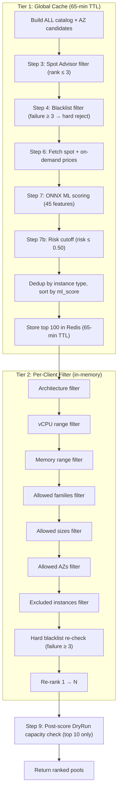

### Step 3 — Spot Advisor Filter
- Data source: `_get_spot_advisor_data()` (scraped from AWS Spot Advisor)
- Interruption rate ranks: 0 = <5%, 1 = 5-10%, 2 = 10-15%, 3 = 15-20%
- **Hard filter**: `rank <= 3` (reject pools with >20% interruption rate)

### Step 4 — Blacklist Check (Tiered)
- Redis set: `risky_pools:{region}`
- Failure count: `blacklist_failures:{instance_type}:{az}`
- **Hard reject**: `failure_count >= 3` (remove from pipeline)
- **Soft flag**: `failure_count 1-2` (kept, penalized -20% savings in Step 7)

### Step 6 — Price Fetch
- Source: `_get_pricing_data(region)` → AWS Pricing API cached in Redis
- Fallback: `_estimate_instance_price(instance_type)` based on family/size heuristic
- Safety checks:
  - If `spot_price <= 0` → set to `ondemand_price * 0.30`
  - If `spot_price >= ondemand_price` → set to `ondemand_price * 0.70`

### Step 7 — ML Scoring (ONNX Models)

**Models**: `ml_model/classifier_6.onnx` + `ml_model/regressor_6.onnx`
**Configuration**: `ml_model/risk_threshold.json` → `optimal_threshold` (default 0.35)

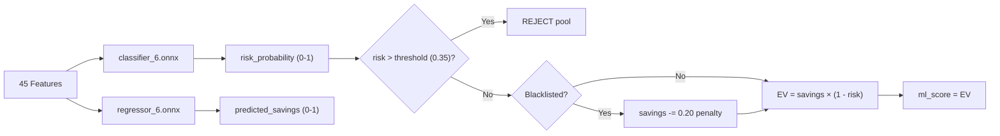

**Circuit Breaker**:
- Counter: `ASCPai:ml_fail_count` (10-min window)
- Threshold: `> 5 failures` → switch to `_fallback_scoring()`
- Degraded flag: `ASCPai:ml_degraded` (10-min TTL)

### Step 9 — Post-Score DryRun Capacity Check
- Only validates **top 10** candidates (not all)
- Budget: `MAX_DRYRUN_PER_HOUR = min(200, max(25, active_clusters * 2))`
- Per-cluster cap: 5 DryRun calls
- Redis counter: `spot:dryrun_count:{region}` (1-hour TTL)
- On DryRun failure: Pool marked `capacity_status = "failed"`, tracked in `spot:dryrun_failures_24h:{pool}`

---

## 1.3 ML Feature Engineering — 45 Features

**Source**: `backend/services/ml_feature_service.py` (524 lines)

| Category | Count | Features |
|---|---|---|
| **Categorical** | 7 | family_encoded, size_encoded, az_encoded + 4 padding |
| **Price** | 5 | spot_price, ondemand_price, current_savings, spot/on-demand ratio, price_velocity |
| **Temporal** | 10 | hour_sin, hour_cos, dow_sin, dow_cos, is_weekend, is_business_hours, month_sin, month_cos, quarter_sin, quarter_cos |
| **Lag** | 3 | savings_1h_ago, savings_4h_ago, savings_24h_ago |
| **Rolling** | 8 | 4h_mean/std/min/max, 24h_mean/std/min/max |
| **Family Patterns** | 6 | hour_avg_savings, hour_std_savings, dow_avg_savings, diff_from_hour_avg, diff_from_dow_avg, consecutive_stable_hours |
| **Family Stress** | 3 | family_mean_savings, family_std_savings, family_interruption_count |
| **Events** | 3 | is_holiday, days_to_nearest_event, event_stress_factor |

**Minimum viable features** (for new pools): 15 real features + 30 zeros

---

## 1.4 Risk Engine — Composite Risk Formula

**Source**: `backend/core/risk_engine.py` (342 lines)

### Bayesian Pool Pressure (§3.1)
```
Pressure_raw = (failures + k) / (active_nodes + k)    where k = 4.0 (Laplace)
PoolPressure = Pressure_raw × exp(-Δt / T_pool)       where T_pool = 60 min
```

### AZ Instability (§3.2)
```
AZPressure_raw = average(PoolPressure for all pools in AZ)
AZDelta = max(AZPressure_raw - PoolPressure, 0)
```

### Normalized Volatility (§3.3)
```
MeanPrice = EMA_30 (or simple mean)
StdDev = std(price_samples_60min)
NormalizedVolatility = clamp(StdDev / MeanPrice, 0, 1)
```

### Base Risk (§3.4)
```
AdjustedML = ML_Risk × (1 + AdvisorRisk × α)     where α = 0.3
BaseRisk = (AdjustedML × 0.35) + (NormalizedVolatility × 0.10)
```

### Cluster Instability Boost (Redis-Backed Persistent State Machine)

**Added by hardening** (Task 4.2): Cluster state is now persisted in Redis via `spot:cluster_state:{cluster_id}` hash. Decay is computed from real `entered_at` timestamp, surviving worker restarts.

```
NORMAL mode  → boost = 0
CONSERVATIVE → boost = 1.3 × exp(-t / τ)    where τ = 7200 seconds (120 min)
HALT mode    → boost = 1.0 (maximum)
```

**Two implementations**:
- `compute_cluster_instability_boost()` — Legacy in-memory version (backward compat)
- `get_cluster_instability_boost(cluster_id, redis_client)` — Redis-backed, persistent across restarts
- `transition_cluster_state(cluster_id, new_state, reason, redis_client)` — Persists state transitions

### Final Composite Risk (§3.5)
```
FinalRisk = BaseRisk
          + (PoolPressure × 0.25)
          + (AZDelta × 0.15)
          + (ClusterInstability × 0.15)
```

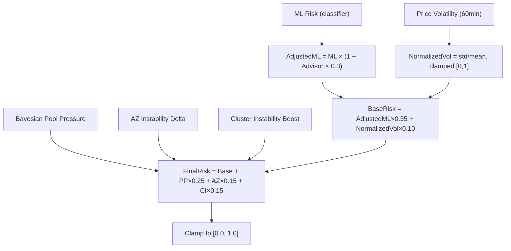

---

## 1.5 Economic EV Model — Full Pipeline

**Source**: `backend/core/ev_model.py` (183 lines)

### Components

| Component | Formula | Default Parameters |
|---|---|---|
| **Effective Exposure** | `min(risk_horizon_hours, recovery_time_hours)` | horizon=2h, recovery=0.5h |
| **Interruption Cost** | `FinalRisk × DowntimeCost/hr × ExposureHours` | downtime=$100/hr |
| **Capacity Failure** | `get_dynamic_capacity_failure_probability() × RetryCost` | prob=live from Redis (fallback 0.05), retry=$10 |
| **Migration Penalty** | `DrainTimeCost + WarmupCost + ControlPlaneCost` | $2 + $1 + $0.5 = $3.50 |
| **Volatility Cost** | `NormalizedVolatility × VolatilityCostMultiplier` | multiplier=5.0 |

### Dynamic Capacity Failure Probability (Task 3.1)

**Function**: `get_dynamic_capacity_failure_probability(redis_client, pool_id, region)`

Replaces hardcoded `0.05` fallback with live DryRun failure rate:
```
probability = failures / attempts     (from Redis keys spot:dryrun_failures_24h:{pool} and spot:dryrun_count:{region})
capped at 0.50                        (never assume total capacity failure)
fallback = 0.05                       (if no DryRun data yet)
```

### Final EV
```
EV = Savings
   - ExpectedInterruptionCost
   - MigrationPenalty
   - CapacityFailureRisk
   - (NormalizedVolatility × VolatilityCostMultiplier)

Decision rule: EV > 0 AND guardrails pass → candidate eligible
```

### Convenience Pipeline (`evaluate_candidate_ev`)
Returns explainable breakdown dict:
```json
{
  "ev": 12.34,
  "savings": 25.00,
  "interruption_cost": 5.00,
  "migration_penalty": 3.50,
  "capacity_failure_risk": 0.50,
  "volatility_cost": 3.66,
  "effective_exposure_hours": 0.50,
  "is_eligible": true
}
```

---

## 1.6 Simple EV Scoring (scoring.py) — ⚠️ DEPRECATED

**Source**: `backend/core/scoring.py` (219 lines)

> **DEPRECATION NOTICE** (added by production hardening):
> - `compute_expected_value()` — DEPRECATED for execution paths. Kept for pool ranking sort order only (Tier 1 cache, non-gating). Use `ev_model.evaluate_candidate_ev()` for execution decisions.
> - `compute_combined_expected_value()` — DEPRECATED. Kept as fallback for pre-migration proposals in `optimizer_coordinator.py`.
> - Both emit `DeprecationWarning` via Python `warnings` module when called.
> - Delete both after migration is confirmed complete.

### `compute_expected_value` (Single pool ranking — DEPRECATED)
```
EV = predicted_savings × (1.0 - risk_probability)
```
- Used by: pool_ranking_service (Tier 1 cache sort order ONLY)
- Inputs must be in [0.0, 1.0] range
- Emits `DeprecationWarning` on every call (stacklevel=2)

### `compute_combined_expected_value` (3-option comparison — DEPRECATED)

| Option | Description | Formula |
|---|---|---|
| A | Current size + new pool | `(savings × (1 - risk)) × (1 - volatility_penalty)` |
| B | New size + best pool | `((savings - migration_amortized) × (1 - risk)) × (1 - volatility_penalty)` |
| C | Do nothing (baseline) | `EV = 0.0` |

- Migration amortization: `migration_cost / 720 hours` (1-month lifetime)
- Sufficiency threshold: `ev_delta_pct >= 10.0`
- Emits `DeprecationWarning` on every call (stacklevel=2)

---

## 1.7 Decision Engine v3 — 15-Step Policy Pipeline

**Source**: `backend/core/decision_engine.py` (780 lines)

### Optimization Profiles

| Parameter | COST_FIRST | BALANCED (Default) | NO_DOWNTIME_FIRST |
|---|---|---|---|
| `risk_ceiling` | 0.25 | 0.20 | 0.10 |
| `delta_threshold` | 0.03 (3%) | 0.05 (5%) | 0.08 (8%) |
| `max_family_ratio` | 0.40 | 0.40 | 0.30 |
| `max_az_ratio` | 0.50 | 0.50 | 0.40 |
| `capacity_freshness_min` | 80 | 80 | 80 |
| `staleness_penalty` | 0.95 | 0.95 | 0.95 |
| `volatility_ceiling_adjustment` | -0.05 | -0.05 | -0.05 |

### Pipeline Flowchart

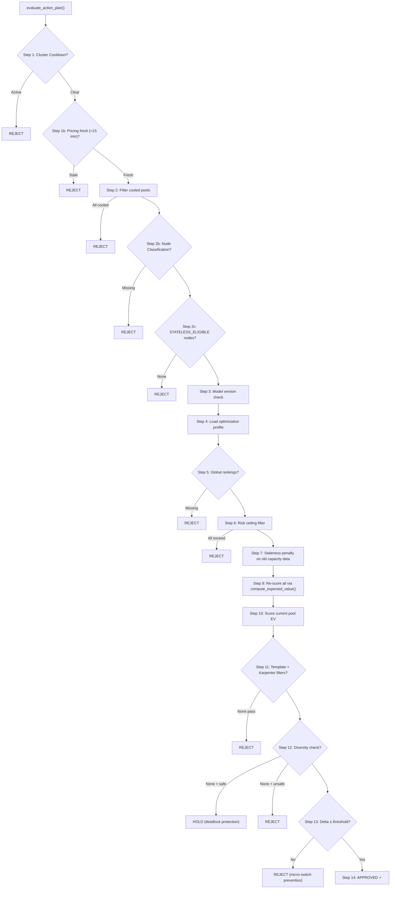

### Step-by-Step Detail

| Step | Check | Redis Key | Default |
|---|---|---|---|
| 1 | Cluster cooldown | `spot:cooldown:cluster:{id}` | 60 min TTL |
| 1b | Pricing freshness | `pricing:last_updated:{region}` | Max 15 min stale |
| 2 | Pool cooldown | `spot:cooldown:pool:{type}:{az}` | 120 min TTL |
| 2b | Node classification | `spot:node_classification:{id}` | 10 min cache |
| 2c | Stateless filter | (in-memory from 2b) | — |
| 3 | Model version | CURRENT_MODEL_VERSION = "6" | — |
| 4 | Profile lookup | `spot:cluster_mode:{id}` | "BALANCED" |
| 5 | Global rankings | `spot:global_rankings:{region}` | — |
| 6 | Risk ceiling | `spot:volatility_regime:{region}` | Adjusts by -0.05 |
| 7 | Staleness penalty | `capacity_age_minutes > 80` | `savings *= 0.95` |
| 9 | EV scoring | — | `EV = savings × (1-risk)` |
| 10 | Current pool EV | — | Same formula |
| 11 | Template filter | `spot:template:{id}` | Family whitelist/blacklist |
| 12 | Diversity | (in-memory) | Family ≤40%, AZ ≤50% |
| 13 | Delta threshold | — | 3-8% depending on profile |

---

## 1.8 Control Plane Loop — 8-Step Decision Cycle

**Source**: `backend/workers/tasks/control_plane_loop.py` (389 lines)

Runs as Celery task **every 5 minutes** per active cluster.

> **Hardening addition** (Task 1.1): Hibernation early gate is now the FIRST check — before any Redis reads, pricing fetches, DryRun calls, or risk calculations. If `cluster.is_hibernating == True`, the cycle immediately returns `{status: "SKIPPED", reason: "HIBERNATING"}`.

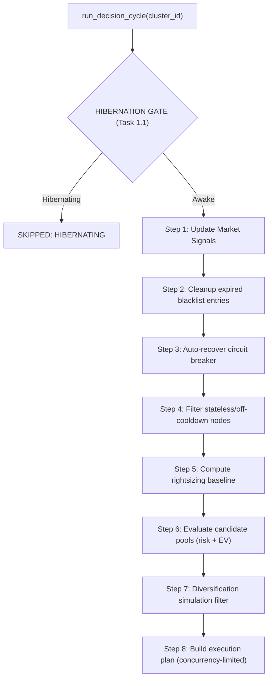

**Step 1**: Fetches spot prices, volatility regime, advisor data, pool pressure from Redis/AWS
**Step 4**: Uses `WorkloadInspector` + `CooldownController` to filter eligible nodes
**Step 5**: Uses `RightSizingService` to compute current resource baseline
**Step 6**: Calls `risk_engine.py` for full risk computation + `ev_model.py` for EV
**Step 7**: Uses `DiversityEnforcer` to simulate adding each candidate
**Step 8**: Respects concurrency limits, builds ordered execution plan

---

## 1.9 Cooldown Controller

**Source**: `backend/services/cooldown_controller.py` (339 lines)

| Action | Redis Key Pattern | Default TTL |
|---|---|---|
| Cluster switch | `spot:cooldown:cluster:{id}` | 60 min |
| Pool failure | `spot:cooldown:pool:{pool_id}` | 120 min |
| Resize action | `spot:cooldown:resize:{id}` | 360 min (6h) |
| Pool switch action | `spot:cooldown:pool_switch:{id}` | 30 min |
| Substitute fallback | `spot:cooldown:substitute:{id}` | 120 min |
| **Stabilization lock** | `spot:stabilization_lock:{cluster_id}` | **300s (5 min)** |

**Emergency override**: `override_for_emergency()` deletes cooldown key immediately

### Stabilization Lock (Task 4.1)

Prevents any optimization for 5 minutes after execution, giving the cluster time to reach a new steady state.

| Method | Description |
|---|---|
| `acquire_stabilization_lock(cluster_id, reason)` | SET NX EX 300 — returns True if acquired |
| `is_stabilization_locked(cluster_id)` | Returns (is_locked, remaining_seconds) |
| `release_stabilization_lock(cluster_id)` | Early release for emergency override |

---

## 1.10 Blacklist Service — Tiered Model with Exponential Backoff

**Source**: `backend/services/blacklist_service.py` (422 lines)

### Blacklist TTLs

| Tier | Trigger | TTL | Backoff |
|---|---|---|---|
| Tier 1 | DryRun failure 1-2x/24h | 6 hours | None |
| Tier 2 | DryRun failure 3+/24h | 12 hours | None |
| Tier 3 | Actual interruption (1st) | 24 hours | Base |
| Tier 3+ | Repeat interruption | `24h × 2^(n-1)` | Exponential backoff |

### Cascade Protection
```
if blacklisted_count / total_pools > 0.70:
    suspend_blacklisting(region)  # 30 min suspension
    # Only suspends PREDICTIVE blacklisting
    # Deterministic (actual interruption) blacklisting still active
```

### n=n Replacement (`update_global_cache_on_blacklist`)
When a pool is blacklisted:
1. Remove from global Redis cache
2. Score uncached candidates to find N replacements
3. Insert replacements, re-sort, re-rank
4. Preserve remaining TTL on cache

---

## 1.11 Substitute Manager — 5-State Machine

**Source**: `backend/services/substitute_manager.py` (716 lines)

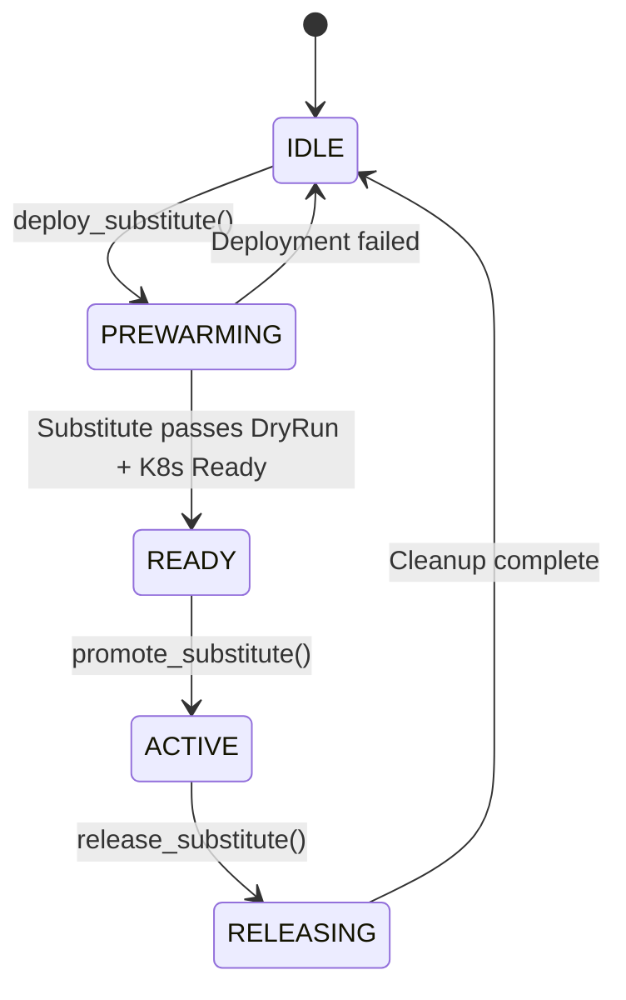

**Deploy workflow**:
1. Validate target node is `STATELESS_ELIGIBLE` via WorkloadInspector
2. Set state to `PREWARMING`
3. Select top 3 candidates based on optimization mode
4. Validate each via EC2 DryRun API
5. Launch first passing candidate
6. Set state to `READY` on success

**Substitute type**: Determined by cluster optimization mode:
- `COST_FIRST` → spot substitute
- `NO_DOWNTIME_FIRST` → on-demand substitute
- `BALANCED` → spot substitute

**Cost drift check**: `check_cost_drift()` monitors if substitute cost drifted >20% from deploy-time cost

---

## 1.12 Event Monitor — Termination Handling + Volatility

**Source**: `backend/services/event_monitor.py` (689 lines)

### Termination Notice Path (Overrides normal pipeline)
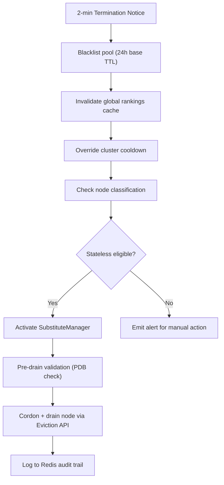

**Bypasses**: Delta threshold, savings check, cluster cooldown — all bypassed in emergency

### Volatility Regime Detection
```
1. Compute rolling 24h standard deviation of spot prices
2. Compare against 30-day distribution of daily stddevs
3. If current_stddev > 75th percentile → volatile
4. Store in Redis: spot:volatility_regime:{region} = "true" (2-hour TTL)
```

---

## 1.13 Pool Rotation Service — AZ Auto-Failover

**Source**: `backend/services/pool_rotation_service.py` (528 lines)

### Rotation Triggers
1. Viable pool count < `min_viable_threshold`
2. Primary AZ has <30% viable pools
3. Cascade risk detected (>70% blacklisted globally)

### Rotation Actions
1. Promote backup AZs to primary selection
2. Update cluster metadata with new primary AZ
3. Clear Redis pool ranking cache (forces re-rank)
4. Proactively refresh fresh pool cache (top 20 viable)
5. Log rotation event + notify

---

## 1.14 Execution Controller — 6-Step Safe Replacement

**Source**: `backend/services/execution_controller.py` (230 lines)

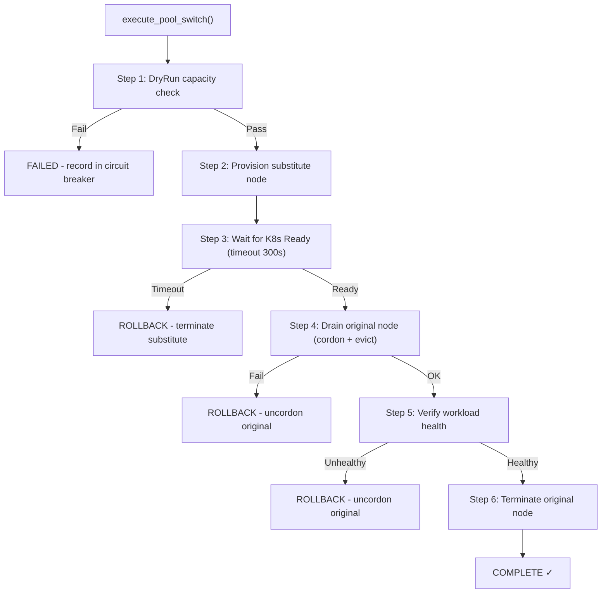

**Execution states**: `DRY_RUN_CAPACITY → PROVISION_SUBSTITUTE → WAIT_SUBSTITUTE_READY → DRAIN_ORIGINAL → VERIFY_WORKLOAD → TERMINATE_ORIGINAL → COMPLETE`

---

## 1.15 Action Executor — 5 Action Types

**Source**: `backend/core/action_executor.py` (643 lines)

| Action Type | Function | Steps |
|---|---|---|
| **SPOT_REPLACEMENT** | `_execute_spot_replacement()` | Launch new → Wait running → Drain old → Terminate old |
| **RIGHT_SIZE** | `_execute_right_size()` | Launch right-sized instance → Migrate workloads → Terminate old |
| **CONSOLIDATION** | `_execute_consolidation()` | Identify underutilized → Redistribute pods → Scale down |
| **SCALE_DOWN** | `_execute_scale_down()` | Cordon excess nodes → Drain → Terminate |
| **SCALE_UP** | `_execute_scale_up()` | Launch new instances based on resource request |

**Execution statuses**: `PENDING → RUNNING → COMPLETED / FAILED / ROLLED_BACK`

---

## 1.16 Celery Workers (ASCP AI)

**Source**: `backend/workers/tasks/ASCPai_worker.py` (360 lines)

| Task | Schedule | Description |
|---|---|---|
| `execute_pool_ranking_pipeline` | Every 1 hour | Run full 8-step ML pipeline |
| `collect_spot_prices` | Every 10 min | Store prices in `spot_price_history` (24h rolling buffer, 144 points/pool) |
| `cleanup_old_spot_prices` | — | Delete entries older than 24h |
| `compute_family_baselines` | Weekly | Compute per-(family, hour, dow) statistics |
| `sync_karpenter_nodepools` | Every 1 hour | Sync top 10 ML-ranked types to Karpenter NodePool |

### Auto Rebalancer (`auto_rebalancer.py`, 393 lines)

| Rebalancing Type | Timeout | Trigger |
|---|---|---|
| **Emergency** | 90 seconds | Termination notice |
| **Graceful** | 10 minutes | Proactive optimization / risk increase |

**Execution**: Cordon nodes → Drain pods (Eviction API) → Karpenter reschedules on safer pools

---

## 1.17 Karpenter Service — NodePool Management

**Source**: `backend/services/karpenter_service.py` (810 lines)

### NodePool Sync Flow
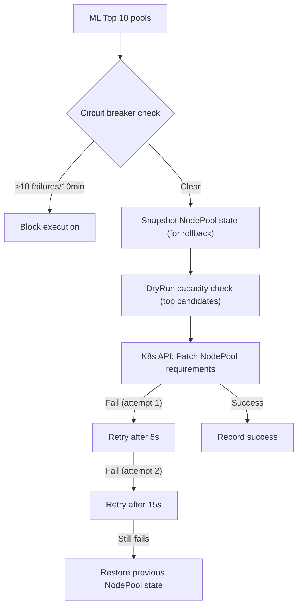

### On-Demand Fallback
- Trigger: No safe spot pools found
- Action: `switch_to_ondemand()` → patches `capacity-type: on-demand`
- TTL: `FALLBACK_TTL_SECONDS = 43200` (12 hours)
- Auto-revert: `revert_to_spot()` when TTL expires
- Also validates drain via `_validate_drain()` (kubectl drain --dry-run)

---

## 1.18 Global Pool Cache

**Source**: `backend/services/global_pool_cache_service.py` (205 lines)

| Parameter | Value |
|---|---|
| Cache TTL | 3900 seconds (65 min) |
| Cache Key | `spot:rankings:{region}` |
| Max pools cached | 50 per region |
| Universal template | All architectures, vCPU 1-192, memory 1-768 GB |

**Invalidation triggers**: Blacklist changes, manual refresh, price changes

---

## 1.19 Guardrail Engine — Hard Constraints & Safety Checks

**Source**: `backend/services/guardrail_engine.py` (350 lines)

### Hard Guards (§5.1)

| Guard | Default Threshold | Description |
|---|---|---|
| Max spot ratio | 0.80 | No more than 80% spot nodes |
| Max AZ concentration | 0.60 | No AZ > 60% of spot nodes |
| Max family concentration | 0.50 | No instance family > 50% |
| Daily spend cap | $10,000 | Hard USD/day limit |
| Max concurrent nodes down | 3 | Simultaneous drains |
| Stateful node protection | Block | Never touch stateful nodes |
| Maintenance window | Block | Block during K8s maintenance |

### Spend Velocity Guard (§5.2)
```
SpendVelocity = HourlyCostNow - HourlyCost1hAgo
If velocity > threshold:
  Block UPSIZE/SCALE_UP (costs rising)
  Allow DOWNSIZE/SCALE_DOWN (reduces cost)
```

### Org-Level Spend Velocity Guard (Task 6.1)

**Function**: `check_org_spend_velocity_guard(redis_client, org_id, proposed_action)`

Checks total spend velocity across ALL clusters in an organization:
```
Reads spot:org_spend_state:{org_id} from Redis
If current_hourly exceeds rolling_avg_24h by threshold_pct:
  Block UPSIZE actions
  Allow DOWNSIZE actions
```

### Cluster Health Score (§5.4)
```
Health = 0.25×PendingPods + 0.25×ReadyNodes + 0.25×Latency + 0.25×CPUHeadroom
Threshold: >= 0.75 to proceed
```

### Composite Guard Evaluation
**Function**: `evaluate_all_guardrails()` — Runs ALL guards and returns comprehensive result dict with `all_passed`, `hard_guard_passed`, `spend_velocity_passed`, `stabilization_passed`, `health_passed`.

---

# SECTION 2: RIGHT-SIZING

## 2.1 Recommendation Generation Pipeline

**Source**: `backend/services/rightsizing_service.py` (835 lines)

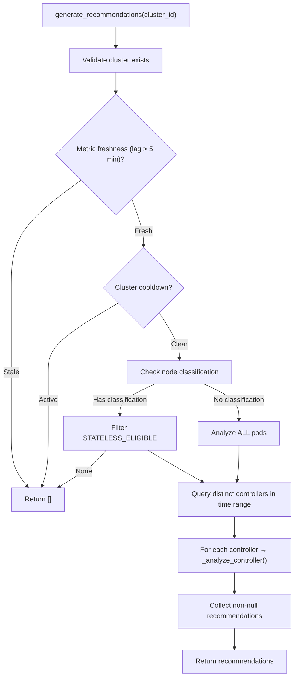

### Key Constants

| Parameter | Value | Description |
|---|---|---|
| `analysis_window_hours` | 168 (7 days) | Default analysis window |
| `min_data_points` | 100 | Minimum metrics per controller |
| `SAFETY_BUFFER_PCT` | 20% | Buffer above P95 |
| `OVERSIZED_THRESHOLD_PCT` | 50% | Flag oversized if usage < 50% of request |
| `UNDERSIZED_THRESHOLD_PCT` | 95% | Flag undersized if P99 > request |

---

## 2.2 Controller Analysis — Per-Workload Logic

**Function**: `_analyze_controller()` (lines 274-451)

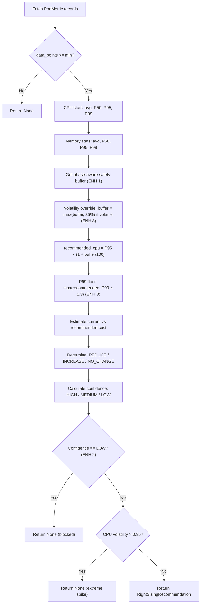

### Safety Buffer Phases (ENH 1)

**Source**: `OptimizerCoordinator.get_cluster_trust_phase()` (optimizer_coordinator.py)

| Phase | Cluster Age | Buffer | Min Samples | Risk Override |
|---|---|---|---|---|
| Phase 0 | 0–30 min | 30% | 500 | 0.15 |
| Phase 1 | 30 min–2h | 25% | 500 | 0.20 |
| Phase 2 | >2 hours | 20% | 100 | Profile default |

### Confidence Calculation
```
data_points >= min * 5  →  HIGH
data_points >= min      →  MEDIUM
data_points < min       →  LOW
```

### CPU Volatility Gate
```
cpu_volatility = (P99 - P50) / P99
if volatility > 0.95 → REJECT (extreme spike workload)
```

---

## 2.3 Cost Estimation — 3-Tier Pricing Cascade

**Function**: `_estimate_cost()` (lines 496-581)

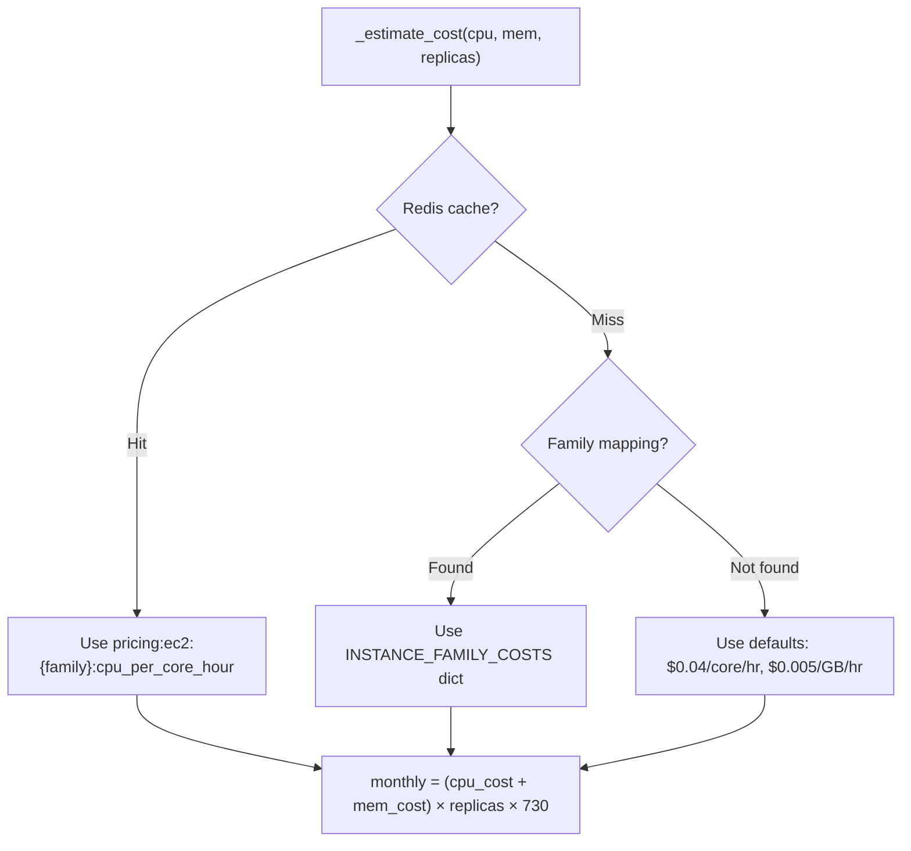

**Instance family mapping by CPU:memory ratio**:

| Ratio | Family | CPU $/core/hr | Mem $/GB/hr |
|---|---|---|---|
| ≥ 0.4 (compute-heavy) | c5 | $0.042 | $0.005 |
| ≥ 0.2 (balanced) | m5 | $0.048 | $0.006 |
| < 0.2 (memory-heavy) | r5 | $0.063 | $0.008 |

Additional families: m6i, c6i, r6i, t3, t3a with separate rates.

---

## 2.4 Proposal Creation with Template Enforcement

**Function**: `create_rightsizing_proposals()` (lines 608-763)

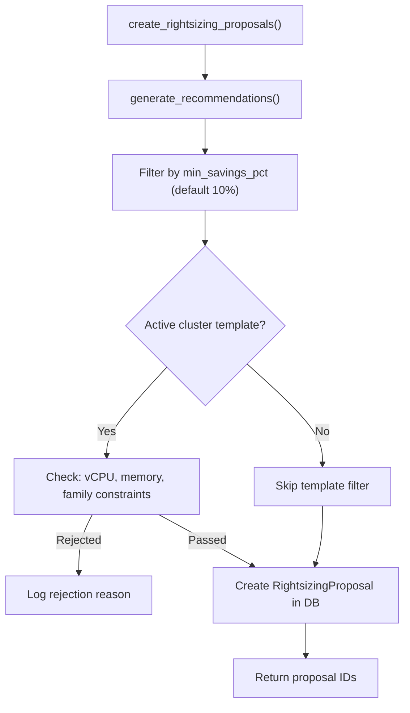

**Template constraints checked**:
- `min_vcpu <= proposed_vcpu <= max_vcpu`
- `min_memory_gb <= proposed_memory_gb <= max_memory_gb`
- `proposed_family in allowed_families`
- `proposed_family NOT in excluded_families`

---

## 2.5 Optimizer Coordinator — Phase Machine

**Source**: `backend/services/optimizer_coordinator.py` (597 lines)

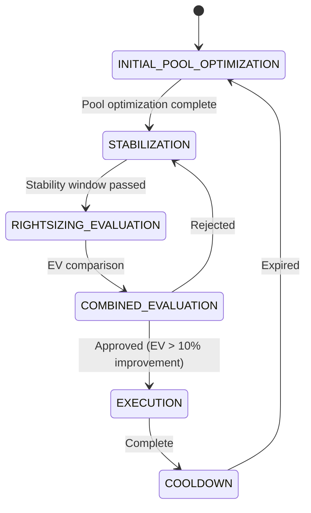

**Pool optimization gate**: Checks cooldown + no pending rightsizing proposal + valid phase
**Rightsizing gate**: Checks trust phase + resize cooldown + stabilization elapsed

---

# SECTION 3: HIBERNATION

## 3.1 Architecture Overview

| Component | File | Purpose |
|---|---|---|
| **Service** | `hibernation_service.py` (444 lines) | Schedule CRUD, conflict detection, savings estimation |
| **Worker** | `hibernation_worker.py` (389 lines) | Celery tasks for sleep/wake/prewarm execution |
| **Model** | `hibernation_schedule.py` | Schedule DB model |
| **Association** | `hibernation_schedule_clusters.py` | M2M schedule↔cluster |

---

## 3.2 Strategies & Savings

| Strategy | Description | Savings | Wake Time | Risk |
|---|---|---|---|---|
| `NAMESPACE_SLEEP` | Scale all workload replicas to 0 | 80% | 2 min | Low |
| `NUCLEAR` | Terminate worker nodes | 70% | 5 min | Medium |
| `SNAPSHOT_RESTORE` | Stop entire cluster | 95% | 15 min | High |

---

## 3.3 Schedule Matrix Format

| Type | Length | Encoding |
|---|---|---|
| WEEKLY | 168 chars | 7 days × 24 hours |
| DAILY | 31 chars | 1 month of days |
| MONTHLY | 744 chars | 31 days × 24 hours |

- `'0'` = AWAKE, `'1'` = SLEEPING
- Validation: length must match type, characters must be only `0` or `1`

---

## 3.4 Schedule CRUD Flow

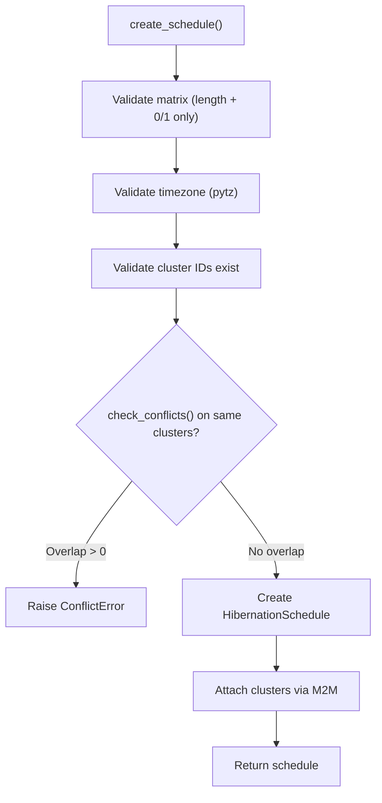

**Conflict detection**: `overlap = sum(1 for i if m1[i] == '1' AND m2[i] == '1')`
Only checks WEEKLY vs WEEKLY schedules.

---

## 3.5 Savings Estimation

```
sleep_hours = matrix.count('1')
hourly_cost = cluster.monthly_cost / 730

weekly_savings = sleep_hours × hourly_cost × strategy_percentage
annual_savings = weekly_savings × 52
savings_pct = (sleep_hours / 168) × strategy_percentage × 100
```

---

## 3.6 Hibernation Worker — Distributed Execution

**Source**: `backend/workers/tasks/hibernation_worker.py` (389 lines)

### Distributed Locking
```
Lock key: hibernation:lock:{schedule_id}:{cluster_id}
Lock TTL: 180 seconds
Acquisition: SET NX EX (atomic)
Release: Only if we still own it (compare lock_value)
```

### Execution Flow

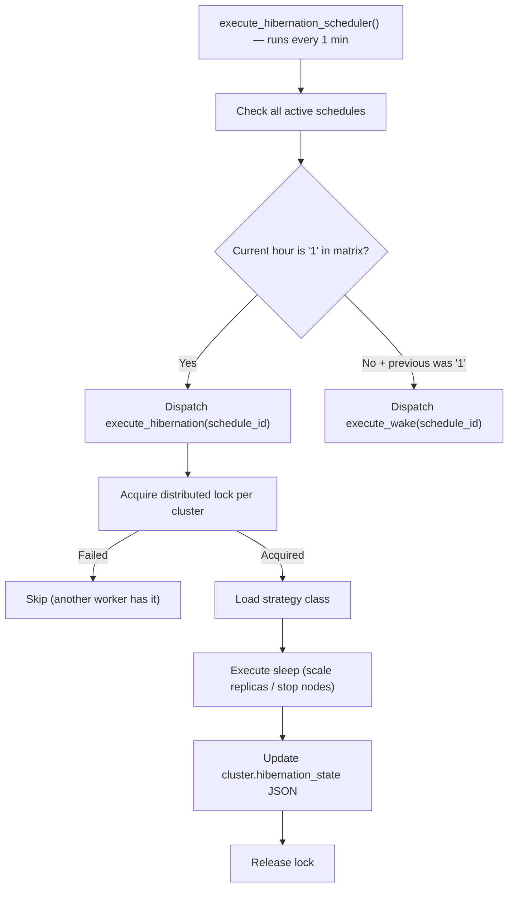

### Tasks

| Task | Schedule | Description |
|---|---|---|
| `execute_hibernation_scheduler` | Every 1 min | Check schedules, dispatch sleep/wake |
| `execute_hibernation` | On-demand | Execute sleep with per-cluster locking |
| `execute_wake` | On-demand | Execute wake with staleness check |
| `execute_prewarm` | `pre_warm_minutes` before wake | Start nodes early |

**Wake staleness check**: If `hibernation_state` timestamp is >4 hours old, treat as stale and re-validate before waking.

---

## 3.7 Active Hibernation Status Tracking

**Function**: `get_active_hibernation_status()` (hibernation_service.py)

**Cluster model fields used**:
- `is_hibernating`: Boolean flag
- `hibernation_lock`: Lock ID (prevents concurrent ops)
- `hibernation_lock_acquired_at`: Start timestamp
- `hibernation_state`: JSON → `{nodes_processed, total_nodes, schedule_name, strategy}`

**Progress calculation**:
```
progress_pct = (nodes_processed / total_nodes) × 100
estimated_remaining = (elapsed / progress) × (100 - progress)
```

---

## 3.8 Savings History

**Function**: `get_savings_history()` (hibernation_service.py)

- Queries `AuditLog` where `resource_type='HIBERNATION'` and `event IN ('hibernation_sleep', 'hibernation_wake')`
- Aggregates `estimated_savings` and `sleep_hours` from `AuditLog.metadata` JSON
- Groups by month, fills missing months with zeros

---

## 3.9 Schedule Parameters

| Parameter | Type | Default | Description |
|---|---|---|---|
| `name` | str | Required | Human-readable name |
| `schedule_matrix` | str | Required | Binary string |
| `strategy` | enum | Required | NAMESPACE_SLEEP / NUCLEAR / SNAPSHOT_RESTORE |
| `cluster_ids` | list | Required | Attached clusters |
| `timezone` | str | "UTC" | Schedule timezone |
| `pre_warm_minutes` | int | 30 | Minutes before wake to pre-warm |
| `is_active` | bool | True | Enable/disable |
| `date_overrides` | dict | {} | Date-specific overrides |
| `schedule_type` | enum | WEEKLY | WEEKLY / DAILY / MONTHLY |

---

# APPENDIX A: Complete Redis Key Reference

| Key Pattern | Service | TTL | Purpose |
|---|---|---|---|
| `spot:cooldown:cluster:{id}` | CooldownController | 60 min | Cluster switch cooldown |
| `spot:cooldown:pool:{pool_id}` | CooldownController | 120 min | Pool failure cooldown |
| `spot:cooldown:resize:{id}` | CooldownController | 360 min | Resize cooldown |
| `spot:cooldown:pool_switch:{id}` | CooldownController | 30 min | Pool switch cooldown |
| `spot:cooldown:substitute:{id}` | CooldownController | 120 min | Substitute fallback cooldown |
| `spot:node_classification:{id}` | WorkloadInspector | 10 min | Node status map |
| `spot:cluster_mode:{id}` | DecisionEngine | 300s | Optimization mode |
| `spot:global_rankings:{region}` | Intelligence Layer | Variable | Pre-computed rankings |
| `spot:volatility_regime:{region}` | EventMonitor | 2 hours | Volatile market flag |
| `spot:rankings:{region}` | GlobalPoolCacheService | 65 min | Global pool cache |
| `spot:template:{id}` | DecisionEngine | Variable | Node template cache |
| `spot:ondemand_fallback:{id}` | KarpenterService | 12 hours | On-demand fallback |
| `spot:execution_failures:{id}` | KarpenterService | 10 min | Circuit breaker |
| `spot:metrics:{name}` | DecisionEngine | 24 hours | Observability counters |
| `spot:dryrun_count:{region}` | PoolRankingService | 1 hour | DryRun budget |
| `spot:dryrun_failures_24h:{pool}` | PoolRankingService | 24 hours | Per-pool DryRun failures |
| `spot:active_cluster_count` | Workers | Variable | Active cluster count |
| `pricing:last_updated:{region}` | Market Ingestion | Variable | Pricing timestamp |
| `pricing:ec2:{family}:cpu_per_core_hour` | PricingWorker | Variable | Instance pricing |
| `risky_pools:{region}` | BlacklistService | Variable | Blacklisted pool set |
| `risky_pools` | BlacklistService (legacy) | Variable | Legacy blacklist set |
| `blacklist_failures:{type}:{az}` | BlacklistService | Variable | Failure count per pool |
| `spot:blacklist_suspended:{region}` | BlacklistService | 30 min | Cascade dampener |
| `capacity:{type}:{az}` | PoolRankingService | 15 min | Capacity DryRun cache |
| `global_pool_rankings:{region}` | PoolRankingService | 65 min | Tier 1 global cache |
| `ASCPai:ml_fail_count` | PoolRankingService | 10 min | ML circuit breaker |
| `ASCPai:ml_degraded` | PoolRankingService | 10 min | ML degraded flag |
| `spot:substitute:state:{id}` | SubstituteManager | Variable | Substitute lifecycle |
| `spot:substitute:meta:{id}` | SubstituteManager | Variable | Substitute metadata |
| `hibernation:lock:{sched}:{cluster}` | HibernationWorker | 180s | Distributed lock |
| `resize:failure_count_24h:{id}` | OptimizerCoordinator | 24 hours | Resize circuit breaker |
| **`spot:cluster_state:{cluster_id}`** | **risk_engine.py** | **NONE** | **Persistent cluster state machine (Task 4.2)** |
| **`spot:rankings_version:{region}`** | **multiple invalidators** | **NONE** | **Optimistic lock version (Task 4.3)** |
| **`spot:stabilization_lock:{cluster_id}`** | **cooldown_controller.py** | **5 min** | **Post-execution stabilization (Task 4.1)** |
| **`spot:execution_plan:{cluster_id}`** | **control_plane_loop.py** | **1h** | **Execution plan hash (Task 4.4)** |
| **`spot:org_spend_state:{org_id}`** | **billing_service.py** | **1h** | **Org spend velocity (Task 6.1)** |
| **`spot:rejection_counter:{id}:{reason}`** | **decision_engine.py** | **24h** | **Decision rejection counters (Task 7.1)** |
| **`spot:config:org_velocity_threshold`** | **config (manual)** | **NONE** | **Org velocity threshold (Task 6.1)** |

> **Source of truth for Redis keys**: `backend/redis_keys.py`

---

# APPENDIX B: Celery Worker Schedule Summary

| Task | File | Interval | Description |
|---|---|---|---|
| `execute_pool_ranking_pipeline` | `ASCPai_worker.py` | 1 hour | Full ML pipeline |
| `collect_spot_prices` | `ASCPai_worker.py` | 10 min | Price collection |
| `compute_family_baselines` | `ASCPai_worker.py` | Weekly | Family statistics |
| `sync_karpenter_nodepools` | `ASCPai_worker.py` | 1 hour | NodePool sync |
| `run_all_clusters_decision_cycle` | `control_plane_loop.py` | 5 min | Control plane loop |
| `execute_hibernation_scheduler` | `hibernation_worker.py` | 1 min | Schedule checker |
| `execute_rebalancing` | `auto_rebalancer.py` | On-demand | Node migration |

---

# APPENDIX C: WorkloadInspector Classification Logic

**Source**: `backend/services/workload_inspector.py` (280 lines)

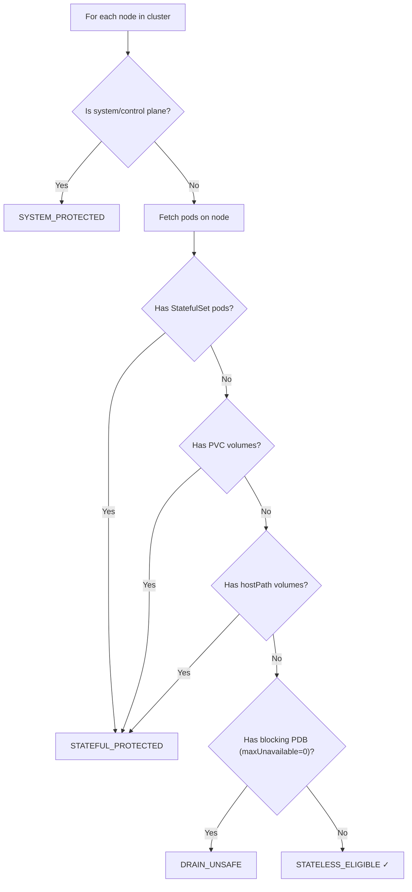

Cache: `spot:node_classification:{cluster_id}` (10-min TTL, scanned every 10 min)

---

# 5. Agent Logic (Client-Side DaemonSet)

**IMPORTANT NOTE**: The logic below pertains strictly to the **Agent**, which is installed as a **DaemonSet** on client Kubernetes servers. It is responsible for localized metrics collection, executing backend-directed actions, and maintaining a secure, real-time connection to the central control plane.

The agent consists of several autonomous components running as threads within the `main.py` entry point (`Agent` class).

## 5.1 Registration & Authentication
**Source**: `agent/main.py`, `agent/config.py`

*   **Registration**: On startup, the agent uses its `CLUSTER_ID` and `API_KEY` to register with the backend (`/api/v1/agents/register`). It generates a unique `AGENT_ID` based on its hostname and a UUID.
*   **Security (HMAC)**: A `SECRET_KEY` is used to verify the HMAC signature of any backend-directed action commands, ensuring that the control plane is the authentic sender of disruptive actions.

## 5.2 Metrics Collection (`MetricsCollector`)
**Source**: `agent/collector.py`

Runs on a strict schedule (default: 60s) to batch and send observations to the backend.
*   **Node Metrics**: Prioritizes direct OS-level metrics using `psutil` (if `HOST_PROC` is mounted, granting "Day 2 X-Ray Vision"). If local access falls back, it queries the Kubernetes `metrics.k8s.io` API. It also determines node warm-up status (Marked `CALIBRATING` if age < 5 minutes).
*   **Pod Metrics**: Aggregates CPU/Memory usage, requests, and limits per pod.
*   **Events**: Scrapes cluster events (e.g., OOMKills, Evictions) from the Kubernetes core API.
*   **Payload Batching**: Combines pod, node, and event metrics into a single buffered payload sent to `/api/v1/agent-metrics/batch`.

## 5.3 Right-Sizing Pod Metrics (`PodMetricsCollector`)
**Source**: `agent/pod_metrics_collector.py`

*   **DaemonSet Optimization**: specifically filters and collects metrics *only for pods running on the local node* where the daemon is executing (`pod.spec.node_name == self.node_name`).
*   **Data Extraction**: Retrieves controller info (Deployment, StatefulSet), parses CPU to millicores and Memory to bytes, counts containers, and extracts QoS classes.
*   **Submission**: Sent every 5 minutes (default) to `/api/v1/pod-metrics/batch`.

## 5.4 Safety and Execution (`ActionActuator`)
**Source**: `agent/actuator.py`

Responsible for mapping backend intent to local Kubernetes API calls. Polls `/api/v1/actions/poll`.
*   **Signature Verification**: Every payload is HMAC validated against `SECRET_KEY`.
*   **Pod Eviction (Safe Drain)**:
    *   Creates a `V1Eviction` object.
    *   **PDB Guardrail**: Checks if an eviction would violate a PodDisruptionBudget (PDB) by reading `PolicyV1Api`. If the backend asks to evict a pod, and `disruptions_allowed < 1`, it blocks the eviction. Return HTTP 429 logic handles PDB backoff.
*   **Node Operations**: `cordon_node`, `drain_node` (skips DaemonSets, validates PDBs), and `label_node`.
*   **Result Reporting**: Execution success/failure is reported back to `/api/v1/actions/{action_id}/result`.

## 5.5 Spot Interruption Detection (`SpotPoller`)
**Source**: `agent/poller.py`

*   **IMDS Endpoint**: Polls the AWS Instance Metadata Service (`http://169.254.169.254/latest/meta-data/spot/instance-action`) every 5 seconds.
*   **2-Minute Warning Protocol**: If a termination notice is detected:
    1.  Immediately cordons the node.
    2.  Gracefully drains the node (`force=True`).
    3.  Fires a highly-prioritized asynchronous webhook to the backend (`/api/v1/clusters/{cluster_id}/fallback`) to instantly provision an On-Demand replacement before the Spot node officially dies.

## 5.6 Real-Time Communication (`WebSocketClient` & `HeartbeatSender`)
**Sources**: `agent/websocket_client.py`, `agent/heartbeat.py`

*   **WebSocket**: Establishes a bidirectional `wss://` connection to receive real-time action commands (bypassing the HTTP polling delay), config updates, and connection pings. Incorporates exponential backoff for reconnections.
*   **Heartbeat**: Sends a periodic HTTP payload to `/api/v1/agents/heartbeat` detailing local process health (CPU, Memory of the agent itself) and individual thread health (Collector, Actuator, Websocket).
*   **Probes**: Runs a local HTTP server exposing `/healthz` and `/readyz` for Kubernetes to orchestrate the DaemonSet pod lifecycle.
