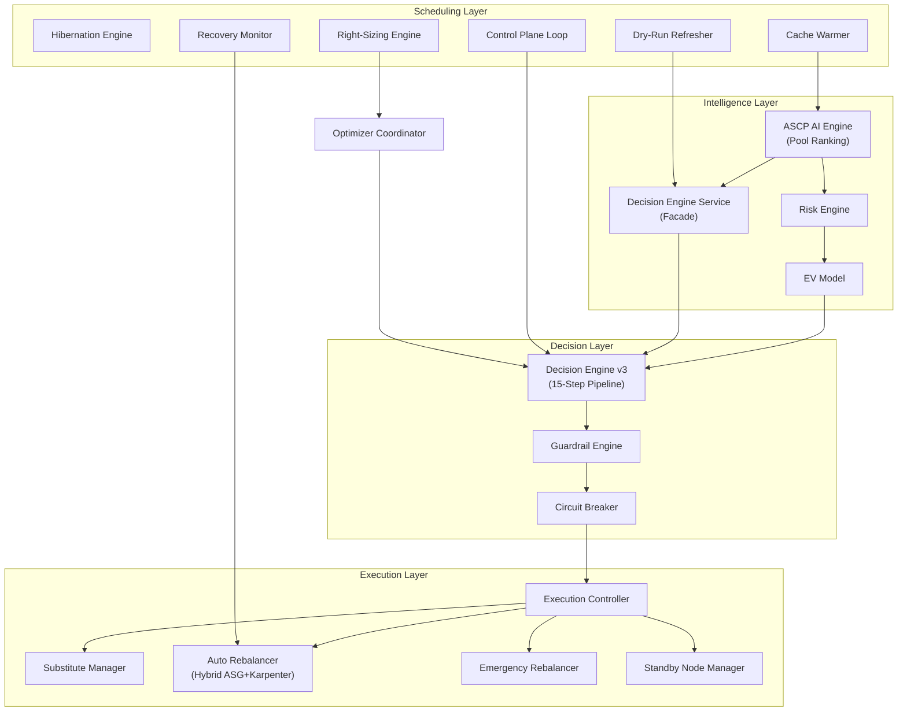

# Spot Optimizer Platform — Complete Backend Logic Reference

> **Source of truth**: Extracted exclusively from `.py`, `.jsx`, `.js` files in this repository.
> **Files analyzed**: 150+ backend Python services, 37 Celery workers, 60+ models, 6 core modules, 1 guardrail engine, 3 hibernation strategies.
> **Zero `.md` or `.txt` files referenced.**
> **Last updated**: 2026-03-27 — Session updates: node-recommendations pool-level diversification (occupied_pools exclusion + 15% interruption hard cap, Pass 2 relaxation bug fix), coverage cache invalidation after successful rebalance, frontend dropdown reset on terminated node, auto-rebalancer rollback/failure/cleanup verified. Previous: architecture_preference added to ClusterOptimizationSettings (both/amd64/arm64), per-node alternatives pipeline expanded (arch_pref gate, blacklist gate from Redis risky_pools, diversification cap max 2/family, risk_ceiling_pct fix read from OptimizationStrategy), Market View tab removed from PoolRankings.jsx frontend (backend endpoint retained), chart height improvements. Previous: 2026-03-23 — Full refresh: state-machine rebalancer (Pillar 1), BlacklistService with exponential backoff & cascade dampener, CooldownController with DB persistence, Karpenter emergency direct-EC2 path, recovery monitor Karpenter stall detection, org-level spend velocity guard, 13-step execution controller, GLOBAL_CACHE_LIMIT 100→1500, n=n blacklist replacement, fallback scoring, schema validation (Pillar 6), all engine line counts verified, new models (NodeAlternativeCache, ClusterBaseline, StatefulRules), APScheduler background jobs, updated Redis key registry. Session 2026-03-23 (gap analysis): decision_engine_service report_termination 24h→15min, NodeTemplate.source_od_price + price gate in _apply_client_filters, OverviewTab IP hostname→instance_type, node-recommendations per-node arch filter, ranking_version:{region} counter on blacklist events, hibernation _check_matrix_overlap DAILY/MONTHLY fixed.

---

# SECTION 1: SYSTEM OVERVIEW

## 1.1 Architecture Overview

The platform consists of 15+ core engines coordinated through a central control plane:



## 1.2 Engine Registry

| Engine | Primary File | Approx Lines | Purpose |
|---|---|---|---|
| **ASCP AI (System A)** | `backend/services/pool_ranking_service.py` | 2271 | 2-tier ML scoring pipeline with ONNX models, n=n blacklist replacement, fallback scoring |
| **Risk Engine** | `backend/core/risk_engine.py` | 343 | Bayesian risk composition (5 components) |
| **EV Model** | `backend/core/ev_model.py` | 184 | Economic expected value with 6-term formula |
| **Decision Engine v3** | `backend/services/decision_engine_service.py` | 321 | Unified pool-selection facade with BlacklistService integration and tiered blacklisting |
| **Blacklist Service** | `backend/services/blacklist_service.py` | 423 | Global pool blacklisting with exponential backoff (24h→168h), cascade dampener |
| **Cooldown Controller** | `backend/services/cooldown_controller.py` | 401 | Anti-flapping enforcement with DB persistence, action-specific cooldowns |
| **Guardrail Engine** | `backend/services/guardrail_engine.py` | 351 | Hard guards + spend velocity (cluster + org-level) + stabilization + health score |
| **Circuit Breaker** | `backend/services/circuit_breaker.py` | 268 | 3-state: NORMAL → CONSERVATIVE → HALT, exponential decay risk multiplier |
| **Instability Propagator** | `backend/services/instability_propagator.py` | ~150 | Cross-cluster signal propagation |
| **Execution Controller** | `backend/services/execution_controller.py` | 360 | 13-step safe node replacement pipeline with rollback |
| **Auto Rebalancer** | `backend/workers/tasks/auto_rebalancer.py` | 5228 | OD → SPOT migration, state machine (Pillar 1), schema validation (Pillar 6), ASG+Karpenter hybrid |
| **Emergency Rebalancer** | `backend/workers/tasks/emergency_rebalancer.py` | 399 | Spot interruption: standby-first + Karpenter direct-EC2 path |
| **Standby Node Manager** | `backend/workers/tasks/standby.py` | 177 | Pre-warmed cordoned node lifecycle |
| **Recovery Monitor** | `backend/workers/tasks/recovery_monitor.py` | ~580 | 4 subtasks: sync_instance_states, scan_orphans, detect_karpenter_stalls, compute_all_cluster_coverage |
| **Cache Warmer** | `backend/workers/tasks/cache_warmer.py` | ~80 | Pre-compute rankings for top 10 profiles hourly |
| **Dry-Run Refresher** | `backend/workers/tasks/dry_run_refresher.py` | ~300 | 4 tasks: dry_run_refresher (top 100 pools), run_dry_run_checks (on-demand), maintain_verified_pool_set, maintain_all_verified_pool_sets |
| **Hibernate Engine** | `backend/services/hibernation_service.py` + `backend/hibernation_strategy/` | ~600 | 3 strategies: NAMESPACE_SLEEP (scale replicas to 0, 80% savings), NUCLEAR (terminate worker nodes, 70% savings), SNAPSHOT_RESTORE (EBS snapshot + full stop, 95% savings) |
| **Right-Sizing Engine** | `backend/services/rightsizing_service.py` | ~400 | Bin-pack to smaller instance, pod request rightsizing |
| **Diversity Enforcer** | `backend/services/diversity_enforcer.py` | 280 | Family + AZ diversification enforcement |
| **Control Plane Loop** | `backend/workers/tasks/control_plane_loop.py` | ~300 | 8-step Celery task, runs every 5 min |

## 1.3 Celery Worker Schedule

Complete canonical schedule from `backend/workers/app.py` (43 entries):

| Beat Key | Interval | Task | Purpose |
|---|---|---|---|
| `auto-rebalancer-every-15-secs` | 15 s | `workers.auto_rebalancer` | Main OD→Spot migration cycle |
| `termination-monitor-every-30-secs` | 30 s | `workers.termination_monitor` | Detect at-risk spot nodes, ITN handling |
| `sqs-interrupt-consumer-every-30-secs` | 30 s | `workers.sqs_consumer.poll_interruption_queues` | Poll spot interruption queues (emergency queue) |
| `karpenter-nodepool-sync-every-30-secs` | 30 s | `workers.ascpai.sync_karpenter_nodepools` | Sync ML rankings to Karpenter NodePools |
| `ascp-auto-scaler-every-30-secs` | 30 s | `workers.auto_scaler.run` | Optional built-in ASCP auto-scaler (off by default) |
| `reset-stale-agents-every-minute` | 60 s | `backend.workers.tasks.health.reset_stale_agents` | Reset `agent_installed` when heartbeat >5 min old |
| `hibernation-scheduler-every-1-min` | 60 s | `execute_hibernation_scheduler` | Check schedules and trigger sleep/wake actions |
| `ee-recovery-monitor-every-60-secs` | 60 s | `recovery_monitor` | Sync AWS states, scan orphans (3 subtasks) |
| `zombie-cleanup-every-2-mins` | 120 s | `backend.workers.tasks.health.cleanup_zombie_nodes` | Remove ghost K8s node objects with no EC2 backing |
| `discovery-every-5-mins` | 300 s | `workers.discovery.scan_all_accounts` | Sync K8s node state and cluster topology to DB |
| `approval-cleanup-every-5-mins` | 300 s | `workers.approval.cleanup_expired` | Mark expired approvals as EXPIRED |
| `control-plane-all-clusters-every-5-mins` | 300 s | `workers.control_plane.run_all_clusters_decision_cycle` | 8-step control plane evaluation |
| `warm-spare-maintain-every-5-mins` | 300 s | `warm_spare.maintain_all_clusters` | Maintain ≥1 pre-warmed substitute node per cluster |
| `de-dryrun-refresher-every-5-mins` | 300 s | `dry_run_refresher` | Refresh capacity status for top 100 pools |
| `de-verified-pools-every-5-mins` | 300 s | `maintain_all_verified_pool_sets` | Maintain per-cluster verified pool ZSET (≥20 pools) |
| `ee-cluster-coverage-every-5-mins` | 300 s | `backend.workers.tasks.recovery_monitor.compute_all_cluster_coverage` | Per-cluster coverage (COVERED/AT_RISK/STRANDED) |
| `recovery-monitor-scan-every-5-mins` | 300 s | `backend.workers.tasks.recovery_monitor.scan_orphans` | Orphan instance scan (standalone 5-min job — see double-scheduling note below) |
| `health-monitor-every-5-mins` | 300 s | `health_monitor` | Per-cluster health scores and drift alerts |
| `reconciliation-worker-every-5-mins` | 300 s | `workers.reconciliation_worker` | EC2 vs DB instance state reconciliation |
| `resize-guard-every-5-mins` | 300 s | `workers.optimizer.resize_guard` | Post-resize guard: CPU stress, restarts, rollback |
| `pool-rotation-check-every-5-mins` | 300 s | `pool_rotation.check_all_clusters` | Pool auto-rotation status for all clusters |
| `cost-calculator-every-15-mins` | 900 s | `workers.cost.calculate_cluster_costs` | Update cluster costs from instance prices |
| `drift-detector-every-15-mins` | 900 s | `drift_detector` | Stuck actions, stale data, savings gap checks |
| `pool-cache-refresh-every-15-mins` | 900 s | `pool_rotation.refresh_all_caches` | Proactive fresh pool cache warming |
| `regional-pricing-refresh-every-10-mins` | 600 s | `workers.pricing.refresh_regional_pricing` | Enterprise pricing freshness (<15 min) |
| `spot-price-ingest-every-10-mins` | 600 s | `workers.pricing.ingest_spot_prices` | Ingest latest spot prices for all active regions via AWSPricingService._refresh_regional_pricing() — paginator, no AZ filter, stores JSON format |
| `circuit-breaker-audit-every-10-mins` | 600 s | `circuit_breaker.audit_log` | Circuit breaker state audit log |
| `savings-calculator-every-30-mins` | 1800 s | `workers.savings.calculate_real_savings` | Calculate realized and potential savings |
| `unified-pool-optimization-every-30-mins` | 1800 s | `workers.optimizer.pool_optimization` | Coordinator-aware spot ML pool optimization |
| `de-cache-warmer-hourly` | 3600 s | `cache_warmer` | Pre-compute pool rankings for top 10 profiles |
| `global-pool-cache-rebuild-{region}` | 3600 s | `build_global_pool_cache` | Global pool cache rebuild (3 regions: ap-south-1, us-east-1, ap-southeast-1) |
| `reversion-check-every-hour` | 3600 s | `backend.workers.tasks.health.check_reversion_opportunities` | Check reversion opportunities |
| `update-restart-baseline-hourly` | 3600 s | `workers.optimizer.update_pod_restart_baseline` | Update pod restart baseline for resize guard |
| `spot-advisor-scrape-12h` | 43200 s | `scrapers.spot_advisor.scrape` | Scrape AWS Spot Advisor interruption rates |
| `ondemand-price-refresh-12h` | 43200 s | `workers.pricing.refresh_ondemand` | Refresh on-demand price cache for all active regions — writes both od_price: and ondemand_price: Redis keys |
| `unified-rightsizing-evaluation-daily` | 86400 s | `workers.optimizer.rightsizing_evaluation` | Bin-pack evaluation (proposes only) |
| `resource-pricing-refresh-daily` | 86400 s | `workers.pricing.refresh_all_resource_prices` | Resource cost refresh in Redis |
| `cost-explorer-sync-daily` | 86400 s | `workers.cost.sync_cost_explorer` | Fetch accurate AWS costs from Cost Explorer |
| `instance-catalog-refresh-daily-3am` | crontab 3 AM | `workers.instance_catalog.refresh_catalog` | Live AWS instance specifications |
| `cleanup-terminated-instances-nightly` | crontab 3:30 AM | `workers.cleanup_terminated_instances` | Purge terminated DB rows >30 days |
| `pod-metrics-cleanup-daily` | 86400 s | `workers.pod_metrics.cleanup_old_metrics` | Delete pod metrics older than 7 days |
| `multi-cluster-daily-stats` | 86400 s | `backend.workers.tasks.daily_stats_aggregator.aggregate_daily_stats` | Roll up cluster stats for multi-cluster view |
| `cost-explorer-cleanup-weekly` | 604800 s | `workers.cost.cleanup_old_cost_data` | Delete cost data older than 90 days |

**Note — scan_orphans double-scheduling (by design)**: `scan_orphans` runs TWICE per cycle:
1. Inside `ee-recovery-monitor-every-60-secs` (every 60s) as Subtask 2 of 4 within the main `recovery_monitor` task.
2. As a standalone beat (`recovery-monitor-scan-every-5-mins`, 300s) targeting only orphan detection without the overhead of `sync_instance_states`, `detect_karpenter_stalls`, and `compute_all_cluster_coverage`.

The 5-min standalone pass is intentional: after a wave of spot interruptions, the 60s pass may be CPU-saturated processing state syncs. The standalone 5-min pass ensures orphan detection still runs on a predictable schedule even if the 60s combined task is backlogged. No Redis de-dup guard is needed because `scan_orphans` is idempotent — finding an already-resolved orphan is a no-op.

### Savings Calculator — workers/tasks/savings_calculator.py

Runs every 30 min (beat: savings-calculator-every-30-mins).

Confirmed: Uses ClusterBaseline.baseline_monthly_cost as the immutable cost anchor.
  Rationale: Current OD price from Redis fluctuates with AWS price changes.
  ClusterBaseline (recorded at onboarding) represents what the customer
  was actually paying before the optimizer was enabled.
  Savings = (baseline_monthly_cost - current_monthly_spot_cost)

Fallback: If ClusterBaseline not set for a cluster, falls back to
  Redis pricing:{region}:ondemand:{type} (legacy clusters onboarded before
  ClusterBaseline model was added). Produces drift-affected savings numbers.

**Known limitation (no automated migration path)**: Legacy clusters that were onboarded before the `cluster_baselines` table was added use the Redis fallback permanently. These clusters will show drift-affected savings numbers until a `ClusterBaseline` row is manually created for them (via the savings_calculator service's `compute_baseline()` method). There is no automated backfill task as of 2026-03-24. Operators can identify affected clusters by querying: `SELECT id FROM clusters WHERE id NOT IN (SELECT cluster_id FROM cluster_baselines)`.

Three savings figures:
  estimated_savings: set at RebalancingAction creation
  realized_savings_hourly_usd / realized_savings_monthly_usd: updated at completion
  live_savings: recalculated hourly using current spot prices vs baseline

---

# SECTION 2: ML RANKING ENGINE (System A)

## 2.1 Two-Tier Pipeline

**File**: `backend/services/pool_ranking_service.py`

```
Tier 1 — Global (Redis-cached, 65 min TTL)
  → Runs full ONNX ML pipeline on ALL catalog instances (no template filter)
  → Caches top 1500 pools per region (GLOBAL_CACHE_LIMIT = 1500)
  → Shared across ALL clusters in the same region

Risk Score Composition:
  1. Interruption Rate (60% weight, mapped 0–10% to 0–0.60)
  2. Price Pressure (25% weight, spot/OD ratio capped at 0.25)
  3. Market Spikes (10% weight, reduced from 0.25 to 0.10)
  4. Stability Factor (0.9x multiplier for pools with <5% interruption rate)

Formula: min(ir_score + price_pressure + spike_score, 1.0) * stability_multiplier
```

Tier 2 — Per-request (in-memory, sub-ms)
  → Applies per-cluster filters: vCPU, memory, family allowlist, AZ, architecture
  → Removes blacklisted pools
  → Returns top N matching pools for this cluster
```

### `rank_pools()` — line 233
Orchestrates both tiers. Calls `_get_or_compute_global_rankings()` then `_apply_client_filters()`.

### `_run_global_pipeline()` — line 360
Runs all pipeline steps on the full instance catalog:

| Step | Purpose |
|---|---|
| Step 1 | Build candidate pools (instance × AZ matrix) |
| Step 2 | Fetch Spot Advisor interruption rates (3-tier fallback: AWS API → Redis cache → hardcoded). When Spot Advisor data is absent for a pool, rank=4 (worst-case, ≤25% interruption tier) is assigned — not rank=1 (conservative). This ensures unknown families rank last rather than appearing safe. |
| Step 3 | Tiered Spot Advisor filter — Pass 0: <5%, Pass 1: ≤10%, Pass 2: ≤15%, Pass 3: ≤20%, Pass 4: ≤25% (all stops when global_limit met) |
| Step 4 | Fetch current spot prices |
| Step 5 | Build feature vectors for ONNX models |
| Step 6 | Run `classifier_6.onnx` → `risk_probability` (0–1) |
| Step 7 | Run `regressor_6.onnx` → `predicted_savings` (0–1) |
| Step 8 | Compute composite ML score + sort |
| Step 9 | Dry-run capacity validation per top pool |

### COST_FIRST Profile Interaction — Design Note

```
The tiered pass mechanism prioritizes safer pools in the global cache.
For BALANCED/NO_DOWNTIME profiles this is correct behavior.

For COST_FIRST profiles (risk ceiling = 25%):
  If GLOBAL_CACHE_LIMIT (1500) fills at pass 2 (≤15%), pools at 16-25% risk
  are never cached. COST_FIRST clusters would see the same pool universe as BALANCED.

  Mitigation: GLOBAL_CACHE_LIMIT=1500 is intentionally sized above the full pool
  universe of most regions (~850 pools for ap-south-1) so all 5 passes complete
  before the limit is hit. If a region has >1500 pools at ≤15% risk, increase
  GLOBAL_CACHE_LIMIT or run a separate pass-4-only cache for COST_FIRST.
```

### `_step9_post_score_capacity_check()` — line ~600
Calls `dry_run_pool()` for each top-ranked pool. Marks capacity as `available` / `uncertain` / `insufficient`.

### EV Formula Asymmetry — Intentional Design

Step 9 (Candidate EV): Uses `evaluate_candidate_ev()` — full 6-term economic model
  (savings, interruption cost, migration penalty, capacity failure risk, volatility cost)

Step 10 (Current Pool EV baseline): Uses `compute_expected_value()` — simple `savings × (1 - risk)`
  Rationale: `compute_expected_value()` is marked DEPRECATED for execution paths in `scoring.py`.
  It is kept for historical compatibility in the current-pool baseline comparison.
  The asymmetry slightly favors switching (economic EV > simple EV for equivalent pools)
  but is bounded — candidates must exceed delta_threshold above the inflated baseline.
  Future fix: replace Step 10 with `evaluate_candidate_ev()` using current pool's actual metrics.

### ONNX Models — lines 104–117
```python
# backend/services/pool_ranking_service.py
classifier = ort.InferenceSession("ml_model/model/classifier_6.onnx")
regressor  = ort.InferenceSession("ml_model/model/regressor_6.onnx")
RISK_THRESHOLD = json.load(open("ml_model/risk_threshold.json"))["optimal_threshold"]  # default 0.35
GLOBAL_CACHE_LIMIT = 1500    # top 1500 pools cached per region
GLOBAL_CACHE_TTL   = 3900    # 65 minutes
```

### category_mapping.json — Two Consumers, Different Key Formats

```
decision_engine.py (_get_ml_score):
  Reads: tier1 (list), tier2 (dict of proxy/penalty), tier3_penalty (float)
  File is in this format.

ml_feature_service.py (_encode_categorical):
  Needs: instance_family (list), instance_size (list), AZ (list)
  FIX APPLIED: _load_category_mapping() now extracts tier1 + tier2.keys() as
  instance_family list and uses hardcoded size/AZ lists. Previously caused
  silent KeyError → all-zeros categorical encoding for every pool (no family/size
  discrimination in ONNX features).
```

### Instance Catalog Priority — lines 143–231
1. **DB** — `InstanceCatalog` table (populated by nightly worker)
2. **Hardcoded fallback** — 65 instance types with vCPU/memory/arch specs
3. **Safe defaults** — 2 vCPU, $0.05/hr (last resort)

### `ScoredPool` Object — lines 67–86
```python
class ScoredPool:
    pool: InstancePool             # (instance_type, az, architecture, vcpu, memory_gb, spot_price, ondemand_price, spot_advisor_rank, has_capacity, capacity_uncertain)
    predicted_savings: float       # 0–1, regressor output (higher = more savings vs OD)
    risk_probability: float        # 0–1, classifier output (lower = safer)
    ml_score: float                # composite: (savings × 0.4) - (risk × 0.6)
    is_flagged: bool               # on global blacklist
```

### `PoolRankingResponse` (API serialization) — `ascpai_routes.py` lines 45–66
```python
class PoolRankingResponse(BaseModel):
    instance_type: str
    az: str
    spot_price: float
    ondemand_price: float
    predicted_savings: float       # real_savings_pct alias — actual (OD - spot) / OD
    risk_probability: float
    expected_value: float          # compute_expected_value(savings, risk) — risk-adjusted EV
    savings_pct: float             # legacy alias for predicted_savings
    cost_estimate: float           # Estimated daily spot cost (spot_price × 24 hours)
    ml_score: float
    # real_savings_pct and customer_savings_pct also included when current_node_price provided
```
`expected_value` is computed per-pool at serialization time (`ascpai_routes.py:278`), NOT stored in ScoredPool dataclass.

### predicted_savings Field — Two Meanings, No Memory Aliasing

```
ScoredPool.predicted_savings (ONNX output, float 0–1):
  Set by ONNX regressor at scoring time.
  Used by: S2S pass 1 & 2 in auto_rebalancer.py (internal tradeoff decisions).
  NEVER modified after inference.

PoolRankingResponse.predicted_savings (API response field):
  = (pool.ondemand_price - pool.spot_price) / pool.ondemand_price
  Computed fresh at serialization in ascpai_routes.py:263.
  NOT read from ScoredPool.predicted_savings — fresh local computation.
  Legacy field name kept for frontend API backward compatibility.

If future code ever modifies ScoredPool.predicted_savings post-inference,
S2S tradeoff logic will break (it compares ONNX outputs, not price ratios).

**Documentation-only invariant** (no runtime enforcement): There is no assertion or type guard preventing mutation of `ScoredPool.predicted_savings` after inference. The invariant is enforced solely by convention. Callers must not write to this field after `pool_ranking_service.py` returns the scored list.
```

### ScoredPool (original dataclass fields only)
    rank: int                      # 1-based ranking position
    timestamp: datetime            # when scored
    capacity_status: str           # 'validated' | 'unavailable' | 'unvalidated'
    capacity_validated_at: str     # ISO timestamp of last dry-run check
    requesting_cluster_id: str     # cluster that requested this ranking (optional)
```

## 2.2 Global Pool Rankings Redis Cache

```
Key:   global_pool_rankings:{region}          e.g. global_pool_rankings:ap-south-1
Value: JSON { "data": [ScoredPool...], "ts": ISO }
TTL:   65 minutes
```

Used by:
- `ascpai_routes.py` — `/pools/rankings` endpoint
- `auto_rebalancer.py` — Pool selection for S2S and OD→SPOT
- `cluster_service.py` — Node condition enrichment (`current_risk_score`, `best_available_pool`)

## 2.3 DB Model Schemas (Selected)

### NodeTemplate
**File**: `backend/models/node_template.py`

| Column | Type | Nullable | Notes |
|---|---|---|---|
| id | String(36) | false | PK, UUID |
| name | String(255) | false | Display name |
| scope | Enum[TemplateScope] | false | GLOBAL or CLUSTER |
| created_by | String(255) | true | |
| created_at | DateTime | false | default utcnow |

Relationships: `versions` (→ NodeTemplateVersion), `mappings`

### NodeTemplateVersion
| Column | Type | Nullable | Notes |
|---|---|---|---|
| id | String(36) | false | PK, UUID |
| template_id | String(36) | false | FK → node_templates.id |
| version_number | Integer | false | default 1 |
| status | Enum[TemplateStatus] | false | DRAFT / ACTIVE / ARCHIVED |
| constraints_json | JSON | false | vCPU/memory/arch/family/AZ bounds |

Note: `source_od_price` is NOT a column in node_templates. It exists in:
  - `RebalancingAction.source_od_price_hr` (Float, nullable)
  - Used as a local variable in ascpai_routes.py and decision_engine.py

### NodeAlternativeCache
**File**: `backend/models/cluster.py` (lines 231–255)
**Migration**: `20260320_add_node_alternative_cache_and_cluster_baselines`

| Column | Type | Nullable | Notes |
|---|---|---|---|
| id | Integer | false | PK, autoincrement |
| cluster_id | String(36) | false | FK → clusters.id |
| node_id | String(36) | true | |
| node_name | String(255) | false | |
| instance_type | String(50) | true | |
| resource_profile | JSONB | true | vCPU/memory/arch |
| alternative_pools | JSONB | true | Ranked pool list |
| alternative_count | Integer | true | default 0 |
| best_pool | String(150) | true | Top pool key |
| best_saving_pct | Float | true | |
| coverage_status | String(20) | true | `COVERED` (≥3 alternatives) / `AT_RISK` (1–2) / `STRANDED` (0) / `IMMOVABLE` (stateful node, not replaceable) |
| computed_at | DateTime | false | default utcnow |

Indexes: `idx_nac_cluster_node` (cluster_id, node_name), `ix_node_alternative_cache_cluster_id`, `ix_node_alternative_cache_node_id`

**coverage_status runtime values** (written by `recovery_monitor.py`):
- DB column written values: `COVERED`, `AT_RISK`, `STRANDED` (written via `NodeAlternativeCache.coverage_status`)
- Redis-only additional values in `cluster_coverage:{cluster_id}`: `STATEFUL` (node type excluded from OD→Spot), `UNCLASSIFIED` (workload inspector couldn't classify)
- `IMMOVABLE` is in the DB column comment and allowed by the schema but currently only written when no alternatives exist for immovable StatefulSet nodes

### ClusterBaseline
**File**: `backend/models/cluster.py` (lines 257–272)
**Migration**: `20260320_add_node_alternative_cache_and_cluster_baselines`

| Column | Type | Nullable | Notes |
|---|---|---|---|
| cluster_id | String(36) | false | PK + FK → clusters.id |
| primary_node_type | String(50) | true | |
| primary_az | String(50) | true | |
| baseline_monthly_cost | Float | true | Cost before optimizer (immutable anchor) |
| baseline_spot_count | Integer | true | |
| baseline_od_count | Integer | true | |
| computed_at | DateTime | false | default utcnow |
| updated_at | DateTime | false | default utcnow, onupdate |

### ClusterCooldownState
**File**: `backend/models/cluster.py`
**Migration**: `20260325_add_max_concurrent_and_cooldown_states`
**Purpose**: Issue 13 — DB-backed stabilization lock so the 60s stabilization window survives Redis restarts.
`CooldownController.acquire_stabilization_lock()` writes here immediately after setting the Redis key.
`auto_rebalancer.py` Guard 2 re-hydrates the Redis key from this row on cache miss (TTL == -2).

| Column | Type | Nullable | Notes |
|---|---|---|---|
| cluster_id | String(36) | false | PK + FK → clusters.id (CASCADE DELETE) |
| stabilization_until | DateTime | true | If > utcnow(): lock is still active; Redis key is re-hydrated with remaining seconds |
| last_action_at | DateTime | true | Timestamp of most recent execution action that acquired the lock |
| updated_at | DateTime | true | server_default + onupdate=now() |

---

# SECTION 3: DECISION ENGINE SERVICE

**File**: `backend/services/decision_engine_service.py`

Unified facade for all pool-selection decisions. Wraps `PoolRankingService` with blacklisting and failure tracking.

### Constants — lines 28–32
```python
FAILURE_THRESHOLD          = 3      # auto-blacklist after N failures in 24h
LAUNCH_FAILURE_WINDOW_HOURS = 24    # rolling window for counting launch failures (sorted set expiry only) — NOT a blacklist duration
DRY_RUN_CACHE_TTL          = 300    # 5 minutes
RANKING_CACHE_TTL          = 3600   # 1 hour
```

### `rank_for_node(node, cluster)` — line 66
Returns top `ScoredPool` list for a specific running node. Applies node template + blacklist filters.

> **Updated 2026-03-27** — The ASCPAI per-node alternatives endpoint (`ascpai_routes.py`) now applies additional gates on top of `rank_for_node()`:
> 1. **Architecture preference gate** — reads `ClusterOptimizationSettings.architecture_preference` (`both`/`amd64`/`arm64`); `both` falls back to the node's own arch.
> 2. **Blacklist gate** — loads `risky_pools` Redis set; filters out any pool where `{instance_type}:{az}` appears in the set.
> 3. **Interruption rate hard cap** — pools with AWS Spot Advisor interruption rate ≥ 15% are always excluded.
> 4. **Negative savings gating** — if any positive-savings pools exist, negative-savings pools are hidden entirely. If zero positive pools, negatives are allowed up to the user-configured `risk_savings_tradeoff_pct`.
> 5. **Diversification — occupied pool exclusion** — when `diversify_pools` is enabled, queries all running instances in the cluster; excludes pools whose `instance_type:az` is already in use. Also caps max 2 entries per instance family. Falls back to family-cap-only if strict mode yields < 3 results.
> 6. **Risk ceiling fix** — `risk_ceiling_pct` is now read from `OptimizationStrategy` (was incorrectly read from `ClusterOptimizationSettings`).

### `rank_for_template(template_spec)` — line 141
Returns top pools matching a size specification (vCPU range, memory range, architecture).

### `report_termination(pool_key)` — line ~187
```python
# Uses tiered blacklist with 15-min (0.25h) TTL — matches event_monitor.py:
blacklist_service.blacklist_pool_tiered(instance_type, az, region,
    reason="spot_interruption", ttl_hours=0.25)
# pool_failures sorted-set expires in 900s (15 min) not 86400 (24h)
# Also increments ranking_version:{region} counter via blacklist_pool_tiered()
```
> **Fix 2026-03-23**: was `ex=86400` (24h) — changed to `ttl_hours=0.25` (15 min).
> Spot capacity typically recovers in minutes; a 24h blackout after a wave of simultaneous ITNs cascaded to near-total pool blackout.

### `report_launch_failure(pool_key, cluster_id)` — line ~215
```python
# Increments failure counter (sorted set, 24h window) per pool:
fail_key = f"pool_failures:{pool_key}"
redis.zadd(fail_key, {str(ts): ts})
redis.expire(fail_key, 86400)  # window = 24h
failure_count = redis.zcard(fail_key)

# Auto-blacklist using tiered explicit TTL — NOT exponential backoff:
if failure_count >= FAILURE_THRESHOLD:  # FAILURE_THRESHOLD = 3
    blacklist_service.blacklist_pool_tiered(
        instance_type, az, region,
        reason=f"launch_failure_x{failure_count}",
        ttl_hours=12 if failure_count >= 5 else 6,
    )
# Also increments ranking_version:{region} via blacklist_pool_tiered()
```
> 3 failures in 24h → 6h blacklist; 5+ failures → 12h blacklist. Separate from `report_termination` which uses 15 min.

### Decision Routes — `backend/api/decision_routes.py`
```
POST /api/v1/decision/rank-for-node         → rank_for_node()
POST /api/v1/decision/rank-for-template     → rank_for_template()
POST /api/v1/decision/report-termination    → report_termination()
POST /api/v1/decision/report-launch-failure → report_launch_failure()
GET  /api/v1/decision/blacklist             → current blacklist entries
```

---

# SECTION 4: AUTO-REBALANCER ENGINE

**File**: `backend/workers/tasks/auto_rebalancer.py` (5033 lines)

## 4.1 State Machine (Pillar 1) — lines 32–92

```python
# States:
SM_CREATED              = 'CREATED'
SM_POOL_SELECTED        = 'POOL_SELECTED'
SM_SOURCE_CORDONED      = 'SOURCE_CORDONED'
SM_SOURCE_DRAINED       = 'SOURCE_DRAINED'
SM_REPLACEMENT_LAUNCHING = 'REPLACEMENT_LAUNCHING'
SM_REPLACEMENT_READY    = 'REPLACEMENT_READY'
SM_SOURCE_TERMINATING   = 'SOURCE_TERMINATING'
SM_COMPLETED            = 'COMPLETED'
SM_FAILED               = 'FAILED'
SM_DRAIN_TIMEOUT        = 'DRAIN_TIMEOUT'

# Atomic transition using optimistic locking (no Redis locks):
def _sm_transition(db, action_id, from_state, to_state) -> bool:
    result = db.execute(text(
        "UPDATE rebalancing_actions SET current_state = :to_state "
        "WHERE id = :action_id AND current_state = :from_state"
    ))
    db.commit()
    return result.rowcount == 1  # Only one worker wins
```

**DB Trigger (Issue 8 — migration `20260325_add_state_entered_at_trigger.py`):** A PostgreSQL `BEFORE UPDATE OF current_state` trigger (`trigger_update_state_entered`) auto-sets `state_entered_at = NOW()` whenever `current_state` changes. This ensures `state_entered_at` is always accurate for timeout calculations and debugging without requiring every caller to set it explicitly. Backfill: `state_entered_at = updated_at` for existing rows where the column is NULL.

## 4.2 Schema Validation (Pillar 6) — lines 94–151

```python
def _validate_rebalancing_action_schema(cluster_id, source_pool, target_pool, ...):
    # Contract 1: Pool format must be 'instance_type:az'
    # Contract 2: Prices must be >= 0
    # Contract 3: estimated_savings_hr ≈ source_od_price_hr - target_spot_price_hr (5% tolerance)
    # Raises ValueError before DB insert so invalid actions never silently stored
```

## 4.2 AWS State Sync

`_sync_instance_state_from_aws()` — line 31

```python
# Loads platform credentials from SystemConfig (not default chain):
aws_creds = db.query(SystemConfig).filter_by(key="PLATFORM_AWS_ACCESS_KEY").first()
sts_client = boto3.client("sts",
    aws_access_key_id=aws_creds.value,
    aws_secret_access_key=secret.value)

# RC3 Guard — prevents SPOT→OD lifecycle downgrade from transient label absence:
if db_inst.lifecycle == InstanceLifecycle.SPOT and real_lifecycle == InstanceLifecycle.ON_DEMAND:
    streak = redis.incr(f"rc3:sync_od_streak:{aws_iid}")
    redis.expire(f"rc3:sync_od_streak:{aws_iid}", 600)  # P-M3 fix: was 300s (5 min) → 600s (10 min)
    if streak >= 3:                      # 3 consecutive OD reports (~45s at 15s polling)
        db_inst.lifecycle = real_lifecycle
        redis.delete(f"rc3:sync_od_streak:{aws_iid}")
    # else: keep SPOT — transient label absence
```

## 4.4 Spot Instance Launch

`_launch_spot_instance_direct()` — line 446

Uses `ec2.run_instances()` with `InstanceMarketOptions` (NOT `create_fleet()`). Tries each instance type in priority order with a configurable cascade limit (default 6, via `max_instance_type_attempts` cluster setting). Uses deterministic idempotency tokens via SHA-256 hash of `source_instance_id:instance_type`.

```python
# Idempotency token prevents duplicate launches on retry:
_client_token = hashlib.sha256(f"{source_instance_id}:{_itype}".encode()).hexdigest()

_run_kwargs = {
    "ImageId": _ami_id,
    "InstanceType": _itype,
    "ClientToken": _client_token,
    "InstanceMarketOptions": {
        "MarketType": "spot",
        "SpotOptions": {"SpotInstanceType": "one-time"},
    },
    "NetworkInterfaces": [{"AssociatePublicIpAddress": _src_has_public_ip, ...}],
}
if _user_data_b64:
    _run_kwargs["UserData"] = _user_data_b64  # 3-attempt user-data resolution
```

**User-data resolution** (3 attempts):
1. `describe_instance_attribute` (Attribute="userData")
2. Launch template version from source instance
3. EKS managed nodegroup launch template

Without user-data, kubelet won't start and node won't join the cluster.

**InsufficientInstanceCapacity handling (Task 7)** — `auto_rebalancer.py:1451-1462`:
When `InsufficientInstanceCapacity` is caught during the launch cascade:
1. `report_launch_failure()` is called → pool blacklisted for 6h (3+ failures → 12h)
2. `invalidate_dry_run_cache(instance_type, az, redis, mark_failed=True)` is called immediately → `dry_run:{type}:{az}` set to "fail" (300s TTL) so the pre-check cache reflects real capacity state without waiting for the next 5-min refresher cycle.

**Fallback launch + S2S suppression (Task 9)** — `auto_rebalancer.py`:
When the launch cascade succeeds but on a fallback type (`actual_type ≠ original target`):
```python
if actual_type != original_target_type:
    # Suppress S2S evaluation for 2× the 90s stabilization window
    redis.setex(f"spot:s2s_suppressed:{new_instance_id}", 180, '1')
```
S2S loop checks `spot:s2s_suppressed:{instance_id}` before evaluating a spot node. If key exists, the node is skipped to prevent immediately re-triggering a spot-to-spot move on a freshly-launched fallback instance that hasn't stabilized yet.

**Post-launch cooldown (Task 11)** — `auto_rebalancer.py`:
After ANY successful spot launch:
```python
redis.setex(f"spot:post_launch_cooldown:{new_ec2_id}", 60, '1')
```
S2S loop checks `spot:post_launch_cooldown:{instance_id}` before evaluating a spot node. If key exists (60s TTL), the node is skipped to prevent S2S rebalancing a node within its first 60 seconds.

**Spot assertion key** — set immediately after pre-registering the new instance:
```python
redis.setex(f"spot:asserted_spot:{new_instance_id}", 300, '1')
```
Consumed by the discovery worker (see §11) to prevent the newly-launched spot from being downgraded to OD while AWS API propagates `InstanceLifecycle`.

## 4.5 Per-Cluster Pre-flight Guards (in `execute_rebalancing` scan loop)

Before any per-cluster processing:

```
Guard 0 — Hibernation Early Gate
  if cluster.is_hibernating: skip cluster entirely
  Prevents any AWS calls or K8s operations on hibernated clusters

Guard 1 — Per-Cluster Interval Gate
  Redis key: spot:last_check:{cluster_id}  (TTL = check_interval_seconds)
  Skips cycle if interval not elapsed yet
  P-M6 fix: condition changed from `_check_interval > 15` to `_check_interval >= 15`
  so the key is written and checked at the default 15s interval (was never firing at default)

Guard 2 — Stabilization Lock (Issue 1 + Issue 13)
  Redis key: spot:stabilization_lock:{cluster_id}  (TTL = 60s — was 300s)
  Set by CooldownController.acquire_stabilization_lock() after every successful action
  Issue 13 — DB re-hydration on Redis miss:
    If Redis key absent (TTL == -2), query ClusterCooldownState table.
    If row.stabilization_until > utcnow(): setex(stab_key, remaining, '1') and apply lock.
    Survives Redis restarts — CooldownController.acquire_stabilization_lock() writes to
    ClusterCooldownState immediately after setting the Redis key.
  If present (Redis or re-hydrated from DB): log debug + _record_skip(redis, C, 'stabilization_lock') + continue

Guard 2.5 — Stale Pool Rankings Warning / Hard Skip (Issue 9 + P-M4)
  Redis key: global_pool_rankings:{region}  (TTL = 3900s, 65 min)
  After Guard 2: check TTL of global_pool_rankings:{region} for this cluster's region.
  If key absent (TTL == -2):
    Check dedup key ranking_stale_warned:{region} (TTL 3600s).
    If dedup key absent: log CRITICAL + setex(ranking_stale_warned:{region}, 3600, '1').
    P-M4 fix: set _pm4_skip_cluster = True + continue (skip cluster entirely).
    Without this, a cache miss caused 240 full DB pipeline calls/hour during Redis restart,
    exhausting the DB connection pool. The CRITICAL log is still emitted via the dedup key.
  Key present: Non-blocking — cluster processing continues.

Guard 3 — Classification Guard (WorkloadInspector)
  Redis key: spot:node_classification:{cluster_id}  (TTL = 540s — was 600s; Issue 3a)
  Cache ABSENT → incr class_miss_streak:{cluster_id} (TTL 90s, Issue 7 escalating logs):
    miss == 1 → DEBUG
    miss 2–3  → INFO
    miss >= 4 → WARNING (WorkloadInspector APScheduler may be stalled)
  Cache ABSENT → trigger async re-classification + _record_skip + skip entire cluster (no fall-through)
  Cache PRESENT → delete class_miss_streak:{cluster_id}; OD node's node_name not in cache → skip that node
  ~9-min race window after new node joins (APScheduler runs every 10 min)

Per-instance checks (inside `for instance in on_demand_instances` loop):

Guard 4 — Per-Node Active Action Lock (changes.md §2.2 — implemented 2026-03-26)
  Redis key: spot:node_active_action:{instance_id}  (TTL = 600s, set on action creation)
  If key exists: skip this instance (node already has an in-flight cordon/drain/replace action).
  Lock cleared by completion handler on SUCCESS path (after resetting failure counter)
  and on FAILURE path (after setting backoff key). This prevents overlapping drains where
  two 15s cycles both create actions for the same source node, causing cluster growth.

Guard 5 — Discovery Sync Staleness (changes.md §2.3 — key written, main-loop check not yet wired)
  Redis key: spot:discovery_last_updated:{cluster_id}  (TTL = 600s, written by discovery.py)
  discovery.py:scan_eks_clusters writes this key after each cluster DB commit.
  auto_rebalancer check NOT YET implemented in the main loop — available for future
  use to skip clusters whose discovery data is >10 min stale.
```

## 4.7 Safety Gates (in `execute_rebalancing_action()` — line 771)

Four gates must all pass before any drain/terminate:

```
Gate 1 — Cluster Cooldown (line 792)
  Redis key: spot:cooldown:cluster:{cluster_id}  (via CooldownController)
  Defers action if cooldown active

Gate 2 — Distributed Lock (line 775)
  Uses distributed_lock() for cross-worker coordination
  Prevents concurrent rebalances on same cluster

Gate 3 — Circuit Breaker State Check
  Blocks if cluster circuit breaker is in HALT state

Gate 4 — Guardrail Engine (hard guards)
  Spot ratio, AZ concentration, daily spend cap
```

## 4.8 Rebalancing Phases (per action)

```
Phase 1: Spot Provisioning
  Karpenter cluster → PATCH_KARPENTER_NODEPOOL (AgentAction)
  Non-Karpenter     → _launch_spot_instance_direct() directly

Phase 2: Wait for spot node to join K8s
  Polls instance state; timeout = spot_join_timeout_minutes (default 30)
  P-H1 fix (Karpenter non-direct timeout):
    When `_other_running > 0` but Karpenter timeout fires, the action now FAILs instead
    of proceeding to drain. Before this fix, the rebalancer would drain+terminate the OD
    node even though Karpenter had not provisioned a replacement, permanently shrinking
    the cluster by 1 node. Operators should check Karpenter NodeClaim status on this error.

Phase 3: Cordon
  CORDON_NODE AgentAction sent to agent DaemonSet

Phase 4: Drain
  DRAIN_NODE AgentAction, grace_period_seconds=60

Phase 5: EC2 Terminate + ASG Decrement
  OD→SPOT replacement path (termination_mode="replacement"):
    1. Detach instance: ShouldDecrementDesiredCapacity=False
    2. Terminate EC2 instance directly
    3. Decrement ASG DesiredCapacity separately via update_auto_scaling_group() AFTER drain completes

  Note: ShouldDecrementDesiredCapacity=True is ONLY used for termination_mode="scaledown"
  (Mode 2 OD consolidation — intentional capacity reduction).

  ASG growth guard (line 1637):
    if asg_desired <= asg_min:
        update_auto_scaling_group(MinSize=0)  # allow decrement before ASG operations

Last-node guard emergency launch (~line 3840, non-Karpenter path):
  When running_node_count == 1, the rebalancer launches a replacement spot node before
  draining. P-H4 fix: after successful launch, the new Instance DB record is created
  (lifecycle=SPOT, state='pending', launched_by='platform') and
  redis.setex('spot:asserted_spot:{_new_spot_id}', 300, '1') is set immediately.
  Without this: scan_orphans would terminate the new node as an unregistered orphan,
  and discovery would misclassify it as OD (no assertion key to bridge propagation delay).
```

## 4.8a Phase 2 Failure Safeguards (P-H2, P-H3, P-C3)

**Source**: `backend/workers/tasks/auto_rebalancer.py` CORDON and DRAIN failure paths

When CORDON or DRAIN fails, three safeguards now fire before the rollback uncordon:

**P-C3 — ASG suspend flag committed before exception zone**:
Immediately after `suspend_asg_processes()` succeeds, the rebalancer writes `action.action_metadata = {'asg_suspended': True, 'asg_name_used': _asg_name}` and commits to DB **before** any code that could throw. The exception handler reads this flag to decide whether to call `resume_asg_processes()`. Without this commit, a crash between suspend and the DB write left the ASG permanently frozen.

**P-H2 — Stabilization lock acquired at failure**:
```python
# CORDON failure path:
CooldownController.acquire_stabilization_lock(cluster_id, redis, db)
_do_rollback_uncordon_and_terminate(...)

# DRAIN failure path:
CooldownController.acquire_stabilization_lock(cluster_id, redis, db)
_do_rollback_uncordon_and_terminate(...)
```
The stabilization lock prevents a new RebalancingAction from being created on the same cluster while the rollback UNCORDON is still in-flight (15-second re-flap window without this guard).

**P-H3 — Immediate exponential backoff key on failure**:
```python
# Replaces: redis.delete(f"spot:rebalanced:instance:{_wa_instance_id}")
# With:
_backoff = ... # computed from failure count
redis.setex(
    f"spot:rebalanced:instance:{_wa_instance_id}",
    max(_backoff, 60),
    "failure_backoff_cordon"   # or "failure_backoff_drain"
)
```
Deleting the cooldown key after CORDON/DRAIN failure created a 15-30 second window during rollback where a new RebalancingAction could be created on the same node. The fix writes an exponential backoff key immediately (minimum 60s), preventing retry before rollback completes.

## 4.9 Pool-Level Diversification (S2S block)

S2S = Spot-to-Spot rebalancing when diversification trigger fires.

**Definition**: Pool = `(instance_type, az)`. Max 1 node per identical pool.

```python
# Count duplicate pools in running instances:
_sp_pool_dupes = sum(
    1 for i in _running_insts_s2s
    if i.instance_type == _sp_inst.instance_type and i.az == _sp_inst.az
)
if _sp_pool_dupes > 1:
    _s2s_trigger_reason = f'diversify_pools: duplicate pool {_sp_inst.instance_type}:{_sp_inst.az}'
```

**Note**: `c5.large:ap-south-1a` and `c5.large:ap-south-1b` are different pools — both allowed.

## 4.10 Risk-Threshold S2S Trigger

```python
# Load strategy thresholds once per cluster cycle:
_opt_strat = db.query(OptimizationStrategy).filter_by(cluster_id=cluster.id).first()
_risk_ceil_s2s = (getattr(_opt_strat, 'risk_ceiling_percent', 25) or 25) / 100.0
_tradeoff_pct_s2s = (getattr(_opt_strat, 'risk_savings_tradeoff_pct', 20) or 20) / 100.0

# For each spot node: check if its pool risk exceeds ceiling
if _sp_cur_pool and _sp_cur_pool.get('risk_probability', 0) > _risk_ceil_s2s:
    _s2s_trigger_reason = f'risk_threshold: {_sp_risk:.2f} > {_risk_ceil_s2s:.2f}'
```

## 4.11 S2S Target Pool Selection (Tradeoff Logic)

```python
# Pass 1: better risk AND equal/better savings
_s2s_target = next((
    p for p in _ranked_s2s
    if p.risk_probability < _sp_risk
    and p.predicted_savings >= _sp_cur_savings
    and f"{p.pool.instance_type}:{p.pool.az}" not in _occupied_pools
), None)

# Pass 2: tradeoff — accept up to N% worse savings for better risk
if not _s2s_target:
    _min_savings = _sp_cur_savings * (1 - _tradeoff_pct_s2s)
    _s2s_target = next((
        p for p in _ranked_s2s
        if p.risk_probability < _sp_risk
        and p.predicted_savings >= _min_savings
        and f"{p.pool.instance_type}:{p.pool.az}" not in _occupied_pools
    ), None)

# No qualifying pool → silent retry next cycle (no action created)
```

## 4.12 Stale Action Expiry — Two Independent Windows

Two separate expiry checks run at the top of every `execute_rebalancing()` cycle:

**Window 1 — RebalancingAction stuck in-flight (line 1985, `timedelta(minutes=45)`):**
```python
# RebalancingActions stuck in 'in_progress' or 'waiting_agent' for >45 min are orphaned:
# spot node never joined K8s, agent restarted, EC2 launch failed silently, drain timed out.
_stale_cutoff = datetime.utcnow() - timedelta(minutes=45)
_stale_actions = db.query(RebalancingAction).filter(
    RebalancingAction.status.in_(['in_progress', 'waiting_agent']),
    RebalancingAction.started_at < _stale_cutoff,
).all()
for _stale in _stale_actions:
    _stale.status = 'failed'
    _stale.error_message = 'Action timed out after N min in state ...'
    _stale.completed_at = datetime.utcnow()
    # P-C2 fix: if a replacement spot EC2 was launched for this action, terminate it now.
    # Without this, the orphan spot EC2 keeps running and the cluster grows by 1 per timeout.
    _orphan_spot_id = (_stale.action_metadata or {}).get('replacement_spot_instance_id')
    if _orphan_spot_id:
        _do_rollback_terminate_orphan_spot(_orphan_spot_id, cluster, db, redis)
```

**Window 2 — AgentAction PENDING/PICKED_UP not processed by agent (line 3361, `timedelta(minutes=15)`):**
```python
# ONE-AT-A-TIME GUARDRAIL: Auto-expire stale PENDING/PICKED_UP AgentActions (>15 min).
# These are orphaned by agent restarts and would block the rebalancer indefinitely.
_expire_cutoff = datetime.utcnow() - timedelta(minutes=15)
stale_count = db.query(AgentAction).filter(
    AgentAction.cluster_id == cluster.id,
    AgentAction.status.in_([AgentActionStatus.PENDING, AgentActionStatus.PICKED_UP]),
    AgentAction.created_at < _expire_cutoff,
).update({"status": AgentActionStatus.EXPIRED}, synchronize_session=False)
```

**Key distinction:**
- `RebalancingAction` = high-level migration record (OD→Spot cycle). 45-min timeout.
- `AgentAction` = per-command K8s instruction (CORDON, DRAIN, PATCH). 15-min timeout.
- Both must expire independently; a stale AgentAction blocks the per-cluster one-at-a-time guardrail.

## 4.13 Daily Rebalancing Limits

```python
# Default max_rebalances_per_24h = 5 (StatelessRuntimeRules)
# Count completed actions in rolling 24h window:
count = db.query(RebalancingAction).filter(
    RebalancingAction.cluster_id == cluster_id,
    RebalancingAction.status == 'completed',
    RebalancingAction.completed_at >= datetime.utcnow() - timedelta(hours=24)
).count()
if count >= max_per_day:
    defer(reason='daily_limit_reached')
```

## 4.14 Ranking Version Staleness Check (Control Plane Loop)

**Source**: `backend/workers/tasks/control_plane_loop.py` lines 262–374

The Control Plane Loop detects mid-plan pool ranking changes via an optimistic-lock version check. This is separate from the `ranking_version:{region}` Redis counter (which is written by `blacklist_service.py` for monitoring).

**Step 4.3 — Snapshot version at plan start** (line 262):
```python
# Snapshot ranking version from pool ranking cache at plan start
ranking_version = rankings_data.get("version", rankings_data.get("generated_at", "unknown"))
self._ranking_version = ranking_version  # stored on instance for Step 8 check
```

**Step 8 — Verify version unchanged before execution** (line 359):
```python
# Re-read global_pool_rankings:{cluster_id} from Redis and compare version
ranking_version = getattr(self, '_ranking_version', None)
if ranking_version:
    current_raw = self.redis.get(f"global_pool_rankings:{plan.get('cluster_id', '')}")
    if current_raw:
        current_data = json.loads(current_raw)
        current_version = current_data.get("version", current_data.get("generated_at", "unknown"))
        if current_version != ranking_version:
            logger.warning(
                f"[Step8] Ranking version changed {ranking_version} → {current_version}, aborting plan"
            )
            return {"actions": [], "reason": "RANKING_VERSION_CHANGED"}
    plan["ranking_version"] = ranking_version
```

**Key**: The staleness check reads `global_pool_rankings:{cluster_id}` (the cached rankings blob), not `ranking_version:{region}` directly. If rankings are refreshed mid-cycle the entire execution plan is aborted and re-evaluated next cycle.

---

# SECTION 5: EMERGENCY REBALANCER

**File**: `backend/workers/tasks/emergency_rebalancer.py` (400 lines, entry: `emergency_rebalancer()` line 25)

Handles spot interruptions with a **3-path** strategy:

```python
@app.task(name="emergency_rebalancer", bind=True, max_retries=1, queue="emergency")
def emergency_rebalancer(self, cluster_id, instance_id, reason="spot_interruption"):
    # 1. Clear ALL cooldowns (emergency overrides)
    redis.delete(key_cluster_cooldown(cluster_id))
    redis.delete(key_rebalance_lock(cluster_id))

    # 2. Report termination to Decision Engine + 15-min global blacklist
    de = DecisionEngineService(db, redis)
    de.report_termination(pool_key=f"{instance_type}:{az}", region=region)
    # report_termination() now calls blacklist_pool_tiered(ttl_hours=0.25) internally

    # 3. Create RebalancingAction with correct model fields (P-C1 fix):
    _pool_key = f"{interrupted.instance_type}:{interrupted.az}"
    action = RebalancingAction(
        cluster_id=cluster_id,
        trigger='emergency',
        source_pool=_pool_key,
        target_pool=_pool_key,
        status="in_progress",
        started_at=datetime.utcnow(),
        source_instance_id=interrupted.instance_id,
        action_metadata={"trigger_reason": reason},
    )
    # Fields that do NOT exist on RebalancingAction (removed by P-C1):
    #   id=generate_uuid(), source_instance_type, source_az, action_type, trigger_reason, created_at

    # Path A: Karpenter cluster → _execute_karpenter_emergency()
    #   CORDON → DRAIN (90s grace, force=True) → TERMINATE_NODE (mode=karpenter)
    #   Karpenter auto-provisions replacement via NodePool constraints

    # Path B: Standby available → _execute_standby_failover()
    #   UNCORDON standby → CORDON interrupted → DRAIN (90s, force=True)
    #   → Mark standby as normal node → launch_standby_node.delay()

    # Path C: No standby → _execute_normal_emergency()
    #   Creates action with bypass_double_gate=True metadata
    #   Auto-rebalancer picks up and handles with priority
```

**Emergency drain settings**: `grace_period=90`, `force=True` (bypasses PDBs), `emergency=True`.

**2-Hour cluster cooldown (applied to ALL emergency paths)**: After any emergency rebalancing path completes (standby failover Path B, normal emergency Path C, or Karpenter Path A), the cluster-level cooldown key is set with a 2-hour TTL via `key_cluster_cooldown(cluster_id)`. This prevents another rebalancing cycle from firing immediately after an emergency event on the same cluster. The 2-hour duration matches `COOLDOWN_SUBSTITUTE_MIN = 120 min` from `cooldown_controller.py`.

**Event-driven pool ranking refresh (Issue 14)**: After `report_termination()` in `emergency_rebalancer.py`, if `ranking_refresh_pending:{region}` is absent, it is set (TTL=60s) and `build_global_pool_cache` Celery task is dispatched with `countdown=5`. This ensures pool rankings are refreshed within 5 seconds of any interruption event. Debounce key prevents duplicate dispatches within 60s.

---

# SECTION 6: STANDBY NODE MANAGER

**File**: `backend/workers/tasks/standby.py` (177 lines, entry: `launch_standby_node()` line 18)

Maintains one **pre-warmed, cordoned** spot node per cluster.

```python
# Lifecycle:
# 1. Check if standby already exists (Instance.standby == True, state == "running")
# 2. Determine max resource profile from running instances (max vCPU, max memory)
# 3. Call PoolRankingService.rank_pools_for_size() for best pool
# 4. Create Instance record with state="provisioning", standby=True
# 5. Create CORDON_NODE AgentAction (picked up when node joins K8s)
# 6. On activation: UNCORDON → standby=False → launch_standby_node.delay() to replenish
```

Standby state stored directly on `Instance` table (`standby` column, boolean).

---

# SECTION 7: RECOVERY MONITOR

**File**: `backend/workers/tasks/recovery_monitor.py` (~580 lines)

### Task 1: `sync_instance_states()` — line 29 (every 5 min)
```python
# For each ACTIVE cluster:
#   Query all DB instances with state='running' and instance_id starting with 'i-'
#   Batch describe via ec2.describe_instances() (200 per batch)
#   Uses assumed-role for cross-account clusters (NOT platform creds fallback)
#   Mark terminated/shutting-down instances as 'terminated' in DB
#   Also corrects 'terminated' back to 'running' if AWS shows running
```

### Task 2: `scan_orphans()` — line 179 (every 5 min)
```python
# Two passes:
# Pass 1: Platform-creds pass (same-account clusters)
#   P-M5 fix: pre-check _same_account_exists = db.query(Cluster).filter(
#       Cluster.aws_role_arn.is_(None)).count() > 0
#   Pass 1 only runs when same-account clusters exist — avoids wasting EC2 API quota
#   for all-cross-account deployments (e.g. pure SaaS with all customers via role_arn).
# Pass 2: Per-cluster assumed-role pass (cross-account clusters)
# Orphan criteria:
#   - EC2 instance tagged spot-optimizer:status=pending
#   - Instance state = running
#   - Age > ORPHAN_INSTANCE_TIMEOUT_MIN (configurable)
#   - No node_joined:{instance_id} Redis key
# Action: ec2.terminate_instances()
```

### Task 3: `detect_karpenter_stalls()` — line 304 (every 5 min)
```python
# Detect Karpenter-mode TERMINATE_NODE actions that completed >15 min ago
#   but whose target instance is still running in AWS.
# Karpenter's consolidation controller can stall after control-plane restart.
# Fix: Direct ec2.terminate_instances() as fallback.
# Only checks actions from last 2 hours.
# P-C4 fix: for clusters with aws_role_arn, STS assume_role before creating the
#   boto3 EC2 client. Without this, detect_karpenter_stalls used platform creds and
#   could not see EC2 instances in customer accounts (cross-account). On assume_role
#   failure, the cluster is skipped with a WARNING log.
```

### Task 4: `compute_all_cluster_coverage()` — (every 5 min, separate beat entry)
```python
# For each ACTIVE cluster:
#   Read verified_pools:{cluster_id} ZSET count for alternative pool count
#   Classify each node: COVERED (≥3 verified alt pools), AT_RISK (1-2), STRANDED (0)
#   Also flags STATEFUL nodes (via workload_classification:{node_id} Redis key)
#   Writes cluster_coverage:{cluster_id} JSON (TTL=300s)
#   Result fields: cluster_id, total_nodes, covered, at_risk, stranded, stateful,
#                  coverage_pct, per_node dict {node_id: {status, verified_count, best_pool}}
```

### Legacy alias: `recovery_monitor()` — line 423
```python
# Runs three subtasks: sync + scan + karpenter_stalls.
# compute_all_cluster_coverage runs as separate 5-min beat (ee-cluster-coverage-every-5-mins).
```

---

# SECTION 8: CACHE WARMER

**File**: `backend/workers/tasks/cache_warmer.py` (entry: `cache_warmer()` line 16, hourly)

```python
# 1. Aggregate top 10 instance type profiles from running nodes across all clusters
# 2. For each profile (vCPU, memory, arch): call PoolRankingService.rank_pools()
# 3. Cache result in Redis:
#    Key: pool_rankings:{region}:{profile_hash}
#    TTL: 1 hour (RANKING_CACHE_TTL = 3600)
# 4. Warms Tier 2 cache so first real request hits cache, not ML pipeline
```

---

# SECTION 9: DRY-RUN REFRESHER

**File**: `backend/workers/tasks/dry_run_refresher.py` (~300 lines, 4 tasks)

### Task 1: `dry_run_refresher()` — (every 5 min beat: `de-dryrun-refresher-every-5-mins`)
```python
# 1. Fetch ascpai:pool_rankings from Redis (top 100 pools)
# 2. For each pool call dry_run_pool() with 0.5s rate limit
# 3. Update dry_run:{pool_key} cache (pass=600s TTL, fail=300s TTL)
# Returns: {status, refreshed, passed, failed}
```

### Task 2: `run_dry_run_checks(cluster_id, pool_keys)` — (on-demand)
```python
# On-demand dry run for specific pool_keys = ["instance_type:az", ...]
# Skips pools already cached in dry_run:{pool_key}
# On failure: calls report_launch_failure() to update pool reputation
# Triggered by: POST /clusters/{cluster_id}/dry-run-check, after cache builder, before execution
```

### Task 3: `maintain_verified_pool_set(cluster_id, target_size=20)` — (called by Task 4)
```python
# Maintain verified_pools:{cluster_id} ZSET — per-cluster capacity-confirmed pools
# _VERIFIED_POOL_TARGET = 20  (target pool count per cluster)
# _VERIFIED_SET_TTL = 3600    (1 hour ZSET expiry)
#
# Step 1: Remove stale entries (blacklisted or dry_run=fail)
# Step 2: Check how many remain; if ≥ target, refresh TTL and return
# Step 3: Load global_pool_rankings:{region} (fallback: ascpai:pool_rankings)
# Step 4: Find candidates not yet verified and not known-failed
# Step 5: Dry-run up to needed×2 candidates to fill gap to target_size
# Warns if final_count < 3 (very limited spot options)
# Score stored as ZSET member score = final_score from global rankings
```

### Task 4: `maintain_all_verified_pool_sets()` — (every 5 min beat: `de-verified-pools-every-5-mins`)
```python
# Iterates all ACTIVE clusters
# Calls maintain_verified_pool_set.apply(args=[cluster.id]) for each
```

### `dry_run_pool()` — `backend/utils/aws/dry_run.py` line 24
```python
DRY_RUN_PASS_TTL = 480     # 8 minutes (Issue 3b: was 600s — reduced so refresher fires before TTL expires)
DRY_RUN_FAIL_TTL = 300     # 5 minutes — retry failed pools once per refresher cycle
DRY_RUN_CACHE_TTL = DRY_RUN_PASS_TTL  # backward-compat alias

def dry_run_pool(region, instance_type, az, redis, credentials=None):
    pool_key = f"{instance_type}:{az}"
    cache_key = f"dry_run:{pool_key}"
    cached = redis.get(cache_key)
    if cached: return cached == "pass"

    # Uses ec2.run_instances(DryRun=True) with InstanceMarketOptions.MarketType=spot
    # Gets AMI via describe_images (cached 24h in Redis as dry_run:ami:{region})
    # DryRunOperation error → pass (capacity confirmed for spot launch)
    # InsufficientInstanceCapacity error → fail (no spot capacity right now)
    # Any other ClientError → fail (conservative — assume unavailable)
    # AMI lookup failure → falls back to describe_instance_type_offerings()
    # Caches: "pass" (600s TTL) or "fail" (300s TTL)
```

### `invalidate_dry_run_cache()` — `backend/utils/aws/dry_run.py` (exported)
```python
def invalidate_dry_run_cache(instance_type, az, redis, mark_failed=True):
    """Immediately mark dry_run:{type}:{az} as 'fail'.
    Called by auto_rebalancer when InsufficientInstanceCapacity is caught at actual
    launch time so the cache reflects real-time capacity state without waiting for TTL."""
    cache_key = f"dry_run:{instance_type}:{az}"
    if mark_failed:
        redis.setex(cache_key, DRY_RUN_FAIL_TTL, "fail")
    else:
        redis.delete(cache_key)
```

### Why ec2.run_instances(DryRun=True) Instead of describe_instance_type_offerings()

```
describe_instance_type_offerings() only checks if the instance type is listed for the AZ
— it does NOT confirm that spot capacity exists right now. A type can be "offered" in an
AZ while spot capacity is exhausted.

ec2.run_instances(DryRun=True, InstanceMarketOptions={MarketType: spot}) gives true
spot capacity confirmation. The AMI requirement is solved by caching the region's
latest EKS-optimized AMI for 24h (dry_run:ami:{region}).

DryRunOperation (expected error) → capacity available → cache "pass" 600s
InsufficientInstanceCapacity → no spot capacity   → cache "fail" 300s
Other ClientError              → unknown           → cache "fail" 300s (conservative)
AMI lookup failure             → fall back to describe_instance_type_offerings() path

Actual capacity at launch is also confirmed via the multi-pool cascade in
_launch_spot_instance_direct(). When InsufficientInstanceCapacity is caught there,
auto_rebalancer immediately calls invalidate_dry_run_cache() to propagate failure.
```

---

# SECTION 10: DIVERSITY ENFORCER

**File**: `backend/services/diversity_enforcer.py` (280 lines, core class: `DiversityEnforcer` line 15)

## Family + AZ Diversification Rule

Enforces **two** constraints before approving a pool selection:
1. **Family ratio** — no single instance family (e.g., `m5`) may exceed `max_family_ratio`
2. **AZ ratio** — no single AZ may exceed `max_az_ratio`

### `check_candidate(candidate_pool, cluster_distribution, total_nodes)` — line 28
```python
# Extract family from instance type: "m5.xlarge" → "m5"
family = instance_type.split('.')[0]

# Check family constraint (would adding this node breach ratio?)
new_family_count = family_count + 1
family_ratio = new_family_count / (total_nodes + 1)
if family_ratio > max_family_ratio:   # default 0.40
    return False, f"Family {family} would exceed {max_family_ratio*100}%"

# Check AZ constraint
new_az_count = az_count + 1
az_ratio = new_az_count / (total_nodes + 1)
if az_ratio > max_az_ratio:           # default 0.50
    return False, f"AZ {az} would exceed {max_az_ratio*100}%"
```

## Diversity Thresholds — lines 18–23

| Mode | `max_family_ratio` | `max_az_ratio` |
|---|---|---|
| `COST_FIRST` | 0.40 | 0.50 |
| `BALANCED` | 0.40 | 0.50 |
| `NO_DOWNTIME_FIRST` | 0.30 | 0.40 |

### `filter_by_cluster_pools(pools, cluster_id)` — line 203
Removes any pool already in use by the cluster. Uses Redis set `cluster_pools:{cluster_id}`.

### `update_cluster_pools(cluster_id, instance_type, az, add=True)` — line 248
Maintains `cluster_pools:{cluster_id}` Redis set. Called after launch (add=True) and terminate (add=False).

### `get_cluster_diversity(cluster_id, db)` — line 106
Returns family/AZ distribution with percentages for UI gauge display.

---

# SECTION 11: LIFECYCLE DETECTION (RC3 GUARD + SPOT ASSERTION)

The RC3 guard prevents a false **SPOT → ON_DEMAND** lifecycle downgrade when K8s node labels haven't propagated yet after agent reinstall.

**Pattern used in 2 places**:

### `_sync_instance_state_from_aws()` — `auto_rebalancer.py` line 129
```python
if db_inst.lifecycle == InstanceLifecycle.SPOT and real_lifecycle == InstanceLifecycle.ON_DEMAND:
    streak = int(redis.incr(f"rc3:sync_od_streak:{aws_iid}") or 0)
    redis.expire(f"rc3:sync_od_streak:{aws_iid}", 600)  # P-M3 fix: was 300s → 600s (2× cycle window)
    if streak >= 3:                     # 3 × 15s = 45s of consistent OD reports
        db_inst.lifecycle = real_lifecycle
        redis.delete(f"rc3:sync_od_streak:{aws_iid}")
    # else: keep SPOT — transient label absence
else:
    db_inst.lifecycle = real_lifecycle  # all other transitions: update immediately

# P-M1 fix: update cluster.node_count alongside spot_count and on_demand_node_count
cluster.node_count = spot_count + od_count  # was never updated during sync → 0-5 min stale lag
```

### `backend/routers/metrics.py` — line ~148 (mirrors above for K8s metrics push)
```python
if lifecycle == InstanceLifecycle.SPOT:
    inst.lifecycle = InstanceLifecycle.SPOT
    redis.delete(f"rc3:metrics_od_streak:{inst.instance_id}")
elif inst.lifecycle == InstanceLifecycle.SPOT:
    streak = int(redis.incr(f"rc3:metrics_od_streak:{inst.instance_id}") or 0)
    redis.expire(f"rc3:metrics_od_streak:{inst.instance_id}", 1800)
    if streak >= 3:
        inst.lifecycle = lifecycle
        redis.delete(f"rc3:metrics_od_streak:{inst.instance_id}")
    # else: keep SPOT
else:
    inst.lifecycle = lifecycle
```

### Spot Assertion Guard — `backend/workers/tasks/discovery.py` (before RC3 logic)

Newly-launched spot instances can be misclassified as OD by the discovery worker because
AWS EC2 does not immediately return `InstanceLifecycle=spot` in describe-instances — the
field propagates with a short delay (~10–30s). Without a guard, the discovery worker's RC3
counter would reach threshold (3 × 5-min polling = 15 min) and permanently downgrade the
lifecycle to OD.

**Fix**: Before executing the RC3 streak logic, discovery.py checks:
```python
assertion_key = f"spot:asserted_spot:{instance_id}"
if redis.get(assertion_key) and real_lifecycle != InstanceLifecycle.SPOT:
    # AWS API hasn't propagated InstanceLifecycle yet — trust our own launch record
    real_lifecycle = InstanceLifecycle.SPOT  # override to prevent false OD downgrade
```

**Who sets the assertion key**:
`auto_rebalancer.py` sets `spot:asserted_spot:{instance_id}` (TTL=300s) immediately after
pre-registering the newly-launched spot instance in the DB:
```python
redis.setex(f"spot:asserted_spot:{new_instance_id}", 300, '1')
```

**Root cause of c6a.large OD display bug**: discovery worker defaulted `InstanceLifecycle`
to 'on-demand' when AWS returned no lifecycle field for a newly-launched spot node. The
RC3 streak reached 3 within 15s (discovery runs every 5 min, 3 observations = 15 min) and
permanently wrote OD to DB. The spot assertion key (300s TTL) bridges this gap.

---

# SECTION 12: DATA MODELS

## 12.1 Core Cluster Models — `backend/models/cluster.py`

### `Cluster` table
| Field | Type | Purpose |
|---|---|---|
| `id` | UUID | Primary key |
| `karpenter_mode` | Enum | `DRY_RUN` or `AUTO` (null = not installed) |
| `optimization_mode` | String | `COST_FIRST` / `BALANCED` / `NO_DOWNTIME_FIRST` |
| `model_version` | String | Pinned ML model version (default "6") |
| `workload_type` | String | `STATELESS` — stored but live classification preferred |
| `auto_rebalance_enabled` | Boolean | Master toggle (legacy, superseded by Settings) |
| `is_hibernating` | Boolean | Currently hibernated |
| `hibernation_state` | JSON | Saved replica counts for wake |

### `ClusterOptimizationSettings` — lines 130–183
| Field | Default | Purpose |
|---|---|---|
| `auto_rebalance_enabled` | false | Enable OD→SPOT migration |
| `auto_rightsizing_enabled` | false | Enable pod resource rightsizing |
| `auto_stateful_rightsizing_enabled` | false | Allow rightsizing on stateful workloads |
| `cooldown_override_minutes` | null | Override default cooldown |
| `spot_join_timeout_minutes` | null | Wait for new spot node to join (default 30 min) |
| `failure_cooldown_minutes` | 30 | Pause after failed replacement |
| `conservative_mode_enabled` | true | Limit aggressiveness first 24h |
| `manual_approval_required` | false | Gate all changes on human approval |
| `target_spot_exposure_pct` | 100 | Max % of nodes that can be spot |
| `maintain_standby` | false | Keep pre-warmed standby node |
| `diversify_pools` | false | Enable family+AZ diversification |
| `max_family_diversification_cap_pct` | 40 | Max family ratio % |
| `optimization_target` | "spot" | `"spot"` or `"on_demand"` |
| `instance_aware_rightsizing` | false | Double gate: risk < current AND price < OD |
| `max_instance_type_attempts` | 6 | Max types to try during spot launch cascade |
| `min_node_count` | 1 | Hard floor: never scale below this |
| `scale_down_threshold_pct` | 20 | Avg CPU+mem util below which node is idle |
| `scale_down_stabilization_minutes` | 15 | Wait before scale-down fires |
| `enable_ascp_auto_scaler` | false | Built-in auto-scaler (off by default) |
| `check_interval_seconds` | 15 | Per-cluster rebalance check interval |
| `architecture_preference` | "both" | CPU architecture filter for alternative pools: `"both"` (match node arch), `"amd64"` (force x86_64), `"arm64"` (force ARM) |

### `OptimizationStrategy` — lines 157–175
| Field | Default | Purpose |
|---|---|---|
| `strategy_type` | "BALANCED" | Overall strategy |
| `risk_ceiling_percent` | 25 | Max pool risk score (0–100) |
| `min_savings_percent` | 15 | Minimum savings to accept a pool |
| `risk_savings_tradeoff_pct` | 20 | % savings to sacrifice for safer pool |
| `volatility_tolerance_percent` | 20 | Allowed price volatility |
| `diversity_strictness_level` | "Medium" | Diversity enforcement level |

## 12.2 Instance Model — `backend/models/instance.py` (80 lines)
| Field | Purpose |
|---|---|
| `id` | UUID primary key |
| `cluster_id` | FK to clusters (nullable for standalone EC2) |
| `account_id` | FK to accounts (direct link for standalone instances) |
| `instance_id` | EC2 instance ID (VARCHAR 20, unique) |
| `lifecycle` | `InstanceLifecycle` enum: `SPOT` or `ON_DEMAND` |
| `instance_type` | e.g. `t3.medium` |
| `az` | Availability zone e.g. `ap-south-1a` |
| `state` | `running` / `terminated` / `provisioning` / `terminating` |
| `status` | `READY` / `CALIBRATING` / `UNKNOWN` / `TERMINATED` |
| `architecture` | `amd64` or `arm64` |
| `node_name` | K8s node name (e.g. `ip-10-0-1-234.ec2.internal`) |
| `standby` | Boolean — hot standby node (cordoned, ready for emergency) |
| `launched_by` | Identifies platform-launched instances (e.g. `"platform"`) |
| `cpu_util` / `memory_util` | Percentage 0-100 |
| `last_heartbeat` | For zombie node detection |

**RC1 fix**: Node count queries filter `Instance.state == 'running'` to exclude terminated instances from display counts.

## 12.3 Daily Cluster Stats — `backend/models/daily_cluster_stats.py`
```python
class DailyClusterStats(Base):
    __tablename__ = "daily_cluster_stats"
    id               = Column(UUID)
    cluster_id       = Column(UUID, ForeignKey("clusters.id"))
    date_stamp       = Column(Date)                  # unique per cluster per day
    total_cost       = Column(Numeric)
    total_savings    = Column(Numeric)
    spot_nodes       = Column(Integer)
    on_demand_nodes  = Column(Integer)
    spot_ratio       = Column(Numeric)               # 0–1
    avg_cpu_pct      = Column(Numeric)
    avg_memory_pct   = Column(Numeric)
    # Unique index: idx_daily_stats_cluster_date (cluster_id, date_stamp)
```

---

# SECTION 13: API ROUTES

## 13.1 ASCP.AI Routes — `backend/api/ascpai_routes.py`

Prefix: `/api/v1/ascpai`

| Endpoint | Method | Line | Purpose |
|---|---|---|---|
| `/clusters/{cluster_id}/effective-configuration` | GET | 108 | Unified config (Policy > Template > Strategy) |
| `/pools/rankings` | POST | 148 | 8-step ML pool ranking pipeline |
| `/blacklist` | GET | 331 | Global flagged/blacklisted pools |
| `/rebalancing/status` | GET | 447 | Rebalancing actions with 6-step timeline |
| `/rebalancing-actions/{id}/approve` | POST | 513 | Manual approval |
| `/rebalancing-actions/{id}/deny` | POST | 539 | Reject pending action |
| `/interruption-heatmap` | GET | 576 | Spot interruption frequency by pool |
| `/savings-velocity` | GET | 677 | Daily/weekly/monthly savings trend |
| `/v3/global-intelligence/status` | GET | 810 | ML model health + feature quality |
| `/v3/diversity/{cluster_id}` | GET | 866 | Family/AZ distribution gauges |
| `/v3/state-machine/{cluster_id}` | GET | 890 | Rebalancing FSM status |
| `/v3/cluster/{cluster_id}/optimization-mode` | PUT | 948 | Set COST_FIRST / BALANCED / NO_DOWNTIME |
| `/v3/cluster/{cluster_id}/model-version` | PUT | 1014 | Pin ML model version |
| `/v3/cooldown/{cluster_id}` | GET | 1114 | Cooldown status + remaining_seconds |
| `/v3/workload-status/{cluster_id}` | GET | 1140 | STATELESS / STATEFUL / MIXED / EMPTY |
| `/v3/substitute/{cluster_id}` | GET | 1181 | Standby node status |
| `/clusters/{cluster_id}/node-recommendations` | GET | 1302 | Per-node optimization recommendations. Pass 1: pool-level diversification (`_occupied_pools` exclusion of `(instance_type, az)` pairs from running instances + type-level exclusion) + 15% interruption hard cap. Pass 2: relaxes diversity (no exclusion), keeps 15% cap. Sorted by risk then savings. |
| `/clusters/{cluster_id}/impact` | GET | 1700 | Projected savings from recommendations |
| `/v3/rebalancing-context/{cluster_id}` | GET | 1818 | Unified: cooldown + next-target + daily-limit |
| `/clusters/{cluster_id}/nodes/{node_id}/status` | GET | ~2674 | Per-node debug status: lifecycle, cooldowns, suppression, spot assertion TTL |
| `/health` | GET | 778 | ASCP.AI system health: ML pipeline status, circuit breaker state, `ml_fail_count_10min` |
| `/blacklist/check` | GET | 388 | Quick check if a single instance_type + AZ is currently blacklisted; returns status, risk score, reason, TTL |
| `/v3/metrics` | GET | 1073 | All Decision Engine v3 observability counters from `spot:metrics:*` Redis keys |
| `/volatility/status` | GET | 1237 | Current volatility regime (NORMAL/HIGH/CRITICAL); polled every 10 min by VolatilityMonitor |
| `/clusters/{cluster_id}/coverage` | GET | 2181 | ClusterCoverageReport: total/covered/at-risk/stranded/immovable nodes + per-node summary; cached 300s |
| `/clusters/{cluster_id}/nodes/{node_id}/alternatives` | GET | 2228 | Per-node alternative pool list. Pipeline: arch_pref gate → blacklist gate → size gate → interruption hard cap (≥15% excluded) → risk ceiling → positive/negative savings split (negatives hidden when positives exist, else capped at tradeoff_pct) → diversification (exclude occupied instance_type:az + max 2/family, fallback to family-cap-only if <3 results) |
| `/clusters/{cluster_id}/dry-run-check` | POST | 2646 | Queues background dry-run capacity checks for `pool_keys`; results reflected on next market-view poll |
| `/clusters/{cluster_id}/nodes/{node_id}/pool-audit` | GET | 2763 | Most recent `rank_for_node()` rejection audit: raw_pool_count, eligible_count, rejection_reasons (TTL 300s) |
| `/clusters/{cluster_id}/savings` | GET | 2836 | Savings anchored to ClusterBaseline: baseline/current costs, realized_savings (monthly/pct/annual), gap vs estimated |

> **Note (GAP-M8)**: Line numbers in this table are approximate. The file has grown since these entries were first recorded and exact line numbers may be off by ±10 lines. Use the endpoint path for reference rather than line numbers.

### `GET /clusters/{cluster_id}/nodes/{node_id}/status` Response (Task 13)
```json
{
  "instance_id": "i-xxx",
  "instance_type": "c6a.large",
  "lifecycle": "InstanceLifecycle.SPOT",
  "az": "ap-south-1a",
  "state": "running",
  "spot_assertion": true,
  "cooldowns": {
    "rebalanced": {"ttl_seconds": 86000},
    "post_launch": {"ttl_seconds": 45},
    "spot_assertion": {"ttl_seconds": 240},
    "rc3_od_streak": {"count": 1, "threshold": 3, "ttl_seconds": 1500}
  },
  "suppression": {
    "s2s": {"ttl_seconds": 150, "reason": "fallback"}
  }
}
```
Used for debugging lifecycle misclassification, S2S suppression, and cooldown state without
needing Redis CLI access. `spot_assertion=true` means `spot:asserted_spot:{id}` key is active.

### `/v3/rebalancing-context/{cluster_id}` Response — line 1818
```python
{
    "cooldown": {
        "active": bool,
        "remaining_seconds": int,
        "expires_at": "2026-03-17T12:52:10Z",    # absolute ISO timestamp
        "reason": str
    },
    "next_check_at": "2026-03-17T12:52:25Z",      # now + 15s (absolute)
    "timestamp": "2026-03-17T12:52:10Z",
    "next_target": { "instance_type": str, "az": str, "risk": float } | null,
    "daily_actions": { "used": int, "limit": int, "resets_at": str }
}
```

`expires_at` and `next_check_at` are **absolute UTC timestamps**, not relative seconds, so the frontend countdown survives page refresh.

## 13.2 Cluster Routes — `backend/api/cluster_routes.py`

| Endpoint | Purpose |
|---|---|
| `GET /api/v1/clusters/{id}` | Cluster details |
| `GET /api/v1/clusters/{id}/nodes/detailed` | Live node list with pod data, classification, lifecycle |
| `GET /api/v1/clusters/{id}/utilization` | CPU/memory utilization |
| `GET /api/v1/clusters/{id}/workload-type` | STATELESS/STATEFUL/MIXED/EMPTY |
| `GET /api/v1/clusters/{id}/optimization-settings` | Full settings (automation_controls + optimization_strategy) |
| `PUT /api/v1/clusters/{id}/optimization-settings` | Save settings |

### `/nodes/detailed` Response per node
```json
{
  "instance_id": "i-0ca36277e8f91df72",
  "node_name": "ip-192-168-5-50.ap-south-1.compute.internal",
  "instance_type": "t3.medium",
  "lifecycle": "on-demand",
  "availability_zone": "ap-south-1b",
  "status": "running",
  "classification": "STATELESS",
  "cpu_utilization_pct": 1.5,
  "memory_utilization_pct": 21.15,
  "cpu_capacity_cores": 2,
  "memory_capacity_gb": 4,
  "pod_count": 6,
  "stateful_pod_count": 0,
  "pods": [ { "pod_name": str, "is_stateful": bool, "cpu_usage_millicores": int, ... } ],
  "current_risk_score": float | null,
  "best_available_pool": "c5.large:ap-south-1b" | null,
  "rebalance_condition": "STABLE" | "AWAITING_SPOT" | "REBALANCE:RISK_HIGH" | "REBALANCE:BETTER_POOL"
}
```

## 13.3 Karpenter Routes — `backend/api/karpenter_routes.py`

| Endpoint | Purpose |
|---|---|
| `GET /api/v1/karpenter/config?cluster_id={id}` | Full Karpenter + optimization config |
| `PATCH /api/v1/karpenter/config/{cluster_id}` | Update config; syncs `automation_controls` + `optimization_strategy` to DB |
| `POST /api/v1/karpenter/clusters/{id}/install` | Install Karpenter via agent |
| `DELETE /api/v1/karpenter/clusters/{id}/install` | Uninstall |
| `GET /api/v1/karpenter/clusters/{id}/install-status` | Returns `{ karpenter_installed: bool, last_action: {...} }` |
| `GET /api/v1/karpenter/native-spot/status/{id}` | Non-Karpenter ASG spot status |

## 13.4 Billing Routes — `backend/api/billing_routes.py`

Router prefix: `/billing` → full path: `/api/v1/billing/...`

| Endpoint | Method | Line | Purpose |
|---|---|---|---|
| `/create-portal-session` | POST | 23 | Create Stripe billing portal session for subscription management |
| `/webhook/stripe` | POST | 57 | Stripe webhook handler for subscription lifecycle events |
| `/status` | GET | 70 | Billing/subscription status for the current organization |
| `/costs/summary` | GET | 95 | Cost summary with compute/resource breakdown; supports `period` + `account_id` params |
| `/costs/daily` | GET | 246 | Daily cost trend for last N days; supports `days` + `account_id` params |
| `/costs/by-service` | GET | 323 | Cost breakdown by AWS service; supports `period` + `limit` params |
| `/costs/sync-status` | GET | 430 | AWS Cost Explorer sync status (last sync time, record count) |
| `/costs/sync` | POST | 508 | Manually trigger Cost Explorer data sync |

---

## 13.5 Admin Routes — `backend/api/admin_routes.py`

Router prefix: `/admin` → full path: `/api/v1/admin/...`
All endpoints require `SUPER_ADMIN` role.

| Endpoint | Method | Line | Purpose |
|---|---|---|---|
| `/organizations` | GET | 33 | List all organizations (paginated, search support) |
| `/organizations/{org_id}/toggle` | POST | 51 | Toggle organization active/inactive status |
| `/clients` | GET | 61 | List all client users (paginated, search + active filter) |
| `/clients/{client_id}` | GET | 86 | Get single client details |
| `/clients/{client_id}/toggle` | POST | 96 | Toggle client active/inactive status |
| `/clients/{client_id}/reset-password` | POST | 106 | Reset client password |
| `/stats` | GET | 117 | Platform-wide stats (org count, cluster count, total savings) |
| `/health` | GET | 126 | Platform health status (service checks, DB, Redis, Celery) |
| `/billing` | GET | 136 | Platform billing overview |
| `/dashboard` | GET | 145 | Admin dashboard aggregate stats |
| `/agent-fleet` | GET | 154 | Platform-wide agent fleet status (all clusters with agent installed) |
| `/config/{key}` | GET | 202 | Get system configuration value by key |
| `/config` | PATCH | 221 | Update system configuration values |
| `/platform/connection` | GET | 243 | Platform AWS connection status |
| `/impersonate` | POST | 252 | Impersonate an organization (super-admin tool) |
| `/platform/connect` | POST | 317 | Connect platform AWS identity |
| `/platform/disconnect` | DELETE | 336 | Disconnect platform AWS identity |
| `/circuit-breakers` | GET | 347 | All cluster circuit breaker states |
| `/circuit-breakers/{cluster_id}/reset` | POST | 375 | Reset cluster circuit breaker to NORMAL state |

---

## 13.6 Pool Rotation Routes — `backend/api/pool_rotation_routes.py`

Router prefix: `/pool-rotation` → full path: `/api/v1/pool-rotation/...`

| Endpoint (relative to prefix) | Full Path | Method | Purpose |
|---|---|---|---|
| `/status/{cluster_id}` | `/api/v1/pool-rotation/status/{cluster_id}` | GET | Current pool rotation status for a cluster |
| `/check/{cluster_id}` | `/api/v1/pool-rotation/check/{cluster_id}` | POST | Manually trigger rotation check (health analysis + execute if needed) |
| `/force/{cluster_id}` | `/api/v1/pool-rotation/force/{cluster_id}` | POST | Force immediate rotation (admin only, bypasses health checks) |
| `/status` | `/api/v1/pool-rotation/status` | GET | Rotation status for ALL clusters (admin view) |
| `/notifications/{cluster_id}` | `/api/v1/pool-rotation/notifications/{cluster_id}` | GET | Recent rotation notifications for a cluster (last 24h) |
| `/notifications/{cluster_id}` | `/api/v1/pool-rotation/notifications/{cluster_id}` | DELETE | Clear rotation notifications (mark as read) |

## 13.6a Pool Rotation Service Logic — `backend/services/pool_rotation_service.py`

> See also: **main-2-updated.md § "Pool Rotation Service"** for operator-level summary and force-rotation instructions.

**Purpose**: Maintains fresh pool availability and auto-fails over to backup AZs when primary AZs become fully blacklisted.

**Beat tasks** (`backend/workers/app.py`):
- `pool_rotation.check_all_clusters` — every 5 min — health check + rotate if needed
- `pool_rotation.refresh_all_caches` — every 15 min — proactive fresh pool cache warming

**Constants**:
- `ROTATION_CHECK_INTERVAL = 300` (5 min)
- `FRESH_POOL_CACHE_TTL = 900` (15 min)
- `MIN_VIABLE_POOLS_DEFAULT = 10`
- `CASCADE_THRESHOLD_DEFAULT = 0.70` (70% pools blacklisted → cascade dampener)

**`check_and_rotate(cluster_id, region)` logic**:

1. **Safety Gate 1** — Substitute mutual exclusion: checks `spot:substitute:state:{cluster_id}` in Redis; if not `IDLE/FAILED/COMPLETED` → defer with `SUBSTITUTE_ACTIVE`.
2. **Safety Gate 2** — Stabilization lock: `CooldownController.is_stabilization_locked()` → defer if another system ran recently.
3. **Safety Gate 3** — OptimizerCoordinator phase: if cluster is in `RIGHTSIZING_EVALUATION` or `COMBINED_EXECUTION` phase → defer (prevents pool re-rank from corrupting mid-phase EV calculations).
4. **Extract flagging rules** from cluster's active `NodeTemplateVersion.constraints_json.flagging_rules`. Defaults: `max_risk_threshold=0.50`, `max_interruption_rate=15`, `min_ml_score=0.30`, `auto_rotation_enabled=True`, `max_az_concentration=50%`.
5. **Analyze pool health** (`_analyze_pool_health`): Counts viable pools (not blacklisted, risk < threshold, ML score >= min). Identifies primary AZ and backup AZs.
6. **Rotation decision** (`_is_rotation_needed`): Triggers if viable pool count falls below `MIN_VIABLE_POOLS` or `>CASCADE_THRESHOLD` of pools are blacklisted.
7. **Execute rotation** under `distributed_lock(lock:node_action:{cluster_id}, timeout=120)` — prevents simultaneous cordon/drain conflicts with auto_rebalancer (RC-4). Acquires stabilization lock after rotation.
8. **No rotation needed**: Refresh pool cache anyway (`_refresh_pool_cache`).
9. **Status stored**: `pool_rotation:{cluster_id}` Redis key (used by cluster_routes.py to populate cluster detail).

**"Force rotation"** (POST `/force/{cluster_id}`): Bypasses flagging_rule health checks, directly executes rotation. Admin-only. Useful when manual override is needed after cascade event.

## 13.6b Karpenter NodePool Sync Task — `backend/workers/tasks/ascpai_worker.py`

**Task**: `workers.ascpai.sync_karpenter_nodepools` | Beat: every **30 seconds** | `karpenter-nodepool-sync-every-30-secs`

**Purpose**: Keeps Karpenter NodePools updated with the latest ML-ranked instance types so Karpenter only provisions nodes from safe, low-risk pools.

**Logic** (per active EKS cluster):
1. Query all `Cluster` objects with `cluster_type='EKS'` and `status='ACTIVE'`.
2. For each cluster: build a default `NodeTemplate` (`architecture: amd64+arm64`, `vcpu: 2–16`, `memory: 4–64 GB`, families: `m5/m6i/c5/c6i/r5/r6i`).
3. Call `PoolRankingService.rank_pools_for_template()` → top 10 ML-approved pools from Redis cache.
4. Call `KarpenterService.sync_ml_rankings_to_nodepool(cluster_id, pools)` → PATCH NodePool `spec.template.spec.requirements` with new `instance-type` values.
5. Skips clusters that fail or have no Karpenter installed (handled silently).

**Note**: This task does NOT create `RebalancingAction` or `AgentAction` records — it directly patches the Karpenter NodePool CRD. Karpenter's own consolidation loop handles actual pod eviction/reprovisioning.

## 13.6c ASCP Auto-Scaler Task — `backend/workers/tasks/auto_scaler.py`

**Task**: `workers.auto_scaler.run` | Beat: every **30 seconds** | **Off by default** (`enable_ascp_auto_scaler = False`)

**Purpose**: Optional built-in auto-scaler that manages node count based on pending pod pressure and utilization. When OFF (default), the platform leaves capacity management entirely to external scalers (Cluster Autoscaler / Karpenter).

**Gates** (skip cluster if any apply):
- `settings.enable_ascp_auto_scaler = False` → no-op
- `cluster.karpenter_mode == KarpenterMode.AUTO` → skip (Karpenter manages capacity autonomously)
- `settings.auto_rebalance_enabled = False` → skip

**State**:
- `cluster:target:{cluster_id}` (Redis, 7-day TTL) — desired running-node count; initialized to current running count on first run

**Scale-up logic**:
- Detects pending/unschedulable pods: `PodMetric` rows with `node_name IN (unknown, '', None)` in last 3 min
- Target += `ceil(pending_pods / 10)` for every batch of pending pods
- `running_count < target OR running_count < min_nodes` → scale up via ASG (one action per 30s cycle, rate-limited by `cluster:scaler:cooldown:{cluster_id}`)
- Skips if in-flight OD→Spot conversion is active (avoids over-provisioning during transition window)

**Scale-down logic**:
- Only fires when: no active RebalancingAction, no scale-up needed, `running_count > min_nodes`, no OD nodes in flight
- Avg CPU+mem utilization below `scale_down_threshold_pct` (default 20%) for `scale_down_stabilization_minutes` (default 15 min) → queue CORDON via `AgentAction`

**Settings** (from `ClusterOptimizationSettings`): `min_node_count=1`, `scale_down_threshold_pct=20`, `scale_down_stabilization_minutes=15`, `enable_ascp_auto_scaler=False`

## 13.7 Agent API Routes

### ai_agent_routes.py — `backend/api/ai_agent_routes.py`
Router prefix: `/api/v1/ai-agents`
High-level orchestrator optimization pipeline (NOT the DaemonSet communication endpoint).

| Endpoint | Method | Purpose |
|---|---|---|
| `/ai-agents/{cluster_id}/optimize` | POST | Run full multi-agent optimization pipeline |
| `/ai-agents/{cluster_id}/rightsizing` | POST | Generate rightsizing recommendations with ML risk scores |
| `/ai-agents/events/interruption` | POST | Handle spot interruption events (rebalance/termination notices) |
| `/ai-agents/health` | GET | Health status of all 8 AI agents in orchestrator |
| `/ai-agents/status/{cluster_id}` | GET | AI agent execution status for specific cluster |

### agent_routes.py — `backend/api/agent_routes.py`
Router prefix: `/agents`
Low-level communication between backend and deployed agents (DaemonSet + Orchestrator).

| Endpoint | Method | Agent | Purpose |
|---|---|---|---|
| `/agents/register` | POST | Both | Register agent on startup |
| `/agents/deregister` | POST | Both | Deregister agent on shutdown |
| `/agents/heartbeat` | POST | Both | Periodic health check |
| `/agents/actions/pending` | GET | DaemonSet | Fetch pending K8s commands (HTTP fallback) |
| `/agents/actions/{action_id}/result` | POST | DaemonSet | Report command execution result |
| `/agents/spot-interruption` | POST | DaemonSet | Receive spot interruption notice |
| `/agents/rebalance-recommendation` | POST | DaemonSet | Receive rebalance recommendation |
| `/agents/orchestrator/{cluster_id}/pending-commands` | GET | Orchestrator | Poll pending commands |
| `/agents/orchestrator/{cluster_id}/command-result` | POST | Orchestrator | Report command result |

**Authentication**: ALL endpoints in `agent_routes.py` require `validate_api_key` (header: `X-API-Key`). Both orchestrator endpoints (`pending-commands`, `command-result`) were previously unauthenticated and were fixed with explicit `validate_api_key` dependency (see `agent_routes.py` lines ~362, ~409 — comment: `# Issue #2: authentication`).

**WebSocket behavior**: The WebSocket client (`ws_client.py`) is started in ALL pods (both DaemonSet pods and Orchestrator pod) because they run the same binary. DaemonSet pods establish WebSocket connections but do not use them meaningfully for orchestration — the DaemonSet path uses the HTTP polling endpoints (`/agents/actions/pending`, `/agents/actions/{action_id}/result`). This is an architectural note: the binary-level role is identical even though DaemonSet vs Orchestrator are logically distinct.

**Distinction**: `ai_agent_routes.py` = strategy/optimization API (called by frontend/scheduler). `agent_routes.py` = control plane (called by deployed K8s agents for registration, heartbeat, action polling).

## 13.8 Metrics Routes — `backend/api/metrics_routes.py`

Router prefix: `/metrics` (mounted at `/` directly, no `/api/v1` prefix — accesses through Nginx)

| Endpoint | Method | Purpose |
|---|---|---|
| `/metrics/cluster/{cluster_id}/health-timeline` | GET | Cluster health event timeline for `ClusterHealthTimeline.jsx` |
| `/metrics/rejections/{clusterId}` | GET | Decision engine rejection counters |

**Note**: `GET /metrics/cluster/{cluster_id}/health-timeline` is accessed WITHOUT the `/api/v1` prefix. The Nginx config routes it directly. If this Nginx rule changes, the `ClusterHealthTimeline.jsx` component will fail silently (no fallback). Traceability: `backend/api/metrics_routes.py` → `ClusterHealthTimeline.jsx` (polls on mount only).

---

# SECTION 14: NODE CONDITION ENRICHMENT

**File**: `backend/services/cluster_service.py` — `get_cluster_nodes_detailed()` line ~1520

After computing node classification, reads pool rankings from Redis to attach per-node condition:

```python
_raw = redis.get(f"global_pool_rankings:{cluster.region or 'ap-south-1'}")
if _raw:
    _rankings = json.loads(_raw).get("data", [])
    _this_key = f"{instance_type}:{availability_zone}"
    _cur = next((p for p in _rankings if f"{p['instance_type']}:{p['az']}" == _this_key), None)
    if _cur:
        _risk_score = round(_cur.get('risk_probability', 0), 3)
        # Best pool = lower risk + equal/better savings
        _better = [p for p in _rankings
                   if p.get('risk_probability', 1) < _risk_score
                   and p.get('predicted_savings', 0) >= _cur.get('predicted_savings', 0)
                   and f"{p['instance_type']}:{p['az']}" != _this_key]
        _best_pool = f"{_better[0]['instance_type']}:{_better[0]['az']}" if _better else None

    _ceil = (OptimizationStrategy.risk_ceiling_percent or 25) / 100.0
    _rebalance_condition = (
        "AWAITING_SPOT"        if lifecycle == "on-demand"                    else
        "REBALANCE:RISK_HIGH"  if _risk_score is not None and _risk_score > _ceil else
        "REBALANCE:BETTER_POOL" if _best_pool                                 else
        "STABLE"
    )
```

---

# SECTION 15: FRONTEND COMPONENTS

## 15.1 ClusterDetails — `frontend/src/components/clusters/ClusterDetails.jsx`

### Parallel Data Fetch (`fetchClusterDetails()` — line 144)
On mount/refresh, fetches **12 endpoints in parallel** via `Promise.allSettled`:

```javascript
const [clusterRes, metricsRes, policyRes, scheduleRes, utilRes, workloadRes,
       nodesRes, optRes, recRes, rebalRes, rsizeRes, costTRes] = await Promise.allSettled([
  clusterAPI.getCluster(clusterId),
  metricsAPI.getClusterMetrics(clusterId),
  policyAPI.getPolicy(clusterId),
  hibernationAPI.getByCluster(clusterId),       // was: getSchedule (doesn't exist) — fixed
  clusterAPI.getUtilization(clusterId),
  clusterAPI.getWorkloadType(clusterId),
  clusterAPI.getNodesDetailed(clusterId),
  clusterAPI.getOptimizationSettings(clusterId),
  ascpaiAPI.getNodeRecommendations(clusterId),
  ascpaiAPI.getRebalancingStatus(clusterId),
  optimizationAPI.getRightsizing(clusterId),
  metricsAPI.getCostTimeSeries({ cluster_id: clusterId }),
]);
```

**Removed** 4 legacy 404 endpoints: `/classification`, `/substitute/status`, `/cooldown`, `/execution/status`.

### Loading Strategy
```javascript
// Only shows full-page spinner on true initial load (no cluster data yet).
// Refreshes silently update state without blanking the UI.
if (loading && !cluster) return <spinner>;
if (!cluster) setLoading(true);   // fetchClusterDetails only sets loading on first call
```

### 30-Second Background Poll — line 122
```javascript
// Lightweight 3-endpoint poll — does NOT touch loading state:
const [nodesRes, rebalRes, recRes] = await Promise.allSettled([
  clusterAPI.getNodesDetailed(clusterId),
  ascpaiAPI.getRebalancingStatus(clusterId),
  ascpaiAPI.getNodeRecommendations(clusterId),
]);
// Old data stays visible until new data arrives silently
```

### Node Condition Badge — lines 28–59
```javascript
const CONDITION_STYLES = {
    REBALANCING:             'bg-indigo-50 text-indigo-700 border-indigo-200',
    AWAITING_SPOT:           'bg-blue-50  text-blue-700  border-blue-200',
    'REBALANCE:RISK_HIGH':   'bg-red-50   text-red-700   border-red-200',
    'REBALANCE:BETTER_POOL': 'bg-amber-50 text-amber-700 border-amber-200',
    STABLE:                  'bg-green-50 text-green-700 border-green-200',
};
// isInFlight: node has an in_progress or waiting_agent rebalancing action
// Shows animated "Rebalancing..." badge instead of condition
```

### Optimization Engine Settings Card (compact)
Controls saved via `handleOptConfigChange(section, key, value)` + explicit "Save All Settings" button calling `clusterAPI.updateOptimizationSettings()`.

Settings displayed (matching DB fields in `ClusterOptimizationSettings`):
- Auto Rebalance toggle
- Sub-items when enabled: Diversify Pools, Maintain Standby, Failure Cooldown (min), Post-Rebalance Cooldown (min)
- Check Cycle Interval (sec, min 15)
- Auto Right-Sizing toggle
- Optimization Target (Spot / On-Demand; locks to Spot in synergy mode)
- Conservative Mode
- Manual Approval Required

## 15.2 OverviewTab — `frontend/src/components/clusters/overview/OverviewTab.jsx`

### Node Composition — lines 163–174
```javascript
// Source of truth: nodesDetailed.nodes[] from /clusters/{id}/nodes/detailed
const nodesList  = nodesDetailed?.nodes || [];
const spotCount  = nodesList.filter(n => n.lifecycle === 'spot'  || n.lifecycle === 'SPOT').length
                   || metrics?.spot_instances || cluster?.spot_count || 0;
const odCount    = nodesList.filter(n => n.lifecycle === 'on-demand' || n.lifecycle === 'ON_DEMAND').length
                   || metrics?.on_demand_instances || cluster?.on_demand_node_count || 0;
const fallbackCount = nodesList.filter(n => n.lifecycle === 'fallback').length;
// Fallback row hidden when fallbackCount === 0
```

### Pods — lines 176–186
```javascript
// Sum pod_count per node (nodesDetailed.total_pods is null at top level)
const totalPods       = nodesList.reduce((s, n) => s + (n.pod_count || 0), 0);
const spotFriendlyPods = nodesList.reduce((s, n) => s + (n.pods || []).filter(p => !p.is_stateful).length, 0);
const statefulPods    = nodesList.reduce((s, n) => s + (n.stateful_pod_count || 0), 0);
```

### Node Classification — lines 188–192
```javascript
// Drives workload recommendations
const statelessNodes = nodesList.filter(n => n.classification === 'STATELESS').length;
const statefulNodes  = nodesList.filter(n => n.classification === 'STATEFUL').length;
const mixedNodes     = nodesList.filter(n => n.classification === 'MIXED').length;
// STATELESS → SPOT safe | STATEFUL → OD recommended | MIXED → review
```

### Cost Calculation — lines 196–208
```javascript
// Prefer real metrics; fall back to nodeRecommendations computation:
const calcMonthly = (nodeRecommendations || [])
    .reduce((s, r) => s + (r.current_cost || 0) * 730, 0);   // 730h/month
const calcSavings = (nodeRecommendations || [])
    .filter(r => r.lifecycle !== 'spot' && r.lifecycle !== 'SPOT')
    .reduce((s, r) => {
        // Skip nodes with no real spot price — never fabricate savings with a multiplier
        if (!(r.target_spot_price > 0)) return s;
        const od = r.current_cost || 0;
        return s + Math.max(0, od - r.target_spot_price) * 730;
    }, 0);
const totalCost = metrics?.monthly_cost || cluster?.monthly_cost || calcMonthly || 0;
```

> **Note**: The `× 0.35` fallback multiplier was removed. Nodes without a real `target_spot_price`
> contribute zero to `calcSavings` — savings are never fabricated from a hardcoded discount.

### typeSpecs — line 229
```javascript
// Uses real API field names: cpu_capacity_cores + memory_capacity_gb
const typeSpecs = useMemo(() => {
    const m = {};
    nodesList.forEach(n => {
        if (n.instance_type && !m[n.instance_type])
            m[n.instance_type] = {
                vcpu: n.cpu_capacity_cores || 0,
                mem:  n.memory_capacity_gb  || 0,
            };
    });
    return m;
}, [nodesList]);
```

### ASCP.ai / Karpenter Status — lines 210–225
```javascript
// Agent active = cluster status is 'active' (agent_installed field is null from API)
const isHealthy  = ['active', 'ACTIVE'].includes(cluster?.status || '');
const ascpActive = isHealthy;    // not: agent_installed === 'Y' (wrong field)

// Karpenter status from /karpenter/clusters/{id}/install-status
const karpInstalled = karpenterInstallStatus?.karpenter_installed;
// Description dynamically reflects actual spot count:
// spotCount > 0  → "Active — managing N spot nodes"
// karpInstalled  → "Installed — will provision spot nodes when rebalancer triggers"
// else           → "Not installed — required for spot node provisioning"
```

## 15.3 RebalancingTimeline — `frontend/src/components/ascpai/RebalancingTimeline.jsx`

### 6-Step Timeline Steps — lines 33–40
```javascript
STEPS = [
  { id: "step_1_spot_provisioning",   label: "New Pool Provisioned" },
  { id: "step_2_cordon",              label: "Node Cordoned" },
  { id: "step_3_draining_pods",       label: "Pods Draining" },
  { id: "step_4_new_node_joined",     label: "New Node Joined" },
  { id: "step_5_old_node_terminated", label: "Old Node Terminated" },
  { id: "step_6_optimization_complete","label": "Complete" },
]
```

### Step Order — Matches Actual Execution

The provision-before-cordon order (step_1=spot_provisioning, step_2=cordon) reflects
actual execution order in auto_rebalancer.py Phase sequence. This is intentional —
see Section 22 Two Execution Paths design note. The timeline accurately shows what
the system does.

### Absolute-Timestamp Cooldown — lines 70–90
```javascript
// State stores ISO strings from backend (survives page refresh):
const [cooldownExpiresAt, setCooldownExpiresAt] = useState(null);
const [nextCheckAt, setNextCheckAt]             = useState(null);

// Countdown computed from Date.now() — NOT a decrementing state variable:
const liveSeconds = cooldownExpiresAt
    ? Math.max(0, Math.floor((new Date(cooldownExpiresAt) - Date.now()) / 1000))
    : 0;
const nextCycleSeconds = nextCheckAt
    ? Math.max(0, Math.floor((new Date(nextCheckAt) - Date.now()) / 1000))
    : 15;

// Per-second tick forces re-renders without storing seconds in state:
useEffect(() => {
    const tick = setInterval(() => setTick(t => t + 1), 1000);
    return () => clearInterval(tick);
}, []);
```

### Data Fetch — lines 84–129
```javascript
// Primary: getRebalancingStatus(clusterId, limit=5)
// Context: getRebalancingContext(clusterId) → sets cooldownExpiresAt, nextCheckAt
// Poll: every 15 seconds
// Filter: show actions in ['in_progress','waiting_agent'] OR completed within last 1 hour
```

## 15.4 VolatilityMonitor — `frontend/src/components/ascpai/VolatilityMonitor.jsx`

**Location**: Mounted in `App.js` root above the router, wrapped in `ErrorBoundary`. NOT inside `MainLayout.jsx`. This ensures its lifecycle is fully independent of layout rendering — it persists across route changes without remounting.

**Memoization**: `React.memo(VolatilityMonitor)` still in place to prevent re-renders.

**Behavior**: Polls `/api/v1/ascpai/volatility/status` every 600,000ms (10 min). Hidden when `regime === 'NORMAL'`. Shows sticky alert banner for non-normal regimes (`CRITICAL` → red, others → yellow). Fail-silent on errors.

---

# SECTION 16: CRITICAL CONSTANTS & THRESHOLDS

| Constant | Value | File | Purpose |
|---|---|---|---|
| `GLOBAL_CACHE_TTL` | 3900 s (65 min) | `pool_ranking_service.py` | Global pool rankings Redis TTL |
| `GLOBAL_CACHE_LIMIT` | 1500 | `pool_ranking_service.py` | Top pools cached per region |
| `RISK_THRESHOLD` | 0.35 | `ml_model/risk_threshold.json` | F1-optimized classifier cutoff |
| `DRY_RUN_PASS_TTL` / `DRY_RUN_FAIL_TTL` | 480 s / 300 s (Issue 3b: was pass=600s — reduced to 8 min so refresh fires before next beat cycle) | `utils/aws/dry_run.py` | Capacity check cache TTL (pass=8 min / fail=5 min); `DRY_RUN_CACHE_TTL` is a backward-compat alias for PASS_TTL |
| `CLASSIFICATION_TTL` | 540 s (Issue 3a: was 600s — 9 min so TTL < 10-min WorkloadInspector beat interval) | `workload_inspector.py` | `WorkloadInspector.scan_cluster()` writes `spot:node_classification:{cluster_id}` with this TTL |
| `BASE_TTL_HOURS` | 24 h | `blacklist_service.py` | Initial blacklist duration |
| `MAX_TTL_HOURS` | 168 h (7 days) | `blacklist_service.py` | Max blacklist for repeat offenders |
| `BACKOFF_MULTIPLIER` | 2 | `blacklist_service.py` | Double TTL on each failure |
| `Cascade risk threshold` | 70% | `blacklist_service.py` | Trigger cascade dampener |
| `RebalancingAction stale expiry` | 45 min | `auto_rebalancer.py:1985` | `in_progress`/`waiting_agent` stuck → `failed` |
| `AgentAction stale expiry` | 15 min | `auto_rebalancer.py:3361` | `PENDING`/`PICKED_UP` not picked up → `EXPIRED` |
| `DRAIN grace_period` | 60 s (normal) / 90 s (emergency) | `auto_rebalancer.py` | Pod eviction grace period |
| `RC3 OD streak threshold` | 3 reports | `auto_rebalancer.py` | Before SPOT→OD downgrade |
| `DEFAULT_CLUSTER_COOLDOWN_MIN` | 60 min | `cooldown_controller.py` | Post-rebalance wait |
| `DEFAULT_POOL_COOLDOWN_MIN` | 120 min | `cooldown_controller.py` | Failed pool reuse wait |
| `COOLDOWN_RESIZE_MIN` | 360 min (6h) | `cooldown_controller.py` | Action-specific: resize |
| `COOLDOWN_POOL_SWITCH_MIN` | 30 min | `cooldown_controller.py` | Action-specific: pool switch |
| `COOLDOWN_SUBSTITUTE_MIN` | 120 min (2h) | `cooldown_controller.py` | Action-specific: substitute |
| `STABILIZATION_LOCK_TTL` | 60 s (1 min) — was 300s, changed by Issue 1 fix | `cooldown_controller.py` | Post-execution stabilization — auto_rebalancer Guard 2 checks this key and skips cluster while present |
| `Default daily limit` | 5 | `StatelessRuntimeRules` | Max rebalances per 24h |
| `Spot join timeout` | 30 min | `ClusterOptimizationSettings` | Spot node must join K8s |
| `Max instance type attempts` | 6 | `ClusterOptimizationSettings` | Spot launch cascade limit |
| `Default risk ceiling` | 25% | `OptimizationStrategy` | Max pool risk to accept |
| `Default tradeoff pct` | 20% | `OptimizationStrategy` | Savings to sacrifice for safer pool |
| `Check interval` | 15 s | `ClusterOptimizationSettings` | Rebalancer evaluation frequency |
| `Cache warmer TTL` | 3600 s | `cache_warmer.py` | Per-profile ranking cache |
| `Recovery monitor freq` | 5 min | `recovery_monitor.py` | State sync + orphan scan + stall detection |
| `Karpenter stall cutoff` | 15 min | `recovery_monitor.py` | Force-terminate stalled Karpenter nodes |

---

# SECTION 17: DATA FLOW DIAGRAMS

## 17.1 Full Rebalancing Path (OD → SPOT)

```
Auto-rebalancer cycle (every 15s):
  auto_rebalancer.py:execute_rebalancing()
    │
    ├─ _sync_instance_state_from_aws()     ← RC3 guard on SPOT→OD
    │
    ├─ Safety Gate 1: Cluster Cooldown     ← spot:cooldown:cluster:{cluster_id}
    ├─ Safety Gate 2: Distributed Lock     ← distributed_lock() cross-worker
    ├─ Safety Gate 3: Circuit Breaker      ← HALT state blocks all actions
    ├─ Safety Gate 4: Guardrail Engine     ← spot ratio, AZ, spend cap
    │
    ├─ Daily limit check (max 5/24h)
    │
    ├─ Phase 1: Provision Spot
    │   ├─ Karpenter: PATCH_KARPENTER_NODEPOOL (AgentAction)
    │   └─ Non-Karpenter: _launch_spot_instance_direct() → ec2.run_instances()
    │
    ├─ Phase 2: CORDON_NODE (AgentAction)
    ├─ Phase 3: DRAIN_NODE (AgentAction, 60s grace)
    │
    └─ Phase 5: EC2 Terminate + ASG Decrement
        ├─ OD→SPOT replacement path (termination_mode="replacement"):
        │   1. Detach instance (ShouldDecrementDesiredCapacity=False)
        │   2. Terminate EC2 instance directly
        │   3. Decrement DesiredCapacity via update_auto_scaling_group() after drain
        ├─ ASG min-size guard: if desired==min → set MinSize=0 first
        └─ Note: ShouldDecrementDesiredCapacity=True is ONLY used for termination_mode="scaledown"
```

## 17.2 Emergency Interruption Path

```
Spot interruption detected by termination_monitor.py / SQS / IMDS polling
  │
  └─ emergency_rebalancer.py:emergency_rebalancer()
      ├─ Clear ALL cooldowns (emergency override)
      ├─ DecisionEngine.report_termination(pool) → blacklist_pool_tiered(ttl_hours=0.25) → 15 min blacklist + ranking_version incr
      │
      ├─ Karpenter installed?
      │   YES → CORDON + DRAIN (90s, force) + TERMINATE_NODE (mode=karpenter)
      │         Karpenter auto-provisions replacement
      │   NO  →
      ├─ standby available?
      │   YES → UNCORDON standby, DRAIN interrupted (90s, force), replenish standby
      │   NO  → create action with bypass_double_gate=True for auto_rebalancer
```

## 17.3 Pool Ranking Request Path

```
Frontend: POST /api/v1/ascpai/pools/rankings
  │
  └─ PoolRankingService.rank_pools()
      ├─ Tier 1: _get_or_compute_global_rankings()
      │   ├─ Redis hit?  → return cached top 1500 pools (65 min TTL)
      │   └─ Redis miss? → _run_global_pipeline()
      │       ├─ Build all (instance × AZ) candidates
      │       ├─ Steps 1-8: filter → ONNX score → sort
      │       └─ Cache to Redis: global_pool_rankings:{region}
      │
      ├─ Tier 2: _apply_client_filters()
      │   ├─ vCPU / memory / family / AZ / arch filters
      │   ├─ Remove blacklisted pools (failure_count >= 3)
      │   └─ Price gate: reject pools where spot_price >= NodeTemplate.source_od_price (if set)
      │
      └─ Step 9: _step9_post_score_capacity_check()
          └─ dry_run_pool() per top pool → capacity_status
```

## 17.4 Node Condition Enrichment Path

```
GET /api/v1/clusters/{id}/nodes/detailed
  │
  └─ cluster_service.get_cluster_nodes_detailed()
      ├─ Fetch running instances from DB
      ├─ Read global_pool_rankings:{region} from Redis
      ├─ For each node:
      │   ├─ Match to pool by (instance_type:az)
      │   ├─ current_risk_score = pool.risk_probability
      │   ├─ best_available_pool = better pool with lower risk + equal savings
      │   └─ rebalance_condition = STABLE | AWAITING_SPOT | REBALANCE:RISK_HIGH | REBALANCE:BETTER_POOL
      └─ Return enriched node list
```

---

# SECTION 18: REDIS KEY REGISTRY

| Key Pattern | TTL | Set By | Read By |
|---|---|---|---|
| `global_pool_rankings:{region}` | 65 min | `pool_ranking_service.py` | `auto_rebalancer`, `cluster_service`, `ascpai_routes` |
| `pool_rankings:{region}:{profile_hash}` | 60 min | `cache_warmer.py` | `pool_ranking_service.py` |
| `dry_run:{instance_type}:{az}` | pass=480s / fail=300s (Issue 3b: was pass=600s) | `utils/aws/dry_run.py` | `pool_ranking_service.py` |
| `spot:cooldown:cluster:{cluster_id}` | variable | `cooldown_controller.py` | `auto_rebalancer.py`, `cooldown_controller.py` |
| `spot:cooldown:pool:{pool_id}` | variable | `cooldown_controller.py` | `cooldown_controller.py` |
| `spot:cooldown:action:resize:{cluster_id}` | 6 h | `cooldown_controller.py` | `cooldown_controller.py` |
| `spot:cooldown:action:pool_switch:{cluster_id}` | 30 min | `cooldown_controller.py` | `cooldown_controller.py` |
| `spot:cooldown:action:substitute:{cluster_id}` | 2 h | `cooldown_controller.py` | `cooldown_controller.py` |
| `spot:stabilization_lock:{cluster_id}` | 60 s (Issue 1: was 300s — reduced to 1-min stabilization window) | `cooldown_controller.py` — `acquire_stabilization_lock()` also persists to `ClusterCooldownState` DB table (Issue 13 — survives Redis restart) | `cooldown_controller.py`, `auto_rebalancer.py` (Guard 2 check — cluster skipped while key present; re-hydrates from DB on Redis miss) |
| `risky_pools:{region}` | permanent set | `blacklist_service.py` | `blacklist_service.py`, `pool_ranking_service.py` |
| `risky_pool_meta:{pool_key}` | variable | `blacklist_service.py` | `blacklist_service.py` |
| `blacklist_failures:{pool_key}` | 30 days | `blacklist_service.py` | `blacklist_service.py` |
| `spot:blacklist_ratio:{region}` | permanent | `blacklist_service.py` | monitoring |
| `spot:blacklist_suspended:{region}` | 30 min | `blacklist_service.py` | `blacklist_service.py` |
| `ranking_version:{region}` | permanent counter | `blacklist_service.py` (incr on every blacklist event) | Indirect use only — `control_plane_loop.py` detects staleness via the `version`/`generated_at` field embedded in `global_pool_rankings:{cluster_id}`, not by reading this counter directly. See §4 (Control Plane Loop) code block below. |
| `cluster_pools:{cluster_id}` | permanent set | `diversity_enforcer.py` | `diversity_enforcer.py` |
| `rc3:sync_od_streak:{aws_iid}` | 10 min (P-M3 fix: was 5 min / 300s — doubled to 2× Celery beat cycle to eliminate jitter expiry at the 2→3 observation boundary) | `auto_rebalancer.py` (key written with EC2 instance ID `aws_iid`) | `auto_rebalancer.py` + `ascpai_routes.py` node status endpoint (reads `rc3_od_streak` count for debug response) |
| `rc3:metrics_od_streak:{instance_id}` | 300 s / 5 min (Issue 3c: was 1800s — reduced to match sync_od_streak TTL) | `routers/metrics.py` | `routers/metrics.py` |
| `spot:karpenter:installed:{cluster_id}` | permanent | installer | `emergency_rebalancer.py`, `auto_rebalancer.py` |
| `spot:karpenter:nodepool_updated:{cluster_id}` | 30 min | `auto_rebalancer.py` | `auto_rebalancer.py` |
| `node_joined:{instance_id}` | variable | agent | `recovery_monitor.py` (orphan scan) |
| `aws_sync:empty_streak:{cluster_id}` | 10 min | `auto_rebalancer.py` | `auto_rebalancer.py` (3-strike guard) |
| `cb:state:{cluster_id}` | 24 h (renewed on state change) | `circuit_breaker.py` | `circuit_breaker.py`, `auto_rebalancer.py` (Gate 3 check) |
| `cb:rollbacks:{cluster_id}` | 1 h (ROLLBACK_WINDOW_SECONDS) | `circuit_breaker.py` | `circuit_breaker.py` |
| `cb:last_failure:{cluster_id}` | 1 h | `circuit_breaker.py` | `circuit_breaker.py` (time-based recovery) |
| `cb:state_entered:{cluster_id}` | 24 h (renewed on state change) | `circuit_breaker.py` | `circuit_breaker.py` (decay window calculation) |
| `spot:active_cluster_count` | permanent | `cluster_activity_service.py` | budget calculations |
| `spot:cluster_state:{cluster_id}` | 86400s (renewed on write) | `risk_engine.py` (on every state change) | `risk_engine.py` startup + decay logic |
| `verified_pools:{cluster_id}` | 3600 s (ZSET) | `pool_ranking_service.py` | `recovery_monitor.py` (coverage scoring) |
| `cluster_coverage:{cluster_id}` | 360 s (Issue 3d: was 300s — increased to outlast 5-min compute beat by 60s) | `recovery_monitor.py` | API coverage endpoint, auto_rebalancer |
| `substitute:state:{cluster_id}` | permanent until cleared | `substitute_manager.py` | `substitute_manager.py` FSM |
| `substitute:instance_id:{cluster_id}` | permanent until cleared | `substitute_manager.py` | `substitute_manager.py` |
| `substitute:launched_at:{cluster_id}` | permanent until cleared | `substitute_manager.py` | `substitute_manager.py` |
| `subnet:available_ips:{subnet_id}` | 60 s | `substitute_manager.py` | `substitute_manager.py` (AZ IP capacity gate) |
| `propagator:pool_pressure:{region}:{az}:{instance_type}` | 2 h | `instability_propagator.py` | `instability_propagator.py` |
| `propagator:az_pressure:{region}:{az}` | 2 h | `instability_propagator.py` | `instability_propagator.py` |
| `propagator:events:{region}:{az}:{instance_type}` | 2 h | `instability_propagator.py` | `instability_propagator.py` |
| `propagator:affected_count:{region}:{az}:{instance_type}` | 2 h | `instability_propagator.py` | `instability_propagator.py` |
| `propagator:metrics:events_total` | permanent counter | `instability_propagator.py` | monitoring |
| `propagator:metrics:systemic_total` | permanent counter | `instability_propagator.py` | monitoring |
| `propagator:metrics:pools_affected` | permanent counter | `instability_propagator.py` | monitoring |
| `propagator:metrics:clusters_affected` | permanent counter | `instability_propagator.py` | monitoring |
| `spot:node_classification:{cluster_id}` | 540 s (Issue 3a: was 600s — 9 min so TTL < 10-min beat interval) | `workload_inspector.py` | `auto_rebalancer.py` (classification guard); cache absent triggers async re-classification + cluster skip; consecutive misses tracked by `class_miss_streak:{cluster_id}` |
| `dry_run:ami:{region}` | 86400s (24h) | `utils/aws/dry_run.py` | `utils/aws/dry_run.py` (AMI lookup cache for DryRun=True calls) |
| `spot:asserted_spot:{instance_id}` | 300 s | `auto_rebalancer.py` (set after pre-register) | `discovery.py` (prevents newly-launched spot from OD downgrade during AWS API propagation) |
| `spot:s2s_suppressed:{instance_id}` | 180 s | `auto_rebalancer.py` (set on fallback launch) | `auto_rebalancer.py` S2S loop (skip node for 2× stabilization window after fallback) |
| `spot:post_launch_cooldown:{instance_id}` | 60 s | `auto_rebalancer.py` (set after any successful spot launch) | `auto_rebalancer.py` S2S loop (skip node for 60s after launch) |
| `spot:daily_count:{cluster_id}` | 86400 s (Issue 2: Redis-cached daily action count — reduces DB queries from every 15s to cold-start only) | `auto_rebalancer.py` (incr on action completion; DB fallback on cold start / Redis restart) | `auto_rebalancer.py` daily limit gate |
| `spot:skip_streak:{cluster_id}` | 300 s rolling window (Issue 6) | `auto_rebalancer.py` `_record_skip()` helper (incr on any Guard/Gate skip) | `auto_rebalancer.py` `_record_skip()` — warns at 20 and every 20 after; cleared by `_record_active()` when cluster is evaluated |
| `class_miss_streak:{cluster_id}` | 90 s (6 cycles = 90s window) (Issue 7) | `auto_rebalancer.py` (incr when `spot:node_classification` cache absent) | `auto_rebalancer.py` — DEBUG at miss 1, INFO at 2–3, WARNING at ≥4 (WorkloadInspector stall); cleared on cache HIT |
| `ranking_stale_warned:{region}` | 3600 s (Issue 9) | `auto_rebalancer.py` Guard 2.5 (set when `global_pool_rankings:{region}` is absent from Redis) | `auto_rebalancer.py` — deduplicates CRITICAL log to once per hour per region; key absent = pool ranking hitting full DB pipeline every cycle |
| `spot:launch_blocked:{cluster_id}:{type}:{az}` | 300 s (Issue 11: set on no-join timeout) | `auto_rebalancer.py` (set when `node_joined:{instance_id}` absent after `spot_join_timeout`) | `auto_rebalancer.py` pool selection — skip pool for this cluster for 5 min after a no-join timeout |
| `ranking_refresh_pending:{region}` | 60 s (Issue 14: debounce key) | `emergency_rebalancer.py` (after `report_termination`); `auto_rebalancer.py` (after `report_launch_failure`) | Both files check this key before dispatching `build_global_pool_cache` Celery task — ensures at most 1 refresh per region per 60s |
| `spot:term_failed:{instance_id}` | 14400 s / 4 h (P-M2 fix: was 5400 s / 90 min — extended to give operators time to investigate before auto-retry; prevents re-attempt while cluster is at N+1) | `auto_rebalancer.py` (set on EC2 terminate API failure) | `auto_rebalancer.py` (blocks retry of terminate for this instance during TTL) |
| `spot:node_active_action:{instance_id}` | 600 s / 10 min (changes.md §2.2) | `auto_rebalancer.py` — set immediately after `db.add(rebalancing_action)` when a new OD→spot action is created | `auto_rebalancer.py` — per-node guard: skips instance if key exists (prevents overlapping drains); cleared in both success and failure completion handlers |
| `spot:discovery_last_updated:{cluster_id}` | 600 s / 10 min (changes.md §2.3) | `discovery.py:scan_eks_clusters` — set after each `db.commit()` inside the cluster loop, written as ISO timestamp | `auto_rebalancer.py` — (guard NOT yet implemented in main loop; key is set by discovery and available for future staleness checks) |

---

# SECTION 19: KNOWN BUGS FIXED

| Bug | Root Cause | Fix | File:Line |
|---|---|---|---|
| **Cluster grew 3→9 nodes** | ASG `desired=min=1`: EC2 terminate succeeded but desired stayed=1; Launch re-enabled → new OD launched | Before ASG terminate: if `desired <= min`, call `update_auto_scaling_group(MinSize=0)` | `auto_rebalancer.py:1637` |
| **Node display showed 1 instead of 3** | `list_clusters()` counted ALL instances including terminated in `node_count` | Added `Instance.state == 'running'` filter to all 3 count queries | `cluster_service.py:539` |
| **"Failed to load cluster details"** | `hibernationAPI.getSchedule()` called but method doesn't exist → synchronous `TypeError` before `Promise.allSettled` ran | Changed to `hibernationAPI.getByCluster()` | `ClusterDetails.jsx:152` |
| **404 spam in console** | 4 legacy endpoints (`/classification`, `/substitute/status`, `/cooldown`, `/execution/status`) called on every open | Removed all 4 from parallel fetch | `ClusterDetails.jsx:149` |
| **Cluster details flickered blank** | `if (loading) return <spinner>` blanked entire UI on every refresh | Changed to `if (loading && !cluster)` — only blank on true initial load | `ClusterDetails.jsx:327` |
| **SPOT node shown as OD after reinstall** | K8s labels not propagated yet; metrics push immediately overwrote DB SPOT→OD | RC3 guard: require 3 consecutive OD reports (~45s) before downgrade | `auto_rebalancer.py:129`, `routers/metrics.py:148` |
| **c6a.large shown as OD immediately after launch** | Discovery worker defaults `InstanceLifecycle` to 'on-demand' when AWS omits field for newly-launched spot; RC3 streak reached 3 within 15s → permanent OD downgrade | Spot assertion key `spot:asserted_spot:{id}` (300s TTL) set by auto_rebalancer after pre-register; discovery.py checks key before RC3 logic and overrides lifecycle to SPOT | `discovery.py`, `auto_rebalancer.py` |
| **get_assumed_credentials NoCredentialsError skips all instances** | `get_assumed_credentials()` propagated `NoCredentialsError` when cluster has `account_id` but STS fails; outer loop caught exception and skipped all instances for that cluster | Wrap inner try/except: fall back to platform creds from system_configs on STS failure; PROCEED (trust DB) when no creds available — don't skip all instances | `auto_rebalancer.py` |
| **InsufficientInstanceCapacity not reflected in dry_run cache** | After a launch-time capacity failure, `dry_run:{type}:{az}` cache still showed "pass" for up to 10 min (600s TTL), causing repeated failed launch attempts on the same pool | `auto_rebalancer.py` calls `invalidate_dry_run_cache()` immediately after `InsufficientInstanceCapacity`; sets cache to "fail" (300s TTL) in real time | `auto_rebalancer.py:1451-1462`, `utils/aws/dry_run.py` |
| **AWS sync used default creds** | STS client created with default chain; Docker container has no real AWS creds | Load `PLATFORM_AWS_ACCESS_KEY/SECRET` from SystemConfig table first | `auto_rebalancer.py:59` |
| **Karpenter `ec2:CreateTags` blocked** | Policy condition `StringEquals: aws:ResourceTag/karpenter.sh/nodepool: "*"` blocks new resources | Remove condition restriction; scope via resource ARN only | `agent_injector.py` |
| **RebalancingAction stale expiry** | `in_progress`/`waiting_agent` records stuck (spot node never joined, agent restarted, drain timed out) | Mark `failed` when stuck >45 min | `auto_rebalancer.py:1985` |
| **AgentAction stale expiry** | `PENDING`/`PICKED_UP` actions not executed by agent; orphaned by agent restart; blocked rebalancer one-at-a-time guardrail | Mark `EXPIRED` when not executed in >15 min | `auto_rebalancer.py:3361` |
| **Stabilization timer reset on refresh** | Frontend stored countdown as decrementing state (`liveSeconds--`) | Store backend ISO timestamps, compute from `Date.now()` each tick | `RebalancingTimeline.jsx:70` |
| **OverviewTab fake data** | `agent_installed === 'Y'` always false; "/ 5 configured" hardcoded; Fallback: 0 always shown | Fixed field checks; removed hardcoded; hide Fallback row when 0 | `OverviewTab.jsx:224,527,391` |
| **ITN blacklist cascade (3 pools × 24h = near-total blackout)** | `event_monitor.py` TERMINATION_BLACKLIST_HOURS=24; spot capacity recovers in minutes not hours | Changed to 0.25h (15 min); now uses `blacklist_pool_tiered()` with explicit TTL | `event_monitor.py:56` |
| **Hibernating cluster still rebalanced** | No `is_hibernating` guard in `auto_rebalancer.py` scan loop | Added hibernation early gate before per-cluster interval gate | `auto_rebalancer.py:3130` |
| **Unclassified node rebalanced in race window** | WorkloadInspector classification runs every 10 min; new nodes unclassified for ~10 min; no guard in rebalancer | Added full classification guard: Cache ABSENT → trigger async WorkloadInspector task + skip ENTIRE cluster this cycle (was: fall-through — stateful nodes could be incorrectly selected); Cache PRESENT → skip individual OD nodes not yet in cache (10-min race window for new nodes) | `auto_rebalancer.py:3875` |
| **decision_engine_service report_termination 24h blacklist** | `blacklist_pool()` used BASE_TTL_HOURS=24 exponential backoff; simultaneous ITN events cascade-blacklisted all pools for 24h | Changed to `blacklist_pool_tiered(ttl_hours=0.25)` — matches event_monitor.py 15-min window | `decision_engine_service.py:196` |
| **_apply_client_filters no price gate** | Pools where spot_price >= source_od_price passed through — negative savings could be recommended | Added `NodeTemplate.source_od_price` field; gate rejects pools where spot ≥ source OD price | `pool_ranking_service.py:_apply_client_filters` |
| **Spot Instance Analysis shows node IPs** | K8s hostnames like `ip-192-168-x-x` used as workload name in OverviewTab table | If `node_name` starts with `ip-`, display `instance_type` instead | `OverviewTab.jsx:318` |
| **node-recommendations includes arm64 pools for x86_64 nodes** | NodeTemplate hardcoded `architecture=["amd64","arm64"]`; no per-node arch check | Detect source node arch from family name (ends in 'g' = arm64); filter `_candidate_pools` before Pass 1 & 2 | `ascpai_routes.py:~1510` |
| **No ranking_version counter for stale plan detection** | Blacklist events had no mechanism to signal stale execution plans to downstream consumers | `blacklist_service.py` now increments `ranking_version:{region}` on every blacklist event (both `blacklist_pool` + `blacklist_pool_tiered`) | `blacklist_service.py:blacklist_pool, blacklist_pool_tiered` |
| **Hibernation conflict detection skips DAILY/MONTHLY** | `_check_matrix_overlap` returned 0 (no conflict) when either schedule was not WEEKLY | All schedule types (DAILY/MONTHLY/WEEKLY) now expanded to 744-slot monthly array before slot comparison | `hibernation_service.py:_check_matrix_overlap` |
| **Market View — spot price parse failure (silent)** | `_refresh_regional_pricing()` stored spot prices as plain string `str(price)`; `cache_builder.py` calls `json.loads(raw).get('price')` — `json.loads("0.0124")` returns float, `.get()` raises AttributeError → pool silently dropped → all pools filtered → spot_advisor fallback triggers | Changed to `json.dumps({"price": str(price), "timestamp": ...})` — cache_builder JSON parse now succeeds | `aws_pricing_service.py:_refresh_regional_pricing():404` |
| **Market View — uniform 70% savings (OD key mismatch)** | `get_ondemand_price()` wrote `od_price:{region}:{type}` key; `_lookup_od_price()` reads `ondemand_price:{region}:{type}` → always returned 0 → `_estimate_od_price()` (hardcoded family/size table calibrated for us-east-1) → estimated OD ≈ 3× actual spot → savings ≈ 70% for all pools | `get_ondemand_price()` now writes BOTH `od_price:` (own read path) AND `ondemand_price:` (cache_builder read path); `_lookup_od_price()` also tries `od_price:` as secondary fallback | `aws_pricing_service.py:235`, `cache_builder.py:_lookup_od_price` |
| **Market View — spot_advisor fallback hardcoded 70%** | Fallback path (no spot_price keys) used `spot_est = od_est * 0.30` for ALL instance types — uniform 70% regardless of actual AWS Spot Advisor savings data | Use `savings_percentage` from `spot_advisor:{region}:{type}:Linux` Redis key; default to 0.70 only when spot_advisor has no savings_percentage | `cache_builder.py:306` |
| **ingest_spot_prices + refresh_ondemand tasks unimplemented** | Both tasks referenced in `app.py` beat schedule but not registered anywhere → Celery "unregistered task" errors every 10 min / 12h | Implemented both tasks in `pricing_worker.py` as proper Celery tasks delegating to `AWSPricingService` methods | `pricing_worker.py` |
| **P-C1: Emergency rebalancer used invalid RebalancingAction fields** | `emergency_rebalancer.py` created `RebalancingAction` with non-existent fields (`id=generate_uuid()`, `source_instance_type`, `source_az`, `action_type`, `trigger_reason`, `created_at`) → DB write failed → interrupted nodes were NOT cordoned/drained | Replaced with correct model fields: `trigger`, `source_pool`, `target_pool`, `started_at`, `source_instance_id`, `action_metadata` | `emergency_rebalancer.py:~107-119` |
| **P-C2: Stale action expiry never cleaned orphan spot EC2** | Stale expiry loop marked `RebalancingAction` as `failed` but did not terminate the replacement spot EC2 that was launched before the timeout → cluster grew by 1 per timed-out action | Added `_do_rollback_terminate_orphan_spot()` call for every stale action with `action_metadata['replacement_spot_instance_id']` set | `auto_rebalancer.py` stale expiry loop |
| **P-C3: ASG suspend flag not committed before exception zone** | `action.action_metadata = {'asg_suspended': True}` was committed at the end of the try block; exception between suspension and that write left the ASG permanently frozen (no DB evidence to trigger resume) | Immediate DB commit of `asg_suspended=True` right after `suspend_asg_processes()` — before any code that could throw | `auto_rebalancer.py:~988` |
| **P-C4: detect_karpenter_stalls used platform creds for cross-account clusters** | EC2 boto3 client created with platform creds → cannot see instances in customer AWS accounts → stall detection and orphan termination silently skipped for all cross-account Karpenter clusters | Added assume_role branch: STS assume_role for clusters with `aws_role_arn` before creating EC2 client; skip cluster on assume_role failure | `recovery_monitor.py:detect_karpenter_stalls()` |
| **P-H1: Karpenter timeout drained node without replacement** | When Karpenter provisioning timeout fired with `_other_running > 0`, action proceeded to DRAIN/TERMINATE → cluster shrunk by 1 permanently (Karpenter failed to provision but node was still drained) | Action FAILs instead of proceeding when Karpenter times out without confirmed replacement | `auto_rebalancer.py:~2426` |
| **P-H2: No stabilization lock after Phase 2 failure** | CORDON or DRAIN failure paths did not acquire stabilization lock before calling rollback; during the rollback UNCORDON a new RebalancingAction could be created → 15-second re-flap loop on the same node | Added `CooldownController.acquire_stabilization_lock()` at both CORDON failure and DRAIN failure paths | `auto_rebalancer.py` Phase 2 failure paths |
| **P-H3: Cooldown key deleted before backoff set on failure** | After CORDON or DRAIN failure, `spot:rebalanced:instance:{id}` was deleted; new RebalancingAction could be created for the same node during the 15-30s rollback window | Replaced delete with immediate exponential backoff key write (`max(_backoff, 60)` TTL) | `auto_rebalancer.py` CORDON and DRAIN failure paths |
| **P-H4: Last-node guard launch had no DB registration** | After last-node emergency launch, the new spot EC2 was not registered in Instance table and no assertion key was set → scan_orphans terminated it as orphan; discovery misclassified it as OD | Create `Instance` DB record (lifecycle=SPOT, state='pending', launched_by='platform') and set `spot:asserted_spot:{id}` (TTL=300s) after successful launch | `auto_rebalancer.py:~3840` |
| **P-M1: node_count not updated during sync** | `_sync_instance_state_from_aws()` updated `spot_count` and `on_demand_node_count` but not `cluster.node_count` → API returned stale node count with up to 5-min lag during active rebalancing | Added `cluster.node_count = spot_count + od_count` to the sync function | `auto_rebalancer.py:_sync_instance_state_from_aws()` |
| **P-M2: EC2 terminate failure cooldown too short** | `spot:term_failed:{instance_id}` TTL was 5400s (90 min) — insufficient for operator investigation before automatic retry; cluster remained at N+1 for only 90 min | Increased TTL from 5400s (90 min) to 14400s (4 hours) | `auto_rebalancer.py:~3032` |
| **P-M3: RC3 streak TTL boundary race** | `rc3:sync_od_streak:{aws_iid}` TTL was 300s (5 min); with 15s Celery beat jitter, the key could expire between observation 2 and observation 3, silently resetting the streak and allowing false SPOT→OD downgrades | Increased TTL from 300s to 600s (2× cycle window eliminates jitter risk) | `auto_rebalancer.py:_sync_instance_state_from_aws()` |
| **P-M4: Pool rankings cache miss caused DB overload** | When `global_pool_rankings:{region}` key was absent (Redis restart), Guard 2.5 logged a warning but continued processing → 240 full DB pipeline calls/hour per cluster exhausted DB connection pool | Added `_pm4_skip_cluster = True` + `continue` when key is absent; CRITICAL log still emitted via dedup key | `auto_rebalancer.py` Guard 2.5 |
| **P-M5: scan_orphans Pass 1 scanned wrong account** | Pass 1 (platform creds) always ran even in all-cross-account deployments → EC2 `describe_instances` in platform account found no matching instances (correct) but wasted API quota every 5 min | Added pre-check: Pass 1 only runs when at least one cluster has `aws_role_arn IS NULL` | `recovery_monitor.py:scan_orphans()` |
| **P-M6: Interval gate never fired at default 15s** | Per-cluster interval gate condition was `_check_interval > 15` (strict greater-than) → `spot:last_check:{cluster_id}` key never written at default 15s → Celery backpressure burst protection non-functional at all configured intervals ≤ 15s | Changed condition to `_check_interval >= 15` (inclusive) | `auto_rebalancer.py` per-cluster interval gate |
| **P-C6: Pod metrics query missing ORDER BY** | `_get_pod_metrics()` in `rightsizing_service.py` had no `order_by` on the PodMetric query; `metrics[-1]` returned a random row, not the most recent sample → stale/incorrect P95 usage data fed to right-sizing recommendations | Added `.order_by(PodMetric.timestamp)` to the query | `rightsizing_service.py:_get_pod_metrics()` |
| **P-C7: Volatility key bytes comparison in rightsizing_service** | `redis.get()` result compared with `b"true"` (bytes literal); Redis client uses `decode_responses=True` → always returns string → `b"true" != "true"` → all nodes treated as non-volatile regardless of actual state | Fixed to accept `b"true"`, `"true"`, `b"active"`, `"active"` (covers both decode_responses settings) | `rightsizing_service.py:_get_volatility_data()` |
| **P-C11: PoolRankingService arg order swap in decision_engine** | `PoolRankingService(self.redis, self.db)` — args reversed; constructor expects `(db: Session, redis: Redis)` → DB queries ran with a Redis client as `Session`, crashing all decision engine calls | Corrected to `PoolRankingService(self.db, self.redis)` | `decision_engine.py:~85` |
| **P-C12: Non-existent method `refresh_global_rankings`** | `decision_engine.py` called `ranking_svc.refresh_global_rankings(region)` — method does not exist on `PoolRankingService`; the correct method is `build_global_pool_cache` → `AttributeError` on every call | Replaced with `ranking_svc.build_global_pool_cache(region)` | `decision_engine.py:~92` |
| **P-C13: Decision engine reads wrong Redis key** | `decision_engine.py` read `spot:global_rankings:{region}` (never written); `PoolRankingService.build_global_pool_cache()` writes `global_pool_rankings:{region}` → all ranking lookups returned `None` | Changed both read locations to `global_pool_rankings:{region}` | `decision_engine.py:~106,~230` |
| **P-C14: `_get_spot_advisor_data` returns None on exception** | On any DB error in the inner try/except, the function rolled back but returned `None` implicitly; callers didn't guard for `None` → `TypeError` unpacking `None` as dict | Added explicit `return {}` after `db.rollback()` in the except block | `pool_ranking_service.py:_get_spot_advisor_data()` |
| **P-C15: DryRun in substitute_manager used default creds + no ImageId** | `substitute_manager.py` created EC2 client with `boto3.client("ec2", ...)` (platform creds, cross-account blind) and called `run_instances` with no `ImageId` → `InvalidParameterValue` always | Added assumed-role credential lookup from `get_assumed_credentials`; reads `ImageId` from `dry_run:ami:{region}` Redis cache | `substitute_manager.py` |
| **P-C16: Emergency action stuck in `pending` state forever** | `_execute_normal_emergency()` set `action.status = "pending"` — no processor ever picks up `pending` RebalancingActions; only `in_progress` is consumed by the rebalancer loop | Changed to `action.status = "in_progress"` | `emergency_rebalancer.py:_execute_normal_emergency()` |
| **P-C17: Hardcoded fake safety panel in RightSizingDashboard** | `ResizeGuardMonitoringPanel` showed hardcoded fake metrics (scores, percentages, threat levels) for all clusters regardless of actual state | Replaced all hardcoded values with "—" / "N/A" placeholders | `RightSizingDashboard.jsx` |
| **P-C18: Fabricated exposure snapshot charts** | `ExposureSnapshot` section used hardcoded conic gradient `background` style and hardcoded percentage strings for CPU/Memory/Storage donut charts — entirely fabricated | Replaced with "Data pending (connect cluster metrics)" text placeholders | `RightSizingDashboard.jsx` |
| **P-C19: Placeholder `000000000000` AWS account ARN in auto-discovery** | `agents.py` `auto_discover_accounts()` created an `Account` with `role_arn=f"arn:aws:iam::000000000000:role/..."` — a permanently invalid fake ARN that would be used for real AWS calls | Changed to `role_arn=None`, `is_validated="N"` with comment requiring operator configuration | `backend/routers/agents.py` |
| **P-H5: Diversification guard empty target_az bypass** | When `target_az = ""` (empty string), the occupancy check `(candidate_type, "") not in _occupied_exec` always returned `True` → all candidate types passed the diversification guard, making it non-functional | Normalized to `_target_az_norm = target_az or ''`; skip occupancy check entirely when AZ is empty | `auto_rebalancer.py` diversification guard |
| **P-H6: Percentile off-by-one (P95 returns P100)** | `int((percentile / 100) * len(sorted_values))` returns index equal to `len` at P100 (one past end) → `IndexError` or returns last element for P95+ | Changed to `int((percentile / 100) * (len(sorted_values) - 1))` | `rightsizing_service.py:_calc_percentile()` |
| **P-H7: Null CPU/memory request crash in rightsizing** | `current_cpu_request_millicores` and `current_memory_request_mb` read directly from metric; if DB field is NULL → `TypeError` in arithmetic downstream | Added `or None` guards: `current_cpu_request = latest_metric.cpu_request_millicores or None` | `rightsizing_service.py` |
| **P-H11: Missing ExternalId in tag_management_service assume_role** | `sts.assume_role()` in `tag_management_service.py` omitted `ExternalId` → cross-account assume_role fails for accounts where the IAM trust policy requires ExternalId | Added `ExternalId` to `_assume_kwargs` when `account.external_id` is set | `tag_management_service.py` |
| **P-H14: INCR + EXPIRE race condition in optimizer_coordinator** | `self.redis.incr(failure_key)` followed by `self.redis.expire(failure_key, 86400)` — two separate commands; if process killed between them, counter key has no TTL → accumulates forever | Wrapped in Redis pipeline: `pipe.incr(); pipe.expire(); pipe.execute()` (atomic) | `optimizer_coordinator.py` |
| **P-H16: Emergency rebalancer writes wrong RebalancingAction columns** | `action.target_instance_type = standby.instance_type` and `action.target_az = standby.az` — those columns do not exist; actual columns are `actual_instance_type` and `actual_az` | Fixed to `action.actual_instance_type` and `action.actual_az` | `emergency_rebalancer.py` |
| **P-H17: ASG resume passes string instead of Cluster object** | In the exception handler, `_gac_err(_cl_err.aws_role_arn, _rgn_err, ...)` passed the role ARN string to `get_assumed_credentials()` which expects a `Cluster` ORM object | Fixed to `_gac_err(_cl_err, db)` — passes the Cluster object and db session | `auto_rebalancer.py` ASG resume exception handler |
| **P-H18: Recovery monitor assume_role missing ExternalId** | `sts.assume_role()` in `recovery_monitor.py` (3 separate calls) passed `RoleArn` but not `ExternalId` → cross-account role assumption fails when trust policy requires ExternalId | Added `ExternalId` (from `cluster.aws_external_id`) to all 3 assume_role calls when set | `recovery_monitor.py` |
| **P-H19: Stateful resize uses synthetic fake node ID** | `RightSizingDashboard.jsx` stateful resize path could pass a synthetic frontend ID (e.g., `"stateful-1"`) as `node.id` to the API → 404 or wrong node resize | Added guard: shows alert and returns early if `node.id` starts with `"stateful-"` or is null/undefined | `RightSizingDashboard.jsx` |
| **P-H20: `clusters.length \|\| 128` fallback creates fake total** | `RightSizingKarpenterTab.jsx` displayed `{clusters.length \|\| 128}` — showed "128 clusters" when no clusters loaded instead of "0" | Changed to `{clusters.length}` | `RightSizingKarpenterTab.jsx` |
| **P-H21: Hardcoded 94% efficiency in Karpenter tab** | `RightSizingKarpenterTab.jsx` showed hardcoded `94%` efficiency and `~2%`/`~5%` trend values | Replaced with "—" placeholder | `RightSizingKarpenterTab.jsx` |
| **P-H22: Fake SVG donut + bar charts in Karpenter tab** | `RightSizingKarpenterTab.jsx` contained a hardcoded `<svg>` donut chart and a fake CSS bar chart with static colored divs | Replaced with `<div>Data pending</div>` placeholders | `RightSizingKarpenterTab.jsx` |
| **P-H23: TTL countdown useEffect interval thrash** | `PoolRankings.jsx` TTL countdown effect had `[ttlCounters]` as dependency — every new pool lookup creates a new object reference → countdown resets on each fetch | Changed to `[Object.keys(ttlCounters).length]` — only re-runs when number of tracked keys changes | `PoolRankings.jsx` TTL countdown effect |
| **P-H24: Polling timer resets on each market view fetch** | `PoolRankings.jsx` polling effect included `marketViewPools` in its dependency array → every successful fetch triggered re-creation of the setInterval → timer reset to 0 on each poll | Removed `marketViewPools` from polling effect dependency array | `PoolRankings.jsx` polling effect |
| **P-H25: OverviewTab NaN on null spot price** | `OverviewTab.jsx` computed `price = r.target_spot_price > 0 ? r.target_spot_price : null` then `d.qty * d.hourly` — when `hourly` was null, result was `NaN` displayed as "NaN/hr" | `price` defaults to `0`; all quantity × hourly uses `d.hourly \|\| 0` | `OverviewTab.jsx` |
| **P-H26: Hardcoded `'ap-south-1'` default region in store/API** | `useASCPStore.js:fetchPoolRankings` and `api.js:getRankings`/`getRankingsForTemplate` defaulted to `'ap-south-1'` → queries always targeted one region; other regions never loaded | Changed default to `null`; `getRankings` fallback `\|\| 'ap-south-1'` changed to `\|\| undefined` | `useASCPStore.js`, `api.js` |
| **P-H27: spot_advisor_scraper closes caller's session** | Functions in `spot_advisor_scraper.py` accepting a `db` parameter closed the session in `finally` block even when the caller owned it → caller's session invalidated after scraper call | Added `_db_created = db is None` flag; `finally` block only calls `_db.close()` when `_db_created=True` | `spot_advisor_scraper.py` |
| **P-H28: Unguarded ARN split IndexError on malformed ARN** | `role_arn.split(':')[4]` in 5 files crashed with `IndexError` when `role_arn` was `None`, empty, or non-standard format | Added bounds check: `_arn_parts = (arn or '').split(':'); account_id = _arn_parts[4] if len(_arn_parts) > 4 else ''` | `discovery.py`, `cluster_service.py`, `onboarding_service.py`, `agent_injector.py` |
| **P-M8: Integer truncation on memory MB conversion** | `int(pod_memory_bytes / (1024 * 1024))` truncates toward zero — could recommend a container with 1 MB less than needed | Changed to `math.ceil(...)` (rounds up, ensures node always fits the pod) | `rightsizing_service.py` |
| **P-M11: No FK on RebalancingAction.cluster_id** | `cluster_id` column in `rebalancing_actions` had no `ForeignKey` constraint → DB allowed orphan rows referencing deleted clusters | Changed to `Column(String(100), ForeignKey("clusters.id", ondelete="CASCADE"), ...)` | `backend/models/rebalancing_action.py` |
| **P-M17: Decision Engine retry button no-op** | `DecisionEngineV3Dashboard.jsx` retry button called `setError(null)` and `setLoading(true)` but did not trigger the fetch useEffect (deps: `[clusterId]`) → data never reloaded | Added `retryCount` state; retry onClick calls `setRetryCount(c => c + 1)`; added to useEffect deps | `DecisionEngineV3Dashboard.jsx` |
| **P-M18: Right-Sizing retry button fragile setState** | `RightSizingDashboard.jsx` retry button set `loading=true` inline but the fetch useEffect dep `[clusterId]` meant it never re-ran | Same `retryCount` pattern as P-M17 | `RightSizingDashboard.jsx` |
| **P-M19: Fabricated candidate instance sizes** | `RightSizingDashboard.jsx` showed alternate candidates via `.replace('large','xlarge')` string manipulation and hardcoded `c6g.large` — not from API | Replaced with "Additional candidates pending API integration" message | `RightSizingDashboard.jsx` |
| **P-M20: Hardcoded execution timeline timestamps** | `RightSizingDashboard.jsx` displayed hardcoded timeline entries with static timestamps (`14:30`, `14:32`, `14:35`) | Replaced with "Timeline data not available for this resize plan" | `RightSizingDashboard.jsx` |
| **P-M21: Hardcoded 50% max downscale pct** | `RightSizingDashboard.jsx` showed hardcoded "50%" instead of reading `karpenterConfig.stateful_max_downscale_pct` | Changed to read from `karpenterConfig?.stateful_max_downscale_pct`, fallback `'25%'` | `RightSizingDashboard.jsx` |
| **P-M22: Blacklist failure_count inconsistency** | `_step4_blacklist_check()` defaulted `failure_count = int(...) or 1` (starts at 1) while `rank_for_node()` used `or 0`; first failure in `_step4_blacklist_check` would score as if it were a repeat | Changed default to `or 0` (consistent with `rank_for_node`) | `pool_ranking_service.py:_step4_blacklist_check()` |
| **P-M24: 720 vs 730 hours/month in Karpenter cost estimates** | `karpenter_routes.py` used `* 720` for monthly cost calculations instead of the standard 730 h/month | Changed all `* 720` to `* 730` | `karpenter_routes.py` |
| **P-M25: vCPU range undersized in pool ranking** | `rank_pools_for_size()` set `vcpu_min = max(1, vcpu - 1)` — included pools with 1 fewer vCPU than the node being replaced | Changed to `vcpu_min = max(1, vcpu)` | `pool_ranking_service.py:rank_pools_for_size()` |
| **P-M26: Duplicate `assignRole` definition in api.js** | `api.js` defined `assignRole` function twice — second definition silently overwrote first | Removed duplicate definition | `frontend/src/services/api.js` |
| **P-M28: CooldownController DB session leak** | `_persist_cooldown()` opened a DB session via `next(get_db())` but `_db.close()` was only called in the success path — exceptions left sessions open | Moved `_db.close()` to `finally` block | `backend/services/cooldown_controller.py:_persist_cooldown()` |
| **P-M29: Decision engine volatility bytes comparison** | `_check_volatility_regime()` compared `is_volatile == b"true"` — bytes literal never matches when `decode_responses=True`; all nodes treated as non-volatile in DE | Changed to accept all forms: `is_volatile in (b"true", "true", b"active", "active")` | `decision_engine.py:_check_volatility_regime()` |

---

# SECTION 20: BLACKLIST SERVICE

**File**: `backend/services/blacklist_service.py` (423 lines)

## Global Pool Blacklisting with Exponential Backoff

```python
class BlacklistService:
    BASE_TTL_HOURS = 24           # Initial blacklist duration
    MAX_TTL_HOURS = 168           # 7 days max for repeat offenders
    BACKOFF_MULTIPLIER = 2        # 24h → 48h → 96h → 168h
    STABILITY_THRESHOLD_DAYS = 7  # Auto-clear after 7 days stable
```

### `blacklist_pool()` — line 38
Standard blacklisting with **exponential backoff**:
- Increments `blacklist_failures:{pool_key}` (30-day TTL)
- TTL = `min(24 × 2^(failures-1), 168)` hours
- Adds to `risky_pools:{region}` set + `risky_pools` legacy set

### `blacklist_pool_tiered()` — line 213 (Decision Engine v3)
Explicit TTL — caller controls duration. No exponential backoff.

| Trigger | TTL |
|---|---|
| DryRun capacity failure (1–2×/24h) | 6 hours |
| Repeated DryRun failure (3+/24h) | 12 hours |
| ML high risk (>0.45) | 24 hours |
| Termination event (ITN) | 15 minutes (0.25h) — spot capacity recovers quickly; 24h was causing cascade blackouts |
| Emergency rebalancer path (any — standby failover, normal, Karpenter) | **24 hours** via `key_blacklist_global()` (written in addition to the 15-min tiered blacklist from `report_termination()`) |

### Cascade Dampener — `check_cascade_risk()` line 270
If >70% of candidate universe is blacklisted → `suspend_blacklisting()` for 30 min.
Suspension ONLY applies to **predictive** blacklisting (ML risk, DryRun).
ITN and AWS Rebalance Recommendations **ALWAYS** blacklist (deterministic).

---

# SECTION 21: COOLDOWN CONTROLLER

**File**: `backend/services/cooldown_controller.py` (401 lines)

## Three Types of Cooldowns

| Type | Key Pattern | Default |
|---|---|---|
| Cluster-level | `spot:cooldown:cluster:{id}` | 60 min |
| Pool-level | `spot:cooldown:pool:{pool_id}` | 120 min |
| Pool switch | `spot:cooldown:action:pool_switch:{id}` | 30 min |
| Resize | `spot:cooldown:action:resize:{id}` | 360 min (6h) |
| Substitute | `spot:cooldown:action:substitute:{id}` | 120 min |

### DB Persistence (Issue #35) — lines 158–198
Write-through backup: every `record_switch()`/`record_pool_failure()` persists expiry timestamp to `system_configs` table. On Redis miss (restart), `_rehydrate_from_db()` restores TTL.

### Stabilization Lock — lines 356–401
`STABILIZATION_LOCK_TTL = 60` (1 min). Acquired after any execution action; prevents optimization while cluster stabilizes. Emergency override: `release_stabilization_lock()`.

> **Note**: changes.md §2.1 proposes increasing this to 300s (5 min minimum) but this has not been implemented — the value was reverted to 60s (see Issue 1 in cooldown_controller.py comments). The higher value caused rebalancer stalls on clusters with 15s check cycles.

---

# SECTION 22: EXECUTION CONTROLLER

**File**: `backend/services/execution_controller.py` (360 lines)

13-step safe node replacement pipeline with rollback:
1. Concurrency lock  2. Load cluster  3. Select pool  4. DryRun capacity
5. Detect ASG  6. Suspend ASG  7. Lower min size  8. Launch spot
9. Wait Ready (300s timeout)  10. Cordon  11. Drain  12. Verify health  13. Terminate

Rollback (line 173): Resume ASG, restore min_size, terminate new instance, record circuit breaker rollback.

### Two Execution Paths — Design Note

```
execution_controller.py (this section):
  Launch FIRST → Wait Ready → Cordon → Drain → Terminate
  Used by: SubstituteManager (Section 24) — pre-warmed node path
  Reason: Substitute is sized to the largest node and pre-launched before the
  source is touched. The node is ready and uncordoned before migration begins.
  The N+1 window is limited to the drain phase only.

auto_rebalancer.py Pillar 1 State Machine (Section 4.8):
  Provision FIRST (Phase 1) → Wait → Cordon (Phase 3) → Drain (Phase 4) → Terminate
  Used by: Main OD→SPOT rebalancing cycle
  Reason: Karpenter clusters need NodePool patched before cordoning. For non-Karpenter,
  the spot launch is speculative — cordoning before a confirmed launch would leave a
  cordoned node if launch fails.

Both paths are provision-before-cordon by design. Neither is an error.
```

### Step Count — 13-Step Spec vs 6-Step Implementation

execute_replacement() docstring (lines 121–139): Documents 13 steps (concurrency lock,
cluster load, pool selection, dry-run, ASG detection, ASG suspend, min-size lower,
fleet launch, wait ready, cordon, drain, verify, detach/terminate).

execute_pool_switch() implementation: Executes 6 states via ExecutionStep enum:
  1. DRY_RUN_CAPACITY
  2. PROVISION_SUBSTITUTE
  3. WAIT_SUBSTITUTE_READY
  4. DRAIN_ORIGINAL
  5. VERIFY_WORKLOAD
  6. TERMINATE_ORIGINAL → COMPLETE

Steps 1–3 of the docstring (lock, load, pool select) are handled by callers before
invoking execute_pool_switch(). Steps 5–7 (ASG management) are in the rollback() path.
The 6-step state machine represents the "happy path" execution states; the 13-step
docstring describes the full sequence including pre/post steps.

File: execution_controller.py = 359 lines. action_executor.py = 643 lines.

---

# SECTION 23: APSCHEDULER BACKGROUND JOBS

**File**: `backend/scheduler.py` (210 lines)

In-process APScheduler jobs (separate from Celery beat):

| Job | Interval | Service | Purpose |
|---|---|---|---|
| `job_refresh_active_count` | 5 min | `ClusterActivityService` | Refresh active cluster count |
| `job_reconcile_substitutes` | 5 min | `SubstituteManager` | Reconcile stuck substitutes |
| `job_scan_clusters` | 10 min | `WorkloadInspector` | Node classification (with jitter) |
| `job_check_cost_drift` | 30 min | `SubstituteManager` | Cost drift for active substitutes |
| `job_detect_volatility` | 1 hour | `EventMonitor` | Volatility regimes per region |
| `job_cleanup_blacklist` | Daily 2 AM | `BlacklistService` | Clean expired blacklists + orphaned Redis keys |

---

# SECTION 24: SUBSTITUTE MANAGER

**File**: `backend/services/substitute_manager.py`

Manages **pre-warmed substitute spot instances** for zero-downtime node migrations. Distinct from standby nodes (standby = cordoned node, substitute = uncordoned running node sized to largest cluster member).

## State Machine: IDLE → PREWARMING → READY → ACTIVE → RELEASING → IDLE

```python
# IDLE:        No substitute exists. APScheduler job_reconcile_substitutes checks every 5 min.
# PREWARMING:  Substitute launch in progress. Waits for EC2 to join K8s (up to 10 min).
# READY:       Substitute joined K8s, fully uncordoned, awaiting migration request.
# ACTIVE:      Substitute is being used as a migration destination. HANDBACK_HOURS=6.
# RELEASING:   Migration complete. Old pod draining to substitute. Returning to IDLE after handback.
```

## Substitute Selection Logic

```python
# 1. Get running instances for the cluster
# 2. Find the LARGEST instance (max vCPU × memory) using _INSTANCE_VCPU_MEM lookup table
# 3. If instance type not in lookup table: calls AWS DescribeInstanceTypes (fallback → (2,8))
# 4. Calls PoolRankingService.rank_pools_for_size(vcpu, memory_gb, arch) for best pool
# 5. Filters candidates by subnet IP capacity: < 10 available IPs → skip AZ (Redis 60s cache)
# 6. Creates Instance record with state="provisioning", substitute=True
```

### _INSTANCE_VCPU_MEM Lookup Table Scope

```
Table contains ~145 instance types covering all current-gen families:
  T3, T3a, T4g, M5/M5a, M6i/M6a/M6g, M7i/M7a/M7g,
  C5/C5a, C6i/C6a/C6g, C7i/C7a/C7g,
  R5/R5a, R6i/R6a/R6g, R7i/R7a/R7g, X2

Notable gap: i4i family not in table → falls to DescribeInstanceTypes fallback.
Final fallback (2, 8) only triggers on AWS API error, not on missing family.

The DescribeInstanceTypes fallback is already wired (24h Redis cache) — this path
is preferred over expanding the static table manually as new families are introduced.
```

## APScheduler Jobs

- `job_reconcile_substitutes` (5 min): Transitions PREWARMING substitutes that have joined K8s to READY; transitions RELEASING past HANDBACK_HOURS to IDLE; relaunches if IDLE and cluster has `maintain_standby=True`
- `job_check_cost_drift` (30 min): Compares ACTIVE substitute's current spot price vs at-launch price. If drift >15%, logs alert; flags for re-evaluation

Note: The SubstituteManager service handles 'substitute' nodes, but the toggle controlling whether the cluster maintains one is `ClusterOptimizationSettings.maintain_standby`. Code access path: `cluster.optimization_settings.maintain_standby` (via the `optimization_settings` ORM relationship on the `Cluster` model — NOT `cluster.settings` JSONB, which does not exist).

## Redis Keys

```
substitute:state:{cluster_id}       — current state (TTL: permanent until cleared)
substitute:instance_id:{cluster_id} — EC2 instance ID of active substitute
substitute:launched_at:{cluster_id} — ISO timestamp of launch
subnet:available_ips:{subnet_id}    — available IP count cache (TTL: 60s)
```

---

# SECTION 25: INSTABILITY PROPAGATOR

**File**: `backend/services/instability_propagator.py` (~150 lines)

Propagates spot pool interruption events **across clusters** to prevent global panic from local noise.

## Mechanism

```python
def record_interruption_event(region, az, instance_type, cluster_id, active_nodes=5):
    # 1. Increment event counter for pool (30-min rolling window)
    # 2. Add cluster_id to affected_clusters set for this pool
    # 3. Recalculate Bayesian pool pressure from failure rate
    # 4. Recalculate AZ average pressure across all pools in the AZ
    # 5. If affected_clusters ≥ SYSTEMIC_CLUSTER_THRESHOLD (3): escalate as systemic
    # 6. If systemic: trigger blacklist escalation for all clusters sharing the pool
```

## Thresholds

| Constant | Value | Meaning |
|---|---|---|
| `SYSTEMIC_CLUSTER_THRESHOLD` | 3 | # clusters affected before event is systemic |
| `_TTL` | 7200 s (2 h) | All propagator Redis keys expire after 2h |
| Event rolling window | 1800 s (30 min) | Failure count resets every 30 min |

## Redis Keys Written

```
propagator:pool_pressure:{region}:{az}:{instance_type}   — Bayesian pressure score (float 0-1)
propagator:az_pressure:{region}:{az}                     — AZ-level average pressure
propagator:events:{region}:{az}:{instance_type}          — 30-min rolling interruption count
propagator:affected_count:{region}:{az}:{instance_type}  — Set of cluster IDs hit by this pool
propagator:metrics:events_total                           — Total events counter
propagator:metrics:systemic_total                         — Total systemic escalations
propagator:metrics:pools_affected                         — Total pools affected
propagator:metrics:clusters_affected                      — Total clusters affected
```

---

# SECTION 26: WORKLOAD INSPECTOR

**File**: `backend/services/workload_inspector.py`

## Classification Algorithm (ordered precedence)

```python
class NodeStatus(str, Enum):
    STATELESS_ELIGIBLE = "STATELESS_ELIGIBLE"   # Safe to optimize
    STATEFUL_PROTECTED = "STATEFUL_PROTECTED"   # Has PVC/StatefulSet/hostPath
    DRAIN_UNSAFE = "DRAIN_UNSAFE"               # PDB maxUnavailable=0
    SYSTEM_PROTECTED = "SYSTEM_PROTECTED"       # Control plane or system node

# Classification order (first match wins):
# 1. Control-plane or system pool label → SYSTEM_PROTECTED
# 2. Any pod owned by a StatefulSet → STATEFUL_PROTECTED
# 3. Any pod has PVC backed by EBS CSI driver → STATEFUL_PROTECTED
# 4. Any pod has hostPath volume → STATEFUL_PROTECTED
# 5. PodDisruptionBudget with maxUnavailable=0 covers any pod → DRAIN_UNSAFE
# 6. None of above → STATELESS_ELIGIBLE
```

## Caching

- Cache key: `spot:node_classification:{cluster_id}` (JSON dict: `{node_name: status}`)
- Cache TTL: **600 s (10 min)**
- APScheduler: `job_scan_clusters` every 10 min (with jitter to prevent thundering herd)
- Cache ABSENT: trigger async re-classification AND skip the entire cluster this cycle (no longer falls through)
- Cache PRESENT: if OD node's node_name is not in cache → skip that individual OD node (~10-min race window for new nodes)
- Classification guard in auto_rebalancer: if cache exists AND node not in cache → skip that OD node

## CRITICAL Design Note

`cluster.workload_type` DB column is NOT used for safety decisions. Only the `spot:node_classification:{cluster_id}` Redis cache is authoritative at runtime.

---

# SECTION 27: GUARDRAIL ENGINE — HARD GUARDS

**File**: `backend/services/guardrail_engine.py` (351 lines)

Gate 4 in the rebalancing safety gates. Evaluates hard constraints before any drain/terminate.

## Hard Guards

```python
# Guard A — Spot Ratio Ceiling
# Ensures spot nodes don't exceed max_spot_percentage (default 80%)
# Prevents: all-spot cluster vulnerability to cascade interruptions

# Guard B — AZ Concentration
# Ensures no single AZ holds > max_az_concentration (default 60%) of nodes
# Prevents: full cluster outage on single-AZ spot capacity event

# Guard C — Daily Spend Cap
# Checks org-level + cluster-level daily AWS spend vs configured caps
# Cluster-level: ClusterOptimizationSettings.daily_spend_cap_usd
# Org-level: checked via org_spend_velocity guard (sum across all clusters)

# Guard D — Health Score Threshold
# If cluster health_score < min_health_score (default 0.6) → block optimization
# Health score from: Pillar 5 health_monitor (circuit breaker state, failure rates, coverage %)
```

## Relationship to Circuit Breaker

The **Circuit Breaker** (`circuit_breaker.py`) is Gate 3 — it tracks cumulative rollback events:
- `NORMAL` → `CONSERVATIVE`: **≥2 rollbacks** within **1 hour** window (→ exponential-decay risk multiplier: `1.3 × exp(-t/120min)`)
- `CONSERVATIVE` → `HALT`: **≥3 rollbacks** within **1 hour** window (→ block all optimization; risk multiplier = 2.0)
- Recovery is **time-based** (not TTL decay):
  - `HALT` → `CONSERVATIVE`: after **30 min stable** (no new failures)
  - `CONSERVATIVE` → `NORMAL`: after **2h stable** (in CONSERVATIVE state with no new failures)
- Redis keys: `cb:state:{cluster_id}`, `cb:rollbacks:{cluster_id}`, `cb:last_failure:{cluster_id}`, `cb:state_entered:{cluster_id}`
- Emergency actions (`is_emergency=True`) and gate rejections (`is_gate_rejection=True`) do **NOT** increment the rollback counter — they are expected operational events, not signs of instability.

The **Guardrail Engine** (Gate 4) runs independent hard numeric checks *in addition to* the circuit breaker. Both must pass.

---

# SECTION 28: APPROVAL WORKFLOW

**File**: `backend/api/ascpai_routes.py` + `backend/workers/tasks/approval_cleanup.py`

## When Approval Is Required

`ClusterOptimizationSettings.manual_approval_required = True` AND action involves node migration or stateful rightsizing.

## State Flow

```
pending_approval  →  (user approves)  →  in_progress  →  completed / failed
                  →  (user denies)    →  failed
                  →  (cleanup worker) →  EXPIRED  (approval_cleanup.py every 5 min)
```

## API Endpoints

- `POST /api/v1/rebalancing-actions/{id}/approve` — transitions `pending_approval` → `in_progress`; auto_rebalancer picks up on next cycle
- `POST /api/v1/rebalancing-actions/{id}/deny` — transitions `pending_approval` → `failed` with reason
- `GET /api/v1/rebalancing-actions?status=pending_approval` — list all awaiting approval

## No Auto-Approve Timeout

There is **no timeout-to-auto-approve** behavior. Actions in `pending_approval` state stay indefinitely until a user approves or denies, or the `approval_cleanup` worker marks them `EXPIRED` (cleanup interval = 5 min; cleanup marks actions older than the configured `approval_expiry_hours` setting, default 24h).

## Frontend

`AutoRebalanceAuditModal.jsx` and `AutoRebalanceAuditCard.jsx` display pending approval items. `approveRebalancingAction()` / `denyRebalancingAction()` call the above endpoints.

---

# SECTION 29: HIBERNATION STRATEGIES

**File**: `backend/services/hibernation_service.py` + `backend/hibernation_strategy/`

## Three Strategy Types (`HibernationStrategy` enum)

| Strategy | Action | Savings | Wake Time | Risk |
|---|---|---|---|---|
| `NAMESPACE_SLEEP` | Scales all Deployment/StatefulSet replicas to 0 | 80% | ~2 min | Low |
| `NUCLEAR` | Terminates all worker nodes (sets ASG desired=0) | 70% | ~5 min | Medium |
| `SNAPSHOT_RESTORE` | Creates EBS snapshots of all volumes + calls Nuclear | 95% | ~15 min | High |

## Schedule Types

Each schedule has a `schedule_type`:
- `WEEKLY` — 168-slot binary string (7 days × 24 hours). `1` = hibernating, `0` = awake.
- `DAILY` — 24-slot string (one day, repeated). Tiled across month for conflict detection.
- `MONTHLY` — 744-slot string (31 days × 24 hours).

## Conflict Detection

`_check_matrix_overlap()` expands all schedule types to 744-slot monthly array before comparison. Overlap count > 0 blocks schedule creation with `ConflictError`.

## Wake Staleness Thresholds

When a cluster wakes from hibernation, state staleness is detected by elapsed time since last activity. Actual thresholds (from `hibernation_service.py`):

| Strategy | Staleness Threshold |
|---|---|
| `NUCLEAR` | 8 hours |
| `SNAPSHOT_RESTORE` | 8 hours |
| `NAMESPACE_SLEEP` | 24 hours |

Clusters exceeding these thresholds trigger a full re-sync of cluster state before resuming optimization.

### Wake Staleness Threshold Rationale

| Strategy | Threshold | Rationale |
|----------|-----------|-----------|
| NUCLEAR | 8 hours | ASG node state drifts (scale events, health checks) — 8h prevents acting on stale ASG desired/min counts |
| SNAPSHOT_RESTORE | 8 hours | EBS snapshot ages — 8h prevents restoring from a snapshot that no longer reflects cluster state |
| NAMESPACE_SLEEP | 24 hours | Only replica counts stored — these change slowly; 24h is acceptable |

Note: NUCLEAR wakes in ~5 min. The 8h staleness threshold applies to the SAVED STATE
used to plan the wake sequence, not to the wake operation itself. A stalled wake is
detected separately via the hibernation lock timeout (hibernation_lock_acquired_at).

## Savings Calculation

```python
savings_map = {
    NAMESPACE_SLEEP:    0.80,   # 80% of cluster hourly cost saved
    NUCLEAR:            0.70,   # 70% (control plane still running)
    SNAPSHOT_RESTORE:   0.95,   # 95% (only minimal storage costs remain)
}
weekly_savings = sleep_hours * total_hourly_cost * savings_percentage
```

## Redis / DB State

- `cluster.is_hibernating` (Boolean) — guards auto-rebalancer (Guard 0)
- `cluster.hibernation_lock` — lock UUID, prevents concurrent hibernation ops
- `cluster.hibernation_lock_acquired_at` — used for progress % calculation
- `cluster.hibernation_state` (JSONB) — `{nodes_processed, total_nodes, schedule_name, strategy}`

---

# SECTION 30: RI / S3 / RDS / DATA TRANSFER BACKEND

All four Cost Optimization features have real backend service implementations (not pass-throughs).

## Reserved Instance Analysis (`/api/v1/ri/`)

**Routes**: `backend/api/ri_routes.py` | **Service**: `backend.services.ri_analysis_service.RIAnalysisService`

Key endpoints:
- `GET /api/v1/ri/overview` — total RIs, underutilization stats, waste metrics
- `GET /api/v1/ri/list` — all RIs with utilization data (filterable)
- `GET /api/v1/ri/recommendations` — per-RI recommendations
- `POST /api/v1/ri/analyze` — trigger analysis with 7/30/90-day lookback
- `POST /api/v1/ri/execute-action` — execute: `sell_marketplace`, `modify`, `convert`, `monitor`
- `GET /api/v1/ri/savings-plans` — Savings Plans health overview
- `GET /api/v1/ri/coverage` — unified RI + Savings Plans coverage report

## S3 Tiering Analysis (`/api/v1/s3/`)

**Routes**: `backend/api/s3_routes.py` | **Service**: `backend.services.s3_tiering_service.S3TieringService`

Key endpoints:
- `GET /api/v1/s3/overview` — S3 storage optimization overview (bucket count, waste, tier recommendations)
- `POST /api/v1/s3/analyze` — trigger S3 tiering analysis across all buckets

## RDS Analysis (`/api/v1/rds/`)

**Routes**: `backend/api/rds_routes.py` | **Service**: `backend.services.rds_analysis_service.RDSAnalysisService`

Key endpoints:
- `GET /api/v1/rds/overview` — RDS optimization overview (Multi-AZ waste, idle instances)
- `POST /api/v1/rds/analyze` — trigger RDS Multi-AZ configuration analysis

## Data Transfer Analysis (`/api/v1/transfer/`)

**Routes**: `backend/api/transfer_routes.py` | **Service**: `backend.services.transfer_analysis_service.TransferAnalysisService`

Key endpoints:
- `GET /api/v1/transfer/overview` — cross-AZ and egress cost analysis
- `POST /api/v1/transfer/analyze` — trigger data transfer pattern analysis

