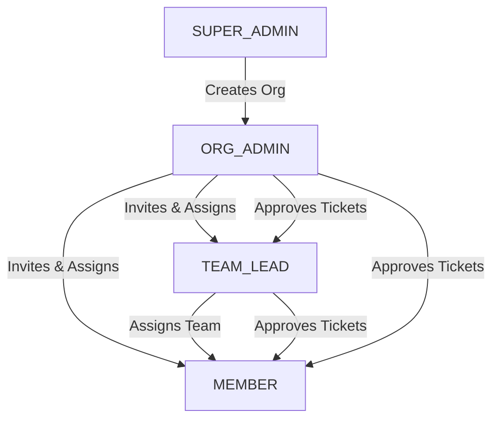
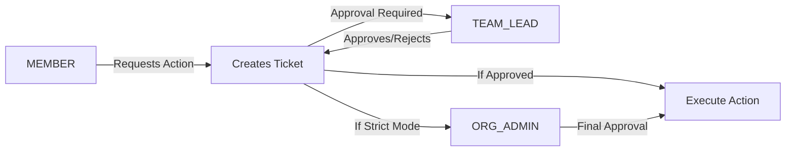

# RBAC Permissions Matrix
**Last Updated:** 2026-01-16

## Current Role Hierarchy & Permissions

### Role Definitions

| Role | Scope | Reports To | Can Be Assigned By | Description |
|:-----|:------|:-----------|:-------------------|:------------|
| **SUPER_ADMIN** | Platform | N/A | System | Platform administrator with global access across all organizations. |
| **ORG_ADMIN** | Organization | N/A (Organization Owner) | System (Signup), SUPER_ADMIN | **Default Signup Role**. Organization owner with full administrative rights within their org. |
| **CLIENT** | Organization | N/A | N/A | **Legacy Alias** for ORG_ADMIN. Functionally identical to ORG_ADMIN. |
| **TEAM_LEAD** | Team | ORG_ADMIN | ORG_ADMIN | Team manager with authority over team members and team-level approvals. |
| **MEMBER** | Individual | TEAM_LEAD | ORG_ADMIN, TEAM_LEAD | Standard user with limited permissions, requires approvals for sensitive actions. |

---

## Current Access Control Matrix

| Feature/Action | SUPER_ADMIN | ORG_ADMIN/CLIENT | TEAM_LEAD | MEMBER | Notes |
|:---------------|:------------|:-----------------|:----------|:-------|:------|
| **User Management** |
| View all platform users | ✅ | ❌ | ❌ | ❌ | SUPER_ADMIN only |
| View organization members | ✅ | ✅ | ✅ (Team only) | ❌ | TEAM_LEAD sees team members |
| Invite users to organization | ✅ | ✅ | ❌ | ❌ | Creates with PENDING_INVITE status |
| Assign ORG_ADMIN role | ✅ | ❌ | ❌ | ❌ | SUPER_ADMIN only |
| Assign TEAM_LEAD role | ✅ | ✅ | ❌ | ❌ | |
| Assign MEMBER role | ✅ | ✅ | ✅ | ❌ | |
| Update user roles | ✅ | ✅ (within org) | ❌ | ❌ | Cannot elevate to ORG_ADMIN |
| Remove users | ✅ | ✅ (within org) | ✅ (team only) | ❌ | |
| **Organization Management** |
| Create organizations | ✅ | ❌ | ❌ | ❌ | SUPER_ADMIN only |
| View organization list | ✅ | ❌ | ❌ | ❌ | SUPER_ADMIN dashboard |
| Suspend/Activate organizations | ✅ | ❌ | ❌ | ❌ | Toggle org status |
| Configure org governance | ✅ | ✅ | ❌ | ❌ | Approval rules, strict mode |
| View organization details | ✅ | ✅ (own org) | ❌ | ❌ | |
| **Team Management** |
| Create teams | ✅ | ✅ | ❌ | ❌ | |
| Configure team governance | ✅ | ✅ | ✅ (own team) | ❌ | Action-specific approval rules |
| View team details | ✅ | ✅ | ✅ (own team) | ❌ | |
| Assign users to teams | ✅ | ✅ | ❌ | ❌ | |
| **AWS Account Management** |
| Connect AWS account (direct) | ✅ | ✅ | ✅ | ❌ | MEMBER requires approval |
| View dashboard "Connect AWS" card | ❌ | ✅ | ✅ | ❌ | Only when accounts.length === 0 |
| Request account connection (approval) | ❌ | ❌ | ❌ | ✅ | Creates ACCOUNT_CONNECTION ticket |
| List AWS accounts | ✅ | ✅ (org accounts) | ✅ (org accounts) | ✅ (org accounts) | |
| Disconnect AWS accounts | ✅ | ✅ | ❌ | ❌ | Requires FULL access |
| Validate account credentials | ✅ | ✅ | ✅ | ❌ | Requires EXECUTION access |
| **Cluster Management** |
| Discover clusters | ✅ | ✅ | ✅ | ✅ | |
| Register new clusters | ✅ | ✅ | ✅ | ❌ | Requires EXECUTION access |
| View cluster details | ✅ | ✅ | ✅ | ✅ | |
| Install agent | ✅ | ✅ | ✅ | ❌ | Requires EXECUTION access |
| **Cleanup/Cost Optimization** |
| Scan resources | ✅ | ✅ | ✅ | ✅ | |
| Execute cleanup actions | ✅ | ✅ | ✅ | ❌ (needs approval) | MEMBER requires JIT ticket |
| Authorize resources (exclude from cleanup) | ✅ | ✅ | ✅ | ❌ | |
| View authorized resources | ✅ | ✅ | ✅ | ✅ | |
| **JIT Governance (Tickets)** |
| Create ACCESS_WINDOW request | ❌ | ❌ | ❌ | ✅ | Member requests time-limited access |
| Create ACTION request | ❌ | ❌ | ❌ | ✅ | Member requests specific action |
| Grant delegated access | ✅ | ✅ | ✅ | ❌ | Admin/Lead grants access to others |
| Approve tickets | ✅ | ✅ | ✅ (team members) | ❌ | TEAM_LEAD can approve team tickets |
| Revoke active tickets | ✅ | ✅ | ✅ (granted by self) | ❌ | Can revoke their own grants |
| View all org tickets | ✅ | ✅ | ❌ | ❌ | TEAM_LEAD sees team tickets only |
| View own tickets | ✅ | ✅ | ✅ | ✅ | Everyone sees their requests |
| **Templates & Policies** |
| Create node templates | ✅ | ✅ | ✅ | ❌ | Requires EXECUTION access |
| Set default templates | ✅ | ✅ | ❌ | ❌ | Requires FULL access |
| Create cluster policies | ✅ | ✅ | ✅ | ❌ | Requires EXECUTION access |
| Update policies | ✅ | ✅ | ✅ | ❌ | Requires EXECUTION access |
| **Audit & Compliance** |
| View audit logs | ✅ | ✅ (org only) | ✅ (team only) | ❌ | Role-based filtering |
| View platform stats | ✅ | ❌ | ❌ | ❌ | MRR, platform-wide metrics |
| View organization stats | ✅ | ✅ (own org) | ❌ | ❌ | |
| **Settings & Configuration** |
| Access Settings page | ✅ | ✅ | ✅ | ✅ | All roles |
| Configure cloud integrations | ✅ | ✅ | ✅ | ❌ (view only) | MEMBER can view, not modify |
| Manage billing | ✅ | ✅ | ❌ | ❌ | Stripe portal access |

---

## Access Level System

In addition to roles, the system uses an Access Level hierarchy for fine-grained control:

| Access Level | Included Permissions | Granted To |
|:-------------|:-------------------|:-----------|
| **READ_ONLY** | View resources, dashboards, reports | All roles (base level) |
| **EXECUTION** | READ_ONLY + Execute cleanup actions, create templates/policies, register clusters | TEAM_LEAD, ORG_ADMIN, SUPER_ADMIN |
| **FULL** | EXECUTION + Delete accounts, set defaults, critical config changes | ORG_ADMIN, SUPER_ADMIN |

---

## Future Enhancement Opportunities

### Proposed New Features & Applicable Roles

| Feature | Applicable Roles | Description | Priority | Implementation Notes |
|:--------|:----------------|:------------|:---------|:---------------------|
| **Role-Based Dashboard Customization** | All | Custom dashboard layouts per role showing only relevant metrics | High | Save user preferences in database |
| **MEMBER Self-Service Account Requests** | MEMBER | ✅ **IMPLEMENTED (2026-01-16)**: MEMBER can request AWS account connection via ACCOUNT_CONNECTION tickets | Completed | Backend complete, frontend partial |
| **Granular Team Permissions** | TEAM_LEAD | Allow TEAM_LEAD to configure custom permissions for team members (e.g., read-only access to sensitive clusters) | Medium | New `team_member_permissions` JSON column |
| **Multi-Factor Authentication (MFA)** | All | Enforce MFA for SUPER_ADMIN, optional for others | High | Integrate TOTP (e.g., PyOTP) |
| **API Key Management** | ORG_ADMIN, TEAM_LEAD | Generate API keys for programmatic access with scoped permissions | Medium | Extend existing APIKey model |
| **Audit Log Export** | SUPER_ADMIN, ORG_ADMIN | Export audit logs to CSV/JSON for compliance reporting | Medium | Add export endpoint to AuditService |
| **Resource Tagging Policies** | ORG_ADMIN | Define mandatory tags for resources, enforce compliance | High | Extend governance_config |
| **Budget Alerts** | ORG_ADMIN, TEAM_LEAD | Set cost thresholds and receive alerts | High | CloudWatch integration + notification service |
| **Scheduled Reports** | ORG_ADMIN, TEAM_LEAD | Automated weekly/monthly cost/usage reports via email | Medium | Celery Beat task + email templates |
| **Read-Only Observer Role** | New Role | View-only access for stakeholders (e.g., finance team) | Low | Add OBSERVER to UserRole enum |
| **Cross-Organization Billing** | SUPER_ADMIN | Manage billing across multiple orgs under one parent | Low | Complex, requires billing hierarchy |
| **Custom Approval Workflows** | ORG_ADMIN | Define multi-stage approval chains (e.g., MEMBER → TEAM_LEAD → ORG_ADMIN) | Medium | Enhance Ticket model with workflow states |
| **Cluster Sharing** | TEAM_LEAD | Share cluster access with other teams (with approval) | Low | New ClusterShare model |
| **Real-Time Notifications** | All | WebSocket notifications for ticket approvals, alerts, etc. | Medium | Socket.io integration |
| **Role Expiration** | ORG_ADMIN | Temporary role elevations (e.g., MEMBER → TEAM_LEAD for 24h) | Low | Add expires_at to user_roles |

---

## Permission Delegation Flow

### Current Implementation

### Approval Flow for MEMBER Actions

---

## Security Best Practices

1. **Principle of Least Privilege**: Users start as MEMBER, elevated only when necessary
2. **Approval Gating**: Sensitive actions (cleanup, account connection) require explicit approval
3. **Audit Trail**: All actions logged with actor, timestamp, and outcome
4. **Role Segregation**: SUPER_ADMIN cannot be assigned by anyone except system
5. **Organization Isolation**: Users can only access resources within their organization
6. **Credential Encryption**: AWS credentials temporarily cached are encrypted (Fernet)
7. **Token Expiration**: JIT access windows expire automatically after duration_hours

---

## Migration Notes

- Legacy `CLIENT` role is aliased to `ORG_ADMIN` for backward compatibility
- Existing users without explicit roles default to `MEMBER`
- Team assignments are optional; users without teams report directly to ORG_ADMIN
