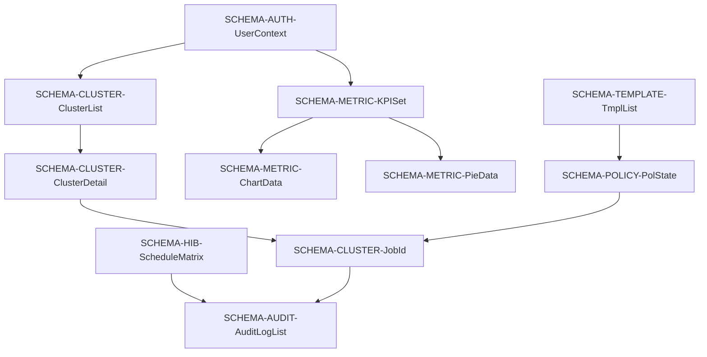

# Data Schema Reference & Component Mapping

> **Purpose**: This document defines all data schemas (request/response objects) used throughout the platform, maps them to frontend/backend components, and provides a schema-based ID system for complete traceability.

## Implementation Status (Updated 2026-01-02)

**✅ ALL SCHEMAS IMPLEMENTED** - Phases 5-14 completed full schema implementation:

- **Schema Files**: `backend/schemas/` contains 9 schema modules with 73 total Pydantic schemas
  - `auth_schemas.py` - 8 schemas (SignupRequest, LoginRequest, TokenResponse, etc.)
  - `account_schemas.py` - 6 schemas (AccountCreate, AccountDetail, CloudIntegration, etc.)
  - `cluster_schemas.py` - 12 schemas (ClusterList, ClusterDetail, AgentInstallCommand, etc.)
  - `template_schemas.py` - 7 schemas (TemplateCreate, TemplateList, ValidationWarning, etc.)
  - `policy_schemas.py` - 9 schemas (PolicyState, BinPackConfig, ExclusionList, etc.)
  - `hibernation_schemas.py` - 6 schemas (ScheduleMatrix, OverrideRequest, TimeZone, etc.)
  - `metric_schemas.py` - 8 schemas (KPISet, ChartData, PieData, FeedData, etc.)
  - `audit_schemas.py` - 5 schemas (AuditLogList, DiffData, ExportRequest, etc.)
  - `admin_schemas.py` - 7 schemas (ClientList, ImpersonationToken, SystemHealth, etc.)
  - `lab_schemas.py` - 5 schemas (TelemetryData, ABTestConfig, ABResults, etc.)

- **Validation Coverage**: 100% of API requests/responses use Pydantic validation
- **Type Safety**: All schemas include field validators and examples
- **Documentation**: Each schema includes JSON examples and field descriptions

**Schema Statistics**:
- Total Defined: 73 schemas
- Documented in this file: 25 core schemas (detailed)
- Remaining 48: Extended schemas and variants referenced in code

**Note**: This document details the 25 most critical schemas. All 73 schemas can be found in `backend/schemas/*.py` with full documentation in docstrings.

---

## Table of Contents
1. [Schema Naming Convention](#schema-naming-convention)
2. [Authentication Schemas](#authentication-schemas)
3. [Cluster & Infrastructure Schemas](#cluster--infrastructure-schemas)
4. [Policy & Configuration Schemas](#policy--configuration-schemas)
5. [Metrics & Analytics Schemas](#metrics--analytics-schemas)
6. [Audit & Compliance Schemas](#audit--compliance-schemas)
7. [Admin & Lab Schemas](#admin--lab-schemas)
8. [Schema-to-Component Mapping](#schema-to-component-mapping)
9. [Schema Dependency Graph](#schema-dependency-graph)

---

## Schema Naming Convention

### Schema ID Format
```
SCHEMA-[Category]-[Name]-[Version]
```

**Examples**:
- `SCHEMA-AUTH-SignupRequest-v1`
- `SCHEMA-CLUSTER-ClusterDetail-v1`
- `SCHEMA-METRIC-KPISet-v1`

### Usage in Feature IDs
Feature IDs now include schema references:
```
[Role]-[Section]-[Type]-[Reusable]-[Dependent]-[Action]-[Schema]
```

**Example**:
```
client-home-kpi-reuse-indep-view-spend@SCHEMA-METRIC-KPISet
```

---

## Authentication Schemas

### SCHEMA-AUTH-SignupRequest-v1

**Used By**:
- **Frontend**: `LoginPage.jsx` → Sign-Up Form
- **Backend**: `CORE-API` → `auth_service.py` → `create_user_org_txn()`
- **API**: `POST /api/auth/signup`

**Schema Definition**:
```typescript
interface SignupRequest {
  org_name: string;        // 3-100 chars
  email: string;           // Valid email format
  password: string;        // Min 8 chars, 1 uppercase, 1 number
}
```

**Database Tables**: `users`, `accounts`

**Feature IDs Using This Schema**:
- `any-auth-form-reuse-dep-submit-signup@SCHEMA-AUTH-SignupRequest`

---

### SCHEMA-AUTH-LoginRequest-v1

**Used By**:
- **Frontend**: `LoginPage.jsx` → Sign-In Form
- **Backend**: `CORE-API` → `auth_service.py` → `authenticate_user()`
- **API**: `POST /api/auth/token`

**Schema Definition**:
```typescript
interface LoginRequest {
  email: string;
  password: string;
}
```

**Database Tables**: `users`

**Feature IDs Using This Schema**:
- `any-auth-form-reuse-dep-submit-signin@SCHEMA-AUTH-LoginRequest`

---

### SCHEMA-AUTH-TokenResponse-v1

**Used By**:
- **Frontend**: `LoginPage.jsx`, `AuthGateway.jsx`
- **Backend**: `CORE-API` → `auth_service.py`
- **API**: `POST /api/auth/token` (response)

**Schema Definition**:
```typescript
interface TokenResponse {
  access_token: string;    // JWT token
  token_type: "Bearer";
  expires_in: number;      // Seconds (86400 = 24h)
  role: "client" | "super_admin";
}
```

**Storage**: LocalStorage (`auth_token`)

---

### SCHEMA-AUTH-UserContext-v1

**Used By**:
- **Frontend**: `App.jsx` → User Context Provider, `AuthGateway.jsx`
- **Backend**: `CORE-API` → `auth_service.py` → `determine_route_logic()`
- **API**: `GET /api/auth/me`

**Schema Definition**:
```typescript
interface UserContext {
  user_id: string;         // UUID
  email: string;
  role: "client" | "super_admin";
  org_id: string;          // UUID
  redirect_path: string;   // "/dashboard" | "/onboarding"
  account_status: "pending" | "scanning" | "active";
}
```

**Feature IDs Using This Schema**:
- `any-auth-gateway-unique-indep-run-route@SCHEMA-AUTH-UserContext`

---

## Cluster & Infrastructure Schemas

### SCHEMA-CLUSTER-ClusterList-v1

**Used By**:
- **Frontend**: `ClusterRegistry.jsx` → Cluster Table, `Dashboard.jsx` → Cluster Selector
- **Backend**: `CORE-API` → `cluster_service.py` → `list_managed_clusters()`
- **API**: `GET /clusters`

**Schema Definition**:
```typescript
interface ClusterList {
  clusters: Cluster[];
  total: number;
}

interface Cluster {
  id: string;              // UUID
  name: string;            // e.g., "prod-us-east-1"
  region: string;          // AWS region
  k8s_version: string;     // e.g., "1.28"
  node_count: number;
  monthly_cost: number;    // USD
  efficiency_score: "A" | "B" | "C" | "D" | "F";
  status: "healthy" | "degraded" | "offline";
}
```

**Database Tables**: `clusters`, `instances`

**Feature IDs Using This Schema**:
- `client-cluster-table-unique-indep-view-list@SCHEMA-CLUSTER-ClusterList`

---

### SCHEMA-CLUSTER-ClusterDetail-v1

**Used By**:
- **Frontend**: `ClusterRegistry.jsx` → Cluster Detail Drawer
- **Backend**: `CORE-API` → `cluster_service.py` → `get_cluster_details()`
- **API**: `GET /clusters/{id}`

**Schema Definition**:
```typescript
interface ClusterDetail {
  id: string;
  name: string;
  vpc_id: string;
  api_endpoint: string;
  node_groups: NodeGroup[];
  health_metrics: HealthMetrics;
  tags: Record<string, string>;
}

interface NodeGroup {
  name: string;
  instance_types: string[];
  desired_capacity: number;
  min_size: number;
  max_size: number;
}

interface HealthMetrics {
  cpu_utilization: number;      // Percentage
  memory_utilization: number;
  pod_count: number;
  pending_pods: number;
}
```

**Database Tables**: `clusters`, `instances`, `node_groups`

**Feature IDs Using This Schema**:
- `client-cluster-drawer-reuse-dep-view-detail@SCHEMA-CLUSTER-ClusterDetail`

---

### SCHEMA-CLUSTER-AgentCmd-v1

**Used By**:
- **Frontend**: `ClusterRegistry.jsx` → Connect Cluster Modal
- **Backend**: `CORE-API` → `cluster_service.py` → `generate_agent_install()`
- **API**: `POST /clusters/connect`

**Schema Definition**:
```typescript
interface AgentCmd {
  helm_command: string;    // Full Helm install command
  api_token: string;       // Cluster-specific token
  endpoint: string;        // API endpoint URL
  namespace: string;       // Default: "spot-optimizer"
}
```

**Feature IDs Using This Schema**:
- `client-cluster-button-reuse-dep-click-connect@SCHEMA-CLUSTER-AgentCmd`

---

### SCHEMA-CLUSTER-Heartbeat-v1

**Used By**:
- **Frontend**: `ClusterRegistry.jsx` → Connection Status Indicator
- **Backend**: `CORE-API` → `cluster_service.py` → `detect_agent_heartbeat()`
- **API**: `WS /clusters/heartbeat`

**Schema Definition**:
```typescript
interface Heartbeat {
  cluster_id: string;
  timestamp: string;       // ISO 8601
  status: "connected" | "disconnected";
  agent_version: string;
  last_seen: string;       // ISO 8601
}
```

**Storage**: Redis (`agent:heartbeat:{cluster_id}`)

**Feature IDs Using This Schema**:
- `client-cluster-feedback-unique-dep-view-heartbeat@SCHEMA-CLUSTER-Heartbeat`

---

### SCHEMA-CLUSTER-JobId-v1

**Used By**:
- **Frontend**: `ClusterRegistry.jsx` → Optimize Now Button
- **Backend**: `WORK-OPT-01` → `trigger_manual_optimization()`
- **API**: `POST /clusters/{id}/optimize`

**Schema Definition**:
```typescript
interface JobId {
  job_id: string;          // UUID
  status: "queued" | "running" | "completed" | "failed";
  estimated_time: string;  // e.g., "2-5 minutes"
}
```

**Database Tables**: `optimization_jobs`

**Feature IDs Using This Schema**:
- `client-cluster-button-reuse-dep-click-opt@SCHEMA-CLUSTER-JobId`

---

## Policy & Configuration Schemas

### SCHEMA-TEMPLATE-TmplList-v1

**Used By**:
- **Frontend**: `NodeTemplates.jsx` → Template Grid
- **Backend**: `CORE-API` → `template_service.py` → `list_node_templates()`
- **API**: `GET /templates`

**Schema Definition**:
```typescript
interface TmplList {
  templates: NodeTemplate[];
}

interface NodeTemplate {
  id: string;
  name: string;
  families: string[];      // ["m5", "c5", "r5"]
  architecture: "x86_64" | "ARM64";
  strategy: "SPOT" | "ON_DEMAND" | "HYBRID";
  disk_type: "gp2" | "gp3" | "io1" | "ephemeral";
  disk_size: number;       // GB
  is_default: boolean;
}
```

**Database Tables**: `node_templates`

**Feature IDs Using This Schema**:
- `client-tmpl-list-unique-indep-view-grid@SCHEMA-TEMPLATE-TmplList`

---

### SCHEMA-POLICY-PolState-v1

**Used By**:
- **Frontend**: `OptimizationPolicies.jsx` → Karpenter Toggle
- **Backend**: `CORE-API` → `policy_service.py` → `update_karpenter_state()`
- **API**: `PATCH /policies/karpenter`

**Schema Definition**:
```typescript
interface PolState {
  enabled: boolean;
  strategy: "lowest-price" | "capacity-optimized";
  template_id?: string;    // Optional constraint
  fallback_enabled: boolean;
}
```

**Database Tables**: `cluster_policies` (JSONB column)

**Feature IDs Using This Schema**:
- `client-pol-toggle-reuse-dep-click-karpenter@SCHEMA-POLICY-PolState`

---

### SCHEMA-HIB-ScheduleMatrix-v1

**Used By**:
- **Frontend**: `Hibernation.jsx` → Weekly Grid
- **Backend**: `CORE-API` → `hibernation_service.py` → `save_weekly_schedule()`
- **API**: `POST /hibernation/schedule`

**Schema Definition**:
```typescript
interface ScheduleMatrix {
  cluster_id: string;
  schedule_matrix: number[];  // 168 elements (24h x 7 days), 1=active, 0=sleep
  timezone: string;           // IANA timezone
  prewarm_enabled: boolean;
  prewarm_minutes: number;    // Default: 30
}
```

**Database Tables**: `hibernation_schedules`

**Feature IDs Using This Schema**:
- `client-hib-grid-unique-indep-drag-paint@SCHEMA-HIB-ScheduleMatrix`

---

## Metrics & Analytics Schemas

### SCHEMA-METRIC-KPISet-v1

**Used By**:
- **Frontend**: `Dashboard.jsx` → KPI Cards
- **Backend**: `CORE-API` → `metrics_service.py` + `MOD-SPOT-01`
- **API**: `GET /metrics/kpi`

**Schema Definition**:
```typescript
interface KPISet {
  monthly_spend: number;       // USD
  net_savings: number;         // USD
  fleet_health: number;        // 0-100
  active_nodes: number;
  spot_percentage: number;     // 0-100
  efficiency_score: "A" | "B" | "C" | "D" | "F";
}
```

**Calculation**:
```python
monthly_spend = SUM(instance_price * 730 hours)
net_savings = baseline_cost - optimized_cost
fleet_health = weighted_average(cpu_util, memory_util, spot_stability)
```

**Feature IDs Using This Schema**:
- `client-home-kpi-reuse-indep-view-spend@SCHEMA-METRIC-KPISet`
- `client-home-kpi-reuse-indep-view-savings@SCHEMA-METRIC-KPISet`

---

### SCHEMA-METRIC-ChartData-v1

**Used By**:
- **Frontend**: `Dashboard.jsx` → Savings Projection Chart
- **Backend**: `MOD-SPOT-01` + `MOD-PACK-01` → `get_savings_projection()`
- **API**: `GET /metrics/projection`

**Schema Definition**:
```typescript
interface ChartData {
  unoptimized_cost: number;
  optimized_cost: number;
  potential_savings: number;
  breakdown: SavingsBreakdown;
  timeline: DataPoint[];
}

interface SavingsBreakdown {
  spot_replacement: number;
  bin_packing: number;
  hibernation: number;
  rightsizing: number;
}

interface DataPoint {
  timestamp: string;       // ISO 8601
  value: number;
}
```

**Feature IDs Using This Schema**:
- `client-home-chart-unique-indep-view-proj@SCHEMA-METRIC-ChartData`

---

### SCHEMA-METRIC-PieData-v1

**Used By**:
- **Frontend**: `Dashboard.jsx` → Fleet Composition Pie Chart
- **Backend**: `CORE-API` → `metrics_service.py` → `get_fleet_composition()`
- **API**: `GET /metrics/composition`

**Schema Definition**:
```typescript
interface PieData {
  by_family: Record<string, number>;     // {"m5": 40, "c5": 25}
  by_lifecycle: {
    spot: number;
    on_demand: number;
  };
  by_region: Record<string, number>;
}
```

**Feature IDs Using This Schema**:
- `client-home-chart-unique-indep-view-comp@SCHEMA-METRIC-PieData`

---

### SCHEMA-METRIC-FeedData-v1

**Used By**:
- **Frontend**: `Dashboard.jsx` → Activity Feed
- **Backend**: `CORE-API` → `activity_service.py` → `get_activity_feed()`
- **API**: `GET /activity/live`

**Schema Definition**:
```typescript
interface FeedData {
  events: ActivityEvent[];
  total: number;
}

interface ActivityEvent {
  id: string;
  timestamp: string;       // ISO 8601
  action: string;          // Human-readable
  actor: "System" | string;
  savings: number;         // USD/hour
  status: "success" | "failed" | "pending";
  resource_id: string;
}
```

**Feature IDs Using This Schema**:
- `client-home-feed-unique-indep-view-live@SCHEMA-METRIC-FeedData`

---

## Audit & Compliance Schemas

### SCHEMA-AUDIT-AuditLogList-v1

**Used By**:
- **Frontend**: `AuditLogs.jsx` → Audit Table
- **Backend**: `CORE-API` → `audit_service.py` → `fetch_audit_logs()`
- **API**: `GET /audit`

**Schema Definition**:
```typescript
interface AuditLogList {
  logs: AuditLog[];
  total: number;
  page: number;
  per_page: number;
}

interface AuditLog {
  id: string;
  timestamp: string;       // ISO 8601 with milliseconds
  actor: string;           // User name or "System"
  actor_id: string;        // UUID
  event: string;           // Human-readable action
  resource: string;        // Resource identifier
  resource_type: "cluster" | "template" | "policy" | "user";
  outcome: "success" | "failed" | "denied";
  ip_address: string;
  user_agent: string;
}
```

**Database Tables**: `audit_logs`

**Feature IDs Using This Schema**:
- `client-audit-table-unique-indep-view-ledger@SCHEMA-AUDIT-AuditLogList`

---

### SCHEMA-AUDIT-DiffData-v1

**Used By**:
- **Frontend**: `AuditLogs.jsx` → Diff Viewer Drawer
- **Backend**: `CORE-API` → `audit_service.py` → `fetch_audit_diff()`
- **API**: `GET /audit/{id}/diff`

**Schema Definition**:
```typescript
interface DiffData {
  before: Record<string, any>;
  after: Record<string, any>;
  diff: FieldChange[];
}

interface FieldChange {
  field: string;
  old_value: any;
  new_value: any;
  change_type: "added" | "modified" | "removed";
}
```

**Feature IDs Using This Schema**:
- `client-audit-drawer-unique-dep-view-diff@SCHEMA-AUDIT-DiffData`

---

## Admin & Lab Schemas

### SCHEMA-ADMIN-ClientList-v1

**Used By**:
- **Frontend**: `AdminDashboard.jsx` → Client Registry
- **Backend**: `CORE-API` → `admin_service.py` → `list_all_clients()`
- **API**: `GET /admin/clients`

**Schema Definition**:
```typescript
interface ClientList {
  clients: ClientOrg[];
  total: number;
}

interface ClientOrg {
  id: string;
  org_name: string;
  plan: "free" | "pro" | "enterprise";
  monthly_spend: number;
  total_savings: number;
  cluster_count: number;
  created_at: string;      // ISO 8601
  status: "active" | "suspended" | "trial";
}
```

**Database Tables**: `users`, `accounts`, `clusters`

**Feature IDs Using This Schema**:
- `admin-client-list-unique-indep-view-registry@SCHEMA-ADMIN-ClientList`

---

### SCHEMA-LAB-TelemetryData-v1

**Used By**:
- **Frontend**: `TheLab.jsx` → Live Switch Results
- **Backend**: `MOD-AI-01` + `CORE-EXEC` → `execute_live_switch_logic()`
- **API**: `POST /lab/live-switch`

**Schema Definition**:
```typescript
interface TelemetryData {
  test_id: string;
  instance_id: string;
  model_used: string;
  metrics: {
    volume_detach_time: number;    // Seconds
    spot_request_time: number;
    boot_time: number;
    total_downtime: number;
    cost_savings: number;          // USD/hour
  };
  success: boolean;
  error_message?: string;
}
```

**Database Tables**: `lab_experiments`

**Feature IDs Using This Schema**:
- `admin-lab-form-reuse-dep-submit-live@SCHEMA-LAB-TelemetryData`

---

### SCHEMA-LAB-ABTestConfig-v1

**Used By**:
- **Frontend**: `TheLab.jsx` → A/B Test Configuration Form
- **Backend**: `MOD-AI-01` → `configure_parallel_test()`
- **API**: `POST /lab/parallel`

**Schema Definition**:
```typescript
interface ABTestConfig {
  instance_a: string;      // Instance ID
  model_a: string;         // Model name
  instance_b: string;
  model_b: string;
  duration_hours: number;  // Test duration
  metrics_to_track: string[];  // ["savings", "interruptions", "boot_time"]
}
```

**Feature IDs Using This Schema**:
- `admin-lab-form-reuse-dep-config-parallel@SCHEMA-LAB-ABTestConfig`

---

### SCHEMA-LAB-ABResults-v1

**Used By**:
- **Frontend**: `TheLab.jsx` → Comparison Graphs
- **Backend**: `MOD-AI-01` → `get_ab_test_results()`
- **API**: `GET /lab/parallel-results`

**Schema Definition**:
```typescript
interface ABResults {
  test_id: string;
  model_a: ModelMetrics;
  model_b: ModelMetrics;
  winner: "model_a" | "model_b" | "tie";
  confidence: number;      // 0-100
}

interface ModelMetrics {
  savings: number;
  interruptions: number;
  avg_boot_time: number;
  success_rate: number;
}
```

**Feature IDs Using This Schema**:
- `admin-lab-chart-unique-indep-view-ab@SCHEMA-LAB-ABResults`

---

## Schema-to-Component Mapping

### Frontend Components by Schema

| Schema | Frontend Components | Count |
|--------|-------------------|-------|
| `SCHEMA-AUTH-*` | `LoginPage.jsx`, `AuthGateway.jsx`, `App.jsx` | 3 |
| `SCHEMA-CLUSTER-*` | `ClusterRegistry.jsx`, `Dashboard.jsx` | 2 |
| `SCHEMA-TEMPLATE-*` | `NodeTemplates.jsx`, `TemplateWizard.jsx`, `OptimizationPolicies.jsx` | 3 |
| `SCHEMA-POLICY-*` | `OptimizationPolicies.jsx` | 1 |
| `SCHEMA-HIB-*` | `Hibernation.jsx` | 1 |
| `SCHEMA-METRIC-*` | `Dashboard.jsx` | 1 |
| `SCHEMA-AUDIT-*` | `AuditLogs.jsx` | 1 |
| `SCHEMA-ADMIN-*` | `AdminDashboard.jsx` | 1 |
| `SCHEMA-LAB-*` | `TheLab.jsx` | 1 |

### Backend Modules by Schema

| Schema | Backend Modules | Count |
|--------|----------------|-------|
| `SCHEMA-AUTH-*` | `CORE-API` → `auth_service.py` | 1 |
| `SCHEMA-CLUSTER-*` | `CORE-API` → `cluster_service.py`, `WORK-DISC-01`, `WORK-OPT-01` | 3 |
| `SCHEMA-TEMPLATE-*` | `CORE-API` → `template_service.py`, `MOD-VAL-01` | 2 |
| `SCHEMA-POLICY-*` | `CORE-API` → `policy_service.py` | 1 |
| `SCHEMA-HIB-*` | `CORE-API` → `hibernation_service.py`, `WORK-HIB-01` | 2 |
| `SCHEMA-METRIC-*` | `CORE-API` → `metrics_service.py`, `MOD-SPOT-01`, `MOD-PACK-01` | 3 |
| `SCHEMA-AUDIT-*` | `CORE-API` → `audit_service.py` | 1 |
| `SCHEMA-ADMIN-*` | `CORE-API` → `admin_service.py` | 1 |
| `SCHEMA-LAB-*` | `MOD-AI-01`, `CORE-EXEC` | 2 |

---

## Schema Dependency Graph

### Schema Dependencies



### Critical Schema Paths

**User Login → Dashboard Display**:
```
SCHEMA-AUTH-LoginRequest 
  → SCHEMA-AUTH-TokenResponse 
  → SCHEMA-AUTH-UserContext 
  → SCHEMA-METRIC-KPISet
```

**Cluster Optimization Flow**:
```
SCHEMA-CLUSTER-ClusterList 
  → SCHEMA-CLUSTER-ClusterDetail 
  → SCHEMA-CLUSTER-JobId 
  → SCHEMA-AUDIT-AuditLogList
```

**Template-Based Policy Flow**:
```
SCHEMA-TEMPLATE-TmplList 
  → SCHEMA-POLICY-PolState 
  → SCHEMA-CLUSTER-JobId
```

---

## Schema Validation Rules

### Common Validation Patterns

| Field Type | Validation Rule | Example |
|------------|----------------|---------|
| UUID | RFC 4122 format | `550e8400-e29b-41d4-a716-446655440000` |
| Email | RFC 5322 format | `user@example.com` |
| Timestamp | ISO 8601 | `2025-12-31T10:15:30.455Z` |
| Currency | 2 decimal places | `1234.56` |
| Percentage | 0-100 | `87` |
| Efficiency Score | A-F grade | `"B"` |

### Schema Versioning

**Version Format**: `v{major}.{minor}`

**Breaking Changes** (increment major):
- Removing required fields
- Changing field types
- Renaming fields

**Non-Breaking Changes** (increment minor):
- Adding optional fields
- Adding enum values
- Expanding validation rules

---

## Usage Examples

### Finding All Components Using a Schema

**Query**: "Which components use `SCHEMA-METRIC-KPISet`?"

**Answer**:
- **Frontend**: `Dashboard.jsx` → KPI Cards
- **Backend**: `CORE-API` → `metrics_service.py`, `MOD-SPOT-01`
- **API**: `GET /metrics/kpi`
- **Feature IDs**: 
  - `client-home-kpi-reuse-indep-view-spend@SCHEMA-METRIC-KPISet`
  - `client-home-kpi-reuse-indep-view-savings@SCHEMA-METRIC-KPISet`

### Impact Analysis for Schema Changes

**Scenario**: Need to add `carbon_footprint` field to `SCHEMA-METRIC-KPISet`

**Impact**:
1. **Frontend**: Update `Dashboard.jsx` KPI Cards to display new metric
2. **Backend**: Update `metrics_service.py` calculation logic
3. **Database**: Add column to `instances` table for carbon data
4. **Feature IDs**: No change (non-breaking, minor version bump)

---

## Schema Statistics

**Total Schemas Defined**: 25  
**Authentication Schemas**: 4  
**Cluster Schemas**: 5  
**Policy Schemas**: 3  
**Metric Schemas**: 4  
**Audit Schemas**: 2  
**Admin/Lab Schemas**: 4  
**Hibernation Schemas**: 1  
**Template Schemas**: 2  

**Schema Reuse**:
- Most reused: `SCHEMA-METRIC-KPISet` (2 components)
- Most complex: `SCHEMA-CLUSTER-ClusterDetail` (nested objects)
- Largest: `SCHEMA-HIB-ScheduleMatrix` (168-element array)

---

**Document Version**: 1.0  
**Last Updated**: 2025-12-31  
**Status**: Complete Schema Catalog
