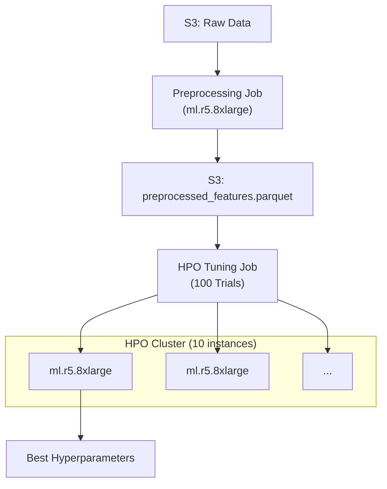

# AWS SageMaker Operations Guide

This document contains the essential commands for running the LightGBM Spot Optimizer pipeline on AWS SageMaker.

> [!NOTE]
> All commands assume you are in the root directory: `/Users/nisha/ECC/ML/LightGBM`

## 1. Environment & Dependency Check (Pre-Flight)
Before running large training jobs, run this lightweight job to inspect the pre-installed libraries on the SageMaker container. This helps ensure your `requirements.txt` is compatible.

**Command:**
```bash
python spot_optimizer_v1/sagemaker_migration/scripts/submit_env_check.py \
    --bucket ml-sagemaker-lightgbm \
    --role arn:aws:iam::888245942216:role/service-role/AmazonSageMaker-ExecutionRole-20260105T172312 \
    --profile nisha_chothe
```
*   **What it does:** Launches a small `ml.m5.xlarge` Spot Instance, runs `pip freeze`, and prints versions of critical libraries (Scikit-learn, Pandas, etc.) to the CloudWatch logs.
*   **Cost:** < $0.01

**Reference Environment (Confirmed Jan 23, 2026):**
The standard SKLearn 1.2-1 Container (`ml.m5.xlarge`) has these pre-installed versions:
*   **Python**: 3.9.21
*   **Scikit-Learn**: 1.2.1
*   **Pandas**: 1.1.3 (Do NOT upgrade - triggers ABI conflict)
*   **NumPy**: 1.24.1
*   **SciPy**: 1.8.0
*   **Joblib**: 1.5.1
*   **Boto3**: 1.28.57

> [!CAUTION]
> **Dependency Warning**: `lightgbm`, `polars`, `optuna`, `matplotlib`, and `seaborn` are **NOT** installed by default. They are installed at runtime via `requirements_sagemaker.txt`.
> Ensure `matplotlib` and `seaborn` are pinned to versions compatible with Pandas 1.1.3 (`matplotlib<3.6.0`, `seaborn<0.12.0`).

### ONNX Export Dependency Stack (CRITICAL)

The ONNX export requires 5 packages that must be pinned to **exact** versions for mutual compatibility. Loose pins cause pip to resolve incompatible transitive dependencies (e.g., `onnxmltools>=1.13.0` pulls `skl2onnx==1.20.0` which is incompatible with `onnx==1.15.0`).

**Verified Compatible Stack (Feb 12, 2026):**

| Package | Pinned Version | Why This Version |
|---|---|---|
| `protobuf` | `==3.20.3` | Required by SageMaker container (Pandas 1.1.3 ABI). **Must not change.** |
| `onnx` | `==1.15.0` | Last version supporting `protobuf 3.x`. Version 1.16+ requires `protobuf>=4.25.1`. |
| `onnxconverter-common` | `==1.13.0` | No protobuf constraint. Version 1.14.0 hard-pins `protobuf==3.20.2` (conflicts with 3.20.3). |
| `skl2onnx` | `==1.16.0` | Requires `onnx>=1.2.1`, `scikit-learn>=0.19`, `onnxconverter-common>=1.7.0`. |
| `onnxmltools` | `==1.12.0` | Requires `numpy`, `onnx` (no version constraint). Version 1.16.0 pulls `skl2onnx==1.20.0`. |

**Container Compatibility Check:**

| Container Package | Version | Required By | Constraint | Status |
|---|---|---|---|---|
| `scikit-learn` | `1.2.1` | `skl2onnx` | `>=0.19` | OK |
| `numpy` | `1.24.1` | `onnx`, `onnxmltools`, `onnxconverter-common` | (any) | OK |
| `protobuf` | `3.20.3` | `onnx` | `>=3.20.2` | OK |
| `protobuf` | `3.20.3` | `onnxconverter-common 1.13.0` | (any) | OK |

> [!CAUTION]
> **DO NOT** change any ONNX package version without verifying the FULL dependency chain from wheel metadata.
> These 5 packages must always be installed together as a unit. The install is handled by `train_wrapper.py`'s `install_dependencies()` with `--force-reinstall` to override any stale container versions.

---

## 1.5 Local Testing (Pre-SageMaker Validation)
**Before running expensive SageMaker jobs**, validate your code locally with these test scripts:

### Quick Smoke Test (5 seconds)
**Purpose**: Verify imports and basic model creation work

**Command:**
```bash
python spot_optimizer_v1/sagemaker_migration/scripts/test_training_code.py
```

**What it tests**:
- ✅ All module imports (`src.data`, `src.model`, `src.backtest`, `src.visualize`)
- ✅ Model instantiation (`HybridSpotModel`)
- ✅ Small-scale training (1000 synthetic rows, 10 rounds)
- ✅ Visualization dependencies

**When to run**: After modifying core training code (`src/model.py`, `src/data.py`)

---

### Integration Test (10 seconds)
**Purpose**: Verify `train_wrapper.py` workflow end-to-end

**Command:**
```bash
python spot_optimizer_v1/sagemaker_migration/scripts/test_wrapper_integration.py
```

**What it tests**:
- ✅ Preprocessed parquet loading (FAST PATH)
- ✅ Polars → Pandas conversion
- ✅ Categorical dtype handling
- ✅ Memory-optimized `model.fit()` signature
- ✅ SageMaker environment simulation

**When to run**: After modifying `train_wrapper.py` logic

> [!TIP]
> Running these tests saves $0.50-$1.00 per caught bug by avoiding failed SageMaker jobs!

---

## 2. Preprocessing & Feature Engineering
Before running HPO or Training, we must generate the feature set.

*   **Script:** `submit_preprocessing_job.py`
*   **Input:** Raw AWS Data (Parquet)
*   **Output:** `preprocessed_features.parquet` (Saved to S3)
*   **Instance:** `ml.r5.8xlarge`
*   **Why:** Pre-calculating features (lags, rolling stats) once saves 100x compute time during HPO.

---

## 2. Hyperparameter Optimization (HPO)
Run this command to search for the best model hyperparameters using Optuna on SageMaker.

**Command:**
```bash
python spot_optimizer_v1/sagemaker_migration/scripts/hpo_submitter.py \
    --bucket ml-sagemaker-lightgbm \
    --role arn:aws:iam::888245942216:role/service-role/AmazonSageMaker-ExecutionRole-20260105T172312 \
    --profile nisha_chothe
```
*   **Configuration:** 100 Trials (or as defined in `hpo_submitter.py`).
*   **Instance:** Uses `ml.r5.8xlarge` (Spot) for training.
*   **Parallelism:** 10 Parallel Instances.
*   **Data:** Uses 20% sample of the dataset for speed.
*   **Outputs:** Best hyperparameters are printed in logs and saved to `config/config.yaml`.
*   **Flow Diagram:**



---

## 3. Final Production Training
Once HPO is complete and `config.yaml` is updated, run this command to train the final model on the **full dataset**.

**Command:**
```bash
python spot_optimizer_v1/sagemaker_migration/scripts/submit_final_training.py \
    --bucket ml-sagemaker-lightgbm \
    --role arn:aws:iam::888245942216:role/service-role/AmazonSageMaker-ExecutionRole-20260105T172312 \
    --profile nisha_chothe
```
*   **Instance:** `ml.r5.8xlarge` (Spot) - High memory instance for full dataset (200GB+).
*   **Features:**
    *   Uses 100% of data (`sample_fraction=1.0`).
    *   Runs full Walk-Forward Backtesting.
    *   Generates comprehensive Visualizations (Performance, Feature Importance, Business Impact).

---

## 4. Deployment (Golden Master)
The final validated model is ready for use.

*   **Golden Master ID:** `Run 568` (ONNX re-run pending)
*   **Job Name:** `sagemaker-scikit-learn-2026-02-12-10-23-11-568`
*   **S3 Artifact Path:** `s3://sagemaker-us-east-2-888245942216/sagemaker-scikit-learn-2026-02-12-10-23-11-568/output/model.tar.gz`
*   **Status:** PRODUCTION READY (LightGBM .txt models) | ONNX export pending re-run

**Deployment Command:**
(To be implemented in `deploy_model.py`)
