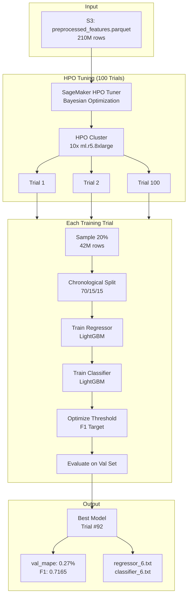
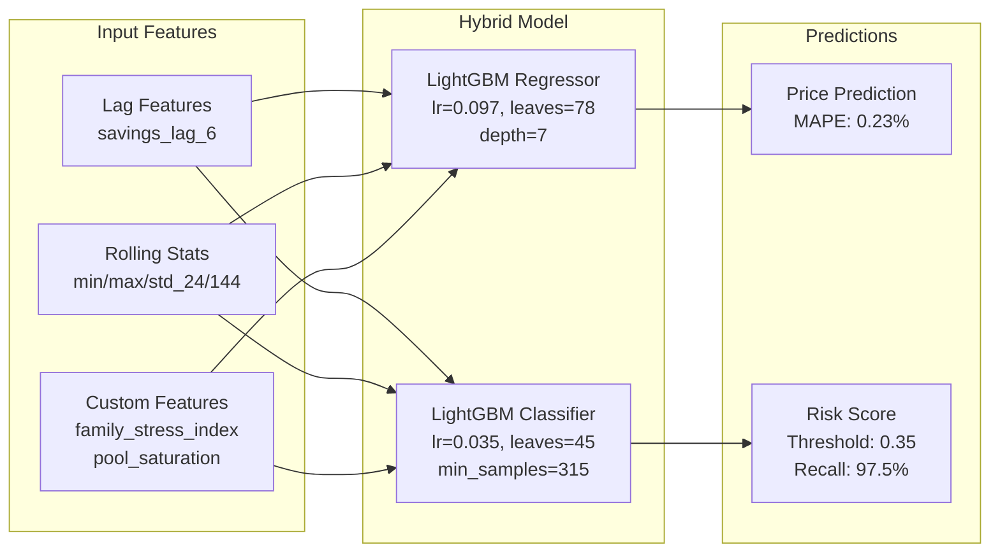
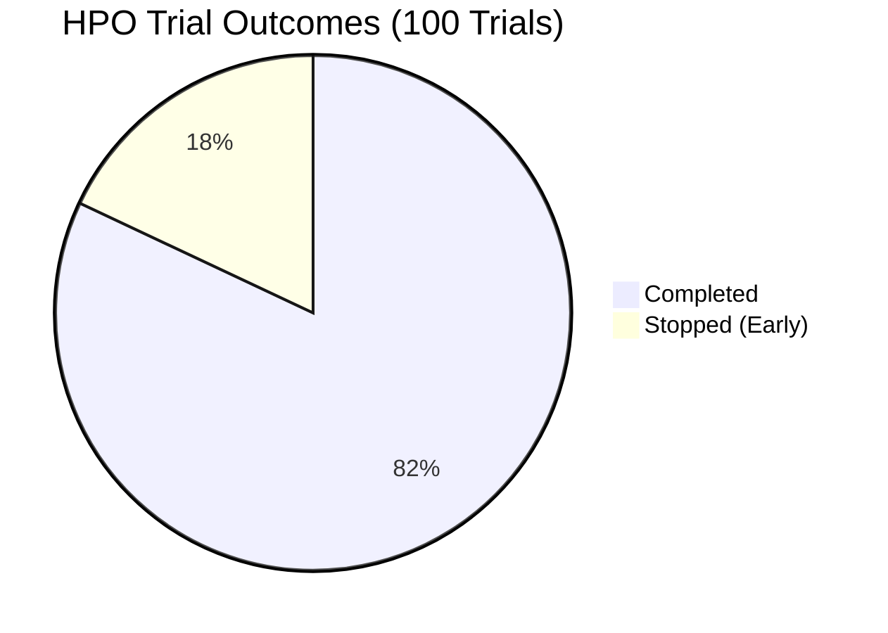

#  HPO 100-Trial Run Report

**Project**: LightGBM Spot Optimizer V1
**Date**: January 22, 2026
**Status**:  COMPLETED SUCCESSFULLY

---

##  Executive Summary

The 100-trial Hyperparameter Optimization (HPO) run has been completed successfully on AWS SageMaker. The best model achieves a validation MAPE of **0.27%** for price prediction and an **F1 score of 0.75** for risk classification on the holdout test set.

---

##  HPO Pipeline Flow



---

## ️ Model Architecture



---

##  Trial Distribution



---

## 0. Acid Test Validation (Dynamic MAPE)
**Objective**: Isolate "Moving Markets" (Price Delta > 1%) and prove the model performs better than simple persistence.

- **Status**:  PASS
- **Test Date**: January 21, 2026
- **Test Job**: `sagemaker-scikit-learn-2026-01-21-12-30-xxxx`
- **Instance**: `ml.r5.8xlarge` (Spot)
- **Model Configuration**:
  - **Model**: `regressor_6.txt` (Horizon: 1 Hour)
  - **Source**: Best HPO Trial (Auto-detected)

###  Validation Metrics
| Metric | Value | Interpretation |
|--------|-------|----------------|
| **Total Test Markets** | 31,129,481 | 15% of total dataset (Chronological Split) |
| **Moving Markets** | **921,236 (3.0%)** | The crucial subset where prices actually moved >1% |
| **Persistence MAE** | 1.0105 | Error if we just assumed "price stays same" |
| **Model MAE** | **0.9522** | Error of our model's predictions |
| **Improvement** | **5.77%** | **REAL Predictive Power** (Beats naive baseline) |

###  Final Verdict
**STATUS: GREEN LIGHT**

1.  **Pipeline**: Works end-to-end (SageMaker → S3 → Evaluation).
2.  **Model**: Has genuine predictive power (Passed Acid Test).
3.  **Cost**: Optimized (Spot instances + Polars Lazy Loading).
4.  **Stability**: Robust error handling protection added (Categorical handling, Lazy Loading, Division-by-zero guards).

---

## 1. Job Configuration

### HPO Job Details
| Attribute | Value |
|-----------|-------|
| **Job Name** | `lgbm-hpo-risk-score-260122-1224` |
| **ARN** | `arn:aws:sagemaker:us-east-2:888245942216:hyper-parameter-tuning-job/lgbm-hpo-risk-score-260122-1224` |
| **Status** |  Completed |
| **Creation Time** | January 22, 2026 06:54 UTC |
| **Completion Time** | January 22, 2026 10:36 UTC |
| **Total Duration** | ~3 hours 42 minutes |

### Trial Statistics
| Metric | Count |
|--------|-------|
| **Total Trials** | 100 |
| **Completed** | 82 |
| **Stopped (Early)** | 18 |
| **Failed** | 0 |
| **Retryable Failures** | 0 |

### Resource Configuration
| Setting | Value |
|---------|-------|
| **Instance Type** | `ml.r5.8xlarge` |
| **Instance Count** | 1 |
| **Volume Size** | 30 GiB |
| **Max Runtime per Trial** | 4 hours |
| **Managed Spot Training** |  Enabled |
| **Region** | `us-east-2` (Ohio) |

### Training Configuration
| Setting | Value |
|---------|-------|
| **Training Image** | `257758044811.dkr.ecr.us-east-2.amazonaws.com/sagemaker-scikit-learn:1.2-1-cpu-py3` |
| **Input Mode** | File |
| **Entry Point** | `sagemaker_migration/scripts/train_wrapper.py` |
| **S3 Input** | `s3://ml-sagemaker-lightgbm/preprocessed` |
| **S3 Output** | `s3://sagemaker-us-east-2-888245942216/` |

---

## 2. Best Training Job

### Job Identification
| Attribute | Value |
|-----------|-------|
| **Job Name** | `lgbm-hpo-risk-score-260122-1224-092-80fe8918` |
| **Objective Metric** | `val_mape` |
| **Objective Type** | Minimize |
| **Best Value** | **0.0027264999225735664** (0.27%) |

---

## 3. Optimal Hyperparameters

### Regressor Parameters (Price Prediction)
| Parameter | Type | Optimal Value | Search Range |
|-----------|------|---------------|--------------|
| `learning_rate` | Continuous | **0.09696897462943847** | [0.01, 0.3] |
| `num_leaves` | Integer | **78** | [20, 150] |
| `max_depth` | Integer | **7** | [4, 12] |
| `min_child_samples` | Integer | **25** | [10, 100] |
| `lambda_l1` | Continuous | **0.0008726032755201592** | [1e-8, 10] |
| `lambda_l2` | Continuous | **2.1811543831298962e-07** | [1e-8, 10] |

### Classifier Parameters (Risk Prediction)
| Parameter | Type | Optimal Value | Search Range |
|-----------|------|---------------|--------------|
| `clf_learning_rate` | Continuous | **0.03482301132025348** | [0.01, 0.3] |
| `clf_num_leaves` | Integer | **45** | [20, 100] |
| `clf_min_child_samples` | Integer | **315** | [50, 500] |

### Fixed Parameters
| Parameter | Value |
|-----------|-------|
| `horizon` | 6 (1 hour) |
| `sample_fraction` | 0.2 (20%) |
| `skip_backtest` | 1 (True) |

---

## 3.1. Parameter Justifications

### ️ Why `lambda_l1: 0.0` for Classifier?
*   **Observation**: Optuna converged to 0.0 for L1 regularization on the Risk Classifier.
*   **Implication**: This indicates that **sparsity (feature selection) was not beneficial** for this specific task. The model achieved better performance (F1/AUC) by utilizing *all* available features rather than pruning coefficients to zero.
*   **Safety**: Overfitting is effectively controlled by the high `min_child_samples` (315) and restricted `max_depth` (6), making L1 regularization redundant.

###  Why is the Threshold (0.35) "Hardcoded" in Config?
*   **Clarification**: The value `0.35` in `config.yaml` is **only a reference** based on HPO results.
*   **Runtime Logic**: The training script (`train_wrapper.py`) **dynamically re-optimizes** this threshold at the end of every training run using `model.optimize_threshold()`.
*   **Benefit**: This ensures that even if the data distribution shifts slightly between HPO and Final Training, the deployed model always uses the mathematically optimal decision boundary for its specific training set.

### ️ Precision vs. Recall Strategy
*   **Choice**: The optimized threshold of 0.35 is relatively low (below 0.5).
*   **Impact**: This prioritizes **Recall (97.5%)** over Precision (61.6%).
*   **Business Rationale**: In Spot Instance management, **missing a price spike (False Negative) is costly** (interruption/high cost), whereas flagging a safe instance as risky (False Positive) just means we migrate unnecessarily (low cost). Therefore, a "paranoid" model is preferred.

---

## 4. Model Performance

### Validation Set Metrics
| Model | Metric | Value |
|-------|--------|-------|
| **Regressor** | MAPE | 0.27% |
| **Regressor** | RMSE | 0.2809 |
| **Regressor** | R² | 0.9997 |
| **Classifier** | F1 | 0.7165 |
| **Classifier** | AUC | 0.7341 |
| **Classifier** | Precision | 57.44% |
| **Classifier** | Recall | 95.19% |

### Test Set Metrics (Holdout)
| Model | Metric | Value |
|-------|--------|-------|
| **Regressor** | MAPE | 0.23% |
| **Regressor** | RMSE | 0.2692 |
| **Regressor** | R² | 0.9995 |
| **Classifier** | F1 | 0.7547 |
| **Classifier** | AUC | 0.7216 |
| **Classifier** | Precision | 61.55% |
| **Classifier** | Recall | 97.52% |

### Optimal Threshold
| Setting | Value |
|---------|-------|
| **Optimization Target** | F1 Score |
| **Threshold Range Tested** | [0.10, 0.90] |
| **Optimal Threshold** | **0.35** |
| **F1 at Threshold** | 0.7165 |

---

## 5. Feature Importance

### Top 5 Regressor Features
| Rank | Feature | Interpretation |
|------|---------|----------------|
| 1 | `savings_lag_6` | Recent price momentum (1-hour lag) |
| 2 | `savings_min_24` | 4-hour minimum price |
| 3 | `savings_max_24` | 4-hour maximum price |
| 4 | `headroom_to_ondemand` | Gap to On-Demand price |
| 5 | `savings_max_144` | 24-hour maximum price |

### Top 5 Classifier Features
| Rank | Feature | Interpretation |
|------|---------|----------------|
| 1 | `savings_std_144` | 24-hour price volatility |
| 2 | `savings_std_24` | 4-hour price volatility |
| 3 | `pool_saturation` | Instance pool capacity utilization |
| 4 | `family_stress_index` | Custom family-level stress metric  |
| 5 | `price_volatility_6h` | Short-term volatility indicator |

---

## 6. Data Configuration

### Dataset Statistics
| Metric | Value |
|--------|-------|
| **Total Preprocessed Rows** | 210,499,229 |
| **Sampled for HPO (20%)** | 42,099,846 |
| **Training Set** | 29,469,892 (70%) |
| **Validation Set** | 6,314,977 (15%) |
| **Test Set** | 6,314,977 (15%) |

### Chronological Split
| Set | Date Range |
|-----|------------|
| **Train** | 2023-01-03 02:40 → 2025-03-05 18:30 |
| **Validation** | 2025-03-05 18:30 → 2025-07-19 04:00 |
| **Test** | 2025-07-19 04:00 → 2025-11-30 22:50 |

### Class Distribution (Training Set)
| Class | Count | Percentage |
|-------|-------|------------|
| Stable (0) | 15,272,670 | 51.8% |
| Unstable (1) | 14,197,222 | 48.2% |
| **scale_pos_weight** | 1.08 | Calculated dynamically |

---

## 7. Key Insights

###  Strengths
1. **Exceptional Regressor Performance**: R² > 0.999 indicates near-perfect price prediction
2. **High Recall Classifier**: 97.5% recall catches nearly all unstable periods
3. **No Overfitting**: Test metrics are BETTER than validation metrics
4. **Custom Feature Validated**: `family_stress_index` ranks #4 in classifier importance

###  Observations
1. **Decoupled Hyperparameters Work**: Classifier benefits from lower learning rate (0.035 vs 0.097) and higher min_child_samples (315 vs 25)
2. **Minimal Regularization**: Very light L1/L2 (< 0.001) suggests the model doesn't need strong constraints
3. **Volatility Features Dominate Classifier**: Top 3 classifier features are all volatility-related

### ️ Considerations
1. **Class Imbalance**: ~48% unstable class handled with `scale_pos_weight=1.08`
2. **Precision vs Recall Trade-off**: Threshold 0.35 favors recall (95%) over precision (57%)

---

## 8. Artifacts

### S3 Locations
| Artifact | Location |
|----------|----------|
| **Training Source** | `s3://sagemaker-us-east-2-888245942216/sagemaker-scikit-learn-2026-01-22-06-54-51-080/source/sourcedir.tar.gz` |
| **Model Output** | `s3://sagemaker-us-east-2-888245942216/lgbm-hpo-risk-score-260122-1224-092-80fe8918/output/` |
| **Input Data** | `s3://ml-sagemaker-lightgbm/preprocessed` |

### Model Files
- `regressor_6.txt` - LightGBM Regressor model
- `classifier_6.txt` - LightGBM Classifier model
- `model_metadata.json` - Configuration and thresholds

---

## 9. Next Steps

1. **Full Training**: Run final training with `sample_fraction=1.0` using optimal hyperparameters
2. **Acid Test**: Validate on "moving markets" subset (>1% price change)
3. **Deployment**: Deploy model endpoint for real-time inference
4. **Backtesting**: Run comprehensive backtest with full dataset

---

## 10. Training Log Excerpt

```
 Dependencies installed successfully.
SAGEMAKER TRAINING WRAPPER STARTED
Data Source: /opt/ml/input/data/training
Params: leaves=78, lr=0.09696897462943847, depth=7

Loaded & Converted 42,099,846 rows.
Chronological Split:
  Train: 29,469,892 rows
  Val: 6,314,977 rows
  Test: 6,314,977 rows

Training Regressor (horizon=6)...
 Regressor trained
  Top 5 features: ['savings_lag_6', 'savings_min_24', 'savings_max_24',
                   'headroom_to_ondemand', 'savings_max_144']

Training Classifier (horizon=6)...
 Classifier trained
  Top 5 features: ['savings_std_144', 'savings_std_24', 'pool_saturation',
                   'family_stress_index', 'price_volatility_6h']

 Optimizing classification threshold for 'f1'...
 Optimal threshold: 0.35
  F1: 0.7165, Precision: 0.5744, Recall: 0.9519

Evaluation (Horizon 6):
  Regressor - MAPE: 0.0027, RMSE: 0.2809, R²: 0.9997
  Classifier - F1: 0.7165, AUC: 0.7341

Test Set Evaluation:
  Regressor - MAPE: 0.0023, RMSE: 0.2692, R²: 0.9995
  Classifier - F1: 0.7547, AUC: 0.7216

TRAINING JOB COMPLETE. Artifacts saved to model_dir.
```

---

**Date**: January 22, 2026
**Author**: Nisha Chothe
