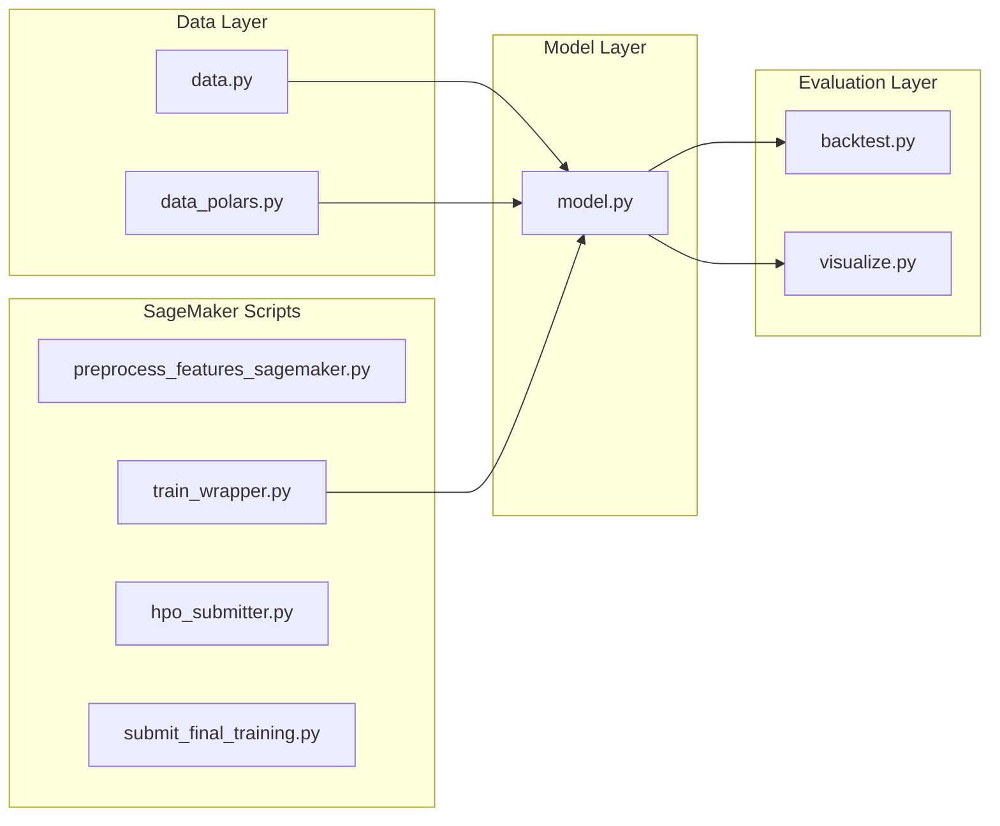

# LightGBM Codebase Guide

**Last Updated**: February 12, 2026

This document explains the core Python modules in the Spot Optimizer codebase. It serves as a reference for understanding how the system functions under the hood.

## 1. High-Level Architecture

The codebase follows a modular design where each step of the ML pipeline is handled by a dedicated file.

---

## 2. Core Modules (`src/`)

### A. Data Loading & Features (`src/data.py`)
**Purpose:** Handles loading raw parquet files, memory optimization, and creating technical indicators.

| Function | What It Does | Why It Matters |
|:---------|:-------------|:---------------|
| `load_all_data(config)` | Reads all `.parquet` files from the data directory | Entry point for raw data. Ensures a single, time-sorted DataFrame. |
| `load_parquet_filtered(...)` | Loads a single file with family filtering | **Memory & Speed.** Avoids loading unused families. |
| `optimize_dtypes(df)` | Downcasts floats (64→32) and converts strings to categories | **Crucial for Big Data.** Reduces RAM by ~60%. |
| `engineer_all_features(...)` | Adds rolling windows, lags, and time features | Transforms raw "Price" into learnable "Signals". |
| `chronological_split(df)` | Splits into Train (70%), Validation (15%), Test (15%) | **Prevents Data Leakage.** Never train on future data. |
| `prepare_targets(df, horizon)` | Creates `future_savings` and `is_unstable` labels | Generates what *actually happened* N intervals ahead. |

### B. Polars Optimizations (`src/data_polars.py`)
**Purpose:** High-performance Polars-based implementations for large datasets.

| Function | What It Does | Speedup |
|:---------|:-------------|:--------|
| `prepare_targets_polars(df, horizon)` | Creates targets using Polars (Rust backend) | **12.5x faster** (25 min → 2 min for 211M rows) |
| Lazy loading support | Uses `pl.scan_parquet()` for memory efficiency | Reduces RAM from 70GB to 20GB |

### C. The Model (`src/model.py`)
**Purpose:** Defines the `HybridSpotModel` class combining regression and classification.

| Method | What It Does | Why It Matters |
|:-------|:-------------|:---------------|
| `__init__(horizon, n_jobs)` | Initializes two LightGBM boosters | We need BOTH: "How cheap?" (Regressor) + "Is it safe?" (Classifier) |
| `fit(X_train, X_val, ...)` | Trains both models with early stopping | Single command trains entire pipeline |
| `predict(X)` | Returns savings predictions | Price prediction output |
| `predict_proba(X)` | Returns risk probabilities | Risk score output (0.0 to 1.0) |
| `optimize_threshold(X_val, val_df)` | Finds optimal F1-maximizing threshold | **Critical.** Default 0.5 is rarely optimal. |
| `evaluate(X, df)` | Returns comprehensive metrics dict | MAPE, R², F1, AUC, Precision, Recall |
| `save(path)` / `load(path)` | Persists models as `.txt` files | LightGBM native format for fast loading |

### D. Backtesting (`src/backtest.py`)
**Purpose:** Simulates real-world performance using Walk-Forward Validation.

| Method | What It Does | Why It Matters |
|:-------|:-------------|:---------------|
| `WalkForwardBacktest(n_splits)` | Manages rolling time windows | Mimics real-world retraining schedule |
| `run_backtest(df, feature_cols, ...)` | Iterates windows, retrains, and evaluates | Generates "True Performance" metrics |

### E. Visualization (`src/visualize.py`)
**Purpose:** Generates visual dashboards for model interpretation.

| Method | What It Does | Output |
|:-------|:-------------|:-------|
| `generate_essential_dashboards(...)` | Creates all 3 dashboards | Returns optimal threshold |
| `plot_performance_dashboard(...)` | KPI Panel + 6 performance plots | `performance_dashboard.png` |
| `plot_feature_analysis_dashboard(...)` | Top 10 features for each model | `feature_analysis_dashboard.png` |
| `plot_business_impact_dashboard(...)` | Business insights (4 plots) | `business_impact_dashboard.png` |

**Key Optimizations:**
- Sampling: Histograms limited to 100K points
- Daily aggregation: Time series reduced from millions to ~60 points
- Decimation: Curves downsampled to 200 points
- Memory cleanup: `plt.close("all"); gc.collect()`

### F. Logging (`src/logger.py`)
**Purpose:** Centralized SageMaker-aware logging.

| Function | What It Does |
|:---------|:-------------|
| `get_logger(name)` | Returns a configured logger with timestamps |
| Auto-saves to `/opt/ml/output/job.log` in SageMaker |

---

## 3. SageMaker Scripts (`sagemaker_migration/scripts/`)

### A. Preprocessing (`preprocess_features_sagemaker.py`)
Runs feature engineering as a SageMaker Processing Job.
- **Instance:** `ml.r5.8xlarge` (256GB RAM)
- **Output:** `preprocessed_features.parquet` (horizon-agnostic)

### B. Training Wrapper (`train_wrapper.py`)
Main entry point for SageMaker Training Jobs.

| Feature | Description |
|:--------|:------------|
| Dynamic dependency install | Installs LightGBM, Polars only if missing |
| Just-in-time targets | Generates targets based on `--horizon` arg |
| Polars fast path | Uses Polars for loading and sampling |
| Separate hyperparameters | `--clf_learning_rate`, `--clf_num_leaves` for classifier |
| HPO mode | `--skip_backtest=1` for faster trials |

### C. HPO Submitter (`hpo_submitter.py`)
Launches SageMaker Hyperparameter Tuning Jobs.

| Parameter | Regressor | Classifier |
|:----------|:----------|:-----------|
| `learning_rate` | [0.01, 0.3] | `clf_learning_rate`: [0.005, 0.05] |
| `num_leaves` | [20, 150] | `clf_num_leaves`: [20, 100] |
| `max_depth` | [4, 12] | Shared |
| `min_child_samples` | [10, 100] | `clf_min_child_samples`: [50, 500] |

### D. Final Training (`submit_final_training.py`)
Trains production model with optimal HPO parameters.
- **Full data:** `sample_fraction=1.0`
- **With backtest:** `skip_backtest=0`
- **With visualization:** Full dashboard generation

### E. Acid Test (`acid_test_entrypoint.py`)
Validates model on "moving markets" (price change >1%).
- Proves model beats naive persistence baseline
- Uses lazy loading for memory efficiency

---

## 4. Configuration Files

### `config/config.yaml`
Central configuration for the entire pipeline.

| Section | Key Settings |
|:--------|:-------------|
| `data` | Parquet file paths, stress events path |
| `split` | Train/Val/Test ratios (70/15/15) |
| `features` | Horizons, lag intervals, rolling windows |
| `model` | Optimal hyperparameters (from HPO) |
| `optuna` | Local HPO settings |
| `risk` | Z-score thresholds |

---

## 5. Documentation Files

| File | Purpose |
|:-----|:--------|
| `VISUALIZATION_GUIDE.md` | How to read dashboard plots |
| `LIGHTGBM_DEEP_DIVE.md` | Technical algorithm details |
| `DAILY_CHANGELOG.md` | Day-by-day development log |
| `PIPELINE_VALIDATION_LOG.md` | Successful run records |
| `HPO_100_TRIAL_REPORT.md` | Results from HPO optimization |
| `HPO_GUIDE.md` | SageMaker HPO instructions |
| `AWS_SETUP_GUIDE.md` | AWS configuration steps |
