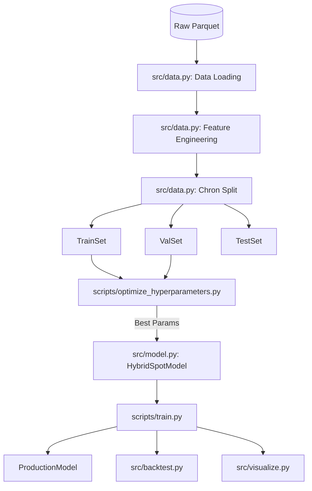

# LightGBM Spot Optimizer - Technical Deep Dive

> **Version:** 2.0 (2026-01-22)
> **Project:** Spot Optimizer
> **Status:** Production Ready (HPO Complete)

---

##  Table of Contents
1. [Algorithm Fundamentals](#1-algorithm-fundamentals-what-is-lightgbm)
2. [Project Architecture](#2-project-architecture)
3. [Data Pipeline](#3-data-pipeline)
    - [Input Data](#31-input-data)
    - [Load & Process](#32-load--process)
    - [Feature Engineering](#33-feature-engineering-39-features)
    - [Target Engineering](#34-target-engineering-seasonality-aware)
    - [Dynamic Target Strategy](#35-dynamic-target-engineering-architecture-decision)
    - [Chronological Splitting](#36-chronological-splitting-crucial)
4. [The Hybrid Model](#4-the-hybrid-model-regressor--classifier)
5. [Hyperparameter Tuning (HPO)](#5-hyperparameter-tuning-hpo)
6. [SageMaker & Hardware](#6-sagemaker--hardware-requirements)
7. [Run Instructions](#7-run-instructions)

---

## 1. Algorithm Fundamentals: What is LightGBM?

**LightGBM (Light Gradient Boosting Machine)** is a fast, distributed, high-performance gradient boosting framework based on decision tree algorithms.

### How It Works
Unlike Random Forests (which build independent trees), Gradient Boosting builds trees **sequentially**. Each new tree attempts to correct the errors (residuals) of the previous trees.

1.  **Gradient-Based One-Side Sampling (GOSS)**: Keeps gradients with large errors and randomly drops those with small errors. This focuses the model on the "hard" examples.
2.  **Exclusive Feature Bundling (EFB)**: Bundles mutually exclusive features (rarely non-zero at the same time) to reduce dimensionality.
3.  **Leaf-Wise Growth**: LightGBM grows trees leaf-wise (best-first) rather than level-wise (depth-first). This usually results in lower loss but can overfit if not regulated (hence `max_depth`).

### Why LightGBM for Spot Prices?
*   **Speed**: Faster than XGBoost for large datasets (77M+ rows).
*   **Efficiency**: Lower memory usage.
*   **Accuracy**: Leaf-wise growth excels at complex non-linear patterns like spot price spikes.

---

## 2. Project Architecture

The project is structured to separate **Data Engineering**, **Modeling**, and **Execution**.



### 2.2 Architecture Explanation
The architecture follows a strict "separation of concerns" pattern:
1.  **Data Processing (ETL)**: Heavy lifting is done *once* using Polars on high-memory instances. This creates a reusable "Gold" dataset (`preprocessed_features.parquet`).
2.  **Training**: The training script is lightweight. It loads the Gold dataset and performs "Just-In-Time" (JIT) target generation and splitting. This allows us to change horizons (e.g., 1h to 6h) without running the expensive ETL again.
3.  **Visualization**: Decoupled from training. The model and test set are passed to a dedicated visualizer that handles the complexity of plotting temporal data.

---

## 3. Data Pipeline

### 3.1 Input Data
*   **Primary Source**: AWS Spot Price History (Parquet files).
    *   Columns: `Timestamp`, `InstanceType`, `AvailabilityZone`, `SpotPrice`, `OS`.
*   **Secondary Source**: Stress Events Calendar (CSV).
    *   Columns: `EventName`, `Date`, `ImpactLevel`.

### 3.2 Load & Process
Implemented in `src/data.py`.
1.  **Memory Optimization**:
    *   Floats converted to `float32`.
    *   Strings converted to `category`.
    *   Reduces RAM usage by ~60%.
2.  **Filtering**:
    *   Optional filter for specific families (e.g., `c6i`) for local testing.
    *   Full data load for production.

### 3.3 Feature Engineering (39 Features)
The heart of the system. We transform raw time-series data into predictive signals.

| Category | Count | Examples | Why It Helps |
| :--- | :--- | :--- | :--- |
| **Temporal** | 10 | `hour`, `day_of_week`, `hour_sin`, `hour_cos` | Captures daily/weekly price cycles (e.g., 9am Monday spikes). |
| **Lag** | 3 | `savings_lag_6` (1h), `savings_lag_24` (4h) | Tells the model what happened 1 hour ago. "Persistence Model". |
| **Rolling** | 8 | `savings_mean_24`, `savings_mean_144` | Captures trends over 4h, 12h, 24h. See detailed table below. |
| **Price Dynamics** | 5 | `price_velocity_1h`, `headroom_to_ondemand` | Is price rising fast? How close is it to on-demand cap? |
| **Family Patterns** | 6 | `family_hour_avg_savings` | Learns "c5.large usually crashes at 2pm". |
| **Family Stress** | 3 | `family_stress_index` | Contagion: "If c5.xlarge is crashing, c5.large might be next." |
| **Events** | 3 | `is_holiday`, `days_to_nearest_event` | Black Friday/Prime Day awareness. |
| **Pool Risk** | 1 | `pool_historical_zero_rate` | "This pool historically fails 20% of the time." |

### 3.3.1 Rolling Window Strategy
We use multiple window sizes to capture different market dynamics:

| Window Size (Intervals) | Duration | What It Captures | Why It Matters |
| :--- | :--- | :--- | :--- |
| **24** | **4 Hours** | **Short-Term Drift** | Captures "morning vs afternoon" shifts. Good for detecting sustained pressure. |
| **72** | **12 Hours** | **Day/Night Cycle** | Roughly half a day. Helps compare "AM vs PM" pricing levels. |
| **144** | **24 Hours** | **Daily Seasonality** | **Critical.** Compares "Now" to "Same time yesterday". The strongest signal for stable pools. |
| *1008* | *7 Days* | *Weekly Reference* | (Used for Target Generation, not as a direct input feature). |

> [!NOTE]
> **Performance Optimization**: The rolling features calculation uses `.agg(['mean', 'std', 'min', 'max'])` to compute all 4 statistics in a single pass, with `.values` assignment for zero-copy operations. This reduces computation time from ~90 mins to ~30 mins for 214M rows.

### 3.4 Target Engineering (Seasonality Aware)
To correctly classify instability, we compare future savings against a **seasonal baseline**:
*   **Grouping**: InstanceType + AZ + **Hour of Day**.
*   **Window**: 42 observations (7 days * 6 intervals/hour).
*   **Logic**: "Is the future savings >1 std dev away from the typical savings *for this hour* over the last week?"
*   This prevents false alarms during normal daily price cycles.

### 3.5 Dynamic Target Engineering (Architecture Decision)
We intentionally **DO NOT** calculate targets (`future_savings`, `is_unstable`) in the Preprocessing Job.

*   **Why**: Targets depend on the `horizon` (e.g., predict 1h vs 6h vs 24h ahead).
*   **Strategy**: "Write Once, Read Many".
    1.  **Preprocessing**: Creates a "Gold" dataset with history features only. This file is horizon-agnostic.
    2.  **Training**: Loads the Gold dataset and calculates targets **on-the-fly** based on the requested horizon arg.

> [!IMPORTANT]
> **Handling the "Split Boundary" Risk**:
> Calculating targets *after* splitting data causes NaNs at the boundary.
> **Solution**: `train_wrapper.py` loads the full timeline -> calculates targets (preserving continuity) -> THEN splits into Train/Val/Test.

### 3.6 Chronological Splitting (CRITICAL)
We CANNOT use random shuffle (scikit-learn `train_test_split`) because it breaks the time sequence (Data Leakage).

*   **Method**: `src/data.py -> chronological_split()`
*   **Logic**:
    1.  Sort data by Timestamp.
    2.  `Train` = First 70% (e.g., Jan - Aug)
    3.  `Val` = Next 15% (e.g., Sep - Oct) -> Used for Early Stopping.
    4.  `Test` = Final 15% (e.g., Nov - Dec) -> Used for Final Evaluation.

---

## 4. The Hybrid Model (Regressor + Classifier)

We need to answer two questions:
1.  **"How much will I save?"** -> **Regressor**
2.  **"Is it safe to launch?"** -> **Classifier**

### A. Regressor
*   **Target**: `future_savings` (Percentage savings over On-Demand).
    *   *Note*: We predict **Savings**, not Price.
    *   **Difference**: Price prediction is unbounded (can vary from $0.10 to $5.00). Savings prediction is bounded (0% to 100%) and normalized across families. This makes the model more stable and transferable.
*   **Objective**: `regression` (L2 Loss).
*   **Metric**: `MAPE` (Mean Absolute Percentage Error).

### B. Classifier (Risk Score)
*   **Target**: `is_unstable` (1 if savings drop significantly below baseline, 0 if stable).
*   **Objective**: `binary` (Log Loss).
*   **Metric**: `binary_logloss`.
*   **Output**: Probability (0.0 to 1.0).

### C. Decision Logic (src/model.py)
The system outputs a **Risk Label** based on:
1.  **Risk Score**: If > 0.5 (configurable), it's "Unsafe".
2.  **Z-Score**: If predicted savings are < 3 standard deviations below mean, it's "Danger".

---

## 5. Hyperparameter Tuning (HPO)

###  Optimal Parameters (from 100-Trial Run: Jan 22, 2026)

**Job:** `lgbm-hpo-risk-score-260122-1224` | **Best Trial:** #92 | **val_mape:** 0.27%

#### Regressor Parameters
| Parameter | Optimal Value | Notes |
|:----------|:--------------|:------|
| `learning_rate` | **0.097** | Higher LR for faster convergence |
| `num_leaves` | **78** | Moderate complexity |
| `max_depth` | **7** | Controlled depth prevents overfitting |
| `min_child_samples` | **25** | Standard regularization |
| `lambda_l1` | **0.000873** | Very light L1 regularization |
| `lambda_l2` | **2.18e-07** | Minimal L2 regularization |

#### Classifier Parameters
| Parameter | Optimal Value | Notes |
|:----------|:--------------|:------|
| `clf_learning_rate` | **0.0348** | Lower LR for stability |
| `clf_num_leaves` | **45** | Simpler structure than regressor |
| `clf_min_child_samples` | **315** | High min samples for robustness |
| `optimal_threshold` | **0.35** | Optimized for F1 score |

#### Model Performance (Test Set)
| Model | Metric | Value |
|:------|:-------|:------|
| Regressor | MAPE | **0.23%** |
| Regressor | R² | **0.9995** |
| Classifier | F1 | **0.7547** |
| Classifier | Recall | **97.5%** |
| Classifier | AUC | **0.7216** |

### Tuning Strategy
*   **Platform**: AWS SageMaker HPO (Bayesian Optimization)
*   **Trials**: 100 (82 completed, 18 early-stopped)
*   **Instance**: `ml.r5.8xlarge` (Spot)
*   **Duration**: ~3.7 hours
*   **Sample**: 20% of data (42M rows)

### Why Separate Classifier Hyperparameters?
The Classifier needs different settings because:
1. **Class Imbalance**: ~48% unstable vs 52% stable.
    *   **Explanation**: In a dataset where 97% of observations might be "safe" (stable), a model could achieve 97% accuracy by *always* predicting safe—rendering it useless.
    *   **Solution (`scale_pos_weight`)**: This parameter tells LightGBM to pay more attention to the minority class (Unstable). If set to 2.0, every error on an Unstable example costs 2x as much as a Stable example. We calculate this dynamically: `n_negative / n_positive`.
2. **Different Objective**: Binary classification vs regression
3. **Stability > Speed**: Lower learning rate prevents oscillation

---

## 6. SageMaker & Hardware Requirements

### Usage
For the full dataset (200M+ rows), local laptops (even M4 Max) struggle with RAM during the Feature Engineering phase.

### SageMaker Pipeline
1.  **Preprocessing**: `ml.r5.8xlarge` (256GB RAM).
    *   Task: Load raw Parquet -> Generate Features -> Save "Materialized" Parquet.
    *   Note: Upgraded from 4xlarge to handle 80GB+ memory spikes in event features (now optimized).
2.  **HPO**: `ml.r5.8xlarge`.
    *   Task: Run 100 trials on the Materialized Parquet.
    *   Note: Consistent hardware ensures comparable timing.
3.  **Training**: `ml.r5.8xlarge`.
    *   Task: Train final model.
    *   Note: High memory required for full dataset join/split operations.

### Hardware Reference
| Component | Local (M4 Pro/Max) | Cloud (Recommended) |
| :--- | :--- | :--- |
| **RAM** | 32GB (Risky for full data) | 64GB - 128GB |
| **CPU** | 8+ Cores | 16+ vCPUs |
| **Storage** | 20GB | S3 (Unlimited) |

---

## 7. Run Instructions

### 1. Local Training (Sampled)
To test code logic on your laptop:
```bash
# Edit config.yaml -> Set sample_families: ['c6i']
python scripts/train.py
```

### 2. Hyperparameter Optimization (Dry Run)
Test the Optuna pipeline:
```bash
python scripts/optimize_hyperparameters.py --dry-run
```

### 3. Full Production HPO (Local or Cloud)
```bash
python scripts/optimize_hyperparameters.py
```

### 4. Backtesting
Verify performance on unseen time periods:
```bash
python scripts/backtest.py
```

### 5. AWS CLI Profile Management

Before running SageMaker commands, ensure your AWS CLI is configured correctly.

**A. Check Configured Profiles**
See which profiles are available on your machine:
```bash
aws configure list-profiles
```

**B. Create/Update a Profile**
Run configuration for your specific profiles:
```bash
aws configure --profile nisha_chothe
aws configure --profile ml-project
```

**C. Check Current Active Profile & Region**
Verify which credentials and region are currently being used:
```bash
aws configure list
```
To check the region of a *specific* profile without switching:
```bash
aws configure get region --profile ml-project
```

**D. Set Region for a Profile**
If the region is incorrect (e.g., you need `us-east-1` instead of `us-west-2`):
```bash
aws configure set region us-east-1 --profile ml-project
```

**E. Activate a Profile (Switching)**
*   **Method 1: Per Command (Best for frequent switching)**
    Simply add the flag to any command:
    ```bash
    # Run as nisha_chothe
    aws s3 ls --profile nisha_chothe

    # Run as ml-project
    aws s3 ls --profile ml-project
    ```
*   **Method 2: Session-wide (Good for a batch of work)**
    Sets the profile for this terminal window only:
    ```bash
    export AWS_PROFILE=nisha_chothe
    # ... do work ...
    export AWS_PROFILE=ml-project
    ```

### 6. SageMaker Execution (Cloud)

#### A. Preprocessing (Feature Engineering)
Runs on `ml.r5.8xlarge` to handle 200GB+ RAM requirements.
```bash
python sagemaker_migration/scripts/submit_preprocessing_job.py \
    --bucket YOUR_BUCKET_NAME \
    --role YOUR_SAGEMAKER_ROLE_ARN \
    --profile YOUR_AWS_PROFILE
```

#### B. Hyperparameter Optimization (HPO)
*   **Tuning Dry Run (Canary)**: Runs 1 trial to verify permissions and memory.
    ```bash
    python sagemaker_migration/scripts/hpo_submitter.py \
        --bucket YOUR_BUCKET_NAME \
        --role YOUR_SAGEMAKER_ROLE_ARN \
        --profile YOUR_AWS_PROFILE \
        --trials 1
    ```

*   **Full Tuning**: Runs 100 parallel trials.
    ```bash
    python sagemaker_migration/scripts/hpo_submitter.py \
        --bucket YOUR_BUCKET_NAME \
        --role YOUR_SAGEMAKER_ROLE_ARN \
        --profile YOUR_AWS_PROFILE \
        --trials 100
    ```

#### C. Final Training (Production)
Trains the final model on 100% of data (200M+ rows) using the best HPO parameters.
```bash
python sagemaker_migration/scripts/submit_final_training.py \
    --bucket YOUR_BUCKET_NAME \
    --role YOUR_SAGEMAKER_ROLE_ARN \
    --profile YOUR_AWS_PROFILE
```
*   **Training Dry Run**: Use `--local` flag to test the training container on your laptop (Requires Docker):
    ```bash
    python sagemaker_migration/scripts/submit_final_training.py ... --local
    ```
**Author**: Nisha Chothe
