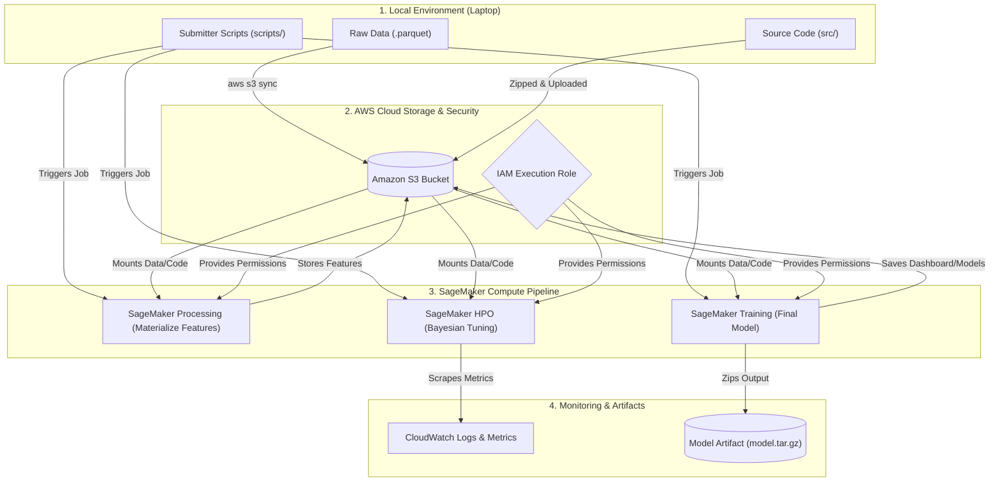
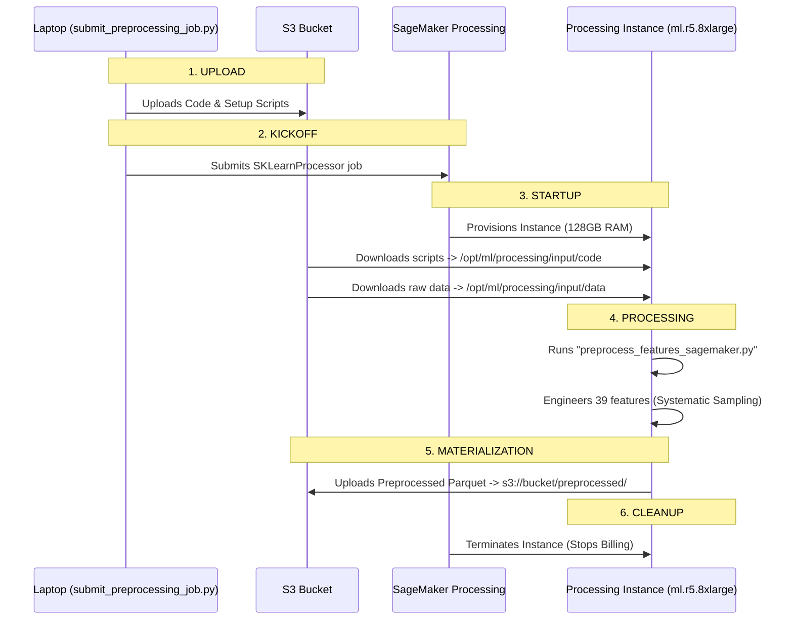
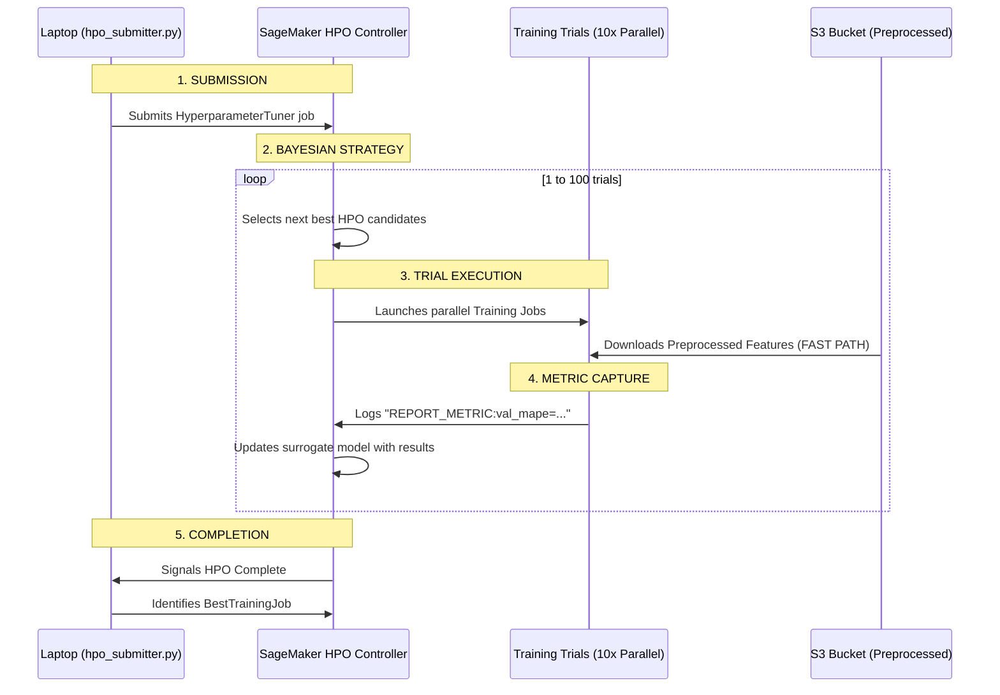
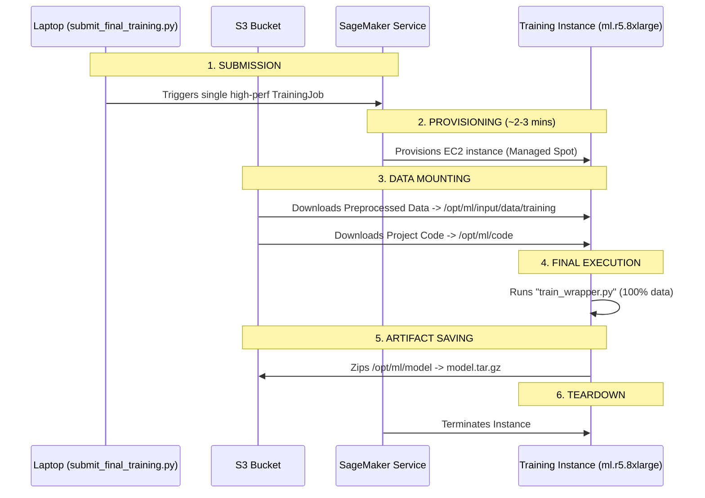

# How SageMaker Migration Works (Under the Hood)

This document explains the technical lifecycle of the Spot Optimizer on AWS. It covers the end-to-end architecture, service roles, and internal execution flows.

---

## 0. End-to-End Architecture Overview
The following diagram shows how data and code move from your local environment through AWS services to become a production model.

### AWS Service Roles
| Service | Role in Our Project |
| :--- | :--- |
| **Amazon S3** | The "Hard Drive" of the cloud. Stores our raw data, preprocessed features, code bundles, and final model artifacts. |
| **AWS IAM** | The "Security Guard". The SageMaker Execution Role permits the cloud instances to read from S3 and write to CloudWatch. |
| **SageMaker Processing** | The "Factory". Uses heavy-duty instances (`ml.r5.8xlarge`) to transform raw data once. |
| **SageMaker HPO** | The "optimizer". Runs 100 experiments in parallel to find the mathematical "sweet spot" for our model. |
| **SageMaker Training** | The "Builder". Specifically trained on **Managed Spot Instances** to save ~70% on compute costs. |
| **CloudWatch** | The "Dashboard". Captures all print statements from our code and tracks metrics like MAPE and LogLoss over time. |

---

## 1. The Preprocessing Flow (Feature Engineering)
**Trigger:** `scripts/submit_preprocessing_job.py`
**Goal:** Transform 214M rows of raw data into a "materialized" feature set once, so HPO trials don't have to repeat the work.

---

## 2. The HPO Flow (Bayesian Optimization)
**Trigger:** `scripts/hpo_submitter.py`
**Goal:** Find the absolute best mathematical parameters for our Risk Score model.

---

## 3. The Final Training Flow (Production Model)
**Trigger:** `scripts/submit_final_training.py`
**Goal:** Train the production-ready model using 100% of the data and the "Winning Params" from HPO.

---

## 4. Code Role Mapping

Here is how each component fits into the architecture.

### A. The Launchers (`scripts/*.py`)
**Where they run:** Your Laptop.
**Role:** The "Remote Control".
*   **Preprocessing Launcher**: Configures the `SKLearnProcessor`.
*   **HPO Submitter**: Configures the `HyperparameterTuner` with search ranges.
*   **Final Training**: Configures a fixed-param `SKLearn` estimator for production.

### B. The Entry Point (`train_wrapper.py`)
**Where it runs:** Inside the Cloud Container.
**Role:** The "Bridge".
*   Translates SageMaker environment variables into paths our project understands.
*   **`sys.path.append(os.getcwd())`**: Ensures the container can "see" the `src/` modules.
*   Handles both Raw and Preprocessed data paths automatically based on the S3 context.

### C. The Worker Scripts (`preprocess_features_sagemaker.py` etc.)
**Where they run:** Inside the Cloud Container.
**Role:** The "Operator".
*   These are the scripts that actually call our `src.data` and `src.model` functions.
*   They log metrics using specific formats (`REPORT_METRIC:...`) so SageMaker can "read" their performance.

---

## 5. Q: Are we using "SageMaker Experiments"?

**Answer: No, not explicitly.**

### What IS happening?
*   **Basic Tracking:** SageMaker *always* tracks every job. We can see history, logs, and metrics in the AWS Console > Training Jobs.
*   **CloudWatch Metrics:** We defined regexes in our Submitters. This means SageMaker *is* scraping our logs and plotting charts in CloudWatch automatically.

### Recommendation
For now, the basic Training/Tuning Job history is sufficient. It is simpler to maintain and provides all the evidence needed for auditability.

---

## 6. The SageMaker Execution Role (Security Architecture)

While  **AWS CLI Profile** (e.g., `ml-project`) controls what we can do from our laptop, the **SageMaker Execution Role** controls what the *cloud container* can do once it is running.

### How it Works
1.  **Handover**: When we run `estimator.fit()`, we "pass" the Role ARN to SageMaker.
2.  **Assumption**: The EC2 instance spun up for the job "assumes" this identity.
3.  **Access**: The container uses this role to:
    *   Read the code and data from **S3**.
    *   Write logs to **CloudWatch**.
    *   Save the final model back to **S3**.

> [!IMPORTANT]
> **Identity vs. Permission**: Even if we have "AdministratorAccess" on our laptop, the training job will FAIL if the Execution Role doesn't have `AmazonS3FullAccess`. They are separate identities.
