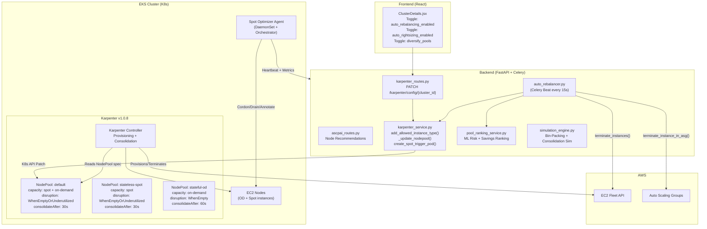
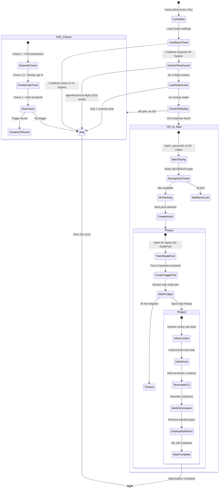
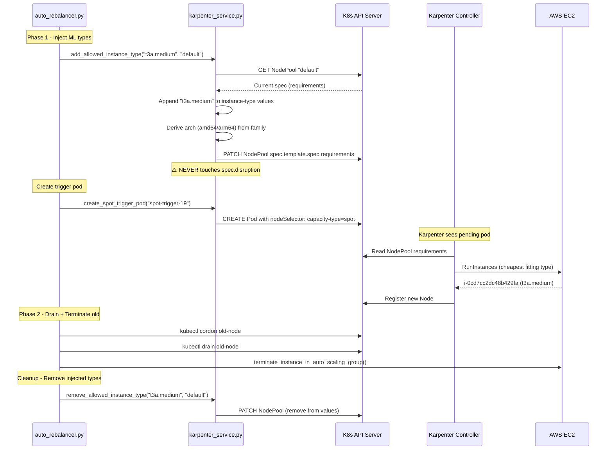
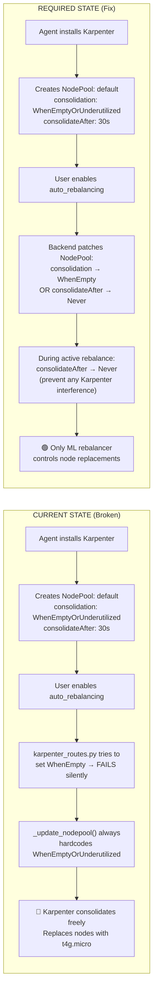
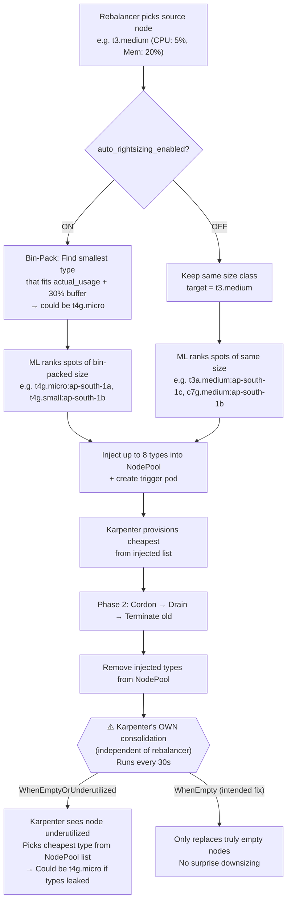
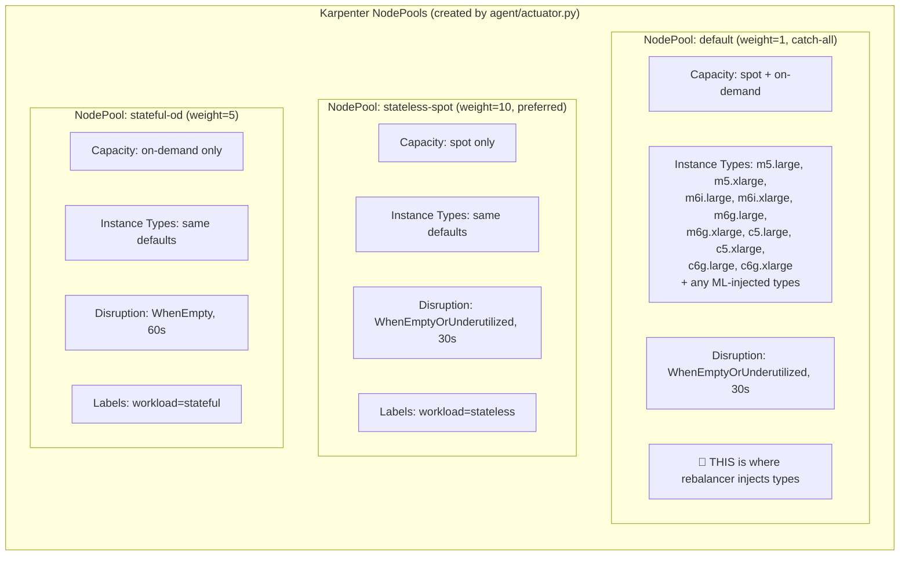
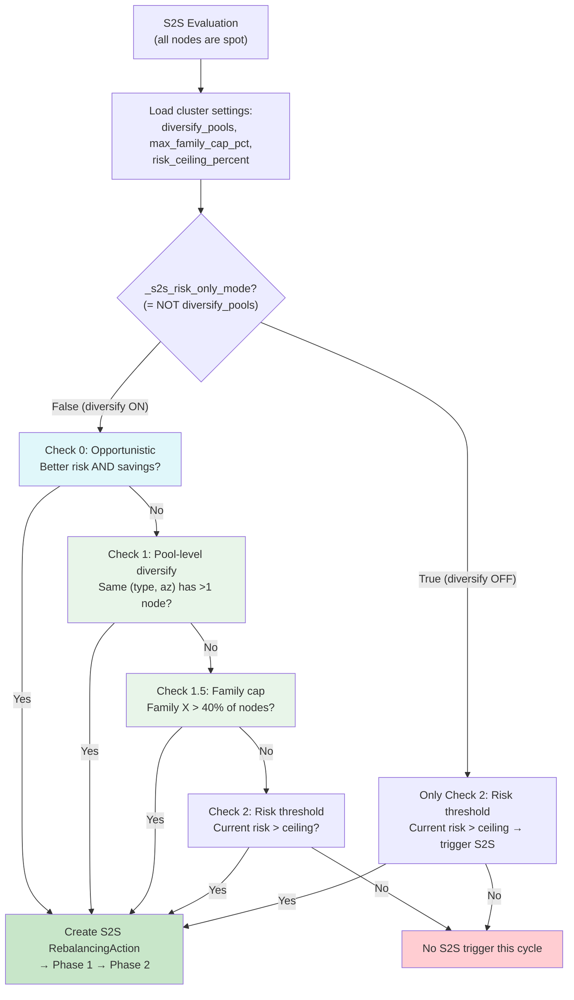
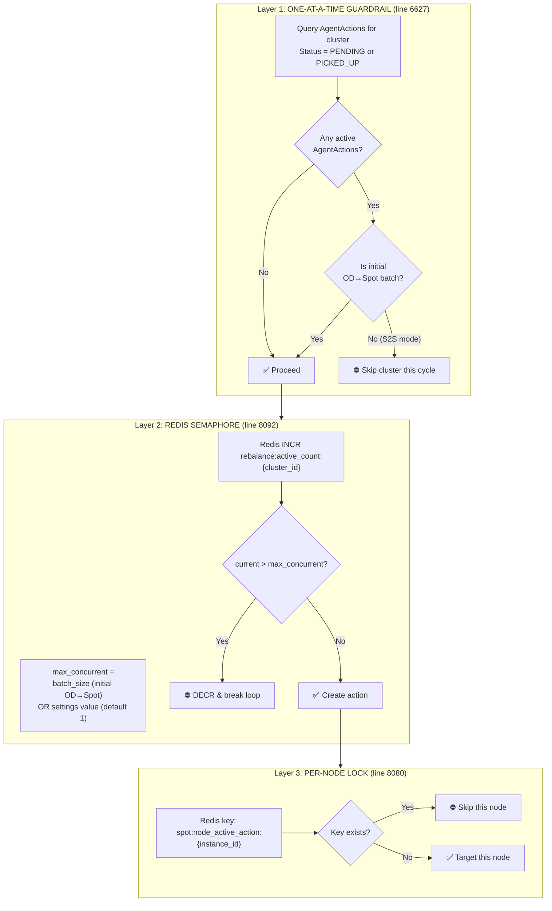
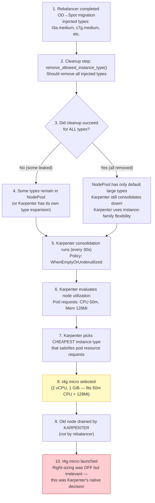

# Karpenter ↔ Spot Optimizer Architecture

> Generated: 9 April 2026  
> Root Cause: Karpenter native consolidation (`WhenEmptyOrUnderutilized`) replacing nodes with t4g.micro even when right-sizing is OFF.

---

## 1. System Overview

---

## 2. Auto-Rebalancer State Machine (Phase 1 → Phase 2)

---

## 3. Karpenter NodePool Patching Flow

---

## 4. The t4g.micro Consolidation Bug

```mermaid
flowchart TD
    subgraph Problem["🔴 PROBLEM: Karpenter Native Consolidation"]
        A["Node running: t3a.medium<br/>Actual usage: CPU 50m, Mem 128Mi"] 
        B["Karpenter evaluates every 30s<br/>consolidationPolicy: WhenEmptyOrUnderutilized"]
        C["Karpenter picks CHEAPEST type<br/>that fits pod requests from NodePool list"]
        D["t4g.micro launched!<br/>Right-sizing was OFF<br/>but Karpenter doesn't know that"]
    end

    A --> B --> C --> D

    subgraph Intent["🟢 INTENDED DESIGN (karpenter_routes.py L410)"]
        E["User enables auto_rebalancing"] 
        F["Backend should patch NodePool:<br/>consolidationPolicy → WhenEmpty"]
        G["Karpenter only consolidates<br/>empty nodes, not underutilized"]
    end
    E --> F --> G

    subgraph Bug["🔴 BUG: Consolidation Policy Never Applied"]
        H["karpenter_routes.py L415:<br/>_ksvc.patch_node_pool_allowed_types(<br/>  cluster_id=...,<br/>  consolidation_policy='WhenEmpty'<br/>)"]
        I["patch_node_pool_allowed_types() signature:<br/>def patch_node_pool_allowed_types(<br/>  self, cluster_id, instance_types, db<br/>)"]
        J["❌ TypeError: unexpected keyword<br/>'consolidation_policy'<br/>Caught by except → logged as warning"]
        K["NodePool keeps:<br/>WhenEmptyOrUnderutilized + 30s<br/>Karpenter freely consolidates"]
    end
    H --> I --> J --> K

    subgraph Bug2["🔴 BUG: _update_nodepool() hardcodes policy"]
        L["karpenter_service.py L766:<br/>disruption: {<br/>  consolidationPolicy:<br/>  'WhenEmptyOrUnderutilized',<br/>  expireAfter: '720h'<br/>}"]
        M["Every NodePool update<br/>resets to WhenEmptyOrUnderutilized"]
    end
    L --> M
```

---

## 5. Consolidation Policy — Current vs Required

---

## 6. Instance Type Flow — Right-Sizing ON vs OFF

---

## 7. Three NodePools Created by Agent

---

## 8. S2S Diversify Flow (Fixed: _s2s_risk_only_mode bug)

---

## 9. Concurrency Controls

---

## 10. Bugs Found & Fixes Required

| # | Bug | File | Line | Severity | Status |
|---|-----|------|------|----------|--------|
| 1 | `_s2s_risk_only_mode = True` hardcoded — diversify S2S checks are dead code | `auto_rebalancer.py` | 7266 | **CRITICAL** | ✅ **FIXED** → `not _diversify_s2s` |
| 2 | `patch_node_pool_allowed_types()` called with wrong kwargs — consolidation policy never applied | `karpenter_routes.py` | 415 | **CRITICAL** | 🔴 OPEN |
| 3 | `_update_nodepool()` always hardcodes `WhenEmptyOrUnderutilized` — overrides any consolidation fix | `karpenter_service.py` | 766 | **HIGH** | 🔴 OPEN |
| 4 | No `consolidateAfter: Never` during active rebalance — Karpenter can interfere mid-migration | `karpenter_service.py` | — | **HIGH** | 🔴 OPEN |
| 5 | `add_allowed_instance_type()` only adds, cleanup may miss types → NodePool type list grows unbounded | `karpenter_service.py` | 1041 | **MEDIUM** | 🔴 OPEN |
| 6 | t4g.micro not in default types but Karpenter can pick any type if NodePool list leaks small types | `actuator.py` | 1005 | **MEDIUM** | 🔴 OPEN |

---

## 11. How t4g.micro Happened (Root Cause Chain)

> **Key Insight**: Even if our type cleanup is perfect, Karpenter v1.0+ with `WhenEmptyOrUnderutilized` can **independently decide** to consolidate underutilized nodes. The fix is to set `consolidationPolicy: WhenEmpty` (or `consolidateAfter: Never`) when our rebalancer is active.
